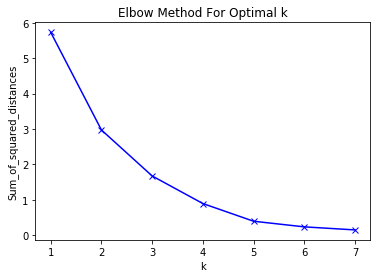

<h1 align=center> Exploring top venues around NYC's universities </h1>

### Business Problem

The idea from this project is to help who want to gain benefits from the trending venues around to the universities of the New York City such as student's services stores owners who want to open their stores near to places visible and known by providing a clear understanding of the trending places around the top universities and academies in New York City and clustering them based on their common characteristics and that will help them in making their decision.

### Interest

The targeted audience of this project are those who want to make a business targeting the students, such as students' services stores, coffee shops dedicated to the study and so on, and want to open their business in places known and visible by the students and obtain a competitive advantage.

### Data acquisition

<ul>
 <li> Firstly, I use data of the universities and academies in New York City that contain a lot of information about them such as their names, longitude, latitude, zip code and so on from <a href='https://hifld-geoplatform.opendata.arcgis.com/'>Homeland Infrastructure Foundation-Level Data (HIFLD)</a>, but from this dataset, I will need just the university name and latitude and longitude so, I will drop the other columns</li>
  <li>Secondly, I will use the Foursquare Website to extract the trending venues around the 30 from the universities and academies with the help of the previously modified dataset of New York universities</li>
    
</ul>

#### Importing the required libraries


```python
import pandas as pd # library for data analsysis
import requests # library to handle requests
import numpy as np # library to handle data in a vectorized manner
import random # library for random number generation

!conda install -c conda-forge geopy --yes 
from geopy.geocoders import Nominatim # module to convert an address into latitude and longitude values

# libraries for displaying images
from IPython.display import Image 
from IPython.core.display import HTML 
import matplotlib.pyplot as plt
import matplotlib.cm as cm
import matplotlib.colors as colors

# tranforming json file into a pandas dataframe library
from pandas.io.json import json_normalize

# for clustering
from sklearn.cluster import KMeans
!conda install -c conda-forge folium=0.5.0 --yes
import folium # plotting library

print('Folium installed')
print('Libraries imported.')
```

    Solving environment: done
    
    
    ==> WARNING: A newer version of conda exists. <==
      current version: 4.5.11
      latest version: 4.8.2
    
    Please update conda by running
    
        $ conda update -n base -c defaults conda
    
    
    
    # All requested packages already installed.
    
    Solving environment: done
    
    
    ==> WARNING: A newer version of conda exists. <==
      current version: 4.5.11
      latest version: 4.8.2
    
    Please update conda by running
    
        $ conda update -n base -c defaults conda
    
    
    
    # All requested packages already installed.
    
    Folium installed
    Libraries imported.


#### Importing and cleaning the universities data


```python
us_uni=pd.read_csv('Colleges_and_Universities.csv')
```


```python
NY_uni=pd.DataFrame(us_uni[us_uni["CITY"]=="NEW YORK"])
NY_uni.head()
```


<div>
<style scoped>
    .dataframe tbody tr th:only-of-type {
        vertical-align: middle;
    }

    .dataframe tbody tr th {
        vertical-align: top;
    }

    .dataframe thead th {
        text-align: right;
    }
</style>
<table border="1" class="dataframe">
  <thead>
    <tr style="text-align: right;">
      <th></th>
      <th>X</th>
      <th>Y</th>
      <th>OBJECTID</th>
      <th>IPEDSID</th>
      <th>NAME</th>
      <th>ADDRESS</th>
      <th>CITY</th>
      <th>STATE</th>
      <th>ZIP</th>
      <th>ZIP4</th>
      <th>...</th>
      <th>ALIAS</th>
      <th>SIZE_SET</th>
      <th>INST_SIZE</th>
      <th>PT_ENROLL</th>
      <th>FT_ENROLL</th>
      <th>TOT_ENROLL</th>
      <th>HOUSING</th>
      <th>DORM_CAP</th>
      <th>TOT_EMP</th>
      <th>SHELTER_ID</th>
    </tr>
  </thead>
  <tbody>
    <tr>
      <th>5</th>
      <td>-73.991271</td>
      <td>40.713812</td>
      <td>7006</td>
      <td>193070</td>
      <td>MESIVTHA TIFERETH JERUSALEM OF AMERICA</td>
      <td>145 E BROADWAY</td>
      <td>NEW YORK</td>
      <td>NY</td>
      <td>10002</td>
      <td>6301</td>
      <td>...</td>
      <td>NOT AVAILABLE</td>
      <td>6</td>
      <td>1</td>
      <td>-999</td>
      <td>69</td>
      <td>69</td>
      <td>1</td>
      <td>146</td>
      <td>12</td>
      <td>NOT AVAILABLE</td>
    </tr>
    <tr>
      <th>282</th>
      <td>-73.980278</td>
      <td>40.751893</td>
      <td>133</td>
      <td>447430</td>
      <td>CARSTEN INSTITUTE OF COSMETOLOGY</td>
      <td>290 MADISON AVENUE 5TH FLOOR</td>
      <td>NEW YORK</td>
      <td>NY</td>
      <td>10017</td>
      <td>NOT AVAILABLE</td>
      <td>...</td>
      <td>NOT AVAILABLE</td>
      <td>-2</td>
      <td>1</td>
      <td>53</td>
      <td>41</td>
      <td>94</td>
      <td>2</td>
      <td>-999</td>
      <td>14</td>
      <td>NOT AVAILABLE</td>
    </tr>
    <tr>
      <th>458</th>
      <td>-73.987638</td>
      <td>40.772309</td>
      <td>309</td>
      <td>188854</td>
      <td>AMERICAN MUSICAL AND DRAMATIC ACADEMY</td>
      <td>211 WEST 61ST STREET</td>
      <td>NEW YORK</td>
      <td>NY</td>
      <td>10023</td>
      <td>NOT AVAILABLE</td>
      <td>...</td>
      <td>NOT AVAILABLE</td>
      <td>11</td>
      <td>2</td>
      <td>-999</td>
      <td>1515</td>
      <td>1515</td>
      <td>1</td>
      <td>941</td>
      <td>447</td>
      <td>NOT AVAILABLE</td>
    </tr>
    <tr>
      <th>459</th>
      <td>-73.979434</td>
      <td>40.753993</td>
      <td>310</td>
      <td>189228</td>
      <td>BERKELEY COLLEGE-NEW YORK</td>
      <td>3 EAST 43 STREET</td>
      <td>NEW YORK</td>
      <td>NY</td>
      <td>10017</td>
      <td>NOT AVAILABLE</td>
      <td>...</td>
      <td>BERKELEY COLLEGE NYC CAMPUS | BERKELEY COLLEGE...</td>
      <td>12</td>
      <td>2</td>
      <td>876</td>
      <td>2759</td>
      <td>3635</td>
      <td>2</td>
      <td>-999</td>
      <td>520</td>
      <td>NOT AVAILABLE</td>
    </tr>
    <tr>
      <th>463</th>
      <td>-73.973595</td>
      <td>40.750855</td>
      <td>314</td>
      <td>190035</td>
      <td>CUNY SYSTEM OFFICE</td>
      <td>205 EAST 42ND STREET</td>
      <td>NEW YORK</td>
      <td>NY</td>
      <td>10017</td>
      <td>NOT AVAILABLE</td>
      <td>...</td>
      <td>CUNY CENTRAL OFFICE | CUNY CENTRAL | THE CITY ...</td>
      <td>-2</td>
      <td>-2</td>
      <td>-999</td>
      <td>-999</td>
      <td>-999</td>
      <td>-2</td>
      <td>-999</td>
      <td>1184</td>
      <td>NOT AVAILABLE</td>
    </tr>
  </tbody>
</table>
<p>5 rows × 45 columns</p>
</div>


```python
NY_uni.shape
```


    (86, 45)


```python
NY_uni.columns
```


    Index(['X', 'Y', 'OBJECTID', 'IPEDSID', 'NAME', 'ADDRESS', 'CITY', 'STATE',
           'ZIP', 'ZIP4', 'TELEPHONE', 'TYPE', 'STATUS', 'POPULATION', 'COUNTY',
           'COUNTYFIPS', 'COUNTRY', 'LATITUDE', 'LONGITUDE', 'NAICS_CODE',
           'NAICS_DESC', 'SOURCE', 'SOURCEDATE', 'VAL_METHOD', 'VAL_DATE',
           'WEBSITE', 'STFIPS', 'COFIPS', 'SECTOR', 'LEVEL_', 'HI_OFFER',
           'DEG_GRANT', 'LOCALE', 'CLOSE_DATE', 'MERGE_ID', 'ALIAS', 'SIZE_SET',
           'INST_SIZE', 'PT_ENROLL', 'FT_ENROLL', 'TOT_ENROLL', 'HOUSING',
           'DORM_CAP', 'TOT_EMP', 'SHELTER_ID'],
          dtype='object')


```python
NY_uni.drop(columns=['X','OBJECTID', 'IPEDSID','Y','ADDRESS', 'CITY', 'STATE',
       'ZIP', 'ZIP4', 'TELEPHONE', 'TYPE', 'STATUS', 'POPULATION', 'COUNTY',
       'COUNTYFIPS', 'COUNTRY','NAICS_CODE',
       'NAICS_DESC', 'SOURCE', 'SOURCEDATE', 'VAL_METHOD', 'VAL_DATE',
       'WEBSITE', 'STFIPS', 'COFIPS', 'SECTOR', 'LEVEL_', 'HI_OFFER',
       'DEG_GRANT', 'LOCALE', 'CLOSE_DATE', 'MERGE_ID', 'ALIAS', 'SIZE_SET',
       'INST_SIZE', 'PT_ENROLL', 'FT_ENROLL', 'TOT_ENROLL', 'HOUSING',
       'DORM_CAP', 'TOT_EMP', 'SHELTER_ID'],inplace=True)
NY_uni.head()
```


<div>
<style scoped>
    .dataframe tbody tr th:only-of-type {
        vertical-align: middle;
    }

    .dataframe tbody tr th {
        vertical-align: top;
    }

    .dataframe thead th {
        text-align: right;
    }
</style>
<table border="1" class="dataframe">
  <thead>
    <tr style="text-align: right;">
      <th></th>
      <th>NAME</th>
      <th>LATITUDE</th>
      <th>LONGITUDE</th>
    </tr>
  </thead>
  <tbody>
    <tr>
      <th>5</th>
      <td>MESIVTHA TIFERETH JERUSALEM OF AMERICA</td>
      <td>40.713812</td>
      <td>-73.991271</td>
    </tr>
    <tr>
      <th>282</th>
      <td>CARSTEN INSTITUTE OF COSMETOLOGY</td>
      <td>40.751893</td>
      <td>-73.980278</td>
    </tr>
    <tr>
      <th>458</th>
      <td>AMERICAN MUSICAL AND DRAMATIC ACADEMY</td>
      <td>40.772309</td>
      <td>-73.987638</td>
    </tr>
    <tr>
      <th>459</th>
      <td>BERKELEY COLLEGE-NEW YORK</td>
      <td>40.753993</td>
      <td>-73.979434</td>
    </tr>
    <tr>
      <th>463</th>
      <td>CUNY SYSTEM OFFICE</td>
      <td>40.750855</td>
      <td>-73.973595</td>
    </tr>
  </tbody>
</table>
</div>


```python
NY_uni.reset_index(drop=True,inplace=True)
NY_uni.head(57)
```


<div>
<style scoped>
    .dataframe tbody tr th:only-of-type {
        vertical-align: middle;
    }

    .dataframe tbody tr th {
        vertical-align: top;
    }

    .dataframe thead th {
        text-align: right;
    }
</style>
<table border="1" class="dataframe">
  <thead>
    <tr style="text-align: right;">
      <th></th>
      <th>NAME</th>
      <th>LATITUDE</th>
      <th>LONGITUDE</th>
    </tr>
  </thead>
  <tbody>
    <tr>
      <th>0</th>
      <td>MESIVTHA TIFERETH JERUSALEM OF AMERICA</td>
      <td>40.713812</td>
      <td>-73.991271</td>
    </tr>
    <tr>
      <th>1</th>
      <td>CARSTEN INSTITUTE OF COSMETOLOGY</td>
      <td>40.751893</td>
      <td>-73.980278</td>
    </tr>
    <tr>
      <th>2</th>
      <td>AMERICAN MUSICAL AND DRAMATIC ACADEMY</td>
      <td>40.772309</td>
      <td>-73.987638</td>
    </tr>
    <tr>
      <th>3</th>
      <td>BERKELEY COLLEGE-NEW YORK</td>
      <td>40.753993</td>
      <td>-73.979434</td>
    </tr>
    <tr>
      <th>4</th>
      <td>CUNY SYSTEM OFFICE</td>
      <td>40.750855</td>
      <td>-73.973595</td>
    </tr>
    <tr>
      <th>5</th>
      <td>METROPOLITAN COLLEGE OF NEW YORK</td>
      <td>40.708592</td>
      <td>-74.014677</td>
    </tr>
    <tr>
      <th>6</th>
      <td>HELENE FULD COLLEGE OF NURSING</td>
      <td>40.802476</td>
      <td>-73.943325</td>
    </tr>
    <tr>
      <th>7</th>
      <td>LIM COLLEGE</td>
      <td>40.759786</td>
      <td>-73.975317</td>
    </tr>
    <tr>
      <th>8</th>
      <td>MARYMOUNT MANHATTAN COLLEGE</td>
      <td>40.768723</td>
      <td>-73.959790</td>
    </tr>
    <tr>
      <th>9</th>
      <td>THE NEW SCHOOL</td>
      <td>40.735498</td>
      <td>-73.997158</td>
    </tr>
    <tr>
      <th>10</th>
      <td>TOURO COLLEGE</td>
      <td>40.753362</td>
      <td>-73.989488</td>
    </tr>
    <tr>
      <th>11</th>
      <td>PACIFIC COLLEGE OF ORIENTAL MEDICINE-NEW YORK</td>
      <td>40.708899</td>
      <td>-74.006629</td>
    </tr>
    <tr>
      <th>12</th>
      <td>THE KING'S COLLEGE</td>
      <td>40.706558</td>
      <td>-74.012296</td>
    </tr>
    <tr>
      <th>13</th>
      <td>MANHATTAN INSTITUTE</td>
      <td>40.754262</td>
      <td>-73.977344</td>
    </tr>
    <tr>
      <th>14</th>
      <td>INSTITUTE OF CULINARY EDUCATION</td>
      <td>40.712988</td>
      <td>-74.015157</td>
    </tr>
    <tr>
      <th>15</th>
      <td>FOCUS PERSONAL TRAINING INSTITUTE</td>
      <td>40.745880</td>
      <td>-73.991781</td>
    </tr>
    <tr>
      <th>16</th>
      <td>NEW YORK LAW SCHOOL</td>
      <td>40.717762</td>
      <td>-74.006894</td>
    </tr>
    <tr>
      <th>17</th>
      <td>THE ART INSTITUTE OF NEW YORK CITY</td>
      <td>40.755042</td>
      <td>-73.989177</td>
    </tr>
    <tr>
      <th>18</th>
      <td>NEW AGE TRAINING</td>
      <td>40.748278</td>
      <td>-73.991510</td>
    </tr>
    <tr>
      <th>19</th>
      <td>THE JUILLIARD SCHOOL</td>
      <td>40.773725</td>
      <td>-73.982913</td>
    </tr>
    <tr>
      <th>20</th>
      <td>THE AILEY SCHOOL</td>
      <td>40.766921</td>
      <td>-73.986891</td>
    </tr>
    <tr>
      <th>21</th>
      <td>CUNY BERNARD M BARUCH COLLEGE</td>
      <td>40.740238</td>
      <td>-73.983417</td>
    </tr>
    <tr>
      <th>22</th>
      <td>MANDL SCHOOL-THE COLLEGE OF ALLIED HEALTH</td>
      <td>40.764351</td>
      <td>-73.983749</td>
    </tr>
    <tr>
      <th>23</th>
      <td>EMPIRE BEAUTY SCHOOL-MANHATTAN</td>
      <td>40.748938</td>
      <td>-73.986453</td>
    </tr>
    <tr>
      <th>24</th>
      <td>TEACHERS COLLEGE AT COLUMBIA UNIVERSITY</td>
      <td>40.810311</td>
      <td>-73.960399</td>
    </tr>
    <tr>
      <th>25</th>
      <td>PACE UNIVERSITY-NEW YORK</td>
      <td>40.711710</td>
      <td>-74.004874</td>
    </tr>
    <tr>
      <th>26</th>
      <td>YESHIVA UNIVERSITY</td>
      <td>40.850800</td>
      <td>-73.928541</td>
    </tr>
    <tr>
      <th>27</th>
      <td>SOTHEBY'S INSTITUTE OF ART-NY</td>
      <td>40.756399</td>
      <td>-73.972588</td>
    </tr>
    <tr>
      <th>28</th>
      <td>AMERICAN ACADEMY OF PERSONAL TRAINING</td>
      <td>40.722342</td>
      <td>-74.002465</td>
    </tr>
    <tr>
      <th>29</th>
      <td>ARROJO COSMETOLOGY SCHOOL</td>
      <td>40.727565</td>
      <td>-74.005162</td>
    </tr>
    <tr>
      <th>30</th>
      <td>CHRISTINE VALMY INTERNATIONAL SCHOOL FOR ESTHE...</td>
      <td>40.744988</td>
      <td>-73.986557</td>
    </tr>
    <tr>
      <th>31</th>
      <td>RELAY GRADUATE SCHOOL OF EDUCATION</td>
      <td>40.740509</td>
      <td>-73.993411</td>
    </tr>
    <tr>
      <th>32</th>
      <td>DEVRY COLLEGE OF NEW YORK</td>
      <td>40.747654</td>
      <td>-73.983468</td>
    </tr>
    <tr>
      <th>33</th>
      <td>CULINARY TECH CENTER</td>
      <td>40.754175</td>
      <td>-73.998972</td>
    </tr>
    <tr>
      <th>34</th>
      <td>MILDRED ELLEY-NEW YORK CAMPUS</td>
      <td>40.705781</td>
      <td>-74.014004</td>
    </tr>
    <tr>
      <th>35</th>
      <td>ATELIER ESTHETIQUE INSTITUTE OF ESTHETICS</td>
      <td>40.742987</td>
      <td>-73.984860</td>
    </tr>
    <tr>
      <th>36</th>
      <td>CUNY HUNTER COLLEGE</td>
      <td>40.768669</td>
      <td>-73.964795</td>
    </tr>
    <tr>
      <th>37</th>
      <td>TRI-STATE COLLEGE OF ACUPUNCTURE</td>
      <td>40.739862</td>
      <td>-74.002085</td>
    </tr>
    <tr>
      <th>38</th>
      <td>AMERICAN ACADEMY MCALLISTER INSTITUTE OF FUNER...</td>
      <td>40.769031</td>
      <td>-73.993782</td>
    </tr>
    <tr>
      <th>39</th>
      <td>GEMOLOGICAL INSTITUTE OF AMERICA-NEW YORK</td>
      <td>40.751351</td>
      <td>-73.980647</td>
    </tr>
    <tr>
      <th>40</th>
      <td>NEW YORK UNIVERSITY</td>
      <td>40.729452</td>
      <td>-73.997264</td>
    </tr>
    <tr>
      <th>41</th>
      <td>SWEDISH INSTITUTE A COLLEGE OF HEALTH SCIENCES</td>
      <td>40.746384</td>
      <td>-73.995670</td>
    </tr>
    <tr>
      <th>42</th>
      <td>NEW YORK ACADEMY OF ART</td>
      <td>40.718388</td>
      <td>-74.006019</td>
    </tr>
    <tr>
      <th>43</th>
      <td>JOFFREY BALLET SCHOOL</td>
      <td>40.734545</td>
      <td>-73.998566</td>
    </tr>
    <tr>
      <th>44</th>
      <td>BANK STREET COLLEGE OF EDUCATION</td>
      <td>40.805604</td>
      <td>-73.966643</td>
    </tr>
    <tr>
      <th>45</th>
      <td>COOPER UNION FOR THE ADVANCEMENT OF SCIENCE AN...</td>
      <td>40.729380</td>
      <td>-73.990516</td>
    </tr>
    <tr>
      <th>46</th>
      <td>CUNY JOHN JAY COLLEGE OF CRIMINAL JUSTICE</td>
      <td>40.770346</td>
      <td>-73.988403</td>
    </tr>
    <tr>
      <th>47</th>
      <td>THE GENERAL THEOLOGICAL SEMINARY</td>
      <td>40.745558</td>
      <td>-74.003767</td>
    </tr>
    <tr>
      <th>48</th>
      <td>JEWISH THEOLOGICAL SEMINARY OF AMERICA</td>
      <td>40.811959</td>
      <td>-73.960287</td>
    </tr>
    <tr>
      <th>49</th>
      <td>NEW YORK CONSERVATORY FOR DRAMATIC ARTS</td>
      <td>40.740148</td>
      <td>-73.993388</td>
    </tr>
    <tr>
      <th>50</th>
      <td>LIA SCHORR INSTITUTE OF COSMETIC SKIN CARE TRA...</td>
      <td>40.760598</td>
      <td>-73.969644</td>
    </tr>
    <tr>
      <th>51</th>
      <td>COLUMBIA UNIVERSITY IN THE CITY OF NEW YORK</td>
      <td>40.808286</td>
      <td>-73.961885</td>
    </tr>
    <tr>
      <th>52</th>
      <td>BARNARD COLLEGE</td>
      <td>40.809137</td>
      <td>-73.964027</td>
    </tr>
    <tr>
      <th>53</th>
      <td>CIRCLE IN THE SQUARE THEATRE SCHOOL</td>
      <td>40.762059</td>
      <td>-73.984607</td>
    </tr>
    <tr>
      <th>54</th>
      <td>CUNY GRADUATE SCHOOL AND UNIVERSITY CENTER</td>
      <td>40.748503</td>
      <td>-73.983575</td>
    </tr>
    <tr>
      <th>55</th>
      <td>FASHION INSTITUTE OF TECHNOLOGY</td>
      <td>40.747310</td>
      <td>-73.994781</td>
    </tr>
    <tr>
      <th>56</th>
      <td>THE INTERNATIONAL CULINARY CENTER</td>
      <td>40.720817</td>
      <td>-74.000090</td>
    </tr>
  </tbody>
</table>
</div>


```python
CLIENT_ID = '####################################################' # Foursquare ID
CLIENT_SECRET = '##########################################' # Foursquare Secret
VERSION = '20180604'
LIMIT = 50
RADIUS= 2000
print('Your credentails:')
print('CLIENT_ID: ' + CLIENT_ID)
print('CLIENT_SECRET:' + CLIENT_SECRET)
```

    Your credentails:
    CLIENT_ID: ####################################################
    CLIENT_SECRET:##########################################


#### Creating a map of NYC's universities


```python
address = '102 North End Ave, New York, NY'

geolocator = Nominatim(user_agent="foursquare_agent")
location = geolocator.geocode(address)
latitude = location.latitude
longitude = location.longitude
print(latitude, longitude)
```

    40.7149555 -74.0153365


```python
# create map of New York using latitude and longitude values
map_newyork = folium.Map(location=[latitude, longitude], zoom_start=10)

# add markers to map
for lat, lng, name in zip(NY_uni['LATITUDE'], NY_uni['LONGITUDE'], NY_uni['NAME']):
    label = '{}'.format(name)
    label = folium.Popup(label, parse_html=True)
    folium.CircleMarker(
        [lat, lng],
        radius=5,
        popup=label,
        color='blue',
        fill=True,
        fill_color='#3186cc',
        fill_opacity=0.7,
        parse_html=False).add_to(map_newyork)  
    
map_newyork
```


<div style="width:100%;"><div style="position:relative;width:100%;height:0;padding-bottom:60%;"><iframe src="data:text/html;charset=utf-8;base64,PCFET0NUWVBFIGh0bWw+CjxoZWFkPiAgICAKICAgIDxtZXRhIGh0dHAtZXF1aXY9ImNvbnRlbnQtdHlwZSIgY29udGVudD0idGV4dC9odG1sOyBjaGFyc2V0PVVURi04IiAvPgogICAgPHNjcmlwdD5MX1BSRUZFUl9DQU5WQVMgPSBmYWxzZTsgTF9OT19UT1VDSCA9IGZhbHNlOyBMX0RJU0FCTEVfM0QgPSBmYWxzZTs8L3NjcmlwdD4KICAgIDxzY3JpcHQgc3JjPSJodHRwczovL2Nkbi5qc2RlbGl2ci5uZXQvbnBtL2xlYWZsZXRAMS4yLjAvZGlzdC9sZWFmbGV0LmpzIj48L3NjcmlwdD4KICAgIDxzY3JpcHQgc3JjPSJodHRwczovL2FqYXguZ29vZ2xlYXBpcy5jb20vYWpheC9saWJzL2pxdWVyeS8xLjExLjEvanF1ZXJ5Lm1pbi5qcyI+PC9zY3JpcHQ+CiAgICA8c2NyaXB0IHNyYz0iaHR0cHM6Ly9tYXhjZG4uYm9vdHN0cmFwY2RuLmNvbS9ib290c3RyYXAvMy4yLjAvanMvYm9vdHN0cmFwLm1pbi5qcyI+PC9zY3JpcHQ+CiAgICA8c2NyaXB0IHNyYz0iaHR0cHM6Ly9jZG5qcy5jbG91ZGZsYXJlLmNvbS9hamF4L2xpYnMvTGVhZmxldC5hd2Vzb21lLW1hcmtlcnMvMi4wLjIvbGVhZmxldC5hd2Vzb21lLW1hcmtlcnMuanMiPjwvc2NyaXB0PgogICAgPGxpbmsgcmVsPSJzdHlsZXNoZWV0IiBocmVmPSJodHRwczovL2Nkbi5qc2RlbGl2ci5uZXQvbnBtL2xlYWZsZXRAMS4yLjAvZGlzdC9sZWFmbGV0LmNzcyIvPgogICAgPGxpbmsgcmVsPSJzdHlsZXNoZWV0IiBocmVmPSJodHRwczovL21heGNkbi5ib290c3RyYXBjZG4uY29tL2Jvb3RzdHJhcC8zLjIuMC9jc3MvYm9vdHN0cmFwLm1pbi5jc3MiLz4KICAgIDxsaW5rIHJlbD0ic3R5bGVzaGVldCIgaHJlZj0iaHR0cHM6Ly9tYXhjZG4uYm9vdHN0cmFwY2RuLmNvbS9ib290c3RyYXAvMy4yLjAvY3NzL2Jvb3RzdHJhcC10aGVtZS5taW4uY3NzIi8+CiAgICA8bGluayByZWw9InN0eWxlc2hlZXQiIGhyZWY9Imh0dHBzOi8vbWF4Y2RuLmJvb3RzdHJhcGNkbi5jb20vZm9udC1hd2Vzb21lLzQuNi4zL2Nzcy9mb250LWF3ZXNvbWUubWluLmNzcyIvPgogICAgPGxpbmsgcmVsPSJzdHlsZXNoZWV0IiBocmVmPSJodHRwczovL2NkbmpzLmNsb3VkZmxhcmUuY29tL2FqYXgvbGlicy9MZWFmbGV0LmF3ZXNvbWUtbWFya2Vycy8yLjAuMi9sZWFmbGV0LmF3ZXNvbWUtbWFya2Vycy5jc3MiLz4KICAgIDxsaW5rIHJlbD0ic3R5bGVzaGVldCIgaHJlZj0iaHR0cHM6Ly9yYXdnaXQuY29tL3B5dGhvbi12aXN1YWxpemF0aW9uL2ZvbGl1bS9tYXN0ZXIvZm9saXVtL3RlbXBsYXRlcy9sZWFmbGV0LmF3ZXNvbWUucm90YXRlLmNzcyIvPgogICAgPHN0eWxlPmh0bWwsIGJvZHkge3dpZHRoOiAxMDAlO2hlaWdodDogMTAwJTttYXJnaW46IDA7cGFkZGluZzogMDt9PC9zdHlsZT4KICAgIDxzdHlsZT4jbWFwIHtwb3NpdGlvbjphYnNvbHV0ZTt0b3A6MDtib3R0b206MDtyaWdodDowO2xlZnQ6MDt9PC9zdHlsZT4KICAgIAogICAgICAgICAgICA8c3R5bGU+ICNtYXBfN2Y0YjY1ODE5MjI3NDA2ZmE0YTYyZTgwMGMxOGJmNTkgewogICAgICAgICAgICAgICAgcG9zaXRpb24gOiByZWxhdGl2ZTsKICAgICAgICAgICAgICAgIHdpZHRoIDogMTAwLjAlOwogICAgICAgICAgICAgICAgaGVpZ2h0OiAxMDAuMCU7CiAgICAgICAgICAgICAgICBsZWZ0OiAwLjAlOwogICAgICAgICAgICAgICAgdG9wOiAwLjAlOwogICAgICAgICAgICAgICAgfQogICAgICAgICAgICA8L3N0eWxlPgogICAgICAgIAo8L2hlYWQ+Cjxib2R5PiAgICAKICAgIAogICAgICAgICAgICA8ZGl2IGNsYXNzPSJmb2xpdW0tbWFwIiBpZD0ibWFwXzdmNGI2NTgxOTIyNzQwNmZhNGE2MmU4MDBjMThiZjU5IiA+PC9kaXY+CiAgICAgICAgCjwvYm9keT4KPHNjcmlwdD4gICAgCiAgICAKCiAgICAgICAgICAgIAogICAgICAgICAgICAgICAgdmFyIGJvdW5kcyA9IG51bGw7CiAgICAgICAgICAgIAoKICAgICAgICAgICAgdmFyIG1hcF83ZjRiNjU4MTkyMjc0MDZmYTRhNjJlODAwYzE4YmY1OSA9IEwubWFwKAogICAgICAgICAgICAgICAgICAgICAgICAgICAgICAgICAgJ21hcF83ZjRiNjU4MTkyMjc0MDZmYTRhNjJlODAwYzE4YmY1OScsCiAgICAgICAgICAgICAgICAgICAgICAgICAgICAgICAgICB7Y2VudGVyOiBbNDAuNzE0OTU1NSwtNzQuMDE1MzM2NV0sCiAgICAgICAgICAgICAgICAgICAgICAgICAgICAgICAgICB6b29tOiAxMCwKICAgICAgICAgICAgICAgICAgICAgICAgICAgICAgICAgIG1heEJvdW5kczogYm91bmRzLAogICAgICAgICAgICAgICAgICAgICAgICAgICAgICAgICAgbGF5ZXJzOiBbXSwKICAgICAgICAgICAgICAgICAgICAgICAgICAgICAgICAgIHdvcmxkQ29weUp1bXA6IGZhbHNlLAogICAgICAgICAgICAgICAgICAgICAgICAgICAgICAgICAgY3JzOiBMLkNSUy5FUFNHMzg1NwogICAgICAgICAgICAgICAgICAgICAgICAgICAgICAgICB9KTsKICAgICAgICAgICAgCiAgICAgICAgCiAgICAKICAgICAgICAgICAgdmFyIHRpbGVfbGF5ZXJfNmY3NzYzYWFkZTk3NDA5ODgyODkzMTBiYjU2YjBmMzkgPSBMLnRpbGVMYXllcigKICAgICAgICAgICAgICAgICdodHRwczovL3tzfS50aWxlLm9wZW5zdHJlZXRtYXAub3JnL3t6fS97eH0ve3l9LnBuZycsCiAgICAgICAgICAgICAgICB7CiAgImF0dHJpYnV0aW9uIjogbnVsbCwKICAiZGV0ZWN0UmV0aW5hIjogZmFsc2UsCiAgIm1heFpvb20iOiAxOCwKICAibWluWm9vbSI6IDEsCiAgIm5vV3JhcCI6IGZhbHNlLAogICJzdWJkb21haW5zIjogImFiYyIKfQogICAgICAgICAgICAgICAgKS5hZGRUbyhtYXBfN2Y0YjY1ODE5MjI3NDA2ZmE0YTYyZTgwMGMxOGJmNTkpOwogICAgICAgIAogICAgCiAgICAgICAgICAgIHZhciBjaXJjbGVfbWFya2VyXzYyOTgzZWU3YmMyNjQxZDM4NjQ0OTM3ODRkOTA5OTZlID0gTC5jaXJjbGVNYXJrZXIoCiAgICAgICAgICAgICAgICBbNDAuNzEzODEyMzQ0MDAwMTA0LC03My45OTEyNzA4NzFdLAogICAgICAgICAgICAgICAgewogICJidWJibGluZ01vdXNlRXZlbnRzIjogdHJ1ZSwKICAiY29sb3IiOiAiYmx1ZSIsCiAgImRhc2hBcnJheSI6IG51bGwsCiAgImRhc2hPZmZzZXQiOiBudWxsLAogICJmaWxsIjogdHJ1ZSwKICAiZmlsbENvbG9yIjogIiMzMTg2Y2MiLAogICJmaWxsT3BhY2l0eSI6IDAuNywKICAiZmlsbFJ1bGUiOiAiZXZlbm9kZCIsCiAgImxpbmVDYXAiOiAicm91bmQiLAogICJsaW5lSm9pbiI6ICJyb3VuZCIsCiAgIm9wYWNpdHkiOiAxLjAsCiAgInJhZGl1cyI6IDUsCiAgInN0cm9rZSI6IHRydWUsCiAgIndlaWdodCI6IDMKfQogICAgICAgICAgICAgICAgKS5hZGRUbyhtYXBfN2Y0YjY1ODE5MjI3NDA2ZmE0YTYyZTgwMGMxOGJmNTkpOwogICAgICAgICAgICAKICAgIAogICAgICAgICAgICB2YXIgcG9wdXBfZGFmZTc0MTM3ZGU4NDk3OTg1ODIzMjkwMDAyZTEzZjYgPSBMLnBvcHVwKHttYXhXaWR0aDogJzMwMCd9KTsKCiAgICAgICAgICAgIAogICAgICAgICAgICAgICAgdmFyIGh0bWxfYmU5MmIxOTVlMjg5NGFjMDg2Yzk3YWU2YjQ3MTIzMjIgPSAkKCc8ZGl2IGlkPSJodG1sX2JlOTJiMTk1ZTI4OTRhYzA4NmM5N2FlNmI0NzEyMzIyIiBzdHlsZT0id2lkdGg6IDEwMC4wJTsgaGVpZ2h0OiAxMDAuMCU7Ij5NRVNJVlRIQSBUSUZFUkVUSCBKRVJVU0FMRU0gT0YgQU1FUklDQTwvZGl2PicpWzBdOwogICAgICAgICAgICAgICAgcG9wdXBfZGFmZTc0MTM3ZGU4NDk3OTg1ODIzMjkwMDAyZTEzZjYuc2V0Q29udGVudChodG1sX2JlOTJiMTk1ZTI4OTRhYzA4NmM5N2FlNmI0NzEyMzIyKTsKICAgICAgICAgICAgCgogICAgICAgICAgICBjaXJjbGVfbWFya2VyXzYyOTgzZWU3YmMyNjQxZDM4NjQ0OTM3ODRkOTA5OTZlLmJpbmRQb3B1cChwb3B1cF9kYWZlNzQxMzdkZTg0OTc5ODU4MjMyOTAwMDJlMTNmNik7CgogICAgICAgICAgICAKICAgICAgICAKICAgIAogICAgICAgICAgICB2YXIgY2lyY2xlX21hcmtlcl9kZDA4ODVlMGY4NGM0NDhjYjJiOWFmYzcxOGFiNzJlYyA9IEwuY2lyY2xlTWFya2VyKAogICAgICAgICAgICAgICAgWzQwLjc1MTg5MzQzNTk5OTk5NiwtNzMuOTgwMjc4MThdLAogICAgICAgICAgICAgICAgewogICJidWJibGluZ01vdXNlRXZlbnRzIjogdHJ1ZSwKICAiY29sb3IiOiAiYmx1ZSIsCiAgImRhc2hBcnJheSI6IG51bGwsCiAgImRhc2hPZmZzZXQiOiBudWxsLAogICJmaWxsIjogdHJ1ZSwKICAiZmlsbENvbG9yIjogIiMzMTg2Y2MiLAogICJmaWxsT3BhY2l0eSI6IDAuNywKICAiZmlsbFJ1bGUiOiAiZXZlbm9kZCIsCiAgImxpbmVDYXAiOiAicm91bmQiLAogICJsaW5lSm9pbiI6ICJyb3VuZCIsCiAgIm9wYWNpdHkiOiAxLjAsCiAgInJhZGl1cyI6IDUsCiAgInN0cm9rZSI6IHRydWUsCiAgIndlaWdodCI6IDMKfQogICAgICAgICAgICAgICAgKS5hZGRUbyhtYXBfN2Y0YjY1ODE5MjI3NDA2ZmE0YTYyZTgwMGMxOGJmNTkpOwogICAgICAgICAgICAKICAgIAogICAgICAgICAgICB2YXIgcG9wdXBfYmFhZmU5Y2NjNzQ3NDVlOGIwYjI4MThjOTMyODgyYTAgPSBMLnBvcHVwKHttYXhXaWR0aDogJzMwMCd9KTsKCiAgICAgICAgICAgIAogICAgICAgICAgICAgICAgdmFyIGh0bWxfOGRjZjY0ZjQ2YjJkNGM4Nzg5NmVlNmFkYmZhMmIwZjIgPSAkKCc8ZGl2IGlkPSJodG1sXzhkY2Y2NGY0NmIyZDRjODc4OTZlZTZhZGJmYTJiMGYyIiBzdHlsZT0id2lkdGg6IDEwMC4wJTsgaGVpZ2h0OiAxMDAuMCU7Ij5DQVJTVEVOIElOU1RJVFVURSBPRiBDT1NNRVRPTE9HWTwvZGl2PicpWzBdOwogICAgICAgICAgICAgICAgcG9wdXBfYmFhZmU5Y2NjNzQ3NDVlOGIwYjI4MThjOTMyODgyYTAuc2V0Q29udGVudChodG1sXzhkY2Y2NGY0NmIyZDRjODc4OTZlZTZhZGJmYTJiMGYyKTsKICAgICAgICAgICAgCgogICAgICAgICAgICBjaXJjbGVfbWFya2VyX2RkMDg4NWUwZjg0YzQ0OGNiMmI5YWZjNzE4YWI3MmVjLmJpbmRQb3B1cChwb3B1cF9iYWFmZTljY2M3NDc0NWU4YjBiMjgxOGM5MzI4ODJhMCk7CgogICAgICAgICAgICAKICAgICAgICAKICAgIAogICAgICAgICAgICB2YXIgY2lyY2xlX21hcmtlcl8xNTU4NzA4M2Y2YjE0ZjgyOTEwNjVhZjg5MzEzMTVhOSA9IEwuY2lyY2xlTWFya2VyKAogICAgICAgICAgICAgICAgWzQwLjc3MjMwOTI3MzAwMDEwNCwtNzMuOTg3NjM4MTM0XSwKICAgICAgICAgICAgICAgIHsKICAiYnViYmxpbmdNb3VzZUV2ZW50cyI6IHRydWUsCiAgImNvbG9yIjogImJsdWUiLAogICJkYXNoQXJyYXkiOiBudWxsLAogICJkYXNoT2Zmc2V0IjogbnVsbCwKICAiZmlsbCI6IHRydWUsCiAgImZpbGxDb2xvciI6ICIjMzE4NmNjIiwKICAiZmlsbE9wYWNpdHkiOiAwLjcsCiAgImZpbGxSdWxlIjogImV2ZW5vZGQiLAogICJsaW5lQ2FwIjogInJvdW5kIiwKICAibGluZUpvaW4iOiAicm91bmQiLAogICJvcGFjaXR5IjogMS4wLAogICJyYWRpdXMiOiA1LAogICJzdHJva2UiOiB0cnVlLAogICJ3ZWlnaHQiOiAzCn0KICAgICAgICAgICAgICAgICkuYWRkVG8obWFwXzdmNGI2NTgxOTIyNzQwNmZhNGE2MmU4MDBjMThiZjU5KTsKICAgICAgICAgICAgCiAgICAKICAgICAgICAgICAgdmFyIHBvcHVwXzUyZjdmOTJmNWM5MTRjYjU5ZDU2NTNhYTNiM2ZkM2FhID0gTC5wb3B1cCh7bWF4V2lkdGg6ICczMDAnfSk7CgogICAgICAgICAgICAKICAgICAgICAgICAgICAgIHZhciBodG1sXzRiNDQzMjZjZDljMDQ1OGQ5ZmIyNDM3NGM4NDViOTNhID0gJCgnPGRpdiBpZD0iaHRtbF80YjQ0MzI2Y2Q5YzA0NThkOWZiMjQzNzRjODQ1YjkzYSIgc3R5bGU9IndpZHRoOiAxMDAuMCU7IGhlaWdodDogMTAwLjAlOyI+QU1FUklDQU4gTVVTSUNBTCBBTkQgRFJBTUFUSUMgQUNBREVNWTwvZGl2PicpWzBdOwogICAgICAgICAgICAgICAgcG9wdXBfNTJmN2Y5MmY1YzkxNGNiNTlkNTY1M2FhM2IzZmQzYWEuc2V0Q29udGVudChodG1sXzRiNDQzMjZjZDljMDQ1OGQ5ZmIyNDM3NGM4NDViOTNhKTsKICAgICAgICAgICAgCgogICAgICAgICAgICBjaXJjbGVfbWFya2VyXzE1NTg3MDgzZjZiMTRmODI5MTA2NWFmODkzMTMxNWE5LmJpbmRQb3B1cChwb3B1cF81MmY3ZjkyZjVjOTE0Y2I1OWQ1NjUzYWEzYjNmZDNhYSk7CgogICAgICAgICAgICAKICAgICAgICAKICAgIAogICAgICAgICAgICB2YXIgY2lyY2xlX21hcmtlcl9hYjdjNGE1M2UzZjI0OWFmYjc1ZTFlMWJjMDBiMDk2YSA9IEwuY2lyY2xlTWFya2VyKAogICAgICAgICAgICAgICAgWzQwLjc1Mzk5MjkyLC03My45Nzk0MzQxMjVdLAogICAgICAgICAgICAgICAgewogICJidWJibGluZ01vdXNlRXZlbnRzIjogdHJ1ZSwKICAiY29sb3IiOiAiYmx1ZSIsCiAgImRhc2hBcnJheSI6IG51bGwsCiAgImRhc2hPZmZzZXQiOiBudWxsLAogICJmaWxsIjogdHJ1ZSwKICAiZmlsbENvbG9yIjogIiMzMTg2Y2MiLAogICJmaWxsT3BhY2l0eSI6IDAuNywKICAiZmlsbFJ1bGUiOiAiZXZlbm9kZCIsCiAgImxpbmVDYXAiOiAicm91bmQiLAogICJsaW5lSm9pbiI6ICJyb3VuZCIsCiAgIm9wYWNpdHkiOiAxLjAsCiAgInJhZGl1cyI6IDUsCiAgInN0cm9rZSI6IHRydWUsCiAgIndlaWdodCI6IDMKfQogICAgICAgICAgICAgICAgKS5hZGRUbyhtYXBfN2Y0YjY1ODE5MjI3NDA2ZmE0YTYyZTgwMGMxOGJmNTkpOwogICAgICAgICAgICAKICAgIAogICAgICAgICAgICB2YXIgcG9wdXBfNWQzNTI2MWYwYWZmNGYzMTliOWMwYWM4YzAxM2ZkZWYgPSBMLnBvcHVwKHttYXhXaWR0aDogJzMwMCd9KTsKCiAgICAgICAgICAgIAogICAgICAgICAgICAgICAgdmFyIGh0bWxfMjUxMzNhMGVhMTUzNGFiMmEwNjhjODBjMmI2OGQ1ZjAgPSAkKCc8ZGl2IGlkPSJodG1sXzI1MTMzYTBlYTE1MzRhYjJhMDY4YzgwYzJiNjhkNWYwIiBzdHlsZT0id2lkdGg6IDEwMC4wJTsgaGVpZ2h0OiAxMDAuMCU7Ij5CRVJLRUxFWSBDT0xMRUdFLU5FVyBZT1JLPC9kaXY+JylbMF07CiAgICAgICAgICAgICAgICBwb3B1cF81ZDM1MjYxZjBhZmY0ZjMxOWI5YzBhYzhjMDEzZmRlZi5zZXRDb250ZW50KGh0bWxfMjUxMzNhMGVhMTUzNGFiMmEwNjhjODBjMmI2OGQ1ZjApOwogICAgICAgICAgICAKCiAgICAgICAgICAgIGNpcmNsZV9tYXJrZXJfYWI3YzRhNTNlM2YyNDlhZmI3NWUxZTFiYzAwYjA5NmEuYmluZFBvcHVwKHBvcHVwXzVkMzUyNjFmMGFmZjRmMzE5YjljMGFjOGMwMTNmZGVmKTsKCiAgICAgICAgICAgIAogICAgICAgIAogICAgCiAgICAgICAgICAgIHZhciBjaXJjbGVfbWFya2VyXzhkMTgxNzJlMDU2NDRiZmU4NDUzZjlkMGY4OGEwNTRmID0gTC5jaXJjbGVNYXJrZXIoCiAgICAgICAgICAgICAgICBbNDAuNzUwODU1MDAwMDAwMSwtNzMuOTczNTk0OTk5OTk5OTldLAogICAgICAgICAgICAgICAgewogICJidWJibGluZ01vdXNlRXZlbnRzIjogdHJ1ZSwKICAiY29sb3IiOiAiYmx1ZSIsCiAgImRhc2hBcnJheSI6IG51bGwsCiAgImRhc2hPZmZzZXQiOiBudWxsLAogICJmaWxsIjogdHJ1ZSwKICAiZmlsbENvbG9yIjogIiMzMTg2Y2MiLAogICJmaWxsT3BhY2l0eSI6IDAuNywKICAiZmlsbFJ1bGUiOiAiZXZlbm9kZCIsCiAgImxpbmVDYXAiOiAicm91bmQiLAogICJsaW5lSm9pbiI6ICJyb3VuZCIsCiAgIm9wYWNpdHkiOiAxLjAsCiAgInJhZGl1cyI6IDUsCiAgInN0cm9rZSI6IHRydWUsCiAgIndlaWdodCI6IDMKfQogICAgICAgICAgICAgICAgKS5hZGRUbyhtYXBfN2Y0YjY1ODE5MjI3NDA2ZmE0YTYyZTgwMGMxOGJmNTkpOwogICAgICAgICAgICAKICAgIAogICAgICAgICAgICB2YXIgcG9wdXBfZTFkZTkwZTM1MzRlNGUzZjg0OThiMDkxOWRhZmJkNWYgPSBMLnBvcHVwKHttYXhXaWR0aDogJzMwMCd9KTsKCiAgICAgICAgICAgIAogICAgICAgICAgICAgICAgdmFyIGh0bWxfNjY5NThhYmU1NzQ1NGJhMjk2MWEwZGRiMTA5ZDhiOWIgPSAkKCc8ZGl2IGlkPSJodG1sXzY2OTU4YWJlNTc0NTRiYTI5NjFhMGRkYjEwOWQ4YjliIiBzdHlsZT0id2lkdGg6IDEwMC4wJTsgaGVpZ2h0OiAxMDAuMCU7Ij5DVU5ZIFNZU1RFTSBPRkZJQ0U8L2Rpdj4nKVswXTsKICAgICAgICAgICAgICAgIHBvcHVwX2UxZGU5MGUzNTM0ZTRlM2Y4NDk4YjA5MTlkYWZiZDVmLnNldENvbnRlbnQoaHRtbF82Njk1OGFiZTU3NDU0YmEyOTYxYTBkZGIxMDlkOGI5Yik7CiAgICAgICAgICAgIAoKICAgICAgICAgICAgY2lyY2xlX21hcmtlcl84ZDE4MTcyZTA1NjQ0YmZlODQ1M2Y5ZDBmODhhMDU0Zi5iaW5kUG9wdXAocG9wdXBfZTFkZTkwZTM1MzRlNGUzZjg0OThiMDkxOWRhZmJkNWYpOwoKICAgICAgICAgICAgCiAgICAgICAgCiAgICAKICAgICAgICAgICAgdmFyIGNpcmNsZV9tYXJrZXJfMjY0ZTVjYWM3N2JjNGVkMThmYjBiYzhhZGNjZDI1MWQgPSBMLmNpcmNsZU1hcmtlcigKICAgICAgICAgICAgICAgIFs0MC43MDg1OTIwMDAwMDAxLC03NC4wMTQ2NzY5OTk5OTk5XSwKICAgICAgICAgICAgICAgIHsKICAiYnViYmxpbmdNb3VzZUV2ZW50cyI6IHRydWUsCiAgImNvbG9yIjogImJsdWUiLAogICJkYXNoQXJyYXkiOiBudWxsLAogICJkYXNoT2Zmc2V0IjogbnVsbCwKICAiZmlsbCI6IHRydWUsCiAgImZpbGxDb2xvciI6ICIjMzE4NmNjIiwKICAiZmlsbE9wYWNpdHkiOiAwLjcsCiAgImZpbGxSdWxlIjogImV2ZW5vZGQiLAogICJsaW5lQ2FwIjogInJvdW5kIiwKICAibGluZUpvaW4iOiAicm91bmQiLAogICJvcGFjaXR5IjogMS4wLAogICJyYWRpdXMiOiA1LAogICJzdHJva2UiOiB0cnVlLAogICJ3ZWlnaHQiOiAzCn0KICAgICAgICAgICAgICAgICkuYWRkVG8obWFwXzdmNGI2NTgxOTIyNzQwNmZhNGE2MmU4MDBjMThiZjU5KTsKICAgICAgICAgICAgCiAgICAKICAgICAgICAgICAgdmFyIHBvcHVwXzUzMjEyMzQxM2YwYjRhNTdiYTVmOTJjZDU2MDllNjk0ID0gTC5wb3B1cCh7bWF4V2lkdGg6ICczMDAnfSk7CgogICAgICAgICAgICAKICAgICAgICAgICAgICAgIHZhciBodG1sXzRkOTM0NmEzZjU0YjQxYThiNDFhYTc5MzY2OWMwY2YxID0gJCgnPGRpdiBpZD0iaHRtbF80ZDkzNDZhM2Y1NGI0MWE4YjQxYWE3OTM2NjljMGNmMSIgc3R5bGU9IndpZHRoOiAxMDAuMCU7IGhlaWdodDogMTAwLjAlOyI+TUVUUk9QT0xJVEFOIENPTExFR0UgT0YgTkVXIFlPUks8L2Rpdj4nKVswXTsKICAgICAgICAgICAgICAgIHBvcHVwXzUzMjEyMzQxM2YwYjRhNTdiYTVmOTJjZDU2MDllNjk0LnNldENvbnRlbnQoaHRtbF80ZDkzNDZhM2Y1NGI0MWE4YjQxYWE3OTM2NjljMGNmMSk7CiAgICAgICAgICAgIAoKICAgICAgICAgICAgY2lyY2xlX21hcmtlcl8yNjRlNWNhYzc3YmM0ZWQxOGZiMGJjOGFkY2NkMjUxZC5iaW5kUG9wdXAocG9wdXBfNTMyMTIzNDEzZjBiNGE1N2JhNWY5MmNkNTYwOWU2OTQpOwoKICAgICAgICAgICAgCiAgICAgICAgCiAgICAKICAgICAgICAgICAgdmFyIGNpcmNsZV9tYXJrZXJfNTM3M2E4MDdkYTNjNDFhZGEwODIyYTg4MzM3NTY1YjcgPSBMLmNpcmNsZU1hcmtlcigKICAgICAgICAgICAgICAgIFs0MC44MDI0NzY0MzYwMDAxLC03My45NDMzMjQ3Mzg5OTk5XSwKICAgICAgICAgICAgICAgIHsKICAiYnViYmxpbmdNb3VzZUV2ZW50cyI6IHRydWUsCiAgImNvbG9yIjogImJsdWUiLAogICJkYXNoQXJyYXkiOiBudWxsLAogICJkYXNoT2Zmc2V0IjogbnVsbCwKICAiZmlsbCI6IHRydWUsCiAgImZpbGxDb2xvciI6ICIjMzE4NmNjIiwKICAiZmlsbE9wYWNpdHkiOiAwLjcsCiAgImZpbGxSdWxlIjogImV2ZW5vZGQiLAogICJsaW5lQ2FwIjogInJvdW5kIiwKICAibGluZUpvaW4iOiAicm91bmQiLAogICJvcGFjaXR5IjogMS4wLAogICJyYWRpdXMiOiA1LAogICJzdHJva2UiOiB0cnVlLAogICJ3ZWlnaHQiOiAzCn0KICAgICAgICAgICAgICAgICkuYWRkVG8obWFwXzdmNGI2NTgxOTIyNzQwNmZhNGE2MmU4MDBjMThiZjU5KTsKICAgICAgICAgICAgCiAgICAKICAgICAgICAgICAgdmFyIHBvcHVwXzgxYjEyZjYwMDA2MDQ4MTZhNjI5Y2ZlYzFhMTE3ZjE4ID0gTC5wb3B1cCh7bWF4V2lkdGg6ICczMDAnfSk7CgogICAgICAgICAgICAKICAgICAgICAgICAgICAgIHZhciBodG1sX2QwYWVlMDU1NzIwMTQ2YTlhM2ZlZjYyNjdhODQyYjg5ID0gJCgnPGRpdiBpZD0iaHRtbF9kMGFlZTA1NTcyMDE0NmE5YTNmZWY2MjY3YTg0MmI4OSIgc3R5bGU9IndpZHRoOiAxMDAuMCU7IGhlaWdodDogMTAwLjAlOyI+SEVMRU5FIEZVTEQgQ09MTEVHRSBPRiBOVVJTSU5HPC9kaXY+JylbMF07CiAgICAgICAgICAgICAgICBwb3B1cF84MWIxMmY2MDAwNjA0ODE2YTYyOWNmZWMxYTExN2YxOC5zZXRDb250ZW50KGh0bWxfZDBhZWUwNTU3MjAxNDZhOWEzZmVmNjI2N2E4NDJiODkpOwogICAgICAgICAgICAKCiAgICAgICAgICAgIGNpcmNsZV9tYXJrZXJfNTM3M2E4MDdkYTNjNDFhZGEwODIyYTg4MzM3NTY1YjcuYmluZFBvcHVwKHBvcHVwXzgxYjEyZjYwMDA2MDQ4MTZhNjI5Y2ZlYzFhMTE3ZjE4KTsKCiAgICAgICAgICAgIAogICAgICAgIAogICAgCiAgICAgICAgICAgIHZhciBjaXJjbGVfbWFya2VyXzI3NDcwYmZkYmZjMDRmMDBhMTcyZjZiNmU0ZjIzYWI5ID0gTC5jaXJjbGVNYXJrZXIoCiAgICAgICAgICAgICAgICBbNDAuNzU5Nzg2MTA2LC03My45NzUzMTY3NF0sCiAgICAgICAgICAgICAgICB7CiAgImJ1YmJsaW5nTW91c2VFdmVudHMiOiB0cnVlLAogICJjb2xvciI6ICJibHVlIiwKICAiZGFzaEFycmF5IjogbnVsbCwKICAiZGFzaE9mZnNldCI6IG51bGwsCiAgImZpbGwiOiB0cnVlLAogICJmaWxsQ29sb3IiOiAiIzMxODZjYyIsCiAgImZpbGxPcGFjaXR5IjogMC43LAogICJmaWxsUnVsZSI6ICJldmVub2RkIiwKICAibGluZUNhcCI6ICJyb3VuZCIsCiAgImxpbmVKb2luIjogInJvdW5kIiwKICAib3BhY2l0eSI6IDEuMCwKICAicmFkaXVzIjogNSwKICAic3Ryb2tlIjogdHJ1ZSwKICAid2VpZ2h0IjogMwp9CiAgICAgICAgICAgICAgICApLmFkZFRvKG1hcF83ZjRiNjU4MTkyMjc0MDZmYTRhNjJlODAwYzE4YmY1OSk7CiAgICAgICAgICAgIAogICAgCiAgICAgICAgICAgIHZhciBwb3B1cF9hNTVkM2MxMTk1NTM0MDBmYWJlM2I0NjkyNmNmNzU5MSA9IEwucG9wdXAoe21heFdpZHRoOiAnMzAwJ30pOwoKICAgICAgICAgICAgCiAgICAgICAgICAgICAgICB2YXIgaHRtbF8yOTdlMDIwMGFlN2M0YjRlOGQ0MWMwMmM0NDQzMDgwYyA9ICQoJzxkaXYgaWQ9Imh0bWxfMjk3ZTAyMDBhZTdjNGI0ZThkNDFjMDJjNDQ0MzA4MGMiIHN0eWxlPSJ3aWR0aDogMTAwLjAlOyBoZWlnaHQ6IDEwMC4wJTsiPkxJTSBDT0xMRUdFPC9kaXY+JylbMF07CiAgICAgICAgICAgICAgICBwb3B1cF9hNTVkM2MxMTk1NTM0MDBmYWJlM2I0NjkyNmNmNzU5MS5zZXRDb250ZW50KGh0bWxfMjk3ZTAyMDBhZTdjNGI0ZThkNDFjMDJjNDQ0MzA4MGMpOwogICAgICAgICAgICAKCiAgICAgICAgICAgIGNpcmNsZV9tYXJrZXJfMjc0NzBiZmRiZmMwNGYwMGExNzJmNmI2ZTRmMjNhYjkuYmluZFBvcHVwKHBvcHVwX2E1NWQzYzExOTU1MzQwMGZhYmUzYjQ2OTI2Y2Y3NTkxKTsKCiAgICAgICAgICAgIAogICAgICAgIAogICAgCiAgICAgICAgICAgIHZhciBjaXJjbGVfbWFya2VyX2U2ZDg2MjVlYjJlZDQ0YmFiZWQyMWNmNTA3M2RhMzgwID0gTC5jaXJjbGVNYXJrZXIoCiAgICAgICAgICAgICAgICBbNDAuNzY4NzIyNjYyMDAwMSwtNzMuOTU5NzkwMDA3XSwKICAgICAgICAgICAgICAgIHsKICAiYnViYmxpbmdNb3VzZUV2ZW50cyI6IHRydWUsCiAgImNvbG9yIjogImJsdWUiLAogICJkYXNoQXJyYXkiOiBudWxsLAogICJkYXNoT2Zmc2V0IjogbnVsbCwKICAiZmlsbCI6IHRydWUsCiAgImZpbGxDb2xvciI6ICIjMzE4NmNjIiwKICAiZmlsbE9wYWNpdHkiOiAwLjcsCiAgImZpbGxSdWxlIjogImV2ZW5vZGQiLAogICJsaW5lQ2FwIjogInJvdW5kIiwKICAibGluZUpvaW4iOiAicm91bmQiLAogICJvcGFjaXR5IjogMS4wLAogICJyYWRpdXMiOiA1LAogICJzdHJva2UiOiB0cnVlLAogICJ3ZWlnaHQiOiAzCn0KICAgICAgICAgICAgICAgICkuYWRkVG8obWFwXzdmNGI2NTgxOTIyNzQwNmZhNGE2MmU4MDBjMThiZjU5KTsKICAgICAgICAgICAgCiAgICAKICAgICAgICAgICAgdmFyIHBvcHVwXzA5ZTgzMDdjY2IwOTQ3ZmJhZmQ2NzQzNWJkYjAzYzJkID0gTC5wb3B1cCh7bWF4V2lkdGg6ICczMDAnfSk7CgogICAgICAgICAgICAKICAgICAgICAgICAgICAgIHZhciBodG1sXzAwN2U4MTk3YTJiZjQyN2I5ZjY1OTJkZDQ1NjRhYmRiID0gJCgnPGRpdiBpZD0iaHRtbF8wMDdlODE5N2EyYmY0MjdiOWY2NTkyZGQ0NTY0YWJkYiIgc3R5bGU9IndpZHRoOiAxMDAuMCU7IGhlaWdodDogMTAwLjAlOyI+TUFSWU1PVU5UIE1BTkhBVFRBTiBDT0xMRUdFPC9kaXY+JylbMF07CiAgICAgICAgICAgICAgICBwb3B1cF8wOWU4MzA3Y2NiMDk0N2ZiYWZkNjc0MzViZGIwM2MyZC5zZXRDb250ZW50KGh0bWxfMDA3ZTgxOTdhMmJmNDI3YjlmNjU5MmRkNDU2NGFiZGIpOwogICAgICAgICAgICAKCiAgICAgICAgICAgIGNpcmNsZV9tYXJrZXJfZTZkODYyNWViMmVkNDRiYWJlZDIxY2Y1MDczZGEzODAuYmluZFBvcHVwKHBvcHVwXzA5ZTgzMDdjY2IwOTQ3ZmJhZmQ2NzQzNWJkYjAzYzJkKTsKCiAgICAgICAgICAgIAogICAgICAgIAogICAgCiAgICAgICAgICAgIHZhciBjaXJjbGVfbWFya2VyXzE3Yjg2YjMxYjE4YzRlY2FiZWRhODk0NmU4YTFmODc2ID0gTC5jaXJjbGVNYXJrZXIoCiAgICAgICAgICAgICAgICBbNDAuNzM1NDk4MDAwMDAwMSwtNzMuOTk3MTU4XSwKICAgICAgICAgICAgICAgIHsKICAiYnViYmxpbmdNb3VzZUV2ZW50cyI6IHRydWUsCiAgImNvbG9yIjogImJsdWUiLAogICJkYXNoQXJyYXkiOiBudWxsLAogICJkYXNoT2Zmc2V0IjogbnVsbCwKICAiZmlsbCI6IHRydWUsCiAgImZpbGxDb2xvciI6ICIjMzE4NmNjIiwKICAiZmlsbE9wYWNpdHkiOiAwLjcsCiAgImZpbGxSdWxlIjogImV2ZW5vZGQiLAogICJsaW5lQ2FwIjogInJvdW5kIiwKICAibGluZUpvaW4iOiAicm91bmQiLAogICJvcGFjaXR5IjogMS4wLAogICJyYWRpdXMiOiA1LAogICJzdHJva2UiOiB0cnVlLAogICJ3ZWlnaHQiOiAzCn0KICAgICAgICAgICAgICAgICkuYWRkVG8obWFwXzdmNGI2NTgxOTIyNzQwNmZhNGE2MmU4MDBjMThiZjU5KTsKICAgICAgICAgICAgCiAgICAKICAgICAgICAgICAgdmFyIHBvcHVwXzMyYzMwY2RlMWQ3ZTQxNmM4MTZmNmQ2NjdlMTY1MTJhID0gTC5wb3B1cCh7bWF4V2lkdGg6ICczMDAnfSk7CgogICAgICAgICAgICAKICAgICAgICAgICAgICAgIHZhciBodG1sX2NjZTVlODZlMzc0MTQ0NzI4YjZlM2RjZTcwMWRmZTkxID0gJCgnPGRpdiBpZD0iaHRtbF9jY2U1ZTg2ZTM3NDE0NDcyOGI2ZTNkY2U3MDFkZmU5MSIgc3R5bGU9IndpZHRoOiAxMDAuMCU7IGhlaWdodDogMTAwLjAlOyI+VEhFIE5FVyBTQ0hPT0w8L2Rpdj4nKVswXTsKICAgICAgICAgICAgICAgIHBvcHVwXzMyYzMwY2RlMWQ3ZTQxNmM4MTZmNmQ2NjdlMTY1MTJhLnNldENvbnRlbnQoaHRtbF9jY2U1ZTg2ZTM3NDE0NDcyOGI2ZTNkY2U3MDFkZmU5MSk7CiAgICAgICAgICAgIAoKICAgICAgICAgICAgY2lyY2xlX21hcmtlcl8xN2I4NmIzMWIxOGM0ZWNhYmVkYTg5NDZlOGExZjg3Ni5iaW5kUG9wdXAocG9wdXBfMzJjMzBjZGUxZDdlNDE2YzgxNmY2ZDY2N2UxNjUxMmEpOwoKICAgICAgICAgICAgCiAgICAgICAgCiAgICAKICAgICAgICAgICAgdmFyIGNpcmNsZV9tYXJrZXJfNzZhYzlhZjFjNjMzNGRjNDg3NjI3OWI4ZTNiMjRiYTMgPSBMLmNpcmNsZU1hcmtlcigKICAgICAgICAgICAgICAgIFs0MC43NTMzNjIsLTczLjk4OTQ4Nzk5OTk5OTkxXSwKICAgICAgICAgICAgICAgIHsKICAiYnViYmxpbmdNb3VzZUV2ZW50cyI6IHRydWUsCiAgImNvbG9yIjogImJsdWUiLAogICJkYXNoQXJyYXkiOiBudWxsLAogICJkYXNoT2Zmc2V0IjogbnVsbCwKICAiZmlsbCI6IHRydWUsCiAgImZpbGxDb2xvciI6ICIjMzE4NmNjIiwKICAiZmlsbE9wYWNpdHkiOiAwLjcsCiAgImZpbGxSdWxlIjogImV2ZW5vZGQiLAogICJsaW5lQ2FwIjogInJvdW5kIiwKICAibGluZUpvaW4iOiAicm91bmQiLAogICJvcGFjaXR5IjogMS4wLAogICJyYWRpdXMiOiA1LAogICJzdHJva2UiOiB0cnVlLAogICJ3ZWlnaHQiOiAzCn0KICAgICAgICAgICAgICAgICkuYWRkVG8obWFwXzdmNGI2NTgxOTIyNzQwNmZhNGE2MmU4MDBjMThiZjU5KTsKICAgICAgICAgICAgCiAgICAKICAgICAgICAgICAgdmFyIHBvcHVwX2EyYjA3MmU4NWQ0ZDRkMDU4NGIzYWZhNjJkOGU3MTc5ID0gTC5wb3B1cCh7bWF4V2lkdGg6ICczMDAnfSk7CgogICAgICAgICAgICAKICAgICAgICAgICAgICAgIHZhciBodG1sXzM4YTFiOWM3Mzk4YTRiYjI5ZmNhOThlNDNmNTk4NDZjID0gJCgnPGRpdiBpZD0iaHRtbF8zOGExYjljNzM5OGE0YmIyOWZjYTk4ZTQzZjU5ODQ2YyIgc3R5bGU9IndpZHRoOiAxMDAuMCU7IGhlaWdodDogMTAwLjAlOyI+VE9VUk8gQ09MTEVHRTwvZGl2PicpWzBdOwogICAgICAgICAgICAgICAgcG9wdXBfYTJiMDcyZTg1ZDRkNGQwNTg0YjNhZmE2MmQ4ZTcxNzkuc2V0Q29udGVudChodG1sXzM4YTFiOWM3Mzk4YTRiYjI5ZmNhOThlNDNmNTk4NDZjKTsKICAgICAgICAgICAgCgogICAgICAgICAgICBjaXJjbGVfbWFya2VyXzc2YWM5YWYxYzYzMzRkYzQ4NzYyNzliOGUzYjI0YmEzLmJpbmRQb3B1cChwb3B1cF9hMmIwNzJlODVkNGQ0ZDA1ODRiM2FmYTYyZDhlNzE3OSk7CgogICAgICAgICAgICAKICAgICAgICAKICAgIAogICAgICAgICAgICB2YXIgY2lyY2xlX21hcmtlcl9iNDEwNjA0Zjc3MTI0ODlhOGY0MDQzNjk5YjFiNWEyMyA9IEwuY2lyY2xlTWFya2VyKAogICAgICAgICAgICAgICAgWzQwLjcwODg5OTAxODAwMDEsLTc0LjAwNjYyODczNjAwMDAxXSwKICAgICAgICAgICAgICAgIHsKICAiYnViYmxpbmdNb3VzZUV2ZW50cyI6IHRydWUsCiAgImNvbG9yIjogImJsdWUiLAogICJkYXNoQXJyYXkiOiBudWxsLAogICJkYXNoT2Zmc2V0IjogbnVsbCwKICAiZmlsbCI6IHRydWUsCiAgImZpbGxDb2xvciI6ICIjMzE4NmNjIiwKICAiZmlsbE9wYWNpdHkiOiAwLjcsCiAgImZpbGxSdWxlIjogImV2ZW5vZGQiLAogICJsaW5lQ2FwIjogInJvdW5kIiwKICAibGluZUpvaW4iOiAicm91bmQiLAogICJvcGFjaXR5IjogMS4wLAogICJyYWRpdXMiOiA1LAogICJzdHJva2UiOiB0cnVlLAogICJ3ZWlnaHQiOiAzCn0KICAgICAgICAgICAgICAgICkuYWRkVG8obWFwXzdmNGI2NTgxOTIyNzQwNmZhNGE2MmU4MDBjMThiZjU5KTsKICAgICAgICAgICAgCiAgICAKICAgICAgICAgICAgdmFyIHBvcHVwX2MxNTgxMDQwNGZiZjQ4MmM4MTllZDNmODVlNDA5ZDVjID0gTC5wb3B1cCh7bWF4V2lkdGg6ICczMDAnfSk7CgogICAgICAgICAgICAKICAgICAgICAgICAgICAgIHZhciBodG1sXzg5NTgyMDEzMDY3MzQzODI5MTJhNDRlNGVhZmE2OWYxID0gJCgnPGRpdiBpZD0iaHRtbF84OTU4MjAxMzA2NzM0MzgyOTEyYTQ0ZTRlYWZhNjlmMSIgc3R5bGU9IndpZHRoOiAxMDAuMCU7IGhlaWdodDogMTAwLjAlOyI+UEFDSUZJQyBDT0xMRUdFIE9GIE9SSUVOVEFMIE1FRElDSU5FLU5FVyBZT1JLPC9kaXY+JylbMF07CiAgICAgICAgICAgICAgICBwb3B1cF9jMTU4MTA0MDRmYmY0ODJjODE5ZWQzZjg1ZTQwOWQ1Yy5zZXRDb250ZW50KGh0bWxfODk1ODIwMTMwNjczNDM4MjkxMmE0NGU0ZWFmYTY5ZjEpOwogICAgICAgICAgICAKCiAgICAgICAgICAgIGNpcmNsZV9tYXJrZXJfYjQxMDYwNGY3NzEyNDg5YThmNDA0MzY5OWIxYjVhMjMuYmluZFBvcHVwKHBvcHVwX2MxNTgxMDQwNGZiZjQ4MmM4MTllZDNmODVlNDA5ZDVjKTsKCiAgICAgICAgICAgIAogICAgICAgIAogICAgCiAgICAgICAgICAgIHZhciBjaXJjbGVfbWFya2VyXzViNTcyMTg3ZDM1ZjRhMDJhNjBiYTZlZDIxOWNmNWUwID0gTC5jaXJjbGVNYXJrZXIoCiAgICAgICAgICAgICAgICBbNDAuNzA2NTU4LC03NC4wMTIyOTU5OTk5OTk5XSwKICAgICAgICAgICAgICAgIHsKICAiYnViYmxpbmdNb3VzZUV2ZW50cyI6IHRydWUsCiAgImNvbG9yIjogImJsdWUiLAogICJkYXNoQXJyYXkiOiBudWxsLAogICJkYXNoT2Zmc2V0IjogbnVsbCwKICAiZmlsbCI6IHRydWUsCiAgImZpbGxDb2xvciI6ICIjMzE4NmNjIiwKICAiZmlsbE9wYWNpdHkiOiAwLjcsCiAgImZpbGxSdWxlIjogImV2ZW5vZGQiLAogICJsaW5lQ2FwIjogInJvdW5kIiwKICAibGluZUpvaW4iOiAicm91bmQiLAogICJvcGFjaXR5IjogMS4wLAogICJyYWRpdXMiOiA1LAogICJzdHJva2UiOiB0cnVlLAogICJ3ZWlnaHQiOiAzCn0KICAgICAgICAgICAgICAgICkuYWRkVG8obWFwXzdmNGI2NTgxOTIyNzQwNmZhNGE2MmU4MDBjMThiZjU5KTsKICAgICAgICAgICAgCiAgICAKICAgICAgICAgICAgdmFyIHBvcHVwXzk1M2VjNDYyNjBhYTRlYWQ4OWZlMTBjZDAxMmFlZTBkID0gTC5wb3B1cCh7bWF4V2lkdGg6ICczMDAnfSk7CgogICAgICAgICAgICAKICAgICAgICAgICAgICAgIHZhciBodG1sXzZlOGEzN2FmNWZkNjQxODNhNTBkYmIyOTI5NzQzMmQ5ID0gJCgnPGRpdiBpZD0iaHRtbF82ZThhMzdhZjVmZDY0MTgzYTUwZGJiMjkyOTc0MzJkOSIgc3R5bGU9IndpZHRoOiAxMDAuMCU7IGhlaWdodDogMTAwLjAlOyI+VEhFIEtJTkcmIzM5O1MgQ09MTEVHRTwvZGl2PicpWzBdOwogICAgICAgICAgICAgICAgcG9wdXBfOTUzZWM0NjI2MGFhNGVhZDg5ZmUxMGNkMDEyYWVlMGQuc2V0Q29udGVudChodG1sXzZlOGEzN2FmNWZkNjQxODNhNTBkYmIyOTI5NzQzMmQ5KTsKICAgICAgICAgICAgCgogICAgICAgICAgICBjaXJjbGVfbWFya2VyXzViNTcyMTg3ZDM1ZjRhMDJhNjBiYTZlZDIxOWNmNWUwLmJpbmRQb3B1cChwb3B1cF85NTNlYzQ2MjYwYWE0ZWFkODlmZTEwY2QwMTJhZWUwZCk7CgogICAgICAgICAgICAKICAgICAgICAKICAgIAogICAgICAgICAgICB2YXIgY2lyY2xlX21hcmtlcl9lYjBhZDQyMjcyMTQ0MzI0YTE1M2MzZDBhZjAyYTAzOCA9IEwuY2lyY2xlTWFya2VyKAogICAgICAgICAgICAgICAgWzQwLjc1NDI2MiwtNzMuOTc3MzQzOTk5OTk5OTldLAogICAgICAgICAgICAgICAgewogICJidWJibGluZ01vdXNlRXZlbnRzIjogdHJ1ZSwKICAiY29sb3IiOiAiYmx1ZSIsCiAgImRhc2hBcnJheSI6IG51bGwsCiAgImRhc2hPZmZzZXQiOiBudWxsLAogICJmaWxsIjogdHJ1ZSwKICAiZmlsbENvbG9yIjogIiMzMTg2Y2MiLAogICJmaWxsT3BhY2l0eSI6IDAuNywKICAiZmlsbFJ1bGUiOiAiZXZlbm9kZCIsCiAgImxpbmVDYXAiOiAicm91bmQiLAogICJsaW5lSm9pbiI6ICJyb3VuZCIsCiAgIm9wYWNpdHkiOiAxLjAsCiAgInJhZGl1cyI6IDUsCiAgInN0cm9rZSI6IHRydWUsCiAgIndlaWdodCI6IDMKfQogICAgICAgICAgICAgICAgKS5hZGRUbyhtYXBfN2Y0YjY1ODE5MjI3NDA2ZmE0YTYyZTgwMGMxOGJmNTkpOwogICAgICAgICAgICAKICAgIAogICAgICAgICAgICB2YXIgcG9wdXBfZWU0NWY3MjNlY2ZiNDIzYjlhMWEwZWY3NTc3ZTY5OWUgPSBMLnBvcHVwKHttYXhXaWR0aDogJzMwMCd9KTsKCiAgICAgICAgICAgIAogICAgICAgICAgICAgICAgdmFyIGh0bWxfMzExZGJlMjFjMDcwNDgxMWE1YzJmMDAyYTk0NWY0YmEgPSAkKCc8ZGl2IGlkPSJodG1sXzMxMWRiZTIxYzA3MDQ4MTFhNWMyZjAwMmE5NDVmNGJhIiBzdHlsZT0id2lkdGg6IDEwMC4wJTsgaGVpZ2h0OiAxMDAuMCU7Ij5NQU5IQVRUQU4gSU5TVElUVVRFPC9kaXY+JylbMF07CiAgICAgICAgICAgICAgICBwb3B1cF9lZTQ1ZjcyM2VjZmI0MjNiOWExYTBlZjc1NzdlNjk5ZS5zZXRDb250ZW50KGh0bWxfMzExZGJlMjFjMDcwNDgxMWE1YzJmMDAyYTk0NWY0YmEpOwogICAgICAgICAgICAKCiAgICAgICAgICAgIGNpcmNsZV9tYXJrZXJfZWIwYWQ0MjI3MjE0NDMyNGExNTNjM2QwYWYwMmEwMzguYmluZFBvcHVwKHBvcHVwX2VlNDVmNzIzZWNmYjQyM2I5YTFhMGVmNzU3N2U2OTllKTsKCiAgICAgICAgICAgIAogICAgICAgIAogICAgCiAgICAgICAgICAgIHZhciBjaXJjbGVfbWFya2VyXzQ4YWY1NTJjYTUwYjQzMzNiZjQ1ZjMyMmVkMDM1M2E4ID0gTC5jaXJjbGVNYXJrZXIoCiAgICAgICAgICAgICAgICBbNDAuNzEyOTg4NDA1LC03NC4wMTUxNTY4NDYwMDAwMV0sCiAgICAgICAgICAgICAgICB7CiAgImJ1YmJsaW5nTW91c2VFdmVudHMiOiB0cnVlLAogICJjb2xvciI6ICJibHVlIiwKICAiZGFzaEFycmF5IjogbnVsbCwKICAiZGFzaE9mZnNldCI6IG51bGwsCiAgImZpbGwiOiB0cnVlLAogICJmaWxsQ29sb3IiOiAiIzMxODZjYyIsCiAgImZpbGxPcGFjaXR5IjogMC43LAogICJmaWxsUnVsZSI6ICJldmVub2RkIiwKICAibGluZUNhcCI6ICJyb3VuZCIsCiAgImxpbmVKb2luIjogInJvdW5kIiwKICAib3BhY2l0eSI6IDEuMCwKICAicmFkaXVzIjogNSwKICAic3Ryb2tlIjogdHJ1ZSwKICAid2VpZ2h0IjogMwp9CiAgICAgICAgICAgICAgICApLmFkZFRvKG1hcF83ZjRiNjU4MTkyMjc0MDZmYTRhNjJlODAwYzE4YmY1OSk7CiAgICAgICAgICAgIAogICAgCiAgICAgICAgICAgIHZhciBwb3B1cF9iODk2Zjc0NjFkZTQ0MjMzYTRiYzM4ZmM4ODI2YjliOSA9IEwucG9wdXAoe21heFdpZHRoOiAnMzAwJ30pOwoKICAgICAgICAgICAgCiAgICAgICAgICAgICAgICB2YXIgaHRtbF80ZjBiZTVjNzBlYWY0Y2VmODJmNGYxNWIxYWJhYjMxZSA9ICQoJzxkaXYgaWQ9Imh0bWxfNGYwYmU1YzcwZWFmNGNlZjgyZjRmMTViMWFiYWIzMWUiIHN0eWxlPSJ3aWR0aDogMTAwLjAlOyBoZWlnaHQ6IDEwMC4wJTsiPklOU1RJVFVURSBPRiBDVUxJTkFSWSBFRFVDQVRJT048L2Rpdj4nKVswXTsKICAgICAgICAgICAgICAgIHBvcHVwX2I4OTZmNzQ2MWRlNDQyMzNhNGJjMzhmYzg4MjZiOWI5LnNldENvbnRlbnQoaHRtbF80ZjBiZTVjNzBlYWY0Y2VmODJmNGYxNWIxYWJhYjMxZSk7CiAgICAgICAgICAgIAoKICAgICAgICAgICAgY2lyY2xlX21hcmtlcl80OGFmNTUyY2E1MGI0MzMzYmY0NWYzMjJlZDAzNTNhOC5iaW5kUG9wdXAocG9wdXBfYjg5NmY3NDYxZGU0NDIzM2E0YmMzOGZjODgyNmI5YjkpOwoKICAgICAgICAgICAgCiAgICAgICAgCiAgICAKICAgICAgICAgICAgdmFyIGNpcmNsZV9tYXJrZXJfMDA5MjBlMjc5MmM3NDNiN2JhZDg3MTE3ZmVmMjU3YjQgPSBMLmNpcmNsZU1hcmtlcigKICAgICAgICAgICAgICAgIFs0MC43NDU4ODAwMDAwMDAxLC03My45OTE3ODA5OTk5OTk5XSwKICAgICAgICAgICAgICAgIHsKICAiYnViYmxpbmdNb3VzZUV2ZW50cyI6IHRydWUsCiAgImNvbG9yIjogImJsdWUiLAogICJkYXNoQXJyYXkiOiBudWxsLAogICJkYXNoT2Zmc2V0IjogbnVsbCwKICAiZmlsbCI6IHRydWUsCiAgImZpbGxDb2xvciI6ICIjMzE4NmNjIiwKICAiZmlsbE9wYWNpdHkiOiAwLjcsCiAgImZpbGxSdWxlIjogImV2ZW5vZGQiLAogICJsaW5lQ2FwIjogInJvdW5kIiwKICAibGluZUpvaW4iOiAicm91bmQiLAogICJvcGFjaXR5IjogMS4wLAogICJyYWRpdXMiOiA1LAogICJzdHJva2UiOiB0cnVlLAogICJ3ZWlnaHQiOiAzCn0KICAgICAgICAgICAgICAgICkuYWRkVG8obWFwXzdmNGI2NTgxOTIyNzQwNmZhNGE2MmU4MDBjMThiZjU5KTsKICAgICAgICAgICAgCiAgICAKICAgICAgICAgICAgdmFyIHBvcHVwX2QwY2U3ZWY1NmZmZDQyMmFiMWFlOWU0Y2U3ZDI4MWU2ID0gTC5wb3B1cCh7bWF4V2lkdGg6ICczMDAnfSk7CgogICAgICAgICAgICAKICAgICAgICAgICAgICAgIHZhciBodG1sX2I4OTgyZDdmOTZmZTQyYzhhYmM4ZTMyMGFkNjhjNmRiID0gJCgnPGRpdiBpZD0iaHRtbF9iODk4MmQ3Zjk2ZmU0MmM4YWJjOGUzMjBhZDY4YzZkYiIgc3R5bGU9IndpZHRoOiAxMDAuMCU7IGhlaWdodDogMTAwLjAlOyI+Rk9DVVMgUEVSU09OQUwgVFJBSU5JTkcgSU5TVElUVVRFPC9kaXY+JylbMF07CiAgICAgICAgICAgICAgICBwb3B1cF9kMGNlN2VmNTZmZmQ0MjJhYjFhZTllNGNlN2QyODFlNi5zZXRDb250ZW50KGh0bWxfYjg5ODJkN2Y5NmZlNDJjOGFiYzhlMzIwYWQ2OGM2ZGIpOwogICAgICAgICAgICAKCiAgICAgICAgICAgIGNpcmNsZV9tYXJrZXJfMDA5MjBlMjc5MmM3NDNiN2JhZDg3MTE3ZmVmMjU3YjQuYmluZFBvcHVwKHBvcHVwX2QwY2U3ZWY1NmZmZDQyMmFiMWFlOWU0Y2U3ZDI4MWU2KTsKCiAgICAgICAgICAgIAogICAgICAgIAogICAgCiAgICAgICAgICAgIHZhciBjaXJjbGVfbWFya2VyX2FmNGJmOWVkM2JjZTQ1Mzk4OTJiNGM2ZWI3YjM2NWYyID0gTC5jaXJjbGVNYXJrZXIoCiAgICAgICAgICAgICAgICBbNDAuNzE3NzYyMzAwMDAwMSwtNzQuMDA2ODk0MTUzXSwKICAgICAgICAgICAgICAgIHsKICAiYnViYmxpbmdNb3VzZUV2ZW50cyI6IHRydWUsCiAgImNvbG9yIjogImJsdWUiLAogICJkYXNoQXJyYXkiOiBudWxsLAogICJkYXNoT2Zmc2V0IjogbnVsbCwKICAiZmlsbCI6IHRydWUsCiAgImZpbGxDb2xvciI6ICIjMzE4NmNjIiwKICAiZmlsbE9wYWNpdHkiOiAwLjcsCiAgImZpbGxSdWxlIjogImV2ZW5vZGQiLAogICJsaW5lQ2FwIjogInJvdW5kIiwKICAibGluZUpvaW4iOiAicm91bmQiLAogICJvcGFjaXR5IjogMS4wLAogICJyYWRpdXMiOiA1LAogICJzdHJva2UiOiB0cnVlLAogICJ3ZWlnaHQiOiAzCn0KICAgICAgICAgICAgICAgICkuYWRkVG8obWFwXzdmNGI2NTgxOTIyNzQwNmZhNGE2MmU4MDBjMThiZjU5KTsKICAgICAgICAgICAgCiAgICAKICAgICAgICAgICAgdmFyIHBvcHVwXzQxZjRiZmVmNzU4NDQ4YmFhNGQwNDlmZDRlZjczNWM3ID0gTC5wb3B1cCh7bWF4V2lkdGg6ICczMDAnfSk7CgogICAgICAgICAgICAKICAgICAgICAgICAgICAgIHZhciBodG1sX2QxYjM4YmQ0ZWNkYjQ2MmM4OTU3MzliOTM5MTA3MTFlID0gJCgnPGRpdiBpZD0iaHRtbF9kMWIzOGJkNGVjZGI0NjJjODk1NzM5YjkzOTEwNzExZSIgc3R5bGU9IndpZHRoOiAxMDAuMCU7IGhlaWdodDogMTAwLjAlOyI+TkVXIFlPUksgTEFXIFNDSE9PTDwvZGl2PicpWzBdOwogICAgICAgICAgICAgICAgcG9wdXBfNDFmNGJmZWY3NTg0NDhiYWE0ZDA0OWZkNGVmNzM1Yzcuc2V0Q29udGVudChodG1sX2QxYjM4YmQ0ZWNkYjQ2MmM4OTU3MzliOTM5MTA3MTFlKTsKICAgICAgICAgICAgCgogICAgICAgICAgICBjaXJjbGVfbWFya2VyX2FmNGJmOWVkM2JjZTQ1Mzk4OTJiNGM2ZWI3YjM2NWYyLmJpbmRQb3B1cChwb3B1cF80MWY0YmZlZjc1ODQ0OGJhYTRkMDQ5ZmQ0ZWY3MzVjNyk7CgogICAgICAgICAgICAKICAgICAgICAKICAgIAogICAgICAgICAgICB2YXIgY2lyY2xlX21hcmtlcl9jY2UzMjU0YmM2NDI0NTkyYjUxNWM5YzZjMThlNDg3NyA9IEwuY2lyY2xlTWFya2VyKAogICAgICAgICAgICAgICAgWzQwLjc1NTA0MjAwMDAwMDEsLTczLjk4OTE3N10sCiAgICAgICAgICAgICAgICB7CiAgImJ1YmJsaW5nTW91c2VFdmVudHMiOiB0cnVlLAogICJjb2xvciI6ICJibHVlIiwKICAiZGFzaEFycmF5IjogbnVsbCwKICAiZGFzaE9mZnNldCI6IG51bGwsCiAgImZpbGwiOiB0cnVlLAogICJmaWxsQ29sb3IiOiAiIzMxODZjYyIsCiAgImZpbGxPcGFjaXR5IjogMC43LAogICJmaWxsUnVsZSI6ICJldmVub2RkIiwKICAibGluZUNhcCI6ICJyb3VuZCIsCiAgImxpbmVKb2luIjogInJvdW5kIiwKICAib3BhY2l0eSI6IDEuMCwKICAicmFkaXVzIjogNSwKICAic3Ryb2tlIjogdHJ1ZSwKICAid2VpZ2h0IjogMwp9CiAgICAgICAgICAgICAgICApLmFkZFRvKG1hcF83ZjRiNjU4MTkyMjc0MDZmYTRhNjJlODAwYzE4YmY1OSk7CiAgICAgICAgICAgIAogICAgCiAgICAgICAgICAgIHZhciBwb3B1cF82NzEzNTUwZmZlZmQ0NjRhOWZlMTNjM2Y1ODJlNTRjNyA9IEwucG9wdXAoe21heFdpZHRoOiAnMzAwJ30pOwoKICAgICAgICAgICAgCiAgICAgICAgICAgICAgICB2YXIgaHRtbF9iYzZlYmM3MjMwZTU0NDcwOWY5Y2EzMmVmMDkzMDNhNCA9ICQoJzxkaXYgaWQ9Imh0bWxfYmM2ZWJjNzIzMGU1NDQ3MDlmOWNhMzJlZjA5MzAzYTQiIHN0eWxlPSJ3aWR0aDogMTAwLjAlOyBoZWlnaHQ6IDEwMC4wJTsiPlRIRSBBUlQgSU5TVElUVVRFIE9GIE5FVyBZT1JLIENJVFk8L2Rpdj4nKVswXTsKICAgICAgICAgICAgICAgIHBvcHVwXzY3MTM1NTBmZmVmZDQ2NGE5ZmUxM2MzZjU4MmU1NGM3LnNldENvbnRlbnQoaHRtbF9iYzZlYmM3MjMwZTU0NDcwOWY5Y2EzMmVmMDkzMDNhNCk7CiAgICAgICAgICAgIAoKICAgICAgICAgICAgY2lyY2xlX21hcmtlcl9jY2UzMjU0YmM2NDI0NTkyYjUxNWM5YzZjMThlNDg3Ny5iaW5kUG9wdXAocG9wdXBfNjcxMzU1MGZmZWZkNDY0YTlmZTEzYzNmNTgyZTU0YzcpOwoKICAgICAgICAgICAgCiAgICAgICAgCiAgICAKICAgICAgICAgICAgdmFyIGNpcmNsZV9tYXJrZXJfZGNiMDExZDgzMTE0NDI0M2IwNjEwMjA4MTI3ODI4NTYgPSBMLmNpcmNsZU1hcmtlcigKICAgICAgICAgICAgICAgIFs0MC43NDgyNzc2MzgwMDAwMDUsLTczLjk5MTUwOTk5N10sCiAgICAgICAgICAgICAgICB7CiAgImJ1YmJsaW5nTW91c2VFdmVudHMiOiB0cnVlLAogICJjb2xvciI6ICJibHVlIiwKICAiZGFzaEFycmF5IjogbnVsbCwKICAiZGFzaE9mZnNldCI6IG51bGwsCiAgImZpbGwiOiB0cnVlLAogICJmaWxsQ29sb3IiOiAiIzMxODZjYyIsCiAgImZpbGxPcGFjaXR5IjogMC43LAogICJmaWxsUnVsZSI6ICJldmVub2RkIiwKICAibGluZUNhcCI6ICJyb3VuZCIsCiAgImxpbmVKb2luIjogInJvdW5kIiwKICAib3BhY2l0eSI6IDEuMCwKICAicmFkaXVzIjogNSwKICAic3Ryb2tlIjogdHJ1ZSwKICAid2VpZ2h0IjogMwp9CiAgICAgICAgICAgICAgICApLmFkZFRvKG1hcF83ZjRiNjU4MTkyMjc0MDZmYTRhNjJlODAwYzE4YmY1OSk7CiAgICAgICAgICAgIAogICAgCiAgICAgICAgICAgIHZhciBwb3B1cF9lYzUxMTBhYTEyNjI0YjZiOGU5MDA4OWFmZDMyNWE4OCA9IEwucG9wdXAoe21heFdpZHRoOiAnMzAwJ30pOwoKICAgICAgICAgICAgCiAgICAgICAgICAgICAgICB2YXIgaHRtbF8zNTVhNjllMzhiMmE0NjBkOTM2YjFjM2FjNDRlNTk2MiA9ICQoJzxkaXYgaWQ9Imh0bWxfMzU1YTY5ZTM4YjJhNDYwZDkzNmIxYzNhYzQ0ZTU5NjIiIHN0eWxlPSJ3aWR0aDogMTAwLjAlOyBoZWlnaHQ6IDEwMC4wJTsiPk5FVyBBR0UgVFJBSU5JTkc8L2Rpdj4nKVswXTsKICAgICAgICAgICAgICAgIHBvcHVwX2VjNTExMGFhMTI2MjRiNmI4ZTkwMDg5YWZkMzI1YTg4LnNldENvbnRlbnQoaHRtbF8zNTVhNjllMzhiMmE0NjBkOTM2YjFjM2FjNDRlNTk2Mik7CiAgICAgICAgICAgIAoKICAgICAgICAgICAgY2lyY2xlX21hcmtlcl9kY2IwMTFkODMxMTQ0MjQzYjA2MTAyMDgxMjc4Mjg1Ni5iaW5kUG9wdXAocG9wdXBfZWM1MTEwYWExMjYyNGI2YjhlOTAwODlhZmQzMjVhODgpOwoKICAgICAgICAgICAgCiAgICAgICAgCiAgICAKICAgICAgICAgICAgdmFyIGNpcmNsZV9tYXJrZXJfZTVhYTU1ZGY4M2Y5NDE4ODgwY2U2MzIwMzVhNGU5N2EgPSBMLmNpcmNsZU1hcmtlcigKICAgICAgICAgICAgICAgIFs0MC43NzM3MjUwMDAwMDAxLC03My45ODI5MTI5OTk5OTk5MV0sCiAgICAgICAgICAgICAgICB7CiAgImJ1YmJsaW5nTW91c2VFdmVudHMiOiB0cnVlLAogICJjb2xvciI6ICJibHVlIiwKICAiZGFzaEFycmF5IjogbnVsbCwKICAiZGFzaE9mZnNldCI6IG51bGwsCiAgImZpbGwiOiB0cnVlLAogICJmaWxsQ29sb3IiOiAiIzMxODZjYyIsCiAgImZpbGxPcGFjaXR5IjogMC43LAogICJmaWxsUnVsZSI6ICJldmVub2RkIiwKICAibGluZUNhcCI6ICJyb3VuZCIsCiAgImxpbmVKb2luIjogInJvdW5kIiwKICAib3BhY2l0eSI6IDEuMCwKICAicmFkaXVzIjogNSwKICAic3Ryb2tlIjogdHJ1ZSwKICAid2VpZ2h0IjogMwp9CiAgICAgICAgICAgICAgICApLmFkZFRvKG1hcF83ZjRiNjU4MTkyMjc0MDZmYTRhNjJlODAwYzE4YmY1OSk7CiAgICAgICAgICAgIAogICAgCiAgICAgICAgICAgIHZhciBwb3B1cF9iMTVmMDQyZjdkZWE0ZGVhOTg0MWRhYzMyYWQzODFlZSA9IEwucG9wdXAoe21heFdpZHRoOiAnMzAwJ30pOwoKICAgICAgICAgICAgCiAgICAgICAgICAgICAgICB2YXIgaHRtbF9mNWIyOTU0MDg3MGM0ZjE5YTA1MDgwMWQxZjNhY2M0ZSA9ICQoJzxkaXYgaWQ9Imh0bWxfZjViMjk1NDA4NzBjNGYxOWEwNTA4MDFkMWYzYWNjNGUiIHN0eWxlPSJ3aWR0aDogMTAwLjAlOyBoZWlnaHQ6IDEwMC4wJTsiPlRIRSBKVUlMTElBUkQgU0NIT09MPC9kaXY+JylbMF07CiAgICAgICAgICAgICAgICBwb3B1cF9iMTVmMDQyZjdkZWE0ZGVhOTg0MWRhYzMyYWQzODFlZS5zZXRDb250ZW50KGh0bWxfZjViMjk1NDA4NzBjNGYxOWEwNTA4MDFkMWYzYWNjNGUpOwogICAgICAgICAgICAKCiAgICAgICAgICAgIGNpcmNsZV9tYXJrZXJfZTVhYTU1ZGY4M2Y5NDE4ODgwY2U2MzIwMzVhNGU5N2EuYmluZFBvcHVwKHBvcHVwX2IxNWYwNDJmN2RlYTRkZWE5ODQxZGFjMzJhZDM4MWVlKTsKCiAgICAgICAgICAgIAogICAgICAgIAogICAgCiAgICAgICAgICAgIHZhciBjaXJjbGVfbWFya2VyXzkyOGYyZmVjNmVmMzRlZGZiNDIzZTU3YzJkYzMyZWFmID0gTC5jaXJjbGVNYXJrZXIoCiAgICAgICAgICAgICAgICBbNDAuNzY2OTIwNTI2OTk5OTk2LC03My45ODY4OTA3NjJdLAogICAgICAgICAgICAgICAgewogICJidWJibGluZ01vdXNlRXZlbnRzIjogdHJ1ZSwKICAiY29sb3IiOiAiYmx1ZSIsCiAgImRhc2hBcnJheSI6IG51bGwsCiAgImRhc2hPZmZzZXQiOiBudWxsLAogICJmaWxsIjogdHJ1ZSwKICAiZmlsbENvbG9yIjogIiMzMTg2Y2MiLAogICJmaWxsT3BhY2l0eSI6IDAuNywKICAiZmlsbFJ1bGUiOiAiZXZlbm9kZCIsCiAgImxpbmVDYXAiOiAicm91bmQiLAogICJsaW5lSm9pbiI6ICJyb3VuZCIsCiAgIm9wYWNpdHkiOiAxLjAsCiAgInJhZGl1cyI6IDUsCiAgInN0cm9rZSI6IHRydWUsCiAgIndlaWdodCI6IDMKfQogICAgICAgICAgICAgICAgKS5hZGRUbyhtYXBfN2Y0YjY1ODE5MjI3NDA2ZmE0YTYyZTgwMGMxOGJmNTkpOwogICAgICAgICAgICAKICAgIAogICAgICAgICAgICB2YXIgcG9wdXBfZTg1YTQ1NDUyMzNhNDhiYzlhZWNiYzllOGU4ZTIxYjMgPSBMLnBvcHVwKHttYXhXaWR0aDogJzMwMCd9KTsKCiAgICAgICAgICAgIAogICAgICAgICAgICAgICAgdmFyIGh0bWxfMWU2YWQ1NDA1MjY0NGI0OTllM2EyMzIyNzJkYjNkMzcgPSAkKCc8ZGl2IGlkPSJodG1sXzFlNmFkNTQwNTI2NDRiNDk5ZTNhMjMyMjcyZGIzZDM3IiBzdHlsZT0id2lkdGg6IDEwMC4wJTsgaGVpZ2h0OiAxMDAuMCU7Ij5USEUgQUlMRVkgU0NIT09MPC9kaXY+JylbMF07CiAgICAgICAgICAgICAgICBwb3B1cF9lODVhNDU0NTIzM2E0OGJjOWFlY2JjOWU4ZThlMjFiMy5zZXRDb250ZW50KGh0bWxfMWU2YWQ1NDA1MjY0NGI0OTllM2EyMzIyNzJkYjNkMzcpOwogICAgICAgICAgICAKCiAgICAgICAgICAgIGNpcmNsZV9tYXJrZXJfOTI4ZjJmZWM2ZWYzNGVkZmI0MjNlNTdjMmRjMzJlYWYuYmluZFBvcHVwKHBvcHVwX2U4NWE0NTQ1MjMzYTQ4YmM5YWVjYmM5ZThlOGUyMWIzKTsKCiAgICAgICAgICAgIAogICAgICAgIAogICAgCiAgICAgICAgICAgIHZhciBjaXJjbGVfbWFya2VyXzRmZjNiMTBiNWJiOTQ1OTRhOTA4NTIzZTkzNjkwMjY3ID0gTC5jaXJjbGVNYXJrZXIoCiAgICAgICAgICAgICAgICBbNDAuNzQwMjM4MjE0LC03My45ODM0MTcwMDg5OTk5MV0sCiAgICAgICAgICAgICAgICB7CiAgImJ1YmJsaW5nTW91c2VFdmVudHMiOiB0cnVlLAogICJjb2xvciI6ICJibHVlIiwKICAiZGFzaEFycmF5IjogbnVsbCwKICAiZGFzaE9mZnNldCI6IG51bGwsCiAgImZpbGwiOiB0cnVlLAogICJmaWxsQ29sb3IiOiAiIzMxODZjYyIsCiAgImZpbGxPcGFjaXR5IjogMC43LAogICJmaWxsUnVsZSI6ICJldmVub2RkIiwKICAibGluZUNhcCI6ICJyb3VuZCIsCiAgImxpbmVKb2luIjogInJvdW5kIiwKICAib3BhY2l0eSI6IDEuMCwKICAicmFkaXVzIjogNSwKICAic3Ryb2tlIjogdHJ1ZSwKICAid2VpZ2h0IjogMwp9CiAgICAgICAgICAgICAgICApLmFkZFRvKG1hcF83ZjRiNjU4MTkyMjc0MDZmYTRhNjJlODAwYzE4YmY1OSk7CiAgICAgICAgICAgIAogICAgCiAgICAgICAgICAgIHZhciBwb3B1cF9mM2NlYTVkMzkxN2Y0ZWRjODUxY2Q0NWZjNDE0ZTcwMiA9IEwucG9wdXAoe21heFdpZHRoOiAnMzAwJ30pOwoKICAgICAgICAgICAgCiAgICAgICAgICAgICAgICB2YXIgaHRtbF80YjE5NmNkN2Y4YjU0NzRmODRjMWRmMzQwOTY3MDIwNSA9ICQoJzxkaXYgaWQ9Imh0bWxfNGIxOTZjZDdmOGI1NDc0Zjg0YzFkZjM0MDk2NzAyMDUiIHN0eWxlPSJ3aWR0aDogMTAwLjAlOyBoZWlnaHQ6IDEwMC4wJTsiPkNVTlkgQkVSTkFSRCBNIEJBUlVDSCBDT0xMRUdFPC9kaXY+JylbMF07CiAgICAgICAgICAgICAgICBwb3B1cF9mM2NlYTVkMzkxN2Y0ZWRjODUxY2Q0NWZjNDE0ZTcwMi5zZXRDb250ZW50KGh0bWxfNGIxOTZjZDdmOGI1NDc0Zjg0YzFkZjM0MDk2NzAyMDUpOwogICAgICAgICAgICAKCiAgICAgICAgICAgIGNpcmNsZV9tYXJrZXJfNGZmM2IxMGI1YmI5NDU5NGE5MDg1MjNlOTM2OTAyNjcuYmluZFBvcHVwKHBvcHVwX2YzY2VhNWQzOTE3ZjRlZGM4NTFjZDQ1ZmM0MTRlNzAyKTsKCiAgICAgICAgICAgIAogICAgICAgIAogICAgCiAgICAgICAgICAgIHZhciBjaXJjbGVfbWFya2VyX2Y2ZDA2OWRlMTY3MzQ0NTJhYmUzY2Q1ODYyYmE0NTFhID0gTC5jaXJjbGVNYXJrZXIoCiAgICAgICAgICAgICAgICBbNDAuNzY0MzUwODA1OTk5OTk2LC03My45ODM3NDkxMjE5OTk5XSwKICAgICAgICAgICAgICAgIHsKICAiYnViYmxpbmdNb3VzZUV2ZW50cyI6IHRydWUsCiAgImNvbG9yIjogImJsdWUiLAogICJkYXNoQXJyYXkiOiBudWxsLAogICJkYXNoT2Zmc2V0IjogbnVsbCwKICAiZmlsbCI6IHRydWUsCiAgImZpbGxDb2xvciI6ICIjMzE4NmNjIiwKICAiZmlsbE9wYWNpdHkiOiAwLjcsCiAgImZpbGxSdWxlIjogImV2ZW5vZGQiLAogICJsaW5lQ2FwIjogInJvdW5kIiwKICAibGluZUpvaW4iOiAicm91bmQiLAogICJvcGFjaXR5IjogMS4wLAogICJyYWRpdXMiOiA1LAogICJzdHJva2UiOiB0cnVlLAogICJ3ZWlnaHQiOiAzCn0KICAgICAgICAgICAgICAgICkuYWRkVG8obWFwXzdmNGI2NTgxOTIyNzQwNmZhNGE2MmU4MDBjMThiZjU5KTsKICAgICAgICAgICAgCiAgICAKICAgICAgICAgICAgdmFyIHBvcHVwXzJhZjcyMmJjYjc4OTRmOWM4NjhhYTgyODNmZWRiNGFhID0gTC5wb3B1cCh7bWF4V2lkdGg6ICczMDAnfSk7CgogICAgICAgICAgICAKICAgICAgICAgICAgICAgIHZhciBodG1sX2RkMTU2MzAyYTM4ZTQ3MzlhOWU3YzNhZjRmZjdiYmY1ID0gJCgnPGRpdiBpZD0iaHRtbF9kZDE1NjMwMmEzOGU0NzM5YTllN2MzYWY0ZmY3YmJmNSIgc3R5bGU9IndpZHRoOiAxMDAuMCU7IGhlaWdodDogMTAwLjAlOyI+TUFOREwgU0NIT09MLVRIRSBDT0xMRUdFIE9GIEFMTElFRCBIRUFMVEg8L2Rpdj4nKVswXTsKICAgICAgICAgICAgICAgIHBvcHVwXzJhZjcyMmJjYjc4OTRmOWM4NjhhYTgyODNmZWRiNGFhLnNldENvbnRlbnQoaHRtbF9kZDE1NjMwMmEzOGU0NzM5YTllN2MzYWY0ZmY3YmJmNSk7CiAgICAgICAgICAgIAoKICAgICAgICAgICAgY2lyY2xlX21hcmtlcl9mNmQwNjlkZTE2NzM0NDUyYWJlM2NkNTg2MmJhNDUxYS5iaW5kUG9wdXAocG9wdXBfMmFmNzIyYmNiNzg5NGY5Yzg2OGFhODI4M2ZlZGI0YWEpOwoKICAgICAgICAgICAgCiAgICAgICAgCiAgICAKICAgICAgICAgICAgdmFyIGNpcmNsZV9tYXJrZXJfYmRmNjAwZjVmNDdiNDQxYzk3Y2E4NjIxNjlhYzExOWEgPSBMLmNpcmNsZU1hcmtlcigKICAgICAgICAgICAgICAgIFs0MC43NDg5Mzc1NTYsLTczLjk4NjQ1MzIyOF0sCiAgICAgICAgICAgICAgICB7CiAgImJ1YmJsaW5nTW91c2VFdmVudHMiOiB0cnVlLAogICJjb2xvciI6ICJibHVlIiwKICAiZGFzaEFycmF5IjogbnVsbCwKICAiZGFzaE9mZnNldCI6IG51bGwsCiAgImZpbGwiOiB0cnVlLAogICJmaWxsQ29sb3IiOiAiIzMxODZjYyIsCiAgImZpbGxPcGFjaXR5IjogMC43LAogICJmaWxsUnVsZSI6ICJldmVub2RkIiwKICAibGluZUNhcCI6ICJyb3VuZCIsCiAgImxpbmVKb2luIjogInJvdW5kIiwKICAib3BhY2l0eSI6IDEuMCwKICAicmFkaXVzIjogNSwKICAic3Ryb2tlIjogdHJ1ZSwKICAid2VpZ2h0IjogMwp9CiAgICAgICAgICAgICAgICApLmFkZFRvKG1hcF83ZjRiNjU4MTkyMjc0MDZmYTRhNjJlODAwYzE4YmY1OSk7CiAgICAgICAgICAgIAogICAgCiAgICAgICAgICAgIHZhciBwb3B1cF84ODQyZTIyNjc2MGY0MWFmODM3M2Q0MjdjZWY3ZTUzMSA9IEwucG9wdXAoe21heFdpZHRoOiAnMzAwJ30pOwoKICAgICAgICAgICAgCiAgICAgICAgICAgICAgICB2YXIgaHRtbF9mMTUxMGRkYTY0ZWQ0NzA4YmY0NmMyMmE5MjQ4ZjI2NyA9ICQoJzxkaXYgaWQ9Imh0bWxfZjE1MTBkZGE2NGVkNDcwOGJmNDZjMjJhOTI0OGYyNjciIHN0eWxlPSJ3aWR0aDogMTAwLjAlOyBoZWlnaHQ6IDEwMC4wJTsiPkVNUElSRSBCRUFVVFkgU0NIT09MLU1BTkhBVFRBTjwvZGl2PicpWzBdOwogICAgICAgICAgICAgICAgcG9wdXBfODg0MmUyMjY3NjBmNDFhZjgzNzNkNDI3Y2VmN2U1MzEuc2V0Q29udGVudChodG1sX2YxNTEwZGRhNjRlZDQ3MDhiZjQ2YzIyYTkyNDhmMjY3KTsKICAgICAgICAgICAgCgogICAgICAgICAgICBjaXJjbGVfbWFya2VyX2JkZjYwMGY1ZjQ3YjQ0MWM5N2NhODYyMTY5YWMxMTlhLmJpbmRQb3B1cChwb3B1cF84ODQyZTIyNjc2MGY0MWFmODM3M2Q0MjdjZWY3ZTUzMSk7CgogICAgICAgICAgICAKICAgICAgICAKICAgIAogICAgICAgICAgICB2YXIgY2lyY2xlX21hcmtlcl9lNjg3NTgyNDMwNzU0NDBkOWY3MWY4NWE1MDM1MGQzZCA9IEwuY2lyY2xlTWFya2VyKAogICAgICAgICAgICAgICAgWzQwLjgxMDMxMTQ0MjAwMDEwNiwtNzMuOTYwMzk5MDI4XSwKICAgICAgICAgICAgICAgIHsKICAiYnViYmxpbmdNb3VzZUV2ZW50cyI6IHRydWUsCiAgImNvbG9yIjogImJsdWUiLAogICJkYXNoQXJyYXkiOiBudWxsLAogICJkYXNoT2Zmc2V0IjogbnVsbCwKICAiZmlsbCI6IHRydWUsCiAgImZpbGxDb2xvciI6ICIjMzE4NmNjIiwKICAiZmlsbE9wYWNpdHkiOiAwLjcsCiAgImZpbGxSdWxlIjogImV2ZW5vZGQiLAogICJsaW5lQ2FwIjogInJvdW5kIiwKICAibGluZUpvaW4iOiAicm91bmQiLAogICJvcGFjaXR5IjogMS4wLAogICJyYWRpdXMiOiA1LAogICJzdHJva2UiOiB0cnVlLAogICJ3ZWlnaHQiOiAzCn0KICAgICAgICAgICAgICAgICkuYWRkVG8obWFwXzdmNGI2NTgxOTIyNzQwNmZhNGE2MmU4MDBjMThiZjU5KTsKICAgICAgICAgICAgCiAgICAKICAgICAgICAgICAgdmFyIHBvcHVwX2VmODlmOTdhODE0MTRlOTJhNTcyYjc0OTIxMjY0ODIzID0gTC5wb3B1cCh7bWF4V2lkdGg6ICczMDAnfSk7CgogICAgICAgICAgICAKICAgICAgICAgICAgICAgIHZhciBodG1sXzBkYmE5MDBjYzBmZTRhMjRiZTNhOWZiZTY1MDYxNDgxID0gJCgnPGRpdiBpZD0iaHRtbF8wZGJhOTAwY2MwZmU0YTI0YmUzYTlmYmU2NTA2MTQ4MSIgc3R5bGU9IndpZHRoOiAxMDAuMCU7IGhlaWdodDogMTAwLjAlOyI+VEVBQ0hFUlMgQ09MTEVHRSBBVCBDT0xVTUJJQSBVTklWRVJTSVRZPC9kaXY+JylbMF07CiAgICAgICAgICAgICAgICBwb3B1cF9lZjg5Zjk3YTgxNDE0ZTkyYTU3MmI3NDkyMTI2NDgyMy5zZXRDb250ZW50KGh0bWxfMGRiYTkwMGNjMGZlNGEyNGJlM2E5ZmJlNjUwNjE0ODEpOwogICAgICAgICAgICAKCiAgICAgICAgICAgIGNpcmNsZV9tYXJrZXJfZTY4NzU4MjQzMDc1NDQwZDlmNzFmODVhNTAzNTBkM2QuYmluZFBvcHVwKHBvcHVwX2VmODlmOTdhODE0MTRlOTJhNTcyYjc0OTIxMjY0ODIzKTsKCiAgICAgICAgICAgIAogICAgICAgIAogICAgCiAgICAgICAgICAgIHZhciBjaXJjbGVfbWFya2VyX2M3MjVhODY2YmYyMTRkNjI4NmE3YjJlZjA0ZWFhZTA4ID0gTC5jaXJjbGVNYXJrZXIoCiAgICAgICAgICAgICAgICBbNDAuNzExNzA5NzgyMDAwMTA2LC03NC4wMDQ4NzM4MDhdLAogICAgICAgICAgICAgICAgewogICJidWJibGluZ01vdXNlRXZlbnRzIjogdHJ1ZSwKICAiY29sb3IiOiAiYmx1ZSIsCiAgImRhc2hBcnJheSI6IG51bGwsCiAgImRhc2hPZmZzZXQiOiBudWxsLAogICJmaWxsIjogdHJ1ZSwKICAiZmlsbENvbG9yIjogIiMzMTg2Y2MiLAogICJmaWxsT3BhY2l0eSI6IDAuNywKICAiZmlsbFJ1bGUiOiAiZXZlbm9kZCIsCiAgImxpbmVDYXAiOiAicm91bmQiLAogICJsaW5lSm9pbiI6ICJyb3VuZCIsCiAgIm9wYWNpdHkiOiAxLjAsCiAgInJhZGl1cyI6IDUsCiAgInN0cm9rZSI6IHRydWUsCiAgIndlaWdodCI6IDMKfQogICAgICAgICAgICAgICAgKS5hZGRUbyhtYXBfN2Y0YjY1ODE5MjI3NDA2ZmE0YTYyZTgwMGMxOGJmNTkpOwogICAgICAgICAgICAKICAgIAogICAgICAgICAgICB2YXIgcG9wdXBfMGQ5YzI4ZDYwNDFhNGYxZjliNmMzZGY4ODBmMzVlYjkgPSBMLnBvcHVwKHttYXhXaWR0aDogJzMwMCd9KTsKCiAgICAgICAgICAgIAogICAgICAgICAgICAgICAgdmFyIGh0bWxfZmFhOTRmYTJiNmJkNDBkNDgxZmExNWI4YTVkYThhZDAgPSAkKCc8ZGl2IGlkPSJodG1sX2ZhYTk0ZmEyYjZiZDQwZDQ4MWZhMTViOGE1ZGE4YWQwIiBzdHlsZT0id2lkdGg6IDEwMC4wJTsgaGVpZ2h0OiAxMDAuMCU7Ij5QQUNFIFVOSVZFUlNJVFktTkVXIFlPUks8L2Rpdj4nKVswXTsKICAgICAgICAgICAgICAgIHBvcHVwXzBkOWMyOGQ2MDQxYTRmMWY5YjZjM2RmODgwZjM1ZWI5LnNldENvbnRlbnQoaHRtbF9mYWE5NGZhMmI2YmQ0MGQ0ODFmYTE1YjhhNWRhOGFkMCk7CiAgICAgICAgICAgIAoKICAgICAgICAgICAgY2lyY2xlX21hcmtlcl9jNzI1YTg2NmJmMjE0ZDYyODZhN2IyZWYwNGVhYWUwOC5iaW5kUG9wdXAocG9wdXBfMGQ5YzI4ZDYwNDFhNGYxZjliNmMzZGY4ODBmMzVlYjkpOwoKICAgICAgICAgICAgCiAgICAgICAgCiAgICAKICAgICAgICAgICAgdmFyIGNpcmNsZV9tYXJrZXJfNjFlMjdiNDg4NTI3NGEwYmI1MDU1NTdjZTFhYTg5NzMgPSBMLmNpcmNsZU1hcmtlcigKICAgICAgICAgICAgICAgIFs0MC44NTA3OTk1MTYwMDAxLC03My45Mjg1NDEwMjhdLAogICAgICAgICAgICAgICAgewogICJidWJibGluZ01vdXNlRXZlbnRzIjogdHJ1ZSwKICAiY29sb3IiOiAiYmx1ZSIsCiAgImRhc2hBcnJheSI6IG51bGwsCiAgImRhc2hPZmZzZXQiOiBudWxsLAogICJmaWxsIjogdHJ1ZSwKICAiZmlsbENvbG9yIjogIiMzMTg2Y2MiLAogICJmaWxsT3BhY2l0eSI6IDAuNywKICAiZmlsbFJ1bGUiOiAiZXZlbm9kZCIsCiAgImxpbmVDYXAiOiAicm91bmQiLAogICJsaW5lSm9pbiI6ICJyb3VuZCIsCiAgIm9wYWNpdHkiOiAxLjAsCiAgInJhZGl1cyI6IDUsCiAgInN0cm9rZSI6IHRydWUsCiAgIndlaWdodCI6IDMKfQogICAgICAgICAgICAgICAgKS5hZGRUbyhtYXBfN2Y0YjY1ODE5MjI3NDA2ZmE0YTYyZTgwMGMxOGJmNTkpOwogICAgICAgICAgICAKICAgIAogICAgICAgICAgICB2YXIgcG9wdXBfNWIzYzVmYTY2YzIyNDJhZTk4Y2RjODc0NTAwODFmODcgPSBMLnBvcHVwKHttYXhXaWR0aDogJzMwMCd9KTsKCiAgICAgICAgICAgIAogICAgICAgICAgICAgICAgdmFyIGh0bWxfYjM2ZjU2OWFkNGM5NGY5NzkxNTBkZWVjZGZjNGY1YTcgPSAkKCc8ZGl2IGlkPSJodG1sX2IzNmY1NjlhZDRjOTRmOTc5MTUwZGVlY2RmYzRmNWE3IiBzdHlsZT0id2lkdGg6IDEwMC4wJTsgaGVpZ2h0OiAxMDAuMCU7Ij5ZRVNISVZBIFVOSVZFUlNJVFk8L2Rpdj4nKVswXTsKICAgICAgICAgICAgICAgIHBvcHVwXzViM2M1ZmE2NmMyMjQyYWU5OGNkYzg3NDUwMDgxZjg3LnNldENvbnRlbnQoaHRtbF9iMzZmNTY5YWQ0Yzk0Zjk3OTE1MGRlZWNkZmM0ZjVhNyk7CiAgICAgICAgICAgIAoKICAgICAgICAgICAgY2lyY2xlX21hcmtlcl82MWUyN2I0ODg1Mjc0YTBiYjUwNTU1N2NlMWFhODk3My5iaW5kUG9wdXAocG9wdXBfNWIzYzVmYTY2YzIyNDJhZTk4Y2RjODc0NTAwODFmODcpOwoKICAgICAgICAgICAgCiAgICAgICAgCiAgICAKICAgICAgICAgICAgdmFyIGNpcmNsZV9tYXJrZXJfMWQ4YjI3MzdkMWI0NDNjMGJiMmRlZDI1NGJjNWM0N2QgPSBMLmNpcmNsZU1hcmtlcigKICAgICAgICAgICAgICAgIFs0MC43NTYzOTkxNjYwMDAxLC03My45NzI1ODc1MDM5OTk5OV0sCiAgICAgICAgICAgICAgICB7CiAgImJ1YmJsaW5nTW91c2VFdmVudHMiOiB0cnVlLAogICJjb2xvciI6ICJibHVlIiwKICAiZGFzaEFycmF5IjogbnVsbCwKICAiZGFzaE9mZnNldCI6IG51bGwsCiAgImZpbGwiOiB0cnVlLAogICJmaWxsQ29sb3IiOiAiIzMxODZjYyIsCiAgImZpbGxPcGFjaXR5IjogMC43LAogICJmaWxsUnVsZSI6ICJldmVub2RkIiwKICAibGluZUNhcCI6ICJyb3VuZCIsCiAgImxpbmVKb2luIjogInJvdW5kIiwKICAib3BhY2l0eSI6IDEuMCwKICAicmFkaXVzIjogNSwKICAic3Ryb2tlIjogdHJ1ZSwKICAid2VpZ2h0IjogMwp9CiAgICAgICAgICAgICAgICApLmFkZFRvKG1hcF83ZjRiNjU4MTkyMjc0MDZmYTRhNjJlODAwYzE4YmY1OSk7CiAgICAgICAgICAgIAogICAgCiAgICAgICAgICAgIHZhciBwb3B1cF82YjNiY2FhMWI2NDU0OTE1OWU3YWQ1ZGQwOWM4NTVmZiA9IEwucG9wdXAoe21heFdpZHRoOiAnMzAwJ30pOwoKICAgICAgICAgICAgCiAgICAgICAgICAgICAgICB2YXIgaHRtbF85ODQxODlhYjViZGM0YTRjOGU5NGIwMmMyMTg5ZTJhMyA9ICQoJzxkaXYgaWQ9Imh0bWxfOTg0MTg5YWI1YmRjNGE0YzhlOTRiMDJjMjE4OWUyYTMiIHN0eWxlPSJ3aWR0aDogMTAwLjAlOyBoZWlnaHQ6IDEwMC4wJTsiPlNPVEhFQlkmIzM5O1MgSU5TVElUVVRFIE9GIEFSVC1OWTwvZGl2PicpWzBdOwogICAgICAgICAgICAgICAgcG9wdXBfNmIzYmNhYTFiNjQ1NDkxNTllN2FkNWRkMDljODU1ZmYuc2V0Q29udGVudChodG1sXzk4NDE4OWFiNWJkYzRhNGM4ZTk0YjAyYzIxODllMmEzKTsKICAgICAgICAgICAgCgogICAgICAgICAgICBjaXJjbGVfbWFya2VyXzFkOGIyNzM3ZDFiNDQzYzBiYjJkZWQyNTRiYzVjNDdkLmJpbmRQb3B1cChwb3B1cF82YjNiY2FhMWI2NDU0OTE1OWU3YWQ1ZGQwOWM4NTVmZik7CgogICAgICAgICAgICAKICAgICAgICAKICAgIAogICAgICAgICAgICB2YXIgY2lyY2xlX21hcmtlcl82MDVhZWMwZWY4NTE0MDJlOGZiY2QzZWJjNDU5NmI0NCA9IEwuY2lyY2xlTWFya2VyKAogICAgICAgICAgICAgICAgWzQwLjcyMjM0MiwtNzQuMDAyNDY1XSwKICAgICAgICAgICAgICAgIHsKICAiYnViYmxpbmdNb3VzZUV2ZW50cyI6IHRydWUsCiAgImNvbG9yIjogImJsdWUiLAogICJkYXNoQXJyYXkiOiBudWxsLAogICJkYXNoT2Zmc2V0IjogbnVsbCwKICAiZmlsbCI6IHRydWUsCiAgImZpbGxDb2xvciI6ICIjMzE4NmNjIiwKICAiZmlsbE9wYWNpdHkiOiAwLjcsCiAgImZpbGxSdWxlIjogImV2ZW5vZGQiLAogICJsaW5lQ2FwIjogInJvdW5kIiwKICAibGluZUpvaW4iOiAicm91bmQiLAogICJvcGFjaXR5IjogMS4wLAogICJyYWRpdXMiOiA1LAogICJzdHJva2UiOiB0cnVlLAogICJ3ZWlnaHQiOiAzCn0KICAgICAgICAgICAgICAgICkuYWRkVG8obWFwXzdmNGI2NTgxOTIyNzQwNmZhNGE2MmU4MDBjMThiZjU5KTsKICAgICAgICAgICAgCiAgICAKICAgICAgICAgICAgdmFyIHBvcHVwX2Y4MTgxODBkZjMzZTQxZTg4ZTIyNDExNjE1MjY3MWQ1ID0gTC5wb3B1cCh7bWF4V2lkdGg6ICczMDAnfSk7CgogICAgICAgICAgICAKICAgICAgICAgICAgICAgIHZhciBodG1sX2I0YTk0Zjk1YzEyYjRjOWY4Nzk3N2ViZTVlYWNlNDdlID0gJCgnPGRpdiBpZD0iaHRtbF9iNGE5NGY5NWMxMmI0YzlmODc5NzdlYmU1ZWFjZTQ3ZSIgc3R5bGU9IndpZHRoOiAxMDAuMCU7IGhlaWdodDogMTAwLjAlOyI+QU1FUklDQU4gQUNBREVNWSBPRiBQRVJTT05BTCBUUkFJTklORzwvZGl2PicpWzBdOwogICAgICAgICAgICAgICAgcG9wdXBfZjgxODE4MGRmMzNlNDFlODhlMjI0MTE2MTUyNjcxZDUuc2V0Q29udGVudChodG1sX2I0YTk0Zjk1YzEyYjRjOWY4Nzk3N2ViZTVlYWNlNDdlKTsKICAgICAgICAgICAgCgogICAgICAgICAgICBjaXJjbGVfbWFya2VyXzYwNWFlYzBlZjg1MTQwMmU4ZmJjZDNlYmM0NTk2YjQ0LmJpbmRQb3B1cChwb3B1cF9mODE4MTgwZGYzM2U0MWU4OGUyMjQxMTYxNTI2NzFkNSk7CgogICAgICAgICAgICAKICAgICAgICAKICAgIAogICAgICAgICAgICB2YXIgY2lyY2xlX21hcmtlcl9jMDVjYzA1ZjY1NTI0YjgyYjc4ODM0NGI3YmQ1NjEzNSA9IEwuY2lyY2xlTWFya2VyKAogICAgICAgICAgICAgICAgWzQwLjcyNzU2NDkwMDAwMDEsLTc0LjAwNTE2MjQwNzk5OTldLAogICAgICAgICAgICAgICAgewogICJidWJibGluZ01vdXNlRXZlbnRzIjogdHJ1ZSwKICAiY29sb3IiOiAiYmx1ZSIsCiAgImRhc2hBcnJheSI6IG51bGwsCiAgImRhc2hPZmZzZXQiOiBudWxsLAogICJmaWxsIjogdHJ1ZSwKICAiZmlsbENvbG9yIjogIiMzMTg2Y2MiLAogICJmaWxsT3BhY2l0eSI6IDAuNywKICAiZmlsbFJ1bGUiOiAiZXZlbm9kZCIsCiAgImxpbmVDYXAiOiAicm91bmQiLAogICJsaW5lSm9pbiI6ICJyb3VuZCIsCiAgIm9wYWNpdHkiOiAxLjAsCiAgInJhZGl1cyI6IDUsCiAgInN0cm9rZSI6IHRydWUsCiAgIndlaWdodCI6IDMKfQogICAgICAgICAgICAgICAgKS5hZGRUbyhtYXBfN2Y0YjY1ODE5MjI3NDA2ZmE0YTYyZTgwMGMxOGJmNTkpOwogICAgICAgICAgICAKICAgIAogICAgICAgICAgICB2YXIgcG9wdXBfMWZhMjVlNGU2OGRiNGQ5YTgzYjI4ZDRkNjE0ODllM2UgPSBMLnBvcHVwKHttYXhXaWR0aDogJzMwMCd9KTsKCiAgICAgICAgICAgIAogICAgICAgICAgICAgICAgdmFyIGh0bWxfNTZiNWFmNTIyZTcxNDA4Y2IwNzY1ZWQ3NTkxY2M4NTQgPSAkKCc8ZGl2IGlkPSJodG1sXzU2YjVhZjUyMmU3MTQwOGNiMDc2NWVkNzU5MWNjODU0IiBzdHlsZT0id2lkdGg6IDEwMC4wJTsgaGVpZ2h0OiAxMDAuMCU7Ij5BUlJPSk8gQ09TTUVUT0xPR1kgU0NIT09MPC9kaXY+JylbMF07CiAgICAgICAgICAgICAgICBwb3B1cF8xZmEyNWU0ZTY4ZGI0ZDlhODNiMjhkNGQ2MTQ4OWUzZS5zZXRDb250ZW50KGh0bWxfNTZiNWFmNTIyZTcxNDA4Y2IwNzY1ZWQ3NTkxY2M4NTQpOwogICAgICAgICAgICAKCiAgICAgICAgICAgIGNpcmNsZV9tYXJrZXJfYzA1Y2MwNWY2NTUyNGI4MmI3ODgzNDRiN2JkNTYxMzUuYmluZFBvcHVwKHBvcHVwXzFmYTI1ZTRlNjhkYjRkOWE4M2IyOGQ0ZDYxNDg5ZTNlKTsKCiAgICAgICAgICAgIAogICAgICAgIAogICAgCiAgICAgICAgICAgIHZhciBjaXJjbGVfbWFya2VyXzhhMjY2MDQ0ODZiZDQyY2ZiYjhhOTI1ZjI4N2EzOWIwID0gTC5jaXJjbGVNYXJrZXIoCiAgICAgICAgICAgICAgICBbNDAuNzQ0OTg4NDM0LC03My45ODY1NTY1NjU5OTk5XSwKICAgICAgICAgICAgICAgIHsKICAiYnViYmxpbmdNb3VzZUV2ZW50cyI6IHRydWUsCiAgImNvbG9yIjogImJsdWUiLAogICJkYXNoQXJyYXkiOiBudWxsLAogICJkYXNoT2Zmc2V0IjogbnVsbCwKICAiZmlsbCI6IHRydWUsCiAgImZpbGxDb2xvciI6ICIjMzE4NmNjIiwKICAiZmlsbE9wYWNpdHkiOiAwLjcsCiAgImZpbGxSdWxlIjogImV2ZW5vZGQiLAogICJsaW5lQ2FwIjogInJvdW5kIiwKICAibGluZUpvaW4iOiAicm91bmQiLAogICJvcGFjaXR5IjogMS4wLAogICJyYWRpdXMiOiA1LAogICJzdHJva2UiOiB0cnVlLAogICJ3ZWlnaHQiOiAzCn0KICAgICAgICAgICAgICAgICkuYWRkVG8obWFwXzdmNGI2NTgxOTIyNzQwNmZhNGE2MmU4MDBjMThiZjU5KTsKICAgICAgICAgICAgCiAgICAKICAgICAgICAgICAgdmFyIHBvcHVwX2Q2OTMyOWQ4OWZkMDRmM2Y5MjJiMzdlYjE2Y2Q1ZWQ3ID0gTC5wb3B1cCh7bWF4V2lkdGg6ICczMDAnfSk7CgogICAgICAgICAgICAKICAgICAgICAgICAgICAgIHZhciBodG1sX2ZkMTUzMWVhNWI0ZTQzZDFhMjcyN2UzMzM0ZTA5NzE4ID0gJCgnPGRpdiBpZD0iaHRtbF9mZDE1MzFlYTViNGU0M2QxYTI3MjdlMzMzNGUwOTcxOCIgc3R5bGU9IndpZHRoOiAxMDAuMCU7IGhlaWdodDogMTAwLjAlOyI+Q0hSSVNUSU5FIFZBTE1ZIElOVEVSTkFUSU9OQUwgU0NIT09MIEZPUiBFU1RIRVRJQ1MsIFNLSU4gQ0FSRSAmYW1wOyBNQUtFVVA8L2Rpdj4nKVswXTsKICAgICAgICAgICAgICAgIHBvcHVwX2Q2OTMyOWQ4OWZkMDRmM2Y5MjJiMzdlYjE2Y2Q1ZWQ3LnNldENvbnRlbnQoaHRtbF9mZDE1MzFlYTViNGU0M2QxYTI3MjdlMzMzNGUwOTcxOCk7CiAgICAgICAgICAgIAoKICAgICAgICAgICAgY2lyY2xlX21hcmtlcl84YTI2NjA0NDg2YmQ0MmNmYmI4YTkyNWYyODdhMzliMC5iaW5kUG9wdXAocG9wdXBfZDY5MzI5ZDg5ZmQwNGYzZjkyMmIzN2ViMTZjZDVlZDcpOwoKICAgICAgICAgICAgCiAgICAgICAgCiAgICAKICAgICAgICAgICAgdmFyIGNpcmNsZV9tYXJrZXJfZDVhODA3ZTQ1MDA1NDZiMmE4NWY2ZTdlNDkwZjI4ZmEgPSBMLmNpcmNsZU1hcmtlcigKICAgICAgICAgICAgICAgIFs0MC43NDA1MDkxOTIsLTczLjk5MzQxMDc1OF0sCiAgICAgICAgICAgICAgICB7CiAgImJ1YmJsaW5nTW91c2VFdmVudHMiOiB0cnVlLAogICJjb2xvciI6ICJibHVlIiwKICAiZGFzaEFycmF5IjogbnVsbCwKICAiZGFzaE9mZnNldCI6IG51bGwsCiAgImZpbGwiOiB0cnVlLAogICJmaWxsQ29sb3IiOiAiIzMxODZjYyIsCiAgImZpbGxPcGFjaXR5IjogMC43LAogICJmaWxsUnVsZSI6ICJldmVub2RkIiwKICAibGluZUNhcCI6ICJyb3VuZCIsCiAgImxpbmVKb2luIjogInJvdW5kIiwKICAib3BhY2l0eSI6IDEuMCwKICAicmFkaXVzIjogNSwKICAic3Ryb2tlIjogdHJ1ZSwKICAid2VpZ2h0IjogMwp9CiAgICAgICAgICAgICAgICApLmFkZFRvKG1hcF83ZjRiNjU4MTkyMjc0MDZmYTRhNjJlODAwYzE4YmY1OSk7CiAgICAgICAgICAgIAogICAgCiAgICAgICAgICAgIHZhciBwb3B1cF83MDQ3M2NlZjE2Zjk0MDM0YjA1YWQ0ZWY2OWZhNjViOCA9IEwucG9wdXAoe21heFdpZHRoOiAnMzAwJ30pOwoKICAgICAgICAgICAgCiAgICAgICAgICAgICAgICB2YXIgaHRtbF9jM2FlNGJiZDRjOTI0NmUxYTYwYTY3N2U4MmI3Y2FjMiA9ICQoJzxkaXYgaWQ9Imh0bWxfYzNhZTRiYmQ0YzkyNDZlMWE2MGE2NzdlODJiN2NhYzIiIHN0eWxlPSJ3aWR0aDogMTAwLjAlOyBoZWlnaHQ6IDEwMC4wJTsiPlJFTEFZIEdSQURVQVRFIFNDSE9PTCBPRiBFRFVDQVRJT048L2Rpdj4nKVswXTsKICAgICAgICAgICAgICAgIHBvcHVwXzcwNDczY2VmMTZmOTQwMzRiMDVhZDRlZjY5ZmE2NWI4LnNldENvbnRlbnQoaHRtbF9jM2FlNGJiZDRjOTI0NmUxYTYwYTY3N2U4MmI3Y2FjMik7CiAgICAgICAgICAgIAoKICAgICAgICAgICAgY2lyY2xlX21hcmtlcl9kNWE4MDdlNDUwMDU0NmIyYTg1ZjZlN2U0OTBmMjhmYS5iaW5kUG9wdXAocG9wdXBfNzA0NzNjZWYxNmY5NDAzNGIwNWFkNGVmNjlmYTY1YjgpOwoKICAgICAgICAgICAgCiAgICAgICAgCiAgICAKICAgICAgICAgICAgdmFyIGNpcmNsZV9tYXJrZXJfYzY4YjdlOGYwMWQ1NDFhOWEzMzcxMTFmMTBmYThkN2IgPSBMLmNpcmNsZU1hcmtlcigKICAgICAgICAgICAgICAgIFs0MC43NDc2NTQwODgwMDAwMDQsLTczLjk4MzQ2ODI1Ml0sCiAgICAgICAgICAgICAgICB7CiAgImJ1YmJsaW5nTW91c2VFdmVudHMiOiB0cnVlLAogICJjb2xvciI6ICJibHVlIiwKICAiZGFzaEFycmF5IjogbnVsbCwKICAiZGFzaE9mZnNldCI6IG51bGwsCiAgImZpbGwiOiB0cnVlLAogICJmaWxsQ29sb3IiOiAiIzMxODZjYyIsCiAgImZpbGxPcGFjaXR5IjogMC43LAogICJmaWxsUnVsZSI6ICJldmVub2RkIiwKICAibGluZUNhcCI6ICJyb3VuZCIsCiAgImxpbmVKb2luIjogInJvdW5kIiwKICAib3BhY2l0eSI6IDEuMCwKICAicmFkaXVzIjogNSwKICAic3Ryb2tlIjogdHJ1ZSwKICAid2VpZ2h0IjogMwp9CiAgICAgICAgICAgICAgICApLmFkZFRvKG1hcF83ZjRiNjU4MTkyMjc0MDZmYTRhNjJlODAwYzE4YmY1OSk7CiAgICAgICAgICAgIAogICAgCiAgICAgICAgICAgIHZhciBwb3B1cF8zYmZiYzM3YzMyMjI0NTAyOGRhNjdmYzA5NDE4ZWEyZSA9IEwucG9wdXAoe21heFdpZHRoOiAnMzAwJ30pOwoKICAgICAgICAgICAgCiAgICAgICAgICAgICAgICB2YXIgaHRtbF80ODBmNjIzMzg1MjE0Y2FjYTdjMDUxODNkMjAwMTk0ZiA9ICQoJzxkaXYgaWQ9Imh0bWxfNDgwZjYyMzM4NTIxNGNhY2E3YzA1MTgzZDIwMDE5NGYiIHN0eWxlPSJ3aWR0aDogMTAwLjAlOyBoZWlnaHQ6IDEwMC4wJTsiPkRFVlJZIENPTExFR0UgT0YgTkVXIFlPUks8L2Rpdj4nKVswXTsKICAgICAgICAgICAgICAgIHBvcHVwXzNiZmJjMzdjMzIyMjQ1MDI4ZGE2N2ZjMDk0MThlYTJlLnNldENvbnRlbnQoaHRtbF80ODBmNjIzMzg1MjE0Y2FjYTdjMDUxODNkMjAwMTk0Zik7CiAgICAgICAgICAgIAoKICAgICAgICAgICAgY2lyY2xlX21hcmtlcl9jNjhiN2U4ZjAxZDU0MWE5YTMzNzExMWYxMGZhOGQ3Yi5iaW5kUG9wdXAocG9wdXBfM2JmYmMzN2MzMjIyNDUwMjhkYTY3ZmMwOTQxOGVhMmUpOwoKICAgICAgICAgICAgCiAgICAgICAgCiAgICAKICAgICAgICAgICAgdmFyIGNpcmNsZV9tYXJrZXJfYThlM2U4NGRhNzZiNDFmZWJiMWUwZDYwNDUzMWU1OGMgPSBMLmNpcmNsZU1hcmtlcigKICAgICAgICAgICAgICAgIFs0MC43NTQxNzQ2ODUwMDAxLC03My45OTg5NzIzMjldLAogICAgICAgICAgICAgICAgewogICJidWJibGluZ01vdXNlRXZlbnRzIjogdHJ1ZSwKICAiY29sb3IiOiAiYmx1ZSIsCiAgImRhc2hBcnJheSI6IG51bGwsCiAgImRhc2hPZmZzZXQiOiBudWxsLAogICJmaWxsIjogdHJ1ZSwKICAiZmlsbENvbG9yIjogIiMzMTg2Y2MiLAogICJmaWxsT3BhY2l0eSI6IDAuNywKICAiZmlsbFJ1bGUiOiAiZXZlbm9kZCIsCiAgImxpbmVDYXAiOiAicm91bmQiLAogICJsaW5lSm9pbiI6ICJyb3VuZCIsCiAgIm9wYWNpdHkiOiAxLjAsCiAgInJhZGl1cyI6IDUsCiAgInN0cm9rZSI6IHRydWUsCiAgIndlaWdodCI6IDMKfQogICAgICAgICAgICAgICAgKS5hZGRUbyhtYXBfN2Y0YjY1ODE5MjI3NDA2ZmE0YTYyZTgwMGMxOGJmNTkpOwogICAgICAgICAgICAKICAgIAogICAgICAgICAgICB2YXIgcG9wdXBfMGE0OThjNzI1NTNlNDNjOWJjZWUxYzMyYWRkYmFhMmEgPSBMLnBvcHVwKHttYXhXaWR0aDogJzMwMCd9KTsKCiAgICAgICAgICAgIAogICAgICAgICAgICAgICAgdmFyIGh0bWxfYjA3MjllMmYwNzczNDExNDg2MjYwNTUwYjQxYTMxOTYgPSAkKCc8ZGl2IGlkPSJodG1sX2IwNzI5ZTJmMDc3MzQxMTQ4NjI2MDU1MGI0MWEzMTk2IiBzdHlsZT0id2lkdGg6IDEwMC4wJTsgaGVpZ2h0OiAxMDAuMCU7Ij5DVUxJTkFSWSBURUNIIENFTlRFUjwvZGl2PicpWzBdOwogICAgICAgICAgICAgICAgcG9wdXBfMGE0OThjNzI1NTNlNDNjOWJjZWUxYzMyYWRkYmFhMmEuc2V0Q29udGVudChodG1sX2IwNzI5ZTJmMDc3MzQxMTQ4NjI2MDU1MGI0MWEzMTk2KTsKICAgICAgICAgICAgCgogICAgICAgICAgICBjaXJjbGVfbWFya2VyX2E4ZTNlODRkYTc2YjQxZmViYjFlMGQ2MDQ1MzFlNThjLmJpbmRQb3B1cChwb3B1cF8wYTQ5OGM3MjU1M2U0M2M5YmNlZTFjMzJhZGRiYWEyYSk7CgogICAgICAgICAgICAKICAgICAgICAKICAgIAogICAgICAgICAgICB2YXIgY2lyY2xlX21hcmtlcl83ODgzZjY2MTI4Y2Q0MWE4YWY3Mzg3ZDA5N2ZhNWQ0MSA9IEwuY2lyY2xlTWFya2VyKAogICAgICAgICAgICAgICAgWzQwLjcwNTc4MTE5NSwtNzQuMDE0MDAzNzE5OTk5OV0sCiAgICAgICAgICAgICAgICB7CiAgImJ1YmJsaW5nTW91c2VFdmVudHMiOiB0cnVlLAogICJjb2xvciI6ICJibHVlIiwKICAiZGFzaEFycmF5IjogbnVsbCwKICAiZGFzaE9mZnNldCI6IG51bGwsCiAgImZpbGwiOiB0cnVlLAogICJmaWxsQ29sb3IiOiAiIzMxODZjYyIsCiAgImZpbGxPcGFjaXR5IjogMC43LAogICJmaWxsUnVsZSI6ICJldmVub2RkIiwKICAibGluZUNhcCI6ICJyb3VuZCIsCiAgImxpbmVKb2luIjogInJvdW5kIiwKICAib3BhY2l0eSI6IDEuMCwKICAicmFkaXVzIjogNSwKICAic3Ryb2tlIjogdHJ1ZSwKICAid2VpZ2h0IjogMwp9CiAgICAgICAgICAgICAgICApLmFkZFRvKG1hcF83ZjRiNjU4MTkyMjc0MDZmYTRhNjJlODAwYzE4YmY1OSk7CiAgICAgICAgICAgIAogICAgCiAgICAgICAgICAgIHZhciBwb3B1cF82M2ExNGU3OWUyNjk0ZGFmOTUyYTU1MWRlNGYyNTU4YyA9IEwucG9wdXAoe21heFdpZHRoOiAnMzAwJ30pOwoKICAgICAgICAgICAgCiAgICAgICAgICAgICAgICB2YXIgaHRtbF83OTNiOTgwNTRkNzU0NTc4OTY0MzAxNGFiYTRiOTUxNyA9ICQoJzxkaXYgaWQ9Imh0bWxfNzkzYjk4MDU0ZDc1NDU3ODk2NDMwMTRhYmE0Yjk1MTciIHN0eWxlPSJ3aWR0aDogMTAwLjAlOyBoZWlnaHQ6IDEwMC4wJTsiPk1JTERSRUQgRUxMRVktTkVXIFlPUksgQ0FNUFVTPC9kaXY+JylbMF07CiAgICAgICAgICAgICAgICBwb3B1cF82M2ExNGU3OWUyNjk0ZGFmOTUyYTU1MWRlNGYyNTU4Yy5zZXRDb250ZW50KGh0bWxfNzkzYjk4MDU0ZDc1NDU3ODk2NDMwMTRhYmE0Yjk1MTcpOwogICAgICAgICAgICAKCiAgICAgICAgICAgIGNpcmNsZV9tYXJrZXJfNzg4M2Y2NjEyOGNkNDFhOGFmNzM4N2QwOTdmYTVkNDEuYmluZFBvcHVwKHBvcHVwXzYzYTE0ZTc5ZTI2OTRkYWY5NTJhNTUxZGU0ZjI1NThjKTsKCiAgICAgICAgICAgIAogICAgICAgIAogICAgCiAgICAgICAgICAgIHZhciBjaXJjbGVfbWFya2VyXzAxYzg3NDVhZDY4MTQ0NDNhYzVjZTZiMTNlYjI4Mjg0ID0gTC5jaXJjbGVNYXJrZXIoCiAgICAgICAgICAgICAgICBbNDAuNzQyOTg2NzA3MDAwMSwtNzMuOTg0ODYwNDMxXSwKICAgICAgICAgICAgICAgIHsKICAiYnViYmxpbmdNb3VzZUV2ZW50cyI6IHRydWUsCiAgImNvbG9yIjogImJsdWUiLAogICJkYXNoQXJyYXkiOiBudWxsLAogICJkYXNoT2Zmc2V0IjogbnVsbCwKICAiZmlsbCI6IHRydWUsCiAgImZpbGxDb2xvciI6ICIjMzE4NmNjIiwKICAiZmlsbE9wYWNpdHkiOiAwLjcsCiAgImZpbGxSdWxlIjogImV2ZW5vZGQiLAogICJsaW5lQ2FwIjogInJvdW5kIiwKICAibGluZUpvaW4iOiAicm91bmQiLAogICJvcGFjaXR5IjogMS4wLAogICJyYWRpdXMiOiA1LAogICJzdHJva2UiOiB0cnVlLAogICJ3ZWlnaHQiOiAzCn0KICAgICAgICAgICAgICAgICkuYWRkVG8obWFwXzdmNGI2NTgxOTIyNzQwNmZhNGE2MmU4MDBjMThiZjU5KTsKICAgICAgICAgICAgCiAgICAKICAgICAgICAgICAgdmFyIHBvcHVwXzhiYjIzNzAzNDhjMTRhOTg4NGNhNThmODYxOGZjMGFmID0gTC5wb3B1cCh7bWF4V2lkdGg6ICczMDAnfSk7CgogICAgICAgICAgICAKICAgICAgICAgICAgICAgIHZhciBodG1sX2VmZTNkYzExYzZlNjQ0M2RhOGUyOTI2YTJmMWUyYmZjID0gJCgnPGRpdiBpZD0iaHRtbF9lZmUzZGMxMWM2ZTY0NDNkYThlMjkyNmEyZjFlMmJmYyIgc3R5bGU9IndpZHRoOiAxMDAuMCU7IGhlaWdodDogMTAwLjAlOyI+QVRFTElFUiBFU1RIRVRJUVVFIElOU1RJVFVURSBPRiBFU1RIRVRJQ1M8L2Rpdj4nKVswXTsKICAgICAgICAgICAgICAgIHBvcHVwXzhiYjIzNzAzNDhjMTRhOTg4NGNhNThmODYxOGZjMGFmLnNldENvbnRlbnQoaHRtbF9lZmUzZGMxMWM2ZTY0NDNkYThlMjkyNmEyZjFlMmJmYyk7CiAgICAgICAgICAgIAoKICAgICAgICAgICAgY2lyY2xlX21hcmtlcl8wMWM4NzQ1YWQ2ODE0NDQzYWM1Y2U2YjEzZWIyODI4NC5iaW5kUG9wdXAocG9wdXBfOGJiMjM3MDM0OGMxNGE5ODg0Y2E1OGY4NjE4ZmMwYWYpOwoKICAgICAgICAgICAgCiAgICAgICAgCiAgICAKICAgICAgICAgICAgdmFyIGNpcmNsZV9tYXJrZXJfYTEyMmQxMmQ5ZDg3NDYyYTk3YjIzMGI1ODM3MzJiZWQgPSBMLmNpcmNsZU1hcmtlcigKICAgICAgICAgICAgICAgIFs0MC43Njg2Njg3NDQsLTczLjk2NDc5NTM2XSwKICAgICAgICAgICAgICAgIHsKICAiYnViYmxpbmdNb3VzZUV2ZW50cyI6IHRydWUsCiAgImNvbG9yIjogImJsdWUiLAogICJkYXNoQXJyYXkiOiBudWxsLAogICJkYXNoT2Zmc2V0IjogbnVsbCwKICAiZmlsbCI6IHRydWUsCiAgImZpbGxDb2xvciI6ICIjMzE4NmNjIiwKICAiZmlsbE9wYWNpdHkiOiAwLjcsCiAgImZpbGxSdWxlIjogImV2ZW5vZGQiLAogICJsaW5lQ2FwIjogInJvdW5kIiwKICAibGluZUpvaW4iOiAicm91bmQiLAogICJvcGFjaXR5IjogMS4wLAogICJyYWRpdXMiOiA1LAogICJzdHJva2UiOiB0cnVlLAogICJ3ZWlnaHQiOiAzCn0KICAgICAgICAgICAgICAgICkuYWRkVG8obWFwXzdmNGI2NTgxOTIyNzQwNmZhNGE2MmU4MDBjMThiZjU5KTsKICAgICAgICAgICAgCiAgICAKICAgICAgICAgICAgdmFyIHBvcHVwX2JjNGE5Yzg2YTg4ODQxYzY5NTY0YTI3ODU5MDM1MWJiID0gTC5wb3B1cCh7bWF4V2lkdGg6ICczMDAnfSk7CgogICAgICAgICAgICAKICAgICAgICAgICAgICAgIHZhciBodG1sXzc4NTZmZDMyZTk2OTQ1YzRiODNmZGZkYTBlMDNlYjU5ID0gJCgnPGRpdiBpZD0iaHRtbF83ODU2ZmQzMmU5Njk0NWM0YjgzZmRmZGEwZTAzZWI1OSIgc3R5bGU9IndpZHRoOiAxMDAuMCU7IGhlaWdodDogMTAwLjAlOyI+Q1VOWSBIVU5URVIgQ09MTEVHRTwvZGl2PicpWzBdOwogICAgICAgICAgICAgICAgcG9wdXBfYmM0YTljODZhODg4NDFjNjk1NjRhMjc4NTkwMzUxYmIuc2V0Q29udGVudChodG1sXzc4NTZmZDMyZTk2OTQ1YzRiODNmZGZkYTBlMDNlYjU5KTsKICAgICAgICAgICAgCgogICAgICAgICAgICBjaXJjbGVfbWFya2VyX2ExMjJkMTJkOWQ4NzQ2MmE5N2IyMzBiNTgzNzMyYmVkLmJpbmRQb3B1cChwb3B1cF9iYzRhOWM4NmE4ODg0MWM2OTU2NGEyNzg1OTAzNTFiYik7CgogICAgICAgICAgICAKICAgICAgICAKICAgIAogICAgICAgICAgICB2YXIgY2lyY2xlX21hcmtlcl85MTQ2ZDM3NmEzNzA0ZDU3OTUxMzZlZDNhM2MzNjkxNiA9IEwuY2lyY2xlTWFya2VyKAogICAgICAgICAgICAgICAgWzQwLjczOTg2MTc2NDAwMDEsLTc0LjAwMjA4NTI0MTk5OTk5XSwKICAgICAgICAgICAgICAgIHsKICAiYnViYmxpbmdNb3VzZUV2ZW50cyI6IHRydWUsCiAgImNvbG9yIjogImJsdWUiLAogICJkYXNoQXJyYXkiOiBudWxsLAogICJkYXNoT2Zmc2V0IjogbnVsbCwKICAiZmlsbCI6IHRydWUsCiAgImZpbGxDb2xvciI6ICIjMzE4NmNjIiwKICAiZmlsbE9wYWNpdHkiOiAwLjcsCiAgImZpbGxSdWxlIjogImV2ZW5vZGQiLAogICJsaW5lQ2FwIjogInJvdW5kIiwKICAibGluZUpvaW4iOiAicm91bmQiLAogICJvcGFjaXR5IjogMS4wLAogICJyYWRpdXMiOiA1LAogICJzdHJva2UiOiB0cnVlLAogICJ3ZWlnaHQiOiAzCn0KICAgICAgICAgICAgICAgICkuYWRkVG8obWFwXzdmNGI2NTgxOTIyNzQwNmZhNGE2MmU4MDBjMThiZjU5KTsKICAgICAgICAgICAgCiAgICAKICAgICAgICAgICAgdmFyIHBvcHVwXzRmMzY4OTc1YWU0NDQzMWY4MDhhMTljMWE5ZTI3MTU5ID0gTC5wb3B1cCh7bWF4V2lkdGg6ICczMDAnfSk7CgogICAgICAgICAgICAKICAgICAgICAgICAgICAgIHZhciBodG1sXzczZTg1ZWU2YTViMzRjMTBiYmI4MDFjODU3NmI5OWU1ID0gJCgnPGRpdiBpZD0iaHRtbF83M2U4NWVlNmE1YjM0YzEwYmJiODAxYzg1NzZiOTllNSIgc3R5bGU9IndpZHRoOiAxMDAuMCU7IGhlaWdodDogMTAwLjAlOyI+VFJJLVNUQVRFIENPTExFR0UgT0YgQUNVUFVOQ1RVUkU8L2Rpdj4nKVswXTsKICAgICAgICAgICAgICAgIHBvcHVwXzRmMzY4OTc1YWU0NDQzMWY4MDhhMTljMWE5ZTI3MTU5LnNldENvbnRlbnQoaHRtbF83M2U4NWVlNmE1YjM0YzEwYmJiODAxYzg1NzZiOTllNSk7CiAgICAgICAgICAgIAoKICAgICAgICAgICAgY2lyY2xlX21hcmtlcl85MTQ2ZDM3NmEzNzA0ZDU3OTUxMzZlZDNhM2MzNjkxNi5iaW5kUG9wdXAocG9wdXBfNGYzNjg5NzVhZTQ0NDMxZjgwOGExOWMxYTllMjcxNTkpOwoKICAgICAgICAgICAgCiAgICAgICAgCiAgICAKICAgICAgICAgICAgdmFyIGNpcmNsZV9tYXJrZXJfYzQyMDRiNTQ0MTkzNDI2ZWI3NTcwMzE2OGQ5NzRmYjEgPSBMLmNpcmNsZU1hcmtlcigKICAgICAgICAgICAgICAgIFs0MC43NjkwMzA2ODgsLTczLjk5Mzc4MjM3NV0sCiAgICAgICAgICAgICAgICB7CiAgImJ1YmJsaW5nTW91c2VFdmVudHMiOiB0cnVlLAogICJjb2xvciI6ICJibHVlIiwKICAiZGFzaEFycmF5IjogbnVsbCwKICAiZGFzaE9mZnNldCI6IG51bGwsCiAgImZpbGwiOiB0cnVlLAogICJmaWxsQ29sb3IiOiAiIzMxODZjYyIsCiAgImZpbGxPcGFjaXR5IjogMC43LAogICJmaWxsUnVsZSI6ICJldmVub2RkIiwKICAibGluZUNhcCI6ICJyb3VuZCIsCiAgImxpbmVKb2luIjogInJvdW5kIiwKICAib3BhY2l0eSI6IDEuMCwKICAicmFkaXVzIjogNSwKICAic3Ryb2tlIjogdHJ1ZSwKICAid2VpZ2h0IjogMwp9CiAgICAgICAgICAgICAgICApLmFkZFRvKG1hcF83ZjRiNjU4MTkyMjc0MDZmYTRhNjJlODAwYzE4YmY1OSk7CiAgICAgICAgICAgIAogICAgCiAgICAgICAgICAgIHZhciBwb3B1cF81ZWRkNmNiY2MwYWM0ZGNmOGY0YmE3NWY1NjQ1YTM0YSA9IEwucG9wdXAoe21heFdpZHRoOiAnMzAwJ30pOwoKICAgICAgICAgICAgCiAgICAgICAgICAgICAgICB2YXIgaHRtbF8yYTMwMTkxMjQ5YjQ0NWQ3YWY1N2RkYTU2NGFlYjNhOCA9ICQoJzxkaXYgaWQ9Imh0bWxfMmEzMDE5MTI0OWI0NDVkN2FmNTdkZGE1NjRhZWIzYTgiIHN0eWxlPSJ3aWR0aDogMTAwLjAlOyBoZWlnaHQ6IDEwMC4wJTsiPkFNRVJJQ0FOIEFDQURFTVkgTUNBTExJU1RFUiBJTlNUSVRVVEUgT0YgRlVORVJBTCBTRVJWSUNFPC9kaXY+JylbMF07CiAgICAgICAgICAgICAgICBwb3B1cF81ZWRkNmNiY2MwYWM0ZGNmOGY0YmE3NWY1NjQ1YTM0YS5zZXRDb250ZW50KGh0bWxfMmEzMDE5MTI0OWI0NDVkN2FmNTdkZGE1NjRhZWIzYTgpOwogICAgICAgICAgICAKCiAgICAgICAgICAgIGNpcmNsZV9tYXJrZXJfYzQyMDRiNTQ0MTkzNDI2ZWI3NTcwMzE2OGQ5NzRmYjEuYmluZFBvcHVwKHBvcHVwXzVlZGQ2Y2JjYzBhYzRkY2Y4ZjRiYTc1ZjU2NDVhMzRhKTsKCiAgICAgICAgICAgIAogICAgICAgIAogICAgCiAgICAgICAgICAgIHZhciBjaXJjbGVfbWFya2VyXzI1ODAwNzI0OTU2MDQ5MWE4OWQ4OGRkYmM3NWFlZjcyID0gTC5jaXJjbGVNYXJrZXIoCiAgICAgICAgICAgICAgICBbNDAuNzUxMzUwOTUxMDAwMSwtNzMuOTgwNjQ3NDY0OTk5OV0sCiAgICAgICAgICAgICAgICB7CiAgImJ1YmJsaW5nTW91c2VFdmVudHMiOiB0cnVlLAogICJjb2xvciI6ICJibHVlIiwKICAiZGFzaEFycmF5IjogbnVsbCwKICAiZGFzaE9mZnNldCI6IG51bGwsCiAgImZpbGwiOiB0cnVlLAogICJmaWxsQ29sb3IiOiAiIzMxODZjYyIsCiAgImZpbGxPcGFjaXR5IjogMC43LAogICJmaWxsUnVsZSI6ICJldmVub2RkIiwKICAibGluZUNhcCI6ICJyb3VuZCIsCiAgImxpbmVKb2luIjogInJvdW5kIiwKICAib3BhY2l0eSI6IDEuMCwKICAicmFkaXVzIjogNSwKICAic3Ryb2tlIjogdHJ1ZSwKICAid2VpZ2h0IjogMwp9CiAgICAgICAgICAgICAgICApLmFkZFRvKG1hcF83ZjRiNjU4MTkyMjc0MDZmYTRhNjJlODAwYzE4YmY1OSk7CiAgICAgICAgICAgIAogICAgCiAgICAgICAgICAgIHZhciBwb3B1cF9lYTg3ZDY5OGE4ODI0OTBlYjJmNjA2N2U0YWFkYzA2NSA9IEwucG9wdXAoe21heFdpZHRoOiAnMzAwJ30pOwoKICAgICAgICAgICAgCiAgICAgICAgICAgICAgICB2YXIgaHRtbF9mZDViYzAzZWM5OTY0ZTFkOThhYjA2NzcyZGM4NTYwZSA9ICQoJzxkaXYgaWQ9Imh0bWxfZmQ1YmMwM2VjOTk2NGUxZDk4YWIwNjc3MmRjODU2MGUiIHN0eWxlPSJ3aWR0aDogMTAwLjAlOyBoZWlnaHQ6IDEwMC4wJTsiPkdFTU9MT0dJQ0FMIElOU1RJVFVURSBPRiBBTUVSSUNBLU5FVyBZT1JLPC9kaXY+JylbMF07CiAgICAgICAgICAgICAgICBwb3B1cF9lYTg3ZDY5OGE4ODI0OTBlYjJmNjA2N2U0YWFkYzA2NS5zZXRDb250ZW50KGh0bWxfZmQ1YmMwM2VjOTk2NGUxZDk4YWIwNjc3MmRjODU2MGUpOwogICAgICAgICAgICAKCiAgICAgICAgICAgIGNpcmNsZV9tYXJrZXJfMjU4MDA3MjQ5NTYwNDkxYTg5ZDg4ZGRiYzc1YWVmNzIuYmluZFBvcHVwKHBvcHVwX2VhODdkNjk4YTg4MjQ5MGViMmY2MDY3ZTRhYWRjMDY1KTsKCiAgICAgICAgICAgIAogICAgICAgIAogICAgCiAgICAgICAgICAgIHZhciBjaXJjbGVfbWFya2VyX2Y3MmYzYjEzOWQ5NzQ5NWI5ZDcxMjVhNWRjNTQ0YWZiID0gTC5jaXJjbGVNYXJrZXIoCiAgICAgICAgICAgICAgICBbNDAuNzI5NDUxOTA0LC03My45OTcyNjM4OTddLAogICAgICAgICAgICAgICAgewogICJidWJibGluZ01vdXNlRXZlbnRzIjogdHJ1ZSwKICAiY29sb3IiOiAiYmx1ZSIsCiAgImRhc2hBcnJheSI6IG51bGwsCiAgImRhc2hPZmZzZXQiOiBudWxsLAogICJmaWxsIjogdHJ1ZSwKICAiZmlsbENvbG9yIjogIiMzMTg2Y2MiLAogICJmaWxsT3BhY2l0eSI6IDAuNywKICAiZmlsbFJ1bGUiOiAiZXZlbm9kZCIsCiAgImxpbmVDYXAiOiAicm91bmQiLAogICJsaW5lSm9pbiI6ICJyb3VuZCIsCiAgIm9wYWNpdHkiOiAxLjAsCiAgInJhZGl1cyI6IDUsCiAgInN0cm9rZSI6IHRydWUsCiAgIndlaWdodCI6IDMKfQogICAgICAgICAgICAgICAgKS5hZGRUbyhtYXBfN2Y0YjY1ODE5MjI3NDA2ZmE0YTYyZTgwMGMxOGJmNTkpOwogICAgICAgICAgICAKICAgIAogICAgICAgICAgICB2YXIgcG9wdXBfZDBiMThhZGZjZWU4NDU4MTllYzM5NmY5Y2YwMDUwZjEgPSBMLnBvcHVwKHttYXhXaWR0aDogJzMwMCd9KTsKCiAgICAgICAgICAgIAogICAgICAgICAgICAgICAgdmFyIGh0bWxfNTUyYThkNDJiYmJhNDZhZThjZmEzMWE2ZGQ3Y2I5MzggPSAkKCc8ZGl2IGlkPSJodG1sXzU1MmE4ZDQyYmJiYTQ2YWU4Y2ZhMzFhNmRkN2NiOTM4IiBzdHlsZT0id2lkdGg6IDEwMC4wJTsgaGVpZ2h0OiAxMDAuMCU7Ij5ORVcgWU9SSyBVTklWRVJTSVRZPC9kaXY+JylbMF07CiAgICAgICAgICAgICAgICBwb3B1cF9kMGIxOGFkZmNlZTg0NTgxOWVjMzk2ZjljZjAwNTBmMS5zZXRDb250ZW50KGh0bWxfNTUyYThkNDJiYmJhNDZhZThjZmEzMWE2ZGQ3Y2I5MzgpOwogICAgICAgICAgICAKCiAgICAgICAgICAgIGNpcmNsZV9tYXJrZXJfZjcyZjNiMTM5ZDk3NDk1YjlkNzEyNWE1ZGM1NDRhZmIuYmluZFBvcHVwKHBvcHVwX2QwYjE4YWRmY2VlODQ1ODE5ZWMzOTZmOWNmMDA1MGYxKTsKCiAgICAgICAgICAgIAogICAgICAgIAogICAgCiAgICAgICAgICAgIHZhciBjaXJjbGVfbWFya2VyX2NiZDE2MzM3ZDhmODQyZWE5N2RhMmJmYTg3ODcyMGI4ID0gTC5jaXJjbGVNYXJrZXIoCiAgICAgICAgICAgICAgICBbNDAuNzQ2Mzg0MjU1MDAwMSwtNzMuOTk1NjcwMDMxOTk5OTldLAogICAgICAgICAgICAgICAgewogICJidWJibGluZ01vdXNlRXZlbnRzIjogdHJ1ZSwKICAiY29sb3IiOiAiYmx1ZSIsCiAgImRhc2hBcnJheSI6IG51bGwsCiAgImRhc2hPZmZzZXQiOiBudWxsLAogICJmaWxsIjogdHJ1ZSwKICAiZmlsbENvbG9yIjogIiMzMTg2Y2MiLAogICJmaWxsT3BhY2l0eSI6IDAuNywKICAiZmlsbFJ1bGUiOiAiZXZlbm9kZCIsCiAgImxpbmVDYXAiOiAicm91bmQiLAogICJsaW5lSm9pbiI6ICJyb3VuZCIsCiAgIm9wYWNpdHkiOiAxLjAsCiAgInJhZGl1cyI6IDUsCiAgInN0cm9rZSI6IHRydWUsCiAgIndlaWdodCI6IDMKfQogICAgICAgICAgICAgICAgKS5hZGRUbyhtYXBfN2Y0YjY1ODE5MjI3NDA2ZmE0YTYyZTgwMGMxOGJmNTkpOwogICAgICAgICAgICAKICAgIAogICAgICAgICAgICB2YXIgcG9wdXBfN2M2Yzg4NjgxZTZmNDFkNjhjMjJhYjNiNGY5MDBkZTggPSBMLnBvcHVwKHttYXhXaWR0aDogJzMwMCd9KTsKCiAgICAgICAgICAgIAogICAgICAgICAgICAgICAgdmFyIGh0bWxfZDA1ZmJlOTkzMWVkNDY5ZGJiYmUyMjI4MmMxNzI2MjIgPSAkKCc8ZGl2IGlkPSJodG1sX2QwNWZiZTk5MzFlZDQ2OWRiYmJlMjIyODJjMTcyNjIyIiBzdHlsZT0id2lkdGg6IDEwMC4wJTsgaGVpZ2h0OiAxMDAuMCU7Ij5TV0VESVNIIElOU1RJVFVURSBBIENPTExFR0UgT0YgSEVBTFRIIFNDSUVOQ0VTPC9kaXY+JylbMF07CiAgICAgICAgICAgICAgICBwb3B1cF83YzZjODg2ODFlNmY0MWQ2OGMyMmFiM2I0ZjkwMGRlOC5zZXRDb250ZW50KGh0bWxfZDA1ZmJlOTkzMWVkNDY5ZGJiYmUyMjI4MmMxNzI2MjIpOwogICAgICAgICAgICAKCiAgICAgICAgICAgIGNpcmNsZV9tYXJrZXJfY2JkMTYzMzdkOGY4NDJlYTk3ZGEyYmZhODc4NzIwYjguYmluZFBvcHVwKHBvcHVwXzdjNmM4ODY4MWU2ZjQxZDY4YzIyYWIzYjRmOTAwZGU4KTsKCiAgICAgICAgICAgIAogICAgICAgIAogICAgCiAgICAgICAgICAgIHZhciBjaXJjbGVfbWFya2VyX2VjYTUwNmRlMzU3MDRlNTE5Nzg0MDk1ODMyNWQ0NmVkID0gTC5jaXJjbGVNYXJrZXIoCiAgICAgICAgICAgICAgICBbNDAuNzE4Mzg4MDQxLC03NC4wMDYwMTg1Njg5OTk5XSwKICAgICAgICAgICAgICAgIHsKICAiYnViYmxpbmdNb3VzZUV2ZW50cyI6IHRydWUsCiAgImNvbG9yIjogImJsdWUiLAogICJkYXNoQXJyYXkiOiBudWxsLAogICJkYXNoT2Zmc2V0IjogbnVsbCwKICAiZmlsbCI6IHRydWUsCiAgImZpbGxDb2xvciI6ICIjMzE4NmNjIiwKICAiZmlsbE9wYWNpdHkiOiAwLjcsCiAgImZpbGxSdWxlIjogImV2ZW5vZGQiLAogICJsaW5lQ2FwIjogInJvdW5kIiwKICAibGluZUpvaW4iOiAicm91bmQiLAogICJvcGFjaXR5IjogMS4wLAogICJyYWRpdXMiOiA1LAogICJzdHJva2UiOiB0cnVlLAogICJ3ZWlnaHQiOiAzCn0KICAgICAgICAgICAgICAgICkuYWRkVG8obWFwXzdmNGI2NTgxOTIyNzQwNmZhNGE2MmU4MDBjMThiZjU5KTsKICAgICAgICAgICAgCiAgICAKICAgICAgICAgICAgdmFyIHBvcHVwXzAyNTBmNDljMWFjNDQxMzBiNTg1MTFiZjQyZDkzNzA0ID0gTC5wb3B1cCh7bWF4V2lkdGg6ICczMDAnfSk7CgogICAgICAgICAgICAKICAgICAgICAgICAgICAgIHZhciBodG1sXzBjM2I2OGJhYjE5ZTQ5MDFiYTk4YzkzMTg3NjU1YjdlID0gJCgnPGRpdiBpZD0iaHRtbF8wYzNiNjhiYWIxOWU0OTAxYmE5OGM5MzE4NzY1NWI3ZSIgc3R5bGU9IndpZHRoOiAxMDAuMCU7IGhlaWdodDogMTAwLjAlOyI+TkVXIFlPUksgQUNBREVNWSBPRiBBUlQ8L2Rpdj4nKVswXTsKICAgICAgICAgICAgICAgIHBvcHVwXzAyNTBmNDljMWFjNDQxMzBiNTg1MTFiZjQyZDkzNzA0LnNldENvbnRlbnQoaHRtbF8wYzNiNjhiYWIxOWU0OTAxYmE5OGM5MzE4NzY1NWI3ZSk7CiAgICAgICAgICAgIAoKICAgICAgICAgICAgY2lyY2xlX21hcmtlcl9lY2E1MDZkZTM1NzA0ZTUxOTc4NDA5NTgzMjVkNDZlZC5iaW5kUG9wdXAocG9wdXBfMDI1MGY0OWMxYWM0NDEzMGI1ODUxMWJmNDJkOTM3MDQpOwoKICAgICAgICAgICAgCiAgICAgICAgCiAgICAKICAgICAgICAgICAgdmFyIGNpcmNsZV9tYXJrZXJfYmE2YzdiZGE3Yzg0NGY2ZjlhYzYyMzQ3MzA3NzQyOTMgPSBMLmNpcmNsZU1hcmtlcigKICAgICAgICAgICAgICAgIFs0MC43MzQ1NDQ5NjUwMDAxLC03My45OTg1NjU3ODgwMDAwMV0sCiAgICAgICAgICAgICAgICB7CiAgImJ1YmJsaW5nTW91c2VFdmVudHMiOiB0cnVlLAogICJjb2xvciI6ICJibHVlIiwKICAiZGFzaEFycmF5IjogbnVsbCwKICAiZGFzaE9mZnNldCI6IG51bGwsCiAgImZpbGwiOiB0cnVlLAogICJmaWxsQ29sb3IiOiAiIzMxODZjYyIsCiAgImZpbGxPcGFjaXR5IjogMC43LAogICJmaWxsUnVsZSI6ICJldmVub2RkIiwKICAibGluZUNhcCI6ICJyb3VuZCIsCiAgImxpbmVKb2luIjogInJvdW5kIiwKICAib3BhY2l0eSI6IDEuMCwKICAicmFkaXVzIjogNSwKICAic3Ryb2tlIjogdHJ1ZSwKICAid2VpZ2h0IjogMwp9CiAgICAgICAgICAgICAgICApLmFkZFRvKG1hcF83ZjRiNjU4MTkyMjc0MDZmYTRhNjJlODAwYzE4YmY1OSk7CiAgICAgICAgICAgIAogICAgCiAgICAgICAgICAgIHZhciBwb3B1cF82ODY0MDY2MjBlNmQ0ZDAwYTMxZTZlNTRmYzBkY2FhMCA9IEwucG9wdXAoe21heFdpZHRoOiAnMzAwJ30pOwoKICAgICAgICAgICAgCiAgICAgICAgICAgICAgICB2YXIgaHRtbF80OGU3ZjRhN2I3NDU0N2M4YWFkMzlmZTBjNGQwNjAwOSA9ICQoJzxkaXYgaWQ9Imh0bWxfNDhlN2Y0YTdiNzQ1NDdjOGFhZDM5ZmUwYzRkMDYwMDkiIHN0eWxlPSJ3aWR0aDogMTAwLjAlOyBoZWlnaHQ6IDEwMC4wJTsiPkpPRkZSRVkgQkFMTEVUIFNDSE9PTDwvZGl2PicpWzBdOwogICAgICAgICAgICAgICAgcG9wdXBfNjg2NDA2NjIwZTZkNGQwMGEzMWU2ZTU0ZmMwZGNhYTAuc2V0Q29udGVudChodG1sXzQ4ZTdmNGE3Yjc0NTQ3YzhhYWQzOWZlMGM0ZDA2MDA5KTsKICAgICAgICAgICAgCgogICAgICAgICAgICBjaXJjbGVfbWFya2VyX2JhNmM3YmRhN2M4NDRmNmY5YWM2MjM0NzMwNzc0MjkzLmJpbmRQb3B1cChwb3B1cF82ODY0MDY2MjBlNmQ0ZDAwYTMxZTZlNTRmYzBkY2FhMCk7CgogICAgICAgICAgICAKICAgICAgICAKICAgIAogICAgICAgICAgICB2YXIgY2lyY2xlX21hcmtlcl83ODNkYjg1YTI0ZDc0MWM4YmI2YTk1NjYzZTI2M2NmOCA9IEwuY2lyY2xlTWFya2VyKAogICAgICAgICAgICAgICAgWzQwLjgwNTYwMzk0OSwtNzMuOTY2NjQyOTYzXSwKICAgICAgICAgICAgICAgIHsKICAiYnViYmxpbmdNb3VzZUV2ZW50cyI6IHRydWUsCiAgImNvbG9yIjogImJsdWUiLAogICJkYXNoQXJyYXkiOiBudWxsLAogICJkYXNoT2Zmc2V0IjogbnVsbCwKICAiZmlsbCI6IHRydWUsCiAgImZpbGxDb2xvciI6ICIjMzE4NmNjIiwKICAiZmlsbE9wYWNpdHkiOiAwLjcsCiAgImZpbGxSdWxlIjogImV2ZW5vZGQiLAogICJsaW5lQ2FwIjogInJvdW5kIiwKICAibGluZUpvaW4iOiAicm91bmQiLAogICJvcGFjaXR5IjogMS4wLAogICJyYWRpdXMiOiA1LAogICJzdHJva2UiOiB0cnVlLAogICJ3ZWlnaHQiOiAzCn0KICAgICAgICAgICAgICAgICkuYWRkVG8obWFwXzdmNGI2NTgxOTIyNzQwNmZhNGE2MmU4MDBjMThiZjU5KTsKICAgICAgICAgICAgCiAgICAKICAgICAgICAgICAgdmFyIHBvcHVwX2MzZGJjZjk5M2I4MDQzZGNhOTVjM2U4OGZkNjBiNWQ2ID0gTC5wb3B1cCh7bWF4V2lkdGg6ICczMDAnfSk7CgogICAgICAgICAgICAKICAgICAgICAgICAgICAgIHZhciBodG1sX2RjNmU3OThkOWJmZjQ5NGY5NzBlOGUwMWNkZWFiNDQ3ID0gJCgnPGRpdiBpZD0iaHRtbF9kYzZlNzk4ZDliZmY0OTRmOTcwZThlMDFjZGVhYjQ0NyIgc3R5bGU9IndpZHRoOiAxMDAuMCU7IGhlaWdodDogMTAwLjAlOyI+QkFOSyBTVFJFRVQgQ09MTEVHRSBPRiBFRFVDQVRJT048L2Rpdj4nKVswXTsKICAgICAgICAgICAgICAgIHBvcHVwX2MzZGJjZjk5M2I4MDQzZGNhOTVjM2U4OGZkNjBiNWQ2LnNldENvbnRlbnQoaHRtbF9kYzZlNzk4ZDliZmY0OTRmOTcwZThlMDFjZGVhYjQ0Nyk7CiAgICAgICAgICAgIAoKICAgICAgICAgICAgY2lyY2xlX21hcmtlcl83ODNkYjg1YTI0ZDc0MWM4YmI2YTk1NjYzZTI2M2NmOC5iaW5kUG9wdXAocG9wdXBfYzNkYmNmOTkzYjgwNDNkY2E5NWMzZTg4ZmQ2MGI1ZDYpOwoKICAgICAgICAgICAgCiAgICAgICAgCiAgICAKICAgICAgICAgICAgdmFyIGNpcmNsZV9tYXJrZXJfYzU5ZWU0ZjFjOGQwNDUzY2E0ZTg2NzMzNDY5Zjc5YzMgPSBMLmNpcmNsZU1hcmtlcigKICAgICAgICAgICAgICAgIFs0MC43MjkzNzk4MjAwMDAxLC03My45OTA1MTYxNjI5OTk5MV0sCiAgICAgICAgICAgICAgICB7CiAgImJ1YmJsaW5nTW91c2VFdmVudHMiOiB0cnVlLAogICJjb2xvciI6ICJibHVlIiwKICAiZGFzaEFycmF5IjogbnVsbCwKICAiZGFzaE9mZnNldCI6IG51bGwsCiAgImZpbGwiOiB0cnVlLAogICJmaWxsQ29sb3IiOiAiIzMxODZjYyIsCiAgImZpbGxPcGFjaXR5IjogMC43LAogICJmaWxsUnVsZSI6ICJldmVub2RkIiwKICAibGluZUNhcCI6ICJyb3VuZCIsCiAgImxpbmVKb2luIjogInJvdW5kIiwKICAib3BhY2l0eSI6IDEuMCwKICAicmFkaXVzIjogNSwKICAic3Ryb2tlIjogdHJ1ZSwKICAid2VpZ2h0IjogMwp9CiAgICAgICAgICAgICAgICApLmFkZFRvKG1hcF83ZjRiNjU4MTkyMjc0MDZmYTRhNjJlODAwYzE4YmY1OSk7CiAgICAgICAgICAgIAogICAgCiAgICAgICAgICAgIHZhciBwb3B1cF8xMjA1M2ZhYmFhZDg0YzJjOTRlNDAxMWVmOGJjZTYyNiA9IEwucG9wdXAoe21heFdpZHRoOiAnMzAwJ30pOwoKICAgICAgICAgICAgCiAgICAgICAgICAgICAgICB2YXIgaHRtbF8yZTgzMjEyZGYwYjE0NzBlOTUwMTc1ODUwM2ExZjdmOCA9ICQoJzxkaXYgaWQ9Imh0bWxfMmU4MzIxMmRmMGIxNDcwZTk1MDE3NTg1MDNhMWY3ZjgiIHN0eWxlPSJ3aWR0aDogMTAwLjAlOyBoZWlnaHQ6IDEwMC4wJTsiPkNPT1BFUiBVTklPTiBGT1IgVEhFIEFEVkFOQ0VNRU5UIE9GIFNDSUVOQ0UgQU5EIEFSVDwvZGl2PicpWzBdOwogICAgICAgICAgICAgICAgcG9wdXBfMTIwNTNmYWJhYWQ4NGMyYzk0ZTQwMTFlZjhiY2U2MjYuc2V0Q29udGVudChodG1sXzJlODMyMTJkZjBiMTQ3MGU5NTAxNzU4NTAzYTFmN2Y4KTsKICAgICAgICAgICAgCgogICAgICAgICAgICBjaXJjbGVfbWFya2VyX2M1OWVlNGYxYzhkMDQ1M2NhNGU4NjczMzQ2OWY3OWMzLmJpbmRQb3B1cChwb3B1cF8xMjA1M2ZhYmFhZDg0YzJjOTRlNDAxMWVmOGJjZTYyNik7CgogICAgICAgICAgICAKICAgICAgICAKICAgIAogICAgICAgICAgICB2YXIgY2lyY2xlX21hcmtlcl9mN2JlMTM3M2MxYTc0NjI1OGEyYWIzZjNhODU1MDdmMSA9IEwuY2lyY2xlTWFya2VyKAogICAgICAgICAgICAgICAgWzQwLjc3MDM0NjE1NCwtNzMuOTg4NDAyNjQ5XSwKICAgICAgICAgICAgICAgIHsKICAiYnViYmxpbmdNb3VzZUV2ZW50cyI6IHRydWUsCiAgImNvbG9yIjogImJsdWUiLAogICJkYXNoQXJyYXkiOiBudWxsLAogICJkYXNoT2Zmc2V0IjogbnVsbCwKICAiZmlsbCI6IHRydWUsCiAgImZpbGxDb2xvciI6ICIjMzE4NmNjIiwKICAiZmlsbE9wYWNpdHkiOiAwLjcsCiAgImZpbGxSdWxlIjogImV2ZW5vZGQiLAogICJsaW5lQ2FwIjogInJvdW5kIiwKICAibGluZUpvaW4iOiAicm91bmQiLAogICJvcGFjaXR5IjogMS4wLAogICJyYWRpdXMiOiA1LAogICJzdHJva2UiOiB0cnVlLAogICJ3ZWlnaHQiOiAzCn0KICAgICAgICAgICAgICAgICkuYWRkVG8obWFwXzdmNGI2NTgxOTIyNzQwNmZhNGE2MmU4MDBjMThiZjU5KTsKICAgICAgICAgICAgCiAgICAKICAgICAgICAgICAgdmFyIHBvcHVwXzUwNWQ3NjkxYmI4NjRjZGE5YWNiNmYwMWVjODE1N2I1ID0gTC5wb3B1cCh7bWF4V2lkdGg6ICczMDAnfSk7CgogICAgICAgICAgICAKICAgICAgICAgICAgICAgIHZhciBodG1sX2UxMTU4NGYwM2NhNTQzZDlhNzJhY2VkMjcwNDJhZjc1ID0gJCgnPGRpdiBpZD0iaHRtbF9lMTE1ODRmMDNjYTU0M2Q5YTcyYWNlZDI3MDQyYWY3NSIgc3R5bGU9IndpZHRoOiAxMDAuMCU7IGhlaWdodDogMTAwLjAlOyI+Q1VOWSBKT0hOIEpBWSBDT0xMRUdFIE9GIENSSU1JTkFMIEpVU1RJQ0U8L2Rpdj4nKVswXTsKICAgICAgICAgICAgICAgIHBvcHVwXzUwNWQ3NjkxYmI4NjRjZGE5YWNiNmYwMWVjODE1N2I1LnNldENvbnRlbnQoaHRtbF9lMTE1ODRmMDNjYTU0M2Q5YTcyYWNlZDI3MDQyYWY3NSk7CiAgICAgICAgICAgIAoKICAgICAgICAgICAgY2lyY2xlX21hcmtlcl9mN2JlMTM3M2MxYTc0NjI1OGEyYWIzZjNhODU1MDdmMS5iaW5kUG9wdXAocG9wdXBfNTA1ZDc2OTFiYjg2NGNkYTlhY2I2ZjAxZWM4MTU3YjUpOwoKICAgICAgICAgICAgCiAgICAgICAgCiAgICAKICAgICAgICAgICAgdmFyIGNpcmNsZV9tYXJrZXJfMzdlODkwM2VkMjBkNDc0YTg1NmYwZjI5MGQ0MzFmZjkgPSBMLmNpcmNsZU1hcmtlcigKICAgICAgICAgICAgICAgIFs0MC43NDU1NTgwNTMsLTc0LjAwMzc2Njg1MTAwMDAxXSwKICAgICAgICAgICAgICAgIHsKICAiYnViYmxpbmdNb3VzZUV2ZW50cyI6IHRydWUsCiAgImNvbG9yIjogImJsdWUiLAogICJkYXNoQXJyYXkiOiBudWxsLAogICJkYXNoT2Zmc2V0IjogbnVsbCwKICAiZmlsbCI6IHRydWUsCiAgImZpbGxDb2xvciI6ICIjMzE4NmNjIiwKICAiZmlsbE9wYWNpdHkiOiAwLjcsCiAgImZpbGxSdWxlIjogImV2ZW5vZGQiLAogICJsaW5lQ2FwIjogInJvdW5kIiwKICAibGluZUpvaW4iOiAicm91bmQiLAogICJvcGFjaXR5IjogMS4wLAogICJyYWRpdXMiOiA1LAogICJzdHJva2UiOiB0cnVlLAogICJ3ZWlnaHQiOiAzCn0KICAgICAgICAgICAgICAgICkuYWRkVG8obWFwXzdmNGI2NTgxOTIyNzQwNmZhNGE2MmU4MDBjMThiZjU5KTsKICAgICAgICAgICAgCiAgICAKICAgICAgICAgICAgdmFyIHBvcHVwXzI0YWQ2OTE2YzFlMTQ1NDE5ZjcxODVhNGMzYzgxOTUyID0gTC5wb3B1cCh7bWF4V2lkdGg6ICczMDAnfSk7CgogICAgICAgICAgICAKICAgICAgICAgICAgICAgIHZhciBodG1sXzk1YzBkYmM3M2I1OTRhMGI5NGVkZTFjMWIwMWU2ZDc2ID0gJCgnPGRpdiBpZD0iaHRtbF85NWMwZGJjNzNiNTk0YTBiOTRlZGUxYzFiMDFlNmQ3NiIgc3R5bGU9IndpZHRoOiAxMDAuMCU7IGhlaWdodDogMTAwLjAlOyI+VEhFIEdFTkVSQUwgVEhFT0xPR0lDQUwgU0VNSU5BUlk8L2Rpdj4nKVswXTsKICAgICAgICAgICAgICAgIHBvcHVwXzI0YWQ2OTE2YzFlMTQ1NDE5ZjcxODVhNGMzYzgxOTUyLnNldENvbnRlbnQoaHRtbF85NWMwZGJjNzNiNTk0YTBiOTRlZGUxYzFiMDFlNmQ3Nik7CiAgICAgICAgICAgIAoKICAgICAgICAgICAgY2lyY2xlX21hcmtlcl8zN2U4OTAzZWQyMGQ0NzRhODU2ZjBmMjkwZDQzMWZmOS5iaW5kUG9wdXAocG9wdXBfMjRhZDY5MTZjMWUxNDU0MTlmNzE4NWE0YzNjODE5NTIpOwoKICAgICAgICAgICAgCiAgICAgICAgCiAgICAKICAgICAgICAgICAgdmFyIGNpcmNsZV9tYXJrZXJfYzNlOGRmYzZhMjg3NGNlMjg1YjU5OTgxYjkwMzlhZTQgPSBMLmNpcmNsZU1hcmtlcigKICAgICAgICAgICAgICAgIFs0MC44MTE5NTg2OTYsLTczLjk2MDI4NjYzOF0sCiAgICAgICAgICAgICAgICB7CiAgImJ1YmJsaW5nTW91c2VFdmVudHMiOiB0cnVlLAogICJjb2xvciI6ICJibHVlIiwKICAiZGFzaEFycmF5IjogbnVsbCwKICAiZGFzaE9mZnNldCI6IG51bGwsCiAgImZpbGwiOiB0cnVlLAogICJmaWxsQ29sb3IiOiAiIzMxODZjYyIsCiAgImZpbGxPcGFjaXR5IjogMC43LAogICJmaWxsUnVsZSI6ICJldmVub2RkIiwKICAibGluZUNhcCI6ICJyb3VuZCIsCiAgImxpbmVKb2luIjogInJvdW5kIiwKICAib3BhY2l0eSI6IDEuMCwKICAicmFkaXVzIjogNSwKICAic3Ryb2tlIjogdHJ1ZSwKICAid2VpZ2h0IjogMwp9CiAgICAgICAgICAgICAgICApLmFkZFRvKG1hcF83ZjRiNjU4MTkyMjc0MDZmYTRhNjJlODAwYzE4YmY1OSk7CiAgICAgICAgICAgIAogICAgCiAgICAgICAgICAgIHZhciBwb3B1cF9kZTc2YjVkNWZiZjY0NTE3ODI1N2UwYjk4ZmY5ZTM5YiA9IEwucG9wdXAoe21heFdpZHRoOiAnMzAwJ30pOwoKICAgICAgICAgICAgCiAgICAgICAgICAgICAgICB2YXIgaHRtbF9iMDBiZWFiM2M5M2Q0ZTkyOTBlMjE5OTdjZjRjOTc0NiA9ICQoJzxkaXYgaWQ9Imh0bWxfYjAwYmVhYjNjOTNkNGU5MjkwZTIxOTk3Y2Y0Yzk3NDYiIHN0eWxlPSJ3aWR0aDogMTAwLjAlOyBoZWlnaHQ6IDEwMC4wJTsiPkpFV0lTSCBUSEVPTE9HSUNBTCBTRU1JTkFSWSBPRiBBTUVSSUNBPC9kaXY+JylbMF07CiAgICAgICAgICAgICAgICBwb3B1cF9kZTc2YjVkNWZiZjY0NTE3ODI1N2UwYjk4ZmY5ZTM5Yi5zZXRDb250ZW50KGh0bWxfYjAwYmVhYjNjOTNkNGU5MjkwZTIxOTk3Y2Y0Yzk3NDYpOwogICAgICAgICAgICAKCiAgICAgICAgICAgIGNpcmNsZV9tYXJrZXJfYzNlOGRmYzZhMjg3NGNlMjg1YjU5OTgxYjkwMzlhZTQuYmluZFBvcHVwKHBvcHVwX2RlNzZiNWQ1ZmJmNjQ1MTc4MjU3ZTBiOThmZjllMzliKTsKCiAgICAgICAgICAgIAogICAgICAgIAogICAgCiAgICAgICAgICAgIHZhciBjaXJjbGVfbWFya2VyXzM2Mjg3YjFiYWEyZDRhZTViYjk0MGEzODRiNDdiNDg1ID0gTC5jaXJjbGVNYXJrZXIoCiAgICAgICAgICAgICAgICBbNDAuNzQwMTQ4MTAwMDAwMSwtNzMuOTkzMzg4MzQ1XSwKICAgICAgICAgICAgICAgIHsKICAiYnViYmxpbmdNb3VzZUV2ZW50cyI6IHRydWUsCiAgImNvbG9yIjogImJsdWUiLAogICJkYXNoQXJyYXkiOiBudWxsLAogICJkYXNoT2Zmc2V0IjogbnVsbCwKICAiZmlsbCI6IHRydWUsCiAgImZpbGxDb2xvciI6ICIjMzE4NmNjIiwKICAiZmlsbE9wYWNpdHkiOiAwLjcsCiAgImZpbGxSdWxlIjogImV2ZW5vZGQiLAogICJsaW5lQ2FwIjogInJvdW5kIiwKICAibGluZUpvaW4iOiAicm91bmQiLAogICJvcGFjaXR5IjogMS4wLAogICJyYWRpdXMiOiA1LAogICJzdHJva2UiOiB0cnVlLAogICJ3ZWlnaHQiOiAzCn0KICAgICAgICAgICAgICAgICkuYWRkVG8obWFwXzdmNGI2NTgxOTIyNzQwNmZhNGE2MmU4MDBjMThiZjU5KTsKICAgICAgICAgICAgCiAgICAKICAgICAgICAgICAgdmFyIHBvcHVwXzIxMzBkYzUzM2VkNjQ1OTdhNGI4NTMxZjRmYzJiNzhhID0gTC5wb3B1cCh7bWF4V2lkdGg6ICczMDAnfSk7CgogICAgICAgICAgICAKICAgICAgICAgICAgICAgIHZhciBodG1sXzlmMzViNGE2MzI2YjQ1YWNiMmM0N2RlYTZmMjY1ZGVmID0gJCgnPGRpdiBpZD0iaHRtbF85ZjM1YjRhNjMyNmI0NWFjYjJjNDdkZWE2ZjI2NWRlZiIgc3R5bGU9IndpZHRoOiAxMDAuMCU7IGhlaWdodDogMTAwLjAlOyI+TkVXIFlPUksgQ09OU0VSVkFUT1JZIEZPUiBEUkFNQVRJQyBBUlRTPC9kaXY+JylbMF07CiAgICAgICAgICAgICAgICBwb3B1cF8yMTMwZGM1MzNlZDY0NTk3YTRiODUzMWY0ZmMyYjc4YS5zZXRDb250ZW50KGh0bWxfOWYzNWI0YTYzMjZiNDVhY2IyYzQ3ZGVhNmYyNjVkZWYpOwogICAgICAgICAgICAKCiAgICAgICAgICAgIGNpcmNsZV9tYXJrZXJfMzYyODdiMWJhYTJkNGFlNWJiOTQwYTM4NGI0N2I0ODUuYmluZFBvcHVwKHBvcHVwXzIxMzBkYzUzM2VkNjQ1OTdhNGI4NTMxZjRmYzJiNzhhKTsKCiAgICAgICAgICAgIAogICAgICAgIAogICAgCiAgICAgICAgICAgIHZhciBjaXJjbGVfbWFya2VyX2U1ZjUzZjM0ZDkwZjRiMGNiZGIxMjU4ODVjZWJhZTFiID0gTC5jaXJjbGVNYXJrZXIoCiAgICAgICAgICAgICAgICBbNDAuNzYwNTk4MDA3MDAwMTA1LC03My45Njk2NDM2MzU5OTk5Ml0sCiAgICAgICAgICAgICAgICB7CiAgImJ1YmJsaW5nTW91c2VFdmVudHMiOiB0cnVlLAogICJjb2xvciI6ICJibHVlIiwKICAiZGFzaEFycmF5IjogbnVsbCwKICAiZGFzaE9mZnNldCI6IG51bGwsCiAgImZpbGwiOiB0cnVlLAogICJmaWxsQ29sb3IiOiAiIzMxODZjYyIsCiAgImZpbGxPcGFjaXR5IjogMC43LAogICJmaWxsUnVsZSI6ICJldmVub2RkIiwKICAibGluZUNhcCI6ICJyb3VuZCIsCiAgImxpbmVKb2luIjogInJvdW5kIiwKICAib3BhY2l0eSI6IDEuMCwKICAicmFkaXVzIjogNSwKICAic3Ryb2tlIjogdHJ1ZSwKICAid2VpZ2h0IjogMwp9CiAgICAgICAgICAgICAgICApLmFkZFRvKG1hcF83ZjRiNjU4MTkyMjc0MDZmYTRhNjJlODAwYzE4YmY1OSk7CiAgICAgICAgICAgIAogICAgCiAgICAgICAgICAgIHZhciBwb3B1cF8yYTViMTVjNzIyOTI0ZmU1YjRiMDViOTJkYTgxZTFjNSA9IEwucG9wdXAoe21heFdpZHRoOiAnMzAwJ30pOwoKICAgICAgICAgICAgCiAgICAgICAgICAgICAgICB2YXIgaHRtbF81MDlkNTIxNTBjMzc0NGEzYjRlYWQwYzY3OTEwYjk2NSA9ICQoJzxkaXYgaWQ9Imh0bWxfNTA5ZDUyMTUwYzM3NDRhM2I0ZWFkMGM2NzkxMGI5NjUiIHN0eWxlPSJ3aWR0aDogMTAwLjAlOyBoZWlnaHQ6IDEwMC4wJTsiPkxJQSBTQ0hPUlIgSU5TVElUVVRFIE9GIENPU01FVElDIFNLSU4gQ0FSRSBUUkFJTklORzwvZGl2PicpWzBdOwogICAgICAgICAgICAgICAgcG9wdXBfMmE1YjE1YzcyMjkyNGZlNWI0YjA1YjkyZGE4MWUxYzUuc2V0Q29udGVudChodG1sXzUwOWQ1MjE1MGMzNzQ0YTNiNGVhZDBjNjc5MTBiOTY1KTsKICAgICAgICAgICAgCgogICAgICAgICAgICBjaXJjbGVfbWFya2VyX2U1ZjUzZjM0ZDkwZjRiMGNiZGIxMjU4ODVjZWJhZTFiLmJpbmRQb3B1cChwb3B1cF8yYTViMTVjNzIyOTI0ZmU1YjRiMDViOTJkYTgxZTFjNSk7CgogICAgICAgICAgICAKICAgICAgICAKICAgIAogICAgICAgICAgICB2YXIgY2lyY2xlX21hcmtlcl9lNzkwY2IxY2Q2ZTY0YTVmOTYzNmYxMjJjMTA0ZDA2ZiA9IEwuY2lyY2xlTWFya2VyKAogICAgICAgICAgICAgICAgWzQwLjgwODI4NTc1LC03My45NjE4ODUxMDc5OTk5XSwKICAgICAgICAgICAgICAgIHsKICAiYnViYmxpbmdNb3VzZUV2ZW50cyI6IHRydWUsCiAgImNvbG9yIjogImJsdWUiLAogICJkYXNoQXJyYXkiOiBudWxsLAogICJkYXNoT2Zmc2V0IjogbnVsbCwKICAiZmlsbCI6IHRydWUsCiAgImZpbGxDb2xvciI6ICIjMzE4NmNjIiwKICAiZmlsbE9wYWNpdHkiOiAwLjcsCiAgImZpbGxSdWxlIjogImV2ZW5vZGQiLAogICJsaW5lQ2FwIjogInJvdW5kIiwKICAibGluZUpvaW4iOiAicm91bmQiLAogICJvcGFjaXR5IjogMS4wLAogICJyYWRpdXMiOiA1LAogICJzdHJva2UiOiB0cnVlLAogICJ3ZWlnaHQiOiAzCn0KICAgICAgICAgICAgICAgICkuYWRkVG8obWFwXzdmNGI2NTgxOTIyNzQwNmZhNGE2MmU4MDBjMThiZjU5KTsKICAgICAgICAgICAgCiAgICAKICAgICAgICAgICAgdmFyIHBvcHVwXzVhMjYzOGRkZTRkZjRkNmRhZjRiYTA3OTFiNjZmYmE4ID0gTC5wb3B1cCh7bWF4V2lkdGg6ICczMDAnfSk7CgogICAgICAgICAgICAKICAgICAgICAgICAgICAgIHZhciBodG1sX2FlNGI2NTZhMjY5NDQ3ZDBiYWIwMzUxNzg3YjQwOWYzID0gJCgnPGRpdiBpZD0iaHRtbF9hZTRiNjU2YTI2OTQ0N2QwYmFiMDM1MTc4N2I0MDlmMyIgc3R5bGU9IndpZHRoOiAxMDAuMCU7IGhlaWdodDogMTAwLjAlOyI+Q09MVU1CSUEgVU5JVkVSU0lUWSBJTiBUSEUgQ0lUWSBPRiBORVcgWU9SSzwvZGl2PicpWzBdOwogICAgICAgICAgICAgICAgcG9wdXBfNWEyNjM4ZGRlNGRmNGQ2ZGFmNGJhMDc5MWI2NmZiYTguc2V0Q29udGVudChodG1sX2FlNGI2NTZhMjY5NDQ3ZDBiYWIwMzUxNzg3YjQwOWYzKTsKICAgICAgICAgICAgCgogICAgICAgICAgICBjaXJjbGVfbWFya2VyX2U3OTBjYjFjZDZlNjRhNWY5NjM2ZjEyMmMxMDRkMDZmLmJpbmRQb3B1cChwb3B1cF81YTI2MzhkZGU0ZGY0ZDZkYWY0YmEwNzkxYjY2ZmJhOCk7CgogICAgICAgICAgICAKICAgICAgICAKICAgIAogICAgICAgICAgICB2YXIgY2lyY2xlX21hcmtlcl8yZTkwNjRhMmZlYmM0MTliYmYyOTA5YjA2ZjRhODQyMiA9IEwuY2lyY2xlTWFya2VyKAogICAgICAgICAgICAgICAgWzQwLjgwOTEzNjc3OSwtNzMuOTY0MDI2OThdLAogICAgICAgICAgICAgICAgewogICJidWJibGluZ01vdXNlRXZlbnRzIjogdHJ1ZSwKICAiY29sb3IiOiAiYmx1ZSIsCiAgImRhc2hBcnJheSI6IG51bGwsCiAgImRhc2hPZmZzZXQiOiBudWxsLAogICJmaWxsIjogdHJ1ZSwKICAiZmlsbENvbG9yIjogIiMzMTg2Y2MiLAogICJmaWxsT3BhY2l0eSI6IDAuNywKICAiZmlsbFJ1bGUiOiAiZXZlbm9kZCIsCiAgImxpbmVDYXAiOiAicm91bmQiLAogICJsaW5lSm9pbiI6ICJyb3VuZCIsCiAgIm9wYWNpdHkiOiAxLjAsCiAgInJhZGl1cyI6IDUsCiAgInN0cm9rZSI6IHRydWUsCiAgIndlaWdodCI6IDMKfQogICAgICAgICAgICAgICAgKS5hZGRUbyhtYXBfN2Y0YjY1ODE5MjI3NDA2ZmE0YTYyZTgwMGMxOGJmNTkpOwogICAgICAgICAgICAKICAgIAogICAgICAgICAgICB2YXIgcG9wdXBfNjE3N2UwNDRiYjBhNDQzMjg0MGNjYWY2MWZlMmNiNGQgPSBMLnBvcHVwKHttYXhXaWR0aDogJzMwMCd9KTsKCiAgICAgICAgICAgIAogICAgICAgICAgICAgICAgdmFyIGh0bWxfNjdjYzliYTA2N2RjNDI0N2FjOWI0N2RhMzgwMjQxMDQgPSAkKCc8ZGl2IGlkPSJodG1sXzY3Y2M5YmEwNjdkYzQyNDdhYzliNDdkYTM4MDI0MTA0IiBzdHlsZT0id2lkdGg6IDEwMC4wJTsgaGVpZ2h0OiAxMDAuMCU7Ij5CQVJOQVJEIENPTExFR0U8L2Rpdj4nKVswXTsKICAgICAgICAgICAgICAgIHBvcHVwXzYxNzdlMDQ0YmIwYTQ0MzI4NDBjY2FmNjFmZTJjYjRkLnNldENvbnRlbnQoaHRtbF82N2NjOWJhMDY3ZGM0MjQ3YWM5YjQ3ZGEzODAyNDEwNCk7CiAgICAgICAgICAgIAoKICAgICAgICAgICAgY2lyY2xlX21hcmtlcl8yZTkwNjRhMmZlYmM0MTliYmYyOTA5YjA2ZjRhODQyMi5iaW5kUG9wdXAocG9wdXBfNjE3N2UwNDRiYjBhNDQzMjg0MGNjYWY2MWZlMmNiNGQpOwoKICAgICAgICAgICAgCiAgICAgICAgCiAgICAKICAgICAgICAgICAgdmFyIGNpcmNsZV9tYXJrZXJfNTY5OWU1Njc3OTg1NDNjMWI0MjllYjdkNDYzYzg4YTQgPSBMLmNpcmNsZU1hcmtlcigKICAgICAgICAgICAgICAgIFs0MC43NjIwNTk0MzEwMDAxLC03My45ODQ2MDY1MTNdLAogICAgICAgICAgICAgICAgewogICJidWJibGluZ01vdXNlRXZlbnRzIjogdHJ1ZSwKICAiY29sb3IiOiAiYmx1ZSIsCiAgImRhc2hBcnJheSI6IG51bGwsCiAgImRhc2hPZmZzZXQiOiBudWxsLAogICJmaWxsIjogdHJ1ZSwKICAiZmlsbENvbG9yIjogIiMzMTg2Y2MiLAogICJmaWxsT3BhY2l0eSI6IDAuNywKICAiZmlsbFJ1bGUiOiAiZXZlbm9kZCIsCiAgImxpbmVDYXAiOiAicm91bmQiLAogICJsaW5lSm9pbiI6ICJyb3VuZCIsCiAgIm9wYWNpdHkiOiAxLjAsCiAgInJhZGl1cyI6IDUsCiAgInN0cm9rZSI6IHRydWUsCiAgIndlaWdodCI6IDMKfQogICAgICAgICAgICAgICAgKS5hZGRUbyhtYXBfN2Y0YjY1ODE5MjI3NDA2ZmE0YTYyZTgwMGMxOGJmNTkpOwogICAgICAgICAgICAKICAgIAogICAgICAgICAgICB2YXIgcG9wdXBfMGEwZmI0M2MyY2JlNGUzNjhkOTJmZWM2NDU0YzkzNjIgPSBMLnBvcHVwKHttYXhXaWR0aDogJzMwMCd9KTsKCiAgICAgICAgICAgIAogICAgICAgICAgICAgICAgdmFyIGh0bWxfMjI4MmU4YjMxNGNhNDkyMTk5NTkyYTI1YTUxZDM5NzggPSAkKCc8ZGl2IGlkPSJodG1sXzIyODJlOGIzMTRjYTQ5MjE5OTU5MmEyNWE1MWQzOTc4IiBzdHlsZT0id2lkdGg6IDEwMC4wJTsgaGVpZ2h0OiAxMDAuMCU7Ij5DSVJDTEUgSU4gVEhFIFNRVUFSRSBUSEVBVFJFIFNDSE9PTDwvZGl2PicpWzBdOwogICAgICAgICAgICAgICAgcG9wdXBfMGEwZmI0M2MyY2JlNGUzNjhkOTJmZWM2NDU0YzkzNjIuc2V0Q29udGVudChodG1sXzIyODJlOGIzMTRjYTQ5MjE5OTU5MmEyNWE1MWQzOTc4KTsKICAgICAgICAgICAgCgogICAgICAgICAgICBjaXJjbGVfbWFya2VyXzU2OTllNTY3Nzk4NTQzYzFiNDI5ZWI3ZDQ2M2M4OGE0LmJpbmRQb3B1cChwb3B1cF8wYTBmYjQzYzJjYmU0ZTM2OGQ5MmZlYzY0NTRjOTM2Mik7CgogICAgICAgICAgICAKICAgICAgICAKICAgIAogICAgICAgICAgICB2YXIgY2lyY2xlX21hcmtlcl9iNjVhMGI0MjI5NjE0MGFjYTEwNzk0ODBlMjVmMDg5NSA9IEwuY2lyY2xlTWFya2VyKAogICAgICAgICAgICAgICAgWzQwLjc0ODUwMzM4MzAwMDEsLTczLjk4MzU3NDY0MV0sCiAgICAgICAgICAgICAgICB7CiAgImJ1YmJsaW5nTW91c2VFdmVudHMiOiB0cnVlLAogICJjb2xvciI6ICJibHVlIiwKICAiZGFzaEFycmF5IjogbnVsbCwKICAiZGFzaE9mZnNldCI6IG51bGwsCiAgImZpbGwiOiB0cnVlLAogICJmaWxsQ29sb3IiOiAiIzMxODZjYyIsCiAgImZpbGxPcGFjaXR5IjogMC43LAogICJmaWxsUnVsZSI6ICJldmVub2RkIiwKICAibGluZUNhcCI6ICJyb3VuZCIsCiAgImxpbmVKb2luIjogInJvdW5kIiwKICAib3BhY2l0eSI6IDEuMCwKICAicmFkaXVzIjogNSwKICAic3Ryb2tlIjogdHJ1ZSwKICAid2VpZ2h0IjogMwp9CiAgICAgICAgICAgICAgICApLmFkZFRvKG1hcF83ZjRiNjU4MTkyMjc0MDZmYTRhNjJlODAwYzE4YmY1OSk7CiAgICAgICAgICAgIAogICAgCiAgICAgICAgICAgIHZhciBwb3B1cF81MTQ4YTM2ZDY5YTI0MjY3YTY1NjY1MWMzMTgyNGE2MyA9IEwucG9wdXAoe21heFdpZHRoOiAnMzAwJ30pOwoKICAgICAgICAgICAgCiAgICAgICAgICAgICAgICB2YXIgaHRtbF9lMTc3MTIxODE1YmM0YWJiYjk3MjdiZDdjZDliZDE5NyA9ICQoJzxkaXYgaWQ9Imh0bWxfZTE3NzEyMTgxNWJjNGFiYmI5NzI3YmQ3Y2Q5YmQxOTciIHN0eWxlPSJ3aWR0aDogMTAwLjAlOyBoZWlnaHQ6IDEwMC4wJTsiPkNVTlkgR1JBRFVBVEUgU0NIT09MIEFORCBVTklWRVJTSVRZIENFTlRFUjwvZGl2PicpWzBdOwogICAgICAgICAgICAgICAgcG9wdXBfNTE0OGEzNmQ2OWEyNDI2N2E2NTY2NTFjMzE4MjRhNjMuc2V0Q29udGVudChodG1sX2UxNzcxMjE4MTViYzRhYmJiOTcyN2JkN2NkOWJkMTk3KTsKICAgICAgICAgICAgCgogICAgICAgICAgICBjaXJjbGVfbWFya2VyX2I2NWEwYjQyMjk2MTQwYWNhMTA3OTQ4MGUyNWYwODk1LmJpbmRQb3B1cChwb3B1cF81MTQ4YTM2ZDY5YTI0MjY3YTY1NjY1MWMzMTgyNGE2Myk7CgogICAgICAgICAgICAKICAgICAgICAKICAgIAogICAgICAgICAgICB2YXIgY2lyY2xlX21hcmtlcl9kZmNjYjI0OGQyYTc0MDQ4YTQ2NTcxNWMxNjdiNmY5YiA9IEwuY2lyY2xlTWFya2VyKAogICAgICAgICAgICAgICAgWzQwLjc0NzMwOTU1NzAwMDEsLTczLjk5NDc4MDY5Nzk5OTldLAogICAgICAgICAgICAgICAgewogICJidWJibGluZ01vdXNlRXZlbnRzIjogdHJ1ZSwKICAiY29sb3IiOiAiYmx1ZSIsCiAgImRhc2hBcnJheSI6IG51bGwsCiAgImRhc2hPZmZzZXQiOiBudWxsLAogICJmaWxsIjogdHJ1ZSwKICAiZmlsbENvbG9yIjogIiMzMTg2Y2MiLAogICJmaWxsT3BhY2l0eSI6IDAuNywKICAiZmlsbFJ1bGUiOiAiZXZlbm9kZCIsCiAgImxpbmVDYXAiOiAicm91bmQiLAogICJsaW5lSm9pbiI6ICJyb3VuZCIsCiAgIm9wYWNpdHkiOiAxLjAsCiAgInJhZGl1cyI6IDUsCiAgInN0cm9rZSI6IHRydWUsCiAgIndlaWdodCI6IDMKfQogICAgICAgICAgICAgICAgKS5hZGRUbyhtYXBfN2Y0YjY1ODE5MjI3NDA2ZmE0YTYyZTgwMGMxOGJmNTkpOwogICAgICAgICAgICAKICAgIAogICAgICAgICAgICB2YXIgcG9wdXBfMGZlMDM4ODkzNTcyNGNkOWI0NmU1YjRkNTU5MzUzZWIgPSBMLnBvcHVwKHttYXhXaWR0aDogJzMwMCd9KTsKCiAgICAgICAgICAgIAogICAgICAgICAgICAgICAgdmFyIGh0bWxfN2FmODAwZDdlYTc3NDcyYWFhM2M0MTAzNWQ4YTdjZjkgPSAkKCc8ZGl2IGlkPSJodG1sXzdhZjgwMGQ3ZWE3NzQ3MmFhYTNjNDEwMzVkOGE3Y2Y5IiBzdHlsZT0id2lkdGg6IDEwMC4wJTsgaGVpZ2h0OiAxMDAuMCU7Ij5GQVNISU9OIElOU1RJVFVURSBPRiBURUNITk9MT0dZPC9kaXY+JylbMF07CiAgICAgICAgICAgICAgICBwb3B1cF8wZmUwMzg4OTM1NzI0Y2Q5YjQ2ZTViNGQ1NTkzNTNlYi5zZXRDb250ZW50KGh0bWxfN2FmODAwZDdlYTc3NDcyYWFhM2M0MTAzNWQ4YTdjZjkpOwogICAgICAgICAgICAKCiAgICAgICAgICAgIGNpcmNsZV9tYXJrZXJfZGZjY2IyNDhkMmE3NDA0OGE0NjU3MTVjMTY3YjZmOWIuYmluZFBvcHVwKHBvcHVwXzBmZTAzODg5MzU3MjRjZDliNDZlNWI0ZDU1OTM1M2ViKTsKCiAgICAgICAgICAgIAogICAgICAgIAogICAgCiAgICAgICAgICAgIHZhciBjaXJjbGVfbWFya2VyX2MxYzUwYzU3YjQzODQzZjI4OTk3MjhhMzgyM2JlZjYyID0gTC5jaXJjbGVNYXJrZXIoCiAgICAgICAgICAgICAgICBbNDAuNzIwODE2NzkwMDAwMSwtNzQuMDAwMDkwMTY0XSwKICAgICAgICAgICAgICAgIHsKICAiYnViYmxpbmdNb3VzZUV2ZW50cyI6IHRydWUsCiAgImNvbG9yIjogImJsdWUiLAogICJkYXNoQXJyYXkiOiBudWxsLAogICJkYXNoT2Zmc2V0IjogbnVsbCwKICAiZmlsbCI6IHRydWUsCiAgImZpbGxDb2xvciI6ICIjMzE4NmNjIiwKICAiZmlsbE9wYWNpdHkiOiAwLjcsCiAgImZpbGxSdWxlIjogImV2ZW5vZGQiLAogICJsaW5lQ2FwIjogInJvdW5kIiwKICAibGluZUpvaW4iOiAicm91bmQiLAogICJvcGFjaXR5IjogMS4wLAogICJyYWRpdXMiOiA1LAogICJzdHJva2UiOiB0cnVlLAogICJ3ZWlnaHQiOiAzCn0KICAgICAgICAgICAgICAgICkuYWRkVG8obWFwXzdmNGI2NTgxOTIyNzQwNmZhNGE2MmU4MDBjMThiZjU5KTsKICAgICAgICAgICAgCiAgICAKICAgICAgICAgICAgdmFyIHBvcHVwXzBlNDZlYjM4ZjE2MDQ5ODY4NTE2N2ExODVhNzJmOGY5ID0gTC5wb3B1cCh7bWF4V2lkdGg6ICczMDAnfSk7CgogICAgICAgICAgICAKICAgICAgICAgICAgICAgIHZhciBodG1sXzU0OGQxZDcyMWM3OTRlY2I5MzE4ZWFmZjgxZWI2NDIwID0gJCgnPGRpdiBpZD0iaHRtbF81NDhkMWQ3MjFjNzk0ZWNiOTMxOGVhZmY4MWViNjQyMCIgc3R5bGU9IndpZHRoOiAxMDAuMCU7IGhlaWdodDogMTAwLjAlOyI+VEhFIElOVEVSTkFUSU9OQUwgQ1VMSU5BUlkgQ0VOVEVSPC9kaXY+JylbMF07CiAgICAgICAgICAgICAgICBwb3B1cF8wZTQ2ZWIzOGYxNjA0OTg2ODUxNjdhMTg1YTcyZjhmOS5zZXRDb250ZW50KGh0bWxfNTQ4ZDFkNzIxYzc5NGVjYjkzMThlYWZmODFlYjY0MjApOwogICAgICAgICAgICAKCiAgICAgICAgICAgIGNpcmNsZV9tYXJrZXJfYzFjNTBjNTdiNDM4NDNmMjg5OTcyOGEzODIzYmVmNjIuYmluZFBvcHVwKHBvcHVwXzBlNDZlYjM4ZjE2MDQ5ODY4NTE2N2ExODVhNzJmOGY5KTsKCiAgICAgICAgICAgIAogICAgICAgIAogICAgCiAgICAgICAgICAgIHZhciBjaXJjbGVfbWFya2VyXzUyY2NkZjBkNjA0NDQzNjY5M2ZhOTc4MzZkMTQxZWE0ID0gTC5jaXJjbGVNYXJrZXIoCiAgICAgICAgICAgICAgICBbNDAuNzMzMDI2NzQ5MDAwMDA0LC03My45OTM4MDc5NV0sCiAgICAgICAgICAgICAgICB7CiAgImJ1YmJsaW5nTW91c2VFdmVudHMiOiB0cnVlLAogICJjb2xvciI6ICJibHVlIiwKICAiZGFzaEFycmF5IjogbnVsbCwKICAiZGFzaE9mZnNldCI6IG51bGwsCiAgImZpbGwiOiB0cnVlLAogICJmaWxsQ29sb3IiOiAiIzMxODZjYyIsCiAgImZpbGxPcGFjaXR5IjogMC43LAogICJmaWxsUnVsZSI6ICJldmVub2RkIiwKICAibGluZUNhcCI6ICJyb3VuZCIsCiAgImxpbmVKb2luIjogInJvdW5kIiwKICAib3BhY2l0eSI6IDEuMCwKICAicmFkaXVzIjogNSwKICAic3Ryb2tlIjogdHJ1ZSwKICAid2VpZ2h0IjogMwp9CiAgICAgICAgICAgICAgICApLmFkZFRvKG1hcF83ZjRiNjU4MTkyMjc0MDZmYTRhNjJlODAwYzE4YmY1OSk7CiAgICAgICAgICAgIAogICAgCiAgICAgICAgICAgIHZhciBwb3B1cF84ZDQ1MTJiOWU1MDQ0N2VjYTRiZGQ4M2QzZGYzYzEzZCA9IEwucG9wdXAoe21heFdpZHRoOiAnMzAwJ30pOwoKICAgICAgICAgICAgCiAgICAgICAgICAgICAgICB2YXIgaHRtbF8zYTJmMjNmYWM3OWQ0YzU4YjIyNGEzODcwMzkyZDdmYSA9ICQoJzxkaXYgaWQ9Imh0bWxfM2EyZjIzZmFjNzlkNGM1OGIyMjRhMzg3MDM5MmQ3ZmEiIHN0eWxlPSJ3aWR0aDogMTAwLjAlOyBoZWlnaHQ6IDEwMC4wJTsiPklOU1RJVFVURSBPRiBBVURJTyBSRVNFQVJDSDwvZGl2PicpWzBdOwogICAgICAgICAgICAgICAgcG9wdXBfOGQ0NTEyYjllNTA0NDdlY2E0YmRkODNkM2RmM2MxM2Quc2V0Q29udGVudChodG1sXzNhMmYyM2ZhYzc5ZDRjNThiMjI0YTM4NzAzOTJkN2ZhKTsKICAgICAgICAgICAgCgogICAgICAgICAgICBjaXJjbGVfbWFya2VyXzUyY2NkZjBkNjA0NDQzNjY5M2ZhOTc4MzZkMTQxZWE0LmJpbmRQb3B1cChwb3B1cF84ZDQ1MTJiOWU1MDQ0N2VjYTRiZGQ4M2QzZGYzYzEzZCk7CgogICAgICAgICAgICAKICAgICAgICAKICAgIAogICAgICAgICAgICB2YXIgY2lyY2xlX21hcmtlcl84YmJmYTgzMDE2Yjg0MTQ3YWM5ZWUzOWJhZGE4MjQ4MCA9IEwuY2lyY2xlTWFya2VyKAogICAgICAgICAgICAgICAgWzQwLjgxMjM0MTEyMDk5OTk5NiwtNzMuOTYxNjkwODNdLAogICAgICAgICAgICAgICAgewogICJidWJibGluZ01vdXNlRXZlbnRzIjogdHJ1ZSwKICAiY29sb3IiOiAiYmx1ZSIsCiAgImRhc2hBcnJheSI6IG51bGwsCiAgImRhc2hPZmZzZXQiOiBudWxsLAogICJmaWxsIjogdHJ1ZSwKICAiZmlsbENvbG9yIjogIiMzMTg2Y2MiLAogICJmaWxsT3BhY2l0eSI6IDAuNywKICAiZmlsbFJ1bGUiOiAiZXZlbm9kZCIsCiAgImxpbmVDYXAiOiAicm91bmQiLAogICJsaW5lSm9pbiI6ICJyb3VuZCIsCiAgIm9wYWNpdHkiOiAxLjAsCiAgInJhZGl1cyI6IDUsCiAgInN0cm9rZSI6IHRydWUsCiAgIndlaWdodCI6IDMKfQogICAgICAgICAgICAgICAgKS5hZGRUbyhtYXBfN2Y0YjY1ODE5MjI3NDA2ZmE0YTYyZTgwMGMxOGJmNTkpOwogICAgICAgICAgICAKICAgIAogICAgICAgICAgICB2YXIgcG9wdXBfZGFiZWUyY2MyMmVhNDAyY2FkNmY0NjA3Y2E4Yjk2ZDYgPSBMLnBvcHVwKHttYXhXaWR0aDogJzMwMCd9KTsKCiAgICAgICAgICAgIAogICAgICAgICAgICAgICAgdmFyIGh0bWxfMGZiNzI2MzhhZjc1NDA4YmE3YmJiZGRlMmRjNTgyY2UgPSAkKCc8ZGl2IGlkPSJodG1sXzBmYjcyNjM4YWY3NTQwOGJhN2JiYmRkZTJkYzU4MmNlIiBzdHlsZT0id2lkdGg6IDEwMC4wJTsgaGVpZ2h0OiAxMDAuMCU7Ij5NQU5IQVRUQU4gU0NIT09MIE9GIE1VU0lDPC9kaXY+JylbMF07CiAgICAgICAgICAgICAgICBwb3B1cF9kYWJlZTJjYzIyZWE0MDJjYWQ2ZjQ2MDdjYThiOTZkNi5zZXRDb250ZW50KGh0bWxfMGZiNzI2MzhhZjc1NDA4YmE3YmJiZGRlMmRjNTgyY2UpOwogICAgICAgICAgICAKCiAgICAgICAgICAgIGNpcmNsZV9tYXJrZXJfOGJiZmE4MzAxNmI4NDE0N2FjOWVlMzliYWRhODI0ODAuYmluZFBvcHVwKHBvcHVwX2RhYmVlMmNjMjJlYTQwMmNhZDZmNDYwN2NhOGI5NmQ2KTsKCiAgICAgICAgICAgIAogICAgICAgIAogICAgCiAgICAgICAgICAgIHZhciBjaXJjbGVfbWFya2VyXzlmZmU0OGRjMjk0ZjQ1OWY5NDE3YmIxNGVhNWY3MDg2ID0gTC5jaXJjbGVNYXJrZXIoCiAgICAgICAgICAgICAgICBbNDAuNzg5ODAxMTE4MDAwMSwtNzMuOTUzNDQ1MzU4OTk5OTFdLAogICAgICAgICAgICAgICAgewogICJidWJibGluZ01vdXNlRXZlbnRzIjogdHJ1ZSwKICAiY29sb3IiOiAiYmx1ZSIsCiAgImRhc2hBcnJheSI6IG51bGwsCiAgImRhc2hPZmZzZXQiOiBudWxsLAogICJmaWxsIjogdHJ1ZSwKICAiZmlsbENvbG9yIjogIiMzMTg2Y2MiLAogICJmaWxsT3BhY2l0eSI6IDAuNywKICAiZmlsbFJ1bGUiOiAiZXZlbm9kZCIsCiAgImxpbmVDYXAiOiAicm91bmQiLAogICJsaW5lSm9pbiI6ICJyb3VuZCIsCiAgIm9wYWNpdHkiOiAxLjAsCiAgInJhZGl1cyI6IDUsCiAgInN0cm9rZSI6IHRydWUsCiAgIndlaWdodCI6IDMKfQogICAgICAgICAgICAgICAgKS5hZGRUbyhtYXBfN2Y0YjY1ODE5MjI3NDA2ZmE0YTYyZTgwMGMxOGJmNTkpOwogICAgICAgICAgICAKICAgIAogICAgICAgICAgICB2YXIgcG9wdXBfMjRiZjdkMDc1YjNlNDU3MmI0ZDIxOTdmYzQ4M2E1ZGIgPSBMLnBvcHVwKHttYXhXaWR0aDogJzMwMCd9KTsKCiAgICAgICAgICAgIAogICAgICAgICAgICAgICAgdmFyIGh0bWxfZGZlMDA4ODhkZDllNDhmYWFiNzA4ZTNhYzE3OWI2NGEgPSAkKCc8ZGl2IGlkPSJodG1sX2RmZTAwODg4ZGQ5ZTQ4ZmFhYjcwOGUzYWMxNzliNjRhIiBzdHlsZT0id2lkdGg6IDEwMC4wJTsgaGVpZ2h0OiAxMDAuMCU7Ij5JQ0FITiBTQ0hPT0wgT0YgTUVESUNJTkUgQVQgTU9VTlQgU0lOQUk8L2Rpdj4nKVswXTsKICAgICAgICAgICAgICAgIHBvcHVwXzI0YmY3ZDA3NWIzZTQ1NzJiNGQyMTk3ZmM0ODNhNWRiLnNldENvbnRlbnQoaHRtbF9kZmUwMDg4OGRkOWU0OGZhYWI3MDhlM2FjMTc5YjY0YSk7CiAgICAgICAgICAgIAoKICAgICAgICAgICAgY2lyY2xlX21hcmtlcl85ZmZlNDhkYzI5NGY0NTlmOTQxN2JiMTRlYTVmNzA4Ni5iaW5kUG9wdXAocG9wdXBfMjRiZjdkMDc1YjNlNDU3MmI0ZDIxOTdmYzQ4M2E1ZGIpOwoKICAgICAgICAgICAgCiAgICAgICAgCiAgICAKICAgICAgICAgICAgdmFyIGNpcmNsZV9tYXJrZXJfOGI3OGY1YmVmMWY5NGZkZmE2ODEwNDJjZjE0NGM4MDIgPSBMLmNpcmNsZU1hcmtlcigKICAgICAgICAgICAgICAgIFs0MC43Njg2MTUxNTQsLTczLjk2MjQwNDMyNzk5OTldLAogICAgICAgICAgICAgICAgewogICJidWJibGluZ01vdXNlRXZlbnRzIjogdHJ1ZSwKICAiY29sb3IiOiAiYmx1ZSIsCiAgImRhc2hBcnJheSI6IG51bGwsCiAgImRhc2hPZmZzZXQiOiBudWxsLAogICJmaWxsIjogdHJ1ZSwKICAiZmlsbENvbG9yIjogIiMzMTg2Y2MiLAogICJmaWxsT3BhY2l0eSI6IDAuNywKICAiZmlsbFJ1bGUiOiAiZXZlbm9kZCIsCiAgImxpbmVDYXAiOiAicm91bmQiLAogICJsaW5lSm9pbiI6ICJyb3VuZCIsCiAgIm9wYWNpdHkiOiAxLjAsCiAgInJhZGl1cyI6IDUsCiAgInN0cm9rZSI6IHRydWUsCiAgIndlaWdodCI6IDMKfQogICAgICAgICAgICAgICAgKS5hZGRUbyhtYXBfN2Y0YjY1ODE5MjI3NDA2ZmE0YTYyZTgwMGMxOGJmNTkpOwogICAgICAgICAgICAKICAgIAogICAgICAgICAgICB2YXIgcG9wdXBfYjNlMTUyZDQxNjQ2NDA5YTg1OTA2ZjI2YWE0MDhkODUgPSBMLnBvcHVwKHttYXhXaWR0aDogJzMwMCd9KTsKCiAgICAgICAgICAgIAogICAgICAgICAgICAgICAgdmFyIGh0bWxfODI1NjM5YTY1M2FjNDJlZDkwMWNiN2U1NjY5NzA2MWQgPSAkKCc8ZGl2IGlkPSJodG1sXzgyNTYzOWE2NTNhYzQyZWQ5MDFjYjdlNTY2OTcwNjFkIiBzdHlsZT0id2lkdGg6IDEwMC4wJTsgaGVpZ2h0OiAxMDAuMCU7Ij5ORVcgWU9SSyBTQ0hPT0wgT0YgSU5URVJJT1IgREVTSUdOPC9kaXY+JylbMF07CiAgICAgICAgICAgICAgICBwb3B1cF9iM2UxNTJkNDE2NDY0MDlhODU5MDZmMjZhYTQwOGQ4NS5zZXRDb250ZW50KGh0bWxfODI1NjM5YTY1M2FjNDJlZDkwMWNiN2U1NjY5NzA2MWQpOwogICAgICAgICAgICAKCiAgICAgICAgICAgIGNpcmNsZV9tYXJrZXJfOGI3OGY1YmVmMWY5NGZkZmE2ODEwNDJjZjE0NGM4MDIuYmluZFBvcHVwKHBvcHVwX2IzZTE1MmQ0MTY0NjQwOWE4NTkwNmYyNmFhNDA4ZDg1KTsKCiAgICAgICAgICAgIAogICAgICAgIAogICAgCiAgICAgICAgICAgIHZhciBjaXJjbGVfbWFya2VyXzU1ZWEzZTliYTI5MTQxYjU4OGEyNWEyNGMxNTNmYzY3ID0gTC5jaXJjbGVNYXJrZXIoCiAgICAgICAgICAgICAgICBbNDAuODExNDYwODgsLTczLjk2MjEyMDE4NTk5OTkxXSwKICAgICAgICAgICAgICAgIHsKICAiYnViYmxpbmdNb3VzZUV2ZW50cyI6IHRydWUsCiAgImNvbG9yIjogImJsdWUiLAogICJkYXNoQXJyYXkiOiBudWxsLAogICJkYXNoT2Zmc2V0IjogbnVsbCwKICAiZmlsbCI6IHRydWUsCiAgImZpbGxDb2xvciI6ICIjMzE4NmNjIiwKICAiZmlsbE9wYWNpdHkiOiAwLjcsCiAgImZpbGxSdWxlIjogImV2ZW5vZGQiLAogICJsaW5lQ2FwIjogInJvdW5kIiwKICAibGluZUpvaW4iOiAicm91bmQiLAogICJvcGFjaXR5IjogMS4wLAogICJyYWRpdXMiOiA1LAogICJzdHJva2UiOiB0cnVlLAogICJ3ZWlnaHQiOiAzCn0KICAgICAgICAgICAgICAgICkuYWRkVG8obWFwXzdmNGI2NTgxOTIyNzQwNmZhNGE2MmU4MDBjMThiZjU5KTsKICAgICAgICAgICAgCiAgICAKICAgICAgICAgICAgdmFyIHBvcHVwXzk3MjBkNWM4MzE0ODRlMmZhYTQ0MTZlYWFkODE0ZTg1ID0gTC5wb3B1cCh7bWF4V2lkdGg6ICczMDAnfSk7CgogICAgICAgICAgICAKICAgICAgICAgICAgICAgIHZhciBodG1sXzQyNmFhMTg0MDdlNjRiMjZiNTRjYmEzZDExOTZmNTYxID0gJCgnPGRpdiBpZD0iaHRtbF80MjZhYTE4NDA3ZTY0YjI2YjU0Y2JhM2QxMTk2ZjU2MSIgc3R5bGU9IndpZHRoOiAxMDAuMCU7IGhlaWdodDogMTAwLjAlOyI+VU5JT04gVEhFT0xPR0lDQUwgU0VNSU5BUlkgSU4gVEhFIENJVFkgT0YgTkVXIFlPUks8L2Rpdj4nKVswXTsKICAgICAgICAgICAgICAgIHBvcHVwXzk3MjBkNWM4MzE0ODRlMmZhYTQ0MTZlYWFkODE0ZTg1LnNldENvbnRlbnQoaHRtbF80MjZhYTE4NDA3ZTY0YjI2YjU0Y2JhM2QxMTk2ZjU2MSk7CiAgICAgICAgICAgIAoKICAgICAgICAgICAgY2lyY2xlX21hcmtlcl81NWVhM2U5YmEyOTE0MWI1ODhhMjVhMjRjMTUzZmM2Ny5iaW5kUG9wdXAocG9wdXBfOTcyMGQ1YzgzMTQ4NGUyZmFhNDQxNmVhYWQ4MTRlODUpOwoKICAgICAgICAgICAgCiAgICAgICAgCiAgICAKICAgICAgICAgICAgdmFyIGNpcmNsZV9tYXJrZXJfYTZkZTcwNDA0ZTA5NDBmOWIxM2RkY2VkMzAzMDQ4ZGQgPSBMLmNpcmNsZU1hcmtlcigKICAgICAgICAgICAgICAgIFs0MC43Mjg5MzgxMDkwMDAxMDQsLTczLjk5NDQ5ODYwMV0sCiAgICAgICAgICAgICAgICB7CiAgImJ1YmJsaW5nTW91c2VFdmVudHMiOiB0cnVlLAogICJjb2xvciI6ICJibHVlIiwKICAiZGFzaEFycmF5IjogbnVsbCwKICAiZGFzaE9mZnNldCI6IG51bGwsCiAgImZpbGwiOiB0cnVlLAogICJmaWxsQ29sb3IiOiAiIzMxODZjYyIsCiAgImZpbGxPcGFjaXR5IjogMC43LAogICJmaWxsUnVsZSI6ICJldmVub2RkIiwKICAibGluZUNhcCI6ICJyb3VuZCIsCiAgImxpbmVKb2luIjogInJvdW5kIiwKICAib3BhY2l0eSI6IDEuMCwKICAicmFkaXVzIjogNSwKICAic3Ryb2tlIjogdHJ1ZSwKICAid2VpZ2h0IjogMwp9CiAgICAgICAgICAgICAgICApLmFkZFRvKG1hcF83ZjRiNjU4MTkyMjc0MDZmYTRhNjJlODAwYzE4YmY1OSk7CiAgICAgICAgICAgIAogICAgCiAgICAgICAgICAgIHZhciBwb3B1cF8wOTJhYjQ5OTQ5OTI0OTg3OTdkZjVlMDEzNjJhOTlhNCA9IEwucG9wdXAoe21heFdpZHRoOiAnMzAwJ30pOwoKICAgICAgICAgICAgCiAgICAgICAgICAgICAgICB2YXIgaHRtbF81OWYyNGRjYzgwNTY0YmQ2YWUxYzQzOGJiYzMzZWZlZiA9ICQoJzxkaXYgaWQ9Imh0bWxfNTlmMjRkY2M4MDU2NGJkNmFlMWM0MzhiYmMzM2VmZWYiIHN0eWxlPSJ3aWR0aDogMTAwLjAlOyBoZWlnaHQ6IDEwMC4wJTsiPkhFQlJFVyBVTklPTiBDT0xMRUdFLUpFV0lTSCBJTlNUSVRVVEUgT0YgUkVMSUdJT048L2Rpdj4nKVswXTsKICAgICAgICAgICAgICAgIHBvcHVwXzA5MmFiNDk5NDk5MjQ5ODc5N2RmNWUwMTM2MmE5OWE0LnNldENvbnRlbnQoaHRtbF81OWYyNGRjYzgwNTY0YmQ2YWUxYzQzOGJiYzMzZWZlZik7CiAgICAgICAgICAgIAoKICAgICAgICAgICAgY2lyY2xlX21hcmtlcl9hNmRlNzA0MDRlMDk0MGY5YjEzZGRjZWQzMDMwNDhkZC5iaW5kUG9wdXAocG9wdXBfMDkyYWI0OTk0OTkyNDk4Nzk3ZGY1ZTAxMzYyYTk5YTQpOwoKICAgICAgICAgICAgCiAgICAgICAgCiAgICAKICAgICAgICAgICAgdmFyIGNpcmNsZV9tYXJrZXJfNTM3N2ZiMTcxMjY0NGQ1YjlmYzM2OGU5OGJmOGVkMzUgPSBMLmNpcmNsZU1hcmtlcigKICAgICAgICAgICAgICAgIFs0MC43NDU0NjQxMTYwMDAxLC03My45ODM3NzM5NjA5OTk5MV0sCiAgICAgICAgICAgICAgICB7CiAgImJ1YmJsaW5nTW91c2VFdmVudHMiOiB0cnVlLAogICJjb2xvciI6ICJibHVlIiwKICAiZGFzaEFycmF5IjogbnVsbCwKICAiZGFzaE9mZnNldCI6IG51bGwsCiAgImZpbGwiOiB0cnVlLAogICJmaWxsQ29sb3IiOiAiIzMxODZjYyIsCiAgImZpbGxPcGFjaXR5IjogMC43LAogICJmaWxsUnVsZSI6ICJldmVub2RkIiwKICAibGluZUNhcCI6ICJyb3VuZCIsCiAgImxpbmVKb2luIjogInJvdW5kIiwKICAib3BhY2l0eSI6IDEuMCwKICAicmFkaXVzIjogNSwKICAic3Ryb2tlIjogdHJ1ZSwKICAid2VpZ2h0IjogMwp9CiAgICAgICAgICAgICAgICApLmFkZFRvKG1hcF83ZjRiNjU4MTkyMjc0MDZmYTRhNjJlODAwYzE4YmY1OSk7CiAgICAgICAgICAgIAogICAgCiAgICAgICAgICAgIHZhciBwb3B1cF9jYmMwMWMzYWRlNDI0NjZkODZlYzlhN2ZlNjM0ZTc0NCA9IEwucG9wdXAoe21heFdpZHRoOiAnMzAwJ30pOwoKICAgICAgICAgICAgCiAgICAgICAgICAgICAgICB2YXIgaHRtbF9jM2RlZjA2ZWIxMDU0MzY2ODVjNWE1NTBjZjk2MmM1NSA9ICQoJzxkaXYgaWQ9Imh0bWxfYzNkZWYwNmViMTA1NDM2Njg1YzVhNTUwY2Y5NjJjNTUiIHN0eWxlPSJ3aWR0aDogMTAwLjAlOyBoZWlnaHQ6IDEwMC4wJTsiPlNUVURJTyBKRVdFTEVSUzwvZGl2PicpWzBdOwogICAgICAgICAgICAgICAgcG9wdXBfY2JjMDFjM2FkZTQyNDY2ZDg2ZWM5YTdmZTYzNGU3NDQuc2V0Q29udGVudChodG1sX2MzZGVmMDZlYjEwNTQzNjY4NWM1YTU1MGNmOTYyYzU1KTsKICAgICAgICAgICAgCgogICAgICAgICAgICBjaXJjbGVfbWFya2VyXzUzNzdmYjE3MTI2NDRkNWI5ZmMzNjhlOThiZjhlZDM1LmJpbmRQb3B1cChwb3B1cF9jYmMwMWMzYWRlNDI0NjZkODZlYzlhN2ZlNjM0ZTc0NCk7CgogICAgICAgICAgICAKICAgICAgICAKICAgIAogICAgICAgICAgICB2YXIgY2lyY2xlX21hcmtlcl8wNTlkZDRjODZlYzc0NTM3ODM2NzFmYzQ0OTY3MzVmOCA9IEwuY2lyY2xlTWFya2VyKAogICAgICAgICAgICAgICAgWzQwLjc1MzY2ODY2NjAwMDEsLTczLjk5MzM0NTU3NjAwMDAxXSwKICAgICAgICAgICAgICAgIHsKICAiYnViYmxpbmdNb3VzZUV2ZW50cyI6IHRydWUsCiAgImNvbG9yIjogImJsdWUiLAogICJkYXNoQXJyYXkiOiBudWxsLAogICJkYXNoT2Zmc2V0IjogbnVsbCwKICAiZmlsbCI6IHRydWUsCiAgImZpbGxDb2xvciI6ICIjMzE4NmNjIiwKICAiZmlsbE9wYWNpdHkiOiAwLjcsCiAgImZpbGxSdWxlIjogImV2ZW5vZGQiLAogICJsaW5lQ2FwIjogInJvdW5kIiwKICAibGluZUpvaW4iOiAicm91bmQiLAogICJvcGFjaXR5IjogMS4wLAogICJyYWRpdXMiOiA1LAogICJzdHJva2UiOiB0cnVlLAogICJ3ZWlnaHQiOiAzCn0KICAgICAgICAgICAgICAgICkuYWRkVG8obWFwXzdmNGI2NTgxOTIyNzQwNmZhNGE2MmU4MDBjMThiZjU5KTsKICAgICAgICAgICAgCiAgICAKICAgICAgICAgICAgdmFyIHBvcHVwXzdlNmM2MWI0YjI3MzQ0MDhhZjljNzI0ZWYxMjAyN2IyID0gTC5wb3B1cCh7bWF4V2lkdGg6ICczMDAnfSk7CgogICAgICAgICAgICAKICAgICAgICAgICAgICAgIHZhciBodG1sXzI2NDFhNjIyY2I4MTQ2NTlhZTA3MzBhNWMxZmEwMzRkID0gJCgnPGRpdiBpZD0iaHRtbF8yNjQxYTYyMmNiODE0NjU5YWUwNzMwYTVjMWZhMDM0ZCIgc3R5bGU9IndpZHRoOiAxMDAuMCU7IGhlaWdodDogMTAwLjAlOyI+QUNFIElOU1RJVFVURSBPRiBURUNITk9MT0dZPC9kaXY+JylbMF07CiAgICAgICAgICAgICAgICBwb3B1cF83ZTZjNjFiNGIyNzM0NDA4YWY5YzcyNGVmMTIwMjdiMi5zZXRDb250ZW50KGh0bWxfMjY0MWE2MjJjYjgxNDY1OWFlMDczMGE1YzFmYTAzNGQpOwogICAgICAgICAgICAKCiAgICAgICAgICAgIGNpcmNsZV9tYXJrZXJfMDU5ZGQ0Yzg2ZWM3NDUzNzgzNjcxZmM0NDk2NzM1ZjguYmluZFBvcHVwKHBvcHVwXzdlNmM2MWI0YjI3MzQ0MDhhZjljNzI0ZWYxMjAyN2IyKTsKCiAgICAgICAgICAgIAogICAgICAgIAogICAgCiAgICAgICAgICAgIHZhciBjaXJjbGVfbWFya2VyX2Q2MzhmNGEzMmEyMDRmNTk5MWNjY2ZiN2RjOGNkMzRhID0gTC5jaXJjbGVNYXJrZXIoCiAgICAgICAgICAgICAgICBbNDAuNzQ1NTQ1MTkxMDAwMSwtNzMuOTg0ODQzMjQ2XSwKICAgICAgICAgICAgICAgIHsKICAiYnViYmxpbmdNb3VzZUV2ZW50cyI6IHRydWUsCiAgImNvbG9yIjogImJsdWUiLAogICJkYXNoQXJyYXkiOiBudWxsLAogICJkYXNoT2Zmc2V0IjogbnVsbCwKICAiZmlsbCI6IHRydWUsCiAgImZpbGxDb2xvciI6ICIjMzE4NmNjIiwKICAiZmlsbE9wYWNpdHkiOiAwLjcsCiAgImZpbGxSdWxlIjogImV2ZW5vZGQiLAogICJsaW5lQ2FwIjogInJvdW5kIiwKICAibGluZUpvaW4iOiAicm91bmQiLAogICJvcGFjaXR5IjogMS4wLAogICJyYWRpdXMiOiA1LAogICJzdHJva2UiOiB0cnVlLAogICJ3ZWlnaHQiOiAzCn0KICAgICAgICAgICAgICAgICkuYWRkVG8obWFwXzdmNGI2NTgxOTIyNzQwNmZhNGE2MmU4MDBjMThiZjU5KTsKICAgICAgICAgICAgCiAgICAKICAgICAgICAgICAgdmFyIHBvcHVwX2FkYWYyYWU0N2M3YjQwZjI5OGRmZjQxNWJmNDFhMTk3ID0gTC5wb3B1cCh7bWF4V2lkdGg6ICczMDAnfSk7CgogICAgICAgICAgICAKICAgICAgICAgICAgICAgIHZhciBodG1sXzYxYWQ3NjQ4MGFhNDQyNTNiYjRiYTUxN2RkNmZmZTQ2ID0gJCgnPGRpdiBpZD0iaHRtbF82MWFkNzY0ODBhYTQ0MjUzYmI0YmE1MTdkZDZmZmU0NiIgc3R5bGU9IndpZHRoOiAxMDAuMCU7IGhlaWdodDogMTAwLjAlOyI+QU1FUklDQU4gQUNBREVNWSBPRiBEUkFNQVRJQyBBUlRTLU5FVyBZT1JLPC9kaXY+JylbMF07CiAgICAgICAgICAgICAgICBwb3B1cF9hZGFmMmFlNDdjN2I0MGYyOThkZmY0MTViZjQxYTE5Ny5zZXRDb250ZW50KGh0bWxfNjFhZDc2NDgwYWE0NDI1M2JiNGJhNTE3ZGQ2ZmZlNDYpOwogICAgICAgICAgICAKCiAgICAgICAgICAgIGNpcmNsZV9tYXJrZXJfZDYzOGY0YTMyYTIwNGY1OTkxY2NjZmI3ZGM4Y2QzNGEuYmluZFBvcHVwKHBvcHVwX2FkYWYyYWU0N2M3YjQwZjI5OGRmZjQxNWJmNDFhMTk3KTsKCiAgICAgICAgICAgIAogICAgICAgIAogICAgCiAgICAgICAgICAgIHZhciBjaXJjbGVfbWFya2VyX2Y5M2FlNjg4OWFiNzQ1ZGNhMDAwNmIyNWFkM2UxODljID0gTC5jaXJjbGVNYXJrZXIoCiAgICAgICAgICAgICAgICBbNDAuNzY0OTQ5MTM2LC03My45NTQ3Mzc2MjldLAogICAgICAgICAgICAgICAgewogICJidWJibGluZ01vdXNlRXZlbnRzIjogdHJ1ZSwKICAiY29sb3IiOiAiYmx1ZSIsCiAgImRhc2hBcnJheSI6IG51bGwsCiAgImRhc2hPZmZzZXQiOiBudWxsLAogICJmaWxsIjogdHJ1ZSwKICAiZmlsbENvbG9yIjogIiMzMTg2Y2MiLAogICJmaWxsT3BhY2l0eSI6IDAuNywKICAiZmlsbFJ1bGUiOiAiZXZlbm9kZCIsCiAgImxpbmVDYXAiOiAicm91bmQiLAogICJsaW5lSm9pbiI6ICJyb3VuZCIsCiAgIm9wYWNpdHkiOiAxLjAsCiAgInJhZGl1cyI6IDUsCiAgInN0cm9rZSI6IHRydWUsCiAgIndlaWdodCI6IDMKfQogICAgICAgICAgICAgICAgKS5hZGRUbyhtYXBfN2Y0YjY1ODE5MjI3NDA2ZmE0YTYyZTgwMGMxOGJmNTkpOwogICAgICAgICAgICAKICAgIAogICAgICAgICAgICB2YXIgcG9wdXBfYzNhN2ZkMDZlZmU4NDhkNDk5NjQwNGJjMjkwNjA5YjcgPSBMLnBvcHVwKHttYXhXaWR0aDogJzMwMCd9KTsKCiAgICAgICAgICAgIAogICAgICAgICAgICAgICAgdmFyIGh0bWxfODQ2YjQ1ZjM2M2YwNDljMWE3NDM3MGIzZTQyMDZkNjIgPSAkKCc8ZGl2IGlkPSJodG1sXzg0NmI0NWYzNjNmMDQ5YzFhNzQzNzBiM2U0MjA2ZDYyIiBzdHlsZT0id2lkdGg6IDEwMC4wJTsgaGVpZ2h0OiAxMDAuMCU7Ij5XRUlMTCBDT1JORUxMIE1FRElDQUwgQ09MTEVHRTwvZGl2PicpWzBdOwogICAgICAgICAgICAgICAgcG9wdXBfYzNhN2ZkMDZlZmU4NDhkNDk5NjQwNGJjMjkwNjA5Yjcuc2V0Q29udGVudChodG1sXzg0NmI0NWYzNjNmMDQ5YzFhNzQzNzBiM2U0MjA2ZDYyKTsKICAgICAgICAgICAgCgogICAgICAgICAgICBjaXJjbGVfbWFya2VyX2Y5M2FlNjg4OWFiNzQ1ZGNhMDAwNmIyNWFkM2UxODljLmJpbmRQb3B1cChwb3B1cF9jM2E3ZmQwNmVmZTg0OGQ0OTk2NDA0YmMyOTA2MDliNyk7CgogICAgICAgICAgICAKICAgICAgICAKICAgIAogICAgICAgICAgICB2YXIgY2lyY2xlX21hcmtlcl9hNGMxNzA0OWEyNDQ0NzIyOTlhZjZhM2Q2ZGY2ZmE5MCA9IEwuY2lyY2xlTWFya2VyKAogICAgICAgICAgICAgICAgWzQwLjc2MjkyNjkyLC03My45NTQ5MTE1NDMwMDAwMV0sCiAgICAgICAgICAgICAgICB7CiAgImJ1YmJsaW5nTW91c2VFdmVudHMiOiB0cnVlLAogICJjb2xvciI6ICJibHVlIiwKICAiZGFzaEFycmF5IjogbnVsbCwKICAiZGFzaE9mZnNldCI6IG51bGwsCiAgImZpbGwiOiB0cnVlLAogICJmaWxsQ29sb3IiOiAiIzMxODZjYyIsCiAgImZpbGxPcGFjaXR5IjogMC43LAogICJmaWxsUnVsZSI6ICJldmVub2RkIiwKICAibGluZUNhcCI6ICJyb3VuZCIsCiAgImxpbmVKb2luIjogInJvdW5kIiwKICAib3BhY2l0eSI6IDEuMCwKICAicmFkaXVzIjogNSwKICAic3Ryb2tlIjogdHJ1ZSwKICAid2VpZ2h0IjogMwp9CiAgICAgICAgICAgICAgICApLmFkZFRvKG1hcF83ZjRiNjU4MTkyMjc0MDZmYTRhNjJlODAwYzE4YmY1OSk7CiAgICAgICAgICAgIAogICAgCiAgICAgICAgICAgIHZhciBwb3B1cF9hZTMzZjM3YWFlZWU0YTkxYjUwOWRkMGQ4NzRhNTJjZiA9IEwucG9wdXAoe21heFdpZHRoOiAnMzAwJ30pOwoKICAgICAgICAgICAgCiAgICAgICAgICAgICAgICB2YXIgaHRtbF8zNGJmZTY5YzA4MWY0NDUwYTg0NDZlYTMxODQ3M2E1OCA9ICQoJzxkaXYgaWQ9Imh0bWxfMzRiZmU2OWMwODFmNDQ1MGE4NDQ2ZWEzMTg0NzNhNTgiIHN0eWxlPSJ3aWR0aDogMTAwLjAlOyBoZWlnaHQ6IDEwMC4wJTsiPlJPQ0tFRkVMTEVSIFVOSVZFUlNJVFk8L2Rpdj4nKVswXTsKICAgICAgICAgICAgICAgIHBvcHVwX2FlMzNmMzdhYWVlZTRhOTFiNTA5ZGQwZDg3NGE1MmNmLnNldENvbnRlbnQoaHRtbF8zNGJmZTY5YzA4MWY0NDUwYTg0NDZlYTMxODQ3M2E1OCk7CiAgICAgICAgICAgIAoKICAgICAgICAgICAgY2lyY2xlX21hcmtlcl9hNGMxNzA0OWEyNDQ0NzIyOTlhZjZhM2Q2ZGY2ZmE5MC5iaW5kUG9wdXAocG9wdXBfYWUzM2YzN2FhZWVlNGE5MWI1MDlkZDBkODc0YTUyY2YpOwoKICAgICAgICAgICAgCiAgICAgICAgCiAgICAKICAgICAgICAgICAgdmFyIGNpcmNsZV9tYXJrZXJfNTg0ZGVjYzY2ZTA2NDczNjkzNGFjMjRmZjM4MWExYjkgPSBMLmNpcmNsZU1hcmtlcigKICAgICAgICAgICAgICAgIFs0MC43NTQ0NjU0MzIwMDAxLC03My45ODIyMzU4NDddLAogICAgICAgICAgICAgICAgewogICJidWJibGluZ01vdXNlRXZlbnRzIjogdHJ1ZSwKICAiY29sb3IiOiAiYmx1ZSIsCiAgImRhc2hBcnJheSI6IG51bGwsCiAgImRhc2hPZmZzZXQiOiBudWxsLAogICJmaWxsIjogdHJ1ZSwKICAiZmlsbENvbG9yIjogIiMzMTg2Y2MiLAogICJmaWxsT3BhY2l0eSI6IDAuNywKICAiZmlsbFJ1bGUiOiAiZXZlbm9kZCIsCiAgImxpbmVDYXAiOiAicm91bmQiLAogICJsaW5lSm9pbiI6ICJyb3VuZCIsCiAgIm9wYWNpdHkiOiAxLjAsCiAgInJhZGl1cyI6IDUsCiAgInN0cm9rZSI6IHRydWUsCiAgIndlaWdodCI6IDMKfQogICAgICAgICAgICAgICAgKS5hZGRUbyhtYXBfN2Y0YjY1ODE5MjI3NDA2ZmE0YTYyZTgwMGMxOGJmNTkpOwogICAgICAgICAgICAKICAgIAogICAgICAgICAgICB2YXIgcG9wdXBfOTc2NWE1YzM0ZDMxNDc3NWI1MmU2NjcxZTg2MGI4YTkgPSBMLnBvcHVwKHttYXhXaWR0aDogJzMwMCd9KTsKCiAgICAgICAgICAgIAogICAgICAgICAgICAgICAgdmFyIGh0bWxfMzY4YzIzNGJjNjgzNDRlOGEyNWFkYTdkYzFmZGNhNzQgPSAkKCc8ZGl2IGlkPSJodG1sXzM2OGMyMzRiYzY4MzQ0ZThhMjVhZGE3ZGMxZmRjYTc0IiBzdHlsZT0id2lkdGg6IDEwMC4wJTsgaGVpZ2h0OiAxMDAuMCU7Ij5TVU5ZIENPTExFR0UgT0YgT1BUT01FVFJZPC9kaXY+JylbMF07CiAgICAgICAgICAgICAgICBwb3B1cF85NzY1YTVjMzRkMzE0Nzc1YjUyZTY2NzFlODYwYjhhOS5zZXRDb250ZW50KGh0bWxfMzY4YzIzNGJjNjgzNDRlOGEyNWFkYTdkYzFmZGNhNzQpOwogICAgICAgICAgICAKCiAgICAgICAgICAgIGNpcmNsZV9tYXJrZXJfNTg0ZGVjYzY2ZTA2NDczNjkzNGFjMjRmZjM4MWExYjkuYmluZFBvcHVwKHBvcHVwXzk3NjVhNWMzNGQzMTQ3NzViNTJlNjY3MWU4NjBiOGE5KTsKCiAgICAgICAgICAgIAogICAgICAgIAogICAgCiAgICAgICAgICAgIHZhciBjaXJjbGVfbWFya2VyX2U0YTk5YjBiOTViMzRiMjI5OTdlNTFkYWNiMDgwMjBiID0gTC5jaXJjbGVNYXJrZXIoCiAgICAgICAgICAgICAgICBbNDAuNzM4NzQyNDg5MDAwMSwtNzMuOTgyMjM5ODIzOTk5OTldLAogICAgICAgICAgICAgICAgewogICJidWJibGluZ01vdXNlRXZlbnRzIjogdHJ1ZSwKICAiY29sb3IiOiAiYmx1ZSIsCiAgImRhc2hBcnJheSI6IG51bGwsCiAgImRhc2hPZmZzZXQiOiBudWxsLAogICJmaWxsIjogdHJ1ZSwKICAiZmlsbENvbG9yIjogIiMzMTg2Y2MiLAogICJmaWxsT3BhY2l0eSI6IDAuNywKICAiZmlsbFJ1bGUiOiAiZXZlbm9kZCIsCiAgImxpbmVDYXAiOiAicm91bmQiLAogICJsaW5lSm9pbiI6ICJyb3VuZCIsCiAgIm9wYWNpdHkiOiAxLjAsCiAgInJhZGl1cyI6IDUsCiAgInN0cm9rZSI6IHRydWUsCiAgIndlaWdodCI6IDMKfQogICAgICAgICAgICAgICAgKS5hZGRUbyhtYXBfN2Y0YjY1ODE5MjI3NDA2ZmE0YTYyZTgwMGMxOGJmNTkpOwogICAgICAgICAgICAKICAgIAogICAgICAgICAgICB2YXIgcG9wdXBfOTliZDA3NjkwNjY1NGY1Njk2ZGVkMDMwNDkwMzdkNDcgPSBMLnBvcHVwKHttYXhXaWR0aDogJzMwMCd9KTsKCiAgICAgICAgICAgIAogICAgICAgICAgICAgICAgdmFyIGh0bWxfMTU2NWM1ZmYzOWRlNDI4MGE4YTFkZjNjNTkxYjdhYWQgPSAkKCc8ZGl2IGlkPSJodG1sXzE1NjVjNWZmMzlkZTQyODBhOGExZGYzYzU5MWI3YWFkIiBzdHlsZT0id2lkdGg6IDEwMC4wJTsgaGVpZ2h0OiAxMDAuMCU7Ij5TQ0hPT0wgT0YgVklTVUFMIEFSVFM8L2Rpdj4nKVswXTsKICAgICAgICAgICAgICAgIHBvcHVwXzk5YmQwNzY5MDY2NTRmNTY5NmRlZDAzMDQ5MDM3ZDQ3LnNldENvbnRlbnQoaHRtbF8xNTY1YzVmZjM5ZGU0MjgwYThhMWRmM2M1OTFiN2FhZCk7CiAgICAgICAgICAgIAoKICAgICAgICAgICAgY2lyY2xlX21hcmtlcl9lNGE5OWIwYjk1YjM0YjIyOTk3ZTUxZGFjYjA4MDIwYi5iaW5kUG9wdXAocG9wdXBfOTliZDA3NjkwNjY1NGY1Njk2ZGVkMDMwNDkwMzdkNDcpOwoKICAgICAgICAgICAgCiAgICAgICAgCiAgICAKICAgICAgICAgICAgdmFyIGNpcmNsZV9tYXJrZXJfM2MyOTA5YTY4MDUyNDdkODkzZWU5MzBmNDhjMWVmNWMgPSBMLmNpcmNsZU1hcmtlcigKICAgICAgICAgICAgICAgIFs0MC44MzM0MzM4OTUsLTczLjk0NTgwMDA5XSwKICAgICAgICAgICAgICAgIHsKICAiYnViYmxpbmdNb3VzZUV2ZW50cyI6IHRydWUsCiAgImNvbG9yIjogImJsdWUiLAogICJkYXNoQXJyYXkiOiBudWxsLAogICJkYXNoT2Zmc2V0IjogbnVsbCwKICAiZmlsbCI6IHRydWUsCiAgImZpbGxDb2xvciI6ICIjMzE4NmNjIiwKICAiZmlsbE9wYWNpdHkiOiAwLjcsCiAgImZpbGxSdWxlIjogImV2ZW5vZGQiLAogICJsaW5lQ2FwIjogInJvdW5kIiwKICAibGluZUpvaW4iOiAicm91bmQiLAogICJvcGFjaXR5IjogMS4wLAogICJyYWRpdXMiOiA1LAogICJzdHJva2UiOiB0cnVlLAogICJ3ZWlnaHQiOiAzCn0KICAgICAgICAgICAgICAgICkuYWRkVG8obWFwXzdmNGI2NTgxOTIyNzQwNmZhNGE2MmU4MDBjMThiZjU5KTsKICAgICAgICAgICAgCiAgICAKICAgICAgICAgICAgdmFyIHBvcHVwXzg5MWU4ZDIyNzI3ODQ4Njg5YWYxNGNlMDJhYzY1MTFiID0gTC5wb3B1cCh7bWF4V2lkdGg6ICczMDAnfSk7CgogICAgICAgICAgICAKICAgICAgICAgICAgICAgIHZhciBodG1sX2U0YTAwMTExNWJhYzRiMWNiMGFhODE0ZDg3Y2M1YzgyID0gJCgnPGRpdiBpZD0iaHRtbF9lNGEwMDExMTViYWM0YjFjYjBhYTgxNGQ4N2NjNWM4MiIgc3R5bGU9IndpZHRoOiAxMDAuMCU7IGhlaWdodDogMTAwLjAlOyI+Qk9SSUNVQSBDT0xMRUdFPC9kaXY+JylbMF07CiAgICAgICAgICAgICAgICBwb3B1cF84OTFlOGQyMjcyNzg0ODY4OWFmMTRjZTAyYWM2NTExYi5zZXRDb250ZW50KGh0bWxfZTRhMDAxMTE1YmFjNGIxY2IwYWE4MTRkODdjYzVjODIpOwogICAgICAgICAgICAKCiAgICAgICAgICAgIGNpcmNsZV9tYXJrZXJfM2MyOTA5YTY4MDUyNDdkODkzZWU5MzBmNDhjMWVmNWMuYmluZFBvcHVwKHBvcHVwXzg5MWU4ZDIyNzI3ODQ4Njg5YWYxNGNlMDJhYzY1MTFiKTsKCiAgICAgICAgICAgIAogICAgICAgIAogICAgCiAgICAgICAgICAgIHZhciBjaXJjbGVfbWFya2VyXzliMDgxMzAxMzU2ZjQ5ZTJhYjZjNGIzNmIwYWY4NzFmID0gTC5jaXJjbGVNYXJrZXIoCiAgICAgICAgICAgICAgICBbNDAuNzE4Nzg5NjAyMDAwMSwtNzQuMDExODI2MjE4OTk5OTFdLAogICAgICAgICAgICAgICAgewogICJidWJibGluZ01vdXNlRXZlbnRzIjogdHJ1ZSwKICAiY29sb3IiOiAiYmx1ZSIsCiAgImRhc2hBcnJheSI6IG51bGwsCiAgImRhc2hPZmZzZXQiOiBudWxsLAogICJmaWxsIjogdHJ1ZSwKICAiZmlsbENvbG9yIjogIiMzMTg2Y2MiLAogICJmaWxsT3BhY2l0eSI6IDAuNywKICAiZmlsbFJ1bGUiOiAiZXZlbm9kZCIsCiAgImxpbmVDYXAiOiAicm91bmQiLAogICJsaW5lSm9pbiI6ICJyb3VuZCIsCiAgIm9wYWNpdHkiOiAxLjAsCiAgInJhZGl1cyI6IDUsCiAgInN0cm9rZSI6IHRydWUsCiAgIndlaWdodCI6IDMKfQogICAgICAgICAgICAgICAgKS5hZGRUbyhtYXBfN2Y0YjY1ODE5MjI3NDA2ZmE0YTYyZTgwMGMxOGJmNTkpOwogICAgICAgICAgICAKICAgIAogICAgICAgICAgICB2YXIgcG9wdXBfNGJmMzJhNjE0MTNlNDliY2EwYTlkMjUyNGE4OTRjYzcgPSBMLnBvcHVwKHttYXhXaWR0aDogJzMwMCd9KTsKCiAgICAgICAgICAgIAogICAgICAgICAgICAgICAgdmFyIGh0bWxfMzc0NDkzNDY0NDAwNGY2N2FiZDljMWI4NzVmYTBhNmUgPSAkKCc8ZGl2IGlkPSJodG1sXzM3NDQ5MzQ2NDQwMDRmNjdhYmQ5YzFiODc1ZmEwYTZlIiBzdHlsZT0id2lkdGg6IDEwMC4wJTsgaGVpZ2h0OiAxMDAuMCU7Ij5DVU5ZIEJPUk9VR0ggT0YgTUFOSEFUVEFOIENPTU1VTklUWSBDT0xMRUdFPC9kaXY+JylbMF07CiAgICAgICAgICAgICAgICBwb3B1cF80YmYzMmE2MTQxM2U0OWJjYTBhOWQyNTI0YTg5NGNjNy5zZXRDb250ZW50KGh0bWxfMzc0NDkzNDY0NDAwNGY2N2FiZDljMWI4NzVmYTBhNmUpOwogICAgICAgICAgICAKCiAgICAgICAgICAgIGNpcmNsZV9tYXJrZXJfOWIwODEzMDEzNTZmNDllMmFiNmM0YjM2YjBhZjg3MWYuYmluZFBvcHVwKHBvcHVwXzRiZjMyYTYxNDEzZTQ5YmNhMGE5ZDI1MjRhODk0Y2M3KTsKCiAgICAgICAgICAgIAogICAgICAgIAogICAgCiAgICAgICAgICAgIHZhciBjaXJjbGVfbWFya2VyXzc1Y2NiZjQ5NjE5YzRiNTU4YThkYmMzY2Q0MzRjYTQ2ID0gTC5jaXJjbGVNYXJrZXIoCiAgICAgICAgICAgICAgICBbNDAuODE5NzkzNzA2OTk5OTk1LC03My45NTA1NTAzMTVdLAogICAgICAgICAgICAgICAgewogICJidWJibGluZ01vdXNlRXZlbnRzIjogdHJ1ZSwKICAiY29sb3IiOiAiYmx1ZSIsCiAgImRhc2hBcnJheSI6IG51bGwsCiAgImRhc2hPZmZzZXQiOiBudWxsLAogICJmaWxsIjogdHJ1ZSwKICAiZmlsbENvbG9yIjogIiMzMTg2Y2MiLAogICJmaWxsT3BhY2l0eSI6IDAuNywKICAiZmlsbFJ1bGUiOiAiZXZlbm9kZCIsCiAgImxpbmVDYXAiOiAicm91bmQiLAogICJsaW5lSm9pbiI6ICJyb3VuZCIsCiAgIm9wYWNpdHkiOiAxLjAsCiAgInJhZGl1cyI6IDUsCiAgInN0cm9rZSI6IHRydWUsCiAgIndlaWdodCI6IDMKfQogICAgICAgICAgICAgICAgKS5hZGRUbyhtYXBfN2Y0YjY1ODE5MjI3NDA2ZmE0YTYyZTgwMGMxOGJmNTkpOwogICAgICAgICAgICAKICAgIAogICAgICAgICAgICB2YXIgcG9wdXBfNTNmZWI4MDNkNDdlNDkzYjg1MmExZmU2NjI2YTlhYWQgPSBMLnBvcHVwKHttYXhXaWR0aDogJzMwMCd9KTsKCiAgICAgICAgICAgIAogICAgICAgICAgICAgICAgdmFyIGh0bWxfMTgwNzI3N2ZmODkyNDEwYWI1MmRiMWY1OTNlZjM5NGMgPSAkKCc8ZGl2IGlkPSJodG1sXzE4MDcyNzdmZjg5MjQxMGFiNTJkYjFmNTkzZWYzOTRjIiBzdHlsZT0id2lkdGg6IDEwMC4wJTsgaGVpZ2h0OiAxMDAuMCU7Ij5DVU5ZIENJVFkgQ09MTEVHRTwvZGl2PicpWzBdOwogICAgICAgICAgICAgICAgcG9wdXBfNTNmZWI4MDNkNDdlNDkzYjg1MmExZmU2NjI2YTlhYWQuc2V0Q29udGVudChodG1sXzE4MDcyNzdmZjg5MjQxMGFiNTJkYjFmNTkzZWYzOTRjKTsKICAgICAgICAgICAgCgogICAgICAgICAgICBjaXJjbGVfbWFya2VyXzc1Y2NiZjQ5NjE5YzRiNTU4YThkYmMzY2Q0MzRjYTQ2LmJpbmRQb3B1cChwb3B1cF81M2ZlYjgwM2Q0N2U0OTNiODUyYTFmZTY2MjZhOWFhZCk7CgogICAgICAgICAgICAKICAgICAgICAKICAgIAogICAgICAgICAgICB2YXIgY2lyY2xlX21hcmtlcl9iZGQxMWFmNzQ0ZDM0YjBjOWRkODU5MTUxYWRmMThmOCA9IEwuY2lyY2xlTWFya2VyKAogICAgICAgICAgICAgICAgWzQwLjgwNDg5ODYwNDAwMDEsLTczLjk0MDMwNjAyNjk5OTk5XSwKICAgICAgICAgICAgICAgIHsKICAiYnViYmxpbmdNb3VzZUV2ZW50cyI6IHRydWUsCiAgImNvbG9yIjogImJsdWUiLAogICJkYXNoQXJyYXkiOiBudWxsLAogICJkYXNoT2Zmc2V0IjogbnVsbCwKICAiZmlsbCI6IHRydWUsCiAgImZpbGxDb2xvciI6ICIjMzE4NmNjIiwKICAiZmlsbE9wYWNpdHkiOiAwLjcsCiAgImZpbGxSdWxlIjogImV2ZW5vZGQiLAogICJsaW5lQ2FwIjogInJvdW5kIiwKICAibGluZUpvaW4iOiAicm91bmQiLAogICJvcGFjaXR5IjogMS4wLAogICJyYWRpdXMiOiA1LAogICJzdHJva2UiOiB0cnVlLAogICJ3ZWlnaHQiOiAzCn0KICAgICAgICAgICAgICAgICkuYWRkVG8obWFwXzdmNGI2NTgxOTIyNzQwNmZhNGE2MmU4MDBjMThiZjU5KTsKICAgICAgICAgICAgCiAgICAKICAgICAgICAgICAgdmFyIHBvcHVwXzgwMTYzMzA3NDNiZjQ5MWZiNzk3MWQ0NDc1ZDg5OTYwID0gTC5wb3B1cCh7bWF4V2lkdGg6ICczMDAnfSk7CgogICAgICAgICAgICAKICAgICAgICAgICAgICAgIHZhciBodG1sX2UwMjdiZmQ0ZDE0YjQ1NmVhMWRhYTM3ZmY0YzdlZjBhID0gJCgnPGRpdiBpZD0iaHRtbF9lMDI3YmZkNGQxNGI0NTZlYTFkYWEzN2ZmNGM3ZWYwYSIgc3R5bGU9IndpZHRoOiAxMDAuMCU7IGhlaWdodDogMTAwLjAlOyI+TkVXIFlPUksgQ09MTEVHRSBPRiBQT0RJQVRSSUMgTUVESUNJTkU8L2Rpdj4nKVswXTsKICAgICAgICAgICAgICAgIHBvcHVwXzgwMTYzMzA3NDNiZjQ5MWZiNzk3MWQ0NDc1ZDg5OTYwLnNldENvbnRlbnQoaHRtbF9lMDI3YmZkNGQxNGI0NTZlYTFkYWEzN2ZmNGM3ZWYwYSk7CiAgICAgICAgICAgIAoKICAgICAgICAgICAgY2lyY2xlX21hcmtlcl9iZGQxMWFmNzQ0ZDM0YjBjOWRkODU5MTUxYWRmMThmOC5iaW5kUG9wdXAocG9wdXBfODAxNjMzMDc0M2JmNDkxZmI3OTcxZDQ0NzVkODk5NjApOwoKICAgICAgICAgICAgCiAgICAgICAgCiAgICAKICAgICAgICAgICAgdmFyIGNpcmNsZV9tYXJrZXJfYzFmNTQ3MDIxNzllNDEwNmFjOGEzMGViODJiM2M4MDcgPSBMLmNpcmNsZU1hcmtlcigKICAgICAgICAgICAgICAgIFs0MC44MTA4NzcxMjkwMDAxMDQsLTczLjk2Mzc4NTAyMl0sCiAgICAgICAgICAgICAgICB7CiAgImJ1YmJsaW5nTW91c2VFdmVudHMiOiB0cnVlLAogICJjb2xvciI6ICJibHVlIiwKICAiZGFzaEFycmF5IjogbnVsbCwKICAiZGFzaE9mZnNldCI6IG51bGwsCiAgImZpbGwiOiB0cnVlLAogICJmaWxsQ29sb3IiOiAiIzMxODZjYyIsCiAgImZpbGxPcGFjaXR5IjogMC43LAogICJmaWxsUnVsZSI6ICJldmVub2RkIiwKICAibGluZUNhcCI6ICJyb3VuZCIsCiAgImxpbmVKb2luIjogInJvdW5kIiwKICAib3BhY2l0eSI6IDEuMCwKICAicmFkaXVzIjogNSwKICAic3Ryb2tlIjogdHJ1ZSwKICAid2VpZ2h0IjogMwp9CiAgICAgICAgICAgICAgICApLmFkZFRvKG1hcF83ZjRiNjU4MTkyMjc0MDZmYTRhNjJlODAwYzE4YmY1OSk7CiAgICAgICAgICAgIAogICAgCiAgICAgICAgICAgIHZhciBwb3B1cF9lMzZmMjllOWJmZTE0OTNmYjY3NjA3M2I1Y2M2YWEwOCA9IEwucG9wdXAoe21heFdpZHRoOiAnMzAwJ30pOwoKICAgICAgICAgICAgCiAgICAgICAgICAgICAgICB2YXIgaHRtbF9iMGYwYjg4NDEzZWU0OWU3ODFkMmRiNzMwNjM0N2NiNCA9ICQoJzxkaXYgaWQ9Imh0bWxfYjBmMGI4ODQxM2VlNDllNzgxZDJkYjczMDYzNDdjYjQiIHN0eWxlPSJ3aWR0aDogMTAwLjAlOyBoZWlnaHQ6IDEwMC4wJTsiPk5FVyBZT1JLIFRIRU9MT0dJQ0FMIFNFTUlOQVJZPC9kaXY+JylbMF07CiAgICAgICAgICAgICAgICBwb3B1cF9lMzZmMjllOWJmZTE0OTNmYjY3NjA3M2I1Y2M2YWEwOC5zZXRDb250ZW50KGh0bWxfYjBmMGI4ODQxM2VlNDllNzgxZDJkYjczMDYzNDdjYjQpOwogICAgICAgICAgICAKCiAgICAgICAgICAgIGNpcmNsZV9tYXJrZXJfYzFmNTQ3MDIxNzllNDEwNmFjOGEzMGViODJiM2M4MDcuYmluZFBvcHVwKHBvcHVwX2UzNmYyOWU5YmZlMTQ5M2ZiNjc2MDczYjVjYzZhYTA4KTsKCiAgICAgICAgICAgIAogICAgICAgIAogICAgCiAgICAgICAgICAgIHZhciBjaXJjbGVfbWFya2VyXzVjZGVkYjc1YzQ5MzQ3OTQ4YWRmZTg4Y2E4ZTIwY2VmID0gTC5jaXJjbGVNYXJrZXIoCiAgICAgICAgICAgICAgICBbNDAuNzQ5NjM0NjY3MDAwMSwtNzMuOTg4NTA0MDQwOTk5OTFdLAogICAgICAgICAgICAgICAgewogICJidWJibGluZ01vdXNlRXZlbnRzIjogdHJ1ZSwKICAiY29sb3IiOiAiYmx1ZSIsCiAgImRhc2hBcnJheSI6IG51bGwsCiAgImRhc2hPZmZzZXQiOiBudWxsLAogICJmaWxsIjogdHJ1ZSwKICAiZmlsbENvbG9yIjogIiMzMTg2Y2MiLAogICJmaWxsT3BhY2l0eSI6IDAuNywKICAiZmlsbFJ1bGUiOiAiZXZlbm9kZCIsCiAgImxpbmVDYXAiOiAicm91bmQiLAogICJsaW5lSm9pbiI6ICJyb3VuZCIsCiAgIm9wYWNpdHkiOiAxLjAsCiAgInJhZGl1cyI6IDUsCiAgInN0cm9rZSI6IHRydWUsCiAgIndlaWdodCI6IDMKfQogICAgICAgICAgICAgICAgKS5hZGRUbyhtYXBfN2Y0YjY1ODE5MjI3NDA2ZmE0YTYyZTgwMGMxOGJmNTkpOwogICAgICAgICAgICAKICAgIAogICAgICAgICAgICB2YXIgcG9wdXBfNTYyZTcyYzI0NzA5NGI0NzhlOWYxZjczNGQ5ZTNmMTIgPSBMLnBvcHVwKHttYXhXaWR0aDogJzMwMCd9KTsKCiAgICAgICAgICAgIAogICAgICAgICAgICAgICAgdmFyIGh0bWxfNmI1ZmU1MTYzZDY1NDkyZThmMjEyOWI3MWRlOTVjNzIgPSAkKCc8ZGl2IGlkPSJodG1sXzZiNWZlNTE2M2Q2NTQ5MmU4ZjIxMjliNzFkZTk1YzcyIiBzdHlsZT0id2lkdGg6IDEwMC4wJTsgaGVpZ2h0OiAxMDAuMCU7Ij5TQUUgSU5TVElUVVRFIE9GIFRFQ0hOT0xPR1ktTkVXIFlPUks8L2Rpdj4nKVswXTsKICAgICAgICAgICAgICAgIHBvcHVwXzU2MmU3MmMyNDcwOTRiNDc4ZTlmMWY3MzRkOWUzZjEyLnNldENvbnRlbnQoaHRtbF82YjVmZTUxNjNkNjU0OTJlOGYyMTI5YjcxZGU5NWM3Mik7CiAgICAgICAgICAgIAoKICAgICAgICAgICAgY2lyY2xlX21hcmtlcl81Y2RlZGI3NWM0OTM0Nzk0OGFkZmU4OGNhOGUyMGNlZi5iaW5kUG9wdXAocG9wdXBfNTYyZTcyYzI0NzA5NGI0NzhlOWYxZjczNGQ5ZTNmMTIpOwoKICAgICAgICAgICAgCiAgICAgICAgCiAgICAKICAgICAgICAgICAgdmFyIGNpcmNsZV9tYXJrZXJfYTAxN2I0MTY4NDZhNDE1Y2FmZTBmOTY5YjIyOTFkNTYgPSBMLmNpcmNsZU1hcmtlcigKICAgICAgICAgICAgICAgIFs0MC43NTI5NzExMTEwMDAxLC03My45OTIzODA4NjVdLAogICAgICAgICAgICAgICAgewogICJidWJibGluZ01vdXNlRXZlbnRzIjogdHJ1ZSwKICAiY29sb3IiOiAiYmx1ZSIsCiAgImRhc2hBcnJheSI6IG51bGwsCiAgImRhc2hPZmZzZXQiOiBudWxsLAogICJmaWxsIjogdHJ1ZSwKICAiZmlsbENvbG9yIjogIiMzMTg2Y2MiLAogICJmaWxsT3BhY2l0eSI6IDAuNywKICAiZmlsbFJ1bGUiOiAiZXZlbm9kZCIsCiAgImxpbmVDYXAiOiAicm91bmQiLAogICJsaW5lSm9pbiI6ICJyb3VuZCIsCiAgIm9wYWNpdHkiOiAxLjAsCiAgInJhZGl1cyI6IDUsCiAgInN0cm9rZSI6IHRydWUsCiAgIndlaWdodCI6IDMKfQogICAgICAgICAgICAgICAgKS5hZGRUbyhtYXBfN2Y0YjY1ODE5MjI3NDA2ZmE0YTYyZTgwMGMxOGJmNTkpOwogICAgICAgICAgICAKICAgIAogICAgICAgICAgICB2YXIgcG9wdXBfNDJlNDVmM2FmYmY4NDkxZDgwYzYzNTJjMTYyN2VjYWQgPSBMLnBvcHVwKHttYXhXaWR0aDogJzMwMCd9KTsKCiAgICAgICAgICAgIAogICAgICAgICAgICAgICAgdmFyIGh0bWxfZTNhYWY3ZTlmY2JmNGI3MmE2YTg0MTk1MzY1YTkyNjggPSAkKCc8ZGl2IGlkPSJodG1sX2UzYWFmN2U5ZmNiZjRiNzJhNmE4NDE5NTM2NWE5MjY4IiBzdHlsZT0id2lkdGg6IDEwMC4wJTsgaGVpZ2h0OiAxMDAuMCU7Ij5CUklUVEFOWSBCRUFVVFkgQUNBREVNWTwvZGl2PicpWzBdOwogICAgICAgICAgICAgICAgcG9wdXBfNDJlNDVmM2FmYmY4NDkxZDgwYzYzNTJjMTYyN2VjYWQuc2V0Q29udGVudChodG1sX2UzYWFmN2U5ZmNiZjRiNzJhNmE4NDE5NTM2NWE5MjY4KTsKICAgICAgICAgICAgCgogICAgICAgICAgICBjaXJjbGVfbWFya2VyX2EwMTdiNDE2ODQ2YTQxNWNhZmUwZjk2OWIyMjkxZDU2LmJpbmRQb3B1cChwb3B1cF80MmU0NWYzYWZiZjg0OTFkODBjNjM1MmMxNjI3ZWNhZCk7CgogICAgICAgICAgICAKICAgICAgICAKICAgIAogICAgICAgICAgICB2YXIgY2lyY2xlX21hcmtlcl83MTg5NTU0YWFiZWU0ZTU0YWRjZDQ2ZjcyYjg2ZThhMiA9IEwuY2lyY2xlTWFya2VyKAogICAgICAgICAgICAgICAgWzQwLjc0MDQxMTg4NTAwMDEsLTczLjk5NTcyMTk1M10sCiAgICAgICAgICAgICAgICB7CiAgImJ1YmJsaW5nTW91c2VFdmVudHMiOiB0cnVlLAogICJjb2xvciI6ICJibHVlIiwKICAiZGFzaEFycmF5IjogbnVsbCwKICAiZGFzaE9mZnNldCI6IG51bGwsCiAgImZpbGwiOiB0cnVlLAogICJmaWxsQ29sb3IiOiAiIzMxODZjYyIsCiAgImZpbGxPcGFjaXR5IjogMC43LAogICJmaWxsUnVsZSI6ICJldmVub2RkIiwKICAibGluZUNhcCI6ICJyb3VuZCIsCiAgImxpbmVKb2luIjogInJvdW5kIiwKICAib3BhY2l0eSI6IDEuMCwKICAicmFkaXVzIjogNSwKICAic3Ryb2tlIjogdHJ1ZSwKICAid2VpZ2h0IjogMwp9CiAgICAgICAgICAgICAgICApLmFkZFRvKG1hcF83ZjRiNjU4MTkyMjc0MDZmYTRhNjJlODAwYzE4YmY1OSk7CiAgICAgICAgICAgIAogICAgCiAgICAgICAgICAgIHZhciBwb3B1cF83MDMyODUwN2IzYzg0N2FiYWU0NjdjN2RmY2MyZmFmNiA9IEwucG9wdXAoe21heFdpZHRoOiAnMzAwJ30pOwoKICAgICAgICAgICAgCiAgICAgICAgICAgICAgICB2YXIgaHRtbF9hMzcwZDU3YWI2ODY0MDc5ODc1NGQxYzQzZGU3ZDJiMSA9ICQoJzxkaXYgaWQ9Imh0bWxfYTM3MGQ1N2FiNjg2NDA3OTg3NTRkMWM0M2RlN2QyYjEiIHN0eWxlPSJ3aWR0aDogMTAwLjAlOyBoZWlnaHQ6IDEwMC4wJTsiPlRIRSBDT0xMRUNUSVZFIFNDSE9PTCBPRiBNVVNJQzwvZGl2PicpWzBdOwogICAgICAgICAgICAgICAgcG9wdXBfNzAzMjg1MDdiM2M4NDdhYmFlNDY3YzdkZmNjMmZhZjYuc2V0Q29udGVudChodG1sX2EzNzBkNTdhYjY4NjQwNzk4NzU0ZDFjNDNkZTdkMmIxKTsKICAgICAgICAgICAgCgogICAgICAgICAgICBjaXJjbGVfbWFya2VyXzcxODk1NTRhYWJlZTRlNTRhZGNkNDZmNzJiODZlOGEyLmJpbmRQb3B1cChwb3B1cF83MDMyODUwN2IzYzg0N2FiYWU0NjdjN2RmY2MyZmFmNik7CgogICAgICAgICAgICAKICAgICAgICAKICAgIAogICAgICAgICAgICB2YXIgY2lyY2xlX21hcmtlcl9mNWNhYTFhODA0ODA0ZDdhOWY2YjkxODhlMmNkNjMxYyA9IEwuY2lyY2xlTWFya2VyKAogICAgICAgICAgICAgICAgWzQwLjc1NDE4NTA3NTAwMDEsLTczLjk4MTY4ODg4NV0sCiAgICAgICAgICAgICAgICB7CiAgImJ1YmJsaW5nTW91c2VFdmVudHMiOiB0cnVlLAogICJjb2xvciI6ICJibHVlIiwKICAiZGFzaEFycmF5IjogbnVsbCwKICAiZGFzaE9mZnNldCI6IG51bGwsCiAgImZpbGwiOiB0cnVlLAogICJmaWxsQ29sb3IiOiAiIzMxODZjYyIsCiAgImZpbGxPcGFjaXR5IjogMC43LAogICJmaWxsUnVsZSI6ICJldmVub2RkIiwKICAibGluZUNhcCI6ICJyb3VuZCIsCiAgImxpbmVKb2luIjogInJvdW5kIiwKICAib3BhY2l0eSI6IDEuMCwKICAicmFkaXVzIjogNSwKICAic3Ryb2tlIjogdHJ1ZSwKICAid2VpZ2h0IjogMwp9CiAgICAgICAgICAgICAgICApLmFkZFRvKG1hcF83ZjRiNjU4MTkyMjc0MDZmYTRhNjJlODAwYzE4YmY1OSk7CiAgICAgICAgICAgIAogICAgCiAgICAgICAgICAgIHZhciBwb3B1cF8wMzRjZjIwYWY1OGI0NDcyYWJiNzBjMjE0NjE2ZTEwMiA9IEwucG9wdXAoe21heFdpZHRoOiAnMzAwJ30pOwoKICAgICAgICAgICAgCiAgICAgICAgICAgICAgICB2YXIgaHRtbF9lMWY5MWNhOTAyOTg0MTljOWY3MzZhNzMwMjUwNGUyYyA9ICQoJzxkaXYgaWQ9Imh0bWxfZTFmOTFjYTkwMjk4NDE5YzlmNzM2YTczMDI1MDRlMmMiIHN0eWxlPSJ3aWR0aDogMTAwLjAlOyBoZWlnaHQ6IDEwMC4wJTsiPkNIUklTVElFJiMzOTtTIEVEVUNBVElPTjwvZGl2PicpWzBdOwogICAgICAgICAgICAgICAgcG9wdXBfMDM0Y2YyMGFmNThiNDQ3MmFiYjcwYzIxNDYxNmUxMDIuc2V0Q29udGVudChodG1sX2UxZjkxY2E5MDI5ODQxOWM5ZjczNmE3MzAyNTA0ZTJjKTsKICAgICAgICAgICAgCgogICAgICAgICAgICBjaXJjbGVfbWFya2VyX2Y1Y2FhMWE4MDQ4MDRkN2E5ZjZiOTE4OGUyY2Q2MzFjLmJpbmRQb3B1cChwb3B1cF8wMzRjZjIwYWY1OGI0NDcyYWJiNzBjMjE0NjE2ZTEwMik7CgogICAgICAgICAgICAKICAgICAgICAKICAgIAogICAgICAgICAgICB2YXIgY2lyY2xlX21hcmtlcl9jYWE0NTQxNzI5MjU0NjA2OGY4NGNmOWI4NWQ4YThkOSA9IEwuY2lyY2xlTWFya2VyKAogICAgICAgICAgICAgICAgWzQwLjc1MzAyOTU5NiwtNzMuOTg0MDU1MTAxMDAwMDFdLAogICAgICAgICAgICAgICAgewogICJidWJibGluZ01vdXNlRXZlbnRzIjogdHJ1ZSwKICAiY29sb3IiOiAiYmx1ZSIsCiAgImRhc2hBcnJheSI6IG51bGwsCiAgImRhc2hPZmZzZXQiOiBudWxsLAogICJmaWxsIjogdHJ1ZSwKICAiZmlsbENvbG9yIjogIiMzMTg2Y2MiLAogICJmaWxsT3BhY2l0eSI6IDAuNywKICAiZmlsbFJ1bGUiOiAiZXZlbm9kZCIsCiAgImxpbmVDYXAiOiAicm91bmQiLAogICJsaW5lSm9pbiI6ICJyb3VuZCIsCiAgIm9wYWNpdHkiOiAxLjAsCiAgInJhZGl1cyI6IDUsCiAgInN0cm9rZSI6IHRydWUsCiAgIndlaWdodCI6IDMKfQogICAgICAgICAgICAgICAgKS5hZGRUbyhtYXBfN2Y0YjY1ODE5MjI3NDA2ZmE0YTYyZTgwMGMxOGJmNTkpOwogICAgICAgICAgICAKICAgIAogICAgICAgICAgICB2YXIgcG9wdXBfYTE0OGEwNzYyZGUwNDAzNmFiODdiYTRjMTBkNGNlZGEgPSBMLnBvcHVwKHttYXhXaWR0aDogJzMwMCd9KTsKCiAgICAgICAgICAgIAogICAgICAgICAgICAgICAgdmFyIGh0bWxfMjUyMjc0ZDlmYzAwNDY2NzkwYWQ0OTY4YmMyNWExYWYgPSAkKCc8ZGl2IGlkPSJodG1sXzI1MjI3NGQ5ZmMwMDQ2Njc5MGFkNDk2OGJjMjVhMWFmIiBzdHlsZT0id2lkdGg6IDEwMC4wJTsgaGVpZ2h0OiAxMDAuMCU7Ij5TVEVMTEEgQU5EIENIQVJMRVMgR1VUVE1BTiBDT01NVU5JVFkgQ09MTEVHRTwvZGl2PicpWzBdOwogICAgICAgICAgICAgICAgcG9wdXBfYTE0OGEwNzYyZGUwNDAzNmFiODdiYTRjMTBkNGNlZGEuc2V0Q29udGVudChodG1sXzI1MjI3NGQ5ZmMwMDQ2Njc5MGFkNDk2OGJjMjVhMWFmKTsKICAgICAgICAgICAgCgogICAgICAgICAgICBjaXJjbGVfbWFya2VyX2NhYTQ1NDE3MjkyNTQ2MDY4Zjg0Y2Y5Yjg1ZDhhOGQ5LmJpbmRQb3B1cChwb3B1cF9hMTQ4YTA3NjJkZTA0MDM2YWI4N2JhNGMxMGQ0Y2VkYSk7CgogICAgICAgICAgICAKICAgICAgICAKICAgIAogICAgICAgICAgICB2YXIgY2lyY2xlX21hcmtlcl8wZGQ2ODNlNzczYjY0ODI3ODM0NGI1NGNiYjFiMzE4NiA9IEwuY2lyY2xlTWFya2VyKAogICAgICAgICAgICAgICAgWzQwLjc2MDA3MjAxNSwtNzMuOTkxMDgwMjQ3OTk5OV0sCiAgICAgICAgICAgICAgICB7CiAgImJ1YmJsaW5nTW91c2VFdmVudHMiOiB0cnVlLAogICJjb2xvciI6ICJibHVlIiwKICAiZGFzaEFycmF5IjogbnVsbCwKICAiZGFzaE9mZnNldCI6IG51bGwsCiAgImZpbGwiOiB0cnVlLAogICJmaWxsQ29sb3IiOiAiIzMxODZjYyIsCiAgImZpbGxPcGFjaXR5IjogMC43LAogICJmaWxsUnVsZSI6ICJldmVub2RkIiwKICAibGluZUNhcCI6ICJyb3VuZCIsCiAgImxpbmVKb2luIjogInJvdW5kIiwKICAib3BhY2l0eSI6IDEuMCwKICAicmFkaXVzIjogNSwKICAic3Ryb2tlIjogdHJ1ZSwKICAid2VpZ2h0IjogMwp9CiAgICAgICAgICAgICAgICApLmFkZFRvKG1hcF83ZjRiNjU4MTkyMjc0MDZmYTRhNjJlODAwYzE4YmY1OSk7CiAgICAgICAgICAgIAogICAgCiAgICAgICAgICAgIHZhciBwb3B1cF85NmY0MjZlNjQ5ODg0MTViODhmNDY2N2ZkMmM2Nzc0NCA9IEwucG9wdXAoe21heFdpZHRoOiAnMzAwJ30pOwoKICAgICAgICAgICAgCiAgICAgICAgICAgICAgICB2YXIgaHRtbF84NTk4ZTZhOGI5YzA0YmNmYmZkMDIyNjc2OGVkMGYyNCA9ICQoJzxkaXYgaWQ9Imh0bWxfODU5OGU2YThiOWMwNGJjZmJmZDAyMjY3NjhlZDBmMjQiIHN0eWxlPSJ3aWR0aDogMTAwLjAlOyBoZWlnaHQ6IDEwMC4wJTsiPkRJR0lUQUwgRklMTSBBQ0FERU1ZPC9kaXY+JylbMF07CiAgICAgICAgICAgICAgICBwb3B1cF85NmY0MjZlNjQ5ODg0MTViODhmNDY2N2ZkMmM2Nzc0NC5zZXRDb250ZW50KGh0bWxfODU5OGU2YThiOWMwNGJjZmJmZDAyMjY3NjhlZDBmMjQpOwogICAgICAgICAgICAKCiAgICAgICAgICAgIGNpcmNsZV9tYXJrZXJfMGRkNjgzZTc3M2I2NDgyNzgzNDRiNTRjYmIxYjMxODYuYmluZFBvcHVwKHBvcHVwXzk2ZjQyNmU2NDk4ODQxNWI4OGY0NjY3ZmQyYzY3NzQ0KTsKCiAgICAgICAgICAgIAogICAgICAgIAogICAgCiAgICAgICAgICAgIHZhciBjaXJjbGVfbWFya2VyX2Y1Y2QxZDZmYTI4ZDQ0MzU5NmQxNDM3MDJmZTBiNmQzID0gTC5jaXJjbGVNYXJrZXIoCiAgICAgICAgICAgICAgICBbNDAuNzQ0ODg0MTI2LC03My45OTEwODUyOThdLAogICAgICAgICAgICAgICAgewogICJidWJibGluZ01vdXNlRXZlbnRzIjogdHJ1ZSwKICAiY29sb3IiOiAiYmx1ZSIsCiAgImRhc2hBcnJheSI6IG51bGwsCiAgImRhc2hPZmZzZXQiOiBudWxsLAogICJmaWxsIjogdHJ1ZSwKICAiZmlsbENvbG9yIjogIiMzMTg2Y2MiLAogICJmaWxsT3BhY2l0eSI6IDAuNywKICAiZmlsbFJ1bGUiOiAiZXZlbm9kZCIsCiAgImxpbmVDYXAiOiAicm91bmQiLAogICJsaW5lSm9pbiI6ICJyb3VuZCIsCiAgIm9wYWNpdHkiOiAxLjAsCiAgInJhZGl1cyI6IDUsCiAgInN0cm9rZSI6IHRydWUsCiAgIndlaWdodCI6IDMKfQogICAgICAgICAgICAgICAgKS5hZGRUbyhtYXBfN2Y0YjY1ODE5MjI3NDA2ZmE0YTYyZTgwMGMxOGJmNTkpOwogICAgICAgICAgICAKICAgIAogICAgICAgICAgICB2YXIgcG9wdXBfYTE0OTI0MzRhYTQ0NDI1MGJkOGY4NDEwODFjYWIwODUgPSBMLnBvcHVwKHttYXhXaWR0aDogJzMwMCd9KTsKCiAgICAgICAgICAgIAogICAgICAgICAgICAgICAgdmFyIGh0bWxfNjA4YzcyNWMwZGQwNGFkYTlkYjcyMzRhZTc1NDQ1MTggPSAkKCc8ZGl2IGlkPSJodG1sXzYwOGM3MjVjMGRkMDRhZGE5ZGI3MjM0YWU3NTQ0NTE4IiBzdHlsZT0id2lkdGg6IDEwMC4wJTsgaGVpZ2h0OiAxMDAuMCU7Ij5QSElMTElQUyBTQ0hPT0wgT0YgTlVSU0lORyBBVCBNT1VOVCBTSU5BSSBCRVRIIElTUkFFTDwvZGl2PicpWzBdOwogICAgICAgICAgICAgICAgcG9wdXBfYTE0OTI0MzRhYTQ0NDI1MGJkOGY4NDEwODFjYWIwODUuc2V0Q29udGVudChodG1sXzYwOGM3MjVjMGRkMDRhZGE5ZGI3MjM0YWU3NTQ0NTE4KTsKICAgICAgICAgICAgCgogICAgICAgICAgICBjaXJjbGVfbWFya2VyX2Y1Y2QxZDZmYTI4ZDQ0MzU5NmQxNDM3MDJmZTBiNmQzLmJpbmRQb3B1cChwb3B1cF9hMTQ5MjQzNGFhNDQ0MjUwYmQ4Zjg0MTA4MWNhYjA4NSk7CgogICAgICAgICAgICAKICAgICAgICAKICAgIAogICAgICAgICAgICB2YXIgY2lyY2xlX21hcmtlcl8yMjI2MDNkNDM4YTE0MzM0OGU0ZWYwNjI1MjRkZTI2NiA9IEwuY2lyY2xlTWFya2VyKAogICAgICAgICAgICAgICAgWzQwLjc2NDc2NjQyNjAwMDEsLTczLjk1NTcyODU2NTk5OTldLAogICAgICAgICAgICAgICAgewogICJidWJibGluZ01vdXNlRXZlbnRzIjogdHJ1ZSwKICAiY29sb3IiOiAiYmx1ZSIsCiAgImRhc2hBcnJheSI6IG51bGwsCiAgImRhc2hPZmZzZXQiOiBudWxsLAogICJmaWxsIjogdHJ1ZSwKICAiZmlsbENvbG9yIjogIiMzMTg2Y2MiLAogICJmaWxsT3BhY2l0eSI6IDAuNywKICAiZmlsbFJ1bGUiOiAiZXZlbm9kZCIsCiAgImxpbmVDYXAiOiAicm91bmQiLAogICJsaW5lSm9pbiI6ICJyb3VuZCIsCiAgIm9wYWNpdHkiOiAxLjAsCiAgInJhZGl1cyI6IDUsCiAgInN0cm9rZSI6IHRydWUsCiAgIndlaWdodCI6IDMKfQogICAgICAgICAgICAgICAgKS5hZGRUbyhtYXBfN2Y0YjY1ODE5MjI3NDA2ZmE0YTYyZTgwMGMxOGJmNTkpOwogICAgICAgICAgICAKICAgIAogICAgICAgICAgICB2YXIgcG9wdXBfMTgzYTIwZTVjN2E0NGJjOTg2ODBjM2Q3ZmEzYWU5MjAgPSBMLnBvcHVwKHttYXhXaWR0aDogJzMwMCd9KTsKCiAgICAgICAgICAgIAogICAgICAgICAgICAgICAgdmFyIGh0bWxfNDcxOGM1Y2I1NmFmNDg5MGI3MjhmMjhkNGM5NWMwY2YgPSAkKCc8ZGl2IGlkPSJodG1sXzQ3MThjNWNiNTZhZjQ4OTBiNzI4ZjI4ZDRjOTVjMGNmIiBzdHlsZT0id2lkdGg6IDEwMC4wJTsgaGVpZ2h0OiAxMDAuMCU7Ij5NRU1PUklBTCBIT1NQSVRBTCBTQ0hPT0wgT0YgUkFESUFUSU9OIFRIRVJBUFkgVEVDSE5PTE9HWTwvZGl2PicpWzBdOwogICAgICAgICAgICAgICAgcG9wdXBfMTgzYTIwZTVjN2E0NGJjOTg2ODBjM2Q3ZmEzYWU5MjAuc2V0Q29udGVudChodG1sXzQ3MThjNWNiNTZhZjQ4OTBiNzI4ZjI4ZDRjOTVjMGNmKTsKICAgICAgICAgICAgCgogICAgICAgICAgICBjaXJjbGVfbWFya2VyXzIyMjYwM2Q0MzhhMTQzMzQ4ZTRlZjA2MjUyNGRlMjY2LmJpbmRQb3B1cChwb3B1cF8xODNhMjBlNWM3YTQ0YmM5ODY4MGMzZDdmYTNhZTkyMCk7CgogICAgICAgICAgICAKICAgICAgICAKICAgIAogICAgICAgICAgICB2YXIgY2lyY2xlX21hcmtlcl84NzdlOGFmZTg3MTM0YWM3Yjk0ZGUzYTM2NGEwNWNhOSA9IEwuY2lyY2xlTWFya2VyKAogICAgICAgICAgICAgICAgWzQwLjcyNTgxMjY5MiwtNzQuMDA0ODMyMjc5XSwKICAgICAgICAgICAgICAgIHsKICAiYnViYmxpbmdNb3VzZUV2ZW50cyI6IHRydWUsCiAgImNvbG9yIjogImJsdWUiLAogICJkYXNoQXJyYXkiOiBudWxsLAogICJkYXNoT2Zmc2V0IjogbnVsbCwKICAiZmlsbCI6IHRydWUsCiAgImZpbGxDb2xvciI6ICIjMzE4NmNjIiwKICAiZmlsbE9wYWNpdHkiOiAwLjcsCiAgImZpbGxSdWxlIjogImV2ZW5vZGQiLAogICJsaW5lQ2FwIjogInJvdW5kIiwKICAibGluZUpvaW4iOiAicm91bmQiLAogICJvcGFjaXR5IjogMS4wLAogICJyYWRpdXMiOiA1LAogICJzdHJva2UiOiB0cnVlLAogICJ3ZWlnaHQiOiAzCn0KICAgICAgICAgICAgICAgICkuYWRkVG8obWFwXzdmNGI2NTgxOTIyNzQwNmZhNGE2MmU4MDBjMThiZjU5KTsKICAgICAgICAgICAgCiAgICAKICAgICAgICAgICAgdmFyIHBvcHVwX2JmMWU5OTcwMzZjMjQyNjA5ZWMzODZkOGZiY2ViNmUwID0gTC5wb3B1cCh7bWF4V2lkdGg6ICczMDAnfSk7CgogICAgICAgICAgICAKICAgICAgICAgICAgICAgIHZhciBodG1sX2ExNDcxMjExYmQzNzRmY2Y4NmIzMjI1NDU0NjIwYWRhID0gJCgnPGRpdiBpZD0iaHRtbF9hMTQ3MTIxMWJkMzc0ZmNmODZiMzIyNTQ1NDYyMGFkYSIgc3R5bGU9IndpZHRoOiAxMDAuMCU7IGhlaWdodDogMTAwLjAlOyI+QVZFREEgSU5TVElUVVRFLU5FVyBZT1JLPC9kaXY+JylbMF07CiAgICAgICAgICAgICAgICBwb3B1cF9iZjFlOTk3MDM2YzI0MjYwOWVjMzg2ZDhmYmNlYjZlMC5zZXRDb250ZW50KGh0bWxfYTE0NzEyMTFiZDM3NGZjZjg2YjMyMjU0NTQ2MjBhZGEpOwogICAgICAgICAgICAKCiAgICAgICAgICAgIGNpcmNsZV9tYXJrZXJfODc3ZThhZmU4NzEzNGFjN2I5NGRlM2EzNjRhMDVjYTkuYmluZFBvcHVwKHBvcHVwX2JmMWU5OTcwMzZjMjQyNjA5ZWMzODZkOGZiY2ViNmUwKTsKCiAgICAgICAgICAgIAogICAgICAgIAogICAgCiAgICAgICAgICAgIHZhciBjaXJjbGVfbWFya2VyX2U4ZTFjN2Q5NGEyMTRiNDQ5NGMxZDAzYTdkZjhmOGU5ID0gTC5jaXJjbGVNYXJrZXIoCiAgICAgICAgICAgICAgICBbNDAuNzUwNTcyNDgxMDAwMSwtNzMuOTk2MDQ3NzMzOTk5OTJdLAogICAgICAgICAgICAgICAgewogICJidWJibGluZ01vdXNlRXZlbnRzIjogdHJ1ZSwKICAiY29sb3IiOiAiYmx1ZSIsCiAgImRhc2hBcnJheSI6IG51bGwsCiAgImRhc2hPZmZzZXQiOiBudWxsLAogICJmaWxsIjogdHJ1ZSwKICAiZmlsbENvbG9yIjogIiMzMTg2Y2MiLAogICJmaWxsT3BhY2l0eSI6IDAuNywKICAiZmlsbFJ1bGUiOiAiZXZlbm9kZCIsCiAgImxpbmVDYXAiOiAicm91bmQiLAogICJsaW5lSm9pbiI6ICJyb3VuZCIsCiAgIm9wYWNpdHkiOiAxLjAsCiAgInJhZGl1cyI6IDUsCiAgInN0cm9rZSI6IHRydWUsCiAgIndlaWdodCI6IDMKfQogICAgICAgICAgICAgICAgKS5hZGRUbyhtYXBfN2Y0YjY1ODE5MjI3NDA2ZmE0YTYyZTgwMGMxOGJmNTkpOwogICAgICAgICAgICAKICAgIAogICAgICAgICAgICB2YXIgcG9wdXBfYTEzYWU3NTVlOTk3NDEzNjk1MzMwMDVjMmFmNWUwOTEgPSBMLnBvcHVwKHttYXhXaWR0aDogJzMwMCd9KTsKCiAgICAgICAgICAgIAogICAgICAgICAgICAgICAgdmFyIGh0bWxfNjlmMjUwZTlhMDQwNGNmOGJkYTlhMzY3ZWFlM2RiZmQgPSAkKCc8ZGl2IGlkPSJodG1sXzY5ZjI1MGU5YTA0MDRjZjhiZGE5YTM2N2VhZTNkYmZkIiBzdHlsZT0id2lkdGg6IDEwMC4wJTsgaGVpZ2h0OiAxMDAuMCU7Ij5URUNITklDQUwgQ0FSRUVSIElOU1RJVFVURVM8L2Rpdj4nKVswXTsKICAgICAgICAgICAgICAgIHBvcHVwX2ExM2FlNzU1ZTk5NzQxMzY5NTMzMDA1YzJhZjVlMDkxLnNldENvbnRlbnQoaHRtbF82OWYyNTBlOWEwNDA0Y2Y4YmRhOWEzNjdlYWUzZGJmZCk7CiAgICAgICAgICAgIAoKICAgICAgICAgICAgY2lyY2xlX21hcmtlcl9lOGUxYzdkOTRhMjE0YjQ0OTRjMWQwM2E3ZGY4ZjhlOS5iaW5kUG9wdXAocG9wdXBfYTEzYWU3NTVlOTk3NDEzNjk1MzMwMDVjMmFmNWUwOTEpOwoKICAgICAgICAgICAgCiAgICAgICAgCiAgICAKICAgICAgICAgICAgdmFyIGNpcmNsZV9tYXJrZXJfYTQ2ODBjMmRhNTIzNGNhNzkxNTIwODljYTFiZTRiMDggPSBMLmNpcmNsZU1hcmtlcigKICAgICAgICAgICAgICAgIFs0MC43MTMxNzc3NCwtNzQuMDA4MzE1NTE2MDAwMDFdLAogICAgICAgICAgICAgICAgewogICJidWJibGluZ01vdXNlRXZlbnRzIjogdHJ1ZSwKICAiY29sb3IiOiAiYmx1ZSIsCiAgImRhc2hBcnJheSI6IG51bGwsCiAgImRhc2hPZmZzZXQiOiBudWxsLAogICJmaWxsIjogdHJ1ZSwKICAiZmlsbENvbG9yIjogIiMzMTg2Y2MiLAogICJmaWxsT3BhY2l0eSI6IDAuNywKICAiZmlsbFJ1bGUiOiAiZXZlbm9kZCIsCiAgImxpbmVDYXAiOiAicm91bmQiLAogICJsaW5lSm9pbiI6ICJyb3VuZCIsCiAgIm9wYWNpdHkiOiAxLjAsCiAgInJhZGl1cyI6IDUsCiAgInN0cm9rZSI6IHRydWUsCiAgIndlaWdodCI6IDMKfQogICAgICAgICAgICAgICAgKS5hZGRUbyhtYXBfN2Y0YjY1ODE5MjI3NDA2ZmE0YTYyZTgwMGMxOGJmNTkpOwogICAgICAgICAgICAKICAgIAogICAgICAgICAgICB2YXIgcG9wdXBfNDgxYTMzMGU5NDVjNDE1M2ExNTMwZGRjNWM4OThlZGUgPSBMLnBvcHVwKHttYXhXaWR0aDogJzMwMCd9KTsKCiAgICAgICAgICAgIAogICAgICAgICAgICAgICAgdmFyIGh0bWxfNGU4ODE4NzVmYWE1NDk3YThmNGU3Y2ZkOWI0ZGM2YzIgPSAkKCc8ZGl2IGlkPSJodG1sXzRlODgxODc1ZmFhNTQ5N2E4ZjRlN2NmZDliNGRjNmMyIiBzdHlsZT0id2lkdGg6IDEwMC4wJTsgaGVpZ2h0OiAxMDAuMCU7Ij5ORVcgWU9SSyBDQVJFRVIgSU5TVElUVVRFPC9kaXY+JylbMF07CiAgICAgICAgICAgICAgICBwb3B1cF80ODFhMzMwZTk0NWM0MTUzYTE1MzBkZGM1Yzg5OGVkZS5zZXRDb250ZW50KGh0bWxfNGU4ODE4NzVmYWE1NDk3YThmNGU3Y2ZkOWI0ZGM2YzIpOwogICAgICAgICAgICAKCiAgICAgICAgICAgIGNpcmNsZV9tYXJrZXJfYTQ2ODBjMmRhNTIzNGNhNzkxNTIwODljYTFiZTRiMDguYmluZFBvcHVwKHBvcHVwXzQ4MWEzMzBlOTQ1YzQxNTNhMTUzMGRkYzVjODk4ZWRlKTsKCiAgICAgICAgICAgIAogICAgICAgIAo8L3NjcmlwdD4=" style="position:absolute;width:100%;height:100%;left:0;top:0;border:none !important;" allowfullscreen webkitallowfullscreen mozallowfullscreen></iframe></div></div>


# Getting the trending venues arounf each university

## CARSTEN INSTITUTE OF COSMETOLOGY


```python
def get_category_type(row):
    try:
        categories_list = row['categories']
    except:
        categories_list = row['venue.categories']
        
    if len(categories_list) == 0:
        return None
    else:
        return categories_list[0]['name']
```


```python
    url = 'https://api.foursquare.com/v2/venues/trending?client_id={}&client_secret={}&ll={},{}&v={}&radius={}&limit={}'.format(CLIENT_ID, CLIENT_SECRET,NY_uni['LATITUDE'][1],NY_uni['LONGITUDE'][1], VERSION, RADIUS, LIMIT)

    #url = 'https://api.foursquare.com/v2/venues/trending?client_id={}&client_secret={}&ll={},{}&v={}'.format(CLIENT_ID, CLIENT_SECRET,, VERSION)
    results = requests.get(url).json()
    if len(results['response']['venues']) == 0:
        trending_venues_df = 'No trending venues are available at the moment!'
    else:
        trending_venues = results['response']['venues']
        trending_venues_df = json_normalize(trending_venues)
        
        # filter columns
        columns_filtered = ['name', 'categories'] + ['location.distance', 'location.city', 'location.postalCode', 'location.state', 'location.country', 'location.lat', 'location.lng']
        carsten_df = trending_venues_df.loc[:, columns_filtered]
        
        # filter the category for each row
        carsten_df['categories'] = trending_venues_df.apply(get_category_type, axis=1)
```


```python
carsten_df
```


<div>
<style scoped>
    .dataframe tbody tr th:only-of-type {
        vertical-align: middle;
    }

    .dataframe tbody tr th {
        vertical-align: top;
    }

    .dataframe thead th {
        text-align: right;
    }
</style>
<table border="1" class="dataframe">
  <thead>
    <tr style="text-align: right;">
      <th></th>
      <th>name</th>
      <th>categories</th>
      <th>location.distance</th>
      <th>location.city</th>
      <th>location.postalCode</th>
      <th>location.state</th>
      <th>location.country</th>
      <th>location.lat</th>
      <th>location.lng</th>
    </tr>
  </thead>
  <tbody>
    <tr>
      <th>0</th>
      <td>New York Penn Station</td>
      <td>Train Station</td>
      <td>1118</td>
      <td>New York</td>
      <td>10001</td>
      <td>NY</td>
      <td>United States</td>
      <td>40.750537</td>
      <td>-73.993422</td>
    </tr>
  </tbody>
</table>
</div>


```python
df=pd.DataFrame()
df=df.append([NY_uni[1:2]]*4,ignore_index=True)
df=df.join(carsten_df [['name','categories','location.lat','location.lng']])
df
```


<div>
<style scoped>
    .dataframe tbody tr th:only-of-type {
        vertical-align: middle;
    }

    .dataframe tbody tr th {
        vertical-align: top;
    }

    .dataframe thead th {
        text-align: right;
    }
</style>
<table border="1" class="dataframe">
  <thead>
    <tr style="text-align: right;">
      <th></th>
      <th>NAME</th>
      <th>LATITUDE</th>
      <th>LONGITUDE</th>
      <th>name</th>
      <th>categories</th>
      <th>location.lat</th>
      <th>location.lng</th>
    </tr>
  </thead>
  <tbody>
    <tr>
      <th>0</th>
      <td>CARSTEN INSTITUTE OF COSMETOLOGY</td>
      <td>40.751893</td>
      <td>-73.980278</td>
      <td>New York Penn Station</td>
      <td>Train Station</td>
      <td>40.750356</td>
      <td>-73.992510</td>
    </tr>
    <tr>
      <th>1</th>
      <td>CARSTEN INSTITUTE OF COSMETOLOGY</td>
      <td>40.751893</td>
      <td>-73.980278</td>
      <td>Grand Central Terminal</td>
      <td>Train Station</td>
      <td>40.752774</td>
      <td>-73.977180</td>
    </tr>
    <tr>
      <th>2</th>
      <td>CARSTEN INSTITUTE OF COSMETOLOGY</td>
      <td>40.751893</td>
      <td>-73.980278</td>
      <td>Port Authority Bus Terminal</td>
      <td>Bus Station</td>
      <td>40.757112</td>
      <td>-73.991597</td>
    </tr>
    <tr>
      <th>3</th>
      <td>CARSTEN INSTITUTE OF COSMETOLOGY</td>
      <td>40.751893</td>
      <td>-73.980278</td>
      <td>Times Square</td>
      <td>Plaza</td>
      <td>40.758001</td>
      <td>-73.985588</td>
    </tr>
  </tbody>
</table>
</div>


## AMERICAN MUSICAL AND DRAMATIC ACADEMY


```python
    url = 'https://api.foursquare.com/v2/venues/trending?client_id={}&client_secret={}&ll={},{}&v={}&radius={}&limit={}'.format(CLIENT_ID, CLIENT_SECRET,NY_uni['LATITUDE'][2],NY_uni['LONGITUDE'][2], VERSION, RADIUS, LIMIT)

    #url = 'https://api.foursquare.com/v2/venues/trending?client_id={}&client_secret={}&ll={},{}&v={}'.format(CLIENT_ID, CLIENT_SECRET,, VERSION)
    results = requests.get(url).json()
    if len(results['response']['venues']) == 0:
        trending_venues_df = 'No trending venues are available at the moment!'
    else:
        trending_venues = results['response']['venues']
        trending_venues_df = json_normalize(trending_venues)
        
        # filter columns
        columns_filtered = ['name', 'categories'] + ['location.distance', 'location.city', 'location.postalCode', 'location.state', 'location.country', 'location.lat', 'location.lng']
        musical_df = trending_venues_df.loc[:, columns_filtered]
        
        # filter the category for each row
        musical_df['categories'] = trending_venues_df.apply(get_category_type, axis=1)
```


```python
musical_df
```


<div>
<style scoped>
    .dataframe tbody tr th:only-of-type {
        vertical-align: middle;
    }

    .dataframe tbody tr th {
        vertical-align: top;
    }

    .dataframe thead th {
        text-align: right;
    }
</style>
<table border="1" class="dataframe">
  <thead>
    <tr style="text-align: right;">
      <th></th>
      <th>name</th>
      <th>categories</th>
      <th>location.distance</th>
      <th>location.city</th>
      <th>location.postalCode</th>
      <th>location.state</th>
      <th>location.country</th>
      <th>location.lat</th>
      <th>location.lng</th>
    </tr>
  </thead>
  <tbody>
    <tr>
      <th>0</th>
      <td>Manhattan Neighborhood Network</td>
      <td>TV Station</td>
      <td>182</td>
      <td>New York</td>
      <td>10019</td>
      <td>NY</td>
      <td>United States</td>
      <td>40.771220</td>
      <td>-73.989250</td>
    </tr>
    <tr>
      <th>1</th>
      <td>Times Square</td>
      <td>Plaza</td>
      <td>1602</td>
      <td>New York</td>
      <td>10036</td>
      <td>NY</td>
      <td>United States</td>
      <td>40.758001</td>
      <td>-73.985588</td>
    </tr>
  </tbody>
</table>
</div>


```python
df1=pd.DataFrame()
df1=df1.append([NY_uni[2:3]]*2,ignore_index=True)
df1=df1.join(musical_df [['name','categories','location.lat','location.lng']])
df1
```


<div>
<style scoped>
    .dataframe tbody tr th:only-of-type {
        vertical-align: middle;
    }

    .dataframe tbody tr th {
        vertical-align: top;
    }

    .dataframe thead th {
        text-align: right;
    }
</style>
<table border="1" class="dataframe">
  <thead>
    <tr style="text-align: right;">
      <th></th>
      <th>NAME</th>
      <th>LATITUDE</th>
      <th>LONGITUDE</th>
      <th>name</th>
      <th>categories</th>
      <th>location.lat</th>
      <th>location.lng</th>
    </tr>
  </thead>
  <tbody>
    <tr>
      <th>0</th>
      <td>AMERICAN MUSICAL AND DRAMATIC ACADEMY</td>
      <td>40.772309</td>
      <td>-73.987638</td>
      <td>Manhattan Neighborhood Network</td>
      <td>TV Station</td>
      <td>40.771220</td>
      <td>-73.989250</td>
    </tr>
    <tr>
      <th>1</th>
      <td>AMERICAN MUSICAL AND DRAMATIC ACADEMY</td>
      <td>40.772309</td>
      <td>-73.987638</td>
      <td>Times Square</td>
      <td>Plaza</td>
      <td>40.758001</td>
      <td>-73.985588</td>
    </tr>
  </tbody>
</table>
</div>


## BERKELEY COLLEGE-NEW YORK


```python
    url = 'https://api.foursquare.com/v2/venues/trending?client_id={}&client_secret={}&ll={},{}&v={}&radius={}&limit={}'.format(CLIENT_ID, CLIENT_SECRET,NY_uni['LATITUDE'][3],NY_uni['LONGITUDE'][3], VERSION, RADIUS, LIMIT)

    #url = 'https://api.foursquare.com/v2/venues/trending?client_id={}&client_secret={}&ll={},{}&v={}'.format(CLIENT_ID, CLIENT_SECRET,, VERSION)
    results = requests.get(url).json()
    if len(results['response']['venues']) == 0:
        trending_venues_df = 'No trending venues are available at the moment!'
    else:
        trending_venues = results['response']['venues']
        trending_venues_df = json_normalize(trending_venues)
        
        # filter columns
        columns_filtered = ['name', 'categories'] + ['location.distance', 'location.city', 'location.postalCode', 'location.state', 'location.country', 'location.lat', 'location.lng']
        berkeley_df = trending_venues_df.loc[:, columns_filtered]
        
        # filter the category for each row
        berkeley_df['categories'] = trending_venues_df.apply(get_category_type, axis=1)
```


```python
berkeley_df
```


<div>
<style scoped>
    .dataframe tbody tr th:only-of-type {
        vertical-align: middle;
    }

    .dataframe tbody tr th {
        vertical-align: top;
    }

    .dataframe thead th {
        text-align: right;
    }
</style>
<table border="1" class="dataframe">
  <thead>
    <tr style="text-align: right;">
      <th></th>
      <th>name</th>
      <th>categories</th>
      <th>location.distance</th>
      <th>location.city</th>
      <th>location.postalCode</th>
      <th>location.state</th>
      <th>location.country</th>
      <th>location.lat</th>
      <th>location.lng</th>
    </tr>
  </thead>
  <tbody>
    <tr>
      <th>0</th>
      <td>New York Penn Station</td>
      <td>Train Station</td>
      <td>1174</td>
      <td>New York</td>
      <td>10001</td>
      <td>NY</td>
      <td>United States</td>
      <td>40.750356</td>
      <td>-73.992510</td>
    </tr>
    <tr>
      <th>1</th>
      <td>Grand Central Terminal</td>
      <td>Train Station</td>
      <td>233</td>
      <td>New York</td>
      <td>10017</td>
      <td>NY</td>
      <td>United States</td>
      <td>40.752774</td>
      <td>-73.977180</td>
    </tr>
    <tr>
      <th>2</th>
      <td>Times Square</td>
      <td>Plaza</td>
      <td>684</td>
      <td>New York</td>
      <td>10036</td>
      <td>NY</td>
      <td>United States</td>
      <td>40.758001</td>
      <td>-73.985588</td>
    </tr>
  </tbody>
</table>
</div>


```python
df2=pd.DataFrame()
df2=df2.append([NY_uni[3:4]]*3,ignore_index=True)
df2=df2.join(berkeley_df [['name','categories','location.lat','location.lng']])
df2
```


<div>
<style scoped>
    .dataframe tbody tr th:only-of-type {
        vertical-align: middle;
    }

    .dataframe tbody tr th {
        vertical-align: top;
    }

    .dataframe thead th {
        text-align: right;
    }
</style>
<table border="1" class="dataframe">
  <thead>
    <tr style="text-align: right;">
      <th></th>
      <th>NAME</th>
      <th>LATITUDE</th>
      <th>LONGITUDE</th>
      <th>name</th>
      <th>categories</th>
      <th>location.lat</th>
      <th>location.lng</th>
    </tr>
  </thead>
  <tbody>
    <tr>
      <th>0</th>
      <td>BERKELEY COLLEGE-NEW YORK</td>
      <td>40.753993</td>
      <td>-73.979434</td>
      <td>New York Penn Station</td>
      <td>Train Station</td>
      <td>40.750356</td>
      <td>-73.992510</td>
    </tr>
    <tr>
      <th>1</th>
      <td>BERKELEY COLLEGE-NEW YORK</td>
      <td>40.753993</td>
      <td>-73.979434</td>
      <td>Grand Central Terminal</td>
      <td>Train Station</td>
      <td>40.752774</td>
      <td>-73.977180</td>
    </tr>
    <tr>
      <th>2</th>
      <td>BERKELEY COLLEGE-NEW YORK</td>
      <td>40.753993</td>
      <td>-73.979434</td>
      <td>Times Square</td>
      <td>Plaza</td>
      <td>40.758001</td>
      <td>-73.985588</td>
    </tr>
  </tbody>
</table>
</div>


## CUNY SYSTEM OFFICE


```python
    url = 'https://api.foursquare.com/v2/venues/trending?client_id={}&client_secret={}&ll={},{}&v={}&radius={}&limit={}'.format(CLIENT_ID, CLIENT_SECRET,NY_uni['LATITUDE'][4],NY_uni['LONGITUDE'][4], VERSION, RADIUS, LIMIT)

    #url = 'https://api.foursquare.com/v2/venues/trending?client_id={}&client_secret={}&ll={},{}&v={}'.format(CLIENT_ID, CLIENT_SECRET,, VERSION)
    results = requests.get(url).json()
    if len(results['response']['venues']) == 0:
        trending_venues_df = 'No trending venues are available at the moment!'
    else:
        trending_venues = results['response']['venues']
        trending_venues_df = json_normalize(trending_venues)
        
        # filter columns
        columns_filtered = ['name', 'categories'] + ['location.distance', 'location.city', 'location.postalCode', 'location.state', 'location.country', 'location.lat', 'location.lng']
        cunyoff_df = trending_venues_df.loc[:, columns_filtered]
        
        # filter the category for each row
        cunyoff_df['categories'] = trending_venues_df.apply(get_category_type, axis=1)
```


```python
cunyoff_df
```


<div>
<style scoped>
    .dataframe tbody tr th:only-of-type {
        vertical-align: middle;
    }

    .dataframe tbody tr th {
        vertical-align: top;
    }

    .dataframe thead th {
        text-align: right;
    }
</style>
<table border="1" class="dataframe">
  <thead>
    <tr style="text-align: right;">
      <th></th>
      <th>name</th>
      <th>categories</th>
      <th>location.distance</th>
      <th>location.city</th>
      <th>location.postalCode</th>
      <th>location.state</th>
      <th>location.country</th>
      <th>location.lat</th>
      <th>location.lng</th>
    </tr>
  </thead>
  <tbody>
    <tr>
      <th>0</th>
      <td>New York Penn Station</td>
      <td>Train Station</td>
      <td>1596</td>
      <td>New York</td>
      <td>10001</td>
      <td>NY</td>
      <td>United States</td>
      <td>40.750356</td>
      <td>-73.992510</td>
    </tr>
    <tr>
      <th>1</th>
      <td>Grand Central Terminal</td>
      <td>Train Station</td>
      <td>370</td>
      <td>New York</td>
      <td>10017</td>
      <td>NY</td>
      <td>United States</td>
      <td>40.752774</td>
      <td>-73.977180</td>
    </tr>
    <tr>
      <th>2</th>
      <td>Times Square</td>
      <td>Plaza</td>
      <td>1286</td>
      <td>New York</td>
      <td>10036</td>
      <td>NY</td>
      <td>United States</td>
      <td>40.758001</td>
      <td>-73.985588</td>
    </tr>
  </tbody>
</table>
</div>


```python
df3=pd.DataFrame()
df3=df3.append([NY_uni[4:5]]*3,ignore_index=True)
df3=df3.join(cunyoff_df [['name','categories','location.lat','location.lng']])
df3
```


<div>
<style scoped>
    .dataframe tbody tr th:only-of-type {
        vertical-align: middle;
    }

    .dataframe tbody tr th {
        vertical-align: top;
    }

    .dataframe thead th {
        text-align: right;
    }
</style>
<table border="1" class="dataframe">
  <thead>
    <tr style="text-align: right;">
      <th></th>
      <th>NAME</th>
      <th>LATITUDE</th>
      <th>LONGITUDE</th>
      <th>name</th>
      <th>categories</th>
      <th>location.lat</th>
      <th>location.lng</th>
    </tr>
  </thead>
  <tbody>
    <tr>
      <th>0</th>
      <td>CUNY SYSTEM OFFICE</td>
      <td>40.750855</td>
      <td>-73.973595</td>
      <td>New York Penn Station</td>
      <td>Train Station</td>
      <td>40.750356</td>
      <td>-73.992510</td>
    </tr>
    <tr>
      <th>1</th>
      <td>CUNY SYSTEM OFFICE</td>
      <td>40.750855</td>
      <td>-73.973595</td>
      <td>Grand Central Terminal</td>
      <td>Train Station</td>
      <td>40.752774</td>
      <td>-73.977180</td>
    </tr>
    <tr>
      <th>2</th>
      <td>CUNY SYSTEM OFFICE</td>
      <td>40.750855</td>
      <td>-73.973595</td>
      <td>Times Square</td>
      <td>Plaza</td>
      <td>40.758001</td>
      <td>-73.985588</td>
    </tr>
  </tbody>
</table>
</div>


## LIM COLLEGE


```python
    url = 'https://api.foursquare.com/v2/venues/trending?client_id={}&client_secret={}&ll={},{}&v={}&radius={}&limit={}'.format(CLIENT_ID, CLIENT_SECRET,NY_uni['LATITUDE'][7],NY_uni['LONGITUDE'][7], VERSION, RADIUS, LIMIT)
    
    results = requests.get(url).json()
    if len(results['response']['venues']) == 0:
        trending_venues_df = 'No trending venues are available at the moment!'
    else:
        trending_venues = results['response']['venues']
        trending_venues_df = json_normalize(trending_venues)
        
        # filter columns
        columns_filtered = ['name', 'categories'] + ['location.distance', 'location.city', 'location.postalCode', 'location.state', 'location.country', 'location.lat', 'location.lng']
        lim_df = trending_venues_df.loc[:, columns_filtered]
        
        # filter the category for each row
        lim_df['categories'] = trending_venues_df.apply(get_category_type, axis=1)

```


```python
# display trending venues
lim_df
```


<div>
<style scoped>
    .dataframe tbody tr th:only-of-type {
        vertical-align: middle;
    }

    .dataframe tbody tr th {
        vertical-align: top;
    }

    .dataframe thead th {
        text-align: right;
    }
</style>
<table border="1" class="dataframe">
  <thead>
    <tr style="text-align: right;">
      <th></th>
      <th>name</th>
      <th>categories</th>
      <th>location.distance</th>
      <th>location.city</th>
      <th>location.postalCode</th>
      <th>location.state</th>
      <th>location.country</th>
      <th>location.lat</th>
      <th>location.lng</th>
    </tr>
  </thead>
  <tbody>
    <tr>
      <th>0</th>
      <td>New York Penn Station</td>
      <td>Train Station</td>
      <td>1789</td>
      <td>New York</td>
      <td>10001</td>
      <td>NY</td>
      <td>United States</td>
      <td>40.750356</td>
      <td>-73.992510</td>
    </tr>
    <tr>
      <th>1</th>
      <td>Grand Central Terminal</td>
      <td>Train Station</td>
      <td>796</td>
      <td>New York</td>
      <td>10017</td>
      <td>NY</td>
      <td>United States</td>
      <td>40.752774</td>
      <td>-73.977180</td>
    </tr>
    <tr>
      <th>2</th>
      <td>Manhattan Neighborhood Network</td>
      <td>TV Station</td>
      <td>1732</td>
      <td>New York</td>
      <td>10019</td>
      <td>NY</td>
      <td>United States</td>
      <td>40.771220</td>
      <td>-73.989250</td>
    </tr>
    <tr>
      <th>3</th>
      <td>Times Square</td>
      <td>Plaza</td>
      <td>888</td>
      <td>New York</td>
      <td>10036</td>
      <td>NY</td>
      <td>United States</td>
      <td>40.758001</td>
      <td>-73.985588</td>
    </tr>
  </tbody>
</table>
</div>


```python
df4=pd.DataFrame()
df4=df4.append([NY_uni[7:8]]*4,ignore_index=True)
df4=df4.join(lim_df[['name','categories','location.lat','location.lng']])
df4.head()
```


<div>
<style scoped>
    .dataframe tbody tr th:only-of-type {
        vertical-align: middle;
    }

    .dataframe tbody tr th {
        vertical-align: top;
    }

    .dataframe thead th {
        text-align: right;
    }
</style>
<table border="1" class="dataframe">
  <thead>
    <tr style="text-align: right;">
      <th></th>
      <th>NAME</th>
      <th>LATITUDE</th>
      <th>LONGITUDE</th>
      <th>name</th>
      <th>categories</th>
      <th>location.lat</th>
      <th>location.lng</th>
    </tr>
  </thead>
  <tbody>
    <tr>
      <th>0</th>
      <td>LIM COLLEGE</td>
      <td>40.759786</td>
      <td>-73.975317</td>
      <td>New York Penn Station</td>
      <td>Train Station</td>
      <td>40.750356</td>
      <td>-73.992510</td>
    </tr>
    <tr>
      <th>1</th>
      <td>LIM COLLEGE</td>
      <td>40.759786</td>
      <td>-73.975317</td>
      <td>Grand Central Terminal</td>
      <td>Train Station</td>
      <td>40.752774</td>
      <td>-73.977180</td>
    </tr>
    <tr>
      <th>2</th>
      <td>LIM COLLEGE</td>
      <td>40.759786</td>
      <td>-73.975317</td>
      <td>Manhattan Neighborhood Network</td>
      <td>TV Station</td>
      <td>40.771220</td>
      <td>-73.989250</td>
    </tr>
    <tr>
      <th>3</th>
      <td>LIM COLLEGE</td>
      <td>40.759786</td>
      <td>-73.975317</td>
      <td>Times Square</td>
      <td>Plaza</td>
      <td>40.758001</td>
      <td>-73.985588</td>
    </tr>
  </tbody>
</table>
</div>


## THE NEW SCHOOL


```python
    url = 'https://api.foursquare.com/v2/venues/trending?client_id={}&client_secret={}&ll={},{}&v={}&radius={}&limit={}'.format(CLIENT_ID, CLIENT_SECRET,NY_uni['LATITUDE'][9],NY_uni['LONGITUDE'][9], VERSION, RADIUS, LIMIT)
    
    results = requests.get(url).json()
    if len(results['response']['venues']) == 0:
        trending_venues_df = 'No trending venues are available at the moment!'
    else:
        trending_venues = results['response']['venues']
        trending_venues_df = json_normalize(trending_venues)
        
        # filter columns
        columns_filtered = ['name', 'categories'] + ['location.distance', 'location.city', 'location.postalCode', 'location.state', 'location.country', 'location.lat', 'location.lng']
        news_df = trending_venues_df.loc[:, columns_filtered]
        
        # filter the category for each row
        news_df['categories'] = trending_venues_df.apply(get_category_type, axis=1)
```


```python
news_df
```


<div>
<style scoped>
    .dataframe tbody tr th:only-of-type {
        vertical-align: middle;
    }

    .dataframe tbody tr th {
        vertical-align: top;
    }

    .dataframe thead th {
        text-align: right;
    }
</style>
<table border="1" class="dataframe">
  <thead>
    <tr style="text-align: right;">
      <th></th>
      <th>name</th>
      <th>categories</th>
      <th>location.distance</th>
      <th>location.city</th>
      <th>location.postalCode</th>
      <th>location.state</th>
      <th>location.country</th>
      <th>location.lat</th>
      <th>location.lng</th>
    </tr>
  </thead>
  <tbody>
    <tr>
      <th>0</th>
      <td>New York Penn Station</td>
      <td>Train Station</td>
      <td>1699</td>
      <td>New York</td>
      <td>10001</td>
      <td>NY</td>
      <td>United States</td>
      <td>40.750356</td>
      <td>-73.99251</td>
    </tr>
  </tbody>
</table>
</div>


```python
df5=pd.DataFrame()
df5=df5.append([NY_uni[9:10]]*1,ignore_index=True)
df5=df5.join(news_df[['name','categories','location.lat','location.lng']])
df5.head()
```


<div>
<style scoped>
    .dataframe tbody tr th:only-of-type {
        vertical-align: middle;
    }

    .dataframe tbody tr th {
        vertical-align: top;
    }

    .dataframe thead th {
        text-align: right;
    }
</style>
<table border="1" class="dataframe">
  <thead>
    <tr style="text-align: right;">
      <th></th>
      <th>NAME</th>
      <th>LATITUDE</th>
      <th>LONGITUDE</th>
      <th>name</th>
      <th>categories</th>
      <th>location.lat</th>
      <th>location.lng</th>
    </tr>
  </thead>
  <tbody>
    <tr>
      <th>0</th>
      <td>THE NEW SCHOOL</td>
      <td>40.735498</td>
      <td>-73.997158</td>
      <td>New York Penn Station</td>
      <td>Train Station</td>
      <td>40.750356</td>
      <td>-73.99251</td>
    </tr>
  </tbody>
</table>
</div>


## TOURO COLLEGE


```python
    url = 'https://api.foursquare.com/v2/venues/trending?client_id={}&client_secret={}&ll={},{}&v={}&radius={}&limit={}'.format(CLIENT_ID, CLIENT_SECRET,NY_uni['LATITUDE'][10],NY_uni['LONGITUDE'][10], VERSION, RADIUS, LIMIT)

    results = requests.get(url).json()
    if len(results['response']['venues']) == 0:
        trending_venues_df = 'No trending venues are available at the moment!'
    else:
        trending_venues = results['response']['venues']
        trending_venues_df = json_normalize(trending_venues)
        
        # filter columns
        columns_filtered = ['name', 'categories'] + ['location.distance', 'location.city', 'location.postalCode', 'location.state', 'location.country', 'location.lat', 'location.lng']
        touro_df = trending_venues_df.loc[:, columns_filtered]
        
        # filter the category for each row
        touro_df['categories'] = trending_venues_df.apply(get_category_type, axis=1)
```


```python
touro_df
```


<div>
<style scoped>
    .dataframe tbody tr th:only-of-type {
        vertical-align: middle;
    }

    .dataframe tbody tr th {
        vertical-align: top;
    }

    .dataframe thead th {
        text-align: right;
    }
</style>
<table border="1" class="dataframe">
  <thead>
    <tr style="text-align: right;">
      <th></th>
      <th>name</th>
      <th>categories</th>
      <th>location.distance</th>
      <th>location.city</th>
      <th>location.postalCode</th>
      <th>location.state</th>
      <th>location.country</th>
      <th>location.lat</th>
      <th>location.lng</th>
    </tr>
  </thead>
  <tbody>
    <tr>
      <th>0</th>
      <td>New York Penn Station</td>
      <td>Train Station</td>
      <td>420</td>
      <td>New York</td>
      <td>10001</td>
      <td>NY</td>
      <td>United States</td>
      <td>40.750356</td>
      <td>-73.992510</td>
    </tr>
    <tr>
      <th>1</th>
      <td>Times Square</td>
      <td>Plaza</td>
      <td>612</td>
      <td>New York</td>
      <td>10036</td>
      <td>NY</td>
      <td>United States</td>
      <td>40.758001</td>
      <td>-73.985588</td>
    </tr>
    <tr>
      <th>2</th>
      <td>Manhattan Neighborhood Network</td>
      <td>TV Station</td>
      <td>1988</td>
      <td>New York</td>
      <td>10019</td>
      <td>NY</td>
      <td>United States</td>
      <td>40.771220</td>
      <td>-73.989250</td>
    </tr>
    <tr>
      <th>3</th>
      <td>Grand Central Terminal</td>
      <td>Train Station</td>
      <td>1039</td>
      <td>New York</td>
      <td>10017</td>
      <td>NY</td>
      <td>United States</td>
      <td>40.752774</td>
      <td>-73.977180</td>
    </tr>
  </tbody>
</table>
</div>


```python
df6=pd.DataFrame()
df6=df6.append([NY_uni[10:11]]*4,ignore_index=True)
df6=df6.join(touro_df[['name','categories','location.lat','location.lng']])
df6
```


<div>
<style scoped>
    .dataframe tbody tr th:only-of-type {
        vertical-align: middle;
    }

    .dataframe tbody tr th {
        vertical-align: top;
    }

    .dataframe thead th {
        text-align: right;
    }
</style>
<table border="1" class="dataframe">
  <thead>
    <tr style="text-align: right;">
      <th></th>
      <th>NAME</th>
      <th>LATITUDE</th>
      <th>LONGITUDE</th>
      <th>name</th>
      <th>categories</th>
      <th>location.lat</th>
      <th>location.lng</th>
    </tr>
  </thead>
  <tbody>
    <tr>
      <th>0</th>
      <td>TOURO COLLEGE</td>
      <td>40.753362</td>
      <td>-73.989488</td>
      <td>New York Penn Station</td>
      <td>Train Station</td>
      <td>40.750356</td>
      <td>-73.992510</td>
    </tr>
    <tr>
      <th>1</th>
      <td>TOURO COLLEGE</td>
      <td>40.753362</td>
      <td>-73.989488</td>
      <td>Times Square</td>
      <td>Plaza</td>
      <td>40.758001</td>
      <td>-73.985588</td>
    </tr>
    <tr>
      <th>2</th>
      <td>TOURO COLLEGE</td>
      <td>40.753362</td>
      <td>-73.989488</td>
      <td>Manhattan Neighborhood Network</td>
      <td>TV Station</td>
      <td>40.771220</td>
      <td>-73.989250</td>
    </tr>
    <tr>
      <th>3</th>
      <td>TOURO COLLEGE</td>
      <td>40.753362</td>
      <td>-73.989488</td>
      <td>Grand Central Terminal</td>
      <td>Train Station</td>
      <td>40.752774</td>
      <td>-73.977180</td>
    </tr>
  </tbody>
</table>
</div>


## MANHATTAN INSTITUTE


```python
    url = 'https://api.foursquare.com/v2/venues/trending?client_id={}&client_secret={}&ll={},{}&v={}&radius={}&limit={}'.format(CLIENT_ID, CLIENT_SECRET,NY_uni['LATITUDE'][13],NY_uni['LONGITUDE'][13], VERSION, RADIUS, LIMIT)

    results = requests.get(url).json()
    if len(results['response']['venues']) == 0:
        trending_venues_df = 'No trending venues are available at the moment!'
    else:
        trending_venues = results['response']['venues']
        trending_venues_df = json_normalize(trending_venues)
        
        # filter columns
        columns_filtered = ['name', 'categories'] + ['location.distance', 'location.city', 'location.postalCode', 'location.state', 'location.country', 'location.lat', 'location.lng']
        manhattan_df = trending_venues_df.loc[:, columns_filtered]
        
        # filter the category for each row
        manhattan_df['categories'] = trending_venues_df.apply(get_category_type, axis=1)

```


```python
manhattan_df
```


<div>
<style scoped>
    .dataframe tbody tr th:only-of-type {
        vertical-align: middle;
    }

    .dataframe tbody tr th {
        vertical-align: top;
    }

    .dataframe thead th {
        text-align: right;
    }
</style>
<table border="1" class="dataframe">
  <thead>
    <tr style="text-align: right;">
      <th></th>
      <th>name</th>
      <th>categories</th>
      <th>location.distance</th>
      <th>location.city</th>
      <th>location.postalCode</th>
      <th>location.state</th>
      <th>location.country</th>
      <th>location.lat</th>
      <th>location.lng</th>
    </tr>
  </thead>
  <tbody>
    <tr>
      <th>0</th>
      <td>New York Penn Station</td>
      <td>Train Station</td>
      <td>1350</td>
      <td>New York</td>
      <td>10001</td>
      <td>NY</td>
      <td>United States</td>
      <td>40.750356</td>
      <td>-73.992510</td>
    </tr>
    <tr>
      <th>1</th>
      <td>Grand Central Terminal</td>
      <td>Train Station</td>
      <td>166</td>
      <td>New York</td>
      <td>10017</td>
      <td>NY</td>
      <td>United States</td>
      <td>40.752774</td>
      <td>-73.977180</td>
    </tr>
    <tr>
      <th>2</th>
      <td>Times Square</td>
      <td>Plaza</td>
      <td>810</td>
      <td>New York</td>
      <td>10036</td>
      <td>NY</td>
      <td>United States</td>
      <td>40.758001</td>
      <td>-73.985588</td>
    </tr>
  </tbody>
</table>
</div>


```python
df7=pd.DataFrame()
df7=df7.append([NY_uni[13:14]]*3,ignore_index=True)
df7=df7.join(manhattan_df[['name','categories','location.lat','location.lng']])
df7
```


<div>
<style scoped>
    .dataframe tbody tr th:only-of-type {
        vertical-align: middle;
    }

    .dataframe tbody tr th {
        vertical-align: top;
    }

    .dataframe thead th {
        text-align: right;
    }
</style>
<table border="1" class="dataframe">
  <thead>
    <tr style="text-align: right;">
      <th></th>
      <th>NAME</th>
      <th>LATITUDE</th>
      <th>LONGITUDE</th>
      <th>name</th>
      <th>categories</th>
      <th>location.lat</th>
      <th>location.lng</th>
    </tr>
  </thead>
  <tbody>
    <tr>
      <th>0</th>
      <td>MANHATTAN INSTITUTE</td>
      <td>40.754262</td>
      <td>-73.977344</td>
      <td>New York Penn Station</td>
      <td>Train Station</td>
      <td>40.750356</td>
      <td>-73.992510</td>
    </tr>
    <tr>
      <th>1</th>
      <td>MANHATTAN INSTITUTE</td>
      <td>40.754262</td>
      <td>-73.977344</td>
      <td>Grand Central Terminal</td>
      <td>Train Station</td>
      <td>40.752774</td>
      <td>-73.977180</td>
    </tr>
    <tr>
      <th>2</th>
      <td>MANHATTAN INSTITUTE</td>
      <td>40.754262</td>
      <td>-73.977344</td>
      <td>Times Square</td>
      <td>Plaza</td>
      <td>40.758001</td>
      <td>-73.985588</td>
    </tr>
  </tbody>
</table>
</div>


## INSTITUTE OF CULINARY EDUCATION


```python
    url = 'https://api.foursquare.com/v2/venues/trending?client_id={}&client_secret={}&ll={},{}&v={}&radius={}&limit={}'.format(CLIENT_ID, CLIENT_SECRET,NY_uni['LATITUDE'][14],NY_uni['LONGITUDE'][14], VERSION, RADIUS, LIMIT)

    results = requests.get(url).json()
    if len(results['response']['venues']) == 0:
        trending_venues_df = 'No trending venues are available at the moment!'
    else:
        trending_venues = results['response']['venues']
        trending_venues_df = json_normalize(trending_venues)
        
        # filter columns
        columns_filtered = ['name', 'categories'] + ['location.distance', 'location.city', 'location.postalCode', 'location.state', 'location.country', 'location.lat', 'location.lng']
        culinary_df = trending_venues_df.loc[:, columns_filtered]
        
        # filter the category for each row
        culinary_df['categories'] = trending_venues_df.apply(get_category_type, axis=1)

```


```python
culinary_df
```


<div>
<style scoped>
    .dataframe tbody tr th:only-of-type {
        vertical-align: middle;
    }

    .dataframe tbody tr th {
        vertical-align: top;
    }

    .dataframe thead th {
        text-align: right;
    }
</style>
<table border="1" class="dataframe">
  <thead>
    <tr style="text-align: right;">
      <th></th>
      <th>name</th>
      <th>categories</th>
      <th>location.distance</th>
      <th>location.city</th>
      <th>location.postalCode</th>
      <th>location.state</th>
      <th>location.country</th>
      <th>location.lat</th>
      <th>location.lng</th>
    </tr>
  </thead>
  <tbody>
    <tr>
      <th>0</th>
      <td>New York Penn Station</td>
      <td>Train Station</td>
      <td>1350</td>
      <td>New York</td>
      <td>10001</td>
      <td>NY</td>
      <td>United States</td>
      <td>40.750356</td>
      <td>-73.992510</td>
    </tr>
    <tr>
      <th>1</th>
      <td>Grand Central Terminal</td>
      <td>Train Station</td>
      <td>166</td>
      <td>New York</td>
      <td>10017</td>
      <td>NY</td>
      <td>United States</td>
      <td>40.752774</td>
      <td>-73.977180</td>
    </tr>
    <tr>
      <th>2</th>
      <td>Times Square</td>
      <td>Plaza</td>
      <td>810</td>
      <td>New York</td>
      <td>10036</td>
      <td>NY</td>
      <td>United States</td>
      <td>40.758001</td>
      <td>-73.985588</td>
    </tr>
  </tbody>
</table>
</div>


```python
df8=pd.DataFrame()
df8=df8.append([NY_uni[14:15]]*3,ignore_index=True)
df8=df8.join(culinary_df[['name','categories','location.lat','location.lng']])
df8
```


<div>
<style scoped>
    .dataframe tbody tr th:only-of-type {
        vertical-align: middle;
    }

    .dataframe tbody tr th {
        vertical-align: top;
    }

    .dataframe thead th {
        text-align: right;
    }
</style>
<table border="1" class="dataframe">
  <thead>
    <tr style="text-align: right;">
      <th></th>
      <th>NAME</th>
      <th>LATITUDE</th>
      <th>LONGITUDE</th>
      <th>name</th>
      <th>categories</th>
      <th>location.lat</th>
      <th>location.lng</th>
    </tr>
  </thead>
  <tbody>
    <tr>
      <th>0</th>
      <td>INSTITUTE OF CULINARY EDUCATION</td>
      <td>40.712988</td>
      <td>-74.015157</td>
      <td>New York Penn Station</td>
      <td>Train Station</td>
      <td>40.750356</td>
      <td>-73.992510</td>
    </tr>
    <tr>
      <th>1</th>
      <td>INSTITUTE OF CULINARY EDUCATION</td>
      <td>40.712988</td>
      <td>-74.015157</td>
      <td>Grand Central Terminal</td>
      <td>Train Station</td>
      <td>40.752774</td>
      <td>-73.977180</td>
    </tr>
    <tr>
      <th>2</th>
      <td>INSTITUTE OF CULINARY EDUCATION</td>
      <td>40.712988</td>
      <td>-74.015157</td>
      <td>Times Square</td>
      <td>Plaza</td>
      <td>40.758001</td>
      <td>-73.985588</td>
    </tr>
  </tbody>
</table>
</div>


## FOCUS PERSONAL TRAINING INSTITUTE


```python
    url = 'https://api.foursquare.com/v2/venues/trending?client_id={}&client_secret={}&ll={},{}&v={}&radius={}&limit={}'.format(CLIENT_ID, CLIENT_SECRET,NY_uni['LATITUDE'][15],NY_uni['LONGITUDE'][15], VERSION, RADIUS, LIMIT)

    results = requests.get(url).json()
    if len(results['response']['venues']) == 0:
        trending_venues_df = 'No trending venues are available at the moment!'
    else:
        trending_venues = results['response']['venues']
        trending_venues_df = json_normalize(trending_venues)
        
        # filter columns
        columns_filtered = ['name', 'categories'] + ['location.distance', 'location.city', 'location.postalCode', 'location.state', 'location.country', 'location.lat', 'location.lng']
        focus_df = trending_venues_df.loc[:, columns_filtered]
        
        # filter the category for each row
        focus_df['categories'] = trending_venues_df.apply(get_category_type, axis=1)
```


```python
focus_df
```


<div>
<style scoped>
    .dataframe tbody tr th:only-of-type {
        vertical-align: middle;
    }

    .dataframe tbody tr th {
        vertical-align: top;
    }

    .dataframe thead th {
        text-align: right;
    }
</style>
<table border="1" class="dataframe">
  <thead>
    <tr style="text-align: right;">
      <th></th>
      <th>name</th>
      <th>categories</th>
      <th>location.distance</th>
      <th>location.city</th>
      <th>location.postalCode</th>
      <th>location.state</th>
      <th>location.country</th>
      <th>location.lat</th>
      <th>location.lng</th>
    </tr>
  </thead>
  <tbody>
    <tr>
      <th>0</th>
      <td>New York Penn Station</td>
      <td>Train Station</td>
      <td>502</td>
      <td>New York</td>
      <td>10001</td>
      <td>NY</td>
      <td>United States</td>
      <td>40.750356</td>
      <td>-73.992510</td>
    </tr>
    <tr>
      <th>1</th>
      <td>Grand Central Terminal</td>
      <td>Train Station</td>
      <td>1450</td>
      <td>New York</td>
      <td>10017</td>
      <td>NY</td>
      <td>United States</td>
      <td>40.752774</td>
      <td>-73.977180</td>
    </tr>
    <tr>
      <th>2</th>
      <td>Times Square</td>
      <td>Plaza</td>
      <td>1446</td>
      <td>New York</td>
      <td>10036</td>
      <td>NY</td>
      <td>United States</td>
      <td>40.758001</td>
      <td>-73.985588</td>
    </tr>
  </tbody>
</table>
</div>


```python
df9=pd.DataFrame()
df9=df9.append([NY_uni[15:16]]*3,ignore_index=True)
df9=df9.join(focus_df[['name','categories','location.lat','location.lng']])
df9
```


<div>
<style scoped>
    .dataframe tbody tr th:only-of-type {
        vertical-align: middle;
    }

    .dataframe tbody tr th {
        vertical-align: top;
    }

    .dataframe thead th {
        text-align: right;
    }
</style>
<table border="1" class="dataframe">
  <thead>
    <tr style="text-align: right;">
      <th></th>
      <th>NAME</th>
      <th>LATITUDE</th>
      <th>LONGITUDE</th>
      <th>name</th>
      <th>categories</th>
      <th>location.lat</th>
      <th>location.lng</th>
    </tr>
  </thead>
  <tbody>
    <tr>
      <th>0</th>
      <td>FOCUS PERSONAL TRAINING INSTITUTE</td>
      <td>40.74588</td>
      <td>-73.991781</td>
      <td>New York Penn Station</td>
      <td>Train Station</td>
      <td>40.750356</td>
      <td>-73.992510</td>
    </tr>
    <tr>
      <th>1</th>
      <td>FOCUS PERSONAL TRAINING INSTITUTE</td>
      <td>40.74588</td>
      <td>-73.991781</td>
      <td>Grand Central Terminal</td>
      <td>Train Station</td>
      <td>40.752774</td>
      <td>-73.977180</td>
    </tr>
    <tr>
      <th>2</th>
      <td>FOCUS PERSONAL TRAINING INSTITUTE</td>
      <td>40.74588</td>
      <td>-73.991781</td>
      <td>Times Square</td>
      <td>Plaza</td>
      <td>40.758001</td>
      <td>-73.985588</td>
    </tr>
  </tbody>
</table>
</div>


## THE ART INSTITUTE OF NEW YORK CITY


```python
    url = 'https://api.foursquare.com/v2/venues/trending?client_id={}&client_secret={}&ll={},{}&v={}&radius={}&limit={}'.format(CLIENT_ID, CLIENT_SECRET,NY_uni['LATITUDE'][17],NY_uni['LONGITUDE'][17], VERSION, RADIUS, LIMIT)

    results = requests.get(url).json()
    if len(results['response']['venues']) == 0:
        trending_venues_df = 'No trending venues are available at the moment!'
    else:
        trending_venues = results['response']['venues']
        trending_venues_df = json_normalize(trending_venues)
        
        # filter columns
        columns_filtered = ['name', 'categories'] + ['location.distance', 'location.city', 'location.postalCode', 'location.state', 'location.country', 'location.lat', 'location.lng']
        art_df = trending_venues_df.loc[:, columns_filtered]
        
        # filter the category for each row
        art_df['categories'] = trending_venues_df.apply(get_category_type, axis=1)
```


```python
art_df
```


<div>
<style scoped>
    .dataframe tbody tr th:only-of-type {
        vertical-align: middle;
    }

    .dataframe tbody tr th {
        vertical-align: top;
    }

    .dataframe thead th {
        text-align: right;
    }
</style>
<table border="1" class="dataframe">
  <thead>
    <tr style="text-align: right;">
      <th></th>
      <th>name</th>
      <th>categories</th>
      <th>location.distance</th>
      <th>location.city</th>
      <th>location.postalCode</th>
      <th>location.state</th>
      <th>location.country</th>
      <th>location.lat</th>
      <th>location.lng</th>
    </tr>
  </thead>
  <tbody>
    <tr>
      <th>0</th>
      <td>New York Penn Station</td>
      <td>Train Station</td>
      <td>592</td>
      <td>New York</td>
      <td>10001</td>
      <td>NY</td>
      <td>United States</td>
      <td>40.750356</td>
      <td>-73.992510</td>
    </tr>
    <tr>
      <th>1</th>
      <td>Times Square</td>
      <td>Plaza</td>
      <td>447</td>
      <td>New York</td>
      <td>10036</td>
      <td>NY</td>
      <td>United States</td>
      <td>40.758001</td>
      <td>-73.985588</td>
    </tr>
    <tr>
      <th>2</th>
      <td>Grand Central Terminal</td>
      <td>Train Station</td>
      <td>1042</td>
      <td>New York</td>
      <td>10017</td>
      <td>NY</td>
      <td>United States</td>
      <td>40.752774</td>
      <td>-73.977180</td>
    </tr>
    <tr>
      <th>3</th>
      <td>Manhattan Neighborhood Network</td>
      <td>TV Station</td>
      <td>1800</td>
      <td>New York</td>
      <td>10019</td>
      <td>NY</td>
      <td>United States</td>
      <td>40.771220</td>
      <td>-73.989250</td>
    </tr>
  </tbody>
</table>
</div>


```python
df10=pd.DataFrame()
df10=df10.append([NY_uni[17:18]]*4,ignore_index=True)
df10=df10.join(art_df[['name','categories','location.lat','location.lng']])
df10
```


<div>
<style scoped>
    .dataframe tbody tr th:only-of-type {
        vertical-align: middle;
    }

    .dataframe tbody tr th {
        vertical-align: top;
    }

    .dataframe thead th {
        text-align: right;
    }
</style>
<table border="1" class="dataframe">
  <thead>
    <tr style="text-align: right;">
      <th></th>
      <th>NAME</th>
      <th>LATITUDE</th>
      <th>LONGITUDE</th>
      <th>name</th>
      <th>categories</th>
      <th>location.lat</th>
      <th>location.lng</th>
    </tr>
  </thead>
  <tbody>
    <tr>
      <th>0</th>
      <td>THE ART INSTITUTE OF NEW YORK CITY</td>
      <td>40.755042</td>
      <td>-73.989177</td>
      <td>New York Penn Station</td>
      <td>Train Station</td>
      <td>40.750356</td>
      <td>-73.992510</td>
    </tr>
    <tr>
      <th>1</th>
      <td>THE ART INSTITUTE OF NEW YORK CITY</td>
      <td>40.755042</td>
      <td>-73.989177</td>
      <td>Times Square</td>
      <td>Plaza</td>
      <td>40.758001</td>
      <td>-73.985588</td>
    </tr>
    <tr>
      <th>2</th>
      <td>THE ART INSTITUTE OF NEW YORK CITY</td>
      <td>40.755042</td>
      <td>-73.989177</td>
      <td>Grand Central Terminal</td>
      <td>Train Station</td>
      <td>40.752774</td>
      <td>-73.977180</td>
    </tr>
    <tr>
      <th>3</th>
      <td>THE ART INSTITUTE OF NEW YORK CITY</td>
      <td>40.755042</td>
      <td>-73.989177</td>
      <td>Manhattan Neighborhood Network</td>
      <td>TV Station</td>
      <td>40.771220</td>
      <td>-73.989250</td>
    </tr>
  </tbody>
</table>
</div>


## NEW AGE TRAINING


```python
    url = 'https://api.foursquare.com/v2/venues/trending?client_id={}&client_secret={}&ll={},{}&v={}&radius={}&limit={}'.format(CLIENT_ID, CLIENT_SECRET,NY_uni['LATITUDE'][18],NY_uni['LONGITUDE'][18], VERSION, RADIUS, LIMIT)

    results = requests.get(url).json()
    if len(results['response']['venues']) == 0:
        trending_venues_df = 'No trending venues are available at the moment!'
    else:
        trending_venues = results['response']['venues']
        trending_venues_df = json_normalize(trending_venues)
        
        # filter columns
        columns_filtered = ['name', 'categories'] + ['location.distance', 'location.city', 'location.postalCode', 'location.state', 'location.country', 'location.lat', 'location.lng']
        new_df = trending_venues_df.loc[:, columns_filtered]
        
        # filter the category for each row
        new_df['categories'] = trending_venues_df.apply(get_category_type, axis=1)

```


```python
new_df
```


<div>
<style scoped>
    .dataframe tbody tr th:only-of-type {
        vertical-align: middle;
    }

    .dataframe tbody tr th {
        vertical-align: top;
    }

    .dataframe thead th {
        text-align: right;
    }
</style>
<table border="1" class="dataframe">
  <thead>
    <tr style="text-align: right;">
      <th></th>
      <th>name</th>
      <th>categories</th>
      <th>location.distance</th>
      <th>location.city</th>
      <th>location.postalCode</th>
      <th>location.state</th>
      <th>location.country</th>
      <th>location.lat</th>
      <th>location.lng</th>
    </tr>
  </thead>
  <tbody>
    <tr>
      <th>0</th>
      <td>New York Penn Station</td>
      <td>Train Station</td>
      <td>246</td>
      <td>New York</td>
      <td>10001</td>
      <td>NY</td>
      <td>United States</td>
      <td>40.750356</td>
      <td>-73.992510</td>
    </tr>
    <tr>
      <th>1</th>
      <td>Times Square</td>
      <td>Plaza</td>
      <td>1192</td>
      <td>New York</td>
      <td>10036</td>
      <td>NY</td>
      <td>United States</td>
      <td>40.758001</td>
      <td>-73.985588</td>
    </tr>
    <tr>
      <th>2</th>
      <td>Grand Central Terminal</td>
      <td>Train Station</td>
      <td>1307</td>
      <td>New York</td>
      <td>10017</td>
      <td>NY</td>
      <td>United States</td>
      <td>40.752774</td>
      <td>-73.977180</td>
    </tr>
  </tbody>
</table>
</div>


```python
df11=pd.DataFrame()
df11=df11.append([NY_uni[18:19]]*3,ignore_index=True)
df11=df11.join(new_df[['name','categories','location.lat','location.lng']])
df11
```


<div>
<style scoped>
    .dataframe tbody tr th:only-of-type {
        vertical-align: middle;
    }

    .dataframe tbody tr th {
        vertical-align: top;
    }

    .dataframe thead th {
        text-align: right;
    }
</style>
<table border="1" class="dataframe">
  <thead>
    <tr style="text-align: right;">
      <th></th>
      <th>NAME</th>
      <th>LATITUDE</th>
      <th>LONGITUDE</th>
      <th>name</th>
      <th>categories</th>
      <th>location.lat</th>
      <th>location.lng</th>
    </tr>
  </thead>
  <tbody>
    <tr>
      <th>0</th>
      <td>NEW AGE TRAINING</td>
      <td>40.748278</td>
      <td>-73.99151</td>
      <td>New York Penn Station</td>
      <td>Train Station</td>
      <td>40.750356</td>
      <td>-73.992510</td>
    </tr>
    <tr>
      <th>1</th>
      <td>NEW AGE TRAINING</td>
      <td>40.748278</td>
      <td>-73.99151</td>
      <td>Times Square</td>
      <td>Plaza</td>
      <td>40.758001</td>
      <td>-73.985588</td>
    </tr>
    <tr>
      <th>2</th>
      <td>NEW AGE TRAINING</td>
      <td>40.748278</td>
      <td>-73.99151</td>
      <td>Grand Central Terminal</td>
      <td>Train Station</td>
      <td>40.752774</td>
      <td>-73.977180</td>
    </tr>
  </tbody>
</table>
</div>


## THE JUILLIARD SCHOOL


```python
    url = 'https://api.foursquare.com/v2/venues/trending?client_id={}&client_secret={}&ll={},{}&v={}&radius={}&limit={}'.format(CLIENT_ID, CLIENT_SECRET,NY_uni['LATITUDE'][19],NY_uni['LONGITUDE'][19], VERSION, RADIUS, LIMIT)

    results = requests.get(url).json()
    if len(results['response']['venues']) == 0:
        trending_venues_df = 'No trending venues are available at the moment!'
    else:
        trending_venues = results['response']['venues']
        trending_venues_df = json_normalize(trending_venues)
        
        # filter columns
        columns_filtered = ['name', 'categories'] + ['location.distance', 'location.city', 'location.postalCode', 'location.state', 'location.country', 'location.lat', 'location.lng']
        juilliard_df = trending_venues_df.loc[:, columns_filtered]
        
        # filter the category for each row
        juilliard_df['categories'] = trending_venues_df.apply(get_category_type, axis=1)
```


```python
juilliard_df
```


<div>
<style scoped>
    .dataframe tbody tr th:only-of-type {
        vertical-align: middle;
    }

    .dataframe tbody tr th {
        vertical-align: top;
    }

    .dataframe thead th {
        text-align: right;
    }
</style>
<table border="1" class="dataframe">
  <thead>
    <tr style="text-align: right;">
      <th></th>
      <th>name</th>
      <th>categories</th>
      <th>location.distance</th>
      <th>location.city</th>
      <th>location.postalCode</th>
      <th>location.state</th>
      <th>location.country</th>
      <th>location.lat</th>
      <th>location.lng</th>
    </tr>
  </thead>
  <tbody>
    <tr>
      <th>0</th>
      <td>Times Square</td>
      <td>Plaza</td>
      <td>1764</td>
      <td>New York</td>
      <td>10036</td>
      <td>NY</td>
      <td>United States</td>
      <td>40.758001</td>
      <td>-73.985588</td>
    </tr>
  </tbody>
</table>
</div>


```python
df12=pd.DataFrame()
df12=df12.append([NY_uni[19:20]]*1,ignore_index=True)
df12=df12.join(juilliard_df[['name','categories','location.lat','location.lng']])
df12
```


<div>
<style scoped>
    .dataframe tbody tr th:only-of-type {
        vertical-align: middle;
    }

    .dataframe tbody tr th {
        vertical-align: top;
    }

    .dataframe thead th {
        text-align: right;
    }
</style>
<table border="1" class="dataframe">
  <thead>
    <tr style="text-align: right;">
      <th></th>
      <th>NAME</th>
      <th>LATITUDE</th>
      <th>LONGITUDE</th>
      <th>name</th>
      <th>categories</th>
      <th>location.lat</th>
      <th>location.lng</th>
    </tr>
  </thead>
  <tbody>
    <tr>
      <th>0</th>
      <td>THE JUILLIARD SCHOOL</td>
      <td>40.773725</td>
      <td>-73.982913</td>
      <td>Times Square</td>
      <td>Plaza</td>
      <td>40.758001</td>
      <td>-73.985588</td>
    </tr>
  </tbody>
</table>
</div>


## THE AILEY SCHOOL


```python
    url = 'https://api.foursquare.com/v2/venues/trending?client_id={}&client_secret={}&ll={},{}&v={}&radius={}&limit={}'.format(CLIENT_ID, CLIENT_SECRET,NY_uni['LATITUDE'][20],NY_uni['LONGITUDE'][20], VERSION, RADIUS, LIMIT)

    results = requests.get(url).json()
    if len(results['response']['venues']) == 0:
        trending_venues_df = 'No trending venues are available at the moment!'
    else:
        trending_venues = results['response']['venues']
        trending_venues_df = json_normalize(trending_venues)
        
        # filter columns
        columns_filtered = ['name', 'categories'] + ['location.distance', 'location.city', 'location.postalCode', 'location.state', 'location.country', 'location.lat', 'location.lng']
        ailey_df = trending_venues_df.loc[:, columns_filtered]
        
        # filter the category for each row
        ailey_df['categories'] = trending_venues_df.apply(get_category_type, axis=1)
```


```python
ailey_df
```


<div>
<style scoped>
    .dataframe tbody tr th:only-of-type {
        vertical-align: middle;
    }

    .dataframe tbody tr th {
        vertical-align: top;
    }

    .dataframe thead th {
        text-align: right;
    }
</style>
<table border="1" class="dataframe">
  <thead>
    <tr style="text-align: right;">
      <th></th>
      <th>name</th>
      <th>categories</th>
      <th>location.distance</th>
      <th>location.city</th>
      <th>location.postalCode</th>
      <th>location.state</th>
      <th>location.country</th>
      <th>location.lat</th>
      <th>location.lng</th>
    </tr>
  </thead>
  <tbody>
    <tr>
      <th>0</th>
      <td>New York Penn Station</td>
      <td>Train Station</td>
      <td>1903</td>
      <td>New York</td>
      <td>10001</td>
      <td>NY</td>
      <td>United States</td>
      <td>40.750356</td>
      <td>-73.992510</td>
    </tr>
    <tr>
      <th>1</th>
      <td>Grand Central Terminal</td>
      <td>Train Station</td>
      <td>1774</td>
      <td>New York</td>
      <td>10017</td>
      <td>NY</td>
      <td>United States</td>
      <td>40.752774</td>
      <td>-73.977180</td>
    </tr>
    <tr>
      <th>2</th>
      <td>Times Square</td>
      <td>Plaza</td>
      <td>998</td>
      <td>New York</td>
      <td>10036</td>
      <td>NY</td>
      <td>United States</td>
      <td>40.758001</td>
      <td>-73.985588</td>
    </tr>
  </tbody>
</table>
</div>


```python
df13=pd.DataFrame()
df13=df13.append([NY_uni[20:21]]*3,ignore_index=True)
df13=df13.join(ailey_df[['name','categories','location.lat','location.lng']])
df13
```


<div>
<style scoped>
    .dataframe tbody tr th:only-of-type {
        vertical-align: middle;
    }

    .dataframe tbody tr th {
        vertical-align: top;
    }

    .dataframe thead th {
        text-align: right;
    }
</style>
<table border="1" class="dataframe">
  <thead>
    <tr style="text-align: right;">
      <th></th>
      <th>NAME</th>
      <th>LATITUDE</th>
      <th>LONGITUDE</th>
      <th>name</th>
      <th>categories</th>
      <th>location.lat</th>
      <th>location.lng</th>
    </tr>
  </thead>
  <tbody>
    <tr>
      <th>0</th>
      <td>THE AILEY SCHOOL</td>
      <td>40.766921</td>
      <td>-73.986891</td>
      <td>New York Penn Station</td>
      <td>Train Station</td>
      <td>40.750356</td>
      <td>-73.992510</td>
    </tr>
    <tr>
      <th>1</th>
      <td>THE AILEY SCHOOL</td>
      <td>40.766921</td>
      <td>-73.986891</td>
      <td>Grand Central Terminal</td>
      <td>Train Station</td>
      <td>40.752774</td>
      <td>-73.977180</td>
    </tr>
    <tr>
      <th>2</th>
      <td>THE AILEY SCHOOL</td>
      <td>40.766921</td>
      <td>-73.986891</td>
      <td>Times Square</td>
      <td>Plaza</td>
      <td>40.758001</td>
      <td>-73.985588</td>
    </tr>
  </tbody>
</table>
</div>


## CUNY BERNARD M BARUCH COLLEGE


```python
    url = 'https://api.foursquare.com/v2/venues/trending?client_id={}&client_secret={}&ll={},{}&v={}&radius={}&limit={}'.format(CLIENT_ID, CLIENT_SECRET,NY_uni['LATITUDE'][21],NY_uni['LONGITUDE'][21], VERSION, RADIUS, LIMIT)

    results = requests.get(url).json()
    if len(results['response']['venues']) == 0:
        trending_venues_df = 'No trending venues are available at the moment!'
    else:
        trending_venues = results['response']['venues']
        trending_venues_df = json_normalize(trending_venues)
        
        # filter columns
        columns_filtered = ['name', 'categories'] + ['location.distance', 'location.city', 'location.postalCode', 'location.state', 'location.country', 'location.lat', 'location.lng']
        bernard_df = trending_venues_df.loc[:, columns_filtered]
        
        # filter the category for each row
        bernard_df['categories'] = trending_venues_df.apply(get_category_type, axis=1)
```


```python
bernard_df
```


<div>
<style scoped>
    .dataframe tbody tr th:only-of-type {
        vertical-align: middle;
    }

    .dataframe tbody tr th {
        vertical-align: top;
    }

    .dataframe thead th {
        text-align: right;
    }
</style>
<table border="1" class="dataframe">
  <thead>
    <tr style="text-align: right;">
      <th></th>
      <th>name</th>
      <th>categories</th>
      <th>location.distance</th>
      <th>location.city</th>
      <th>location.postalCode</th>
      <th>location.state</th>
      <th>location.country</th>
      <th>location.lat</th>
      <th>location.lng</th>
    </tr>
  </thead>
  <tbody>
    <tr>
      <th>0</th>
      <td>New York Penn Station</td>
      <td>Train Station</td>
      <td>1362</td>
      <td>New York</td>
      <td>10001</td>
      <td>NY</td>
      <td>United States</td>
      <td>40.750356</td>
      <td>-73.992510</td>
    </tr>
    <tr>
      <th>1</th>
      <td>Grand Central Terminal</td>
      <td>Train Station</td>
      <td>1491</td>
      <td>New York</td>
      <td>10017</td>
      <td>NY</td>
      <td>United States</td>
      <td>40.752774</td>
      <td>-73.977180</td>
    </tr>
    <tr>
      <th>2</th>
      <td>Times Square</td>
      <td>Plaza</td>
      <td>1985</td>
      <td>New York</td>
      <td>10036</td>
      <td>NY</td>
      <td>United States</td>
      <td>40.758001</td>
      <td>-73.985588</td>
    </tr>
  </tbody>
</table>
</div>


```python
df14=pd.DataFrame()
df14=df14.append([NY_uni[21:22]]*3,ignore_index=True)
df14=df14.join(bernard_df[['name','categories','location.lat','location.lng']])
df14
```


<div>
<style scoped>
    .dataframe tbody tr th:only-of-type {
        vertical-align: middle;
    }

    .dataframe tbody tr th {
        vertical-align: top;
    }

    .dataframe thead th {
        text-align: right;
    }
</style>
<table border="1" class="dataframe">
  <thead>
    <tr style="text-align: right;">
      <th></th>
      <th>NAME</th>
      <th>LATITUDE</th>
      <th>LONGITUDE</th>
      <th>name</th>
      <th>categories</th>
      <th>location.lat</th>
      <th>location.lng</th>
    </tr>
  </thead>
  <tbody>
    <tr>
      <th>0</th>
      <td>CUNY BERNARD M BARUCH COLLEGE</td>
      <td>40.740238</td>
      <td>-73.983417</td>
      <td>New York Penn Station</td>
      <td>Train Station</td>
      <td>40.750356</td>
      <td>-73.992510</td>
    </tr>
    <tr>
      <th>1</th>
      <td>CUNY BERNARD M BARUCH COLLEGE</td>
      <td>40.740238</td>
      <td>-73.983417</td>
      <td>Grand Central Terminal</td>
      <td>Train Station</td>
      <td>40.752774</td>
      <td>-73.977180</td>
    </tr>
    <tr>
      <th>2</th>
      <td>CUNY BERNARD M BARUCH COLLEGE</td>
      <td>40.740238</td>
      <td>-73.983417</td>
      <td>Times Square</td>
      <td>Plaza</td>
      <td>40.758001</td>
      <td>-73.985588</td>
    </tr>
  </tbody>
</table>
</div>


## MANDL SCHOOL-THE COLLEGE OF ALLIED HEALTH


```python
    url = 'https://api.foursquare.com/v2/venues/trending?client_id={}&client_secret={}&ll={},{}&v={}&radius={}&limit={}'.format(CLIENT_ID, CLIENT_SECRET,NY_uni['LATITUDE'][22],NY_uni['LONGITUDE'][22], VERSION, RADIUS, LIMIT)

    results = requests.get(url).json()
    if len(results['response']['venues']) == 0:
        trending_venues_df = 'No trending venues are available at the moment!'
    else:
        trending_venues = results['response']['venues']
        trending_venues_df = json_normalize(trending_venues)
        
        # filter columns
        columns_filtered = ['name', 'categories'] + ['location.distance', 'location.city', 'location.postalCode', 'location.state', 'location.country', 'location.lat', 'location.lng']
        mandl_df = trending_venues_df.loc[:, columns_filtered]
        
        # filter the category for each row
        mandl_df['categories'] = trending_venues_df.apply(get_category_type, axis=1)
```


```python
mandl_df
```


<div>
<style scoped>
    .dataframe tbody tr th:only-of-type {
        vertical-align: middle;
    }

    .dataframe tbody tr th {
        vertical-align: top;
    }

    .dataframe thead th {
        text-align: right;
    }
</style>
<table border="1" class="dataframe">
  <thead>
    <tr style="text-align: right;">
      <th></th>
      <th>name</th>
      <th>categories</th>
      <th>location.distance</th>
      <th>location.city</th>
      <th>location.postalCode</th>
      <th>location.state</th>
      <th>location.country</th>
      <th>location.lat</th>
      <th>location.lng</th>
    </tr>
  </thead>
  <tbody>
    <tr>
      <th>0</th>
      <td>New York Penn Station</td>
      <td>Train Station</td>
      <td>1724</td>
      <td>New York</td>
      <td>10001</td>
      <td>NY</td>
      <td>United States</td>
      <td>40.750356</td>
      <td>-73.992510</td>
    </tr>
    <tr>
      <th>1</th>
      <td>Grand Central Terminal</td>
      <td>Train Station</td>
      <td>1402</td>
      <td>New York</td>
      <td>10017</td>
      <td>NY</td>
      <td>United States</td>
      <td>40.752774</td>
      <td>-73.977180</td>
    </tr>
    <tr>
      <th>2</th>
      <td>Times Square</td>
      <td>Plaza</td>
      <td>723</td>
      <td>New York</td>
      <td>10036</td>
      <td>NY</td>
      <td>United States</td>
      <td>40.758001</td>
      <td>-73.985588</td>
    </tr>
  </tbody>
</table>
</div>


```python
df15=pd.DataFrame()
df15=df15.append([NY_uni[22:23]]*3,ignore_index=True)
df15=df15.join(mandl_df[['name','categories','location.lat','location.lng']])
df15
```


<div>
<style scoped>
    .dataframe tbody tr th:only-of-type {
        vertical-align: middle;
    }

    .dataframe tbody tr th {
        vertical-align: top;
    }

    .dataframe thead th {
        text-align: right;
    }
</style>
<table border="1" class="dataframe">
  <thead>
    <tr style="text-align: right;">
      <th></th>
      <th>NAME</th>
      <th>LATITUDE</th>
      <th>LONGITUDE</th>
      <th>name</th>
      <th>categories</th>
      <th>location.lat</th>
      <th>location.lng</th>
    </tr>
  </thead>
  <tbody>
    <tr>
      <th>0</th>
      <td>MANDL SCHOOL-THE COLLEGE OF ALLIED HEALTH</td>
      <td>40.764351</td>
      <td>-73.983749</td>
      <td>New York Penn Station</td>
      <td>Train Station</td>
      <td>40.750356</td>
      <td>-73.992510</td>
    </tr>
    <tr>
      <th>1</th>
      <td>MANDL SCHOOL-THE COLLEGE OF ALLIED HEALTH</td>
      <td>40.764351</td>
      <td>-73.983749</td>
      <td>Grand Central Terminal</td>
      <td>Train Station</td>
      <td>40.752774</td>
      <td>-73.977180</td>
    </tr>
    <tr>
      <th>2</th>
      <td>MANDL SCHOOL-THE COLLEGE OF ALLIED HEALTH</td>
      <td>40.764351</td>
      <td>-73.983749</td>
      <td>Times Square</td>
      <td>Plaza</td>
      <td>40.758001</td>
      <td>-73.985588</td>
    </tr>
  </tbody>
</table>
</div>


## EMPIRE BEAUTY SCHOOL-MANHATTAN


```python
    url = 'https://api.foursquare.com/v2/venues/trending?client_id={}&client_secret={}&ll={},{}&v={}&radius={}&limit={}'.format(CLIENT_ID, CLIENT_SECRET,NY_uni['LATITUDE'][23],NY_uni['LONGITUDE'][23], VERSION, RADIUS, LIMIT)

    results = requests.get(url).json()
    if len(results['response']['venues']) == 0:
        trending_venues_df = 'No trending venues are available at the moment!'
    else:
        trending_venues = results['response']['venues']
        trending_venues_df = json_normalize(trending_venues)
        
        # filter columns
        columns_filtered = ['name', 'categories'] + ['location.distance', 'location.city', 'location.postalCode', 'location.state', 'location.country', 'location.lat', 'location.lng']
        empire_df = trending_venues_df.loc[:, columns_filtered]
        
        # filter the category for each row
        empire_df['categories'] = trending_venues_df.apply(get_category_type, axis=1)
```


```python
empire_df
```


<div>
<style scoped>
    .dataframe tbody tr th:only-of-type {
        vertical-align: middle;
    }

    .dataframe tbody tr th {
        vertical-align: top;
    }

    .dataframe thead th {
        text-align: right;
    }
</style>
<table border="1" class="dataframe">
  <thead>
    <tr style="text-align: right;">
      <th></th>
      <th>name</th>
      <th>categories</th>
      <th>location.distance</th>
      <th>location.city</th>
      <th>location.postalCode</th>
      <th>location.state</th>
      <th>location.country</th>
      <th>location.lat</th>
      <th>location.lng</th>
    </tr>
  </thead>
  <tbody>
    <tr>
      <th>0</th>
      <td>New York Penn Station</td>
      <td>Train Station</td>
      <td>534</td>
      <td>New York</td>
      <td>10001</td>
      <td>NY</td>
      <td>United States</td>
      <td>40.750356</td>
      <td>-73.992510</td>
    </tr>
    <tr>
      <th>1</th>
      <td>Grand Central Terminal</td>
      <td>Train Station</td>
      <td>891</td>
      <td>New York</td>
      <td>10017</td>
      <td>NY</td>
      <td>United States</td>
      <td>40.752774</td>
      <td>-73.977180</td>
    </tr>
    <tr>
      <th>2</th>
      <td>Times Square</td>
      <td>Plaza</td>
      <td>1011</td>
      <td>New York</td>
      <td>10036</td>
      <td>NY</td>
      <td>United States</td>
      <td>40.758001</td>
      <td>-73.985588</td>
    </tr>
    <tr>
      <th>3</th>
      <td>Trader Joe's</td>
      <td>Grocery Store</td>
      <td>1005</td>
      <td>New York</td>
      <td>10010</td>
      <td>NY</td>
      <td>United States</td>
      <td>40.741739</td>
      <td>-73.993653</td>
    </tr>
  </tbody>
</table>
</div>


```python
df16=pd.DataFrame()
df16=df16.append([NY_uni[23:24]]*4,ignore_index=True)
df16=df16.join(empire_df[['name','categories','location.lat','location.lng']])
df16.head()
```


<div>
<style scoped>
    .dataframe tbody tr th:only-of-type {
        vertical-align: middle;
    }

    .dataframe tbody tr th {
        vertical-align: top;
    }

    .dataframe thead th {
        text-align: right;
    }
</style>
<table border="1" class="dataframe">
  <thead>
    <tr style="text-align: right;">
      <th></th>
      <th>NAME</th>
      <th>LATITUDE</th>
      <th>LONGITUDE</th>
      <th>name</th>
      <th>categories</th>
      <th>location.lat</th>
      <th>location.lng</th>
    </tr>
  </thead>
  <tbody>
    <tr>
      <th>0</th>
      <td>EMPIRE BEAUTY SCHOOL-MANHATTAN</td>
      <td>40.748938</td>
      <td>-73.986453</td>
      <td>New York Penn Station</td>
      <td>Train Station</td>
      <td>40.750356</td>
      <td>-73.992510</td>
    </tr>
    <tr>
      <th>1</th>
      <td>EMPIRE BEAUTY SCHOOL-MANHATTAN</td>
      <td>40.748938</td>
      <td>-73.986453</td>
      <td>Grand Central Terminal</td>
      <td>Train Station</td>
      <td>40.752774</td>
      <td>-73.977180</td>
    </tr>
    <tr>
      <th>2</th>
      <td>EMPIRE BEAUTY SCHOOL-MANHATTAN</td>
      <td>40.748938</td>
      <td>-73.986453</td>
      <td>Times Square</td>
      <td>Plaza</td>
      <td>40.758001</td>
      <td>-73.985588</td>
    </tr>
    <tr>
      <th>3</th>
      <td>EMPIRE BEAUTY SCHOOL-MANHATTAN</td>
      <td>40.748938</td>
      <td>-73.986453</td>
      <td>Trader Joe's</td>
      <td>Grocery Store</td>
      <td>40.741739</td>
      <td>-73.993653</td>
    </tr>
  </tbody>
</table>
</div>


## SOTHEBY'S INSTITUTE OF ART-NY


```python
    url = 'https://api.foursquare.com/v2/venues/trending?client_id={}&client_secret={}&ll={},{}&v={}&radius={}&limit={}'.format(CLIENT_ID, CLIENT_SECRET,NY_uni['LATITUDE'][27],NY_uni['LONGITUDE'][27], VERSION, RADIUS, LIMIT)

    results = requests.get(url).json()
    if len(results['response']['venues']) == 0:
        trending_venues_df = 'No trending venues are available at the moment!'
    else:
        trending_venues = results['response']['venues']
        trending_venues_df = json_normalize(trending_venues)
        
        # filter columns
        columns_filtered = ['name', 'categories'] + ['location.distance', 'location.city', 'location.postalCode', 'location.state', 'location.country', 'location.lat', 'location.lng']
        sotheby_df = trending_venues_df.loc[:, columns_filtered]
        
        # filter the category for each row
        sotheby_df['categories'] = trending_venues_df.apply(get_category_type, axis=1)
```


```python
sotheby_df
```


<div>
<style scoped>
    .dataframe tbody tr th:only-of-type {
        vertical-align: middle;
    }

    .dataframe tbody tr th {
        vertical-align: top;
    }

    .dataframe thead th {
        text-align: right;
    }
</style>
<table border="1" class="dataframe">
  <thead>
    <tr style="text-align: right;">
      <th></th>
      <th>name</th>
      <th>categories</th>
      <th>location.distance</th>
      <th>location.city</th>
      <th>location.postalCode</th>
      <th>location.state</th>
      <th>location.country</th>
      <th>location.lat</th>
      <th>location.lng</th>
    </tr>
  </thead>
  <tbody>
    <tr>
      <th>0</th>
      <td>New York Penn Station</td>
      <td>Train Station</td>
      <td>1809</td>
      <td>New York</td>
      <td>10001</td>
      <td>NY</td>
      <td>United States</td>
      <td>40.750356</td>
      <td>-73.992510</td>
    </tr>
    <tr>
      <th>1</th>
      <td>Grand Central Terminal</td>
      <td>Train Station</td>
      <td>559</td>
      <td>New York</td>
      <td>10017</td>
      <td>NY</td>
      <td>United States</td>
      <td>40.752774</td>
      <td>-73.977180</td>
    </tr>
    <tr>
      <th>2</th>
      <td>Times Square</td>
      <td>Plaza</td>
      <td>1110</td>
      <td>New York</td>
      <td>10036</td>
      <td>NY</td>
      <td>United States</td>
      <td>40.758001</td>
      <td>-73.985588</td>
    </tr>
  </tbody>
</table>
</div>


```python
df17=pd.DataFrame()
df17=df17.append([NY_uni[27:28]]*3,ignore_index=True)
df17=df17.join(sotheby_df[['name','categories','location.lat','location.lng']])
df17.head()
```


<div>
<style scoped>
    .dataframe tbody tr th:only-of-type {
        vertical-align: middle;
    }

    .dataframe tbody tr th {
        vertical-align: top;
    }

    .dataframe thead th {
        text-align: right;
    }
</style>
<table border="1" class="dataframe">
  <thead>
    <tr style="text-align: right;">
      <th></th>
      <th>NAME</th>
      <th>LATITUDE</th>
      <th>LONGITUDE</th>
      <th>name</th>
      <th>categories</th>
      <th>location.lat</th>
      <th>location.lng</th>
    </tr>
  </thead>
  <tbody>
    <tr>
      <th>0</th>
      <td>SOTHEBY'S INSTITUTE OF ART-NY</td>
      <td>40.756399</td>
      <td>-73.972588</td>
      <td>New York Penn Station</td>
      <td>Train Station</td>
      <td>40.750356</td>
      <td>-73.992510</td>
    </tr>
    <tr>
      <th>1</th>
      <td>SOTHEBY'S INSTITUTE OF ART-NY</td>
      <td>40.756399</td>
      <td>-73.972588</td>
      <td>Grand Central Terminal</td>
      <td>Train Station</td>
      <td>40.752774</td>
      <td>-73.977180</td>
    </tr>
    <tr>
      <th>2</th>
      <td>SOTHEBY'S INSTITUTE OF ART-NY</td>
      <td>40.756399</td>
      <td>-73.972588</td>
      <td>Times Square</td>
      <td>Plaza</td>
      <td>40.758001</td>
      <td>-73.985588</td>
    </tr>
  </tbody>
</table>
</div>


## CHRISTINE VALMY INTERNATIONAL SCHOOL


```python
    url = 'https://api.foursquare.com/v2/venues/trending?client_id={}&client_secret={}&ll={},{}&v={}&radius={}&limit={}'.format(CLIENT_ID, CLIENT_SECRET,NY_uni['LATITUDE'][30],NY_uni['LONGITUDE'][30], VERSION, RADIUS, LIMIT)

    results = requests.get(url).json()
    if len(results['response']['venues']) == 0:
        trending_venues_df = 'No trending venues are available at the moment!'
    else:
        trending_venues = results['response']['venues']
        trending_venues_df = json_normalize(trending_venues)
        
        # filter columns
        columns_filtered = ['name', 'categories'] + ['location.distance', 'location.city', 'location.postalCode', 'location.state', 'location.country', 'location.lat', 'location.lng']
        christine_df = trending_venues_df.loc[:, columns_filtered]
        
        # filter the category for each row
        christine_df['categories'] = trending_venues_df.apply(get_category_type, axis=1)
```


```python
christine_df
```


<div>
<style scoped>
    .dataframe tbody tr th:only-of-type {
        vertical-align: middle;
    }

    .dataframe tbody tr th {
        vertical-align: top;
    }

    .dataframe thead th {
        text-align: right;
    }
</style>
<table border="1" class="dataframe">
  <thead>
    <tr style="text-align: right;">
      <th></th>
      <th>name</th>
      <th>categories</th>
      <th>location.distance</th>
      <th>location.city</th>
      <th>location.postalCode</th>
      <th>location.state</th>
      <th>location.country</th>
      <th>location.lat</th>
      <th>location.lng</th>
    </tr>
  </thead>
  <tbody>
    <tr>
      <th>0</th>
      <td>New York Penn Station</td>
      <td>Train Station</td>
      <td>780</td>
      <td>New York</td>
      <td>10001</td>
      <td>NY</td>
      <td>United States</td>
      <td>40.750356</td>
      <td>-73.992510</td>
    </tr>
    <tr>
      <th>1</th>
      <td>Grand Central Terminal</td>
      <td>Train Station</td>
      <td>1173</td>
      <td>New York</td>
      <td>10017</td>
      <td>NY</td>
      <td>United States</td>
      <td>40.752774</td>
      <td>-73.977180</td>
    </tr>
    <tr>
      <th>2</th>
      <td>Times Square</td>
      <td>Plaza</td>
      <td>1450</td>
      <td>New York</td>
      <td>10036</td>
      <td>NY</td>
      <td>United States</td>
      <td>40.758001</td>
      <td>-73.985588</td>
    </tr>
  </tbody>
</table>
</div>


```python
df18=pd.DataFrame()
df18=df18.append([NY_uni[30:31]]*3,ignore_index=True)
df18=df18.join(christine_df[['name','categories','location.lat','location.lng']])
df18.head()
```


<div>
<style scoped>
    .dataframe tbody tr th:only-of-type {
        vertical-align: middle;
    }

    .dataframe tbody tr th {
        vertical-align: top;
    }

    .dataframe thead th {
        text-align: right;
    }
</style>
<table border="1" class="dataframe">
  <thead>
    <tr style="text-align: right;">
      <th></th>
      <th>NAME</th>
      <th>LATITUDE</th>
      <th>LONGITUDE</th>
      <th>name</th>
      <th>categories</th>
      <th>location.lat</th>
      <th>location.lng</th>
    </tr>
  </thead>
  <tbody>
    <tr>
      <th>0</th>
      <td>CHRISTINE VALMY INTERNATIONAL SCHOOL FOR ESTHE...</td>
      <td>40.744988</td>
      <td>-73.986557</td>
      <td>New York Penn Station</td>
      <td>Train Station</td>
      <td>40.750356</td>
      <td>-73.992510</td>
    </tr>
    <tr>
      <th>1</th>
      <td>CHRISTINE VALMY INTERNATIONAL SCHOOL FOR ESTHE...</td>
      <td>40.744988</td>
      <td>-73.986557</td>
      <td>Grand Central Terminal</td>
      <td>Train Station</td>
      <td>40.752774</td>
      <td>-73.977180</td>
    </tr>
    <tr>
      <th>2</th>
      <td>CHRISTINE VALMY INTERNATIONAL SCHOOL FOR ESTHE...</td>
      <td>40.744988</td>
      <td>-73.986557</td>
      <td>Times Square</td>
      <td>Plaza</td>
      <td>40.758001</td>
      <td>-73.985588</td>
    </tr>
  </tbody>
</table>
</div>


## RELAY GRADUATE SCHOOL OF EDUCATION


```python
    url = 'https://api.foursquare.com/v2/venues/trending?client_id={}&client_secret={}&ll={},{}&v={}&radius={}&limit={}'.format(CLIENT_ID, CLIENT_SECRET,NY_uni['LATITUDE'][31],NY_uni['LONGITUDE'][31], VERSION, RADIUS, LIMIT)

    results = requests.get(url).json()
    if len(results['response']['venues']) == 0:
        trending_venues_df = 'No trending venues are available at the moment!'
    else:
        trending_venues = results['response']['venues']
        trending_venues_df = json_normalize(trending_venues)
        
        # filter columns
        columns_filtered = ['name', 'categories'] + ['location.distance', 'location.city', 'location.postalCode', 'location.state', 'location.country', 'location.lat', 'location.lng']
        relay_df = trending_venues_df.loc[:, columns_filtered]
        
        # filter the category for each row
        relay_df['categories'] = trending_venues_df.apply(get_category_type, axis=1)
```


```python
relay_df
```


<div>
<style scoped>
    .dataframe tbody tr th:only-of-type {
        vertical-align: middle;
    }

    .dataframe tbody tr th {
        vertical-align: top;
    }

    .dataframe thead th {
        text-align: right;
    }
</style>
<table border="1" class="dataframe">
  <thead>
    <tr style="text-align: right;">
      <th></th>
      <th>name</th>
      <th>categories</th>
      <th>location.distance</th>
      <th>location.city</th>
      <th>location.postalCode</th>
      <th>location.state</th>
      <th>location.country</th>
      <th>location.lat</th>
      <th>location.lng</th>
    </tr>
  </thead>
  <tbody>
    <tr>
      <th>0</th>
      <td>New York Penn Station</td>
      <td>Train Station</td>
      <td>1098</td>
      <td>New York</td>
      <td>10001</td>
      <td>NY</td>
      <td>United States</td>
      <td>40.750356</td>
      <td>-73.99251</td>
    </tr>
    <tr>
      <th>1</th>
      <td>Grand Central Terminal</td>
      <td>Train Station</td>
      <td>1933</td>
      <td>New York</td>
      <td>10017</td>
      <td>NY</td>
      <td>United States</td>
      <td>40.752774</td>
      <td>-73.97718</td>
    </tr>
  </tbody>
</table>
</div>


```python
df19=pd.DataFrame()
df19=df19.append([NY_uni[31:32]]*2,ignore_index=True)
df19=df19.join(relay_df[['name','categories','location.lat','location.lng']])
df19.head()
```


<div>
<style scoped>
    .dataframe tbody tr th:only-of-type {
        vertical-align: middle;
    }

    .dataframe tbody tr th {
        vertical-align: top;
    }

    .dataframe thead th {
        text-align: right;
    }
</style>
<table border="1" class="dataframe">
  <thead>
    <tr style="text-align: right;">
      <th></th>
      <th>NAME</th>
      <th>LATITUDE</th>
      <th>LONGITUDE</th>
      <th>name</th>
      <th>categories</th>
      <th>location.lat</th>
      <th>location.lng</th>
    </tr>
  </thead>
  <tbody>
    <tr>
      <th>0</th>
      <td>RELAY GRADUATE SCHOOL OF EDUCATION</td>
      <td>40.740509</td>
      <td>-73.993411</td>
      <td>New York Penn Station</td>
      <td>Train Station</td>
      <td>40.750356</td>
      <td>-73.99251</td>
    </tr>
    <tr>
      <th>1</th>
      <td>RELAY GRADUATE SCHOOL OF EDUCATION</td>
      <td>40.740509</td>
      <td>-73.993411</td>
      <td>Grand Central Terminal</td>
      <td>Train Station</td>
      <td>40.752774</td>
      <td>-73.97718</td>
    </tr>
  </tbody>
</table>
</div>


## DEVRY COLLEGE OF NEW YORK


```python
    url = 'https://api.foursquare.com/v2/venues/trending?client_id={}&client_secret={}&ll={},{}&v={}&radius={}&limit={}'.format(CLIENT_ID, CLIENT_SECRET,NY_uni['LATITUDE'][32],NY_uni['LONGITUDE'][32], VERSION, RADIUS, LIMIT)

    results = requests.get(url).json()
    if len(results['response']['venues']) == 0:
        trending_venues_df = 'No trending venues are available at the moment!'
    else:
        trending_venues = results['response']['venues']
        trending_venues_df = json_normalize(trending_venues)
        
        # filter columns
        columns_filtered = ['name', 'categories'] + ['location.distance', 'location.city', 'location.postalCode', 'location.state', 'location.country', 'location.lat', 'location.lng']
        devry_df = trending_venues_df.loc[:, columns_filtered]
        
        # filter the category for each row
        devry_df['categories'] = trending_venues_df.apply(get_category_type, axis=1)
```


```python
devry_df
```


<div>
<style scoped>
    .dataframe tbody tr th:only-of-type {
        vertical-align: middle;
    }

    .dataframe tbody tr th {
        vertical-align: top;
    }

    .dataframe thead th {
        text-align: right;
    }
</style>
<table border="1" class="dataframe">
  <thead>
    <tr style="text-align: right;">
      <th></th>
      <th>name</th>
      <th>categories</th>
      <th>location.distance</th>
      <th>location.city</th>
      <th>location.postalCode</th>
      <th>location.state</th>
      <th>location.country</th>
      <th>location.lat</th>
      <th>location.lng</th>
    </tr>
  </thead>
  <tbody>
    <tr>
      <th>0</th>
      <td>New York Penn Station</td>
      <td>Train Station</td>
      <td>819</td>
      <td>New York</td>
      <td>10001</td>
      <td>NY</td>
      <td>United States</td>
      <td>40.750356</td>
      <td>-73.992510</td>
    </tr>
    <tr>
      <th>1</th>
      <td>Grand Central Terminal</td>
      <td>Train Station</td>
      <td>778</td>
      <td>New York</td>
      <td>10017</td>
      <td>NY</td>
      <td>United States</td>
      <td>40.752774</td>
      <td>-73.977180</td>
    </tr>
    <tr>
      <th>2</th>
      <td>Times Square</td>
      <td>Plaza</td>
      <td>1165</td>
      <td>New York</td>
      <td>10036</td>
      <td>NY</td>
      <td>United States</td>
      <td>40.758001</td>
      <td>-73.985588</td>
    </tr>
  </tbody>
</table>
</div>


```python
df20=pd.DataFrame()
df20=df20.append([NY_uni[32:33]]*3,ignore_index=True)
df20=df20.join(devry_df[['name','categories','location.lat','location.lng']])
df20.head()
```


<div>
<style scoped>
    .dataframe tbody tr th:only-of-type {
        vertical-align: middle;
    }

    .dataframe tbody tr th {
        vertical-align: top;
    }

    .dataframe thead th {
        text-align: right;
    }
</style>
<table border="1" class="dataframe">
  <thead>
    <tr style="text-align: right;">
      <th></th>
      <th>NAME</th>
      <th>LATITUDE</th>
      <th>LONGITUDE</th>
      <th>name</th>
      <th>categories</th>
      <th>location.lat</th>
      <th>location.lng</th>
    </tr>
  </thead>
  <tbody>
    <tr>
      <th>0</th>
      <td>DEVRY COLLEGE OF NEW YORK</td>
      <td>40.747654</td>
      <td>-73.983468</td>
      <td>New York Penn Station</td>
      <td>Train Station</td>
      <td>40.750356</td>
      <td>-73.992510</td>
    </tr>
    <tr>
      <th>1</th>
      <td>DEVRY COLLEGE OF NEW YORK</td>
      <td>40.747654</td>
      <td>-73.983468</td>
      <td>Grand Central Terminal</td>
      <td>Train Station</td>
      <td>40.752774</td>
      <td>-73.977180</td>
    </tr>
    <tr>
      <th>2</th>
      <td>DEVRY COLLEGE OF NEW YORK</td>
      <td>40.747654</td>
      <td>-73.983468</td>
      <td>Times Square</td>
      <td>Plaza</td>
      <td>40.758001</td>
      <td>-73.985588</td>
    </tr>
  </tbody>
</table>
</div>


## CULINARY TECH CENTER


```python
    url = 'https://api.foursquare.com/v2/venues/trending?client_id={}&client_secret={}&ll={},{}&v={}&radius={}&limit={}'.format(CLIENT_ID, CLIENT_SECRET,NY_uni['LATITUDE'][33],NY_uni['LONGITUDE'][33], VERSION, RADIUS, LIMIT)

    results = requests.get(url).json()
    if len(results['response']['venues']) == 0:
        trending_venues_df = 'No trending venues are available at the moment!'
    else:
        trending_venues = results['response']['venues']
        trending_venues_df = json_normalize(trending_venues)
        
        # filter columns
        columns_filtered = ['name', 'categories'] + ['location.distance', 'location.city', 'location.postalCode', 'location.state', 'location.country', 'location.lat', 'location.lng']
        cultech_df = trending_venues_df.loc[:, columns_filtered]
        
        # filter the category for each row
        cultech_df['categories'] = trending_venues_df.apply(get_category_type, axis=1)
```


```python
cultech_df
```


<div>
<style scoped>
    .dataframe tbody tr th:only-of-type {
        vertical-align: middle;
    }

    .dataframe tbody tr th {
        vertical-align: top;
    }

    .dataframe thead th {
        text-align: right;
    }
</style>
<table border="1" class="dataframe">
  <thead>
    <tr style="text-align: right;">
      <th></th>
      <th>name</th>
      <th>categories</th>
      <th>location.distance</th>
      <th>location.city</th>
      <th>location.postalCode</th>
      <th>location.state</th>
      <th>location.country</th>
      <th>location.lat</th>
      <th>location.lng</th>
    </tr>
  </thead>
  <tbody>
    <tr>
      <th>0</th>
      <td>Grand Central Terminal</td>
      <td>Train Station</td>
      <td>1844</td>
      <td>New York</td>
      <td>10017</td>
      <td>NY</td>
      <td>United States</td>
      <td>40.752774</td>
      <td>-73.977180</td>
    </tr>
    <tr>
      <th>1</th>
      <td>New York Penn Station</td>
      <td>Train Station</td>
      <td>691</td>
      <td>New York</td>
      <td>10001</td>
      <td>NY</td>
      <td>United States</td>
      <td>40.750356</td>
      <td>-73.992510</td>
    </tr>
    <tr>
      <th>2</th>
      <td>Times Square</td>
      <td>Plaza</td>
      <td>1206</td>
      <td>New York</td>
      <td>10036</td>
      <td>NY</td>
      <td>United States</td>
      <td>40.758001</td>
      <td>-73.985588</td>
    </tr>
    <tr>
      <th>3</th>
      <td>Google New York</td>
      <td>Office</td>
      <td>1458</td>
      <td>New York</td>
      <td>10011</td>
      <td>NY</td>
      <td>United States</td>
      <td>40.741616</td>
      <td>-74.003906</td>
    </tr>
  </tbody>
</table>
</div>


```python
df21=pd.DataFrame()
df21=df21.append([NY_uni[33:34]]*4,ignore_index=True)
df21=df21.join(cultech_df[['name','categories','location.lat','location.lng']])
df21.head()
```


<div>
<style scoped>
    .dataframe tbody tr th:only-of-type {
        vertical-align: middle;
    }

    .dataframe tbody tr th {
        vertical-align: top;
    }

    .dataframe thead th {
        text-align: right;
    }
</style>
<table border="1" class="dataframe">
  <thead>
    <tr style="text-align: right;">
      <th></th>
      <th>NAME</th>
      <th>LATITUDE</th>
      <th>LONGITUDE</th>
      <th>name</th>
      <th>categories</th>
      <th>location.lat</th>
      <th>location.lng</th>
    </tr>
  </thead>
  <tbody>
    <tr>
      <th>0</th>
      <td>CULINARY TECH CENTER</td>
      <td>40.754175</td>
      <td>-73.998972</td>
      <td>Grand Central Terminal</td>
      <td>Train Station</td>
      <td>40.752774</td>
      <td>-73.977180</td>
    </tr>
    <tr>
      <th>1</th>
      <td>CULINARY TECH CENTER</td>
      <td>40.754175</td>
      <td>-73.998972</td>
      <td>New York Penn Station</td>
      <td>Train Station</td>
      <td>40.750356</td>
      <td>-73.992510</td>
    </tr>
    <tr>
      <th>2</th>
      <td>CULINARY TECH CENTER</td>
      <td>40.754175</td>
      <td>-73.998972</td>
      <td>Times Square</td>
      <td>Plaza</td>
      <td>40.758001</td>
      <td>-73.985588</td>
    </tr>
    <tr>
      <th>3</th>
      <td>CULINARY TECH CENTER</td>
      <td>40.754175</td>
      <td>-73.998972</td>
      <td>Google New York</td>
      <td>Office</td>
      <td>40.741616</td>
      <td>-74.003906</td>
    </tr>
  </tbody>
</table>
</div>


## ATELIER ESTHETIQUE INSTITUTE OF ESTHETICS


```python
    url = 'https://api.foursquare.com/v2/venues/trending?client_id={}&client_secret={}&ll={},{}&v={}&radius={}&limit={}'.format(CLIENT_ID, CLIENT_SECRET,NY_uni['LATITUDE'][35],NY_uni['LONGITUDE'][35], VERSION, RADIUS, LIMIT)

    results = requests.get(url).json()
    if len(results['response']['venues']) == 0:
        trending_venues_df = 'No trending venues are available at the moment!'
    else:
        trending_venues = results['response']['venues']
        trending_venues_df = json_normalize(trending_venues)
        
        # filter columns
        columns_filtered = ['name', 'categories'] + ['location.distance', 'location.city', 'location.postalCode', 'location.state', 'location.country', 'location.lat', 'location.lng']
        atelier_df = trending_venues_df.loc[:, columns_filtered]
        
        # filter the category for each row
        atelier_df['categories'] = trending_venues_df.apply(get_category_type, axis=1)
```


```python
atelier_df
```


<div>
<style scoped>
    .dataframe tbody tr th:only-of-type {
        vertical-align: middle;
    }

    .dataframe tbody tr th {
        vertical-align: top;
    }

    .dataframe thead th {
        text-align: right;
    }
</style>
<table border="1" class="dataframe">
  <thead>
    <tr style="text-align: right;">
      <th></th>
      <th>name</th>
      <th>categories</th>
      <th>location.distance</th>
      <th>location.city</th>
      <th>location.postalCode</th>
      <th>location.state</th>
      <th>location.country</th>
      <th>location.lat</th>
      <th>location.lng</th>
    </tr>
  </thead>
  <tbody>
    <tr>
      <th>0</th>
      <td>New York Penn Station</td>
      <td>Train Station</td>
      <td>1043</td>
      <td>New York</td>
      <td>10001</td>
      <td>NY</td>
      <td>United States</td>
      <td>40.750356</td>
      <td>-73.992510</td>
    </tr>
    <tr>
      <th>1</th>
      <td>Grand Central Terminal</td>
      <td>Train Station</td>
      <td>1267</td>
      <td>New York</td>
      <td>10017</td>
      <td>NY</td>
      <td>United States</td>
      <td>40.752774</td>
      <td>-73.977180</td>
    </tr>
    <tr>
      <th>2</th>
      <td>Times Square</td>
      <td>Plaza</td>
      <td>1672</td>
      <td>New York</td>
      <td>10036</td>
      <td>NY</td>
      <td>United States</td>
      <td>40.758001</td>
      <td>-73.985588</td>
    </tr>
  </tbody>
</table>
</div>


```python
df22=pd.DataFrame()
df22=df22.append([NY_uni[35:36]]*3,ignore_index=True)
df22=df22.join(atelier_df[['name','categories','location.lat','location.lng']])
df22.head()
```


<div>
<style scoped>
    .dataframe tbody tr th:only-of-type {
        vertical-align: middle;
    }

    .dataframe tbody tr th {
        vertical-align: top;
    }

    .dataframe thead th {
        text-align: right;
    }
</style>
<table border="1" class="dataframe">
  <thead>
    <tr style="text-align: right;">
      <th></th>
      <th>NAME</th>
      <th>LATITUDE</th>
      <th>LONGITUDE</th>
      <th>name</th>
      <th>categories</th>
      <th>location.lat</th>
      <th>location.lng</th>
    </tr>
  </thead>
  <tbody>
    <tr>
      <th>0</th>
      <td>ATELIER ESTHETIQUE INSTITUTE OF ESTHETICS</td>
      <td>40.742987</td>
      <td>-73.98486</td>
      <td>New York Penn Station</td>
      <td>Train Station</td>
      <td>40.750356</td>
      <td>-73.992510</td>
    </tr>
    <tr>
      <th>1</th>
      <td>ATELIER ESTHETIQUE INSTITUTE OF ESTHETICS</td>
      <td>40.742987</td>
      <td>-73.98486</td>
      <td>Grand Central Terminal</td>
      <td>Train Station</td>
      <td>40.752774</td>
      <td>-73.977180</td>
    </tr>
    <tr>
      <th>2</th>
      <td>ATELIER ESTHETIQUE INSTITUTE OF ESTHETICS</td>
      <td>40.742987</td>
      <td>-73.98486</td>
      <td>Times Square</td>
      <td>Plaza</td>
      <td>40.758001</td>
      <td>-73.985588</td>
    </tr>
  </tbody>
</table>
</div>


## CUNY HUNTER COLLEGE


```python
    url = 'https://api.foursquare.com/v2/venues/trending?client_id={}&client_secret={}&ll={},{}&v={}&radius={}&limit={}'.format(CLIENT_ID, CLIENT_SECRET,NY_uni['LATITUDE'][36],NY_uni['LONGITUDE'][36], VERSION, RADIUS, LIMIT)

    results = requests.get(url).json()
    if len(results['response']['venues']) == 0:
        trending_venues_df = 'No trending venues are available at the moment!'
    else:
        trending_venues = results['response']['venues']
        trending_venues_df = json_normalize(trending_venues)
        
        # filter columns
        columns_filtered = ['name', 'categories'] + ['location.distance', 'location.city', 'location.postalCode', 'location.state', 'location.country', 'location.lat', 'location.lng']
        cunyh_df = trending_venues_df.loc[:, columns_filtered]
        
        # filter the category for each row
        cunyh_df['categories'] = trending_venues_df.apply(get_category_type, axis=1)
```


```python
cunyh_df
```


<div>
<style scoped>
    .dataframe tbody tr th:only-of-type {
        vertical-align: middle;
    }

    .dataframe tbody tr th {
        vertical-align: top;
    }

    .dataframe thead th {
        text-align: right;
    }
</style>
<table border="1" class="dataframe">
  <thead>
    <tr style="text-align: right;">
      <th></th>
      <th>name</th>
      <th>categories</th>
      <th>location.distance</th>
      <th>location.city</th>
      <th>location.postalCode</th>
      <th>location.state</th>
      <th>location.country</th>
      <th>location.lat</th>
      <th>location.lng</th>
    </tr>
  </thead>
  <tbody>
    <tr>
      <th>0</th>
      <td>Central Park</td>
      <td>Park</td>
      <td>1715</td>
      <td>New York</td>
      <td>10028</td>
      <td>NY</td>
      <td>United States</td>
      <td>40.784083</td>
      <td>-73.964853</td>
    </tr>
  </tbody>
</table>
</div>


```python
df23=pd.DataFrame()
df23=df23.append([NY_uni[36:37]]*1,ignore_index=True)
df23=df23.join(cunyh_df[['name','categories','location.lat','location.lng']])
df23.head()
```


<div>
<style scoped>
    .dataframe tbody tr th:only-of-type {
        vertical-align: middle;
    }

    .dataframe tbody tr th {
        vertical-align: top;
    }

    .dataframe thead th {
        text-align: right;
    }
</style>
<table border="1" class="dataframe">
  <thead>
    <tr style="text-align: right;">
      <th></th>
      <th>NAME</th>
      <th>LATITUDE</th>
      <th>LONGITUDE</th>
      <th>name</th>
      <th>categories</th>
      <th>location.lat</th>
      <th>location.lng</th>
    </tr>
  </thead>
  <tbody>
    <tr>
      <th>0</th>
      <td>CUNY HUNTER COLLEGE</td>
      <td>40.768669</td>
      <td>-73.964795</td>
      <td>Central Park</td>
      <td>Park</td>
      <td>40.784083</td>
      <td>-73.964853</td>
    </tr>
  </tbody>
</table>
</div>


## TRI-STATE COLLEGE OF ACUPUNCTURE	


```python
    url = 'https://api.foursquare.com/v2/venues/trending?client_id={}&client_secret={}&ll={},{}&v={}&radius={}&limit={}'.format(CLIENT_ID, CLIENT_SECRET,NY_uni['LATITUDE'][37],NY_uni['LONGITUDE'][37], VERSION, RADIUS, LIMIT)

    results = requests.get(url).json()
    if len(results['response']['venues']) == 0:
        trending_venues_df = 'No trending venues are available at the moment!'
    else:
        trending_venues = results['response']['venues']
        trending_venues_df = json_normalize(trending_venues)
        
        # filter columns
        columns_filtered = ['name', 'categories'] + ['location.distance', 'location.city', 'location.postalCode', 'location.state', 'location.country', 'location.lat', 'location.lng']
        tri_df = trending_venues_df.loc[:, columns_filtered]
        
        # filter the category for each row
        tri_df['categories'] = trending_venues_df.apply(get_category_type, axis=1)
```


```python
tri_df
```


<div>
<style scoped>
    .dataframe tbody tr th:only-of-type {
        vertical-align: middle;
    }

    .dataframe tbody tr th {
        vertical-align: top;
    }

    .dataframe thead th {
        text-align: right;
    }
</style>
<table border="1" class="dataframe">
  <thead>
    <tr style="text-align: right;">
      <th></th>
      <th>name</th>
      <th>categories</th>
      <th>location.distance</th>
      <th>location.city</th>
      <th>location.postalCode</th>
      <th>location.state</th>
      <th>location.country</th>
      <th>location.lat</th>
      <th>location.lng</th>
    </tr>
  </thead>
  <tbody>
    <tr>
      <th>0</th>
      <td>New York Penn Station</td>
      <td>Train Station</td>
      <td>1420</td>
      <td>New York</td>
      <td>10001</td>
      <td>NY</td>
      <td>United States</td>
      <td>40.750356</td>
      <td>-73.99251</td>
    </tr>
  </tbody>
</table>
</div>


```python
df24=pd.DataFrame()
df24=df24.append([NY_uni[37:38]]*1,ignore_index=True)
df24=df24.join(tri_df[['name','categories','location.lat','location.lng']])
df24.head()
```


<div>
<style scoped>
    .dataframe tbody tr th:only-of-type {
        vertical-align: middle;
    }

    .dataframe tbody tr th {
        vertical-align: top;
    }

    .dataframe thead th {
        text-align: right;
    }
</style>
<table border="1" class="dataframe">
  <thead>
    <tr style="text-align: right;">
      <th></th>
      <th>NAME</th>
      <th>LATITUDE</th>
      <th>LONGITUDE</th>
      <th>name</th>
      <th>categories</th>
      <th>location.lat</th>
      <th>location.lng</th>
    </tr>
  </thead>
  <tbody>
    <tr>
      <th>0</th>
      <td>TRI-STATE COLLEGE OF ACUPUNCTURE</td>
      <td>40.739862</td>
      <td>-74.002085</td>
      <td>New York Penn Station</td>
      <td>Train Station</td>
      <td>40.750356</td>
      <td>-73.99251</td>
    </tr>
  </tbody>
</table>
</div>


## AMERICAN ACADEMY MCALLISTER INSTITUTE


```python
    url = 'https://api.foursquare.com/v2/venues/trending?client_id={}&client_secret={}&ll={},{}&v={}&radius={}&limit={}'.format(CLIENT_ID, CLIENT_SECRET,NY_uni['LATITUDE'][38],NY_uni['LONGITUDE'][38], VERSION, RADIUS, LIMIT)

    results = requests.get(url).json()
    if len(results['response']['venues']) == 0:
        trending_venues_df = 'No trending venues are available at the moment!'
    else:
        trending_venues = results['response']['venues']
        trending_venues_df = json_normalize(trending_venues)
        
        # filter columns
        columns_filtered = ['name', 'categories'] + ['location.distance', 'location.city', 'location.postalCode', 'location.state', 'location.country', 'location.lat', 'location.lng']
        mcallister_df = trending_venues_df.loc[:, columns_filtered]
        
        # filter the category for each row
        mcallister_df['categories'] = trending_venues_df.apply(get_category_type, axis=1)
```


```python
mcallister_df
```


<div>
<style scoped>
    .dataframe tbody tr th:only-of-type {
        vertical-align: middle;
    }

    .dataframe tbody tr th {
        vertical-align: top;
    }

    .dataframe thead th {
        text-align: right;
    }
</style>
<table border="1" class="dataframe">
  <thead>
    <tr style="text-align: right;">
      <th></th>
      <th>name</th>
      <th>categories</th>
      <th>location.distance</th>
      <th>location.city</th>
      <th>location.postalCode</th>
      <th>location.state</th>
      <th>location.country</th>
      <th>location.lat</th>
      <th>location.lng</th>
    </tr>
  </thead>
  <tbody>
    <tr>
      <th>0</th>
      <td>Times Square</td>
      <td>Plaza</td>
      <td>1408</td>
      <td>New York</td>
      <td>10036</td>
      <td>NY</td>
      <td>United States</td>
      <td>40.758001</td>
      <td>-73.985588</td>
    </tr>
  </tbody>
</table>
</div>


```python
df25=pd.DataFrame()
df25=df25.append([NY_uni[38:39]]*1,ignore_index=True)
df25=df25.join(mcallister_df[['name','categories','location.lat','location.lng']])
df25.head()
```


<div>
<style scoped>
    .dataframe tbody tr th:only-of-type {
        vertical-align: middle;
    }

    .dataframe tbody tr th {
        vertical-align: top;
    }

    .dataframe thead th {
        text-align: right;
    }
</style>
<table border="1" class="dataframe">
  <thead>
    <tr style="text-align: right;">
      <th></th>
      <th>NAME</th>
      <th>LATITUDE</th>
      <th>LONGITUDE</th>
      <th>name</th>
      <th>categories</th>
      <th>location.lat</th>
      <th>location.lng</th>
    </tr>
  </thead>
  <tbody>
    <tr>
      <th>0</th>
      <td>AMERICAN ACADEMY MCALLISTER INSTITUTE OF FUNER...</td>
      <td>40.769031</td>
      <td>-73.993782</td>
      <td>Times Square</td>
      <td>Plaza</td>
      <td>40.758001</td>
      <td>-73.985588</td>
    </tr>
  </tbody>
</table>
</div>


## GEMOLOGICAL INSTITUTE OF AMERICA-NEW YORK


```python
    url = 'https://api.foursquare.com/v2/venues/trending?client_id={}&client_secret={}&ll={},{}&v={}&radius={}&limit={}'.format(CLIENT_ID, CLIENT_SECRET,NY_uni['LATITUDE'][39],NY_uni['LONGITUDE'][39], VERSION, RADIUS, LIMIT)

    results = requests.get(url).json()
    if len(results['response']['venues']) == 0:
        trending_venues_df = 'No trending venues are available at the moment!'
    else:
        trending_venues = results['response']['venues']
        trending_venues_df = json_normalize(trending_venues)
        
        # filter columns
        columns_filtered = ['name', 'categories'] + ['location.distance', 'location.city', 'location.postalCode', 'location.state', 'location.country', 'location.lat', 'location.lng']
        gemo_df = trending_venues_df.loc[:, columns_filtered]
        
        # filter the category for each row
        gemo_df['categories'] = trending_venues_df.apply(get_category_type, axis=1)
```


```python
gemo_df
```


<div>
<style scoped>
    .dataframe tbody tr th:only-of-type {
        vertical-align: middle;
    }

    .dataframe tbody tr th {
        vertical-align: top;
    }

    .dataframe thead th {
        text-align: right;
    }
</style>
<table border="1" class="dataframe">
  <thead>
    <tr style="text-align: right;">
      <th></th>
      <th>name</th>
      <th>categories</th>
      <th>location.distance</th>
      <th>location.city</th>
      <th>location.postalCode</th>
      <th>location.state</th>
      <th>location.country</th>
      <th>location.lat</th>
      <th>location.lng</th>
    </tr>
  </thead>
  <tbody>
    <tr>
      <th>0</th>
      <td>New York Penn Station</td>
      <td>Train Station</td>
      <td>1006</td>
      <td>New York</td>
      <td>10001</td>
      <td>NY</td>
      <td>United States</td>
      <td>40.750356</td>
      <td>-73.992510</td>
    </tr>
    <tr>
      <th>1</th>
      <td>Grand Central Terminal</td>
      <td>Train Station</td>
      <td>332</td>
      <td>New York</td>
      <td>10017</td>
      <td>NY</td>
      <td>United States</td>
      <td>40.752774</td>
      <td>-73.977180</td>
    </tr>
    <tr>
      <th>2</th>
      <td>Times Square</td>
      <td>Plaza</td>
      <td>849</td>
      <td>New York</td>
      <td>10036</td>
      <td>NY</td>
      <td>United States</td>
      <td>40.758001</td>
      <td>-73.985588</td>
    </tr>
  </tbody>
</table>
</div>


```python
df26=pd.DataFrame()
df26=df26.append([NY_uni[39:40]]*3,ignore_index=True)
df26=df26.join(gemo_df[['name','categories','location.lat','location.lng']])
df26.head()
```


<div>
<style scoped>
    .dataframe tbody tr th:only-of-type {
        vertical-align: middle;
    }

    .dataframe tbody tr th {
        vertical-align: top;
    }

    .dataframe thead th {
        text-align: right;
    }
</style>
<table border="1" class="dataframe">
  <thead>
    <tr style="text-align: right;">
      <th></th>
      <th>NAME</th>
      <th>LATITUDE</th>
      <th>LONGITUDE</th>
      <th>name</th>
      <th>categories</th>
      <th>location.lat</th>
      <th>location.lng</th>
    </tr>
  </thead>
  <tbody>
    <tr>
      <th>0</th>
      <td>GEMOLOGICAL INSTITUTE OF AMERICA-NEW YORK</td>
      <td>40.751351</td>
      <td>-73.980647</td>
      <td>New York Penn Station</td>
      <td>Train Station</td>
      <td>40.750356</td>
      <td>-73.992510</td>
    </tr>
    <tr>
      <th>1</th>
      <td>GEMOLOGICAL INSTITUTE OF AMERICA-NEW YORK</td>
      <td>40.751351</td>
      <td>-73.980647</td>
      <td>Grand Central Terminal</td>
      <td>Train Station</td>
      <td>40.752774</td>
      <td>-73.977180</td>
    </tr>
    <tr>
      <th>2</th>
      <td>GEMOLOGICAL INSTITUTE OF AMERICA-NEW YORK</td>
      <td>40.751351</td>
      <td>-73.980647</td>
      <td>Times Square</td>
      <td>Plaza</td>
      <td>40.758001</td>
      <td>-73.985588</td>
    </tr>
  </tbody>
</table>
</div>


## NEW YORK UNIVERSITY


```python
    url = 'https://api.foursquare.com/v2/venues/trending?client_id={}&client_secret={}&ll={},{}&v={}&radius={}&limit={}'.format(CLIENT_ID, CLIENT_SECRET,NY_uni['LATITUDE'][40],NY_uni['LONGITUDE'][40], VERSION, RADIUS, LIMIT)

    results = requests.get(url).json()
    if len(results['response']['venues']) == 0:
        trending_venues_df = 'No trending venues are available at the moment!'
    else:
        trending_venues = results['response']['venues']
        trending_venues_df = json_normalize(trending_venues)
        
        # filter columns
        columns_filtered = ['name', 'categories'] + ['location.distance', 'location.city', 'location.postalCode', 'location.state', 'location.country', 'location.lat', 'location.lng']
        NYU_df = trending_venues_df.loc[:, columns_filtered]
        
        # filter the category for each row
        NYU_df['categories'] = trending_venues_df.apply(get_category_type, axis=1)
```


```python
NYU_df
```


<div>
<style scoped>
    .dataframe tbody tr th:only-of-type {
        vertical-align: middle;
    }

    .dataframe tbody tr th {
        vertical-align: top;
    }

    .dataframe thead th {
        text-align: right;
    }
</style>
<table border="1" class="dataframe">
  <thead>
    <tr style="text-align: right;">
      <th></th>
      <th>name</th>
      <th>categories</th>
      <th>location.distance</th>
      <th>location.city</th>
      <th>location.postalCode</th>
      <th>location.state</th>
      <th>location.country</th>
      <th>location.lat</th>
      <th>location.lng</th>
    </tr>
  </thead>
  <tbody>
    <tr>
      <th>0</th>
      <td>New York Penn Station</td>
      <td>Train Station</td>
      <td>1006</td>
      <td>New York</td>
      <td>10001</td>
      <td>NY</td>
      <td>United States</td>
      <td>40.750356</td>
      <td>-73.992510</td>
    </tr>
    <tr>
      <th>1</th>
      <td>Grand Central Terminal</td>
      <td>Train Station</td>
      <td>332</td>
      <td>New York</td>
      <td>10017</td>
      <td>NY</td>
      <td>United States</td>
      <td>40.752774</td>
      <td>-73.977180</td>
    </tr>
    <tr>
      <th>2</th>
      <td>Times Square</td>
      <td>Plaza</td>
      <td>849</td>
      <td>New York</td>
      <td>10036</td>
      <td>NY</td>
      <td>United States</td>
      <td>40.758001</td>
      <td>-73.985588</td>
    </tr>
  </tbody>
</table>
</div>


```python
df27=pd.DataFrame()
df27=df27.append([NY_uni[40:41]]*3,ignore_index=True)
df27=df27.join(NYU_df[['name','categories','location.lat','location.lng']])
df27.head()
```


<div>
<style scoped>
    .dataframe tbody tr th:only-of-type {
        vertical-align: middle;
    }

    .dataframe tbody tr th {
        vertical-align: top;
    }

    .dataframe thead th {
        text-align: right;
    }
</style>
<table border="1" class="dataframe">
  <thead>
    <tr style="text-align: right;">
      <th></th>
      <th>NAME</th>
      <th>LATITUDE</th>
      <th>LONGITUDE</th>
      <th>name</th>
      <th>categories</th>
      <th>location.lat</th>
      <th>location.lng</th>
    </tr>
  </thead>
  <tbody>
    <tr>
      <th>0</th>
      <td>NEW YORK UNIVERSITY</td>
      <td>40.729452</td>
      <td>-73.997264</td>
      <td>New York Penn Station</td>
      <td>Train Station</td>
      <td>40.750356</td>
      <td>-73.992510</td>
    </tr>
    <tr>
      <th>1</th>
      <td>NEW YORK UNIVERSITY</td>
      <td>40.729452</td>
      <td>-73.997264</td>
      <td>Grand Central Terminal</td>
      <td>Train Station</td>
      <td>40.752774</td>
      <td>-73.977180</td>
    </tr>
    <tr>
      <th>2</th>
      <td>NEW YORK UNIVERSITY</td>
      <td>40.729452</td>
      <td>-73.997264</td>
      <td>Times Square</td>
      <td>Plaza</td>
      <td>40.758001</td>
      <td>-73.985588</td>
    </tr>
  </tbody>
</table>
</div>


## SWEDISH INSTITUTE A COLLEGE OF HEALTH SCIENCES


```python
    url = 'https://api.foursquare.com/v2/venues/trending?client_id={}&client_secret={}&ll={},{}&v={}&radius={}&limit={}'.format(CLIENT_ID, CLIENT_SECRET,NY_uni['LATITUDE'][41],NY_uni['LONGITUDE'][41], VERSION, RADIUS, LIMIT)

    results = requests.get(url).json()
    if len(results['response']['venues']) == 0:
        trending_venues_df = 'No trending venues are available at the moment!'
    else:
        trending_venues = results['response']['venues']
        trending_venues_df = json_normalize(trending_venues)
        
        # filter columns
        columns_filtered = ['name', 'categories'] + ['location.distance', 'location.city', 'location.postalCode', 'location.state', 'location.country', 'location.lat', 'location.lng']
        swedish_df = trending_venues_df.loc[:, columns_filtered]
        
        # filter the category for each row
        swedish_df['categories'] = trending_venues_df.apply(get_category_type, axis=1)
```


```python
swedish_df
```


<div>
<style scoped>
    .dataframe tbody tr th:only-of-type {
        vertical-align: middle;
    }

    .dataframe tbody tr th {
        vertical-align: top;
    }

    .dataframe thead th {
        text-align: right;
    }
</style>
<table border="1" class="dataframe">
  <thead>
    <tr style="text-align: right;">
      <th></th>
      <th>name</th>
      <th>categories</th>
      <th>location.distance</th>
      <th>location.city</th>
      <th>location.postalCode</th>
      <th>location.state</th>
      <th>location.country</th>
      <th>location.lat</th>
      <th>location.lng</th>
    </tr>
  </thead>
  <tbody>
    <tr>
      <th>0</th>
      <td>New York Penn Station</td>
      <td>Train Station</td>
      <td>516</td>
      <td>New York</td>
      <td>10001</td>
      <td>NY</td>
      <td>United States</td>
      <td>40.750356</td>
      <td>-73.992510</td>
    </tr>
    <tr>
      <th>1</th>
      <td>Grand Central Terminal</td>
      <td>Train Station</td>
      <td>1713</td>
      <td>New York</td>
      <td>10017</td>
      <td>NY</td>
      <td>United States</td>
      <td>40.752774</td>
      <td>-73.977180</td>
    </tr>
    <tr>
      <th>2</th>
      <td>Times Square</td>
      <td>Plaza</td>
      <td>1547</td>
      <td>New York</td>
      <td>10036</td>
      <td>NY</td>
      <td>United States</td>
      <td>40.758001</td>
      <td>-73.985588</td>
    </tr>
  </tbody>
</table>
</div>


```python
df28=pd.DataFrame()
df28=df28.append([NY_uni[41:42]]*3,ignore_index=True)
df28=df28.join(swedish_df[['name','categories','location.lat','location.lng']])
df28.head()
```


<div>
<style scoped>
    .dataframe tbody tr th:only-of-type {
        vertical-align: middle;
    }

    .dataframe tbody tr th {
        vertical-align: top;
    }

    .dataframe thead th {
        text-align: right;
    }
</style>
<table border="1" class="dataframe">
  <thead>
    <tr style="text-align: right;">
      <th></th>
      <th>NAME</th>
      <th>LATITUDE</th>
      <th>LONGITUDE</th>
      <th>name</th>
      <th>categories</th>
      <th>location.lat</th>
      <th>location.lng</th>
    </tr>
  </thead>
  <tbody>
    <tr>
      <th>0</th>
      <td>SWEDISH INSTITUTE A COLLEGE OF HEALTH SCIENCES</td>
      <td>40.746384</td>
      <td>-73.99567</td>
      <td>New York Penn Station</td>
      <td>Train Station</td>
      <td>40.750356</td>
      <td>-73.992510</td>
    </tr>
    <tr>
      <th>1</th>
      <td>SWEDISH INSTITUTE A COLLEGE OF HEALTH SCIENCES</td>
      <td>40.746384</td>
      <td>-73.99567</td>
      <td>Grand Central Terminal</td>
      <td>Train Station</td>
      <td>40.752774</td>
      <td>-73.977180</td>
    </tr>
    <tr>
      <th>2</th>
      <td>SWEDISH INSTITUTE A COLLEGE OF HEALTH SCIENCES</td>
      <td>40.746384</td>
      <td>-73.99567</td>
      <td>Times Square</td>
      <td>Plaza</td>
      <td>40.758001</td>
      <td>-73.985588</td>
    </tr>
  </tbody>
</table>
</div>


## JOFFREY BALLET SCHOOL


```python
    url = 'https://api.foursquare.com/v2/venues/trending?client_id={}&client_secret={}&ll={},{}&v={}&radius={}&limit={}'.format(CLIENT_ID, CLIENT_SECRET,NY_uni['LATITUDE'][43],NY_uni['LONGITUDE'][43], VERSION, RADIUS, LIMIT)

    results = requests.get(url).json()
    if len(results['response']['venues']) == 0:
        trending_venues_df = 'No trending venues are available at the moment!'
    else:
        trending_venues = results['response']['venues']
        trending_venues_df = json_normalize(trending_venues)
        
        # filter columns
        columns_filtered = ['name', 'categories'] + ['location.distance', 'location.city', 'location.postalCode', 'location.state', 'location.country', 'location.lat', 'location.lng']
        joff_df = trending_venues_df.loc[:, columns_filtered]
        
        # filter the category for each row
        joff_df['categories'] = trending_venues_df.apply(get_category_type, axis=1)
```


```python
joff_df
```


<div>
<style scoped>
    .dataframe tbody tr th:only-of-type {
        vertical-align: middle;
    }

    .dataframe tbody tr th {
        vertical-align: top;
    }

    .dataframe thead th {
        text-align: right;
    }
</style>
<table border="1" class="dataframe">
  <thead>
    <tr style="text-align: right;">
      <th></th>
      <th>name</th>
      <th>categories</th>
      <th>location.distance</th>
      <th>location.city</th>
      <th>location.postalCode</th>
      <th>location.state</th>
      <th>location.country</th>
      <th>location.lat</th>
      <th>location.lng</th>
    </tr>
  </thead>
  <tbody>
    <tr>
      <th>0</th>
      <td>New York Penn Station</td>
      <td>Train Station</td>
      <td>1832</td>
      <td>New York</td>
      <td>10001</td>
      <td>NY</td>
      <td>United States</td>
      <td>40.750356</td>
      <td>-73.992510</td>
    </tr>
    <tr>
      <th>1</th>
      <td>Madison Square Garden</td>
      <td>Basketball Stadium</td>
      <td>1853</td>
      <td>New York</td>
      <td>10121</td>
      <td>NY</td>
      <td>United States</td>
      <td>40.750752</td>
      <td>-73.993542</td>
    </tr>
  </tbody>
</table>
</div>


```python
df29=pd.DataFrame()
df29=df29.append([NY_uni[41:42]]*2,ignore_index=True)
df29=df29.join(joff_df[['name','categories','location.lat','location.lng']])
df29.head()
```


<div>
<style scoped>
    .dataframe tbody tr th:only-of-type {
        vertical-align: middle;
    }

    .dataframe tbody tr th {
        vertical-align: top;
    }

    .dataframe thead th {
        text-align: right;
    }
</style>
<table border="1" class="dataframe">
  <thead>
    <tr style="text-align: right;">
      <th></th>
      <th>NAME</th>
      <th>LATITUDE</th>
      <th>LONGITUDE</th>
      <th>name</th>
      <th>categories</th>
      <th>location.lat</th>
      <th>location.lng</th>
    </tr>
  </thead>
  <tbody>
    <tr>
      <th>0</th>
      <td>SWEDISH INSTITUTE A COLLEGE OF HEALTH SCIENCES</td>
      <td>40.746384</td>
      <td>-73.99567</td>
      <td>New York Penn Station</td>
      <td>Train Station</td>
      <td>40.750356</td>
      <td>-73.992510</td>
    </tr>
    <tr>
      <th>1</th>
      <td>SWEDISH INSTITUTE A COLLEGE OF HEALTH SCIENCES</td>
      <td>40.746384</td>
      <td>-73.99567</td>
      <td>Madison Square Garden</td>
      <td>Basketball Stadium</td>
      <td>40.750752</td>
      <td>-73.993542</td>
    </tr>
  </tbody>
</table>
</div>


## COOPER UNION FOR THE ADVANCEMENT OF SCIENCE


```python
    url = 'https://api.foursquare.com/v2/venues/trending?client_id={}&client_secret={}&ll={},{}&v={}&radius={}&limit={}'.format(CLIENT_ID, CLIENT_SECRET,NY_uni['LATITUDE'][45],NY_uni['LONGITUDE'][45], VERSION, RADIUS, LIMIT)

    results = requests.get(url).json()
    if len(results['response']['venues']) == 0:
        trending_venues_df = 'No trending venues are available at the moment!'
    else:
        trending_venues = results['response']['venues']
        trending_venues_df = json_normalize(trending_venues)
        
        # filter columns
        columns_filtered = ['name', 'categories'] + ['location.distance', 'location.city', 'location.postalCode', 'location.state', 'location.country', 'location.lat', 'location.lng']
        cooper_df = trending_venues_df.loc[:, columns_filtered]
        
        # filter the category for each row
        cooper_df['categories'] = trending_venues_df.apply(get_category_type, axis=1)
```


```python
cooper_df
```


<div>
<style scoped>
    .dataframe tbody tr th:only-of-type {
        vertical-align: middle;
    }

    .dataframe tbody tr th {
        vertical-align: top;
    }

    .dataframe thead th {
        text-align: right;
    }
</style>
<table border="1" class="dataframe">
  <thead>
    <tr style="text-align: right;">
      <th></th>
      <th>name</th>
      <th>categories</th>
      <th>location.distance</th>
      <th>location.city</th>
      <th>location.postalCode</th>
      <th>location.state</th>
      <th>location.country</th>
      <th>location.lat</th>
      <th>location.lng</th>
    </tr>
  </thead>
  <tbody>
    <tr>
      <th>0</th>
      <td>Astor Wines &amp; Spirits</td>
      <td>Wine Shop</td>
      <td>264</td>
      <td>New York</td>
      <td>10003</td>
      <td>NY</td>
      <td>United States</td>
      <td>40.727984</td>
      <td>-73.993047</td>
    </tr>
  </tbody>
</table>
</div>


```python
df30=pd.DataFrame()
df30=df30.append([NY_uni[45:46]]*1,ignore_index=True)
df30=df30.join(joff_df[['name','categories','location.lat','location.lng']])
df30.head()
```


<div>
<style scoped>
    .dataframe tbody tr th:only-of-type {
        vertical-align: middle;
    }

    .dataframe tbody tr th {
        vertical-align: top;
    }

    .dataframe thead th {
        text-align: right;
    }
</style>
<table border="1" class="dataframe">
  <thead>
    <tr style="text-align: right;">
      <th></th>
      <th>NAME</th>
      <th>LATITUDE</th>
      <th>LONGITUDE</th>
      <th>name</th>
      <th>categories</th>
      <th>location.lat</th>
      <th>location.lng</th>
    </tr>
  </thead>
  <tbody>
    <tr>
      <th>0</th>
      <td>COOPER UNION FOR THE ADVANCEMENT OF SCIENCE AN...</td>
      <td>40.72938</td>
      <td>-73.990516</td>
      <td>New York Penn Station</td>
      <td>Train Station</td>
      <td>40.750356</td>
      <td>-73.99251</td>
    </tr>
  </tbody>
</table>
</div>


## Combining The Datasets Into One Dataset 


```python
dataset=pd.concat([df,df1,df2,df3,df4,df5,df6,df7,df8,df9,df10,df11,df12,df13,df14,df15,df16,df17,df18,df19,df20,df21,df22,df23,df24,df25,df26,df27,df28,df29,df30])
dataset.reset_index(drop=True,inplace=True)
dataset
```


<div>
<style scoped>
    .dataframe tbody tr th:only-of-type {
        vertical-align: middle;
    }

    .dataframe tbody tr th {
        vertical-align: top;
    }

    .dataframe thead th {
        text-align: right;
    }
</style>
<table border="1" class="dataframe">
  <thead>
    <tr style="text-align: right;">
      <th></th>
      <th>NAME</th>
      <th>LATITUDE</th>
      <th>LONGITUDE</th>
      <th>name</th>
      <th>categories</th>
      <th>location.lat</th>
      <th>location.lng</th>
    </tr>
  </thead>
  <tbody>
    <tr>
      <th>0</th>
      <td>CARSTEN INSTITUTE OF COSMETOLOGY</td>
      <td>40.751893</td>
      <td>-73.980278</td>
      <td>Manhattan Neighborhood Network</td>
      <td>TV Station</td>
      <td>40.771220</td>
      <td>-73.989250</td>
    </tr>
    <tr>
      <th>1</th>
      <td>CARSTEN INSTITUTE OF COSMETOLOGY</td>
      <td>40.751893</td>
      <td>-73.980278</td>
      <td>Times Square</td>
      <td>Plaza</td>
      <td>40.758001</td>
      <td>-73.985588</td>
    </tr>
    <tr>
      <th>2</th>
      <td>AMERICAN MUSICAL AND DRAMATIC ACADEMY</td>
      <td>40.772309</td>
      <td>-73.987638</td>
      <td>Manhattan Neighborhood Network</td>
      <td>TV Station</td>
      <td>40.771220</td>
      <td>-73.989250</td>
    </tr>
    <tr>
      <th>3</th>
      <td>AMERICAN MUSICAL AND DRAMATIC ACADEMY</td>
      <td>40.772309</td>
      <td>-73.987638</td>
      <td>Times Square</td>
      <td>Plaza</td>
      <td>40.758001</td>
      <td>-73.985588</td>
    </tr>
    <tr>
      <th>4</th>
      <td>BERKELEY COLLEGE-NEW YORK</td>
      <td>40.753993</td>
      <td>-73.979434</td>
      <td>New York Penn Station</td>
      <td>Train Station</td>
      <td>40.750356</td>
      <td>-73.992510</td>
    </tr>
    <tr>
      <th>...</th>
      <td>...</td>
      <td>...</td>
      <td>...</td>
      <td>...</td>
      <td>...</td>
      <td>...</td>
      <td>...</td>
    </tr>
    <tr>
      <th>76</th>
      <td>SWEDISH INSTITUTE A COLLEGE OF HEALTH SCIENCES</td>
      <td>40.746384</td>
      <td>-73.995670</td>
      <td>Grand Central Terminal</td>
      <td>Train Station</td>
      <td>40.752774</td>
      <td>-73.977180</td>
    </tr>
    <tr>
      <th>77</th>
      <td>SWEDISH INSTITUTE A COLLEGE OF HEALTH SCIENCES</td>
      <td>40.746384</td>
      <td>-73.995670</td>
      <td>Times Square</td>
      <td>Plaza</td>
      <td>40.758001</td>
      <td>-73.985588</td>
    </tr>
    <tr>
      <th>78</th>
      <td>SWEDISH INSTITUTE A COLLEGE OF HEALTH SCIENCES</td>
      <td>40.746384</td>
      <td>-73.995670</td>
      <td>New York Penn Station</td>
      <td>Train Station</td>
      <td>40.750356</td>
      <td>-73.992510</td>
    </tr>
    <tr>
      <th>79</th>
      <td>SWEDISH INSTITUTE A COLLEGE OF HEALTH SCIENCES</td>
      <td>40.746384</td>
      <td>-73.995670</td>
      <td>Madison Square Garden</td>
      <td>Basketball Stadium</td>
      <td>40.750752</td>
      <td>-73.993542</td>
    </tr>
    <tr>
      <th>80</th>
      <td>COOPER UNION FOR THE ADVANCEMENT OF SCIENCE AN...</td>
      <td>40.729380</td>
      <td>-73.990516</td>
      <td>New York Penn Station</td>
      <td>Train Station</td>
      <td>40.750356</td>
      <td>-73.992510</td>
    </tr>
  </tbody>
</table>
<p>81 rows × 7 columns</p>
</div>


### Downloading the resulting dataframe


```python
from IPython.display import Javascript
js_download = """
var csv = '%s';

var filename = 'dataset.csv';
var blob = new Blob([csv], { type: 'text/csv;charset=utf-8;' });
if (navigator.msSaveBlob) { // IE 10+
    navigator.msSaveBlob(blob, filename);
} else {
    var link = document.createElement("a");
    if (link.download !== undefined) { // feature detection
        // Browsers that support HTML5 download attribute
        var url = URL.createObjectURL(blob);
        link.setAttribute("href", url);
        link.setAttribute("download", filename);
        link.style.visibility = 'hidden';
        document.body.appendChild(link);
        link.click();
        document.body.removeChild(link);
    }
}
""" % dataset.to_csv(index=False).replace('\n','\\n').replace("'","\'")

Javascript(js_download)
```


    <IPython.core.display.Javascript object>


```python
import base64
import pandas as pd
from IPython.display import HTML

def create_download_link( dataset, title = "Download CSV file", filename = "data.csv"):
    csv = dataset.to_csv()
    b64 = base64.b64encode(csv.encode())
    payload = b64.decode()
    html = '<a download="{filename}" href="data:text/csv;base64,{payload}" target="_blank">{title}</a>'
    html = html.format(payload=payload,title=title,filename=filename)
    return HTML(html)


create_download_link(dataset)
```


<a download="data.csv" href="data:text/csv;base64,LE5BTUUsTEFUSVRVREUsTE9OR0lUVURFLG5hbWUsY2F0ZWdvcmllcyxsb2NhdGlvbi5sYXQsbG9jYXRpb24ubG5nCjAsQ0FSU1RFTiBJTlNUSVRVVEUgT0YgQ09TTUVUT0xPR1ksNDAuNzUxODkzNDM1OTk5OTk2LC03My45ODAyNzgxOCxNYW5oYXR0YW4gTmVpZ2hib3Job29kIE5ldHdvcmssVFYgU3RhdGlvbiw0MC43NzEyMiwtNzMuOTg5MjUKMSxDQVJTVEVOIElOU1RJVFVURSBPRiBDT1NNRVRPTE9HWSw0MC43NTE4OTM0MzU5OTk5OTYsLTczLjk4MDI3ODE4LFRpbWVzIFNxdWFyZSxQbGF6YSw0MC43NTgwMDA5MzExOTUwMywtNzMuOTg1NTg4NDAyMzM3NzEKMixBTUVSSUNBTiBNVVNJQ0FMIEFORCBEUkFNQVRJQyBBQ0FERU1ZLDQwLjc3MjMwOTI3MzAwMDEwNCwtNzMuOTg3NjM4MTM0LE1hbmhhdHRhbiBOZWlnaGJvcmhvb2QgTmV0d29yayxUViBTdGF0aW9uLDQwLjc3MTIyLC03My45ODkyNQozLEFNRVJJQ0FOIE1VU0lDQUwgQU5EIERSQU1BVElDIEFDQURFTVksNDAuNzcyMzA5MjczMDAwMTA0LC03My45ODc2MzgxMzQsVGltZXMgU3F1YXJlLFBsYXphLDQwLjc1ODAwMDkzMTE5NTAzLC03My45ODU1ODg0MDIzMzc3MQo0LEJFUktFTEVZIENPTExFR0UtTkVXIFlPUkssNDAuNzUzOTkyOTIsLTczLjk3OTQzNDEyNSxOZXcgWW9yayBQZW5uIFN0YXRpb24sVHJhaW4gU3RhdGlvbiw0MC43NTAzNTU4OTU2MzEzOCwtNzMuOTkyNTA5NTk0NDEzMDQKNSxCRVJLRUxFWSBDT0xMRUdFLU5FVyBZT1JLLDQwLjc1Mzk5MjkyLC03My45Nzk0MzQxMjUsR3JhbmQgQ2VudHJhbCBUZXJtaW5hbCxUcmFpbiBTdGF0aW9uLDQwLjc1Mjc3NDQ4NzU4NTM0LC03My45NzcxODA0ODI3MjkKNixCRVJLRUxFWSBDT0xMRUdFLU5FVyBZT1JLLDQwLjc1Mzk5MjkyLC03My45Nzk0MzQxMjUsVGltZXMgU3F1YXJlLFBsYXphLDQwLjc1ODAwMDkzMTE5NTAzLC03My45ODU1ODg0MDIzMzc3MQo3LENVTlkgU1lTVEVNIE9GRklDRSw0MC43NTA4NTUwMDAwMDAxLC03My45NzM1OTQ5OTk5OTk5OSxOZXcgWW9yayBQZW5uIFN0YXRpb24sVHJhaW4gU3RhdGlvbiw0MC43NTAzNTU4OTU2MzEzOCwtNzMuOTkyNTA5NTk0NDEzMDQKOCxDVU5ZIFNZU1RFTSBPRkZJQ0UsNDAuNzUwODU1MDAwMDAwMSwtNzMuOTczNTk0OTk5OTk5OTksR3JhbmQgQ2VudHJhbCBUZXJtaW5hbCxUcmFpbiBTdGF0aW9uLDQwLjc1Mjc3NDQ4NzU4NTM0LC03My45NzcxODA0ODI3MjkKOSxDVU5ZIFNZU1RFTSBPRkZJQ0UsNDAuNzUwODU1MDAwMDAwMSwtNzMuOTczNTk0OTk5OTk5OTksVGltZXMgU3F1YXJlLFBsYXphLDQwLjc1ODAwMDkzMTE5NTAzLC03My45ODU1ODg0MDIzMzc3MQoxMCxMSU0gQ09MTEVHRSw0MC43NTk3ODYxMDYsLTczLjk3NTMxNjc0LE5ldyBZb3JrIFBlbm4gU3RhdGlvbixUcmFpbiBTdGF0aW9uLDQwLjc1MDM1NTg5NTYzMTM4LC03My45OTI1MDk1OTQ0MTMwNAoxMSxMSU0gQ09MTEVHRSw0MC43NTk3ODYxMDYsLTczLjk3NTMxNjc0LEdyYW5kIENlbnRyYWwgVGVybWluYWwsVHJhaW4gU3RhdGlvbiw0MC43NTI3NzQ0ODc1ODUzNCwtNzMuOTc3MTgwNDgyNzI5CjEyLExJTSBDT0xMRUdFLDQwLjc1OTc4NjEwNiwtNzMuOTc1MzE2NzQsTWFuaGF0dGFuIE5laWdoYm9yaG9vZCBOZXR3b3JrLFRWIFN0YXRpb24sNDAuNzcxMjIsLTczLjk4OTI1CjEzLExJTSBDT0xMRUdFLDQwLjc1OTc4NjEwNiwtNzMuOTc1MzE2NzQsVGltZXMgU3F1YXJlLFBsYXphLDQwLjc1ODAwMDkzMTE5NTAzLC03My45ODU1ODg0MDIzMzc3MQoxNCxUSEUgTkVXIFNDSE9PTCw0MC43MzU0OTgwMDAwMDAxLC03My45OTcxNTgsTmV3IFlvcmsgUGVubiBTdGF0aW9uLFRyYWluIFN0YXRpb24sNDAuNzUwMzU1ODk1NjMxMzgsLTczLjk5MjUwOTU5NDQxMzA0CjE1LE1BTkhBVFRBTiBJTlNUSVRVVEUsNDAuNzU0MjYyLC03My45NzczNDM5OTk5OTk5OSxOZXcgWW9yayBQZW5uIFN0YXRpb24sVHJhaW4gU3RhdGlvbiw0MC43NTAzNTU4OTU2MzEzOCwtNzMuOTkyNTA5NTk0NDEzMDQKMTYsTUFOSEFUVEFOIElOU1RJVFVURSw0MC43NTQyNjIsLTczLjk3NzM0Mzk5OTk5OTk5LEdyYW5kIENlbnRyYWwgVGVybWluYWwsVHJhaW4gU3RhdGlvbiw0MC43NTI3NzQ0ODc1ODUzNCwtNzMuOTc3MTgwNDgyNzI5CjE3LE1BTkhBVFRBTiBJTlNUSVRVVEUsNDAuNzU0MjYyLC03My45NzczNDM5OTk5OTk5OSxUaW1lcyBTcXVhcmUsUGxhemEsNDAuNzU4MDAwOTMxMTk1MDMsLTczLjk4NTU4ODQwMjMzNzcxCjE4LE1BTkhBVFRBTiBJTlNUSVRVVEUsNDAuNzU0MjYyLC03My45NzczNDM5OTk5OTk5OSxOZXcgWW9yayBQZW5uIFN0YXRpb24sVHJhaW4gU3RhdGlvbiw0MC43NTAzNTU4OTU2MzEzOCwtNzMuOTkyNTA5NTk0NDEzMDQKMTksTUFOSEFUVEFOIElOU1RJVFVURSw0MC43NTQyNjIsLTczLjk3NzM0Mzk5OTk5OTk5LEdyYW5kIENlbnRyYWwgVGVybWluYWwsVHJhaW4gU3RhdGlvbiw0MC43NTI3NzQ0ODc1ODUzNCwtNzMuOTc3MTgwNDgyNzI5CjIwLE1BTkhBVFRBTiBJTlNUSVRVVEUsNDAuNzU0MjYyLC03My45NzczNDM5OTk5OTk5OSxUaW1lcyBTcXVhcmUsUGxhemEsNDAuNzU4MDAwOTMxMTk1MDMsLTczLjk4NTU4ODQwMjMzNzcxCjIxLElOU1RJVFVURSBPRiBDVUxJTkFSWSBFRFVDQVRJT04sNDAuNzEyOTg4NDA1LC03NC4wMTUxNTY4NDYwMDAwMSxOZXcgWW9yayBQZW5uIFN0YXRpb24sVHJhaW4gU3RhdGlvbiw0MC43NTAzNTU4OTU2MzEzOCwtNzMuOTkyNTA5NTk0NDEzMDQKMjIsSU5TVElUVVRFIE9GIENVTElOQVJZIEVEVUNBVElPTiw0MC43MTI5ODg0MDUsLTc0LjAxNTE1Njg0NjAwMDAxLEdyYW5kIENlbnRyYWwgVGVybWluYWwsVHJhaW4gU3RhdGlvbiw0MC43NTI3NzQ0ODc1ODUzNCwtNzMuOTc3MTgwNDgyNzI5CjIzLElOU1RJVFVURSBPRiBDVUxJTkFSWSBFRFVDQVRJT04sNDAuNzEyOTg4NDA1LC03NC4wMTUxNTY4NDYwMDAwMSxUaW1lcyBTcXVhcmUsUGxhemEsNDAuNzU4MDAwOTMxMTk1MDMsLTczLjk4NTU4ODQwMjMzNzcxCjI0LEZPQ1VTIFBFUlNPTkFMIFRSQUlOSU5HIElOU1RJVFVURSw0MC43NDU4ODAwMDAwMDAxLC03My45OTE3ODA5OTk5OTk5LE5ldyBZb3JrIFBlbm4gU3RhdGlvbixUcmFpbiBTdGF0aW9uLDQwLjc1MDM1NTg5NTYzMTM4LC03My45OTI1MDk1OTQ0MTMwNAoyNSxGT0NVUyBQRVJTT05BTCBUUkFJTklORyBJTlNUSVRVVEUsNDAuNzQ1ODgwMDAwMDAwMSwtNzMuOTkxNzgwOTk5OTk5OSxHcmFuZCBDZW50cmFsIFRlcm1pbmFsLFRyYWluIFN0YXRpb24sNDAuNzUyNzc0NDg3NTg1MzQsLTczLjk3NzE4MDQ4MjcyOQoyNixGT0NVUyBQRVJTT05BTCBUUkFJTklORyBJTlNUSVRVVEUsNDAuNzQ1ODgwMDAwMDAwMSwtNzMuOTkxNzgwOTk5OTk5OSxUaW1lcyBTcXVhcmUsUGxhemEsNDAuNzU4MDAwOTMxMTk1MDMsLTczLjk4NTU4ODQwMjMzNzcxCjI3LFRIRSBBUlQgSU5TVElUVVRFIE9GIE5FVyBZT1JLIENJVFksNDAuNzU1MDQyMDAwMDAwMSwtNzMuOTg5MTc3LE5ldyBZb3JrIFBlbm4gU3RhdGlvbixUcmFpbiBTdGF0aW9uLDQwLjc1MDM1NTg5NTYzMTM4LC03My45OTI1MDk1OTQ0MTMwNAoyOCxUSEUgQVJUIElOU1RJVFVURSBPRiBORVcgWU9SSyBDSVRZLDQwLjc1NTA0MjAwMDAwMDEsLTczLjk4OTE3NyxUaW1lcyBTcXVhcmUsUGxhemEsNDAuNzU4MDAwOTMxMTk1MDMsLTczLjk4NTU4ODQwMjMzNzcxCjI5LFRIRSBBUlQgSU5TVElUVVRFIE9GIE5FVyBZT1JLIENJVFksNDAuNzU1MDQyMDAwMDAwMSwtNzMuOTg5MTc3LEdyYW5kIENlbnRyYWwgVGVybWluYWwsVHJhaW4gU3RhdGlvbiw0MC43NTI3NzQ0ODc1ODUzNCwtNzMuOTc3MTgwNDgyNzI5CjMwLFRIRSBBUlQgSU5TVElUVVRFIE9GIE5FVyBZT1JLIENJVFksNDAuNzU1MDQyMDAwMDAwMSwtNzMuOTg5MTc3LE1hbmhhdHRhbiBOZWlnaGJvcmhvb2QgTmV0d29yayxUViBTdGF0aW9uLDQwLjc3MTIyLC03My45ODkyNQozMSxORVcgQUdFIFRSQUlOSU5HLDQwLjc0ODI3NzYzODAwMDAwNSwtNzMuOTkxNTA5OTk3LE5ldyBZb3JrIFBlbm4gU3RhdGlvbixUcmFpbiBTdGF0aW9uLDQwLjc1MDM1NTg5NTYzMTM4LC03My45OTI1MDk1OTQ0MTMwNAozMixORVcgQUdFIFRSQUlOSU5HLDQwLjc0ODI3NzYzODAwMDAwNSwtNzMuOTkxNTA5OTk3LFRpbWVzIFNxdWFyZSxQbGF6YSw0MC43NTgwMDA5MzExOTUwMywtNzMuOTg1NTg4NDAyMzM3NzEKMzMsTkVXIEFHRSBUUkFJTklORyw0MC43NDgyNzc2MzgwMDAwMDUsLTczLjk5MTUwOTk5NyxHcmFuZCBDZW50cmFsIFRlcm1pbmFsLFRyYWluIFN0YXRpb24sNDAuNzUyNzc0NDg3NTg1MzQsLTczLjk3NzE4MDQ4MjcyOQozNCxUSEUgSlVJTExJQVJEIFNDSE9PTCw0MC43NzM3MjUwMDAwMDAxLC03My45ODI5MTI5OTk5OTk5MSxUaW1lcyBTcXVhcmUsUGxhemEsNDAuNzU4MDAwOTMxMTk1MDMsLTczLjk4NTU4ODQwMjMzNzcxCjM1LFRIRSBBSUxFWSBTQ0hPT0wsNDAuNzY2OTIwNTI2OTk5OTk2LC03My45ODY4OTA3NjIsTmV3IFlvcmsgUGVubiBTdGF0aW9uLFRyYWluIFN0YXRpb24sNDAuNzUwMzU1ODk1NjMxMzgsLTczLjk5MjUwOTU5NDQxMzA0CjM2LFRIRSBBSUxFWSBTQ0hPT0wsNDAuNzY2OTIwNTI2OTk5OTk2LC03My45ODY4OTA3NjIsR3JhbmQgQ2VudHJhbCBUZXJtaW5hbCxUcmFpbiBTdGF0aW9uLDQwLjc1Mjc3NDQ4NzU4NTM0LC03My45NzcxODA0ODI3MjkKMzcsVEhFIEFJTEVZIFNDSE9PTCw0MC43NjY5MjA1MjY5OTk5OTYsLTczLjk4Njg5MDc2MixUaW1lcyBTcXVhcmUsUGxhemEsNDAuNzU4MDAwOTMxMTk1MDMsLTczLjk4NTU4ODQwMjMzNzcxCjM4LENVTlkgQkVSTkFSRCBNIEJBUlVDSCBDT0xMRUdFLDQwLjc0MDIzODIxNCwtNzMuOTgzNDE3MDA4OTk5OTEsTmV3IFlvcmsgUGVubiBTdGF0aW9uLFRyYWluIFN0YXRpb24sNDAuNzUwMzU1ODk1NjMxMzgsLTczLjk5MjUwOTU5NDQxMzA0CjM5LENVTlkgQkVSTkFSRCBNIEJBUlVDSCBDT0xMRUdFLDQwLjc0MDIzODIxNCwtNzMuOTgzNDE3MDA4OTk5OTEsR3JhbmQgQ2VudHJhbCBUZXJtaW5hbCxUcmFpbiBTdGF0aW9uLDQwLjc1Mjc3NDQ4NzU4NTM0LC03My45NzcxODA0ODI3MjkKNDAsQ1VOWSBCRVJOQVJEIE0gQkFSVUNIIENPTExFR0UsNDAuNzQwMjM4MjE0LC03My45ODM0MTcwMDg5OTk5MSxUaW1lcyBTcXVhcmUsUGxhemEsNDAuNzU4MDAwOTMxMTk1MDMsLTczLjk4NTU4ODQwMjMzNzcxCjQxLE1BTkRMIFNDSE9PTC1USEUgQ09MTEVHRSBPRiBBTExJRUQgSEVBTFRILDQwLjc2NDM1MDgwNTk5OTk5NiwtNzMuOTgzNzQ5MTIxOTk5OSxOZXcgWW9yayBQZW5uIFN0YXRpb24sVHJhaW4gU3RhdGlvbiw0MC43NTAzNTU4OTU2MzEzOCwtNzMuOTkyNTA5NTk0NDEzMDQKNDIsTUFOREwgU0NIT09MLVRIRSBDT0xMRUdFIE9GIEFMTElFRCBIRUFMVEgsNDAuNzY0MzUwODA1OTk5OTk2LC03My45ODM3NDkxMjE5OTk5LEdyYW5kIENlbnRyYWwgVGVybWluYWwsVHJhaW4gU3RhdGlvbiw0MC43NTI3NzQ0ODc1ODUzNCwtNzMuOTc3MTgwNDgyNzI5CjQzLE1BTkRMIFNDSE9PTC1USEUgQ09MTEVHRSBPRiBBTExJRUQgSEVBTFRILDQwLjc2NDM1MDgwNTk5OTk5NiwtNzMuOTgzNzQ5MTIxOTk5OSxUaW1lcyBTcXVhcmUsUGxhemEsNDAuNzU4MDAwOTMxMTk1MDMsLTczLjk4NTU4ODQwMjMzNzcxCjQ0LEVNUElSRSBCRUFVVFkgU0NIT09MLU1BTkhBVFRBTiw0MC43NDg5Mzc1NTYsLTczLjk4NjQ1MzIyOCxOZXcgWW9yayBQZW5uIFN0YXRpb24sVHJhaW4gU3RhdGlvbiw0MC43NTAzNTU4OTU2MzEzOCwtNzMuOTkyNTA5NTk0NDEzMDQKNDUsRU1QSVJFIEJFQVVUWSBTQ0hPT0wtTUFOSEFUVEFOLDQwLjc0ODkzNzU1NiwtNzMuOTg2NDUzMjI4LEdyYW5kIENlbnRyYWwgVGVybWluYWwsVHJhaW4gU3RhdGlvbiw0MC43NTI3NzQ0ODc1ODUzNCwtNzMuOTc3MTgwNDgyNzI5CjQ2LEVNUElSRSBCRUFVVFkgU0NIT09MLU1BTkhBVFRBTiw0MC43NDg5Mzc1NTYsLTczLjk4NjQ1MzIyOCxUaW1lcyBTcXVhcmUsUGxhemEsNDAuNzU4MDAwOTMxMTk1MDMsLTczLjk4NTU4ODQwMjMzNzcxCjQ3LEVNUElSRSBCRUFVVFkgU0NIT09MLU1BTkhBVFRBTiw0MC43NDg5Mzc1NTYsLTczLjk4NjQ1MzIyOCxUcmFkZXIgSm9lJ3MsR3JvY2VyeSBTdG9yZSw0MC43NDE3MzkxMzk4MDU1NzQsLTczLjk5MzY1Mjk2OTAwODY0CjQ4LFNPVEhFQlknUyBJTlNUSVRVVEUgT0YgQVJULU5ZLDQwLjc1NjM5OTE2NjAwMDEsLTczLjk3MjU4NzUwMzk5OTk5LE5ldyBZb3JrIFBlbm4gU3RhdGlvbixUcmFpbiBTdGF0aW9uLDQwLjc1MDM1NTg5NTYzMTM4LC03My45OTI1MDk1OTQ0MTMwNAo0OSxTT1RIRUJZJ1MgSU5TVElUVVRFIE9GIEFSVC1OWSw0MC43NTYzOTkxNjYwMDAxLC03My45NzI1ODc1MDM5OTk5OSxHcmFuZCBDZW50cmFsIFRlcm1pbmFsLFRyYWluIFN0YXRpb24sNDAuNzUyNzc0NDg3NTg1MzQsLTczLjk3NzE4MDQ4MjcyOQo1MCxTT1RIRUJZJ1MgSU5TVElUVVRFIE9GIEFSVC1OWSw0MC43NTYzOTkxNjYwMDAxLC03My45NzI1ODc1MDM5OTk5OSxUaW1lcyBTcXVhcmUsUGxhemEsNDAuNzU4MDAwOTMxMTk1MDMsLTczLjk4NTU4ODQwMjMzNzcxCjUxLCJDSFJJU1RJTkUgVkFMTVkgSU5URVJOQVRJT05BTCBTQ0hPT0wgRk9SIEVTVEhFVElDUywgU0tJTiBDQVJFICYgTUFLRVVQIiw0MC43NDQ5ODg0MzQsLTczLjk4NjU1NjU2NTk5OTksTmV3IFlvcmsgUGVubiBTdGF0aW9uLFRyYWluIFN0YXRpb24sNDAuNzUwMzU1ODk1NjMxMzgsLTczLjk5MjUwOTU5NDQxMzA0CjUyLCJDSFJJU1RJTkUgVkFMTVkgSU5URVJOQVRJT05BTCBTQ0hPT0wgRk9SIEVTVEhFVElDUywgU0tJTiBDQVJFICYgTUFLRVVQIiw0MC43NDQ5ODg0MzQsLTczLjk4NjU1NjU2NTk5OTksR3JhbmQgQ2VudHJhbCBUZXJtaW5hbCxUcmFpbiBTdGF0aW9uLDQwLjc1Mjc3NDQ4NzU4NTM0LC03My45NzcxODA0ODI3MjkKNTMsIkNIUklTVElORSBWQUxNWSBJTlRFUk5BVElPTkFMIFNDSE9PTCBGT1IgRVNUSEVUSUNTLCBTS0lOIENBUkUgJiBNQUtFVVAiLDQwLjc0NDk4ODQzNCwtNzMuOTg2NTU2NTY1OTk5OSxUaW1lcyBTcXVhcmUsUGxhemEsNDAuNzU4MDAwOTMxMTk1MDMsLTczLjk4NTU4ODQwMjMzNzcxCjU0LFJFTEFZIEdSQURVQVRFIFNDSE9PTCBPRiBFRFVDQVRJT04sNDAuNzQwNTA5MTkyLC03My45OTM0MTA3NTgsTmV3IFlvcmsgUGVubiBTdGF0aW9uLFRyYWluIFN0YXRpb24sNDAuNzUwMzU1ODk1NjMxMzgsLTczLjk5MjUwOTU5NDQxMzA0CjU1LFJFTEFZIEdSQURVQVRFIFNDSE9PTCBPRiBFRFVDQVRJT04sNDAuNzQwNTA5MTkyLC03My45OTM0MTA3NTgsR3JhbmQgQ2VudHJhbCBUZXJtaW5hbCxUcmFpbiBTdGF0aW9uLDQwLjc1Mjc3NDQ4NzU4NTM0LC03My45NzcxODA0ODI3MjkKNTYsREVWUlkgQ09MTEVHRSBPRiBORVcgWU9SSyw0MC43NDc2NTQwODgwMDAwMDQsLTczLjk4MzQ2ODI1MixOZXcgWW9yayBQZW5uIFN0YXRpb24sVHJhaW4gU3RhdGlvbiw0MC43NTAzNTU4OTU2MzEzOCwtNzMuOTkyNTA5NTk0NDEzMDQKNTcsREVWUlkgQ09MTEVHRSBPRiBORVcgWU9SSyw0MC43NDc2NTQwODgwMDAwMDQsLTczLjk4MzQ2ODI1MixHcmFuZCBDZW50cmFsIFRlcm1pbmFsLFRyYWluIFN0YXRpb24sNDAuNzUyNzc0NDg3NTg1MzQsLTczLjk3NzE4MDQ4MjcyOQo1OCxERVZSWSBDT0xMRUdFIE9GIE5FVyBZT1JLLDQwLjc0NzY1NDA4ODAwMDAwNCwtNzMuOTgzNDY4MjUyLFRpbWVzIFNxdWFyZSxQbGF6YSw0MC43NTgwMDA5MzExOTUwMywtNzMuOTg1NTg4NDAyMzM3NzEKNTksQ1VMSU5BUlkgVEVDSCBDRU5URVIsNDAuNzU0MTc0Njg1MDAwMSwtNzMuOTk4OTcyMzI5LEdyYW5kIENlbnRyYWwgVGVybWluYWwsVHJhaW4gU3RhdGlvbiw0MC43NTI3NzQ0ODc1ODUzNCwtNzMuOTc3MTgwNDgyNzI5CjYwLENVTElOQVJZIFRFQ0ggQ0VOVEVSLDQwLjc1NDE3NDY4NTAwMDEsLTczLjk5ODk3MjMyOSxOZXcgWW9yayBQZW5uIFN0YXRpb24sVHJhaW4gU3RhdGlvbiw0MC43NTAzNTU4OTU2MzEzOCwtNzMuOTkyNTA5NTk0NDEzMDQKNjEsQ1VMSU5BUlkgVEVDSCBDRU5URVIsNDAuNzU0MTc0Njg1MDAwMSwtNzMuOTk4OTcyMzI5LFRpbWVzIFNxdWFyZSxQbGF6YSw0MC43NTgwMDA5MzExOTUwMywtNzMuOTg1NTg4NDAyMzM3NzEKNjIsQ1VMSU5BUlkgVEVDSCBDRU5URVIsNDAuNzU0MTc0Njg1MDAwMSwtNzMuOTk4OTcyMzI5LEdvb2dsZSBOZXcgWW9yayxPZmZpY2UsNDAuNzQxNjE1ODA0MjU5OSwtNzQuMDAzOTA2MjUKNjMsQVRFTElFUiBFU1RIRVRJUVVFIElOU1RJVFVURSBPRiBFU1RIRVRJQ1MsNDAuNzQyOTg2NzA3MDAwMSwtNzMuOTg0ODYwNDMxLE5ldyBZb3JrIFBlbm4gU3RhdGlvbixUcmFpbiBTdGF0aW9uLDQwLjc1MDM1NTg5NTYzMTM4LC03My45OTI1MDk1OTQ0MTMwNAo2NCxBVEVMSUVSIEVTVEhFVElRVUUgSU5TVElUVVRFIE9GIEVTVEhFVElDUyw0MC43NDI5ODY3MDcwMDAxLC03My45ODQ4NjA0MzEsR3JhbmQgQ2VudHJhbCBUZXJtaW5hbCxUcmFpbiBTdGF0aW9uLDQwLjc1Mjc3NDQ4NzU4NTM0LC03My45NzcxODA0ODI3MjkKNjUsQVRFTElFUiBFU1RIRVRJUVVFIElOU1RJVFVURSBPRiBFU1RIRVRJQ1MsNDAuNzQyOTg2NzA3MDAwMSwtNzMuOTg0ODYwNDMxLFRpbWVzIFNxdWFyZSxQbGF6YSw0MC43NTgwMDA5MzExOTUwMywtNzMuOTg1NTg4NDAyMzM3NzEKNjYsQ1VOWSBIVU5URVIgQ09MTEVHRSw0MC43Njg2Njg3NDQsLTczLjk2NDc5NTM2LENlbnRyYWwgUGFyayxQYXJrLDQwLjc4NDA4MzQyNTkzODA3LC03My45NjQ4NTMyODY3NDMxNgo2NyxUUkktU1RBVEUgQ09MTEVHRSBPRiBBQ1VQVU5DVFVSRSw0MC43Mzk4NjE3NjQwMDAxLC03NC4wMDIwODUyNDE5OTk5OSxOZXcgWW9yayBQZW5uIFN0YXRpb24sVHJhaW4gU3RhdGlvbiw0MC43NTAzNTU4OTU2MzEzOCwtNzMuOTkyNTA5NTk0NDEzMDQKNjgsQU1FUklDQU4gQUNBREVNWSBNQ0FMTElTVEVSIElOU1RJVFVURSBPRiBGVU5FUkFMIFNFUlZJQ0UsNDAuNzY5MDMwNjg4LC03My45OTM3ODIzNzUsVGltZXMgU3F1YXJlLFBsYXphLDQwLjc1ODAwMDkzMTE5NTAzLC03My45ODU1ODg0MDIzMzc3MQo2OSxHRU1PTE9HSUNBTCBJTlNUSVRVVEUgT0YgQU1FUklDQS1ORVcgWU9SSyw0MC43NTEzNTA5NTEwMDAxLC03My45ODA2NDc0NjQ5OTk5LE5ldyBZb3JrIFBlbm4gU3RhdGlvbixUcmFpbiBTdGF0aW9uLDQwLjc1MDM1NTg5NTYzMTM4LC03My45OTI1MDk1OTQ0MTMwNAo3MCxHRU1PTE9HSUNBTCBJTlNUSVRVVEUgT0YgQU1FUklDQS1ORVcgWU9SSyw0MC43NTEzNTA5NTEwMDAxLC03My45ODA2NDc0NjQ5OTk5LEdyYW5kIENlbnRyYWwgVGVybWluYWwsVHJhaW4gU3RhdGlvbiw0MC43NTI3NzQ0ODc1ODUzNCwtNzMuOTc3MTgwNDgyNzI5CjcxLEdFTU9MT0dJQ0FMIElOU1RJVFVURSBPRiBBTUVSSUNBLU5FVyBZT1JLLDQwLjc1MTM1MDk1MTAwMDEsLTczLjk4MDY0NzQ2NDk5OTksVGltZXMgU3F1YXJlLFBsYXphLDQwLjc1ODAwMDkzMTE5NTAzLC03My45ODU1ODg0MDIzMzc3MQo3MixORVcgWU9SSyBVTklWRVJTSVRZLDQwLjcyOTQ1MTkwNCwtNzMuOTk3MjYzODk3LE5ldyBZb3JrIFBlbm4gU3RhdGlvbixUcmFpbiBTdGF0aW9uLDQwLjc1MDM1NTg5NTYzMTM4LC03My45OTI1MDk1OTQ0MTMwNAo3MyxORVcgWU9SSyBVTklWRVJTSVRZLDQwLjcyOTQ1MTkwNCwtNzMuOTk3MjYzODk3LEdyYW5kIENlbnRyYWwgVGVybWluYWwsVHJhaW4gU3RhdGlvbiw0MC43NTI3NzQ0ODc1ODUzNCwtNzMuOTc3MTgwNDgyNzI5Cjc0LE5FVyBZT1JLIFVOSVZFUlNJVFksNDAuNzI5NDUxOTA0LC03My45OTcyNjM4OTcsVGltZXMgU3F1YXJlLFBsYXphLDQwLjc1ODAwMDkzMTE5NTAzLC03My45ODU1ODg0MDIzMzc3MQo3NSxTV0VESVNIIElOU1RJVFVURSBBIENPTExFR0UgT0YgSEVBTFRIIFNDSUVOQ0VTLDQwLjc0NjM4NDI1NTAwMDEsLTczLjk5NTY3MDAzMTk5OTk5LE5ldyBZb3JrIFBlbm4gU3RhdGlvbixUcmFpbiBTdGF0aW9uLDQwLjc1MDM1NTg5NTYzMTM4LC03My45OTI1MDk1OTQ0MTMwNAo3NixTV0VESVNIIElOU1RJVFVURSBBIENPTExFR0UgT0YgSEVBTFRIIFNDSUVOQ0VTLDQwLjc0NjM4NDI1NTAwMDEsLTczLjk5NTY3MDAzMTk5OTk5LEdyYW5kIENlbnRyYWwgVGVybWluYWwsVHJhaW4gU3RhdGlvbiw0MC43NTI3NzQ0ODc1ODUzNCwtNzMuOTc3MTgwNDgyNzI5Cjc3LFNXRURJU0ggSU5TVElUVVRFIEEgQ09MTEVHRSBPRiBIRUFMVEggU0NJRU5DRVMsNDAuNzQ2Mzg0MjU1MDAwMSwtNzMuOTk1NjcwMDMxOTk5OTksVGltZXMgU3F1YXJlLFBsYXphLDQwLjc1ODAwMDkzMTE5NTAzLC03My45ODU1ODg0MDIzMzc3MQo3OCxTV0VESVNIIElOU1RJVFVURSBBIENPTExFR0UgT0YgSEVBTFRIIFNDSUVOQ0VTLDQwLjc0NjM4NDI1NTAwMDEsLTczLjk5NTY3MDAzMTk5OTk5LE5ldyBZb3JrIFBlbm4gU3RhdGlvbixUcmFpbiBTdGF0aW9uLDQwLjc1MDM1NTg5NTYzMTM4LC03My45OTI1MDk1OTQ0MTMwNAo3OSxTV0VESVNIIElOU1RJVFVURSBBIENPTExFR0UgT0YgSEVBTFRIIFNDSUVOQ0VTLDQwLjc0NjM4NDI1NTAwMDEsLTczLjk5NTY3MDAzMTk5OTk5LE1hZGlzb24gU3F1YXJlIEdhcmRlbixCYXNrZXRiYWxsIFN0YWRpdW0sNDAuNzUwNzUxOTY1MDUxNjksLTczLjk5MzU0MjE5NDM2NjQ2CjgwLENPT1BFUiBVTklPTiBGT1IgVEhFIEFEVkFOQ0VNRU5UIE9GIFNDSUVOQ0UgQU5EIEFSVCw0MC43MjkzNzk4MjAwMDAxLC03My45OTA1MTYxNjI5OTk5MSxOZXcgWW9yayBQZW5uIFN0YXRpb24sVHJhaW4gU3RhdGlvbiw0MC43NTAzNTU4OTU2MzEzOCwtNzMuOTkyNTA5NTk0NDEzMDQK" target="_blank">Download CSV file</a>


## Explority Data Analysis


```python
df_data_0=pd.read_csv('new_data.csv')
```


```python
df_data_0.rename(columns={'NAME':'university','LATITUDE':'uni_lat','LONGITUDE':'uni_lng','name':'venue','location.lat':'venue_lat','location.lng':'venue_lng'},inplace=True)
```


```python
df_data_0.drop(columns='Unnamed: 0',inplace=True)
```

The number of the venues category


```python
print('There are {} uniques categories.'.format(len(df_data_0['categories'].unique())))
```

    There are 7 uniques categories.


Making a data frame showing the names of the categories and how many venues are there and using it later for the visualization 


```python
grouped_by_categories=df_data_0.groupby('categories')['venue'].count()
grouped_by_categories=grouped_by_categories.to_frame()
grouped_by_categories
```


<div>
<style scoped>
    .dataframe tbody tr th:only-of-type {
        vertical-align: middle;
    }

    .dataframe tbody tr th {
        vertical-align: top;
    }

    .dataframe thead th {
        text-align: right;
    }
</style>
<table border="1" class="dataframe">
  <thead>
    <tr style="text-align: right;">
      <th></th>
      <th>venue</th>
    </tr>
    <tr>
      <th>categories</th>
      <th></th>
    </tr>
  </thead>
  <tbody>
    <tr>
      <th>Basketball Stadium</th>
      <td>1</td>
    </tr>
    <tr>
      <th>Grocery Store</th>
      <td>1</td>
    </tr>
    <tr>
      <th>Office</th>
      <td>1</td>
    </tr>
    <tr>
      <th>Park</th>
      <td>1</td>
    </tr>
    <tr>
      <th>Plaza</th>
      <td>25</td>
    </tr>
    <tr>
      <th>TV Station</th>
      <td>4</td>
    </tr>
    <tr>
      <th>Train Station</th>
      <td>48</td>
    </tr>
  </tbody>
</table>
</div>


 bar chart represent the categories and how many venues in each category


```python

ax = grouped_by_categories.plot.bar(y='venue',label=True)
ax
plt.title('Venues Catergories and their Frequency')
plt.ylabel('Frequency')

```


    Text(0, 0.5, 'Frequency')


And the pie chart to represent the categories of the venues by percentages 


```python
fig = plt.figure()
fig.set_figheight(5)
fig.set_figwidth(8)
x=np.char.array(['Basketball Stadium','Grocery Store','Office','Park','Plaza','TV Station','Train Station'])
y= np.array([1,1,1,1,25,4,48])
patches, texts = plt.pie(y, startangle=90, radius=1.2)
porcent = 100.*y/y.sum()
labels = ['{0} - {1:1.2f} %'.format(i,j) for i,j in zip(x, porcent)]

sort_legend = True
if sort_legend:
    patches, labels, dummy =  zip(*sorted(zip(patches, labels, y),
                                          key=lambda x: x[2],
                                          reverse=True))

plt.legend(patches, labels, loc='left center', bbox_to_anchor=(-0.1, 1.),
           fontsize=8)

plt.savefig('piechart.png', bbox_inches='tight')
```

    /home/jupyterlab/conda/envs/python/lib/python3.6/site-packages/ipykernel_launcher.py:17: MatplotlibDeprecationWarning: Unrecognized location 'left center'. Falling back on 'best'; valid locations are
    	best
    	upper right
    	upper left
    	lower left
    	lower right
    	right
    	center left
    	center right
    	lower center
    	upper center
    	center
    This will raise an exception in 3.3.


## Analyzing The Dataset


```python
# one hot encoding
university_onehot = pd.get_dummies(df_data_0[['categories']], prefix="", prefix_sep="")

# add neighborhood column back to dataframe
university_onehot['university'] = df_data_0['university'] 

# move neighborhood column to the first column
fixed_columns = [university_onehot.columns[-1]] + list(university_onehot.columns[:-1])
university_onehot = university_onehot[fixed_columns]

university_onehot.head()
```


<div>
<style scoped>
    .dataframe tbody tr th:only-of-type {
        vertical-align: middle;
    }

    .dataframe tbody tr th {
        vertical-align: top;
    }

    .dataframe thead th {
        text-align: right;
    }
</style>
<table border="1" class="dataframe">
  <thead>
    <tr style="text-align: right;">
      <th></th>
      <th>university</th>
      <th>Basketball Stadium</th>
      <th>Grocery Store</th>
      <th>Office</th>
      <th>Park</th>
      <th>Plaza</th>
      <th>TV Station</th>
      <th>Train Station</th>
    </tr>
  </thead>
  <tbody>
    <tr>
      <th>0</th>
      <td>CARSTEN INSTITUTE OF COSMETOLOGY</td>
      <td>0</td>
      <td>0</td>
      <td>0</td>
      <td>0</td>
      <td>0</td>
      <td>1</td>
      <td>0</td>
    </tr>
    <tr>
      <th>1</th>
      <td>CARSTEN INSTITUTE OF COSMETOLOGY</td>
      <td>0</td>
      <td>0</td>
      <td>0</td>
      <td>0</td>
      <td>1</td>
      <td>0</td>
      <td>0</td>
    </tr>
    <tr>
      <th>2</th>
      <td>AMERICAN MUSICAL AND DRAMATIC ACADEMY</td>
      <td>0</td>
      <td>0</td>
      <td>0</td>
      <td>0</td>
      <td>0</td>
      <td>1</td>
      <td>0</td>
    </tr>
    <tr>
      <th>3</th>
      <td>AMERICAN MUSICAL AND DRAMATIC ACADEMY</td>
      <td>0</td>
      <td>0</td>
      <td>0</td>
      <td>0</td>
      <td>1</td>
      <td>0</td>
      <td>0</td>
    </tr>
    <tr>
      <th>4</th>
      <td>BERKELEY COLLEGE-NEW YORK</td>
      <td>0</td>
      <td>0</td>
      <td>0</td>
      <td>0</td>
      <td>0</td>
      <td>0</td>
      <td>1</td>
    </tr>
  </tbody>
</table>
</div>


#### grouping the rows by university and by taking the mean of the frequency of occurrence of each category


```python
uni_grouped = university_onehot.groupby('university').mean().reset_index()
uni_grouped
```


<div>
<style scoped>
    .dataframe tbody tr th:only-of-type {
        vertical-align: middle;
    }

    .dataframe tbody tr th {
        vertical-align: top;
    }

    .dataframe thead th {
        text-align: right;
    }
</style>
<table border="1" class="dataframe">
  <thead>
    <tr style="text-align: right;">
      <th></th>
      <th>university</th>
      <th>Basketball Stadium</th>
      <th>Grocery Store</th>
      <th>Office</th>
      <th>Park</th>
      <th>Plaza</th>
      <th>TV Station</th>
      <th>Train Station</th>
    </tr>
  </thead>
  <tbody>
    <tr>
      <th>0</th>
      <td>AMERICAN ACADEMY MCALLISTER INSTITUTE OF FUNER...</td>
      <td>0.0</td>
      <td>0.00</td>
      <td>0.00</td>
      <td>0.0</td>
      <td>1.000000</td>
      <td>0.00</td>
      <td>0.000000</td>
    </tr>
    <tr>
      <th>1</th>
      <td>AMERICAN MUSICAL AND DRAMATIC ACADEMY</td>
      <td>0.0</td>
      <td>0.00</td>
      <td>0.00</td>
      <td>0.0</td>
      <td>0.500000</td>
      <td>0.50</td>
      <td>0.000000</td>
    </tr>
    <tr>
      <th>2</th>
      <td>ATELIER ESTHETIQUE INSTITUTE OF ESTHETICS</td>
      <td>0.0</td>
      <td>0.00</td>
      <td>0.00</td>
      <td>0.0</td>
      <td>0.333333</td>
      <td>0.00</td>
      <td>0.666667</td>
    </tr>
    <tr>
      <th>3</th>
      <td>BERKELEY COLLEGE-NEW YORK</td>
      <td>0.0</td>
      <td>0.00</td>
      <td>0.00</td>
      <td>0.0</td>
      <td>0.333333</td>
      <td>0.00</td>
      <td>0.666667</td>
    </tr>
    <tr>
      <th>4</th>
      <td>CARSTEN INSTITUTE OF COSMETOLOGY</td>
      <td>0.0</td>
      <td>0.00</td>
      <td>0.00</td>
      <td>0.0</td>
      <td>0.500000</td>
      <td>0.50</td>
      <td>0.000000</td>
    </tr>
    <tr>
      <th>5</th>
      <td>CHRISTINE VALMY INTERNATIONAL SCHOOL FOR ESTHE...</td>
      <td>0.0</td>
      <td>0.00</td>
      <td>0.00</td>
      <td>0.0</td>
      <td>0.333333</td>
      <td>0.00</td>
      <td>0.666667</td>
    </tr>
    <tr>
      <th>6</th>
      <td>COOPER UNION FOR THE ADVANCEMENT OF SCIENCE AN...</td>
      <td>0.0</td>
      <td>0.00</td>
      <td>0.00</td>
      <td>0.0</td>
      <td>0.000000</td>
      <td>0.00</td>
      <td>1.000000</td>
    </tr>
    <tr>
      <th>7</th>
      <td>CULINARY TECH CENTER</td>
      <td>0.0</td>
      <td>0.00</td>
      <td>0.25</td>
      <td>0.0</td>
      <td>0.250000</td>
      <td>0.00</td>
      <td>0.500000</td>
    </tr>
    <tr>
      <th>8</th>
      <td>CUNY BERNARD M BARUCH COLLEGE</td>
      <td>0.0</td>
      <td>0.00</td>
      <td>0.00</td>
      <td>0.0</td>
      <td>0.333333</td>
      <td>0.00</td>
      <td>0.666667</td>
    </tr>
    <tr>
      <th>9</th>
      <td>CUNY HUNTER COLLEGE</td>
      <td>0.0</td>
      <td>0.00</td>
      <td>0.00</td>
      <td>1.0</td>
      <td>0.000000</td>
      <td>0.00</td>
      <td>0.000000</td>
    </tr>
    <tr>
      <th>10</th>
      <td>CUNY SYSTEM OFFICE</td>
      <td>0.0</td>
      <td>0.00</td>
      <td>0.00</td>
      <td>0.0</td>
      <td>0.333333</td>
      <td>0.00</td>
      <td>0.666667</td>
    </tr>
    <tr>
      <th>11</th>
      <td>DEVRY COLLEGE OF NEW YORK</td>
      <td>0.0</td>
      <td>0.00</td>
      <td>0.00</td>
      <td>0.0</td>
      <td>0.333333</td>
      <td>0.00</td>
      <td>0.666667</td>
    </tr>
    <tr>
      <th>12</th>
      <td>EMPIRE BEAUTY SCHOOL-MANHATTAN</td>
      <td>0.0</td>
      <td>0.25</td>
      <td>0.00</td>
      <td>0.0</td>
      <td>0.250000</td>
      <td>0.00</td>
      <td>0.500000</td>
    </tr>
    <tr>
      <th>13</th>
      <td>FOCUS PERSONAL TRAINING INSTITUTE</td>
      <td>0.0</td>
      <td>0.00</td>
      <td>0.00</td>
      <td>0.0</td>
      <td>0.333333</td>
      <td>0.00</td>
      <td>0.666667</td>
    </tr>
    <tr>
      <th>14</th>
      <td>GEMOLOGICAL INSTITUTE OF AMERICA-NEW YORK</td>
      <td>0.0</td>
      <td>0.00</td>
      <td>0.00</td>
      <td>0.0</td>
      <td>0.333333</td>
      <td>0.00</td>
      <td>0.666667</td>
    </tr>
    <tr>
      <th>15</th>
      <td>INSTITUTE OF CULINARY EDUCATION</td>
      <td>0.0</td>
      <td>0.00</td>
      <td>0.00</td>
      <td>0.0</td>
      <td>0.333333</td>
      <td>0.00</td>
      <td>0.666667</td>
    </tr>
    <tr>
      <th>16</th>
      <td>LIM COLLEGE</td>
      <td>0.0</td>
      <td>0.00</td>
      <td>0.00</td>
      <td>0.0</td>
      <td>0.250000</td>
      <td>0.25</td>
      <td>0.500000</td>
    </tr>
    <tr>
      <th>17</th>
      <td>MANDL SCHOOL-THE COLLEGE OF ALLIED HEALTH</td>
      <td>0.0</td>
      <td>0.00</td>
      <td>0.00</td>
      <td>0.0</td>
      <td>0.333333</td>
      <td>0.00</td>
      <td>0.666667</td>
    </tr>
    <tr>
      <th>18</th>
      <td>MANHATTAN INSTITUTE</td>
      <td>0.0</td>
      <td>0.00</td>
      <td>0.00</td>
      <td>0.0</td>
      <td>0.333333</td>
      <td>0.00</td>
      <td>0.666667</td>
    </tr>
    <tr>
      <th>19</th>
      <td>NEW AGE TRAINING</td>
      <td>0.0</td>
      <td>0.00</td>
      <td>0.00</td>
      <td>0.0</td>
      <td>0.333333</td>
      <td>0.00</td>
      <td>0.666667</td>
    </tr>
    <tr>
      <th>20</th>
      <td>NEW YORK UNIVERSITY</td>
      <td>0.0</td>
      <td>0.00</td>
      <td>0.00</td>
      <td>0.0</td>
      <td>0.333333</td>
      <td>0.00</td>
      <td>0.666667</td>
    </tr>
    <tr>
      <th>21</th>
      <td>RELAY GRADUATE SCHOOL OF EDUCATION</td>
      <td>0.0</td>
      <td>0.00</td>
      <td>0.00</td>
      <td>0.0</td>
      <td>0.000000</td>
      <td>0.00</td>
      <td>1.000000</td>
    </tr>
    <tr>
      <th>22</th>
      <td>SOTHEBY'S INSTITUTE OF ART-NY</td>
      <td>0.0</td>
      <td>0.00</td>
      <td>0.00</td>
      <td>0.0</td>
      <td>0.333333</td>
      <td>0.00</td>
      <td>0.666667</td>
    </tr>
    <tr>
      <th>23</th>
      <td>SWEDISH INSTITUTE A COLLEGE OF HEALTH SCIENCES</td>
      <td>0.2</td>
      <td>0.00</td>
      <td>0.00</td>
      <td>0.0</td>
      <td>0.200000</td>
      <td>0.00</td>
      <td>0.600000</td>
    </tr>
    <tr>
      <th>24</th>
      <td>THE AILEY SCHOOL</td>
      <td>0.0</td>
      <td>0.00</td>
      <td>0.00</td>
      <td>0.0</td>
      <td>0.333333</td>
      <td>0.00</td>
      <td>0.666667</td>
    </tr>
    <tr>
      <th>25</th>
      <td>THE ART INSTITUTE OF NEW YORK CITY</td>
      <td>0.0</td>
      <td>0.00</td>
      <td>0.00</td>
      <td>0.0</td>
      <td>0.250000</td>
      <td>0.25</td>
      <td>0.500000</td>
    </tr>
    <tr>
      <th>26</th>
      <td>THE JUILLIARD SCHOOL</td>
      <td>0.0</td>
      <td>0.00</td>
      <td>0.00</td>
      <td>0.0</td>
      <td>1.000000</td>
      <td>0.00</td>
      <td>0.000000</td>
    </tr>
    <tr>
      <th>27</th>
      <td>THE NEW SCHOOL</td>
      <td>0.0</td>
      <td>0.00</td>
      <td>0.00</td>
      <td>0.0</td>
      <td>0.000000</td>
      <td>0.00</td>
      <td>1.000000</td>
    </tr>
    <tr>
      <th>28</th>
      <td>TRI-STATE COLLEGE OF ACUPUNCTURE</td>
      <td>0.0</td>
      <td>0.00</td>
      <td>0.00</td>
      <td>0.0</td>
      <td>0.000000</td>
      <td>0.00</td>
      <td>1.000000</td>
    </tr>
  </tbody>
</table>
</div>


#### Let's print each university along with the top 3 most common venues


```python
num_top_venues = 3

for university in uni_grouped['university']:
    print("----"+university+"----")
    temp = uni_grouped[uni_grouped['university'] == university].T.reset_index()
    temp.columns = ['venue','freq']
    temp = temp.iloc[1:]
    temp['freq'] = temp['freq'].astype(float)
    temp = temp.round({'freq': 2})
    print(temp.sort_values('freq', ascending=False).reset_index(drop=True).head(num_top_venues))
    print('\n')
```

    ----AMERICAN ACADEMY MCALLISTER INSTITUTE OF FUNERAL SERVICE----
                    venue  freq
    0               Plaza   1.0
    1  Basketball Stadium   0.0
    2       Grocery Store   0.0
    
    
    ----AMERICAN MUSICAL AND DRAMATIC ACADEMY----
                    venue  freq
    0               Plaza   0.5
    1          TV Station   0.5
    2  Basketball Stadium   0.0
    
    
    ----ATELIER ESTHETIQUE INSTITUTE OF ESTHETICS----
                    venue  freq
    0       Train Station  0.67
    1               Plaza  0.33
    2  Basketball Stadium  0.00
    
    
    ----BERKELEY COLLEGE-NEW YORK----
                    venue  freq
    0       Train Station  0.67
    1               Plaza  0.33
    2  Basketball Stadium  0.00
    
    
    ----CARSTEN INSTITUTE OF COSMETOLOGY----
                    venue  freq
    0               Plaza   0.5
    1          TV Station   0.5
    2  Basketball Stadium   0.0
    
    
    ----CHRISTINE VALMY INTERNATIONAL SCHOOL FOR ESTHETICS, SKIN CARE & MAKEUP----
                    venue  freq
    0       Train Station  0.67
    1               Plaza  0.33
    2  Basketball Stadium  0.00
    
    
    ----COOPER UNION FOR THE ADVANCEMENT OF SCIENCE AND ART----
                    venue  freq
    0       Train Station   1.0
    1  Basketball Stadium   0.0
    2       Grocery Store   0.0
    
    
    ----CULINARY TECH CENTER----
               venue  freq
    0  Train Station  0.50
    1         Office  0.25
    2          Plaza  0.25
    
    
    ----CUNY BERNARD M BARUCH COLLEGE----
                    venue  freq
    0       Train Station  0.67
    1               Plaza  0.33
    2  Basketball Stadium  0.00
    
    
    ----CUNY HUNTER COLLEGE----
                    venue  freq
    0                Park   1.0
    1  Basketball Stadium   0.0
    2       Grocery Store   0.0
    
    
    ----CUNY SYSTEM OFFICE----
                    venue  freq
    0       Train Station  0.67
    1               Plaza  0.33
    2  Basketball Stadium  0.00
    
    
    ----DEVRY COLLEGE OF NEW YORK----
                    venue  freq
    0       Train Station  0.67
    1               Plaza  0.33
    2  Basketball Stadium  0.00
    
    
    ----EMPIRE BEAUTY SCHOOL-MANHATTAN----
               venue  freq
    0  Train Station  0.50
    1  Grocery Store  0.25
    2          Plaza  0.25
    
    
    ----FOCUS PERSONAL TRAINING INSTITUTE----
                    venue  freq
    0       Train Station  0.67
    1               Plaza  0.33
    2  Basketball Stadium  0.00
    
    
    ----GEMOLOGICAL INSTITUTE OF AMERICA-NEW YORK----
                    venue  freq
    0       Train Station  0.67
    1               Plaza  0.33
    2  Basketball Stadium  0.00
    
    
    ----INSTITUTE OF CULINARY EDUCATION----
                    venue  freq
    0       Train Station  0.67
    1               Plaza  0.33
    2  Basketball Stadium  0.00
    
    
    ----LIM COLLEGE----
               venue  freq
    0  Train Station  0.50
    1          Plaza  0.25
    2     TV Station  0.25
    
    
    ----MANDL SCHOOL-THE COLLEGE OF ALLIED HEALTH----
                    venue  freq
    0       Train Station  0.67
    1               Plaza  0.33
    2  Basketball Stadium  0.00
    
    
    ----MANHATTAN INSTITUTE----
                    venue  freq
    0       Train Station  0.67
    1               Plaza  0.33
    2  Basketball Stadium  0.00
    
    
    ----NEW AGE TRAINING----
                    venue  freq
    0       Train Station  0.67
    1               Plaza  0.33
    2  Basketball Stadium  0.00
    
    
    ----NEW YORK UNIVERSITY----
                    venue  freq
    0       Train Station  0.67
    1               Plaza  0.33
    2  Basketball Stadium  0.00
    
    
    ----RELAY GRADUATE SCHOOL OF EDUCATION----
                    venue  freq
    0       Train Station   1.0
    1  Basketball Stadium   0.0
    2       Grocery Store   0.0
    
    
    ----SOTHEBY'S INSTITUTE OF ART-NY----
                    venue  freq
    0       Train Station  0.67
    1               Plaza  0.33
    2  Basketball Stadium  0.00
    
    
    ----SWEDISH INSTITUTE A COLLEGE OF HEALTH SCIENCES----
                    venue  freq
    0       Train Station   0.6
    1  Basketball Stadium   0.2
    2               Plaza   0.2
    
    
    ----THE AILEY SCHOOL----
                    venue  freq
    0       Train Station  0.67
    1               Plaza  0.33
    2  Basketball Stadium  0.00
    
    
    ----THE ART INSTITUTE OF NEW YORK CITY----
               venue  freq
    0  Train Station  0.50
    1          Plaza  0.25
    2     TV Station  0.25
    
    
    ----THE JUILLIARD SCHOOL----
                    venue  freq
    0               Plaza   1.0
    1  Basketball Stadium   0.0
    2       Grocery Store   0.0
    
    
    ----THE NEW SCHOOL----
                    venue  freq
    0       Train Station   1.0
    1  Basketball Stadium   0.0
    2       Grocery Store   0.0
    
    
    ----TRI-STATE COLLEGE OF ACUPUNCTURE----
                    venue  freq
    0       Train Station   1.0
    1  Basketball Stadium   0.0
    2       Grocery Store   0.0
    
    


Making a Dataframe for that


```python
def return_most_common_venues(row, num_top_venues):
    row_categories = row.iloc[1:]
    row_categories_sorted = row_categories.sort_values(ascending=False)
    
    return row_categories_sorted.index.values[0:num_top_venues]
```


```python
num_top_venues = 3

indicators = ['st', 'nd', 'rd']

# create columns according to number of top venues
columns = ['university']
for ind in np.arange(num_top_venues):
    try:
        columns.append('{}{} Most Common Venue'.format(ind+1, indicators[ind]))
    except:
        columns.append('{}th Most Common Venue'.format(ind+1))

# create a new dataframe
universities_venues_sorted = pd.DataFrame(columns=columns)
universities_venues_sorted['university'] = uni_grouped['university']

for ind in np.arange(uni_grouped.shape[0]):
    universities_venues_sorted.iloc[ind, 1:] = return_most_common_venues(uni_grouped.iloc[ind, :], num_top_venues)

universities_venues_sorted
```


<div>
<style scoped>
    .dataframe tbody tr th:only-of-type {
        vertical-align: middle;
    }

    .dataframe tbody tr th {
        vertical-align: top;
    }

    .dataframe thead th {
        text-align: right;
    }
</style>
<table border="1" class="dataframe">
  <thead>
    <tr style="text-align: right;">
      <th></th>
      <th>university</th>
      <th>1st Most Common Venue</th>
      <th>2nd Most Common Venue</th>
      <th>3rd Most Common Venue</th>
    </tr>
  </thead>
  <tbody>
    <tr>
      <th>0</th>
      <td>AMERICAN ACADEMY MCALLISTER INSTITUTE OF FUNER...</td>
      <td>Plaza</td>
      <td>Train Station</td>
      <td>TV Station</td>
    </tr>
    <tr>
      <th>1</th>
      <td>AMERICAN MUSICAL AND DRAMATIC ACADEMY</td>
      <td>TV Station</td>
      <td>Plaza</td>
      <td>Train Station</td>
    </tr>
    <tr>
      <th>2</th>
      <td>ATELIER ESTHETIQUE INSTITUTE OF ESTHETICS</td>
      <td>Train Station</td>
      <td>Plaza</td>
      <td>TV Station</td>
    </tr>
    <tr>
      <th>3</th>
      <td>BERKELEY COLLEGE-NEW YORK</td>
      <td>Train Station</td>
      <td>Plaza</td>
      <td>TV Station</td>
    </tr>
    <tr>
      <th>4</th>
      <td>CARSTEN INSTITUTE OF COSMETOLOGY</td>
      <td>TV Station</td>
      <td>Plaza</td>
      <td>Train Station</td>
    </tr>
    <tr>
      <th>5</th>
      <td>CHRISTINE VALMY INTERNATIONAL SCHOOL FOR ESTHE...</td>
      <td>Train Station</td>
      <td>Plaza</td>
      <td>TV Station</td>
    </tr>
    <tr>
      <th>6</th>
      <td>COOPER UNION FOR THE ADVANCEMENT OF SCIENCE AN...</td>
      <td>Train Station</td>
      <td>TV Station</td>
      <td>Plaza</td>
    </tr>
    <tr>
      <th>7</th>
      <td>CULINARY TECH CENTER</td>
      <td>Train Station</td>
      <td>Plaza</td>
      <td>Office</td>
    </tr>
    <tr>
      <th>8</th>
      <td>CUNY BERNARD M BARUCH COLLEGE</td>
      <td>Train Station</td>
      <td>Plaza</td>
      <td>TV Station</td>
    </tr>
    <tr>
      <th>9</th>
      <td>CUNY HUNTER COLLEGE</td>
      <td>Park</td>
      <td>Train Station</td>
      <td>TV Station</td>
    </tr>
    <tr>
      <th>10</th>
      <td>CUNY SYSTEM OFFICE</td>
      <td>Train Station</td>
      <td>Plaza</td>
      <td>TV Station</td>
    </tr>
    <tr>
      <th>11</th>
      <td>DEVRY COLLEGE OF NEW YORK</td>
      <td>Train Station</td>
      <td>Plaza</td>
      <td>TV Station</td>
    </tr>
    <tr>
      <th>12</th>
      <td>EMPIRE BEAUTY SCHOOL-MANHATTAN</td>
      <td>Train Station</td>
      <td>Plaza</td>
      <td>Grocery Store</td>
    </tr>
    <tr>
      <th>13</th>
      <td>FOCUS PERSONAL TRAINING INSTITUTE</td>
      <td>Train Station</td>
      <td>Plaza</td>
      <td>TV Station</td>
    </tr>
    <tr>
      <th>14</th>
      <td>GEMOLOGICAL INSTITUTE OF AMERICA-NEW YORK</td>
      <td>Train Station</td>
      <td>Plaza</td>
      <td>TV Station</td>
    </tr>
    <tr>
      <th>15</th>
      <td>INSTITUTE OF CULINARY EDUCATION</td>
      <td>Train Station</td>
      <td>Plaza</td>
      <td>TV Station</td>
    </tr>
    <tr>
      <th>16</th>
      <td>LIM COLLEGE</td>
      <td>Train Station</td>
      <td>TV Station</td>
      <td>Plaza</td>
    </tr>
    <tr>
      <th>17</th>
      <td>MANDL SCHOOL-THE COLLEGE OF ALLIED HEALTH</td>
      <td>Train Station</td>
      <td>Plaza</td>
      <td>TV Station</td>
    </tr>
    <tr>
      <th>18</th>
      <td>MANHATTAN INSTITUTE</td>
      <td>Train Station</td>
      <td>Plaza</td>
      <td>TV Station</td>
    </tr>
    <tr>
      <th>19</th>
      <td>NEW AGE TRAINING</td>
      <td>Train Station</td>
      <td>Plaza</td>
      <td>TV Station</td>
    </tr>
    <tr>
      <th>20</th>
      <td>NEW YORK UNIVERSITY</td>
      <td>Train Station</td>
      <td>Plaza</td>
      <td>TV Station</td>
    </tr>
    <tr>
      <th>21</th>
      <td>RELAY GRADUATE SCHOOL OF EDUCATION</td>
      <td>Train Station</td>
      <td>TV Station</td>
      <td>Plaza</td>
    </tr>
    <tr>
      <th>22</th>
      <td>SOTHEBY'S INSTITUTE OF ART-NY</td>
      <td>Train Station</td>
      <td>Plaza</td>
      <td>TV Station</td>
    </tr>
    <tr>
      <th>23</th>
      <td>SWEDISH INSTITUTE A COLLEGE OF HEALTH SCIENCES</td>
      <td>Train Station</td>
      <td>Plaza</td>
      <td>Basketball Stadium</td>
    </tr>
    <tr>
      <th>24</th>
      <td>THE AILEY SCHOOL</td>
      <td>Train Station</td>
      <td>Plaza</td>
      <td>TV Station</td>
    </tr>
    <tr>
      <th>25</th>
      <td>THE ART INSTITUTE OF NEW YORK CITY</td>
      <td>Train Station</td>
      <td>TV Station</td>
      <td>Plaza</td>
    </tr>
    <tr>
      <th>26</th>
      <td>THE JUILLIARD SCHOOL</td>
      <td>Plaza</td>
      <td>Train Station</td>
      <td>TV Station</td>
    </tr>
    <tr>
      <th>27</th>
      <td>THE NEW SCHOOL</td>
      <td>Train Station</td>
      <td>TV Station</td>
      <td>Plaza</td>
    </tr>
    <tr>
      <th>28</th>
      <td>TRI-STATE COLLEGE OF ACUPUNCTURE</td>
      <td>Train Station</td>
      <td>TV Station</td>
      <td>Plaza</td>
    </tr>
  </tbody>
</table>
</div>


## Cluster The Universities

### Finding the optimal number of clusters


```python
uni_grouped_clustering = uni_grouped.drop('university', 1)
Sum_of_squared_distances = []
K = range(1,8)
for k in K:
    km = KMeans(n_clusters=k)
    km = km.fit(uni_grouped_clustering)
    Sum_of_squared_distances.append(km.inertia_)
```


```python
plt.plot(K, Sum_of_squared_distances, 'bx-')
plt.xlabel('k')
plt.ylabel('Sum_of_squared_distances')
plt.title('Elbow Method For Optimal k')
plt.show()
```





```python

# set number of clusters
kclusters = 4
# run k-means clustering
kmeans = KMeans(n_clusters=kclusters, random_state=0).fit(uni_grouped_clustering)

# check cluster labels generated for each row in the dataframe
kmeans.labels_[0:10] 
```


    array([1, 1, 2, 2, 1, 2, 0, 2, 2, 3], dtype=int32)


### The clustered universities based on the common characteristics of the trending venues


```python
universities_venues_sorted.head()
```


<div>
<style scoped>
    .dataframe tbody tr th:only-of-type {
        vertical-align: middle;
    }

    .dataframe tbody tr th {
        vertical-align: top;
    }

    .dataframe thead th {
        text-align: right;
    }
</style>
<table border="1" class="dataframe">
  <thead>
    <tr style="text-align: right;">
      <th></th>
      <th>university</th>
      <th>1st Most Common Venue</th>
      <th>2nd Most Common Venue</th>
      <th>3rd Most Common Venue</th>
    </tr>
  </thead>
  <tbody>
    <tr>
      <th>0</th>
      <td>AMERICAN ACADEMY MCALLISTER INSTITUTE OF FUNER...</td>
      <td>Plaza</td>
      <td>Train Station</td>
      <td>TV Station</td>
    </tr>
    <tr>
      <th>1</th>
      <td>AMERICAN MUSICAL AND DRAMATIC ACADEMY</td>
      <td>TV Station</td>
      <td>Plaza</td>
      <td>Train Station</td>
    </tr>
    <tr>
      <th>2</th>
      <td>ATELIER ESTHETIQUE INSTITUTE OF ESTHETICS</td>
      <td>Train Station</td>
      <td>Plaza</td>
      <td>TV Station</td>
    </tr>
    <tr>
      <th>3</th>
      <td>BERKELEY COLLEGE-NEW YORK</td>
      <td>Train Station</td>
      <td>Plaza</td>
      <td>TV Station</td>
    </tr>
    <tr>
      <th>4</th>
      <td>CARSTEN INSTITUTE OF COSMETOLOGY</td>
      <td>TV Station</td>
      <td>Plaza</td>
      <td>Train Station</td>
    </tr>
  </tbody>
</table>
</div>


```python
# add clustering labels
universities_venues_sorted.insert(0, 'Cluster Labels', kmeans.labels_)

data_merged = NY_uni

# merge toronto_grouped with toronto_data to add latitude/longitude for each neighborhood
data_merged = data_merged.join(universities_venues_sorted.set_index('university'), on='NAME')

data_merged.head() # check the last columns!
```


<div>
<style scoped>
    .dataframe tbody tr th:only-of-type {
        vertical-align: middle;
    }

    .dataframe tbody tr th {
        vertical-align: top;
    }

    .dataframe thead th {
        text-align: right;
    }
</style>
<table border="1" class="dataframe">
  <thead>
    <tr style="text-align: right;">
      <th></th>
      <th>NAME</th>
      <th>LATITUDE</th>
      <th>LONGITUDE</th>
      <th>Cluster Labels</th>
      <th>1st Most Common Venue</th>
      <th>2nd Most Common Venue</th>
      <th>3rd Most Common Venue</th>
    </tr>
  </thead>
  <tbody>
    <tr>
      <th>0</th>
      <td>MESIVTHA TIFERETH JERUSALEM OF AMERICA</td>
      <td>40.713812</td>
      <td>-73.991271</td>
      <td>NaN</td>
      <td>NaN</td>
      <td>NaN</td>
      <td>NaN</td>
    </tr>
    <tr>
      <th>1</th>
      <td>CARSTEN INSTITUTE OF COSMETOLOGY</td>
      <td>40.751893</td>
      <td>-73.980278</td>
      <td>1.0</td>
      <td>TV Station</td>
      <td>Plaza</td>
      <td>Train Station</td>
    </tr>
    <tr>
      <th>2</th>
      <td>AMERICAN MUSICAL AND DRAMATIC ACADEMY</td>
      <td>40.772309</td>
      <td>-73.987638</td>
      <td>1.0</td>
      <td>TV Station</td>
      <td>Plaza</td>
      <td>Train Station</td>
    </tr>
    <tr>
      <th>3</th>
      <td>BERKELEY COLLEGE-NEW YORK</td>
      <td>40.753993</td>
      <td>-73.979434</td>
      <td>2.0</td>
      <td>Train Station</td>
      <td>Plaza</td>
      <td>TV Station</td>
    </tr>
    <tr>
      <th>4</th>
      <td>CUNY SYSTEM OFFICE</td>
      <td>40.750855</td>
      <td>-73.973595</td>
      <td>2.0</td>
      <td>Train Station</td>
      <td>Plaza</td>
      <td>TV Station</td>
    </tr>
  </tbody>
</table>
</div>


```python
data_merged.fillna( method ='ffill', inplace = True) 
data_merged.drop(0,inplace=True)
data_merged.reset_index(drop=True,inplace=True)
data_merged['Cluster Labels'] =data_merged['Cluster Labels'].astype(int)
data_merged.head()
```


<div>
<style scoped>
    .dataframe tbody tr th:only-of-type {
        vertical-align: middle;
    }

    .dataframe tbody tr th {
        vertical-align: top;
    }

    .dataframe thead th {
        text-align: right;
    }
</style>
<table border="1" class="dataframe">
  <thead>
    <tr style="text-align: right;">
      <th></th>
      <th>NAME</th>
      <th>LATITUDE</th>
      <th>LONGITUDE</th>
      <th>Cluster Labels</th>
      <th>1st Most Common Venue</th>
      <th>2nd Most Common Venue</th>
      <th>3rd Most Common Venue</th>
    </tr>
  </thead>
  <tbody>
    <tr>
      <th>0</th>
      <td>CARSTEN INSTITUTE OF COSMETOLOGY</td>
      <td>40.751893</td>
      <td>-73.980278</td>
      <td>1</td>
      <td>TV Station</td>
      <td>Plaza</td>
      <td>Train Station</td>
    </tr>
    <tr>
      <th>1</th>
      <td>AMERICAN MUSICAL AND DRAMATIC ACADEMY</td>
      <td>40.772309</td>
      <td>-73.987638</td>
      <td>1</td>
      <td>TV Station</td>
      <td>Plaza</td>
      <td>Train Station</td>
    </tr>
    <tr>
      <th>2</th>
      <td>BERKELEY COLLEGE-NEW YORK</td>
      <td>40.753993</td>
      <td>-73.979434</td>
      <td>2</td>
      <td>Train Station</td>
      <td>Plaza</td>
      <td>TV Station</td>
    </tr>
    <tr>
      <th>3</th>
      <td>CUNY SYSTEM OFFICE</td>
      <td>40.750855</td>
      <td>-73.973595</td>
      <td>2</td>
      <td>Train Station</td>
      <td>Plaza</td>
      <td>TV Station</td>
    </tr>
    <tr>
      <th>4</th>
      <td>METROPOLITAN COLLEGE OF NEW YORK</td>
      <td>40.708592</td>
      <td>-74.014677</td>
      <td>2</td>
      <td>Train Station</td>
      <td>Plaza</td>
      <td>TV Station</td>
    </tr>
  </tbody>
</table>
</div>


```python
universities_venues_sorted
```


<div>
<style scoped>
    .dataframe tbody tr th:only-of-type {
        vertical-align: middle;
    }

    .dataframe tbody tr th {
        vertical-align: top;
    }

    .dataframe thead th {
        text-align: right;
    }
</style>
<table border="1" class="dataframe">
  <thead>
    <tr style="text-align: right;">
      <th></th>
      <th>Cluster Labels</th>
      <th>university</th>
      <th>1st Most Common Venue</th>
      <th>2nd Most Common Venue</th>
      <th>3rd Most Common Venue</th>
    </tr>
  </thead>
  <tbody>
    <tr>
      <th>0</th>
      <td>1</td>
      <td>AMERICAN ACADEMY MCALLISTER INSTITUTE OF FUNER...</td>
      <td>Plaza</td>
      <td>Train Station</td>
      <td>TV Station</td>
    </tr>
    <tr>
      <th>1</th>
      <td>1</td>
      <td>AMERICAN MUSICAL AND DRAMATIC ACADEMY</td>
      <td>TV Station</td>
      <td>Plaza</td>
      <td>Train Station</td>
    </tr>
    <tr>
      <th>2</th>
      <td>2</td>
      <td>ATELIER ESTHETIQUE INSTITUTE OF ESTHETICS</td>
      <td>Train Station</td>
      <td>Plaza</td>
      <td>TV Station</td>
    </tr>
    <tr>
      <th>3</th>
      <td>2</td>
      <td>BERKELEY COLLEGE-NEW YORK</td>
      <td>Train Station</td>
      <td>Plaza</td>
      <td>TV Station</td>
    </tr>
    <tr>
      <th>4</th>
      <td>1</td>
      <td>CARSTEN INSTITUTE OF COSMETOLOGY</td>
      <td>TV Station</td>
      <td>Plaza</td>
      <td>Train Station</td>
    </tr>
    <tr>
      <th>5</th>
      <td>2</td>
      <td>CHRISTINE VALMY INTERNATIONAL SCHOOL FOR ESTHE...</td>
      <td>Train Station</td>
      <td>Plaza</td>
      <td>TV Station</td>
    </tr>
    <tr>
      <th>6</th>
      <td>0</td>
      <td>COOPER UNION FOR THE ADVANCEMENT OF SCIENCE AN...</td>
      <td>Train Station</td>
      <td>TV Station</td>
      <td>Plaza</td>
    </tr>
    <tr>
      <th>7</th>
      <td>2</td>
      <td>CULINARY TECH CENTER</td>
      <td>Train Station</td>
      <td>Plaza</td>
      <td>Office</td>
    </tr>
    <tr>
      <th>8</th>
      <td>2</td>
      <td>CUNY BERNARD M BARUCH COLLEGE</td>
      <td>Train Station</td>
      <td>Plaza</td>
      <td>TV Station</td>
    </tr>
    <tr>
      <th>9</th>
      <td>3</td>
      <td>CUNY HUNTER COLLEGE</td>
      <td>Park</td>
      <td>Train Station</td>
      <td>TV Station</td>
    </tr>
    <tr>
      <th>10</th>
      <td>2</td>
      <td>CUNY SYSTEM OFFICE</td>
      <td>Train Station</td>
      <td>Plaza</td>
      <td>TV Station</td>
    </tr>
    <tr>
      <th>11</th>
      <td>2</td>
      <td>DEVRY COLLEGE OF NEW YORK</td>
      <td>Train Station</td>
      <td>Plaza</td>
      <td>TV Station</td>
    </tr>
    <tr>
      <th>12</th>
      <td>2</td>
      <td>EMPIRE BEAUTY SCHOOL-MANHATTAN</td>
      <td>Train Station</td>
      <td>Plaza</td>
      <td>Grocery Store</td>
    </tr>
    <tr>
      <th>13</th>
      <td>2</td>
      <td>FOCUS PERSONAL TRAINING INSTITUTE</td>
      <td>Train Station</td>
      <td>Plaza</td>
      <td>TV Station</td>
    </tr>
    <tr>
      <th>14</th>
      <td>2</td>
      <td>GEMOLOGICAL INSTITUTE OF AMERICA-NEW YORK</td>
      <td>Train Station</td>
      <td>Plaza</td>
      <td>TV Station</td>
    </tr>
    <tr>
      <th>15</th>
      <td>2</td>
      <td>INSTITUTE OF CULINARY EDUCATION</td>
      <td>Train Station</td>
      <td>Plaza</td>
      <td>TV Station</td>
    </tr>
    <tr>
      <th>16</th>
      <td>2</td>
      <td>LIM COLLEGE</td>
      <td>Train Station</td>
      <td>TV Station</td>
      <td>Plaza</td>
    </tr>
    <tr>
      <th>17</th>
      <td>2</td>
      <td>MANDL SCHOOL-THE COLLEGE OF ALLIED HEALTH</td>
      <td>Train Station</td>
      <td>Plaza</td>
      <td>TV Station</td>
    </tr>
    <tr>
      <th>18</th>
      <td>2</td>
      <td>MANHATTAN INSTITUTE</td>
      <td>Train Station</td>
      <td>Plaza</td>
      <td>TV Station</td>
    </tr>
    <tr>
      <th>19</th>
      <td>2</td>
      <td>NEW AGE TRAINING</td>
      <td>Train Station</td>
      <td>Plaza</td>
      <td>TV Station</td>
    </tr>
    <tr>
      <th>20</th>
      <td>2</td>
      <td>NEW YORK UNIVERSITY</td>
      <td>Train Station</td>
      <td>Plaza</td>
      <td>TV Station</td>
    </tr>
    <tr>
      <th>21</th>
      <td>0</td>
      <td>RELAY GRADUATE SCHOOL OF EDUCATION</td>
      <td>Train Station</td>
      <td>TV Station</td>
      <td>Plaza</td>
    </tr>
    <tr>
      <th>22</th>
      <td>2</td>
      <td>SOTHEBY'S INSTITUTE OF ART-NY</td>
      <td>Train Station</td>
      <td>Plaza</td>
      <td>TV Station</td>
    </tr>
    <tr>
      <th>23</th>
      <td>2</td>
      <td>SWEDISH INSTITUTE A COLLEGE OF HEALTH SCIENCES</td>
      <td>Train Station</td>
      <td>Plaza</td>
      <td>Basketball Stadium</td>
    </tr>
    <tr>
      <th>24</th>
      <td>2</td>
      <td>THE AILEY SCHOOL</td>
      <td>Train Station</td>
      <td>Plaza</td>
      <td>TV Station</td>
    </tr>
    <tr>
      <th>25</th>
      <td>2</td>
      <td>THE ART INSTITUTE OF NEW YORK CITY</td>
      <td>Train Station</td>
      <td>TV Station</td>
      <td>Plaza</td>
    </tr>
    <tr>
      <th>26</th>
      <td>1</td>
      <td>THE JUILLIARD SCHOOL</td>
      <td>Plaza</td>
      <td>Train Station</td>
      <td>TV Station</td>
    </tr>
    <tr>
      <th>27</th>
      <td>0</td>
      <td>THE NEW SCHOOL</td>
      <td>Train Station</td>
      <td>TV Station</td>
      <td>Plaza</td>
    </tr>
    <tr>
      <th>28</th>
      <td>0</td>
      <td>TRI-STATE COLLEGE OF ACUPUNCTURE</td>
      <td>Train Station</td>
      <td>TV Station</td>
      <td>Plaza</td>
    </tr>
  </tbody>
</table>
</div>


### Map of the clustered universities based on the common characteristics of the trending venues


```python
# create map
map_clusters = folium.Map(location=[latitude, longitude], zoom_start=11)

# set color scheme for the clusters
x = np.arange(kclusters)
ys = [i + x + (i*x)**2 for i in range(kclusters)]
colors_array = cm.rainbow(np.linspace(0, 1, len(ys)))
rainbow = [colors.rgb2hex(i) for i in colors_array]

# add markers to the map
markers_colors = []
for lat, lon, poi, cluster in zip(data_merged['LATITUDE'], data_merged['LONGITUDE'], data_merged['NAME'], data_merged['Cluster Labels']):
    label = folium.Popup(str(poi) + ' Cluster ' + str(cluster), parse_html=True)
    folium.CircleMarker(
        [lat, lon],
        radius=5,
        popup=label,
        color=rainbow[cluster-1],
        fill=True,
        fill_color=rainbow[cluster-1],
        fill_opacity=0.7).add_to(map_clusters)
       
map_clusters
```


<div style="width:100%;"><div style="position:relative;width:100%;height:0;padding-bottom:60%;"><iframe src="data:text/html;charset=utf-8;base64,PCFET0NUWVBFIGh0bWw+CjxoZWFkPiAgICAKICAgIDxtZXRhIGh0dHAtZXF1aXY9ImNvbnRlbnQtdHlwZSIgY29udGVudD0idGV4dC9odG1sOyBjaGFyc2V0PVVURi04IiAvPgogICAgPHNjcmlwdD5MX1BSRUZFUl9DQU5WQVMgPSBmYWxzZTsgTF9OT19UT1VDSCA9IGZhbHNlOyBMX0RJU0FCTEVfM0QgPSBmYWxzZTs8L3NjcmlwdD4KICAgIDxzY3JpcHQgc3JjPSJodHRwczovL2Nkbi5qc2RlbGl2ci5uZXQvbnBtL2xlYWZsZXRAMS4yLjAvZGlzdC9sZWFmbGV0LmpzIj48L3NjcmlwdD4KICAgIDxzY3JpcHQgc3JjPSJodHRwczovL2FqYXguZ29vZ2xlYXBpcy5jb20vYWpheC9saWJzL2pxdWVyeS8xLjExLjEvanF1ZXJ5Lm1pbi5qcyI+PC9zY3JpcHQ+CiAgICA8c2NyaXB0IHNyYz0iaHR0cHM6Ly9tYXhjZG4uYm9vdHN0cmFwY2RuLmNvbS9ib290c3RyYXAvMy4yLjAvanMvYm9vdHN0cmFwLm1pbi5qcyI+PC9zY3JpcHQ+CiAgICA8c2NyaXB0IHNyYz0iaHR0cHM6Ly9jZG5qcy5jbG91ZGZsYXJlLmNvbS9hamF4L2xpYnMvTGVhZmxldC5hd2Vzb21lLW1hcmtlcnMvMi4wLjIvbGVhZmxldC5hd2Vzb21lLW1hcmtlcnMuanMiPjwvc2NyaXB0PgogICAgPGxpbmsgcmVsPSJzdHlsZXNoZWV0IiBocmVmPSJodHRwczovL2Nkbi5qc2RlbGl2ci5uZXQvbnBtL2xlYWZsZXRAMS4yLjAvZGlzdC9sZWFmbGV0LmNzcyIvPgogICAgPGxpbmsgcmVsPSJzdHlsZXNoZWV0IiBocmVmPSJodHRwczovL21heGNkbi5ib290c3RyYXBjZG4uY29tL2Jvb3RzdHJhcC8zLjIuMC9jc3MvYm9vdHN0cmFwLm1pbi5jc3MiLz4KICAgIDxsaW5rIHJlbD0ic3R5bGVzaGVldCIgaHJlZj0iaHR0cHM6Ly9tYXhjZG4uYm9vdHN0cmFwY2RuLmNvbS9ib290c3RyYXAvMy4yLjAvY3NzL2Jvb3RzdHJhcC10aGVtZS5taW4uY3NzIi8+CiAgICA8bGluayByZWw9InN0eWxlc2hlZXQiIGhyZWY9Imh0dHBzOi8vbWF4Y2RuLmJvb3RzdHJhcGNkbi5jb20vZm9udC1hd2Vzb21lLzQuNi4zL2Nzcy9mb250LWF3ZXNvbWUubWluLmNzcyIvPgogICAgPGxpbmsgcmVsPSJzdHlsZXNoZWV0IiBocmVmPSJodHRwczovL2NkbmpzLmNsb3VkZmxhcmUuY29tL2FqYXgvbGlicy9MZWFmbGV0LmF3ZXNvbWUtbWFya2Vycy8yLjAuMi9sZWFmbGV0LmF3ZXNvbWUtbWFya2Vycy5jc3MiLz4KICAgIDxsaW5rIHJlbD0ic3R5bGVzaGVldCIgaHJlZj0iaHR0cHM6Ly9yYXdnaXQuY29tL3B5dGhvbi12aXN1YWxpemF0aW9uL2ZvbGl1bS9tYXN0ZXIvZm9saXVtL3RlbXBsYXRlcy9sZWFmbGV0LmF3ZXNvbWUucm90YXRlLmNzcyIvPgogICAgPHN0eWxlPmh0bWwsIGJvZHkge3dpZHRoOiAxMDAlO2hlaWdodDogMTAwJTttYXJnaW46IDA7cGFkZGluZzogMDt9PC9zdHlsZT4KICAgIDxzdHlsZT4jbWFwIHtwb3NpdGlvbjphYnNvbHV0ZTt0b3A6MDtib3R0b206MDtyaWdodDowO2xlZnQ6MDt9PC9zdHlsZT4KICAgIAogICAgICAgICAgICA8c3R5bGU+ICNtYXBfMzIyOTM2Zjk1MGFkNDAyOWI4YzIwNThhYmYzZGVhMWEgewogICAgICAgICAgICAgICAgcG9zaXRpb24gOiByZWxhdGl2ZTsKICAgICAgICAgICAgICAgIHdpZHRoIDogMTAwLjAlOwogICAgICAgICAgICAgICAgaGVpZ2h0OiAxMDAuMCU7CiAgICAgICAgICAgICAgICBsZWZ0OiAwLjAlOwogICAgICAgICAgICAgICAgdG9wOiAwLjAlOwogICAgICAgICAgICAgICAgfQogICAgICAgICAgICA8L3N0eWxlPgogICAgICAgIAo8L2hlYWQ+Cjxib2R5PiAgICAKICAgIAogICAgICAgICAgICA8ZGl2IGNsYXNzPSJmb2xpdW0tbWFwIiBpZD0ibWFwXzMyMjkzNmY5NTBhZDQwMjliOGMyMDU4YWJmM2RlYTFhIiA+PC9kaXY+CiAgICAgICAgCjwvYm9keT4KPHNjcmlwdD4gICAgCiAgICAKCiAgICAgICAgICAgIAogICAgICAgICAgICAgICAgdmFyIGJvdW5kcyA9IG51bGw7CiAgICAgICAgICAgIAoKICAgICAgICAgICAgdmFyIG1hcF8zMjI5MzZmOTUwYWQ0MDI5YjhjMjA1OGFiZjNkZWExYSA9IEwubWFwKAogICAgICAgICAgICAgICAgICAgICAgICAgICAgICAgICAgJ21hcF8zMjI5MzZmOTUwYWQ0MDI5YjhjMjA1OGFiZjNkZWExYScsCiAgICAgICAgICAgICAgICAgICAgICAgICAgICAgICAgICB7Y2VudGVyOiBbNDAuNzE0OTU1NSwtNzQuMDE1MzM2NV0sCiAgICAgICAgICAgICAgICAgICAgICAgICAgICAgICAgICB6b29tOiAxMSwKICAgICAgICAgICAgICAgICAgICAgICAgICAgICAgICAgIG1heEJvdW5kczogYm91bmRzLAogICAgICAgICAgICAgICAgICAgICAgICAgICAgICAgICAgbGF5ZXJzOiBbXSwKICAgICAgICAgICAgICAgICAgICAgICAgICAgICAgICAgIHdvcmxkQ29weUp1bXA6IGZhbHNlLAogICAgICAgICAgICAgICAgICAgICAgICAgICAgICAgICAgY3JzOiBMLkNSUy5FUFNHMzg1NwogICAgICAgICAgICAgICAgICAgICAgICAgICAgICAgICB9KTsKICAgICAgICAgICAgCiAgICAgICAgCiAgICAKICAgICAgICAgICAgdmFyIHRpbGVfbGF5ZXJfYWUwYWFiYjYxZTNiNDc1YjkwZjkyYmFhYTIwNTkyY2MgPSBMLnRpbGVMYXllcigKICAgICAgICAgICAgICAgICdodHRwczovL3tzfS50aWxlLm9wZW5zdHJlZXRtYXAub3JnL3t6fS97eH0ve3l9LnBuZycsCiAgICAgICAgICAgICAgICB7CiAgImF0dHJpYnV0aW9uIjogbnVsbCwKICAiZGV0ZWN0UmV0aW5hIjogZmFsc2UsCiAgIm1heFpvb20iOiAxOCwKICAibWluWm9vbSI6IDEsCiAgIm5vV3JhcCI6IGZhbHNlLAogICJzdWJkb21haW5zIjogImFiYyIKfQogICAgICAgICAgICAgICAgKS5hZGRUbyhtYXBfMzIyOTM2Zjk1MGFkNDAyOWI4YzIwNThhYmYzZGVhMWEpOwogICAgICAgIAogICAgCiAgICAgICAgICAgIHZhciBjaXJjbGVfbWFya2VyX2JhODAyM2E1NjBmZjQwYTY4MTk3MjRkZWM3NjkzMjU5ID0gTC5jaXJjbGVNYXJrZXIoCiAgICAgICAgICAgICAgICBbNDAuNzUxODkzNDM1OTk5OTk2LC03My45ODAyNzgxOF0sCiAgICAgICAgICAgICAgICB7CiAgImJ1YmJsaW5nTW91c2VFdmVudHMiOiB0cnVlLAogICJjb2xvciI6ICIjODAwMGZmIiwKICAiZGFzaEFycmF5IjogbnVsbCwKICAiZGFzaE9mZnNldCI6IG51bGwsCiAgImZpbGwiOiB0cnVlLAogICJmaWxsQ29sb3IiOiAiIzgwMDBmZiIsCiAgImZpbGxPcGFjaXR5IjogMC43LAogICJmaWxsUnVsZSI6ICJldmVub2RkIiwKICAibGluZUNhcCI6ICJyb3VuZCIsCiAgImxpbmVKb2luIjogInJvdW5kIiwKICAib3BhY2l0eSI6IDEuMCwKICAicmFkaXVzIjogNSwKICAic3Ryb2tlIjogdHJ1ZSwKICAid2VpZ2h0IjogMwp9CiAgICAgICAgICAgICAgICApLmFkZFRvKG1hcF8zMjI5MzZmOTUwYWQ0MDI5YjhjMjA1OGFiZjNkZWExYSk7CiAgICAgICAgICAgIAogICAgCiAgICAgICAgICAgIHZhciBwb3B1cF9kODI5MjE4YmZjZWE0MjQyODdhYTFhYTZmZWE5NzMzOCA9IEwucG9wdXAoe21heFdpZHRoOiAnMzAwJ30pOwoKICAgICAgICAgICAgCiAgICAgICAgICAgICAgICB2YXIgaHRtbF8xMDhjYTMxZTYxZjk0MWFiYjM2ZmI5ZGFiOGEyZmVjNiA9ICQoJzxkaXYgaWQ9Imh0bWxfMTA4Y2EzMWU2MWY5NDFhYmIzNmZiOWRhYjhhMmZlYzYiIHN0eWxlPSJ3aWR0aDogMTAwLjAlOyBoZWlnaHQ6IDEwMC4wJTsiPkNBUlNURU4gSU5TVElUVVRFIE9GIENPU01FVE9MT0dZIENsdXN0ZXIgMTwvZGl2PicpWzBdOwogICAgICAgICAgICAgICAgcG9wdXBfZDgyOTIxOGJmY2VhNDI0Mjg3YWExYWE2ZmVhOTczMzguc2V0Q29udGVudChodG1sXzEwOGNhMzFlNjFmOTQxYWJiMzZmYjlkYWI4YTJmZWM2KTsKICAgICAgICAgICAgCgogICAgICAgICAgICBjaXJjbGVfbWFya2VyX2JhODAyM2E1NjBmZjQwYTY4MTk3MjRkZWM3NjkzMjU5LmJpbmRQb3B1cChwb3B1cF9kODI5MjE4YmZjZWE0MjQyODdhYTFhYTZmZWE5NzMzOCk7CgogICAgICAgICAgICAKICAgICAgICAKICAgIAogICAgICAgICAgICB2YXIgY2lyY2xlX21hcmtlcl9hYTgzZWRhZGMzNzc0ZGFlOGEwM2EyYmNlYTg5OWE0ZCA9IEwuY2lyY2xlTWFya2VyKAogICAgICAgICAgICAgICAgWzQwLjc3MjMwOTI3MzAwMDEwNCwtNzMuOTg3NjM4MTM0XSwKICAgICAgICAgICAgICAgIHsKICAiYnViYmxpbmdNb3VzZUV2ZW50cyI6IHRydWUsCiAgImNvbG9yIjogIiM4MDAwZmYiLAogICJkYXNoQXJyYXkiOiBudWxsLAogICJkYXNoT2Zmc2V0IjogbnVsbCwKICAiZmlsbCI6IHRydWUsCiAgImZpbGxDb2xvciI6ICIjODAwMGZmIiwKICAiZmlsbE9wYWNpdHkiOiAwLjcsCiAgImZpbGxSdWxlIjogImV2ZW5vZGQiLAogICJsaW5lQ2FwIjogInJvdW5kIiwKICAibGluZUpvaW4iOiAicm91bmQiLAogICJvcGFjaXR5IjogMS4wLAogICJyYWRpdXMiOiA1LAogICJzdHJva2UiOiB0cnVlLAogICJ3ZWlnaHQiOiAzCn0KICAgICAgICAgICAgICAgICkuYWRkVG8obWFwXzMyMjkzNmY5NTBhZDQwMjliOGMyMDU4YWJmM2RlYTFhKTsKICAgICAgICAgICAgCiAgICAKICAgICAgICAgICAgdmFyIHBvcHVwXzdhMGIyM2I3NzY0MDQ0MDI4YWVmODU5OTU2NTc5YjE4ID0gTC5wb3B1cCh7bWF4V2lkdGg6ICczMDAnfSk7CgogICAgICAgICAgICAKICAgICAgICAgICAgICAgIHZhciBodG1sXzBkODY4YTc1ZjAwYzQyNDQ4ZjMyZjliMDk4NjY4ODIzID0gJCgnPGRpdiBpZD0iaHRtbF8wZDg2OGE3NWYwMGM0MjQ0OGYzMmY5YjA5ODY2ODgyMyIgc3R5bGU9IndpZHRoOiAxMDAuMCU7IGhlaWdodDogMTAwLjAlOyI+QU1FUklDQU4gTVVTSUNBTCBBTkQgRFJBTUFUSUMgQUNBREVNWSBDbHVzdGVyIDE8L2Rpdj4nKVswXTsKICAgICAgICAgICAgICAgIHBvcHVwXzdhMGIyM2I3NzY0MDQ0MDI4YWVmODU5OTU2NTc5YjE4LnNldENvbnRlbnQoaHRtbF8wZDg2OGE3NWYwMGM0MjQ0OGYzMmY5YjA5ODY2ODgyMyk7CiAgICAgICAgICAgIAoKICAgICAgICAgICAgY2lyY2xlX21hcmtlcl9hYTgzZWRhZGMzNzc0ZGFlOGEwM2EyYmNlYTg5OWE0ZC5iaW5kUG9wdXAocG9wdXBfN2EwYjIzYjc3NjQwNDQwMjhhZWY4NTk5NTY1NzliMTgpOwoKICAgICAgICAgICAgCiAgICAgICAgCiAgICAKICAgICAgICAgICAgdmFyIGNpcmNsZV9tYXJrZXJfZTlhM2RlYzk2NzNiNDIyZGIxNjI3MDc4OTcxZGUzYjMgPSBMLmNpcmNsZU1hcmtlcigKICAgICAgICAgICAgICAgIFs0MC43NTM5OTI5MiwtNzMuOTc5NDM0MTI1XSwKICAgICAgICAgICAgICAgIHsKICAiYnViYmxpbmdNb3VzZUV2ZW50cyI6IHRydWUsCiAgImNvbG9yIjogIiMyYWRkZGQiLAogICJkYXNoQXJyYXkiOiBudWxsLAogICJkYXNoT2Zmc2V0IjogbnVsbCwKICAiZmlsbCI6IHRydWUsCiAgImZpbGxDb2xvciI6ICIjMmFkZGRkIiwKICAiZmlsbE9wYWNpdHkiOiAwLjcsCiAgImZpbGxSdWxlIjogImV2ZW5vZGQiLAogICJsaW5lQ2FwIjogInJvdW5kIiwKICAibGluZUpvaW4iOiAicm91bmQiLAogICJvcGFjaXR5IjogMS4wLAogICJyYWRpdXMiOiA1LAogICJzdHJva2UiOiB0cnVlLAogICJ3ZWlnaHQiOiAzCn0KICAgICAgICAgICAgICAgICkuYWRkVG8obWFwXzMyMjkzNmY5NTBhZDQwMjliOGMyMDU4YWJmM2RlYTFhKTsKICAgICAgICAgICAgCiAgICAKICAgICAgICAgICAgdmFyIHBvcHVwXzU4MDYzYzVhNTdiOTQ5YzJiZjFhMTZjMDk2NzM5ZWE1ID0gTC5wb3B1cCh7bWF4V2lkdGg6ICczMDAnfSk7CgogICAgICAgICAgICAKICAgICAgICAgICAgICAgIHZhciBodG1sXzllYWRlNTI0NGRkYzRhZTZiNmQ2MGJjNWYyNjNiODgyID0gJCgnPGRpdiBpZD0iaHRtbF85ZWFkZTUyNDRkZGM0YWU2YjZkNjBiYzVmMjYzYjg4MiIgc3R5bGU9IndpZHRoOiAxMDAuMCU7IGhlaWdodDogMTAwLjAlOyI+QkVSS0VMRVkgQ09MTEVHRS1ORVcgWU9SSyBDbHVzdGVyIDI8L2Rpdj4nKVswXTsKICAgICAgICAgICAgICAgIHBvcHVwXzU4MDYzYzVhNTdiOTQ5YzJiZjFhMTZjMDk2NzM5ZWE1LnNldENvbnRlbnQoaHRtbF85ZWFkZTUyNDRkZGM0YWU2YjZkNjBiYzVmMjYzYjg4Mik7CiAgICAgICAgICAgIAoKICAgICAgICAgICAgY2lyY2xlX21hcmtlcl9lOWEzZGVjOTY3M2I0MjJkYjE2MjcwNzg5NzFkZTNiMy5iaW5kUG9wdXAocG9wdXBfNTgwNjNjNWE1N2I5NDljMmJmMWExNmMwOTY3MzllYTUpOwoKICAgICAgICAgICAgCiAgICAgICAgCiAgICAKICAgICAgICAgICAgdmFyIGNpcmNsZV9tYXJrZXJfMThmMDlkMzY4Y2VkNDU5Yjk3ZGEyMWRlZmE3ZjAyZTQgPSBMLmNpcmNsZU1hcmtlcigKICAgICAgICAgICAgICAgIFs0MC43NTA4NTUwMDAwMDAxLC03My45NzM1OTQ5OTk5OTk5OV0sCiAgICAgICAgICAgICAgICB7CiAgImJ1YmJsaW5nTW91c2VFdmVudHMiOiB0cnVlLAogICJjb2xvciI6ICIjMmFkZGRkIiwKICAiZGFzaEFycmF5IjogbnVsbCwKICAiZGFzaE9mZnNldCI6IG51bGwsCiAgImZpbGwiOiB0cnVlLAogICJmaWxsQ29sb3IiOiAiIzJhZGRkZCIsCiAgImZpbGxPcGFjaXR5IjogMC43LAogICJmaWxsUnVsZSI6ICJldmVub2RkIiwKICAibGluZUNhcCI6ICJyb3VuZCIsCiAgImxpbmVKb2luIjogInJvdW5kIiwKICAib3BhY2l0eSI6IDEuMCwKICAicmFkaXVzIjogNSwKICAic3Ryb2tlIjogdHJ1ZSwKICAid2VpZ2h0IjogMwp9CiAgICAgICAgICAgICAgICApLmFkZFRvKG1hcF8zMjI5MzZmOTUwYWQ0MDI5YjhjMjA1OGFiZjNkZWExYSk7CiAgICAgICAgICAgIAogICAgCiAgICAgICAgICAgIHZhciBwb3B1cF8yMzJkOGExNGI3MGE0ZDhkOTc5NWY1Zjc2OGNhNzcwZCA9IEwucG9wdXAoe21heFdpZHRoOiAnMzAwJ30pOwoKICAgICAgICAgICAgCiAgICAgICAgICAgICAgICB2YXIgaHRtbF81N2RhMTg1MmI0NGE0OTE5YjVjNjU5OGVlZmQwYjAyYiA9ICQoJzxkaXYgaWQ9Imh0bWxfNTdkYTE4NTJiNDRhNDkxOWI1YzY1OThlZWZkMGIwMmIiIHN0eWxlPSJ3aWR0aDogMTAwLjAlOyBoZWlnaHQ6IDEwMC4wJTsiPkNVTlkgU1lTVEVNIE9GRklDRSBDbHVzdGVyIDI8L2Rpdj4nKVswXTsKICAgICAgICAgICAgICAgIHBvcHVwXzIzMmQ4YTE0YjcwYTRkOGQ5Nzk1ZjVmNzY4Y2E3NzBkLnNldENvbnRlbnQoaHRtbF81N2RhMTg1MmI0NGE0OTE5YjVjNjU5OGVlZmQwYjAyYik7CiAgICAgICAgICAgIAoKICAgICAgICAgICAgY2lyY2xlX21hcmtlcl8xOGYwOWQzNjhjZWQ0NTliOTdkYTIxZGVmYTdmMDJlNC5iaW5kUG9wdXAocG9wdXBfMjMyZDhhMTRiNzBhNGQ4ZDk3OTVmNWY3NjhjYTc3MGQpOwoKICAgICAgICAgICAgCiAgICAgICAgCiAgICAKICAgICAgICAgICAgdmFyIGNpcmNsZV9tYXJrZXJfY2FkZDlkMDcwNDEyNDlmNjlkYjhiZjJlM2VhNTg0ZTkgPSBMLmNpcmNsZU1hcmtlcigKICAgICAgICAgICAgICAgIFs0MC43MDg1OTIwMDAwMDAxLC03NC4wMTQ2NzY5OTk5OTk5XSwKICAgICAgICAgICAgICAgIHsKICAiYnViYmxpbmdNb3VzZUV2ZW50cyI6IHRydWUsCiAgImNvbG9yIjogIiMyYWRkZGQiLAogICJkYXNoQXJyYXkiOiBudWxsLAogICJkYXNoT2Zmc2V0IjogbnVsbCwKICAiZmlsbCI6IHRydWUsCiAgImZpbGxDb2xvciI6ICIjMmFkZGRkIiwKICAiZmlsbE9wYWNpdHkiOiAwLjcsCiAgImZpbGxSdWxlIjogImV2ZW5vZGQiLAogICJsaW5lQ2FwIjogInJvdW5kIiwKICAibGluZUpvaW4iOiAicm91bmQiLAogICJvcGFjaXR5IjogMS4wLAogICJyYWRpdXMiOiA1LAogICJzdHJva2UiOiB0cnVlLAogICJ3ZWlnaHQiOiAzCn0KICAgICAgICAgICAgICAgICkuYWRkVG8obWFwXzMyMjkzNmY5NTBhZDQwMjliOGMyMDU4YWJmM2RlYTFhKTsKICAgICAgICAgICAgCiAgICAKICAgICAgICAgICAgdmFyIHBvcHVwXzg5ZGYwZDA0YmFkYjRkMjY5YjcwODUyNTYzMGY5ZWU4ID0gTC5wb3B1cCh7bWF4V2lkdGg6ICczMDAnfSk7CgogICAgICAgICAgICAKICAgICAgICAgICAgICAgIHZhciBodG1sX2NiNWI5OTM1OTQ5MzRiODU4NGJiYmIzNTE4MzI4OGU5ID0gJCgnPGRpdiBpZD0iaHRtbF9jYjViOTkzNTk0OTM0Yjg1ODRiYmJiMzUxODMyODhlOSIgc3R5bGU9IndpZHRoOiAxMDAuMCU7IGhlaWdodDogMTAwLjAlOyI+TUVUUk9QT0xJVEFOIENPTExFR0UgT0YgTkVXIFlPUksgQ2x1c3RlciAyPC9kaXY+JylbMF07CiAgICAgICAgICAgICAgICBwb3B1cF84OWRmMGQwNGJhZGI0ZDI2OWI3MDg1MjU2MzBmOWVlOC5zZXRDb250ZW50KGh0bWxfY2I1Yjk5MzU5NDkzNGI4NTg0YmJiYjM1MTgzMjg4ZTkpOwogICAgICAgICAgICAKCiAgICAgICAgICAgIGNpcmNsZV9tYXJrZXJfY2FkZDlkMDcwNDEyNDlmNjlkYjhiZjJlM2VhNTg0ZTkuYmluZFBvcHVwKHBvcHVwXzg5ZGYwZDA0YmFkYjRkMjY5YjcwODUyNTYzMGY5ZWU4KTsKCiAgICAgICAgICAgIAogICAgICAgIAogICAgCiAgICAgICAgICAgIHZhciBjaXJjbGVfbWFya2VyX2ViYThjMDgwZGE1ZjRiMGU5NmRkYzgyMTEyMWQ4YzAxID0gTC5jaXJjbGVNYXJrZXIoCiAgICAgICAgICAgICAgICBbNDAuODAyNDc2NDM2MDAwMSwtNzMuOTQzMzI0NzM4OTk5OV0sCiAgICAgICAgICAgICAgICB7CiAgImJ1YmJsaW5nTW91c2VFdmVudHMiOiB0cnVlLAogICJjb2xvciI6ICIjMmFkZGRkIiwKICAiZGFzaEFycmF5IjogbnVsbCwKICAiZGFzaE9mZnNldCI6IG51bGwsCiAgImZpbGwiOiB0cnVlLAogICJmaWxsQ29sb3IiOiAiIzJhZGRkZCIsCiAgImZpbGxPcGFjaXR5IjogMC43LAogICJmaWxsUnVsZSI6ICJldmVub2RkIiwKICAibGluZUNhcCI6ICJyb3VuZCIsCiAgImxpbmVKb2luIjogInJvdW5kIiwKICAib3BhY2l0eSI6IDEuMCwKICAicmFkaXVzIjogNSwKICAic3Ryb2tlIjogdHJ1ZSwKICAid2VpZ2h0IjogMwp9CiAgICAgICAgICAgICAgICApLmFkZFRvKG1hcF8zMjI5MzZmOTUwYWQ0MDI5YjhjMjA1OGFiZjNkZWExYSk7CiAgICAgICAgICAgIAogICAgCiAgICAgICAgICAgIHZhciBwb3B1cF82MDg3M2M0ZjIwNWI0ODE5OTg1MzcwMmMzZjFiNjA1YyA9IEwucG9wdXAoe21heFdpZHRoOiAnMzAwJ30pOwoKICAgICAgICAgICAgCiAgICAgICAgICAgICAgICB2YXIgaHRtbF84MTQ0NWYxY2Q3NDQ0OWE1ODc5MjcyNzU0NjA1MmNhZSA9ICQoJzxkaXYgaWQ9Imh0bWxfODE0NDVmMWNkNzQ0NDlhNTg3OTI3Mjc1NDYwNTJjYWUiIHN0eWxlPSJ3aWR0aDogMTAwLjAlOyBoZWlnaHQ6IDEwMC4wJTsiPkhFTEVORSBGVUxEIENPTExFR0UgT0YgTlVSU0lORyBDbHVzdGVyIDI8L2Rpdj4nKVswXTsKICAgICAgICAgICAgICAgIHBvcHVwXzYwODczYzRmMjA1YjQ4MTk5ODUzNzAyYzNmMWI2MDVjLnNldENvbnRlbnQoaHRtbF84MTQ0NWYxY2Q3NDQ0OWE1ODc5MjcyNzU0NjA1MmNhZSk7CiAgICAgICAgICAgIAoKICAgICAgICAgICAgY2lyY2xlX21hcmtlcl9lYmE4YzA4MGRhNWY0YjBlOTZkZGM4MjExMjFkOGMwMS5iaW5kUG9wdXAocG9wdXBfNjA4NzNjNGYyMDViNDgxOTk4NTM3MDJjM2YxYjYwNWMpOwoKICAgICAgICAgICAgCiAgICAgICAgCiAgICAKICAgICAgICAgICAgdmFyIGNpcmNsZV9tYXJrZXJfNzEwNDQ1YzEwOGViNDViNzg2NTIwOThjNzMzMzkyNzcgPSBMLmNpcmNsZU1hcmtlcigKICAgICAgICAgICAgICAgIFs0MC43NTk3ODYxMDYsLTczLjk3NTMxNjc0XSwKICAgICAgICAgICAgICAgIHsKICAiYnViYmxpbmdNb3VzZUV2ZW50cyI6IHRydWUsCiAgImNvbG9yIjogIiMyYWRkZGQiLAogICJkYXNoQXJyYXkiOiBudWxsLAogICJkYXNoT2Zmc2V0IjogbnVsbCwKICAiZmlsbCI6IHRydWUsCiAgImZpbGxDb2xvciI6ICIjMmFkZGRkIiwKICAiZmlsbE9wYWNpdHkiOiAwLjcsCiAgImZpbGxSdWxlIjogImV2ZW5vZGQiLAogICJsaW5lQ2FwIjogInJvdW5kIiwKICAibGluZUpvaW4iOiAicm91bmQiLAogICJvcGFjaXR5IjogMS4wLAogICJyYWRpdXMiOiA1LAogICJzdHJva2UiOiB0cnVlLAogICJ3ZWlnaHQiOiAzCn0KICAgICAgICAgICAgICAgICkuYWRkVG8obWFwXzMyMjkzNmY5NTBhZDQwMjliOGMyMDU4YWJmM2RlYTFhKTsKICAgICAgICAgICAgCiAgICAKICAgICAgICAgICAgdmFyIHBvcHVwXzhhYmFjMzZlNjEzMzQyMDBiYzY4ZWFhOGNjMTlhZTVjID0gTC5wb3B1cCh7bWF4V2lkdGg6ICczMDAnfSk7CgogICAgICAgICAgICAKICAgICAgICAgICAgICAgIHZhciBodG1sX2ZkZTQ2MGNlZDQ4MzRkNGE5YmM0ODJiOWUzZDM2YzI5ID0gJCgnPGRpdiBpZD0iaHRtbF9mZGU0NjBjZWQ0ODM0ZDRhOWJjNDgyYjllM2QzNmMyOSIgc3R5bGU9IndpZHRoOiAxMDAuMCU7IGhlaWdodDogMTAwLjAlOyI+TElNIENPTExFR0UgQ2x1c3RlciAyPC9kaXY+JylbMF07CiAgICAgICAgICAgICAgICBwb3B1cF84YWJhYzM2ZTYxMzM0MjAwYmM2OGVhYThjYzE5YWU1Yy5zZXRDb250ZW50KGh0bWxfZmRlNDYwY2VkNDgzNGQ0YTliYzQ4MmI5ZTNkMzZjMjkpOwogICAgICAgICAgICAKCiAgICAgICAgICAgIGNpcmNsZV9tYXJrZXJfNzEwNDQ1YzEwOGViNDViNzg2NTIwOThjNzMzMzkyNzcuYmluZFBvcHVwKHBvcHVwXzhhYmFjMzZlNjEzMzQyMDBiYzY4ZWFhOGNjMTlhZTVjKTsKCiAgICAgICAgICAgIAogICAgICAgIAogICAgCiAgICAgICAgICAgIHZhciBjaXJjbGVfbWFya2VyX2EyMzJiYjhhNzkyYTRiMjlhNjAxYmFjZDM5YjU5NmM1ID0gTC5jaXJjbGVNYXJrZXIoCiAgICAgICAgICAgICAgICBbNDAuNzY4NzIyNjYyMDAwMSwtNzMuOTU5NzkwMDA3XSwKICAgICAgICAgICAgICAgIHsKICAiYnViYmxpbmdNb3VzZUV2ZW50cyI6IHRydWUsCiAgImNvbG9yIjogIiMyYWRkZGQiLAogICJkYXNoQXJyYXkiOiBudWxsLAogICJkYXNoT2Zmc2V0IjogbnVsbCwKICAiZmlsbCI6IHRydWUsCiAgImZpbGxDb2xvciI6ICIjMmFkZGRkIiwKICAiZmlsbE9wYWNpdHkiOiAwLjcsCiAgImZpbGxSdWxlIjogImV2ZW5vZGQiLAogICJsaW5lQ2FwIjogInJvdW5kIiwKICAibGluZUpvaW4iOiAicm91bmQiLAogICJvcGFjaXR5IjogMS4wLAogICJyYWRpdXMiOiA1LAogICJzdHJva2UiOiB0cnVlLAogICJ3ZWlnaHQiOiAzCn0KICAgICAgICAgICAgICAgICkuYWRkVG8obWFwXzMyMjkzNmY5NTBhZDQwMjliOGMyMDU4YWJmM2RlYTFhKTsKICAgICAgICAgICAgCiAgICAKICAgICAgICAgICAgdmFyIHBvcHVwXzU1ZDEyNWQ2ZWU5NzRkMGQ5OWMxYmY4M2ZhOTVkZTY5ID0gTC5wb3B1cCh7bWF4V2lkdGg6ICczMDAnfSk7CgogICAgICAgICAgICAKICAgICAgICAgICAgICAgIHZhciBodG1sX2QxZTg1MjY0YmQ2ODQ1YzRhZmViMTIzNjM1ODYwMzRmID0gJCgnPGRpdiBpZD0iaHRtbF9kMWU4NTI2NGJkNjg0NWM0YWZlYjEyMzYzNTg2MDM0ZiIgc3R5bGU9IndpZHRoOiAxMDAuMCU7IGhlaWdodDogMTAwLjAlOyI+TUFSWU1PVU5UIE1BTkhBVFRBTiBDT0xMRUdFIENsdXN0ZXIgMjwvZGl2PicpWzBdOwogICAgICAgICAgICAgICAgcG9wdXBfNTVkMTI1ZDZlZTk3NGQwZDk5YzFiZjgzZmE5NWRlNjkuc2V0Q29udGVudChodG1sX2QxZTg1MjY0YmQ2ODQ1YzRhZmViMTIzNjM1ODYwMzRmKTsKICAgICAgICAgICAgCgogICAgICAgICAgICBjaXJjbGVfbWFya2VyX2EyMzJiYjhhNzkyYTRiMjlhNjAxYmFjZDM5YjU5NmM1LmJpbmRQb3B1cChwb3B1cF81NWQxMjVkNmVlOTc0ZDBkOTljMWJmODNmYTk1ZGU2OSk7CgogICAgICAgICAgICAKICAgICAgICAKICAgIAogICAgICAgICAgICB2YXIgY2lyY2xlX21hcmtlcl9iYzk1NTcyMGFiMDk0NzNhYTViZjI4YjUzYWI1YjFiNiA9IEwuY2lyY2xlTWFya2VyKAogICAgICAgICAgICAgICAgWzQwLjczNTQ5ODAwMDAwMDEsLTczLjk5NzE1OF0sCiAgICAgICAgICAgICAgICB7CiAgImJ1YmJsaW5nTW91c2VFdmVudHMiOiB0cnVlLAogICJjb2xvciI6ICIjZmYwMDAwIiwKICAiZGFzaEFycmF5IjogbnVsbCwKICAiZGFzaE9mZnNldCI6IG51bGwsCiAgImZpbGwiOiB0cnVlLAogICJmaWxsQ29sb3IiOiAiI2ZmMDAwMCIsCiAgImZpbGxPcGFjaXR5IjogMC43LAogICJmaWxsUnVsZSI6ICJldmVub2RkIiwKICAibGluZUNhcCI6ICJyb3VuZCIsCiAgImxpbmVKb2luIjogInJvdW5kIiwKICAib3BhY2l0eSI6IDEuMCwKICAicmFkaXVzIjogNSwKICAic3Ryb2tlIjogdHJ1ZSwKICAid2VpZ2h0IjogMwp9CiAgICAgICAgICAgICAgICApLmFkZFRvKG1hcF8zMjI5MzZmOTUwYWQ0MDI5YjhjMjA1OGFiZjNkZWExYSk7CiAgICAgICAgICAgIAogICAgCiAgICAgICAgICAgIHZhciBwb3B1cF8wY2NlODUzOTIwY2Q0ODNmODQwM2NmZmRkOWIxOThhMSA9IEwucG9wdXAoe21heFdpZHRoOiAnMzAwJ30pOwoKICAgICAgICAgICAgCiAgICAgICAgICAgICAgICB2YXIgaHRtbF9jNGUxMjFiZjg0NDg0N2IyOGQwY2JjZDRmN2Y4MTcyMSA9ICQoJzxkaXYgaWQ9Imh0bWxfYzRlMTIxYmY4NDQ4NDdiMjhkMGNiY2Q0ZjdmODE3MjEiIHN0eWxlPSJ3aWR0aDogMTAwLjAlOyBoZWlnaHQ6IDEwMC4wJTsiPlRIRSBORVcgU0NIT09MIENsdXN0ZXIgMDwvZGl2PicpWzBdOwogICAgICAgICAgICAgICAgcG9wdXBfMGNjZTg1MzkyMGNkNDgzZjg0MDNjZmZkZDliMTk4YTEuc2V0Q29udGVudChodG1sX2M0ZTEyMWJmODQ0ODQ3YjI4ZDBjYmNkNGY3ZjgxNzIxKTsKICAgICAgICAgICAgCgogICAgICAgICAgICBjaXJjbGVfbWFya2VyX2JjOTU1NzIwYWIwOTQ3M2FhNWJmMjhiNTNhYjViMWI2LmJpbmRQb3B1cChwb3B1cF8wY2NlODUzOTIwY2Q0ODNmODQwM2NmZmRkOWIxOThhMSk7CgogICAgICAgICAgICAKICAgICAgICAKICAgIAogICAgICAgICAgICB2YXIgY2lyY2xlX21hcmtlcl80Y2JkMzk4NTkyOWQ0ZWEzOWRhZmQ5NDlmMGFjMTQ1OCA9IEwuY2lyY2xlTWFya2VyKAogICAgICAgICAgICAgICAgWzQwLjc1MzM2MiwtNzMuOTg5NDg3OTk5OTk5OTFdLAogICAgICAgICAgICAgICAgewogICJidWJibGluZ01vdXNlRXZlbnRzIjogdHJ1ZSwKICAiY29sb3IiOiAiI2ZmMDAwMCIsCiAgImRhc2hBcnJheSI6IG51bGwsCiAgImRhc2hPZmZzZXQiOiBudWxsLAogICJmaWxsIjogdHJ1ZSwKICAiZmlsbENvbG9yIjogIiNmZjAwMDAiLAogICJmaWxsT3BhY2l0eSI6IDAuNywKICAiZmlsbFJ1bGUiOiAiZXZlbm9kZCIsCiAgImxpbmVDYXAiOiAicm91bmQiLAogICJsaW5lSm9pbiI6ICJyb3VuZCIsCiAgIm9wYWNpdHkiOiAxLjAsCiAgInJhZGl1cyI6IDUsCiAgInN0cm9rZSI6IHRydWUsCiAgIndlaWdodCI6IDMKfQogICAgICAgICAgICAgICAgKS5hZGRUbyhtYXBfMzIyOTM2Zjk1MGFkNDAyOWI4YzIwNThhYmYzZGVhMWEpOwogICAgICAgICAgICAKICAgIAogICAgICAgICAgICB2YXIgcG9wdXBfOWQzMDI0YWUwZWI4NDI0ZDkyNGIwOTVhYjEyNjFmNGUgPSBMLnBvcHVwKHttYXhXaWR0aDogJzMwMCd9KTsKCiAgICAgICAgICAgIAogICAgICAgICAgICAgICAgdmFyIGh0bWxfMjRhMWE0YjhhZDU3NGZjOWI5MjQ5ODZmYjFiMjQ4ZGMgPSAkKCc8ZGl2IGlkPSJodG1sXzI0YTFhNGI4YWQ1NzRmYzliOTI0OTg2ZmIxYjI0OGRjIiBzdHlsZT0id2lkdGg6IDEwMC4wJTsgaGVpZ2h0OiAxMDAuMCU7Ij5UT1VSTyBDT0xMRUdFIENsdXN0ZXIgMDwvZGl2PicpWzBdOwogICAgICAgICAgICAgICAgcG9wdXBfOWQzMDI0YWUwZWI4NDI0ZDkyNGIwOTVhYjEyNjFmNGUuc2V0Q29udGVudChodG1sXzI0YTFhNGI4YWQ1NzRmYzliOTI0OTg2ZmIxYjI0OGRjKTsKICAgICAgICAgICAgCgogICAgICAgICAgICBjaXJjbGVfbWFya2VyXzRjYmQzOTg1OTI5ZDRlYTM5ZGFmZDk0OWYwYWMxNDU4LmJpbmRQb3B1cChwb3B1cF85ZDMwMjRhZTBlYjg0MjRkOTI0YjA5NWFiMTI2MWY0ZSk7CgogICAgICAgICAgICAKICAgICAgICAKICAgIAogICAgICAgICAgICB2YXIgY2lyY2xlX21hcmtlcl9jYzc2ZTFkMDJkMTI0YTEyOGNiZWFmM2RkZjk1M2FkZiA9IEwuY2lyY2xlTWFya2VyKAogICAgICAgICAgICAgICAgWzQwLjcwODg5OTAxODAwMDEsLTc0LjAwNjYyODczNjAwMDAxXSwKICAgICAgICAgICAgICAgIHsKICAiYnViYmxpbmdNb3VzZUV2ZW50cyI6IHRydWUsCiAgImNvbG9yIjogIiNmZjAwMDAiLAogICJkYXNoQXJyYXkiOiBudWxsLAogICJkYXNoT2Zmc2V0IjogbnVsbCwKICAiZmlsbCI6IHRydWUsCiAgImZpbGxDb2xvciI6ICIjZmYwMDAwIiwKICAiZmlsbE9wYWNpdHkiOiAwLjcsCiAgImZpbGxSdWxlIjogImV2ZW5vZGQiLAogICJsaW5lQ2FwIjogInJvdW5kIiwKICAibGluZUpvaW4iOiAicm91bmQiLAogICJvcGFjaXR5IjogMS4wLAogICJyYWRpdXMiOiA1LAogICJzdHJva2UiOiB0cnVlLAogICJ3ZWlnaHQiOiAzCn0KICAgICAgICAgICAgICAgICkuYWRkVG8obWFwXzMyMjkzNmY5NTBhZDQwMjliOGMyMDU4YWJmM2RlYTFhKTsKICAgICAgICAgICAgCiAgICAKICAgICAgICAgICAgdmFyIHBvcHVwX2NjYjQxZTU2MzZmMTQ0NDZhNWMxN2QwZGJkN2IyZGZkID0gTC5wb3B1cCh7bWF4V2lkdGg6ICczMDAnfSk7CgogICAgICAgICAgICAKICAgICAgICAgICAgICAgIHZhciBodG1sX2EzODEwZGJkNGNhMDRlN2I4ZTdlMTllYmQ2YjIyMTQ4ID0gJCgnPGRpdiBpZD0iaHRtbF9hMzgxMGRiZDRjYTA0ZTdiOGU3ZTE5ZWJkNmIyMjE0OCIgc3R5bGU9IndpZHRoOiAxMDAuMCU7IGhlaWdodDogMTAwLjAlOyI+UEFDSUZJQyBDT0xMRUdFIE9GIE9SSUVOVEFMIE1FRElDSU5FLU5FVyBZT1JLIENsdXN0ZXIgMDwvZGl2PicpWzBdOwogICAgICAgICAgICAgICAgcG9wdXBfY2NiNDFlNTYzNmYxNDQ0NmE1YzE3ZDBkYmQ3YjJkZmQuc2V0Q29udGVudChodG1sX2EzODEwZGJkNGNhMDRlN2I4ZTdlMTllYmQ2YjIyMTQ4KTsKICAgICAgICAgICAgCgogICAgICAgICAgICBjaXJjbGVfbWFya2VyX2NjNzZlMWQwMmQxMjRhMTI4Y2JlYWYzZGRmOTUzYWRmLmJpbmRQb3B1cChwb3B1cF9jY2I0MWU1NjM2ZjE0NDQ2YTVjMTdkMGRiZDdiMmRmZCk7CgogICAgICAgICAgICAKICAgICAgICAKICAgIAogICAgICAgICAgICB2YXIgY2lyY2xlX21hcmtlcl8yMzI1ZTMzYTVjZDY0Y2I1OGVlMDFiNzcwOWNhMjQ2YyA9IEwuY2lyY2xlTWFya2VyKAogICAgICAgICAgICAgICAgWzQwLjcwNjU1OCwtNzQuMDEyMjk1OTk5OTk5OV0sCiAgICAgICAgICAgICAgICB7CiAgImJ1YmJsaW5nTW91c2VFdmVudHMiOiB0cnVlLAogICJjb2xvciI6ICIjZmYwMDAwIiwKICAiZGFzaEFycmF5IjogbnVsbCwKICAiZGFzaE9mZnNldCI6IG51bGwsCiAgImZpbGwiOiB0cnVlLAogICJmaWxsQ29sb3IiOiAiI2ZmMDAwMCIsCiAgImZpbGxPcGFjaXR5IjogMC43LAogICJmaWxsUnVsZSI6ICJldmVub2RkIiwKICAibGluZUNhcCI6ICJyb3VuZCIsCiAgImxpbmVKb2luIjogInJvdW5kIiwKICAib3BhY2l0eSI6IDEuMCwKICAicmFkaXVzIjogNSwKICAic3Ryb2tlIjogdHJ1ZSwKICAid2VpZ2h0IjogMwp9CiAgICAgICAgICAgICAgICApLmFkZFRvKG1hcF8zMjI5MzZmOTUwYWQ0MDI5YjhjMjA1OGFiZjNkZWExYSk7CiAgICAgICAgICAgIAogICAgCiAgICAgICAgICAgIHZhciBwb3B1cF8xMDc0ZGUxYjQ1ZGQ0YWYwOGI3MDQwMmQxMTkzZTkwMSA9IEwucG9wdXAoe21heFdpZHRoOiAnMzAwJ30pOwoKICAgICAgICAgICAgCiAgICAgICAgICAgICAgICB2YXIgaHRtbF9kN2I2MjhlMmFmYmU0NTVlYmFhZTU1YTQyZTY2NDMxYyA9ICQoJzxkaXYgaWQ9Imh0bWxfZDdiNjI4ZTJhZmJlNDU1ZWJhYWU1NWE0MmU2NjQzMWMiIHN0eWxlPSJ3aWR0aDogMTAwLjAlOyBoZWlnaHQ6IDEwMC4wJTsiPlRIRSBLSU5HJiMzOTtTIENPTExFR0UgQ2x1c3RlciAwPC9kaXY+JylbMF07CiAgICAgICAgICAgICAgICBwb3B1cF8xMDc0ZGUxYjQ1ZGQ0YWYwOGI3MDQwMmQxMTkzZTkwMS5zZXRDb250ZW50KGh0bWxfZDdiNjI4ZTJhZmJlNDU1ZWJhYWU1NWE0MmU2NjQzMWMpOwogICAgICAgICAgICAKCiAgICAgICAgICAgIGNpcmNsZV9tYXJrZXJfMjMyNWUzM2E1Y2Q2NGNiNThlZTAxYjc3MDljYTI0NmMuYmluZFBvcHVwKHBvcHVwXzEwNzRkZTFiNDVkZDRhZjA4YjcwNDAyZDExOTNlOTAxKTsKCiAgICAgICAgICAgIAogICAgICAgIAogICAgCiAgICAgICAgICAgIHZhciBjaXJjbGVfbWFya2VyX2Y5Njg4ODBkN2NjNjQ5MzE5MjBlMTgzOWNiY2EyMzNhID0gTC5jaXJjbGVNYXJrZXIoCiAgICAgICAgICAgICAgICBbNDAuNzU0MjYyLC03My45NzczNDM5OTk5OTk5OV0sCiAgICAgICAgICAgICAgICB7CiAgImJ1YmJsaW5nTW91c2VFdmVudHMiOiB0cnVlLAogICJjb2xvciI6ICIjMmFkZGRkIiwKICAiZGFzaEFycmF5IjogbnVsbCwKICAiZGFzaE9mZnNldCI6IG51bGwsCiAgImZpbGwiOiB0cnVlLAogICJmaWxsQ29sb3IiOiAiIzJhZGRkZCIsCiAgImZpbGxPcGFjaXR5IjogMC43LAogICJmaWxsUnVsZSI6ICJldmVub2RkIiwKICAibGluZUNhcCI6ICJyb3VuZCIsCiAgImxpbmVKb2luIjogInJvdW5kIiwKICAib3BhY2l0eSI6IDEuMCwKICAicmFkaXVzIjogNSwKICAic3Ryb2tlIjogdHJ1ZSwKICAid2VpZ2h0IjogMwp9CiAgICAgICAgICAgICAgICApLmFkZFRvKG1hcF8zMjI5MzZmOTUwYWQ0MDI5YjhjMjA1OGFiZjNkZWExYSk7CiAgICAgICAgICAgIAogICAgCiAgICAgICAgICAgIHZhciBwb3B1cF9hMGZmZGIwNzZiYzY0YTBlYmUwODUzYmM0ODg0NjJkZCA9IEwucG9wdXAoe21heFdpZHRoOiAnMzAwJ30pOwoKICAgICAgICAgICAgCiAgICAgICAgICAgICAgICB2YXIgaHRtbF80ODhmYjQwMjk0MWU0NWYwODQzYjRmZThmM2I1MTIzNSA9ICQoJzxkaXYgaWQ9Imh0bWxfNDg4ZmI0MDI5NDFlNDVmMDg0M2I0ZmU4ZjNiNTEyMzUiIHN0eWxlPSJ3aWR0aDogMTAwLjAlOyBoZWlnaHQ6IDEwMC4wJTsiPk1BTkhBVFRBTiBJTlNUSVRVVEUgQ2x1c3RlciAyPC9kaXY+JylbMF07CiAgICAgICAgICAgICAgICBwb3B1cF9hMGZmZGIwNzZiYzY0YTBlYmUwODUzYmM0ODg0NjJkZC5zZXRDb250ZW50KGh0bWxfNDg4ZmI0MDI5NDFlNDVmMDg0M2I0ZmU4ZjNiNTEyMzUpOwogICAgICAgICAgICAKCiAgICAgICAgICAgIGNpcmNsZV9tYXJrZXJfZjk2ODg4MGQ3Y2M2NDkzMTkyMGUxODM5Y2JjYTIzM2EuYmluZFBvcHVwKHBvcHVwX2EwZmZkYjA3NmJjNjRhMGViZTA4NTNiYzQ4ODQ2MmRkKTsKCiAgICAgICAgICAgIAogICAgICAgIAogICAgCiAgICAgICAgICAgIHZhciBjaXJjbGVfbWFya2VyX2VjMjZjYWZlYjA1NzQyYzJhODQ5MGYwNWVmYWFkOTFmID0gTC5jaXJjbGVNYXJrZXIoCiAgICAgICAgICAgICAgICBbNDAuNzEyOTg4NDA1LC03NC4wMTUxNTY4NDYwMDAwMV0sCiAgICAgICAgICAgICAgICB7CiAgImJ1YmJsaW5nTW91c2VFdmVudHMiOiB0cnVlLAogICJjb2xvciI6ICIjMmFkZGRkIiwKICAiZGFzaEFycmF5IjogbnVsbCwKICAiZGFzaE9mZnNldCI6IG51bGwsCiAgImZpbGwiOiB0cnVlLAogICJmaWxsQ29sb3IiOiAiIzJhZGRkZCIsCiAgImZpbGxPcGFjaXR5IjogMC43LAogICJmaWxsUnVsZSI6ICJldmVub2RkIiwKICAibGluZUNhcCI6ICJyb3VuZCIsCiAgImxpbmVKb2luIjogInJvdW5kIiwKICAib3BhY2l0eSI6IDEuMCwKICAicmFkaXVzIjogNSwKICAic3Ryb2tlIjogdHJ1ZSwKICAid2VpZ2h0IjogMwp9CiAgICAgICAgICAgICAgICApLmFkZFRvKG1hcF8zMjI5MzZmOTUwYWQ0MDI5YjhjMjA1OGFiZjNkZWExYSk7CiAgICAgICAgICAgIAogICAgCiAgICAgICAgICAgIHZhciBwb3B1cF9mMGIwNTM3ZmNkZGM0NGQ3YTRmZmViN2RmMjFmMTM3NCA9IEwucG9wdXAoe21heFdpZHRoOiAnMzAwJ30pOwoKICAgICAgICAgICAgCiAgICAgICAgICAgICAgICB2YXIgaHRtbF8xYTY5OTdmMmMzOGI0OTNhOWEwZGFlNzk3NWNlYjA5NCA9ICQoJzxkaXYgaWQ9Imh0bWxfMWE2OTk3ZjJjMzhiNDkzYTlhMGRhZTc5NzVjZWIwOTQiIHN0eWxlPSJ3aWR0aDogMTAwLjAlOyBoZWlnaHQ6IDEwMC4wJTsiPklOU1RJVFVURSBPRiBDVUxJTkFSWSBFRFVDQVRJT04gQ2x1c3RlciAyPC9kaXY+JylbMF07CiAgICAgICAgICAgICAgICBwb3B1cF9mMGIwNTM3ZmNkZGM0NGQ3YTRmZmViN2RmMjFmMTM3NC5zZXRDb250ZW50KGh0bWxfMWE2OTk3ZjJjMzhiNDkzYTlhMGRhZTc5NzVjZWIwOTQpOwogICAgICAgICAgICAKCiAgICAgICAgICAgIGNpcmNsZV9tYXJrZXJfZWMyNmNhZmViMDU3NDJjMmE4NDkwZjA1ZWZhYWQ5MWYuYmluZFBvcHVwKHBvcHVwX2YwYjA1MzdmY2RkYzQ0ZDdhNGZmZWI3ZGYyMWYxMzc0KTsKCiAgICAgICAgICAgIAogICAgICAgIAogICAgCiAgICAgICAgICAgIHZhciBjaXJjbGVfbWFya2VyXzUxNWMwYjBiMjA4YjQwN2Y5MmMwMzJhY2MyNmJhYmUzID0gTC5jaXJjbGVNYXJrZXIoCiAgICAgICAgICAgICAgICBbNDAuNzQ1ODgwMDAwMDAwMSwtNzMuOTkxNzgwOTk5OTk5OV0sCiAgICAgICAgICAgICAgICB7CiAgImJ1YmJsaW5nTW91c2VFdmVudHMiOiB0cnVlLAogICJjb2xvciI6ICIjMmFkZGRkIiwKICAiZGFzaEFycmF5IjogbnVsbCwKICAiZGFzaE9mZnNldCI6IG51bGwsCiAgImZpbGwiOiB0cnVlLAogICJmaWxsQ29sb3IiOiAiIzJhZGRkZCIsCiAgImZpbGxPcGFjaXR5IjogMC43LAogICJmaWxsUnVsZSI6ICJldmVub2RkIiwKICAibGluZUNhcCI6ICJyb3VuZCIsCiAgImxpbmVKb2luIjogInJvdW5kIiwKICAib3BhY2l0eSI6IDEuMCwKICAicmFkaXVzIjogNSwKICAic3Ryb2tlIjogdHJ1ZSwKICAid2VpZ2h0IjogMwp9CiAgICAgICAgICAgICAgICApLmFkZFRvKG1hcF8zMjI5MzZmOTUwYWQ0MDI5YjhjMjA1OGFiZjNkZWExYSk7CiAgICAgICAgICAgIAogICAgCiAgICAgICAgICAgIHZhciBwb3B1cF8zMjllMjQ1ZGRmNzI0ZjkwYmRiZGM0M2E5OWY2YzQ3MiA9IEwucG9wdXAoe21heFdpZHRoOiAnMzAwJ30pOwoKICAgICAgICAgICAgCiAgICAgICAgICAgICAgICB2YXIgaHRtbF9hNmYwNGUyMjY2Y2U0ZmI2ODAxODQ2MzQxZjMyZWVlNiA9ICQoJzxkaXYgaWQ9Imh0bWxfYTZmMDRlMjI2NmNlNGZiNjgwMTg0NjM0MWYzMmVlZTYiIHN0eWxlPSJ3aWR0aDogMTAwLjAlOyBoZWlnaHQ6IDEwMC4wJTsiPkZPQ1VTIFBFUlNPTkFMIFRSQUlOSU5HIElOU1RJVFVURSBDbHVzdGVyIDI8L2Rpdj4nKVswXTsKICAgICAgICAgICAgICAgIHBvcHVwXzMyOWUyNDVkZGY3MjRmOTBiZGJkYzQzYTk5ZjZjNDcyLnNldENvbnRlbnQoaHRtbF9hNmYwNGUyMjY2Y2U0ZmI2ODAxODQ2MzQxZjMyZWVlNik7CiAgICAgICAgICAgIAoKICAgICAgICAgICAgY2lyY2xlX21hcmtlcl81MTVjMGIwYjIwOGI0MDdmOTJjMDMyYWNjMjZiYWJlMy5iaW5kUG9wdXAocG9wdXBfMzI5ZTI0NWRkZjcyNGY5MGJkYmRjNDNhOTlmNmM0NzIpOwoKICAgICAgICAgICAgCiAgICAgICAgCiAgICAKICAgICAgICAgICAgdmFyIGNpcmNsZV9tYXJrZXJfZWFjYTYxYjJhZDg5NDJmZmJlMDVhMGU3ZDY5Mzg3M2UgPSBMLmNpcmNsZU1hcmtlcigKICAgICAgICAgICAgICAgIFs0MC43MTc3NjIzMDAwMDAxLC03NC4wMDY4OTQxNTNdLAogICAgICAgICAgICAgICAgewogICJidWJibGluZ01vdXNlRXZlbnRzIjogdHJ1ZSwKICAiY29sb3IiOiAiIzJhZGRkZCIsCiAgImRhc2hBcnJheSI6IG51bGwsCiAgImRhc2hPZmZzZXQiOiBudWxsLAogICJmaWxsIjogdHJ1ZSwKICAiZmlsbENvbG9yIjogIiMyYWRkZGQiLAogICJmaWxsT3BhY2l0eSI6IDAuNywKICAiZmlsbFJ1bGUiOiAiZXZlbm9kZCIsCiAgImxpbmVDYXAiOiAicm91bmQiLAogICJsaW5lSm9pbiI6ICJyb3VuZCIsCiAgIm9wYWNpdHkiOiAxLjAsCiAgInJhZGl1cyI6IDUsCiAgInN0cm9rZSI6IHRydWUsCiAgIndlaWdodCI6IDMKfQogICAgICAgICAgICAgICAgKS5hZGRUbyhtYXBfMzIyOTM2Zjk1MGFkNDAyOWI4YzIwNThhYmYzZGVhMWEpOwogICAgICAgICAgICAKICAgIAogICAgICAgICAgICB2YXIgcG9wdXBfZjJlZDk1ZDA3MTI3NDI5Njg0NTUwZWI0MmNlYzA4YWYgPSBMLnBvcHVwKHttYXhXaWR0aDogJzMwMCd9KTsKCiAgICAgICAgICAgIAogICAgICAgICAgICAgICAgdmFyIGh0bWxfZmEyYzNlMjZiZjg4NDc2NjhmNGY5ZTQ3ODc0MDM5OWYgPSAkKCc8ZGl2IGlkPSJodG1sX2ZhMmMzZTI2YmY4ODQ3NjY4ZjRmOWU0Nzg3NDAzOTlmIiBzdHlsZT0id2lkdGg6IDEwMC4wJTsgaGVpZ2h0OiAxMDAuMCU7Ij5ORVcgWU9SSyBMQVcgU0NIT09MIENsdXN0ZXIgMjwvZGl2PicpWzBdOwogICAgICAgICAgICAgICAgcG9wdXBfZjJlZDk1ZDA3MTI3NDI5Njg0NTUwZWI0MmNlYzA4YWYuc2V0Q29udGVudChodG1sX2ZhMmMzZTI2YmY4ODQ3NjY4ZjRmOWU0Nzg3NDAzOTlmKTsKICAgICAgICAgICAgCgogICAgICAgICAgICBjaXJjbGVfbWFya2VyX2VhY2E2MWIyYWQ4OTQyZmZiZTA1YTBlN2Q2OTM4NzNlLmJpbmRQb3B1cChwb3B1cF9mMmVkOTVkMDcxMjc0Mjk2ODQ1NTBlYjQyY2VjMDhhZik7CgogICAgICAgICAgICAKICAgICAgICAKICAgIAogICAgICAgICAgICB2YXIgY2lyY2xlX21hcmtlcl80MDE1NDAyYzhjMzI0Mzk1ODEwYWQ0YzhlYzYwMTQ0YSA9IEwuY2lyY2xlTWFya2VyKAogICAgICAgICAgICAgICAgWzQwLjc1NTA0MjAwMDAwMDEsLTczLjk4OTE3N10sCiAgICAgICAgICAgICAgICB7CiAgImJ1YmJsaW5nTW91c2VFdmVudHMiOiB0cnVlLAogICJjb2xvciI6ICIjMmFkZGRkIiwKICAiZGFzaEFycmF5IjogbnVsbCwKICAiZGFzaE9mZnNldCI6IG51bGwsCiAgImZpbGwiOiB0cnVlLAogICJmaWxsQ29sb3IiOiAiIzJhZGRkZCIsCiAgImZpbGxPcGFjaXR5IjogMC43LAogICJmaWxsUnVsZSI6ICJldmVub2RkIiwKICAibGluZUNhcCI6ICJyb3VuZCIsCiAgImxpbmVKb2luIjogInJvdW5kIiwKICAib3BhY2l0eSI6IDEuMCwKICAicmFkaXVzIjogNSwKICAic3Ryb2tlIjogdHJ1ZSwKICAid2VpZ2h0IjogMwp9CiAgICAgICAgICAgICAgICApLmFkZFRvKG1hcF8zMjI5MzZmOTUwYWQ0MDI5YjhjMjA1OGFiZjNkZWExYSk7CiAgICAgICAgICAgIAogICAgCiAgICAgICAgICAgIHZhciBwb3B1cF9lYjdkZjY1MGMzZjM0NWQ4YmM4MWIyZDZmMzkxZTJhZCA9IEwucG9wdXAoe21heFdpZHRoOiAnMzAwJ30pOwoKICAgICAgICAgICAgCiAgICAgICAgICAgICAgICB2YXIgaHRtbF84Y2MwNGYwZDk1OWE0ZjQ5OWQ2YzQxMDk1NDBkNDAzMCA9ICQoJzxkaXYgaWQ9Imh0bWxfOGNjMDRmMGQ5NTlhNGY0OTlkNmM0MTA5NTQwZDQwMzAiIHN0eWxlPSJ3aWR0aDogMTAwLjAlOyBoZWlnaHQ6IDEwMC4wJTsiPlRIRSBBUlQgSU5TVElUVVRFIE9GIE5FVyBZT1JLIENJVFkgQ2x1c3RlciAyPC9kaXY+JylbMF07CiAgICAgICAgICAgICAgICBwb3B1cF9lYjdkZjY1MGMzZjM0NWQ4YmM4MWIyZDZmMzkxZTJhZC5zZXRDb250ZW50KGh0bWxfOGNjMDRmMGQ5NTlhNGY0OTlkNmM0MTA5NTQwZDQwMzApOwogICAgICAgICAgICAKCiAgICAgICAgICAgIGNpcmNsZV9tYXJrZXJfNDAxNTQwMmM4YzMyNDM5NTgxMGFkNGM4ZWM2MDE0NGEuYmluZFBvcHVwKHBvcHVwX2ViN2RmNjUwYzNmMzQ1ZDhiYzgxYjJkNmYzOTFlMmFkKTsKCiAgICAgICAgICAgIAogICAgICAgIAogICAgCiAgICAgICAgICAgIHZhciBjaXJjbGVfbWFya2VyX2JiODc2YjMzNGY1NDQ1YjVhMTBjYzE5MzEzYWEyNWJmID0gTC5jaXJjbGVNYXJrZXIoCiAgICAgICAgICAgICAgICBbNDAuNzQ4Mjc3NjM4MDAwMDA1LC03My45OTE1MDk5OTddLAogICAgICAgICAgICAgICAgewogICJidWJibGluZ01vdXNlRXZlbnRzIjogdHJ1ZSwKICAiY29sb3IiOiAiIzJhZGRkZCIsCiAgImRhc2hBcnJheSI6IG51bGwsCiAgImRhc2hPZmZzZXQiOiBudWxsLAogICJmaWxsIjogdHJ1ZSwKICAiZmlsbENvbG9yIjogIiMyYWRkZGQiLAogICJmaWxsT3BhY2l0eSI6IDAuNywKICAiZmlsbFJ1bGUiOiAiZXZlbm9kZCIsCiAgImxpbmVDYXAiOiAicm91bmQiLAogICJsaW5lSm9pbiI6ICJyb3VuZCIsCiAgIm9wYWNpdHkiOiAxLjAsCiAgInJhZGl1cyI6IDUsCiAgInN0cm9rZSI6IHRydWUsCiAgIndlaWdodCI6IDMKfQogICAgICAgICAgICAgICAgKS5hZGRUbyhtYXBfMzIyOTM2Zjk1MGFkNDAyOWI4YzIwNThhYmYzZGVhMWEpOwogICAgICAgICAgICAKICAgIAogICAgICAgICAgICB2YXIgcG9wdXBfNjU0ZjY2NjIzODVmNGU5YzllODFhZjUzMDM2YThhMzcgPSBMLnBvcHVwKHttYXhXaWR0aDogJzMwMCd9KTsKCiAgICAgICAgICAgIAogICAgICAgICAgICAgICAgdmFyIGh0bWxfZjA3ZmEwZmIzNjc5NDVmMTg1NjZjYmQyMjFiMzVmYzMgPSAkKCc8ZGl2IGlkPSJodG1sX2YwN2ZhMGZiMzY3OTQ1ZjE4NTY2Y2JkMjIxYjM1ZmMzIiBzdHlsZT0id2lkdGg6IDEwMC4wJTsgaGVpZ2h0OiAxMDAuMCU7Ij5ORVcgQUdFIFRSQUlOSU5HIENsdXN0ZXIgMjwvZGl2PicpWzBdOwogICAgICAgICAgICAgICAgcG9wdXBfNjU0ZjY2NjIzODVmNGU5YzllODFhZjUzMDM2YThhMzcuc2V0Q29udGVudChodG1sX2YwN2ZhMGZiMzY3OTQ1ZjE4NTY2Y2JkMjIxYjM1ZmMzKTsKICAgICAgICAgICAgCgogICAgICAgICAgICBjaXJjbGVfbWFya2VyX2JiODc2YjMzNGY1NDQ1YjVhMTBjYzE5MzEzYWEyNWJmLmJpbmRQb3B1cChwb3B1cF82NTRmNjY2MjM4NWY0ZTljOWU4MWFmNTMwMzZhOGEzNyk7CgogICAgICAgICAgICAKICAgICAgICAKICAgIAogICAgICAgICAgICB2YXIgY2lyY2xlX21hcmtlcl82MjVhYTZlMTlmMTQ0ZWU2YWJlZGE2ZWU1MmQwZjdiNSA9IEwuY2lyY2xlTWFya2VyKAogICAgICAgICAgICAgICAgWzQwLjc3MzcyNTAwMDAwMDEsLTczLjk4MjkxMjk5OTk5OTkxXSwKICAgICAgICAgICAgICAgIHsKICAiYnViYmxpbmdNb3VzZUV2ZW50cyI6IHRydWUsCiAgImNvbG9yIjogIiM4MDAwZmYiLAogICJkYXNoQXJyYXkiOiBudWxsLAogICJkYXNoT2Zmc2V0IjogbnVsbCwKICAiZmlsbCI6IHRydWUsCiAgImZpbGxDb2xvciI6ICIjODAwMGZmIiwKICAiZmlsbE9wYWNpdHkiOiAwLjcsCiAgImZpbGxSdWxlIjogImV2ZW5vZGQiLAogICJsaW5lQ2FwIjogInJvdW5kIiwKICAibGluZUpvaW4iOiAicm91bmQiLAogICJvcGFjaXR5IjogMS4wLAogICJyYWRpdXMiOiA1LAogICJzdHJva2UiOiB0cnVlLAogICJ3ZWlnaHQiOiAzCn0KICAgICAgICAgICAgICAgICkuYWRkVG8obWFwXzMyMjkzNmY5NTBhZDQwMjliOGMyMDU4YWJmM2RlYTFhKTsKICAgICAgICAgICAgCiAgICAKICAgICAgICAgICAgdmFyIHBvcHVwX2UxMDk5OWQ0ZTA0NzQ0OGE4YzFhNmRkMjJkYWU4NzE2ID0gTC5wb3B1cCh7bWF4V2lkdGg6ICczMDAnfSk7CgogICAgICAgICAgICAKICAgICAgICAgICAgICAgIHZhciBodG1sX2RlNjE5ODk4NWFhMzQzZjk4YjRlMDkwZTE3NTVhZjAxID0gJCgnPGRpdiBpZD0iaHRtbF9kZTYxOTg5ODVhYTM0M2Y5OGI0ZTA5MGUxNzU1YWYwMSIgc3R5bGU9IndpZHRoOiAxMDAuMCU7IGhlaWdodDogMTAwLjAlOyI+VEhFIEpVSUxMSUFSRCBTQ0hPT0wgQ2x1c3RlciAxPC9kaXY+JylbMF07CiAgICAgICAgICAgICAgICBwb3B1cF9lMTA5OTlkNGUwNDc0NDhhOGMxYTZkZDIyZGFlODcxNi5zZXRDb250ZW50KGh0bWxfZGU2MTk4OTg1YWEzNDNmOThiNGUwOTBlMTc1NWFmMDEpOwogICAgICAgICAgICAKCiAgICAgICAgICAgIGNpcmNsZV9tYXJrZXJfNjI1YWE2ZTE5ZjE0NGVlNmFiZWRhNmVlNTJkMGY3YjUuYmluZFBvcHVwKHBvcHVwX2UxMDk5OWQ0ZTA0NzQ0OGE4YzFhNmRkMjJkYWU4NzE2KTsKCiAgICAgICAgICAgIAogICAgICAgIAogICAgCiAgICAgICAgICAgIHZhciBjaXJjbGVfbWFya2VyXzU5ZWYyOTgxOTkxNTQzYjFhZGUzM2IwOTMzNGYxZTQ2ID0gTC5jaXJjbGVNYXJrZXIoCiAgICAgICAgICAgICAgICBbNDAuNzY2OTIwNTI2OTk5OTk2LC03My45ODY4OTA3NjJdLAogICAgICAgICAgICAgICAgewogICJidWJibGluZ01vdXNlRXZlbnRzIjogdHJ1ZSwKICAiY29sb3IiOiAiIzJhZGRkZCIsCiAgImRhc2hBcnJheSI6IG51bGwsCiAgImRhc2hPZmZzZXQiOiBudWxsLAogICJmaWxsIjogdHJ1ZSwKICAiZmlsbENvbG9yIjogIiMyYWRkZGQiLAogICJmaWxsT3BhY2l0eSI6IDAuNywKICAiZmlsbFJ1bGUiOiAiZXZlbm9kZCIsCiAgImxpbmVDYXAiOiAicm91bmQiLAogICJsaW5lSm9pbiI6ICJyb3VuZCIsCiAgIm9wYWNpdHkiOiAxLjAsCiAgInJhZGl1cyI6IDUsCiAgInN0cm9rZSI6IHRydWUsCiAgIndlaWdodCI6IDMKfQogICAgICAgICAgICAgICAgKS5hZGRUbyhtYXBfMzIyOTM2Zjk1MGFkNDAyOWI4YzIwNThhYmYzZGVhMWEpOwogICAgICAgICAgICAKICAgIAogICAgICAgICAgICB2YXIgcG9wdXBfYWU2ZWUyZjIyYmI2NGU0YWE0OGRlNTE1MmMwY2VlNDYgPSBMLnBvcHVwKHttYXhXaWR0aDogJzMwMCd9KTsKCiAgICAgICAgICAgIAogICAgICAgICAgICAgICAgdmFyIGh0bWxfMTA3YTkzMzJmOGJlNDIyYzlkMTczZDFkNDQwYmY1NGQgPSAkKCc8ZGl2IGlkPSJodG1sXzEwN2E5MzMyZjhiZTQyMmM5ZDE3M2QxZDQ0MGJmNTRkIiBzdHlsZT0id2lkdGg6IDEwMC4wJTsgaGVpZ2h0OiAxMDAuMCU7Ij5USEUgQUlMRVkgU0NIT09MIENsdXN0ZXIgMjwvZGl2PicpWzBdOwogICAgICAgICAgICAgICAgcG9wdXBfYWU2ZWUyZjIyYmI2NGU0YWE0OGRlNTE1MmMwY2VlNDYuc2V0Q29udGVudChodG1sXzEwN2E5MzMyZjhiZTQyMmM5ZDE3M2QxZDQ0MGJmNTRkKTsKICAgICAgICAgICAgCgogICAgICAgICAgICBjaXJjbGVfbWFya2VyXzU5ZWYyOTgxOTkxNTQzYjFhZGUzM2IwOTMzNGYxZTQ2LmJpbmRQb3B1cChwb3B1cF9hZTZlZTJmMjJiYjY0ZTRhYTQ4ZGU1MTUyYzBjZWU0Nik7CgogICAgICAgICAgICAKICAgICAgICAKICAgIAogICAgICAgICAgICB2YXIgY2lyY2xlX21hcmtlcl9hNzM3NTU2OTY0NWE0OWE4YjU1N2MwNmQyNTc1OTAzMCA9IEwuY2lyY2xlTWFya2VyKAogICAgICAgICAgICAgICAgWzQwLjc0MDIzODIxNCwtNzMuOTgzNDE3MDA4OTk5OTFdLAogICAgICAgICAgICAgICAgewogICJidWJibGluZ01vdXNlRXZlbnRzIjogdHJ1ZSwKICAiY29sb3IiOiAiIzJhZGRkZCIsCiAgImRhc2hBcnJheSI6IG51bGwsCiAgImRhc2hPZmZzZXQiOiBudWxsLAogICJmaWxsIjogdHJ1ZSwKICAiZmlsbENvbG9yIjogIiMyYWRkZGQiLAogICJmaWxsT3BhY2l0eSI6IDAuNywKICAiZmlsbFJ1bGUiOiAiZXZlbm9kZCIsCiAgImxpbmVDYXAiOiAicm91bmQiLAogICJsaW5lSm9pbiI6ICJyb3VuZCIsCiAgIm9wYWNpdHkiOiAxLjAsCiAgInJhZGl1cyI6IDUsCiAgInN0cm9rZSI6IHRydWUsCiAgIndlaWdodCI6IDMKfQogICAgICAgICAgICAgICAgKS5hZGRUbyhtYXBfMzIyOTM2Zjk1MGFkNDAyOWI4YzIwNThhYmYzZGVhMWEpOwogICAgICAgICAgICAKICAgIAogICAgICAgICAgICB2YXIgcG9wdXBfZDVlZmFlZTY3YmU3NDc0YmE0MGFlODQ2MzQ5MWQwODIgPSBMLnBvcHVwKHttYXhXaWR0aDogJzMwMCd9KTsKCiAgICAgICAgICAgIAogICAgICAgICAgICAgICAgdmFyIGh0bWxfZDBhMmVlM2E1OWY3NDUyNDg5NGNmZmRhOTlmNGU2MzUgPSAkKCc8ZGl2IGlkPSJodG1sX2QwYTJlZTNhNTlmNzQ1MjQ4OTRjZmZkYTk5ZjRlNjM1IiBzdHlsZT0id2lkdGg6IDEwMC4wJTsgaGVpZ2h0OiAxMDAuMCU7Ij5DVU5ZIEJFUk5BUkQgTSBCQVJVQ0ggQ09MTEVHRSBDbHVzdGVyIDI8L2Rpdj4nKVswXTsKICAgICAgICAgICAgICAgIHBvcHVwX2Q1ZWZhZWU2N2JlNzQ3NGJhNDBhZTg0NjM0OTFkMDgyLnNldENvbnRlbnQoaHRtbF9kMGEyZWUzYTU5Zjc0NTI0ODk0Y2ZmZGE5OWY0ZTYzNSk7CiAgICAgICAgICAgIAoKICAgICAgICAgICAgY2lyY2xlX21hcmtlcl9hNzM3NTU2OTY0NWE0OWE4YjU1N2MwNmQyNTc1OTAzMC5iaW5kUG9wdXAocG9wdXBfZDVlZmFlZTY3YmU3NDc0YmE0MGFlODQ2MzQ5MWQwODIpOwoKICAgICAgICAgICAgCiAgICAgICAgCiAgICAKICAgICAgICAgICAgdmFyIGNpcmNsZV9tYXJrZXJfMmI4OTRkNGYyNzVjNDliOGJiM2I1M2M0NmQwNzllN2IgPSBMLmNpcmNsZU1hcmtlcigKICAgICAgICAgICAgICAgIFs0MC43NjQzNTA4MDU5OTk5OTYsLTczLjk4Mzc0OTEyMTk5OTldLAogICAgICAgICAgICAgICAgewogICJidWJibGluZ01vdXNlRXZlbnRzIjogdHJ1ZSwKICAiY29sb3IiOiAiIzJhZGRkZCIsCiAgImRhc2hBcnJheSI6IG51bGwsCiAgImRhc2hPZmZzZXQiOiBudWxsLAogICJmaWxsIjogdHJ1ZSwKICAiZmlsbENvbG9yIjogIiMyYWRkZGQiLAogICJmaWxsT3BhY2l0eSI6IDAuNywKICAiZmlsbFJ1bGUiOiAiZXZlbm9kZCIsCiAgImxpbmVDYXAiOiAicm91bmQiLAogICJsaW5lSm9pbiI6ICJyb3VuZCIsCiAgIm9wYWNpdHkiOiAxLjAsCiAgInJhZGl1cyI6IDUsCiAgInN0cm9rZSI6IHRydWUsCiAgIndlaWdodCI6IDMKfQogICAgICAgICAgICAgICAgKS5hZGRUbyhtYXBfMzIyOTM2Zjk1MGFkNDAyOWI4YzIwNThhYmYzZGVhMWEpOwogICAgICAgICAgICAKICAgIAogICAgICAgICAgICB2YXIgcG9wdXBfMzk3ZTU2MTM4ZDc1NDRmNTlkMTEyYTQxYjNjMmI3NzkgPSBMLnBvcHVwKHttYXhXaWR0aDogJzMwMCd9KTsKCiAgICAgICAgICAgIAogICAgICAgICAgICAgICAgdmFyIGh0bWxfYjA1NGI1NmUzY2RhNDE1Yzg1YmJjMTQwNjU1NTMxNjcgPSAkKCc8ZGl2IGlkPSJodG1sX2IwNTRiNTZlM2NkYTQxNWM4NWJiYzE0MDY1NTUzMTY3IiBzdHlsZT0id2lkdGg6IDEwMC4wJTsgaGVpZ2h0OiAxMDAuMCU7Ij5NQU5ETCBTQ0hPT0wtVEhFIENPTExFR0UgT0YgQUxMSUVEIEhFQUxUSCBDbHVzdGVyIDI8L2Rpdj4nKVswXTsKICAgICAgICAgICAgICAgIHBvcHVwXzM5N2U1NjEzOGQ3NTQ0ZjU5ZDExMmE0MWIzYzJiNzc5LnNldENvbnRlbnQoaHRtbF9iMDU0YjU2ZTNjZGE0MTVjODViYmMxNDA2NTU1MzE2Nyk7CiAgICAgICAgICAgIAoKICAgICAgICAgICAgY2lyY2xlX21hcmtlcl8yYjg5NGQ0ZjI3NWM0OWI4YmIzYjUzYzQ2ZDA3OWU3Yi5iaW5kUG9wdXAocG9wdXBfMzk3ZTU2MTM4ZDc1NDRmNTlkMTEyYTQxYjNjMmI3NzkpOwoKICAgICAgICAgICAgCiAgICAgICAgCiAgICAKICAgICAgICAgICAgdmFyIGNpcmNsZV9tYXJrZXJfOGFkNzY3ODhkNWM5NGQxZGFmZjliZjExMjY4MjIwNjIgPSBMLmNpcmNsZU1hcmtlcigKICAgICAgICAgICAgICAgIFs0MC43NDg5Mzc1NTYsLTczLjk4NjQ1MzIyOF0sCiAgICAgICAgICAgICAgICB7CiAgImJ1YmJsaW5nTW91c2VFdmVudHMiOiB0cnVlLAogICJjb2xvciI6ICIjMmFkZGRkIiwKICAiZGFzaEFycmF5IjogbnVsbCwKICAiZGFzaE9mZnNldCI6IG51bGwsCiAgImZpbGwiOiB0cnVlLAogICJmaWxsQ29sb3IiOiAiIzJhZGRkZCIsCiAgImZpbGxPcGFjaXR5IjogMC43LAogICJmaWxsUnVsZSI6ICJldmVub2RkIiwKICAibGluZUNhcCI6ICJyb3VuZCIsCiAgImxpbmVKb2luIjogInJvdW5kIiwKICAib3BhY2l0eSI6IDEuMCwKICAicmFkaXVzIjogNSwKICAic3Ryb2tlIjogdHJ1ZSwKICAid2VpZ2h0IjogMwp9CiAgICAgICAgICAgICAgICApLmFkZFRvKG1hcF8zMjI5MzZmOTUwYWQ0MDI5YjhjMjA1OGFiZjNkZWExYSk7CiAgICAgICAgICAgIAogICAgCiAgICAgICAgICAgIHZhciBwb3B1cF82NjJiY2I2ODNmODQ0ZDhiYWYzYWM1ZTYwNTBlYWQ5OSA9IEwucG9wdXAoe21heFdpZHRoOiAnMzAwJ30pOwoKICAgICAgICAgICAgCiAgICAgICAgICAgICAgICB2YXIgaHRtbF9iN2NkNDg0YjIzNDk0MDQ5OGEwZTgyODBhMDhkY2E1MiA9ICQoJzxkaXYgaWQ9Imh0bWxfYjdjZDQ4NGIyMzQ5NDA0OThhMGU4MjgwYTA4ZGNhNTIiIHN0eWxlPSJ3aWR0aDogMTAwLjAlOyBoZWlnaHQ6IDEwMC4wJTsiPkVNUElSRSBCRUFVVFkgU0NIT09MLU1BTkhBVFRBTiBDbHVzdGVyIDI8L2Rpdj4nKVswXTsKICAgICAgICAgICAgICAgIHBvcHVwXzY2MmJjYjY4M2Y4NDRkOGJhZjNhYzVlNjA1MGVhZDk5LnNldENvbnRlbnQoaHRtbF9iN2NkNDg0YjIzNDk0MDQ5OGEwZTgyODBhMDhkY2E1Mik7CiAgICAgICAgICAgIAoKICAgICAgICAgICAgY2lyY2xlX21hcmtlcl84YWQ3Njc4OGQ1Yzk0ZDFkYWZmOWJmMTEyNjgyMjA2Mi5iaW5kUG9wdXAocG9wdXBfNjYyYmNiNjgzZjg0NGQ4YmFmM2FjNWU2MDUwZWFkOTkpOwoKICAgICAgICAgICAgCiAgICAgICAgCiAgICAKICAgICAgICAgICAgdmFyIGNpcmNsZV9tYXJrZXJfZjRjYTMzY2Q1MzQ3NDIyMGIxYjE3Y2Q3MWY3OTU1NDIgPSBMLmNpcmNsZU1hcmtlcigKICAgICAgICAgICAgICAgIFs0MC44MTAzMTE0NDIwMDAxMDYsLTczLjk2MDM5OTAyOF0sCiAgICAgICAgICAgICAgICB7CiAgImJ1YmJsaW5nTW91c2VFdmVudHMiOiB0cnVlLAogICJjb2xvciI6ICIjMmFkZGRkIiwKICAiZGFzaEFycmF5IjogbnVsbCwKICAiZGFzaE9mZnNldCI6IG51bGwsCiAgImZpbGwiOiB0cnVlLAogICJmaWxsQ29sb3IiOiAiIzJhZGRkZCIsCiAgImZpbGxPcGFjaXR5IjogMC43LAogICJmaWxsUnVsZSI6ICJldmVub2RkIiwKICAibGluZUNhcCI6ICJyb3VuZCIsCiAgImxpbmVKb2luIjogInJvdW5kIiwKICAib3BhY2l0eSI6IDEuMCwKICAicmFkaXVzIjogNSwKICAic3Ryb2tlIjogdHJ1ZSwKICAid2VpZ2h0IjogMwp9CiAgICAgICAgICAgICAgICApLmFkZFRvKG1hcF8zMjI5MzZmOTUwYWQ0MDI5YjhjMjA1OGFiZjNkZWExYSk7CiAgICAgICAgICAgIAogICAgCiAgICAgICAgICAgIHZhciBwb3B1cF9jMDgxMjg4YzJmMzQ0MTlkYjVhMTI5NzFiNzE2NDhhNCA9IEwucG9wdXAoe21heFdpZHRoOiAnMzAwJ30pOwoKICAgICAgICAgICAgCiAgICAgICAgICAgICAgICB2YXIgaHRtbF8yYjgyOWZjNjM4YTU0NGQwYjNhM2E4Mzc0N2JiYWE3YyA9ICQoJzxkaXYgaWQ9Imh0bWxfMmI4MjlmYzYzOGE1NDRkMGIzYTNhODM3NDdiYmFhN2MiIHN0eWxlPSJ3aWR0aDogMTAwLjAlOyBoZWlnaHQ6IDEwMC4wJTsiPlRFQUNIRVJTIENPTExFR0UgQVQgQ09MVU1CSUEgVU5JVkVSU0lUWSBDbHVzdGVyIDI8L2Rpdj4nKVswXTsKICAgICAgICAgICAgICAgIHBvcHVwX2MwODEyODhjMmYzNDQxOWRiNWExMjk3MWI3MTY0OGE0LnNldENvbnRlbnQoaHRtbF8yYjgyOWZjNjM4YTU0NGQwYjNhM2E4Mzc0N2JiYWE3Yyk7CiAgICAgICAgICAgIAoKICAgICAgICAgICAgY2lyY2xlX21hcmtlcl9mNGNhMzNjZDUzNDc0MjIwYjFiMTdjZDcxZjc5NTU0Mi5iaW5kUG9wdXAocG9wdXBfYzA4MTI4OGMyZjM0NDE5ZGI1YTEyOTcxYjcxNjQ4YTQpOwoKICAgICAgICAgICAgCiAgICAgICAgCiAgICAKICAgICAgICAgICAgdmFyIGNpcmNsZV9tYXJrZXJfYmIxNWJhYmVhZjIxNDcwYWJlNTE4YzY5M2E4YjFhYjEgPSBMLmNpcmNsZU1hcmtlcigKICAgICAgICAgICAgICAgIFs0MC43MTE3MDk3ODIwMDAxMDYsLTc0LjAwNDg3MzgwOF0sCiAgICAgICAgICAgICAgICB7CiAgImJ1YmJsaW5nTW91c2VFdmVudHMiOiB0cnVlLAogICJjb2xvciI6ICIjMmFkZGRkIiwKICAiZGFzaEFycmF5IjogbnVsbCwKICAiZGFzaE9mZnNldCI6IG51bGwsCiAgImZpbGwiOiB0cnVlLAogICJmaWxsQ29sb3IiOiAiIzJhZGRkZCIsCiAgImZpbGxPcGFjaXR5IjogMC43LAogICJmaWxsUnVsZSI6ICJldmVub2RkIiwKICAibGluZUNhcCI6ICJyb3VuZCIsCiAgImxpbmVKb2luIjogInJvdW5kIiwKICAib3BhY2l0eSI6IDEuMCwKICAicmFkaXVzIjogNSwKICAic3Ryb2tlIjogdHJ1ZSwKICAid2VpZ2h0IjogMwp9CiAgICAgICAgICAgICAgICApLmFkZFRvKG1hcF8zMjI5MzZmOTUwYWQ0MDI5YjhjMjA1OGFiZjNkZWExYSk7CiAgICAgICAgICAgIAogICAgCiAgICAgICAgICAgIHZhciBwb3B1cF8yMTg2ZGRlZDk4MmQ0ZTE3YTlmOWUyNWM0MDc5MGVjZSA9IEwucG9wdXAoe21heFdpZHRoOiAnMzAwJ30pOwoKICAgICAgICAgICAgCiAgICAgICAgICAgICAgICB2YXIgaHRtbF9mNjc1MzFlNzE2ZDA0Njc4OGRjYzM4MTE4OTNjZjcxNCA9ICQoJzxkaXYgaWQ9Imh0bWxfZjY3NTMxZTcxNmQwNDY3ODhkY2MzODExODkzY2Y3MTQiIHN0eWxlPSJ3aWR0aDogMTAwLjAlOyBoZWlnaHQ6IDEwMC4wJTsiPlBBQ0UgVU5JVkVSU0lUWS1ORVcgWU9SSyBDbHVzdGVyIDI8L2Rpdj4nKVswXTsKICAgICAgICAgICAgICAgIHBvcHVwXzIxODZkZGVkOTgyZDRlMTdhOWY5ZTI1YzQwNzkwZWNlLnNldENvbnRlbnQoaHRtbF9mNjc1MzFlNzE2ZDA0Njc4OGRjYzM4MTE4OTNjZjcxNCk7CiAgICAgICAgICAgIAoKICAgICAgICAgICAgY2lyY2xlX21hcmtlcl9iYjE1YmFiZWFmMjE0NzBhYmU1MThjNjkzYThiMWFiMS5iaW5kUG9wdXAocG9wdXBfMjE4NmRkZWQ5ODJkNGUxN2E5ZjllMjVjNDA3OTBlY2UpOwoKICAgICAgICAgICAgCiAgICAgICAgCiAgICAKICAgICAgICAgICAgdmFyIGNpcmNsZV9tYXJrZXJfOTMwNzE0ZDg0YjNmNDIwYTg3MzJjODJjOWZhMjk3MWIgPSBMLmNpcmNsZU1hcmtlcigKICAgICAgICAgICAgICAgIFs0MC44NTA3OTk1MTYwMDAxLC03My45Mjg1NDEwMjhdLAogICAgICAgICAgICAgICAgewogICJidWJibGluZ01vdXNlRXZlbnRzIjogdHJ1ZSwKICAiY29sb3IiOiAiIzJhZGRkZCIsCiAgImRhc2hBcnJheSI6IG51bGwsCiAgImRhc2hPZmZzZXQiOiBudWxsLAogICJmaWxsIjogdHJ1ZSwKICAiZmlsbENvbG9yIjogIiMyYWRkZGQiLAogICJmaWxsT3BhY2l0eSI6IDAuNywKICAiZmlsbFJ1bGUiOiAiZXZlbm9kZCIsCiAgImxpbmVDYXAiOiAicm91bmQiLAogICJsaW5lSm9pbiI6ICJyb3VuZCIsCiAgIm9wYWNpdHkiOiAxLjAsCiAgInJhZGl1cyI6IDUsCiAgInN0cm9rZSI6IHRydWUsCiAgIndlaWdodCI6IDMKfQogICAgICAgICAgICAgICAgKS5hZGRUbyhtYXBfMzIyOTM2Zjk1MGFkNDAyOWI4YzIwNThhYmYzZGVhMWEpOwogICAgICAgICAgICAKICAgIAogICAgICAgICAgICB2YXIgcG9wdXBfZDczNjIxMjQyN2UwNGJjOWE1YzIyMzdmNDA3ZjZjNjYgPSBMLnBvcHVwKHttYXhXaWR0aDogJzMwMCd9KTsKCiAgICAgICAgICAgIAogICAgICAgICAgICAgICAgdmFyIGh0bWxfMTliMjJjMGE3MDNmNGQxMDhmOGJjYWRmMTNiOGYzNDQgPSAkKCc8ZGl2IGlkPSJodG1sXzE5YjIyYzBhNzAzZjRkMTA4ZjhiY2FkZjEzYjhmMzQ0IiBzdHlsZT0id2lkdGg6IDEwMC4wJTsgaGVpZ2h0OiAxMDAuMCU7Ij5ZRVNISVZBIFVOSVZFUlNJVFkgQ2x1c3RlciAyPC9kaXY+JylbMF07CiAgICAgICAgICAgICAgICBwb3B1cF9kNzM2MjEyNDI3ZTA0YmM5YTVjMjIzN2Y0MDdmNmM2Ni5zZXRDb250ZW50KGh0bWxfMTliMjJjMGE3MDNmNGQxMDhmOGJjYWRmMTNiOGYzNDQpOwogICAgICAgICAgICAKCiAgICAgICAgICAgIGNpcmNsZV9tYXJrZXJfOTMwNzE0ZDg0YjNmNDIwYTg3MzJjODJjOWZhMjk3MWIuYmluZFBvcHVwKHBvcHVwX2Q3MzYyMTI0MjdlMDRiYzlhNWMyMjM3ZjQwN2Y2YzY2KTsKCiAgICAgICAgICAgIAogICAgICAgIAogICAgCiAgICAgICAgICAgIHZhciBjaXJjbGVfbWFya2VyXzA3MzJiYmI1NjAyNDQxNmZiMTJjMmRlNjllOTM1MjhmID0gTC5jaXJjbGVNYXJrZXIoCiAgICAgICAgICAgICAgICBbNDAuNzU2Mzk5MTY2MDAwMSwtNzMuOTcyNTg3NTAzOTk5OTldLAogICAgICAgICAgICAgICAgewogICJidWJibGluZ01vdXNlRXZlbnRzIjogdHJ1ZSwKICAiY29sb3IiOiAiIzJhZGRkZCIsCiAgImRhc2hBcnJheSI6IG51bGwsCiAgImRhc2hPZmZzZXQiOiBudWxsLAogICJmaWxsIjogdHJ1ZSwKICAiZmlsbENvbG9yIjogIiMyYWRkZGQiLAogICJmaWxsT3BhY2l0eSI6IDAuNywKICAiZmlsbFJ1bGUiOiAiZXZlbm9kZCIsCiAgImxpbmVDYXAiOiAicm91bmQiLAogICJsaW5lSm9pbiI6ICJyb3VuZCIsCiAgIm9wYWNpdHkiOiAxLjAsCiAgInJhZGl1cyI6IDUsCiAgInN0cm9rZSI6IHRydWUsCiAgIndlaWdodCI6IDMKfQogICAgICAgICAgICAgICAgKS5hZGRUbyhtYXBfMzIyOTM2Zjk1MGFkNDAyOWI4YzIwNThhYmYzZGVhMWEpOwogICAgICAgICAgICAKICAgIAogICAgICAgICAgICB2YXIgcG9wdXBfYWU1NjQyZDAxMDQ5NDMxZmI3ZTViYmJjNzcxZTIxY2MgPSBMLnBvcHVwKHttYXhXaWR0aDogJzMwMCd9KTsKCiAgICAgICAgICAgIAogICAgICAgICAgICAgICAgdmFyIGh0bWxfZjZiMDgwMDA3YjE4NGVlNTkyZWI3YTQ4MzNmYzdjZDkgPSAkKCc8ZGl2IGlkPSJodG1sX2Y2YjA4MDAwN2IxODRlZTU5MmViN2E0ODMzZmM3Y2Q5IiBzdHlsZT0id2lkdGg6IDEwMC4wJTsgaGVpZ2h0OiAxMDAuMCU7Ij5TT1RIRUJZJiMzOTtTIElOU1RJVFVURSBPRiBBUlQtTlkgQ2x1c3RlciAyPC9kaXY+JylbMF07CiAgICAgICAgICAgICAgICBwb3B1cF9hZTU2NDJkMDEwNDk0MzFmYjdlNWJiYmM3NzFlMjFjYy5zZXRDb250ZW50KGh0bWxfZjZiMDgwMDA3YjE4NGVlNTkyZWI3YTQ4MzNmYzdjZDkpOwogICAgICAgICAgICAKCiAgICAgICAgICAgIGNpcmNsZV9tYXJrZXJfMDczMmJiYjU2MDI0NDE2ZmIxMmMyZGU2OWU5MzUyOGYuYmluZFBvcHVwKHBvcHVwX2FlNTY0MmQwMTA0OTQzMWZiN2U1YmJiYzc3MWUyMWNjKTsKCiAgICAgICAgICAgIAogICAgICAgIAogICAgCiAgICAgICAgICAgIHZhciBjaXJjbGVfbWFya2VyXzE2MDRlMGRlOWQ3ZTQyMDBhNGE0NDRhODdhNDRiYjUyID0gTC5jaXJjbGVNYXJrZXIoCiAgICAgICAgICAgICAgICBbNDAuNzIyMzQyLC03NC4wMDI0NjVdLAogICAgICAgICAgICAgICAgewogICJidWJibGluZ01vdXNlRXZlbnRzIjogdHJ1ZSwKICAiY29sb3IiOiAiIzJhZGRkZCIsCiAgImRhc2hBcnJheSI6IG51bGwsCiAgImRhc2hPZmZzZXQiOiBudWxsLAogICJmaWxsIjogdHJ1ZSwKICAiZmlsbENvbG9yIjogIiMyYWRkZGQiLAogICJmaWxsT3BhY2l0eSI6IDAuNywKICAiZmlsbFJ1bGUiOiAiZXZlbm9kZCIsCiAgImxpbmVDYXAiOiAicm91bmQiLAogICJsaW5lSm9pbiI6ICJyb3VuZCIsCiAgIm9wYWNpdHkiOiAxLjAsCiAgInJhZGl1cyI6IDUsCiAgInN0cm9rZSI6IHRydWUsCiAgIndlaWdodCI6IDMKfQogICAgICAgICAgICAgICAgKS5hZGRUbyhtYXBfMzIyOTM2Zjk1MGFkNDAyOWI4YzIwNThhYmYzZGVhMWEpOwogICAgICAgICAgICAKICAgIAogICAgICAgICAgICB2YXIgcG9wdXBfOTU1ZmQ1NWNhNjI4NDg1YzkxMDg4NDMxZjJlOTVlZjkgPSBMLnBvcHVwKHttYXhXaWR0aDogJzMwMCd9KTsKCiAgICAgICAgICAgIAogICAgICAgICAgICAgICAgdmFyIGh0bWxfYjQ1OWE3ODI4ZGM3NDUwZWJiOWRjYTA5NTdmMzZlMTYgPSAkKCc8ZGl2IGlkPSJodG1sX2I0NTlhNzgyOGRjNzQ1MGViYjlkY2EwOTU3ZjM2ZTE2IiBzdHlsZT0id2lkdGg6IDEwMC4wJTsgaGVpZ2h0OiAxMDAuMCU7Ij5BTUVSSUNBTiBBQ0FERU1ZIE9GIFBFUlNPTkFMIFRSQUlOSU5HIENsdXN0ZXIgMjwvZGl2PicpWzBdOwogICAgICAgICAgICAgICAgcG9wdXBfOTU1ZmQ1NWNhNjI4NDg1YzkxMDg4NDMxZjJlOTVlZjkuc2V0Q29udGVudChodG1sX2I0NTlhNzgyOGRjNzQ1MGViYjlkY2EwOTU3ZjM2ZTE2KTsKICAgICAgICAgICAgCgogICAgICAgICAgICBjaXJjbGVfbWFya2VyXzE2MDRlMGRlOWQ3ZTQyMDBhNGE0NDRhODdhNDRiYjUyLmJpbmRQb3B1cChwb3B1cF85NTVmZDU1Y2E2Mjg0ODVjOTEwODg0MzFmMmU5NWVmOSk7CgogICAgICAgICAgICAKICAgICAgICAKICAgIAogICAgICAgICAgICB2YXIgY2lyY2xlX21hcmtlcl85NGQwNmNkYzZhY2Q0MjVkYWUzZjIxZWJhNzI0YjdiMSA9IEwuY2lyY2xlTWFya2VyKAogICAgICAgICAgICAgICAgWzQwLjcyNzU2NDkwMDAwMDEsLTc0LjAwNTE2MjQwNzk5OTldLAogICAgICAgICAgICAgICAgewogICJidWJibGluZ01vdXNlRXZlbnRzIjogdHJ1ZSwKICAiY29sb3IiOiAiIzJhZGRkZCIsCiAgImRhc2hBcnJheSI6IG51bGwsCiAgImRhc2hPZmZzZXQiOiBudWxsLAogICJmaWxsIjogdHJ1ZSwKICAiZmlsbENvbG9yIjogIiMyYWRkZGQiLAogICJmaWxsT3BhY2l0eSI6IDAuNywKICAiZmlsbFJ1bGUiOiAiZXZlbm9kZCIsCiAgImxpbmVDYXAiOiAicm91bmQiLAogICJsaW5lSm9pbiI6ICJyb3VuZCIsCiAgIm9wYWNpdHkiOiAxLjAsCiAgInJhZGl1cyI6IDUsCiAgInN0cm9rZSI6IHRydWUsCiAgIndlaWdodCI6IDMKfQogICAgICAgICAgICAgICAgKS5hZGRUbyhtYXBfMzIyOTM2Zjk1MGFkNDAyOWI4YzIwNThhYmYzZGVhMWEpOwogICAgICAgICAgICAKICAgIAogICAgICAgICAgICB2YXIgcG9wdXBfYjJiNWYyZTNjNDU2NGJhMTg3YTJjZTA0MzFiYTVkZGQgPSBMLnBvcHVwKHttYXhXaWR0aDogJzMwMCd9KTsKCiAgICAgICAgICAgIAogICAgICAgICAgICAgICAgdmFyIGh0bWxfNmZjMWE5MzFmNDQ5NDE2M2I3ZmU4NDllOTJkZjM2MmUgPSAkKCc8ZGl2IGlkPSJodG1sXzZmYzFhOTMxZjQ0OTQxNjNiN2ZlODQ5ZTkyZGYzNjJlIiBzdHlsZT0id2lkdGg6IDEwMC4wJTsgaGVpZ2h0OiAxMDAuMCU7Ij5BUlJPSk8gQ09TTUVUT0xPR1kgU0NIT09MIENsdXN0ZXIgMjwvZGl2PicpWzBdOwogICAgICAgICAgICAgICAgcG9wdXBfYjJiNWYyZTNjNDU2NGJhMTg3YTJjZTA0MzFiYTVkZGQuc2V0Q29udGVudChodG1sXzZmYzFhOTMxZjQ0OTQxNjNiN2ZlODQ5ZTkyZGYzNjJlKTsKICAgICAgICAgICAgCgogICAgICAgICAgICBjaXJjbGVfbWFya2VyXzk0ZDA2Y2RjNmFjZDQyNWRhZTNmMjFlYmE3MjRiN2IxLmJpbmRQb3B1cChwb3B1cF9iMmI1ZjJlM2M0NTY0YmExODdhMmNlMDQzMWJhNWRkZCk7CgogICAgICAgICAgICAKICAgICAgICAKICAgIAogICAgICAgICAgICB2YXIgY2lyY2xlX21hcmtlcl83ZGU3NjY4NDJiMTQ0MmFmYmNhY2E4OTNkNTUyM2VlZiA9IEwuY2lyY2xlTWFya2VyKAogICAgICAgICAgICAgICAgWzQwLjc0NDk4ODQzNCwtNzMuOTg2NTU2NTY1OTk5OV0sCiAgICAgICAgICAgICAgICB7CiAgImJ1YmJsaW5nTW91c2VFdmVudHMiOiB0cnVlLAogICJjb2xvciI6ICIjMmFkZGRkIiwKICAiZGFzaEFycmF5IjogbnVsbCwKICAiZGFzaE9mZnNldCI6IG51bGwsCiAgImZpbGwiOiB0cnVlLAogICJmaWxsQ29sb3IiOiAiIzJhZGRkZCIsCiAgImZpbGxPcGFjaXR5IjogMC43LAogICJmaWxsUnVsZSI6ICJldmVub2RkIiwKICAibGluZUNhcCI6ICJyb3VuZCIsCiAgImxpbmVKb2luIjogInJvdW5kIiwKICAib3BhY2l0eSI6IDEuMCwKICAicmFkaXVzIjogNSwKICAic3Ryb2tlIjogdHJ1ZSwKICAid2VpZ2h0IjogMwp9CiAgICAgICAgICAgICAgICApLmFkZFRvKG1hcF8zMjI5MzZmOTUwYWQ0MDI5YjhjMjA1OGFiZjNkZWExYSk7CiAgICAgICAgICAgIAogICAgCiAgICAgICAgICAgIHZhciBwb3B1cF81YjIzMDRhNGFhOTA0OTU0YmNhNGIzNTQ3OGUwZjE4YyA9IEwucG9wdXAoe21heFdpZHRoOiAnMzAwJ30pOwoKICAgICAgICAgICAgCiAgICAgICAgICAgICAgICB2YXIgaHRtbF8wYWYyOWRlZmFhYmM0OTE0YmJhOWEyOGU3MjA5YmNlNiA9ICQoJzxkaXYgaWQ9Imh0bWxfMGFmMjlkZWZhYWJjNDkxNGJiYTlhMjhlNzIwOWJjZTYiIHN0eWxlPSJ3aWR0aDogMTAwLjAlOyBoZWlnaHQ6IDEwMC4wJTsiPkNIUklTVElORSBWQUxNWSBJTlRFUk5BVElPTkFMIFNDSE9PTCBGT1IgRVNUSEVUSUNTLCBTS0lOIENBUkUgJmFtcDsgTUFLRVVQIENsdXN0ZXIgMjwvZGl2PicpWzBdOwogICAgICAgICAgICAgICAgcG9wdXBfNWIyMzA0YTRhYTkwNDk1NGJjYTRiMzU0NzhlMGYxOGMuc2V0Q29udGVudChodG1sXzBhZjI5ZGVmYWFiYzQ5MTRiYmE5YTI4ZTcyMDliY2U2KTsKICAgICAgICAgICAgCgogICAgICAgICAgICBjaXJjbGVfbWFya2VyXzdkZTc2Njg0MmIxNDQyYWZiY2FjYTg5M2Q1NTIzZWVmLmJpbmRQb3B1cChwb3B1cF81YjIzMDRhNGFhOTA0OTU0YmNhNGIzNTQ3OGUwZjE4Yyk7CgogICAgICAgICAgICAKICAgICAgICAKICAgIAogICAgICAgICAgICB2YXIgY2lyY2xlX21hcmtlcl8xZmZjMTY1NmQyMWI0YjY5OGQ2ZTk5MjRmMjUxZjZhZSA9IEwuY2lyY2xlTWFya2VyKAogICAgICAgICAgICAgICAgWzQwLjc0MDUwOTE5MiwtNzMuOTkzNDEwNzU4XSwKICAgICAgICAgICAgICAgIHsKICAiYnViYmxpbmdNb3VzZUV2ZW50cyI6IHRydWUsCiAgImNvbG9yIjogIiNmZjAwMDAiLAogICJkYXNoQXJyYXkiOiBudWxsLAogICJkYXNoT2Zmc2V0IjogbnVsbCwKICAiZmlsbCI6IHRydWUsCiAgImZpbGxDb2xvciI6ICIjZmYwMDAwIiwKICAiZmlsbE9wYWNpdHkiOiAwLjcsCiAgImZpbGxSdWxlIjogImV2ZW5vZGQiLAogICJsaW5lQ2FwIjogInJvdW5kIiwKICAibGluZUpvaW4iOiAicm91bmQiLAogICJvcGFjaXR5IjogMS4wLAogICJyYWRpdXMiOiA1LAogICJzdHJva2UiOiB0cnVlLAogICJ3ZWlnaHQiOiAzCn0KICAgICAgICAgICAgICAgICkuYWRkVG8obWFwXzMyMjkzNmY5NTBhZDQwMjliOGMyMDU4YWJmM2RlYTFhKTsKICAgICAgICAgICAgCiAgICAKICAgICAgICAgICAgdmFyIHBvcHVwXzU0YzcyZTYwZmEzYzQzYmM4MGZiZGVmMTdjY2Y2MjU3ID0gTC5wb3B1cCh7bWF4V2lkdGg6ICczMDAnfSk7CgogICAgICAgICAgICAKICAgICAgICAgICAgICAgIHZhciBodG1sXzY2MTUzYjNlZGZhZjRmNjBiY2Y5ZDYwODZlOGZkYzcwID0gJCgnPGRpdiBpZD0iaHRtbF82NjE1M2IzZWRmYWY0ZjYwYmNmOWQ2MDg2ZThmZGM3MCIgc3R5bGU9IndpZHRoOiAxMDAuMCU7IGhlaWdodDogMTAwLjAlOyI+UkVMQVkgR1JBRFVBVEUgU0NIT09MIE9GIEVEVUNBVElPTiBDbHVzdGVyIDA8L2Rpdj4nKVswXTsKICAgICAgICAgICAgICAgIHBvcHVwXzU0YzcyZTYwZmEzYzQzYmM4MGZiZGVmMTdjY2Y2MjU3LnNldENvbnRlbnQoaHRtbF82NjE1M2IzZWRmYWY0ZjYwYmNmOWQ2MDg2ZThmZGM3MCk7CiAgICAgICAgICAgIAoKICAgICAgICAgICAgY2lyY2xlX21hcmtlcl8xZmZjMTY1NmQyMWI0YjY5OGQ2ZTk5MjRmMjUxZjZhZS5iaW5kUG9wdXAocG9wdXBfNTRjNzJlNjBmYTNjNDNiYzgwZmJkZWYxN2NjZjYyNTcpOwoKICAgICAgICAgICAgCiAgICAgICAgCiAgICAKICAgICAgICAgICAgdmFyIGNpcmNsZV9tYXJrZXJfYWE1ZTE3NDg5ZTg4NDgwOGFiOGZkOTQyZGFmNmExMTcgPSBMLmNpcmNsZU1hcmtlcigKICAgICAgICAgICAgICAgIFs0MC43NDc2NTQwODgwMDAwMDQsLTczLjk4MzQ2ODI1Ml0sCiAgICAgICAgICAgICAgICB7CiAgImJ1YmJsaW5nTW91c2VFdmVudHMiOiB0cnVlLAogICJjb2xvciI6ICIjMmFkZGRkIiwKICAiZGFzaEFycmF5IjogbnVsbCwKICAiZGFzaE9mZnNldCI6IG51bGwsCiAgImZpbGwiOiB0cnVlLAogICJmaWxsQ29sb3IiOiAiIzJhZGRkZCIsCiAgImZpbGxPcGFjaXR5IjogMC43LAogICJmaWxsUnVsZSI6ICJldmVub2RkIiwKICAibGluZUNhcCI6ICJyb3VuZCIsCiAgImxpbmVKb2luIjogInJvdW5kIiwKICAib3BhY2l0eSI6IDEuMCwKICAicmFkaXVzIjogNSwKICAic3Ryb2tlIjogdHJ1ZSwKICAid2VpZ2h0IjogMwp9CiAgICAgICAgICAgICAgICApLmFkZFRvKG1hcF8zMjI5MzZmOTUwYWQ0MDI5YjhjMjA1OGFiZjNkZWExYSk7CiAgICAgICAgICAgIAogICAgCiAgICAgICAgICAgIHZhciBwb3B1cF9jMzllMGUzZTljNzY0MzM4YTU4NjM1Zjc1MDMwMTYyZCA9IEwucG9wdXAoe21heFdpZHRoOiAnMzAwJ30pOwoKICAgICAgICAgICAgCiAgICAgICAgICAgICAgICB2YXIgaHRtbF84NzdkMWI5Yjc3YzE0NjA0YTlhZDc5MTMwNDZlMTk3ZCA9ICQoJzxkaXYgaWQ9Imh0bWxfODc3ZDFiOWI3N2MxNDYwNGE5YWQ3OTEzMDQ2ZTE5N2QiIHN0eWxlPSJ3aWR0aDogMTAwLjAlOyBoZWlnaHQ6IDEwMC4wJTsiPkRFVlJZIENPTExFR0UgT0YgTkVXIFlPUksgQ2x1c3RlciAyPC9kaXY+JylbMF07CiAgICAgICAgICAgICAgICBwb3B1cF9jMzllMGUzZTljNzY0MzM4YTU4NjM1Zjc1MDMwMTYyZC5zZXRDb250ZW50KGh0bWxfODc3ZDFiOWI3N2MxNDYwNGE5YWQ3OTEzMDQ2ZTE5N2QpOwogICAgICAgICAgICAKCiAgICAgICAgICAgIGNpcmNsZV9tYXJrZXJfYWE1ZTE3NDg5ZTg4NDgwOGFiOGZkOTQyZGFmNmExMTcuYmluZFBvcHVwKHBvcHVwX2MzOWUwZTNlOWM3NjQzMzhhNTg2MzVmNzUwMzAxNjJkKTsKCiAgICAgICAgICAgIAogICAgICAgIAogICAgCiAgICAgICAgICAgIHZhciBjaXJjbGVfbWFya2VyX2M0NzMzOGM4YzVkMzQ1YTJiNTAyZTNkN2EzMGEyZTViID0gTC5jaXJjbGVNYXJrZXIoCiAgICAgICAgICAgICAgICBbNDAuNzU0MTc0Njg1MDAwMSwtNzMuOTk4OTcyMzI5XSwKICAgICAgICAgICAgICAgIHsKICAiYnViYmxpbmdNb3VzZUV2ZW50cyI6IHRydWUsCiAgImNvbG9yIjogIiMyYWRkZGQiLAogICJkYXNoQXJyYXkiOiBudWxsLAogICJkYXNoT2Zmc2V0IjogbnVsbCwKICAiZmlsbCI6IHRydWUsCiAgImZpbGxDb2xvciI6ICIjMmFkZGRkIiwKICAiZmlsbE9wYWNpdHkiOiAwLjcsCiAgImZpbGxSdWxlIjogImV2ZW5vZGQiLAogICJsaW5lQ2FwIjogInJvdW5kIiwKICAibGluZUpvaW4iOiAicm91bmQiLAogICJvcGFjaXR5IjogMS4wLAogICJyYWRpdXMiOiA1LAogICJzdHJva2UiOiB0cnVlLAogICJ3ZWlnaHQiOiAzCn0KICAgICAgICAgICAgICAgICkuYWRkVG8obWFwXzMyMjkzNmY5NTBhZDQwMjliOGMyMDU4YWJmM2RlYTFhKTsKICAgICAgICAgICAgCiAgICAKICAgICAgICAgICAgdmFyIHBvcHVwXzQ5YjkyMDc3NWYyMjRkMjViODg0ZTQxOWViZjI2Y2Q3ID0gTC5wb3B1cCh7bWF4V2lkdGg6ICczMDAnfSk7CgogICAgICAgICAgICAKICAgICAgICAgICAgICAgIHZhciBodG1sXzE2NmI3ZTg5M2UyYzQ4YzA4NTZhOWIwNGQyMzhlN2JmID0gJCgnPGRpdiBpZD0iaHRtbF8xNjZiN2U4OTNlMmM0OGMwODU2YTliMDRkMjM4ZTdiZiIgc3R5bGU9IndpZHRoOiAxMDAuMCU7IGhlaWdodDogMTAwLjAlOyI+Q1VMSU5BUlkgVEVDSCBDRU5URVIgQ2x1c3RlciAyPC9kaXY+JylbMF07CiAgICAgICAgICAgICAgICBwb3B1cF80OWI5MjA3NzVmMjI0ZDI1Yjg4NGU0MTllYmYyNmNkNy5zZXRDb250ZW50KGh0bWxfMTY2YjdlODkzZTJjNDhjMDg1NmE5YjA0ZDIzOGU3YmYpOwogICAgICAgICAgICAKCiAgICAgICAgICAgIGNpcmNsZV9tYXJrZXJfYzQ3MzM4YzhjNWQzNDVhMmI1MDJlM2Q3YTMwYTJlNWIuYmluZFBvcHVwKHBvcHVwXzQ5YjkyMDc3NWYyMjRkMjViODg0ZTQxOWViZjI2Y2Q3KTsKCiAgICAgICAgICAgIAogICAgICAgIAogICAgCiAgICAgICAgICAgIHZhciBjaXJjbGVfbWFya2VyXzcxMzJhY2IxODhiYjRjYThiN2FiYjA5ZWMxNzM5MGIwID0gTC5jaXJjbGVNYXJrZXIoCiAgICAgICAgICAgICAgICBbNDAuNzA1NzgxMTk1LC03NC4wMTQwMDM3MTk5OTk5XSwKICAgICAgICAgICAgICAgIHsKICAiYnViYmxpbmdNb3VzZUV2ZW50cyI6IHRydWUsCiAgImNvbG9yIjogIiMyYWRkZGQiLAogICJkYXNoQXJyYXkiOiBudWxsLAogICJkYXNoT2Zmc2V0IjogbnVsbCwKICAiZmlsbCI6IHRydWUsCiAgImZpbGxDb2xvciI6ICIjMmFkZGRkIiwKICAiZmlsbE9wYWNpdHkiOiAwLjcsCiAgImZpbGxSdWxlIjogImV2ZW5vZGQiLAogICJsaW5lQ2FwIjogInJvdW5kIiwKICAibGluZUpvaW4iOiAicm91bmQiLAogICJvcGFjaXR5IjogMS4wLAogICJyYWRpdXMiOiA1LAogICJzdHJva2UiOiB0cnVlLAogICJ3ZWlnaHQiOiAzCn0KICAgICAgICAgICAgICAgICkuYWRkVG8obWFwXzMyMjkzNmY5NTBhZDQwMjliOGMyMDU4YWJmM2RlYTFhKTsKICAgICAgICAgICAgCiAgICAKICAgICAgICAgICAgdmFyIHBvcHVwXzVjMjk5MzAxY2RiYzQ4MGY4YmFmZTg1Y2Y0NmI2N2MyID0gTC5wb3B1cCh7bWF4V2lkdGg6ICczMDAnfSk7CgogICAgICAgICAgICAKICAgICAgICAgICAgICAgIHZhciBodG1sX2JiZDNiNjUzMzI1MjRmMGNhYWViZjk5YzUzYTQ4ZDRjID0gJCgnPGRpdiBpZD0iaHRtbF9iYmQzYjY1MzMyNTI0ZjBjYWFlYmY5OWM1M2E0OGQ0YyIgc3R5bGU9IndpZHRoOiAxMDAuMCU7IGhlaWdodDogMTAwLjAlOyI+TUlMRFJFRCBFTExFWS1ORVcgWU9SSyBDQU1QVVMgQ2x1c3RlciAyPC9kaXY+JylbMF07CiAgICAgICAgICAgICAgICBwb3B1cF81YzI5OTMwMWNkYmM0ODBmOGJhZmU4NWNmNDZiNjdjMi5zZXRDb250ZW50KGh0bWxfYmJkM2I2NTMzMjUyNGYwY2FhZWJmOTljNTNhNDhkNGMpOwogICAgICAgICAgICAKCiAgICAgICAgICAgIGNpcmNsZV9tYXJrZXJfNzEzMmFjYjE4OGJiNGNhOGI3YWJiMDllYzE3MzkwYjAuYmluZFBvcHVwKHBvcHVwXzVjMjk5MzAxY2RiYzQ4MGY4YmFmZTg1Y2Y0NmI2N2MyKTsKCiAgICAgICAgICAgIAogICAgICAgIAogICAgCiAgICAgICAgICAgIHZhciBjaXJjbGVfbWFya2VyXzIxZDkxNDIwMjVmMzQ2MTc5ZjM3ZmEyNmIwNmYzODMxID0gTC5jaXJjbGVNYXJrZXIoCiAgICAgICAgICAgICAgICBbNDAuNzQyOTg2NzA3MDAwMSwtNzMuOTg0ODYwNDMxXSwKICAgICAgICAgICAgICAgIHsKICAiYnViYmxpbmdNb3VzZUV2ZW50cyI6IHRydWUsCiAgImNvbG9yIjogIiMyYWRkZGQiLAogICJkYXNoQXJyYXkiOiBudWxsLAogICJkYXNoT2Zmc2V0IjogbnVsbCwKICAiZmlsbCI6IHRydWUsCiAgImZpbGxDb2xvciI6ICIjMmFkZGRkIiwKICAiZmlsbE9wYWNpdHkiOiAwLjcsCiAgImZpbGxSdWxlIjogImV2ZW5vZGQiLAogICJsaW5lQ2FwIjogInJvdW5kIiwKICAibGluZUpvaW4iOiAicm91bmQiLAogICJvcGFjaXR5IjogMS4wLAogICJyYWRpdXMiOiA1LAogICJzdHJva2UiOiB0cnVlLAogICJ3ZWlnaHQiOiAzCn0KICAgICAgICAgICAgICAgICkuYWRkVG8obWFwXzMyMjkzNmY5NTBhZDQwMjliOGMyMDU4YWJmM2RlYTFhKTsKICAgICAgICAgICAgCiAgICAKICAgICAgICAgICAgdmFyIHBvcHVwX2MyYzE5YzNjOWVkYzRhZjQ4NjEwNzQwYjc3YjRiNWQ4ID0gTC5wb3B1cCh7bWF4V2lkdGg6ICczMDAnfSk7CgogICAgICAgICAgICAKICAgICAgICAgICAgICAgIHZhciBodG1sXzQwZDI4YTdjNmUwZTRkMjc4ZWM5MzgzMWU0NTQ5MmVkID0gJCgnPGRpdiBpZD0iaHRtbF80MGQyOGE3YzZlMGU0ZDI3OGVjOTM4MzFlNDU0OTJlZCIgc3R5bGU9IndpZHRoOiAxMDAuMCU7IGhlaWdodDogMTAwLjAlOyI+QVRFTElFUiBFU1RIRVRJUVVFIElOU1RJVFVURSBPRiBFU1RIRVRJQ1MgQ2x1c3RlciAyPC9kaXY+JylbMF07CiAgICAgICAgICAgICAgICBwb3B1cF9jMmMxOWMzYzllZGM0YWY0ODYxMDc0MGI3N2I0YjVkOC5zZXRDb250ZW50KGh0bWxfNDBkMjhhN2M2ZTBlNGQyNzhlYzkzODMxZTQ1NDkyZWQpOwogICAgICAgICAgICAKCiAgICAgICAgICAgIGNpcmNsZV9tYXJrZXJfMjFkOTE0MjAyNWYzNDYxNzlmMzdmYTI2YjA2ZjM4MzEuYmluZFBvcHVwKHBvcHVwX2MyYzE5YzNjOWVkYzRhZjQ4NjEwNzQwYjc3YjRiNWQ4KTsKCiAgICAgICAgICAgIAogICAgICAgIAogICAgCiAgICAgICAgICAgIHZhciBjaXJjbGVfbWFya2VyX2Q5MzI2ZWQ5ZjNjZDRiNzhiMmI2YWMwYWVkZjBmZDEyID0gTC5jaXJjbGVNYXJrZXIoCiAgICAgICAgICAgICAgICBbNDAuNzY4NjY4NzQ0LC03My45NjQ3OTUzNl0sCiAgICAgICAgICAgICAgICB7CiAgImJ1YmJsaW5nTW91c2VFdmVudHMiOiB0cnVlLAogICJjb2xvciI6ICIjZDRkZDgwIiwKICAiZGFzaEFycmF5IjogbnVsbCwKICAiZGFzaE9mZnNldCI6IG51bGwsCiAgImZpbGwiOiB0cnVlLAogICJmaWxsQ29sb3IiOiAiI2Q0ZGQ4MCIsCiAgImZpbGxPcGFjaXR5IjogMC43LAogICJmaWxsUnVsZSI6ICJldmVub2RkIiwKICAibGluZUNhcCI6ICJyb3VuZCIsCiAgImxpbmVKb2luIjogInJvdW5kIiwKICAib3BhY2l0eSI6IDEuMCwKICAicmFkaXVzIjogNSwKICAic3Ryb2tlIjogdHJ1ZSwKICAid2VpZ2h0IjogMwp9CiAgICAgICAgICAgICAgICApLmFkZFRvKG1hcF8zMjI5MzZmOTUwYWQ0MDI5YjhjMjA1OGFiZjNkZWExYSk7CiAgICAgICAgICAgIAogICAgCiAgICAgICAgICAgIHZhciBwb3B1cF83ZGFjN2FiZGJkNGQ0YjY5YmVkZDQwZTliYTg1ZGIzYSA9IEwucG9wdXAoe21heFdpZHRoOiAnMzAwJ30pOwoKICAgICAgICAgICAgCiAgICAgICAgICAgICAgICB2YXIgaHRtbF84MmY1NjY0YmNhMjg0YjU2OWVkZjE2ZmI1MWUxNjdiNyA9ICQoJzxkaXYgaWQ9Imh0bWxfODJmNTY2NGJjYTI4NGI1NjllZGYxNmZiNTFlMTY3YjciIHN0eWxlPSJ3aWR0aDogMTAwLjAlOyBoZWlnaHQ6IDEwMC4wJTsiPkNVTlkgSFVOVEVSIENPTExFR0UgQ2x1c3RlciAzPC9kaXY+JylbMF07CiAgICAgICAgICAgICAgICBwb3B1cF83ZGFjN2FiZGJkNGQ0YjY5YmVkZDQwZTliYTg1ZGIzYS5zZXRDb250ZW50KGh0bWxfODJmNTY2NGJjYTI4NGI1NjllZGYxNmZiNTFlMTY3YjcpOwogICAgICAgICAgICAKCiAgICAgICAgICAgIGNpcmNsZV9tYXJrZXJfZDkzMjZlZDlmM2NkNGI3OGIyYjZhYzBhZWRmMGZkMTIuYmluZFBvcHVwKHBvcHVwXzdkYWM3YWJkYmQ0ZDRiNjliZWRkNDBlOWJhODVkYjNhKTsKCiAgICAgICAgICAgIAogICAgICAgIAogICAgCiAgICAgICAgICAgIHZhciBjaXJjbGVfbWFya2VyX2FmOWYxYjRiZDkyMjQ1ZTE4NTFkNWIxZjE1MmQyMTBlID0gTC5jaXJjbGVNYXJrZXIoCiAgICAgICAgICAgICAgICBbNDAuNzM5ODYxNzY0MDAwMSwtNzQuMDAyMDg1MjQxOTk5OTldLAogICAgICAgICAgICAgICAgewogICJidWJibGluZ01vdXNlRXZlbnRzIjogdHJ1ZSwKICAiY29sb3IiOiAiI2ZmMDAwMCIsCiAgImRhc2hBcnJheSI6IG51bGwsCiAgImRhc2hPZmZzZXQiOiBudWxsLAogICJmaWxsIjogdHJ1ZSwKICAiZmlsbENvbG9yIjogIiNmZjAwMDAiLAogICJmaWxsT3BhY2l0eSI6IDAuNywKICAiZmlsbFJ1bGUiOiAiZXZlbm9kZCIsCiAgImxpbmVDYXAiOiAicm91bmQiLAogICJsaW5lSm9pbiI6ICJyb3VuZCIsCiAgIm9wYWNpdHkiOiAxLjAsCiAgInJhZGl1cyI6IDUsCiAgInN0cm9rZSI6IHRydWUsCiAgIndlaWdodCI6IDMKfQogICAgICAgICAgICAgICAgKS5hZGRUbyhtYXBfMzIyOTM2Zjk1MGFkNDAyOWI4YzIwNThhYmYzZGVhMWEpOwogICAgICAgICAgICAKICAgIAogICAgICAgICAgICB2YXIgcG9wdXBfZjE3YmRjOGJmMTRkNGZkOWJiZjNiZDEwNWFjYTUwNzEgPSBMLnBvcHVwKHttYXhXaWR0aDogJzMwMCd9KTsKCiAgICAgICAgICAgIAogICAgICAgICAgICAgICAgdmFyIGh0bWxfNTliZDFmNzNhYWRkNDc3Y2E0MjJiMjFiYTg3YjU5YTUgPSAkKCc8ZGl2IGlkPSJodG1sXzU5YmQxZjczYWFkZDQ3N2NhNDIyYjIxYmE4N2I1OWE1IiBzdHlsZT0id2lkdGg6IDEwMC4wJTsgaGVpZ2h0OiAxMDAuMCU7Ij5UUkktU1RBVEUgQ09MTEVHRSBPRiBBQ1VQVU5DVFVSRSBDbHVzdGVyIDA8L2Rpdj4nKVswXTsKICAgICAgICAgICAgICAgIHBvcHVwX2YxN2JkYzhiZjE0ZDRmZDliYmYzYmQxMDVhY2E1MDcxLnNldENvbnRlbnQoaHRtbF81OWJkMWY3M2FhZGQ0NzdjYTQyMmIyMWJhODdiNTlhNSk7CiAgICAgICAgICAgIAoKICAgICAgICAgICAgY2lyY2xlX21hcmtlcl9hZjlmMWI0YmQ5MjI0NWUxODUxZDViMWYxNTJkMjEwZS5iaW5kUG9wdXAocG9wdXBfZjE3YmRjOGJmMTRkNGZkOWJiZjNiZDEwNWFjYTUwNzEpOwoKICAgICAgICAgICAgCiAgICAgICAgCiAgICAKICAgICAgICAgICAgdmFyIGNpcmNsZV9tYXJrZXJfYTE1YzQxOTQzNjQxNDFkMWE3MWE3N2ZhMmZhNDNmMjUgPSBMLmNpcmNsZU1hcmtlcigKICAgICAgICAgICAgICAgIFs0MC43NjkwMzA2ODgsLTczLjk5Mzc4MjM3NV0sCiAgICAgICAgICAgICAgICB7CiAgImJ1YmJsaW5nTW91c2VFdmVudHMiOiB0cnVlLAogICJjb2xvciI6ICIjODAwMGZmIiwKICAiZGFzaEFycmF5IjogbnVsbCwKICAiZGFzaE9mZnNldCI6IG51bGwsCiAgImZpbGwiOiB0cnVlLAogICJmaWxsQ29sb3IiOiAiIzgwMDBmZiIsCiAgImZpbGxPcGFjaXR5IjogMC43LAogICJmaWxsUnVsZSI6ICJldmVub2RkIiwKICAibGluZUNhcCI6ICJyb3VuZCIsCiAgImxpbmVKb2luIjogInJvdW5kIiwKICAib3BhY2l0eSI6IDEuMCwKICAicmFkaXVzIjogNSwKICAic3Ryb2tlIjogdHJ1ZSwKICAid2VpZ2h0IjogMwp9CiAgICAgICAgICAgICAgICApLmFkZFRvKG1hcF8zMjI5MzZmOTUwYWQ0MDI5YjhjMjA1OGFiZjNkZWExYSk7CiAgICAgICAgICAgIAogICAgCiAgICAgICAgICAgIHZhciBwb3B1cF8yZmY3NTc5ODg1MzI0NzIwYjFiZjEwZGExNjg0OTRkYSA9IEwucG9wdXAoe21heFdpZHRoOiAnMzAwJ30pOwoKICAgICAgICAgICAgCiAgICAgICAgICAgICAgICB2YXIgaHRtbF82MjBlZmFlYmE2NmY0MDc3YjBlZmY2ZGZiYmEyNTU1ZiA9ICQoJzxkaXYgaWQ9Imh0bWxfNjIwZWZhZWJhNjZmNDA3N2IwZWZmNmRmYmJhMjU1NWYiIHN0eWxlPSJ3aWR0aDogMTAwLjAlOyBoZWlnaHQ6IDEwMC4wJTsiPkFNRVJJQ0FOIEFDQURFTVkgTUNBTExJU1RFUiBJTlNUSVRVVEUgT0YgRlVORVJBTCBTRVJWSUNFIENsdXN0ZXIgMTwvZGl2PicpWzBdOwogICAgICAgICAgICAgICAgcG9wdXBfMmZmNzU3OTg4NTMyNDcyMGIxYmYxMGRhMTY4NDk0ZGEuc2V0Q29udGVudChodG1sXzYyMGVmYWViYTY2ZjQwNzdiMGVmZjZkZmJiYTI1NTVmKTsKICAgICAgICAgICAgCgogICAgICAgICAgICBjaXJjbGVfbWFya2VyX2ExNWM0MTk0MzY0MTQxZDFhNzFhNzdmYTJmYTQzZjI1LmJpbmRQb3B1cChwb3B1cF8yZmY3NTc5ODg1MzI0NzIwYjFiZjEwZGExNjg0OTRkYSk7CgogICAgICAgICAgICAKICAgICAgICAKICAgIAogICAgICAgICAgICB2YXIgY2lyY2xlX21hcmtlcl81NGFlNzY3ZGZjYzA0ODVmODcxMTkzMDczODBhMDUxYiA9IEwuY2lyY2xlTWFya2VyKAogICAgICAgICAgICAgICAgWzQwLjc1MTM1MDk1MTAwMDEsLTczLjk4MDY0NzQ2NDk5OTldLAogICAgICAgICAgICAgICAgewogICJidWJibGluZ01vdXNlRXZlbnRzIjogdHJ1ZSwKICAiY29sb3IiOiAiIzJhZGRkZCIsCiAgImRhc2hBcnJheSI6IG51bGwsCiAgImRhc2hPZmZzZXQiOiBudWxsLAogICJmaWxsIjogdHJ1ZSwKICAiZmlsbENvbG9yIjogIiMyYWRkZGQiLAogICJmaWxsT3BhY2l0eSI6IDAuNywKICAiZmlsbFJ1bGUiOiAiZXZlbm9kZCIsCiAgImxpbmVDYXAiOiAicm91bmQiLAogICJsaW5lSm9pbiI6ICJyb3VuZCIsCiAgIm9wYWNpdHkiOiAxLjAsCiAgInJhZGl1cyI6IDUsCiAgInN0cm9rZSI6IHRydWUsCiAgIndlaWdodCI6IDMKfQogICAgICAgICAgICAgICAgKS5hZGRUbyhtYXBfMzIyOTM2Zjk1MGFkNDAyOWI4YzIwNThhYmYzZGVhMWEpOwogICAgICAgICAgICAKICAgIAogICAgICAgICAgICB2YXIgcG9wdXBfYTY1MDE4ZDQyOThmNDM1ZjlhNTZjOTUwNGRlNDViNGMgPSBMLnBvcHVwKHttYXhXaWR0aDogJzMwMCd9KTsKCiAgICAgICAgICAgIAogICAgICAgICAgICAgICAgdmFyIGh0bWxfY2IzYjI0NTk4YTI0NGNjZmJlOGZmOTY4N2UzODUwYzggPSAkKCc8ZGl2IGlkPSJodG1sX2NiM2IyNDU5OGEyNDRjY2ZiZThmZjk2ODdlMzg1MGM4IiBzdHlsZT0id2lkdGg6IDEwMC4wJTsgaGVpZ2h0OiAxMDAuMCU7Ij5HRU1PTE9HSUNBTCBJTlNUSVRVVEUgT0YgQU1FUklDQS1ORVcgWU9SSyBDbHVzdGVyIDI8L2Rpdj4nKVswXTsKICAgICAgICAgICAgICAgIHBvcHVwX2E2NTAxOGQ0Mjk4ZjQzNWY5YTU2Yzk1MDRkZTQ1YjRjLnNldENvbnRlbnQoaHRtbF9jYjNiMjQ1OThhMjQ0Y2NmYmU4ZmY5Njg3ZTM4NTBjOCk7CiAgICAgICAgICAgIAoKICAgICAgICAgICAgY2lyY2xlX21hcmtlcl81NGFlNzY3ZGZjYzA0ODVmODcxMTkzMDczODBhMDUxYi5iaW5kUG9wdXAocG9wdXBfYTY1MDE4ZDQyOThmNDM1ZjlhNTZjOTUwNGRlNDViNGMpOwoKICAgICAgICAgICAgCiAgICAgICAgCiAgICAKICAgICAgICAgICAgdmFyIGNpcmNsZV9tYXJrZXJfZDYyZDU0M2FkZGM0NDY1NGFlODkwZTNmMDZjNTlmNGEgPSBMLmNpcmNsZU1hcmtlcigKICAgICAgICAgICAgICAgIFs0MC43Mjk0NTE5MDQsLTczLjk5NzI2Mzg5N10sCiAgICAgICAgICAgICAgICB7CiAgImJ1YmJsaW5nTW91c2VFdmVudHMiOiB0cnVlLAogICJjb2xvciI6ICIjMmFkZGRkIiwKICAiZGFzaEFycmF5IjogbnVsbCwKICAiZGFzaE9mZnNldCI6IG51bGwsCiAgImZpbGwiOiB0cnVlLAogICJmaWxsQ29sb3IiOiAiIzJhZGRkZCIsCiAgImZpbGxPcGFjaXR5IjogMC43LAogICJmaWxsUnVsZSI6ICJldmVub2RkIiwKICAibGluZUNhcCI6ICJyb3VuZCIsCiAgImxpbmVKb2luIjogInJvdW5kIiwKICAib3BhY2l0eSI6IDEuMCwKICAicmFkaXVzIjogNSwKICAic3Ryb2tlIjogdHJ1ZSwKICAid2VpZ2h0IjogMwp9CiAgICAgICAgICAgICAgICApLmFkZFRvKG1hcF8zMjI5MzZmOTUwYWQ0MDI5YjhjMjA1OGFiZjNkZWExYSk7CiAgICAgICAgICAgIAogICAgCiAgICAgICAgICAgIHZhciBwb3B1cF9iNzJmMjdmMjcxNmU0ZjkyOTkxODliZWY5YzEzYWUxNiA9IEwucG9wdXAoe21heFdpZHRoOiAnMzAwJ30pOwoKICAgICAgICAgICAgCiAgICAgICAgICAgICAgICB2YXIgaHRtbF85ZmZlZDllMzJkYjA0NDIzOTY2NjYzYWFiMDY0YTg4YyA9ICQoJzxkaXYgaWQ9Imh0bWxfOWZmZWQ5ZTMyZGIwNDQyMzk2NjY2M2FhYjA2NGE4OGMiIHN0eWxlPSJ3aWR0aDogMTAwLjAlOyBoZWlnaHQ6IDEwMC4wJTsiPk5FVyBZT1JLIFVOSVZFUlNJVFkgQ2x1c3RlciAyPC9kaXY+JylbMF07CiAgICAgICAgICAgICAgICBwb3B1cF9iNzJmMjdmMjcxNmU0ZjkyOTkxODliZWY5YzEzYWUxNi5zZXRDb250ZW50KGh0bWxfOWZmZWQ5ZTMyZGIwNDQyMzk2NjY2M2FhYjA2NGE4OGMpOwogICAgICAgICAgICAKCiAgICAgICAgICAgIGNpcmNsZV9tYXJrZXJfZDYyZDU0M2FkZGM0NDY1NGFlODkwZTNmMDZjNTlmNGEuYmluZFBvcHVwKHBvcHVwX2I3MmYyN2YyNzE2ZTRmOTI5OTE4OWJlZjljMTNhZTE2KTsKCiAgICAgICAgICAgIAogICAgICAgIAogICAgCiAgICAgICAgICAgIHZhciBjaXJjbGVfbWFya2VyX2NlMWI1Nzc3NjA0ZDQyNmVhNGIwM2NmZjQ4NDU1YjE2ID0gTC5jaXJjbGVNYXJrZXIoCiAgICAgICAgICAgICAgICBbNDAuNzQ2Mzg0MjU1MDAwMSwtNzMuOTk1NjcwMDMxOTk5OTldLAogICAgICAgICAgICAgICAgewogICJidWJibGluZ01vdXNlRXZlbnRzIjogdHJ1ZSwKICAiY29sb3IiOiAiIzJhZGRkZCIsCiAgImRhc2hBcnJheSI6IG51bGwsCiAgImRhc2hPZmZzZXQiOiBudWxsLAogICJmaWxsIjogdHJ1ZSwKICAiZmlsbENvbG9yIjogIiMyYWRkZGQiLAogICJmaWxsT3BhY2l0eSI6IDAuNywKICAiZmlsbFJ1bGUiOiAiZXZlbm9kZCIsCiAgImxpbmVDYXAiOiAicm91bmQiLAogICJsaW5lSm9pbiI6ICJyb3VuZCIsCiAgIm9wYWNpdHkiOiAxLjAsCiAgInJhZGl1cyI6IDUsCiAgInN0cm9rZSI6IHRydWUsCiAgIndlaWdodCI6IDMKfQogICAgICAgICAgICAgICAgKS5hZGRUbyhtYXBfMzIyOTM2Zjk1MGFkNDAyOWI4YzIwNThhYmYzZGVhMWEpOwogICAgICAgICAgICAKICAgIAogICAgICAgICAgICB2YXIgcG9wdXBfNTdkYjU1NDVhZjA4NDdiYTllZjQ5NjIwNjUyNGY2OGEgPSBMLnBvcHVwKHttYXhXaWR0aDogJzMwMCd9KTsKCiAgICAgICAgICAgIAogICAgICAgICAgICAgICAgdmFyIGh0bWxfYzE0Y2UxNjcyZjA4NGM1MmJmNmFkMGJjZTJjMzkzZjMgPSAkKCc8ZGl2IGlkPSJodG1sX2MxNGNlMTY3MmYwODRjNTJiZjZhZDBiY2UyYzM5M2YzIiBzdHlsZT0id2lkdGg6IDEwMC4wJTsgaGVpZ2h0OiAxMDAuMCU7Ij5TV0VESVNIIElOU1RJVFVURSBBIENPTExFR0UgT0YgSEVBTFRIIFNDSUVOQ0VTIENsdXN0ZXIgMjwvZGl2PicpWzBdOwogICAgICAgICAgICAgICAgcG9wdXBfNTdkYjU1NDVhZjA4NDdiYTllZjQ5NjIwNjUyNGY2OGEuc2V0Q29udGVudChodG1sX2MxNGNlMTY3MmYwODRjNTJiZjZhZDBiY2UyYzM5M2YzKTsKICAgICAgICAgICAgCgogICAgICAgICAgICBjaXJjbGVfbWFya2VyX2NlMWI1Nzc3NjA0ZDQyNmVhNGIwM2NmZjQ4NDU1YjE2LmJpbmRQb3B1cChwb3B1cF81N2RiNTU0NWFmMDg0N2JhOWVmNDk2MjA2NTI0ZjY4YSk7CgogICAgICAgICAgICAKICAgICAgICAKICAgIAogICAgICAgICAgICB2YXIgY2lyY2xlX21hcmtlcl8wNDA3OTkwMzk0OGI0ZmRjYjY1MjkzODYxOGY1ZDgxMyA9IEwuY2lyY2xlTWFya2VyKAogICAgICAgICAgICAgICAgWzQwLjcxODM4ODA0MSwtNzQuMDA2MDE4NTY4OTk5OV0sCiAgICAgICAgICAgICAgICB7CiAgImJ1YmJsaW5nTW91c2VFdmVudHMiOiB0cnVlLAogICJjb2xvciI6ICIjMmFkZGRkIiwKICAiZGFzaEFycmF5IjogbnVsbCwKICAiZGFzaE9mZnNldCI6IG51bGwsCiAgImZpbGwiOiB0cnVlLAogICJmaWxsQ29sb3IiOiAiIzJhZGRkZCIsCiAgImZpbGxPcGFjaXR5IjogMC43LAogICJmaWxsUnVsZSI6ICJldmVub2RkIiwKICAibGluZUNhcCI6ICJyb3VuZCIsCiAgImxpbmVKb2luIjogInJvdW5kIiwKICAib3BhY2l0eSI6IDEuMCwKICAicmFkaXVzIjogNSwKICAic3Ryb2tlIjogdHJ1ZSwKICAid2VpZ2h0IjogMwp9CiAgICAgICAgICAgICAgICApLmFkZFRvKG1hcF8zMjI5MzZmOTUwYWQ0MDI5YjhjMjA1OGFiZjNkZWExYSk7CiAgICAgICAgICAgIAogICAgCiAgICAgICAgICAgIHZhciBwb3B1cF9jMTdjMDlhZGYxZjc0NmU1YWIyMzFlNGI4NGM4NWRkYyA9IEwucG9wdXAoe21heFdpZHRoOiAnMzAwJ30pOwoKICAgICAgICAgICAgCiAgICAgICAgICAgICAgICB2YXIgaHRtbF8yOTMzOTE3YmYyOGE0OTRkOTYzZTVkMjM2YzExZTkzNiA9ICQoJzxkaXYgaWQ9Imh0bWxfMjkzMzkxN2JmMjhhNDk0ZDk2M2U1ZDIzNmMxMWU5MzYiIHN0eWxlPSJ3aWR0aDogMTAwLjAlOyBoZWlnaHQ6IDEwMC4wJTsiPk5FVyBZT1JLIEFDQURFTVkgT0YgQVJUIENsdXN0ZXIgMjwvZGl2PicpWzBdOwogICAgICAgICAgICAgICAgcG9wdXBfYzE3YzA5YWRmMWY3NDZlNWFiMjMxZTRiODRjODVkZGMuc2V0Q29udGVudChodG1sXzI5MzM5MTdiZjI4YTQ5NGQ5NjNlNWQyMzZjMTFlOTM2KTsKICAgICAgICAgICAgCgogICAgICAgICAgICBjaXJjbGVfbWFya2VyXzA0MDc5OTAzOTQ4YjRmZGNiNjUyOTM4NjE4ZjVkODEzLmJpbmRQb3B1cChwb3B1cF9jMTdjMDlhZGYxZjc0NmU1YWIyMzFlNGI4NGM4NWRkYyk7CgogICAgICAgICAgICAKICAgICAgICAKICAgIAogICAgICAgICAgICB2YXIgY2lyY2xlX21hcmtlcl9jN2YwYmQ1OGRiY2I0ZjBhOGVkMjg4ZmMwNzgzM2E5MyA9IEwuY2lyY2xlTWFya2VyKAogICAgICAgICAgICAgICAgWzQwLjczNDU0NDk2NTAwMDEsLTczLjk5ODU2NTc4ODAwMDAxXSwKICAgICAgICAgICAgICAgIHsKICAiYnViYmxpbmdNb3VzZUV2ZW50cyI6IHRydWUsCiAgImNvbG9yIjogIiMyYWRkZGQiLAogICJkYXNoQXJyYXkiOiBudWxsLAogICJkYXNoT2Zmc2V0IjogbnVsbCwKICAiZmlsbCI6IHRydWUsCiAgImZpbGxDb2xvciI6ICIjMmFkZGRkIiwKICAiZmlsbE9wYWNpdHkiOiAwLjcsCiAgImZpbGxSdWxlIjogImV2ZW5vZGQiLAogICJsaW5lQ2FwIjogInJvdW5kIiwKICAibGluZUpvaW4iOiAicm91bmQiLAogICJvcGFjaXR5IjogMS4wLAogICJyYWRpdXMiOiA1LAogICJzdHJva2UiOiB0cnVlLAogICJ3ZWlnaHQiOiAzCn0KICAgICAgICAgICAgICAgICkuYWRkVG8obWFwXzMyMjkzNmY5NTBhZDQwMjliOGMyMDU4YWJmM2RlYTFhKTsKICAgICAgICAgICAgCiAgICAKICAgICAgICAgICAgdmFyIHBvcHVwXzBlZjQ1ZGJmYTg3MzQ0NzQ5MTE0YzE5MDAwNjQyODA0ID0gTC5wb3B1cCh7bWF4V2lkdGg6ICczMDAnfSk7CgogICAgICAgICAgICAKICAgICAgICAgICAgICAgIHZhciBodG1sXzRmOTYwZDgyZDQ3YjQ0ZTRiZDRhODgzZTU1NDNmYzU1ID0gJCgnPGRpdiBpZD0iaHRtbF80Zjk2MGQ4MmQ0N2I0NGU0YmQ0YTg4M2U1NTQzZmM1NSIgc3R5bGU9IndpZHRoOiAxMDAuMCU7IGhlaWdodDogMTAwLjAlOyI+Sk9GRlJFWSBCQUxMRVQgU0NIT09MIENsdXN0ZXIgMjwvZGl2PicpWzBdOwogICAgICAgICAgICAgICAgcG9wdXBfMGVmNDVkYmZhODczNDQ3NDkxMTRjMTkwMDA2NDI4MDQuc2V0Q29udGVudChodG1sXzRmOTYwZDgyZDQ3YjQ0ZTRiZDRhODgzZTU1NDNmYzU1KTsKICAgICAgICAgICAgCgogICAgICAgICAgICBjaXJjbGVfbWFya2VyX2M3ZjBiZDU4ZGJjYjRmMGE4ZWQyODhmYzA3ODMzYTkzLmJpbmRQb3B1cChwb3B1cF8wZWY0NWRiZmE4NzM0NDc0OTExNGMxOTAwMDY0MjgwNCk7CgogICAgICAgICAgICAKICAgICAgICAKICAgIAogICAgICAgICAgICB2YXIgY2lyY2xlX21hcmtlcl9jM2IyZmI1YzVkMDg0MTU5OTdkMzM2ZGRmZmQ1MTUxNiA9IEwuY2lyY2xlTWFya2VyKAogICAgICAgICAgICAgICAgWzQwLjgwNTYwMzk0OSwtNzMuOTY2NjQyOTYzXSwKICAgICAgICAgICAgICAgIHsKICAiYnViYmxpbmdNb3VzZUV2ZW50cyI6IHRydWUsCiAgImNvbG9yIjogIiMyYWRkZGQiLAogICJkYXNoQXJyYXkiOiBudWxsLAogICJkYXNoT2Zmc2V0IjogbnVsbCwKICAiZmlsbCI6IHRydWUsCiAgImZpbGxDb2xvciI6ICIjMmFkZGRkIiwKICAiZmlsbE9wYWNpdHkiOiAwLjcsCiAgImZpbGxSdWxlIjogImV2ZW5vZGQiLAogICJsaW5lQ2FwIjogInJvdW5kIiwKICAibGluZUpvaW4iOiAicm91bmQiLAogICJvcGFjaXR5IjogMS4wLAogICJyYWRpdXMiOiA1LAogICJzdHJva2UiOiB0cnVlLAogICJ3ZWlnaHQiOiAzCn0KICAgICAgICAgICAgICAgICkuYWRkVG8obWFwXzMyMjkzNmY5NTBhZDQwMjliOGMyMDU4YWJmM2RlYTFhKTsKICAgICAgICAgICAgCiAgICAKICAgICAgICAgICAgdmFyIHBvcHVwX2FlOTZhMmJlYzFjNDQ1NjBiOTcwMGJhOGQxNjgyZTkyID0gTC5wb3B1cCh7bWF4V2lkdGg6ICczMDAnfSk7CgogICAgICAgICAgICAKICAgICAgICAgICAgICAgIHZhciBodG1sXzZhNDcxMWI4MDI1ZTRhMzFhMDAzYWFiMDc2NDY2ZjNiID0gJCgnPGRpdiBpZD0iaHRtbF82YTQ3MTFiODAyNWU0YTMxYTAwM2FhYjA3NjQ2NmYzYiIgc3R5bGU9IndpZHRoOiAxMDAuMCU7IGhlaWdodDogMTAwLjAlOyI+QkFOSyBTVFJFRVQgQ09MTEVHRSBPRiBFRFVDQVRJT04gQ2x1c3RlciAyPC9kaXY+JylbMF07CiAgICAgICAgICAgICAgICBwb3B1cF9hZTk2YTJiZWMxYzQ0NTYwYjk3MDBiYThkMTY4MmU5Mi5zZXRDb250ZW50KGh0bWxfNmE0NzExYjgwMjVlNGEzMWEwMDNhYWIwNzY0NjZmM2IpOwogICAgICAgICAgICAKCiAgICAgICAgICAgIGNpcmNsZV9tYXJrZXJfYzNiMmZiNWM1ZDA4NDE1OTk3ZDMzNmRkZmZkNTE1MTYuYmluZFBvcHVwKHBvcHVwX2FlOTZhMmJlYzFjNDQ1NjBiOTcwMGJhOGQxNjgyZTkyKTsKCiAgICAgICAgICAgIAogICAgICAgIAogICAgCiAgICAgICAgICAgIHZhciBjaXJjbGVfbWFya2VyX2UyYjQyMzg5NjBkZDRhOTdhYzZhYTdmMjhiZTM3OGM4ID0gTC5jaXJjbGVNYXJrZXIoCiAgICAgICAgICAgICAgICBbNDAuNzI5Mzc5ODIwMDAwMSwtNzMuOTkwNTE2MTYyOTk5OTFdLAogICAgICAgICAgICAgICAgewogICJidWJibGluZ01vdXNlRXZlbnRzIjogdHJ1ZSwKICAiY29sb3IiOiAiI2ZmMDAwMCIsCiAgImRhc2hBcnJheSI6IG51bGwsCiAgImRhc2hPZmZzZXQiOiBudWxsLAogICJmaWxsIjogdHJ1ZSwKICAiZmlsbENvbG9yIjogIiNmZjAwMDAiLAogICJmaWxsT3BhY2l0eSI6IDAuNywKICAiZmlsbFJ1bGUiOiAiZXZlbm9kZCIsCiAgImxpbmVDYXAiOiAicm91bmQiLAogICJsaW5lSm9pbiI6ICJyb3VuZCIsCiAgIm9wYWNpdHkiOiAxLjAsCiAgInJhZGl1cyI6IDUsCiAgInN0cm9rZSI6IHRydWUsCiAgIndlaWdodCI6IDMKfQogICAgICAgICAgICAgICAgKS5hZGRUbyhtYXBfMzIyOTM2Zjk1MGFkNDAyOWI4YzIwNThhYmYzZGVhMWEpOwogICAgICAgICAgICAKICAgIAogICAgICAgICAgICB2YXIgcG9wdXBfNjkwYmViMWE0NDQyNDJiYWE4ODVmMTlmYTk1MmJlZTggPSBMLnBvcHVwKHttYXhXaWR0aDogJzMwMCd9KTsKCiAgICAgICAgICAgIAogICAgICAgICAgICAgICAgdmFyIGh0bWxfMWYzZjA5MjAxMDA3NDhlNWE3NTk3ZGQ1ZWJmYmUzM2YgPSAkKCc8ZGl2IGlkPSJodG1sXzFmM2YwOTIwMTAwNzQ4ZTVhNzU5N2RkNWViZmJlMzNmIiBzdHlsZT0id2lkdGg6IDEwMC4wJTsgaGVpZ2h0OiAxMDAuMCU7Ij5DT09QRVIgVU5JT04gRk9SIFRIRSBBRFZBTkNFTUVOVCBPRiBTQ0lFTkNFIEFORCBBUlQgQ2x1c3RlciAwPC9kaXY+JylbMF07CiAgICAgICAgICAgICAgICBwb3B1cF82OTBiZWIxYTQ0NDI0MmJhYTg4NWYxOWZhOTUyYmVlOC5zZXRDb250ZW50KGh0bWxfMWYzZjA5MjAxMDA3NDhlNWE3NTk3ZGQ1ZWJmYmUzM2YpOwogICAgICAgICAgICAKCiAgICAgICAgICAgIGNpcmNsZV9tYXJrZXJfZTJiNDIzODk2MGRkNGE5N2FjNmFhN2YyOGJlMzc4YzguYmluZFBvcHVwKHBvcHVwXzY5MGJlYjFhNDQ0MjQyYmFhODg1ZjE5ZmE5NTJiZWU4KTsKCiAgICAgICAgICAgIAogICAgICAgIAogICAgCiAgICAgICAgICAgIHZhciBjaXJjbGVfbWFya2VyX2Y2NDc5ZWFjZTE0NTQ4YWY5OWI2MjY3Zjg5YjJjMDUyID0gTC5jaXJjbGVNYXJrZXIoCiAgICAgICAgICAgICAgICBbNDAuNzcwMzQ2MTU0LC03My45ODg0MDI2NDldLAogICAgICAgICAgICAgICAgewogICJidWJibGluZ01vdXNlRXZlbnRzIjogdHJ1ZSwKICAiY29sb3IiOiAiI2ZmMDAwMCIsCiAgImRhc2hBcnJheSI6IG51bGwsCiAgImRhc2hPZmZzZXQiOiBudWxsLAogICJmaWxsIjogdHJ1ZSwKICAiZmlsbENvbG9yIjogIiNmZjAwMDAiLAogICJmaWxsT3BhY2l0eSI6IDAuNywKICAiZmlsbFJ1bGUiOiAiZXZlbm9kZCIsCiAgImxpbmVDYXAiOiAicm91bmQiLAogICJsaW5lSm9pbiI6ICJyb3VuZCIsCiAgIm9wYWNpdHkiOiAxLjAsCiAgInJhZGl1cyI6IDUsCiAgInN0cm9rZSI6IHRydWUsCiAgIndlaWdodCI6IDMKfQogICAgICAgICAgICAgICAgKS5hZGRUbyhtYXBfMzIyOTM2Zjk1MGFkNDAyOWI4YzIwNThhYmYzZGVhMWEpOwogICAgICAgICAgICAKICAgIAogICAgICAgICAgICB2YXIgcG9wdXBfYzdlMWQ0MGIwZDFkNGI3ZjgzYjJkN2YzYmQ4Nzg0NjUgPSBMLnBvcHVwKHttYXhXaWR0aDogJzMwMCd9KTsKCiAgICAgICAgICAgIAogICAgICAgICAgICAgICAgdmFyIGh0bWxfNjY4ZDZmZmVjZjVmNGE0N2E1MTY2MTk4NWQzN2UxYzAgPSAkKCc8ZGl2IGlkPSJodG1sXzY2OGQ2ZmZlY2Y1ZjRhNDdhNTE2NjE5ODVkMzdlMWMwIiBzdHlsZT0id2lkdGg6IDEwMC4wJTsgaGVpZ2h0OiAxMDAuMCU7Ij5DVU5ZIEpPSE4gSkFZIENPTExFR0UgT0YgQ1JJTUlOQUwgSlVTVElDRSBDbHVzdGVyIDA8L2Rpdj4nKVswXTsKICAgICAgICAgICAgICAgIHBvcHVwX2M3ZTFkNDBiMGQxZDRiN2Y4M2IyZDdmM2JkODc4NDY1LnNldENvbnRlbnQoaHRtbF82NjhkNmZmZWNmNWY0YTQ3YTUxNjYxOTg1ZDM3ZTFjMCk7CiAgICAgICAgICAgIAoKICAgICAgICAgICAgY2lyY2xlX21hcmtlcl9mNjQ3OWVhY2UxNDU0OGFmOTliNjI2N2Y4OWIyYzA1Mi5iaW5kUG9wdXAocG9wdXBfYzdlMWQ0MGIwZDFkNGI3ZjgzYjJkN2YzYmQ4Nzg0NjUpOwoKICAgICAgICAgICAgCiAgICAgICAgCiAgICAKICAgICAgICAgICAgdmFyIGNpcmNsZV9tYXJrZXJfNDg1OWQwMTg1ZTAxNDUwZjg1MzY4M2ZiMTJjOTkxZmMgPSBMLmNpcmNsZU1hcmtlcigKICAgICAgICAgICAgICAgIFs0MC43NDU1NTgwNTMsLTc0LjAwMzc2Njg1MTAwMDAxXSwKICAgICAgICAgICAgICAgIHsKICAiYnViYmxpbmdNb3VzZUV2ZW50cyI6IHRydWUsCiAgImNvbG9yIjogIiNmZjAwMDAiLAogICJkYXNoQXJyYXkiOiBudWxsLAogICJkYXNoT2Zmc2V0IjogbnVsbCwKICAiZmlsbCI6IHRydWUsCiAgImZpbGxDb2xvciI6ICIjZmYwMDAwIiwKICAiZmlsbE9wYWNpdHkiOiAwLjcsCiAgImZpbGxSdWxlIjogImV2ZW5vZGQiLAogICJsaW5lQ2FwIjogInJvdW5kIiwKICAibGluZUpvaW4iOiAicm91bmQiLAogICJvcGFjaXR5IjogMS4wLAogICJyYWRpdXMiOiA1LAogICJzdHJva2UiOiB0cnVlLAogICJ3ZWlnaHQiOiAzCn0KICAgICAgICAgICAgICAgICkuYWRkVG8obWFwXzMyMjkzNmY5NTBhZDQwMjliOGMyMDU4YWJmM2RlYTFhKTsKICAgICAgICAgICAgCiAgICAKICAgICAgICAgICAgdmFyIHBvcHVwXzE2MTYzYzJkZTk5NTQ0NzdhNjg4OGY3ODA3MjE2Zjg1ID0gTC5wb3B1cCh7bWF4V2lkdGg6ICczMDAnfSk7CgogICAgICAgICAgICAKICAgICAgICAgICAgICAgIHZhciBodG1sX2VjMTM5NmExMGFkYTQ4NTI5NGQxY2I1MzcxOGNlNjRmID0gJCgnPGRpdiBpZD0iaHRtbF9lYzEzOTZhMTBhZGE0ODUyOTRkMWNiNTM3MThjZTY0ZiIgc3R5bGU9IndpZHRoOiAxMDAuMCU7IGhlaWdodDogMTAwLjAlOyI+VEhFIEdFTkVSQUwgVEhFT0xPR0lDQUwgU0VNSU5BUlkgQ2x1c3RlciAwPC9kaXY+JylbMF07CiAgICAgICAgICAgICAgICBwb3B1cF8xNjE2M2MyZGU5OTU0NDc3YTY4ODhmNzgwNzIxNmY4NS5zZXRDb250ZW50KGh0bWxfZWMxMzk2YTEwYWRhNDg1Mjk0ZDFjYjUzNzE4Y2U2NGYpOwogICAgICAgICAgICAKCiAgICAgICAgICAgIGNpcmNsZV9tYXJrZXJfNDg1OWQwMTg1ZTAxNDUwZjg1MzY4M2ZiMTJjOTkxZmMuYmluZFBvcHVwKHBvcHVwXzE2MTYzYzJkZTk5NTQ0NzdhNjg4OGY3ODA3MjE2Zjg1KTsKCiAgICAgICAgICAgIAogICAgICAgIAogICAgCiAgICAgICAgICAgIHZhciBjaXJjbGVfbWFya2VyXzQ3ZmIwOWExYzg0NDRlN2Y5M2ZlYTg1ZjRlMThiMmU4ID0gTC5jaXJjbGVNYXJrZXIoCiAgICAgICAgICAgICAgICBbNDAuODExOTU4Njk2LC03My45NjAyODY2MzhdLAogICAgICAgICAgICAgICAgewogICJidWJibGluZ01vdXNlRXZlbnRzIjogdHJ1ZSwKICAiY29sb3IiOiAiI2ZmMDAwMCIsCiAgImRhc2hBcnJheSI6IG51bGwsCiAgImRhc2hPZmZzZXQiOiBudWxsLAogICJmaWxsIjogdHJ1ZSwKICAiZmlsbENvbG9yIjogIiNmZjAwMDAiLAogICJmaWxsT3BhY2l0eSI6IDAuNywKICAiZmlsbFJ1bGUiOiAiZXZlbm9kZCIsCiAgImxpbmVDYXAiOiAicm91bmQiLAogICJsaW5lSm9pbiI6ICJyb3VuZCIsCiAgIm9wYWNpdHkiOiAxLjAsCiAgInJhZGl1cyI6IDUsCiAgInN0cm9rZSI6IHRydWUsCiAgIndlaWdodCI6IDMKfQogICAgICAgICAgICAgICAgKS5hZGRUbyhtYXBfMzIyOTM2Zjk1MGFkNDAyOWI4YzIwNThhYmYzZGVhMWEpOwogICAgICAgICAgICAKICAgIAogICAgICAgICAgICB2YXIgcG9wdXBfMTY5NTcyMTNjNWM1NDhkYzkzZDA5NzQ1Y2ZjMWExMTMgPSBMLnBvcHVwKHttYXhXaWR0aDogJzMwMCd9KTsKCiAgICAgICAgICAgIAogICAgICAgICAgICAgICAgdmFyIGh0bWxfOTJmM2U3MTViN2U4NGEwOWJjMDc3ZDM3ZTYzMTIzZTcgPSAkKCc8ZGl2IGlkPSJodG1sXzkyZjNlNzE1YjdlODRhMDliYzA3N2QzN2U2MzEyM2U3IiBzdHlsZT0id2lkdGg6IDEwMC4wJTsgaGVpZ2h0OiAxMDAuMCU7Ij5KRVdJU0ggVEhFT0xPR0lDQUwgU0VNSU5BUlkgT0YgQU1FUklDQSBDbHVzdGVyIDA8L2Rpdj4nKVswXTsKICAgICAgICAgICAgICAgIHBvcHVwXzE2OTU3MjEzYzVjNTQ4ZGM5M2QwOTc0NWNmYzFhMTEzLnNldENvbnRlbnQoaHRtbF85MmYzZTcxNWI3ZTg0YTA5YmMwNzdkMzdlNjMxMjNlNyk7CiAgICAgICAgICAgIAoKICAgICAgICAgICAgY2lyY2xlX21hcmtlcl80N2ZiMDlhMWM4NDQ0ZTdmOTNmZWE4NWY0ZTE4YjJlOC5iaW5kUG9wdXAocG9wdXBfMTY5NTcyMTNjNWM1NDhkYzkzZDA5NzQ1Y2ZjMWExMTMpOwoKICAgICAgICAgICAgCiAgICAgICAgCiAgICAKICAgICAgICAgICAgdmFyIGNpcmNsZV9tYXJrZXJfMTg0ZmI0YTNiNDEzNDE0OWI5ZGJjMjVmMTM0NzEwNjAgPSBMLmNpcmNsZU1hcmtlcigKICAgICAgICAgICAgICAgIFs0MC43NDAxNDgxMDAwMDAxLC03My45OTMzODgzNDVdLAogICAgICAgICAgICAgICAgewogICJidWJibGluZ01vdXNlRXZlbnRzIjogdHJ1ZSwKICAiY29sb3IiOiAiI2ZmMDAwMCIsCiAgImRhc2hBcnJheSI6IG51bGwsCiAgImRhc2hPZmZzZXQiOiBudWxsLAogICJmaWxsIjogdHJ1ZSwKICAiZmlsbENvbG9yIjogIiNmZjAwMDAiLAogICJmaWxsT3BhY2l0eSI6IDAuNywKICAiZmlsbFJ1bGUiOiAiZXZlbm9kZCIsCiAgImxpbmVDYXAiOiAicm91bmQiLAogICJsaW5lSm9pbiI6ICJyb3VuZCIsCiAgIm9wYWNpdHkiOiAxLjAsCiAgInJhZGl1cyI6IDUsCiAgInN0cm9rZSI6IHRydWUsCiAgIndlaWdodCI6IDMKfQogICAgICAgICAgICAgICAgKS5hZGRUbyhtYXBfMzIyOTM2Zjk1MGFkNDAyOWI4YzIwNThhYmYzZGVhMWEpOwogICAgICAgICAgICAKICAgIAogICAgICAgICAgICB2YXIgcG9wdXBfNzBmOTZkYTE3ODMwNDIxZTlmZjUwZTExOTAxMmQ0NmMgPSBMLnBvcHVwKHttYXhXaWR0aDogJzMwMCd9KTsKCiAgICAgICAgICAgIAogICAgICAgICAgICAgICAgdmFyIGh0bWxfNDEwNGJhMDY5YzA3NDgxMTk5MzdhMTI1MDE5ZDA4OTAgPSAkKCc8ZGl2IGlkPSJodG1sXzQxMDRiYTA2OWMwNzQ4MTE5OTM3YTEyNTAxOWQwODkwIiBzdHlsZT0id2lkdGg6IDEwMC4wJTsgaGVpZ2h0OiAxMDAuMCU7Ij5ORVcgWU9SSyBDT05TRVJWQVRPUlkgRk9SIERSQU1BVElDIEFSVFMgQ2x1c3RlciAwPC9kaXY+JylbMF07CiAgICAgICAgICAgICAgICBwb3B1cF83MGY5NmRhMTc4MzA0MjFlOWZmNTBlMTE5MDEyZDQ2Yy5zZXRDb250ZW50KGh0bWxfNDEwNGJhMDY5YzA3NDgxMTk5MzdhMTI1MDE5ZDA4OTApOwogICAgICAgICAgICAKCiAgICAgICAgICAgIGNpcmNsZV9tYXJrZXJfMTg0ZmI0YTNiNDEzNDE0OWI5ZGJjMjVmMTM0NzEwNjAuYmluZFBvcHVwKHBvcHVwXzcwZjk2ZGExNzgzMDQyMWU5ZmY1MGUxMTkwMTJkNDZjKTsKCiAgICAgICAgICAgIAogICAgICAgIAogICAgCiAgICAgICAgICAgIHZhciBjaXJjbGVfbWFya2VyXzU3MDhmZmNiZjY5OTQ2ZTZiNjA4ODYwMGI4OTI2NDY4ID0gTC5jaXJjbGVNYXJrZXIoCiAgICAgICAgICAgICAgICBbNDAuNzYwNTk4MDA3MDAwMTA1LC03My45Njk2NDM2MzU5OTk5Ml0sCiAgICAgICAgICAgICAgICB7CiAgImJ1YmJsaW5nTW91c2VFdmVudHMiOiB0cnVlLAogICJjb2xvciI6ICIjZmYwMDAwIiwKICAiZGFzaEFycmF5IjogbnVsbCwKICAiZGFzaE9mZnNldCI6IG51bGwsCiAgImZpbGwiOiB0cnVlLAogICJmaWxsQ29sb3IiOiAiI2ZmMDAwMCIsCiAgImZpbGxPcGFjaXR5IjogMC43LAogICJmaWxsUnVsZSI6ICJldmVub2RkIiwKICAibGluZUNhcCI6ICJyb3VuZCIsCiAgImxpbmVKb2luIjogInJvdW5kIiwKICAib3BhY2l0eSI6IDEuMCwKICAicmFkaXVzIjogNSwKICAic3Ryb2tlIjogdHJ1ZSwKICAid2VpZ2h0IjogMwp9CiAgICAgICAgICAgICAgICApLmFkZFRvKG1hcF8zMjI5MzZmOTUwYWQ0MDI5YjhjMjA1OGFiZjNkZWExYSk7CiAgICAgICAgICAgIAogICAgCiAgICAgICAgICAgIHZhciBwb3B1cF8yNDA2NmEzNmZmN2I0OTU4YTc5OTIyMmM4ZjdmYjQ0OCA9IEwucG9wdXAoe21heFdpZHRoOiAnMzAwJ30pOwoKICAgICAgICAgICAgCiAgICAgICAgICAgICAgICB2YXIgaHRtbF81MjdkYTJhZjkzYWI0NmZhODhkMDJmZTMyYjVlZjg1NCA9ICQoJzxkaXYgaWQ9Imh0bWxfNTI3ZGEyYWY5M2FiNDZmYTg4ZDAyZmUzMmI1ZWY4NTQiIHN0eWxlPSJ3aWR0aDogMTAwLjAlOyBoZWlnaHQ6IDEwMC4wJTsiPkxJQSBTQ0hPUlIgSU5TVElUVVRFIE9GIENPU01FVElDIFNLSU4gQ0FSRSBUUkFJTklORyBDbHVzdGVyIDA8L2Rpdj4nKVswXTsKICAgICAgICAgICAgICAgIHBvcHVwXzI0MDY2YTM2ZmY3YjQ5NThhNzk5MjIyYzhmN2ZiNDQ4LnNldENvbnRlbnQoaHRtbF81MjdkYTJhZjkzYWI0NmZhODhkMDJmZTMyYjVlZjg1NCk7CiAgICAgICAgICAgIAoKICAgICAgICAgICAgY2lyY2xlX21hcmtlcl81NzA4ZmZjYmY2OTk0NmU2YjYwODg2MDBiODkyNjQ2OC5iaW5kUG9wdXAocG9wdXBfMjQwNjZhMzZmZjdiNDk1OGE3OTkyMjJjOGY3ZmI0NDgpOwoKICAgICAgICAgICAgCiAgICAgICAgCiAgICAKICAgICAgICAgICAgdmFyIGNpcmNsZV9tYXJrZXJfM2IxNGFhZWNmZWNhNDZkMWI5ZGQzM2YzMTNlZjVhMjUgPSBMLmNpcmNsZU1hcmtlcigKICAgICAgICAgICAgICAgIFs0MC44MDgyODU3NSwtNzMuOTYxODg1MTA3OTk5OV0sCiAgICAgICAgICAgICAgICB7CiAgImJ1YmJsaW5nTW91c2VFdmVudHMiOiB0cnVlLAogICJjb2xvciI6ICIjZmYwMDAwIiwKICAiZGFzaEFycmF5IjogbnVsbCwKICAiZGFzaE9mZnNldCI6IG51bGwsCiAgImZpbGwiOiB0cnVlLAogICJmaWxsQ29sb3IiOiAiI2ZmMDAwMCIsCiAgImZpbGxPcGFjaXR5IjogMC43LAogICJmaWxsUnVsZSI6ICJldmVub2RkIiwKICAibGluZUNhcCI6ICJyb3VuZCIsCiAgImxpbmVKb2luIjogInJvdW5kIiwKICAib3BhY2l0eSI6IDEuMCwKICAicmFkaXVzIjogNSwKICAic3Ryb2tlIjogdHJ1ZSwKICAid2VpZ2h0IjogMwp9CiAgICAgICAgICAgICAgICApLmFkZFRvKG1hcF8zMjI5MzZmOTUwYWQ0MDI5YjhjMjA1OGFiZjNkZWExYSk7CiAgICAgICAgICAgIAogICAgCiAgICAgICAgICAgIHZhciBwb3B1cF80ODE0YjNmZTJmMWU0MWNkOTA1MDAxMjIwYTJkMGU1OCA9IEwucG9wdXAoe21heFdpZHRoOiAnMzAwJ30pOwoKICAgICAgICAgICAgCiAgICAgICAgICAgICAgICB2YXIgaHRtbF82MDI2ZDQ2MjMwNzI0ZGNhYTdkOTI1N2Y2NzA1NzNjOSA9ICQoJzxkaXYgaWQ9Imh0bWxfNjAyNmQ0NjIzMDcyNGRjYWE3ZDkyNTdmNjcwNTczYzkiIHN0eWxlPSJ3aWR0aDogMTAwLjAlOyBoZWlnaHQ6IDEwMC4wJTsiPkNPTFVNQklBIFVOSVZFUlNJVFkgSU4gVEhFIENJVFkgT0YgTkVXIFlPUksgQ2x1c3RlciAwPC9kaXY+JylbMF07CiAgICAgICAgICAgICAgICBwb3B1cF80ODE0YjNmZTJmMWU0MWNkOTA1MDAxMjIwYTJkMGU1OC5zZXRDb250ZW50KGh0bWxfNjAyNmQ0NjIzMDcyNGRjYWE3ZDkyNTdmNjcwNTczYzkpOwogICAgICAgICAgICAKCiAgICAgICAgICAgIGNpcmNsZV9tYXJrZXJfM2IxNGFhZWNmZWNhNDZkMWI5ZGQzM2YzMTNlZjVhMjUuYmluZFBvcHVwKHBvcHVwXzQ4MTRiM2ZlMmYxZTQxY2Q5MDUwMDEyMjBhMmQwZTU4KTsKCiAgICAgICAgICAgIAogICAgICAgIAogICAgCiAgICAgICAgICAgIHZhciBjaXJjbGVfbWFya2VyXzBlYjk1Y2ZjYmQyNzRmNTE4YjJlYjZmODJkNmJmZjFlID0gTC5jaXJjbGVNYXJrZXIoCiAgICAgICAgICAgICAgICBbNDAuODA5MTM2Nzc5LC03My45NjQwMjY5OF0sCiAgICAgICAgICAgICAgICB7CiAgImJ1YmJsaW5nTW91c2VFdmVudHMiOiB0cnVlLAogICJjb2xvciI6ICIjZmYwMDAwIiwKICAiZGFzaEFycmF5IjogbnVsbCwKICAiZGFzaE9mZnNldCI6IG51bGwsCiAgImZpbGwiOiB0cnVlLAogICJmaWxsQ29sb3IiOiAiI2ZmMDAwMCIsCiAgImZpbGxPcGFjaXR5IjogMC43LAogICJmaWxsUnVsZSI6ICJldmVub2RkIiwKICAibGluZUNhcCI6ICJyb3VuZCIsCiAgImxpbmVKb2luIjogInJvdW5kIiwKICAib3BhY2l0eSI6IDEuMCwKICAicmFkaXVzIjogNSwKICAic3Ryb2tlIjogdHJ1ZSwKICAid2VpZ2h0IjogMwp9CiAgICAgICAgICAgICAgICApLmFkZFRvKG1hcF8zMjI5MzZmOTUwYWQ0MDI5YjhjMjA1OGFiZjNkZWExYSk7CiAgICAgICAgICAgIAogICAgCiAgICAgICAgICAgIHZhciBwb3B1cF83YWMwY2VjYmE5MzI0NDE2YTg2YzA1NjljZjMyN2I3NyA9IEwucG9wdXAoe21heFdpZHRoOiAnMzAwJ30pOwoKICAgICAgICAgICAgCiAgICAgICAgICAgICAgICB2YXIgaHRtbF9mODJmZWJlYmI3YjQ0NzNkYTdhOGYxMGYzMGE5YmMzZCA9ICQoJzxkaXYgaWQ9Imh0bWxfZjgyZmViZWJiN2I0NDczZGE3YThmMTBmMzBhOWJjM2QiIHN0eWxlPSJ3aWR0aDogMTAwLjAlOyBoZWlnaHQ6IDEwMC4wJTsiPkJBUk5BUkQgQ09MTEVHRSBDbHVzdGVyIDA8L2Rpdj4nKVswXTsKICAgICAgICAgICAgICAgIHBvcHVwXzdhYzBjZWNiYTkzMjQ0MTZhODZjMDU2OWNmMzI3Yjc3LnNldENvbnRlbnQoaHRtbF9mODJmZWJlYmI3YjQ0NzNkYTdhOGYxMGYzMGE5YmMzZCk7CiAgICAgICAgICAgIAoKICAgICAgICAgICAgY2lyY2xlX21hcmtlcl8wZWI5NWNmY2JkMjc0ZjUxOGIyZWI2ZjgyZDZiZmYxZS5iaW5kUG9wdXAocG9wdXBfN2FjMGNlY2JhOTMyNDQxNmE4NmMwNTY5Y2YzMjdiNzcpOwoKICAgICAgICAgICAgCiAgICAgICAgCiAgICAKICAgICAgICAgICAgdmFyIGNpcmNsZV9tYXJrZXJfYjk2MTUyNDU4OTg2NDE5ZWFkMzczYjNlODdjZjA0ZjkgPSBMLmNpcmNsZU1hcmtlcigKICAgICAgICAgICAgICAgIFs0MC43NjIwNTk0MzEwMDAxLC03My45ODQ2MDY1MTNdLAogICAgICAgICAgICAgICAgewogICJidWJibGluZ01vdXNlRXZlbnRzIjogdHJ1ZSwKICAiY29sb3IiOiAiI2ZmMDAwMCIsCiAgImRhc2hBcnJheSI6IG51bGwsCiAgImRhc2hPZmZzZXQiOiBudWxsLAogICJmaWxsIjogdHJ1ZSwKICAiZmlsbENvbG9yIjogIiNmZjAwMDAiLAogICJmaWxsT3BhY2l0eSI6IDAuNywKICAiZmlsbFJ1bGUiOiAiZXZlbm9kZCIsCiAgImxpbmVDYXAiOiAicm91bmQiLAogICJsaW5lSm9pbiI6ICJyb3VuZCIsCiAgIm9wYWNpdHkiOiAxLjAsCiAgInJhZGl1cyI6IDUsCiAgInN0cm9rZSI6IHRydWUsCiAgIndlaWdodCI6IDMKfQogICAgICAgICAgICAgICAgKS5hZGRUbyhtYXBfMzIyOTM2Zjk1MGFkNDAyOWI4YzIwNThhYmYzZGVhMWEpOwogICAgICAgICAgICAKICAgIAogICAgICAgICAgICB2YXIgcG9wdXBfMTFiMzQxMDRhNTU4NGRkNmEwYWMwYjY4MTQ3M2ZkMGUgPSBMLnBvcHVwKHttYXhXaWR0aDogJzMwMCd9KTsKCiAgICAgICAgICAgIAogICAgICAgICAgICAgICAgdmFyIGh0bWxfYWVkZDY0NTRmMGNkNDNjZDhkYzZkNTczMTU3ODkzMzIgPSAkKCc8ZGl2IGlkPSJodG1sX2FlZGQ2NDU0ZjBjZDQzY2Q4ZGM2ZDU3MzE1Nzg5MzMyIiBzdHlsZT0id2lkdGg6IDEwMC4wJTsgaGVpZ2h0OiAxMDAuMCU7Ij5DSVJDTEUgSU4gVEhFIFNRVUFSRSBUSEVBVFJFIFNDSE9PTCBDbHVzdGVyIDA8L2Rpdj4nKVswXTsKICAgICAgICAgICAgICAgIHBvcHVwXzExYjM0MTA0YTU1ODRkZDZhMGFjMGI2ODE0NzNmZDBlLnNldENvbnRlbnQoaHRtbF9hZWRkNjQ1NGYwY2Q0M2NkOGRjNmQ1NzMxNTc4OTMzMik7CiAgICAgICAgICAgIAoKICAgICAgICAgICAgY2lyY2xlX21hcmtlcl9iOTYxNTI0NTg5ODY0MTllYWQzNzNiM2U4N2NmMDRmOS5iaW5kUG9wdXAocG9wdXBfMTFiMzQxMDRhNTU4NGRkNmEwYWMwYjY4MTQ3M2ZkMGUpOwoKICAgICAgICAgICAgCiAgICAgICAgCiAgICAKICAgICAgICAgICAgdmFyIGNpcmNsZV9tYXJrZXJfYzIxOTFhM2U1N2EzNGQ1ZWJkNmZmYjY3Mzg5YTQwYWMgPSBMLmNpcmNsZU1hcmtlcigKICAgICAgICAgICAgICAgIFs0MC43NDg1MDMzODMwMDAxLC03My45ODM1NzQ2NDFdLAogICAgICAgICAgICAgICAgewogICJidWJibGluZ01vdXNlRXZlbnRzIjogdHJ1ZSwKICAiY29sb3IiOiAiI2ZmMDAwMCIsCiAgImRhc2hBcnJheSI6IG51bGwsCiAgImRhc2hPZmZzZXQiOiBudWxsLAogICJmaWxsIjogdHJ1ZSwKICAiZmlsbENvbG9yIjogIiNmZjAwMDAiLAogICJmaWxsT3BhY2l0eSI6IDAuNywKICAiZmlsbFJ1bGUiOiAiZXZlbm9kZCIsCiAgImxpbmVDYXAiOiAicm91bmQiLAogICJsaW5lSm9pbiI6ICJyb3VuZCIsCiAgIm9wYWNpdHkiOiAxLjAsCiAgInJhZGl1cyI6IDUsCiAgInN0cm9rZSI6IHRydWUsCiAgIndlaWdodCI6IDMKfQogICAgICAgICAgICAgICAgKS5hZGRUbyhtYXBfMzIyOTM2Zjk1MGFkNDAyOWI4YzIwNThhYmYzZGVhMWEpOwogICAgICAgICAgICAKICAgIAogICAgICAgICAgICB2YXIgcG9wdXBfNjdjNmIxZTM1ODkzNGJmNjlkYTc2NzFhYWNiNjFlMjggPSBMLnBvcHVwKHttYXhXaWR0aDogJzMwMCd9KTsKCiAgICAgICAgICAgIAogICAgICAgICAgICAgICAgdmFyIGh0bWxfNWExZGRmNTEzZTJiNGJjZWI1M2YyNWRjNTFlODkwOTUgPSAkKCc8ZGl2IGlkPSJodG1sXzVhMWRkZjUxM2UyYjRiY2ViNTNmMjVkYzUxZTg5MDk1IiBzdHlsZT0id2lkdGg6IDEwMC4wJTsgaGVpZ2h0OiAxMDAuMCU7Ij5DVU5ZIEdSQURVQVRFIFNDSE9PTCBBTkQgVU5JVkVSU0lUWSBDRU5URVIgQ2x1c3RlciAwPC9kaXY+JylbMF07CiAgICAgICAgICAgICAgICBwb3B1cF82N2M2YjFlMzU4OTM0YmY2OWRhNzY3MWFhY2I2MWUyOC5zZXRDb250ZW50KGh0bWxfNWExZGRmNTEzZTJiNGJjZWI1M2YyNWRjNTFlODkwOTUpOwogICAgICAgICAgICAKCiAgICAgICAgICAgIGNpcmNsZV9tYXJrZXJfYzIxOTFhM2U1N2EzNGQ1ZWJkNmZmYjY3Mzg5YTQwYWMuYmluZFBvcHVwKHBvcHVwXzY3YzZiMWUzNTg5MzRiZjY5ZGE3NjcxYWFjYjYxZTI4KTsKCiAgICAgICAgICAgIAogICAgICAgIAogICAgCiAgICAgICAgICAgIHZhciBjaXJjbGVfbWFya2VyX2Y1MjhjNWQxNzQ2MzQ1ZDE5Njk4YjIyNWQwYjQ3MDM0ID0gTC5jaXJjbGVNYXJrZXIoCiAgICAgICAgICAgICAgICBbNDAuNzQ3MzA5NTU3MDAwMSwtNzMuOTk0NzgwNjk3OTk5OV0sCiAgICAgICAgICAgICAgICB7CiAgImJ1YmJsaW5nTW91c2VFdmVudHMiOiB0cnVlLAogICJjb2xvciI6ICIjZmYwMDAwIiwKICAiZGFzaEFycmF5IjogbnVsbCwKICAiZGFzaE9mZnNldCI6IG51bGwsCiAgImZpbGwiOiB0cnVlLAogICJmaWxsQ29sb3IiOiAiI2ZmMDAwMCIsCiAgImZpbGxPcGFjaXR5IjogMC43LAogICJmaWxsUnVsZSI6ICJldmVub2RkIiwKICAibGluZUNhcCI6ICJyb3VuZCIsCiAgImxpbmVKb2luIjogInJvdW5kIiwKICAib3BhY2l0eSI6IDEuMCwKICAicmFkaXVzIjogNSwKICAic3Ryb2tlIjogdHJ1ZSwKICAid2VpZ2h0IjogMwp9CiAgICAgICAgICAgICAgICApLmFkZFRvKG1hcF8zMjI5MzZmOTUwYWQ0MDI5YjhjMjA1OGFiZjNkZWExYSk7CiAgICAgICAgICAgIAogICAgCiAgICAgICAgICAgIHZhciBwb3B1cF84NDc3Y2RhM2RiY2Q0NDUwOTk3NmNlZTFlNDFiMWYwYyA9IEwucG9wdXAoe21heFdpZHRoOiAnMzAwJ30pOwoKICAgICAgICAgICAgCiAgICAgICAgICAgICAgICB2YXIgaHRtbF8xNjI4OGU4NWRkMjQ0MDU4YjY2NjA0MDY1MTMzM2ZiOSA9ICQoJzxkaXYgaWQ9Imh0bWxfMTYyODhlODVkZDI0NDA1OGI2NjYwNDA2NTEzMzNmYjkiIHN0eWxlPSJ3aWR0aDogMTAwLjAlOyBoZWlnaHQ6IDEwMC4wJTsiPkZBU0hJT04gSU5TVElUVVRFIE9GIFRFQ0hOT0xPR1kgQ2x1c3RlciAwPC9kaXY+JylbMF07CiAgICAgICAgICAgICAgICBwb3B1cF84NDc3Y2RhM2RiY2Q0NDUwOTk3NmNlZTFlNDFiMWYwYy5zZXRDb250ZW50KGh0bWxfMTYyODhlODVkZDI0NDA1OGI2NjYwNDA2NTEzMzNmYjkpOwogICAgICAgICAgICAKCiAgICAgICAgICAgIGNpcmNsZV9tYXJrZXJfZjUyOGM1ZDE3NDYzNDVkMTk2OThiMjI1ZDBiNDcwMzQuYmluZFBvcHVwKHBvcHVwXzg0NzdjZGEzZGJjZDQ0NTA5OTc2Y2VlMWU0MWIxZjBjKTsKCiAgICAgICAgICAgIAogICAgICAgIAogICAgCiAgICAgICAgICAgIHZhciBjaXJjbGVfbWFya2VyXzdlMWY3MmRkNThkYzRhZDZhY2E1ZjdiZDk3NmY3NDU5ID0gTC5jaXJjbGVNYXJrZXIoCiAgICAgICAgICAgICAgICBbNDAuNzIwODE2NzkwMDAwMSwtNzQuMDAwMDkwMTY0XSwKICAgICAgICAgICAgICAgIHsKICAiYnViYmxpbmdNb3VzZUV2ZW50cyI6IHRydWUsCiAgImNvbG9yIjogIiNmZjAwMDAiLAogICJkYXNoQXJyYXkiOiBudWxsLAogICJkYXNoT2Zmc2V0IjogbnVsbCwKICAiZmlsbCI6IHRydWUsCiAgImZpbGxDb2xvciI6ICIjZmYwMDAwIiwKICAiZmlsbE9wYWNpdHkiOiAwLjcsCiAgImZpbGxSdWxlIjogImV2ZW5vZGQiLAogICJsaW5lQ2FwIjogInJvdW5kIiwKICAibGluZUpvaW4iOiAicm91bmQiLAogICJvcGFjaXR5IjogMS4wLAogICJyYWRpdXMiOiA1LAogICJzdHJva2UiOiB0cnVlLAogICJ3ZWlnaHQiOiAzCn0KICAgICAgICAgICAgICAgICkuYWRkVG8obWFwXzMyMjkzNmY5NTBhZDQwMjliOGMyMDU4YWJmM2RlYTFhKTsKICAgICAgICAgICAgCiAgICAKICAgICAgICAgICAgdmFyIHBvcHVwXzkyN2QzMzM1YzliYzRjZWFhNmIyZmQ1NmE4MTQxNWEyID0gTC5wb3B1cCh7bWF4V2lkdGg6ICczMDAnfSk7CgogICAgICAgICAgICAKICAgICAgICAgICAgICAgIHZhciBodG1sXzJkMzY1NTUyY2M4MjQxM2ZiM2E1YWU1MTkzYTA2YTJkID0gJCgnPGRpdiBpZD0iaHRtbF8yZDM2NTU1MmNjODI0MTNmYjNhNWFlNTE5M2EwNmEyZCIgc3R5bGU9IndpZHRoOiAxMDAuMCU7IGhlaWdodDogMTAwLjAlOyI+VEhFIElOVEVSTkFUSU9OQUwgQ1VMSU5BUlkgQ0VOVEVSIENsdXN0ZXIgMDwvZGl2PicpWzBdOwogICAgICAgICAgICAgICAgcG9wdXBfOTI3ZDMzMzVjOWJjNGNlYWE2YjJmZDU2YTgxNDE1YTIuc2V0Q29udGVudChodG1sXzJkMzY1NTUyY2M4MjQxM2ZiM2E1YWU1MTkzYTA2YTJkKTsKICAgICAgICAgICAgCgogICAgICAgICAgICBjaXJjbGVfbWFya2VyXzdlMWY3MmRkNThkYzRhZDZhY2E1ZjdiZDk3NmY3NDU5LmJpbmRQb3B1cChwb3B1cF85MjdkMzMzNWM5YmM0Y2VhYTZiMmZkNTZhODE0MTVhMik7CgogICAgICAgICAgICAKICAgICAgICAKICAgIAogICAgICAgICAgICB2YXIgY2lyY2xlX21hcmtlcl85ODE0YzBiZDQ0YTc0NGRmOWYxNjUwYTJkMzc0ZWUzZCA9IEwuY2lyY2xlTWFya2VyKAogICAgICAgICAgICAgICAgWzQwLjczMzAyNjc0OTAwMDAwNCwtNzMuOTkzODA3OTVdLAogICAgICAgICAgICAgICAgewogICJidWJibGluZ01vdXNlRXZlbnRzIjogdHJ1ZSwKICAiY29sb3IiOiAiI2ZmMDAwMCIsCiAgImRhc2hBcnJheSI6IG51bGwsCiAgImRhc2hPZmZzZXQiOiBudWxsLAogICJmaWxsIjogdHJ1ZSwKICAiZmlsbENvbG9yIjogIiNmZjAwMDAiLAogICJmaWxsT3BhY2l0eSI6IDAuNywKICAiZmlsbFJ1bGUiOiAiZXZlbm9kZCIsCiAgImxpbmVDYXAiOiAicm91bmQiLAogICJsaW5lSm9pbiI6ICJyb3VuZCIsCiAgIm9wYWNpdHkiOiAxLjAsCiAgInJhZGl1cyI6IDUsCiAgInN0cm9rZSI6IHRydWUsCiAgIndlaWdodCI6IDMKfQogICAgICAgICAgICAgICAgKS5hZGRUbyhtYXBfMzIyOTM2Zjk1MGFkNDAyOWI4YzIwNThhYmYzZGVhMWEpOwogICAgICAgICAgICAKICAgIAogICAgICAgICAgICB2YXIgcG9wdXBfNjhiNDFlNDExMDRlNGY1NzlkYzE4N2E3OTNjMTBhM2IgPSBMLnBvcHVwKHttYXhXaWR0aDogJzMwMCd9KTsKCiAgICAgICAgICAgIAogICAgICAgICAgICAgICAgdmFyIGh0bWxfZjJmMDk5YmQ5M2YyNGRiYzliMTc5ZWUyMmU4ZWExNmEgPSAkKCc8ZGl2IGlkPSJodG1sX2YyZjA5OWJkOTNmMjRkYmM5YjE3OWVlMjJlOGVhMTZhIiBzdHlsZT0id2lkdGg6IDEwMC4wJTsgaGVpZ2h0OiAxMDAuMCU7Ij5JTlNUSVRVVEUgT0YgQVVESU8gUkVTRUFSQ0ggQ2x1c3RlciAwPC9kaXY+JylbMF07CiAgICAgICAgICAgICAgICBwb3B1cF82OGI0MWU0MTEwNGU0ZjU3OWRjMTg3YTc5M2MxMGEzYi5zZXRDb250ZW50KGh0bWxfZjJmMDk5YmQ5M2YyNGRiYzliMTc5ZWUyMmU4ZWExNmEpOwogICAgICAgICAgICAKCiAgICAgICAgICAgIGNpcmNsZV9tYXJrZXJfOTgxNGMwYmQ0NGE3NDRkZjlmMTY1MGEyZDM3NGVlM2QuYmluZFBvcHVwKHBvcHVwXzY4YjQxZTQxMTA0ZTRmNTc5ZGMxODdhNzkzYzEwYTNiKTsKCiAgICAgICAgICAgIAogICAgICAgIAogICAgCiAgICAgICAgICAgIHZhciBjaXJjbGVfbWFya2VyXzdmYTEwMjU3M2JlYTQ2OTFiMWRhNDNiMjRiNzFiMDJlID0gTC5jaXJjbGVNYXJrZXIoCiAgICAgICAgICAgICAgICBbNDAuODEyMzQxMTIwOTk5OTk2LC03My45NjE2OTA4M10sCiAgICAgICAgICAgICAgICB7CiAgImJ1YmJsaW5nTW91c2VFdmVudHMiOiB0cnVlLAogICJjb2xvciI6ICIjZmYwMDAwIiwKICAiZGFzaEFycmF5IjogbnVsbCwKICAiZGFzaE9mZnNldCI6IG51bGwsCiAgImZpbGwiOiB0cnVlLAogICJmaWxsQ29sb3IiOiAiI2ZmMDAwMCIsCiAgImZpbGxPcGFjaXR5IjogMC43LAogICJmaWxsUnVsZSI6ICJldmVub2RkIiwKICAibGluZUNhcCI6ICJyb3VuZCIsCiAgImxpbmVKb2luIjogInJvdW5kIiwKICAib3BhY2l0eSI6IDEuMCwKICAicmFkaXVzIjogNSwKICAic3Ryb2tlIjogdHJ1ZSwKICAid2VpZ2h0IjogMwp9CiAgICAgICAgICAgICAgICApLmFkZFRvKG1hcF8zMjI5MzZmOTUwYWQ0MDI5YjhjMjA1OGFiZjNkZWExYSk7CiAgICAgICAgICAgIAogICAgCiAgICAgICAgICAgIHZhciBwb3B1cF85YWJhNzZiZTczNzA0YzE3YTJlYWZjNzY2ZjUyOGE5MSA9IEwucG9wdXAoe21heFdpZHRoOiAnMzAwJ30pOwoKICAgICAgICAgICAgCiAgICAgICAgICAgICAgICB2YXIgaHRtbF9jYjBjZGIyNDA0YmY0NDAzODJlYzc0ZjYxZmU4ODQyOSA9ICQoJzxkaXYgaWQ9Imh0bWxfY2IwY2RiMjQwNGJmNDQwMzgyZWM3NGY2MWZlODg0MjkiIHN0eWxlPSJ3aWR0aDogMTAwLjAlOyBoZWlnaHQ6IDEwMC4wJTsiPk1BTkhBVFRBTiBTQ0hPT0wgT0YgTVVTSUMgQ2x1c3RlciAwPC9kaXY+JylbMF07CiAgICAgICAgICAgICAgICBwb3B1cF85YWJhNzZiZTczNzA0YzE3YTJlYWZjNzY2ZjUyOGE5MS5zZXRDb250ZW50KGh0bWxfY2IwY2RiMjQwNGJmNDQwMzgyZWM3NGY2MWZlODg0MjkpOwogICAgICAgICAgICAKCiAgICAgICAgICAgIGNpcmNsZV9tYXJrZXJfN2ZhMTAyNTczYmVhNDY5MWIxZGE0M2IyNGI3MWIwMmUuYmluZFBvcHVwKHBvcHVwXzlhYmE3NmJlNzM3MDRjMTdhMmVhZmM3NjZmNTI4YTkxKTsKCiAgICAgICAgICAgIAogICAgICAgIAogICAgCiAgICAgICAgICAgIHZhciBjaXJjbGVfbWFya2VyXzc5MGYxZmZiNTJjZTQyNTI4NjdmMmM1NjM5ZGE4MzE0ID0gTC5jaXJjbGVNYXJrZXIoCiAgICAgICAgICAgICAgICBbNDAuNzg5ODAxMTE4MDAwMSwtNzMuOTUzNDQ1MzU4OTk5OTFdLAogICAgICAgICAgICAgICAgewogICJidWJibGluZ01vdXNlRXZlbnRzIjogdHJ1ZSwKICAiY29sb3IiOiAiI2ZmMDAwMCIsCiAgImRhc2hBcnJheSI6IG51bGwsCiAgImRhc2hPZmZzZXQiOiBudWxsLAogICJmaWxsIjogdHJ1ZSwKICAiZmlsbENvbG9yIjogIiNmZjAwMDAiLAogICJmaWxsT3BhY2l0eSI6IDAuNywKICAiZmlsbFJ1bGUiOiAiZXZlbm9kZCIsCiAgImxpbmVDYXAiOiAicm91bmQiLAogICJsaW5lSm9pbiI6ICJyb3VuZCIsCiAgIm9wYWNpdHkiOiAxLjAsCiAgInJhZGl1cyI6IDUsCiAgInN0cm9rZSI6IHRydWUsCiAgIndlaWdodCI6IDMKfQogICAgICAgICAgICAgICAgKS5hZGRUbyhtYXBfMzIyOTM2Zjk1MGFkNDAyOWI4YzIwNThhYmYzZGVhMWEpOwogICAgICAgICAgICAKICAgIAogICAgICAgICAgICB2YXIgcG9wdXBfN2E4ZGQwOGRhN2U1NDRlMjk5ZWYzNTQ0ZTA1ODRmZTAgPSBMLnBvcHVwKHttYXhXaWR0aDogJzMwMCd9KTsKCiAgICAgICAgICAgIAogICAgICAgICAgICAgICAgdmFyIGh0bWxfYmY3MWFlZmRlZjYzNDU5YWI3MjFkM2E0MGVhMDA2MTYgPSAkKCc8ZGl2IGlkPSJodG1sX2JmNzFhZWZkZWY2MzQ1OWFiNzIxZDNhNDBlYTAwNjE2IiBzdHlsZT0id2lkdGg6IDEwMC4wJTsgaGVpZ2h0OiAxMDAuMCU7Ij5JQ0FITiBTQ0hPT0wgT0YgTUVESUNJTkUgQVQgTU9VTlQgU0lOQUkgQ2x1c3RlciAwPC9kaXY+JylbMF07CiAgICAgICAgICAgICAgICBwb3B1cF83YThkZDA4ZGE3ZTU0NGUyOTllZjM1NDRlMDU4NGZlMC5zZXRDb250ZW50KGh0bWxfYmY3MWFlZmRlZjYzNDU5YWI3MjFkM2E0MGVhMDA2MTYpOwogICAgICAgICAgICAKCiAgICAgICAgICAgIGNpcmNsZV9tYXJrZXJfNzkwZjFmZmI1MmNlNDI1Mjg2N2YyYzU2MzlkYTgzMTQuYmluZFBvcHVwKHBvcHVwXzdhOGRkMDhkYTdlNTQ0ZTI5OWVmMzU0NGUwNTg0ZmUwKTsKCiAgICAgICAgICAgIAogICAgICAgIAogICAgCiAgICAgICAgICAgIHZhciBjaXJjbGVfbWFya2VyXzEyZjhmNDdhNTYyZDQwNmRhY2QwNGQ2NzczNGY2ZGQyID0gTC5jaXJjbGVNYXJrZXIoCiAgICAgICAgICAgICAgICBbNDAuNzY4NjE1MTU0LC03My45NjI0MDQzMjc5OTk5XSwKICAgICAgICAgICAgICAgIHsKICAiYnViYmxpbmdNb3VzZUV2ZW50cyI6IHRydWUsCiAgImNvbG9yIjogIiNmZjAwMDAiLAogICJkYXNoQXJyYXkiOiBudWxsLAogICJkYXNoT2Zmc2V0IjogbnVsbCwKICAiZmlsbCI6IHRydWUsCiAgImZpbGxDb2xvciI6ICIjZmYwMDAwIiwKICAiZmlsbE9wYWNpdHkiOiAwLjcsCiAgImZpbGxSdWxlIjogImV2ZW5vZGQiLAogICJsaW5lQ2FwIjogInJvdW5kIiwKICAibGluZUpvaW4iOiAicm91bmQiLAogICJvcGFjaXR5IjogMS4wLAogICJyYWRpdXMiOiA1LAogICJzdHJva2UiOiB0cnVlLAogICJ3ZWlnaHQiOiAzCn0KICAgICAgICAgICAgICAgICkuYWRkVG8obWFwXzMyMjkzNmY5NTBhZDQwMjliOGMyMDU4YWJmM2RlYTFhKTsKICAgICAgICAgICAgCiAgICAKICAgICAgICAgICAgdmFyIHBvcHVwXzRjZjYyZTYzMjlhYjRkM2M5NGU2NzFhOTlmOGU4NWI5ID0gTC5wb3B1cCh7bWF4V2lkdGg6ICczMDAnfSk7CgogICAgICAgICAgICAKICAgICAgICAgICAgICAgIHZhciBodG1sXzQ1ZTZmYTI0Yjc5OTRkMGNiNzdlZTI5Zjg5YWQwZmI0ID0gJCgnPGRpdiBpZD0iaHRtbF80NWU2ZmEyNGI3OTk0ZDBjYjc3ZWUyOWY4OWFkMGZiNCIgc3R5bGU9IndpZHRoOiAxMDAuMCU7IGhlaWdodDogMTAwLjAlOyI+TkVXIFlPUksgU0NIT09MIE9GIElOVEVSSU9SIERFU0lHTiBDbHVzdGVyIDA8L2Rpdj4nKVswXTsKICAgICAgICAgICAgICAgIHBvcHVwXzRjZjYyZTYzMjlhYjRkM2M5NGU2NzFhOTlmOGU4NWI5LnNldENvbnRlbnQoaHRtbF80NWU2ZmEyNGI3OTk0ZDBjYjc3ZWUyOWY4OWFkMGZiNCk7CiAgICAgICAgICAgIAoKICAgICAgICAgICAgY2lyY2xlX21hcmtlcl8xMmY4ZjQ3YTU2MmQ0MDZkYWNkMDRkNjc3MzRmNmRkMi5iaW5kUG9wdXAocG9wdXBfNGNmNjJlNjMyOWFiNGQzYzk0ZTY3MWE5OWY4ZTg1YjkpOwoKICAgICAgICAgICAgCiAgICAgICAgCiAgICAKICAgICAgICAgICAgdmFyIGNpcmNsZV9tYXJrZXJfZjc5MDI3MjkyMDM4NDJjM2I0ZDE0ZDExZWVjODEzMmIgPSBMLmNpcmNsZU1hcmtlcigKICAgICAgICAgICAgICAgIFs0MC44MTE0NjA4OCwtNzMuOTYyMTIwMTg1OTk5OTFdLAogICAgICAgICAgICAgICAgewogICJidWJibGluZ01vdXNlRXZlbnRzIjogdHJ1ZSwKICAiY29sb3IiOiAiI2ZmMDAwMCIsCiAgImRhc2hBcnJheSI6IG51bGwsCiAgImRhc2hPZmZzZXQiOiBudWxsLAogICJmaWxsIjogdHJ1ZSwKICAiZmlsbENvbG9yIjogIiNmZjAwMDAiLAogICJmaWxsT3BhY2l0eSI6IDAuNywKICAiZmlsbFJ1bGUiOiAiZXZlbm9kZCIsCiAgImxpbmVDYXAiOiAicm91bmQiLAogICJsaW5lSm9pbiI6ICJyb3VuZCIsCiAgIm9wYWNpdHkiOiAxLjAsCiAgInJhZGl1cyI6IDUsCiAgInN0cm9rZSI6IHRydWUsCiAgIndlaWdodCI6IDMKfQogICAgICAgICAgICAgICAgKS5hZGRUbyhtYXBfMzIyOTM2Zjk1MGFkNDAyOWI4YzIwNThhYmYzZGVhMWEpOwogICAgICAgICAgICAKICAgIAogICAgICAgICAgICB2YXIgcG9wdXBfMDM3ZWExOGY1MDJmNGYyNDk2ODYyZTA4ZGZhYjU1MDcgPSBMLnBvcHVwKHttYXhXaWR0aDogJzMwMCd9KTsKCiAgICAgICAgICAgIAogICAgICAgICAgICAgICAgdmFyIGh0bWxfNmRmMDcyMGRkYWYxNDJhMzg1ZTQyYjRhZjUwOWQwMTIgPSAkKCc8ZGl2IGlkPSJodG1sXzZkZjA3MjBkZGFmMTQyYTM4NWU0MmI0YWY1MDlkMDEyIiBzdHlsZT0id2lkdGg6IDEwMC4wJTsgaGVpZ2h0OiAxMDAuMCU7Ij5VTklPTiBUSEVPTE9HSUNBTCBTRU1JTkFSWSBJTiBUSEUgQ0lUWSBPRiBORVcgWU9SSyBDbHVzdGVyIDA8L2Rpdj4nKVswXTsKICAgICAgICAgICAgICAgIHBvcHVwXzAzN2VhMThmNTAyZjRmMjQ5Njg2MmUwOGRmYWI1NTA3LnNldENvbnRlbnQoaHRtbF82ZGYwNzIwZGRhZjE0MmEzODVlNDJiNGFmNTA5ZDAxMik7CiAgICAgICAgICAgIAoKICAgICAgICAgICAgY2lyY2xlX21hcmtlcl9mNzkwMjcyOTIwMzg0MmMzYjRkMTRkMTFlZWM4MTMyYi5iaW5kUG9wdXAocG9wdXBfMDM3ZWExOGY1MDJmNGYyNDk2ODYyZTA4ZGZhYjU1MDcpOwoKICAgICAgICAgICAgCiAgICAgICAgCiAgICAKICAgICAgICAgICAgdmFyIGNpcmNsZV9tYXJrZXJfNWQ1ODk1NDYyYmM5NGQxNDg3MDUxMGFkYzY4MzJmM2MgPSBMLmNpcmNsZU1hcmtlcigKICAgICAgICAgICAgICAgIFs0MC43Mjg5MzgxMDkwMDAxMDQsLTczLjk5NDQ5ODYwMV0sCiAgICAgICAgICAgICAgICB7CiAgImJ1YmJsaW5nTW91c2VFdmVudHMiOiB0cnVlLAogICJjb2xvciI6ICIjZmYwMDAwIiwKICAiZGFzaEFycmF5IjogbnVsbCwKICAiZGFzaE9mZnNldCI6IG51bGwsCiAgImZpbGwiOiB0cnVlLAogICJmaWxsQ29sb3IiOiAiI2ZmMDAwMCIsCiAgImZpbGxPcGFjaXR5IjogMC43LAogICJmaWxsUnVsZSI6ICJldmVub2RkIiwKICAibGluZUNhcCI6ICJyb3VuZCIsCiAgImxpbmVKb2luIjogInJvdW5kIiwKICAib3BhY2l0eSI6IDEuMCwKICAicmFkaXVzIjogNSwKICAic3Ryb2tlIjogdHJ1ZSwKICAid2VpZ2h0IjogMwp9CiAgICAgICAgICAgICAgICApLmFkZFRvKG1hcF8zMjI5MzZmOTUwYWQ0MDI5YjhjMjA1OGFiZjNkZWExYSk7CiAgICAgICAgICAgIAogICAgCiAgICAgICAgICAgIHZhciBwb3B1cF8yYjcwNGY1ZDZlYmQ0NjQ2YWJlMjBkYzk2YmM5ZTZjNCA9IEwucG9wdXAoe21heFdpZHRoOiAnMzAwJ30pOwoKICAgICAgICAgICAgCiAgICAgICAgICAgICAgICB2YXIgaHRtbF81NGNiN2RmMDUwNjk0MTYzODlmYWNhOWJjYmQyYWI2ZCA9ICQoJzxkaXYgaWQ9Imh0bWxfNTRjYjdkZjA1MDY5NDE2Mzg5ZmFjYTliY2JkMmFiNmQiIHN0eWxlPSJ3aWR0aDogMTAwLjAlOyBoZWlnaHQ6IDEwMC4wJTsiPkhFQlJFVyBVTklPTiBDT0xMRUdFLUpFV0lTSCBJTlNUSVRVVEUgT0YgUkVMSUdJT04gQ2x1c3RlciAwPC9kaXY+JylbMF07CiAgICAgICAgICAgICAgICBwb3B1cF8yYjcwNGY1ZDZlYmQ0NjQ2YWJlMjBkYzk2YmM5ZTZjNC5zZXRDb250ZW50KGh0bWxfNTRjYjdkZjA1MDY5NDE2Mzg5ZmFjYTliY2JkMmFiNmQpOwogICAgICAgICAgICAKCiAgICAgICAgICAgIGNpcmNsZV9tYXJrZXJfNWQ1ODk1NDYyYmM5NGQxNDg3MDUxMGFkYzY4MzJmM2MuYmluZFBvcHVwKHBvcHVwXzJiNzA0ZjVkNmViZDQ2NDZhYmUyMGRjOTZiYzllNmM0KTsKCiAgICAgICAgICAgIAogICAgICAgIAogICAgCiAgICAgICAgICAgIHZhciBjaXJjbGVfbWFya2VyX2Q0MWY3YjBjYTEzOTRlZDA4OWIxZmYzYWFlMTc5MDc1ID0gTC5jaXJjbGVNYXJrZXIoCiAgICAgICAgICAgICAgICBbNDAuNzQ1NDY0MTE2MDAwMSwtNzMuOTgzNzczOTYwOTk5OTFdLAogICAgICAgICAgICAgICAgewogICJidWJibGluZ01vdXNlRXZlbnRzIjogdHJ1ZSwKICAiY29sb3IiOiAiI2ZmMDAwMCIsCiAgImRhc2hBcnJheSI6IG51bGwsCiAgImRhc2hPZmZzZXQiOiBudWxsLAogICJmaWxsIjogdHJ1ZSwKICAiZmlsbENvbG9yIjogIiNmZjAwMDAiLAogICJmaWxsT3BhY2l0eSI6IDAuNywKICAiZmlsbFJ1bGUiOiAiZXZlbm9kZCIsCiAgImxpbmVDYXAiOiAicm91bmQiLAogICJsaW5lSm9pbiI6ICJyb3VuZCIsCiAgIm9wYWNpdHkiOiAxLjAsCiAgInJhZGl1cyI6IDUsCiAgInN0cm9rZSI6IHRydWUsCiAgIndlaWdodCI6IDMKfQogICAgICAgICAgICAgICAgKS5hZGRUbyhtYXBfMzIyOTM2Zjk1MGFkNDAyOWI4YzIwNThhYmYzZGVhMWEpOwogICAgICAgICAgICAKICAgIAogICAgICAgICAgICB2YXIgcG9wdXBfNDgzMGQ3YmUwNDNjNGU2N2IwMDM0YzEyNDBiYjViNDEgPSBMLnBvcHVwKHttYXhXaWR0aDogJzMwMCd9KTsKCiAgICAgICAgICAgIAogICAgICAgICAgICAgICAgdmFyIGh0bWxfN2Q1YjJkNDJkNmIwNDMyZTkyZDc4YjYwY2JlMzU3YjMgPSAkKCc8ZGl2IGlkPSJodG1sXzdkNWIyZDQyZDZiMDQzMmU5MmQ3OGI2MGNiZTM1N2IzIiBzdHlsZT0id2lkdGg6IDEwMC4wJTsgaGVpZ2h0OiAxMDAuMCU7Ij5TVFVESU8gSkVXRUxFUlMgQ2x1c3RlciAwPC9kaXY+JylbMF07CiAgICAgICAgICAgICAgICBwb3B1cF80ODMwZDdiZTA0M2M0ZTY3YjAwMzRjMTI0MGJiNWI0MS5zZXRDb250ZW50KGh0bWxfN2Q1YjJkNDJkNmIwNDMyZTkyZDc4YjYwY2JlMzU3YjMpOwogICAgICAgICAgICAKCiAgICAgICAgICAgIGNpcmNsZV9tYXJrZXJfZDQxZjdiMGNhMTM5NGVkMDg5YjFmZjNhYWUxNzkwNzUuYmluZFBvcHVwKHBvcHVwXzQ4MzBkN2JlMDQzYzRlNjdiMDAzNGMxMjQwYmI1YjQxKTsKCiAgICAgICAgICAgIAogICAgICAgIAogICAgCiAgICAgICAgICAgIHZhciBjaXJjbGVfbWFya2VyXzA2NmRmZTU2OWFhYzQ3ZDFiZWQxMTllYTNlZjE0OTgxID0gTC5jaXJjbGVNYXJrZXIoCiAgICAgICAgICAgICAgICBbNDAuNzUzNjY4NjY2MDAwMSwtNzMuOTkzMzQ1NTc2MDAwMDFdLAogICAgICAgICAgICAgICAgewogICJidWJibGluZ01vdXNlRXZlbnRzIjogdHJ1ZSwKICAiY29sb3IiOiAiI2ZmMDAwMCIsCiAgImRhc2hBcnJheSI6IG51bGwsCiAgImRhc2hPZmZzZXQiOiBudWxsLAogICJmaWxsIjogdHJ1ZSwKICAiZmlsbENvbG9yIjogIiNmZjAwMDAiLAogICJmaWxsT3BhY2l0eSI6IDAuNywKICAiZmlsbFJ1bGUiOiAiZXZlbm9kZCIsCiAgImxpbmVDYXAiOiAicm91bmQiLAogICJsaW5lSm9pbiI6ICJyb3VuZCIsCiAgIm9wYWNpdHkiOiAxLjAsCiAgInJhZGl1cyI6IDUsCiAgInN0cm9rZSI6IHRydWUsCiAgIndlaWdodCI6IDMKfQogICAgICAgICAgICAgICAgKS5hZGRUbyhtYXBfMzIyOTM2Zjk1MGFkNDAyOWI4YzIwNThhYmYzZGVhMWEpOwogICAgICAgICAgICAKICAgIAogICAgICAgICAgICB2YXIgcG9wdXBfNzk0YmFjYjgyNmVmNDIzMmI1ZjlmOTA0YTkyZGYwM2EgPSBMLnBvcHVwKHttYXhXaWR0aDogJzMwMCd9KTsKCiAgICAgICAgICAgIAogICAgICAgICAgICAgICAgdmFyIGh0bWxfMjhhMzczMWJkZDZhNDQyOGE5MzU0MTk4NjI4ODgzNzggPSAkKCc8ZGl2IGlkPSJodG1sXzI4YTM3MzFiZGQ2YTQ0MjhhOTM1NDE5ODYyODg4Mzc4IiBzdHlsZT0id2lkdGg6IDEwMC4wJTsgaGVpZ2h0OiAxMDAuMCU7Ij5BQ0UgSU5TVElUVVRFIE9GIFRFQ0hOT0xPR1kgQ2x1c3RlciAwPC9kaXY+JylbMF07CiAgICAgICAgICAgICAgICBwb3B1cF83OTRiYWNiODI2ZWY0MjMyYjVmOWY5MDRhOTJkZjAzYS5zZXRDb250ZW50KGh0bWxfMjhhMzczMWJkZDZhNDQyOGE5MzU0MTk4NjI4ODgzNzgpOwogICAgICAgICAgICAKCiAgICAgICAgICAgIGNpcmNsZV9tYXJrZXJfMDY2ZGZlNTY5YWFjNDdkMWJlZDExOWVhM2VmMTQ5ODEuYmluZFBvcHVwKHBvcHVwXzc5NGJhY2I4MjZlZjQyMzJiNWY5ZjkwNGE5MmRmMDNhKTsKCiAgICAgICAgICAgIAogICAgICAgIAogICAgCiAgICAgICAgICAgIHZhciBjaXJjbGVfbWFya2VyX2M3MzFjYTg3MmQwMzQxNDc4ZDJjN2MzYzg2MzJjMGNkID0gTC5jaXJjbGVNYXJrZXIoCiAgICAgICAgICAgICAgICBbNDAuNzQ1NTQ1MTkxMDAwMSwtNzMuOTg0ODQzMjQ2XSwKICAgICAgICAgICAgICAgIHsKICAiYnViYmxpbmdNb3VzZUV2ZW50cyI6IHRydWUsCiAgImNvbG9yIjogIiNmZjAwMDAiLAogICJkYXNoQXJyYXkiOiBudWxsLAogICJkYXNoT2Zmc2V0IjogbnVsbCwKICAiZmlsbCI6IHRydWUsCiAgImZpbGxDb2xvciI6ICIjZmYwMDAwIiwKICAiZmlsbE9wYWNpdHkiOiAwLjcsCiAgImZpbGxSdWxlIjogImV2ZW5vZGQiLAogICJsaW5lQ2FwIjogInJvdW5kIiwKICAibGluZUpvaW4iOiAicm91bmQiLAogICJvcGFjaXR5IjogMS4wLAogICJyYWRpdXMiOiA1LAogICJzdHJva2UiOiB0cnVlLAogICJ3ZWlnaHQiOiAzCn0KICAgICAgICAgICAgICAgICkuYWRkVG8obWFwXzMyMjkzNmY5NTBhZDQwMjliOGMyMDU4YWJmM2RlYTFhKTsKICAgICAgICAgICAgCiAgICAKICAgICAgICAgICAgdmFyIHBvcHVwX2I1ZGJkYjcxYTkzOTRmNDM4N2U4OTljNmY3YzExNGQ4ID0gTC5wb3B1cCh7bWF4V2lkdGg6ICczMDAnfSk7CgogICAgICAgICAgICAKICAgICAgICAgICAgICAgIHZhciBodG1sXzgyNjA3MmYzZTM1ZTQ0YzA5NTcyYjkyNzkxZDM3NDc5ID0gJCgnPGRpdiBpZD0iaHRtbF84MjYwNzJmM2UzNWU0NGMwOTU3MmI5Mjc5MWQzNzQ3OSIgc3R5bGU9IndpZHRoOiAxMDAuMCU7IGhlaWdodDogMTAwLjAlOyI+QU1FUklDQU4gQUNBREVNWSBPRiBEUkFNQVRJQyBBUlRTLU5FVyBZT1JLIENsdXN0ZXIgMDwvZGl2PicpWzBdOwogICAgICAgICAgICAgICAgcG9wdXBfYjVkYmRiNzFhOTM5NGY0Mzg3ZTg5OWM2ZjdjMTE0ZDguc2V0Q29udGVudChodG1sXzgyNjA3MmYzZTM1ZTQ0YzA5NTcyYjkyNzkxZDM3NDc5KTsKICAgICAgICAgICAgCgogICAgICAgICAgICBjaXJjbGVfbWFya2VyX2M3MzFjYTg3MmQwMzQxNDc4ZDJjN2MzYzg2MzJjMGNkLmJpbmRQb3B1cChwb3B1cF9iNWRiZGI3MWE5Mzk0ZjQzODdlODk5YzZmN2MxMTRkOCk7CgogICAgICAgICAgICAKICAgICAgICAKICAgIAogICAgICAgICAgICB2YXIgY2lyY2xlX21hcmtlcl84NDlhNWU5MzI1YmI0ZTZkODI3N2YxZTI5MmY0NTk3YiA9IEwuY2lyY2xlTWFya2VyKAogICAgICAgICAgICAgICAgWzQwLjc2NDk0OTEzNiwtNzMuOTU0NzM3NjI5XSwKICAgICAgICAgICAgICAgIHsKICAiYnViYmxpbmdNb3VzZUV2ZW50cyI6IHRydWUsCiAgImNvbG9yIjogIiNmZjAwMDAiLAogICJkYXNoQXJyYXkiOiBudWxsLAogICJkYXNoT2Zmc2V0IjogbnVsbCwKICAiZmlsbCI6IHRydWUsCiAgImZpbGxDb2xvciI6ICIjZmYwMDAwIiwKICAiZmlsbE9wYWNpdHkiOiAwLjcsCiAgImZpbGxSdWxlIjogImV2ZW5vZGQiLAogICJsaW5lQ2FwIjogInJvdW5kIiwKICAibGluZUpvaW4iOiAicm91bmQiLAogICJvcGFjaXR5IjogMS4wLAogICJyYWRpdXMiOiA1LAogICJzdHJva2UiOiB0cnVlLAogICJ3ZWlnaHQiOiAzCn0KICAgICAgICAgICAgICAgICkuYWRkVG8obWFwXzMyMjkzNmY5NTBhZDQwMjliOGMyMDU4YWJmM2RlYTFhKTsKICAgICAgICAgICAgCiAgICAKICAgICAgICAgICAgdmFyIHBvcHVwXzhhZjZiNTdhOTYxMTQwNmFiYzkzODRjNjY1NWY4ZDRhID0gTC5wb3B1cCh7bWF4V2lkdGg6ICczMDAnfSk7CgogICAgICAgICAgICAKICAgICAgICAgICAgICAgIHZhciBodG1sX2YyOThkZGY4NmQ5MzRlMzU5NTdkMjQxN2M5NWE3NmFiID0gJCgnPGRpdiBpZD0iaHRtbF9mMjk4ZGRmODZkOTM0ZTM1OTU3ZDI0MTdjOTVhNzZhYiIgc3R5bGU9IndpZHRoOiAxMDAuMCU7IGhlaWdodDogMTAwLjAlOyI+V0VJTEwgQ09STkVMTCBNRURJQ0FMIENPTExFR0UgQ2x1c3RlciAwPC9kaXY+JylbMF07CiAgICAgICAgICAgICAgICBwb3B1cF84YWY2YjU3YTk2MTE0MDZhYmM5Mzg0YzY2NTVmOGQ0YS5zZXRDb250ZW50KGh0bWxfZjI5OGRkZjg2ZDkzNGUzNTk1N2QyNDE3Yzk1YTc2YWIpOwogICAgICAgICAgICAKCiAgICAgICAgICAgIGNpcmNsZV9tYXJrZXJfODQ5YTVlOTMyNWJiNGU2ZDgyNzdmMWUyOTJmNDU5N2IuYmluZFBvcHVwKHBvcHVwXzhhZjZiNTdhOTYxMTQwNmFiYzkzODRjNjY1NWY4ZDRhKTsKCiAgICAgICAgICAgIAogICAgICAgIAogICAgCiAgICAgICAgICAgIHZhciBjaXJjbGVfbWFya2VyXzA1NTllYWE2Nzk2MTRmMmE5Y2M3NWVhYTdkNDc2N2FmID0gTC5jaXJjbGVNYXJrZXIoCiAgICAgICAgICAgICAgICBbNDAuNzYyOTI2OTIsLTczLjk1NDkxMTU0MzAwMDAxXSwKICAgICAgICAgICAgICAgIHsKICAiYnViYmxpbmdNb3VzZUV2ZW50cyI6IHRydWUsCiAgImNvbG9yIjogIiNmZjAwMDAiLAogICJkYXNoQXJyYXkiOiBudWxsLAogICJkYXNoT2Zmc2V0IjogbnVsbCwKICAiZmlsbCI6IHRydWUsCiAgImZpbGxDb2xvciI6ICIjZmYwMDAwIiwKICAiZmlsbE9wYWNpdHkiOiAwLjcsCiAgImZpbGxSdWxlIjogImV2ZW5vZGQiLAogICJsaW5lQ2FwIjogInJvdW5kIiwKICAibGluZUpvaW4iOiAicm91bmQiLAogICJvcGFjaXR5IjogMS4wLAogICJyYWRpdXMiOiA1LAogICJzdHJva2UiOiB0cnVlLAogICJ3ZWlnaHQiOiAzCn0KICAgICAgICAgICAgICAgICkuYWRkVG8obWFwXzMyMjkzNmY5NTBhZDQwMjliOGMyMDU4YWJmM2RlYTFhKTsKICAgICAgICAgICAgCiAgICAKICAgICAgICAgICAgdmFyIHBvcHVwXzFhNTczODk0MWRjODQzNWFhYjg4ODg3MDBkODlkMGNkID0gTC5wb3B1cCh7bWF4V2lkdGg6ICczMDAnfSk7CgogICAgICAgICAgICAKICAgICAgICAgICAgICAgIHZhciBodG1sX2MwZjQzMmQ5YTNkZDRiNjRiMjlkMGYyNDhmZDU2NTIzID0gJCgnPGRpdiBpZD0iaHRtbF9jMGY0MzJkOWEzZGQ0YjY0YjI5ZDBmMjQ4ZmQ1NjUyMyIgc3R5bGU9IndpZHRoOiAxMDAuMCU7IGhlaWdodDogMTAwLjAlOyI+Uk9DS0VGRUxMRVIgVU5JVkVSU0lUWSBDbHVzdGVyIDA8L2Rpdj4nKVswXTsKICAgICAgICAgICAgICAgIHBvcHVwXzFhNTczODk0MWRjODQzNWFhYjg4ODg3MDBkODlkMGNkLnNldENvbnRlbnQoaHRtbF9jMGY0MzJkOWEzZGQ0YjY0YjI5ZDBmMjQ4ZmQ1NjUyMyk7CiAgICAgICAgICAgIAoKICAgICAgICAgICAgY2lyY2xlX21hcmtlcl8wNTU5ZWFhNjc5NjE0ZjJhOWNjNzVlYWE3ZDQ3NjdhZi5iaW5kUG9wdXAocG9wdXBfMWE1NzM4OTQxZGM4NDM1YWFiODg4ODcwMGQ4OWQwY2QpOwoKICAgICAgICAgICAgCiAgICAgICAgCiAgICAKICAgICAgICAgICAgdmFyIGNpcmNsZV9tYXJrZXJfMzVjNjIzNzU1YmExNGM1ZDhiMzY1YjUxYzNlMDNhYmUgPSBMLmNpcmNsZU1hcmtlcigKICAgICAgICAgICAgICAgIFs0MC43NTQ0NjU0MzIwMDAxLC03My45ODIyMzU4NDddLAogICAgICAgICAgICAgICAgewogICJidWJibGluZ01vdXNlRXZlbnRzIjogdHJ1ZSwKICAiY29sb3IiOiAiI2ZmMDAwMCIsCiAgImRhc2hBcnJheSI6IG51bGwsCiAgImRhc2hPZmZzZXQiOiBudWxsLAogICJmaWxsIjogdHJ1ZSwKICAiZmlsbENvbG9yIjogIiNmZjAwMDAiLAogICJmaWxsT3BhY2l0eSI6IDAuNywKICAiZmlsbFJ1bGUiOiAiZXZlbm9kZCIsCiAgImxpbmVDYXAiOiAicm91bmQiLAogICJsaW5lSm9pbiI6ICJyb3VuZCIsCiAgIm9wYWNpdHkiOiAxLjAsCiAgInJhZGl1cyI6IDUsCiAgInN0cm9rZSI6IHRydWUsCiAgIndlaWdodCI6IDMKfQogICAgICAgICAgICAgICAgKS5hZGRUbyhtYXBfMzIyOTM2Zjk1MGFkNDAyOWI4YzIwNThhYmYzZGVhMWEpOwogICAgICAgICAgICAKICAgIAogICAgICAgICAgICB2YXIgcG9wdXBfZWVkZmI1M2FlOGRjNDZiZThlOWUwYjI0MmQ1YjBiMDUgPSBMLnBvcHVwKHttYXhXaWR0aDogJzMwMCd9KTsKCiAgICAgICAgICAgIAogICAgICAgICAgICAgICAgdmFyIGh0bWxfOGIwYjhkZGZlYmFiNDIyNWJlY2UwMzMyN2QzODM0ODUgPSAkKCc8ZGl2IGlkPSJodG1sXzhiMGI4ZGRmZWJhYjQyMjViZWNlMDMzMjdkMzgzNDg1IiBzdHlsZT0id2lkdGg6IDEwMC4wJTsgaGVpZ2h0OiAxMDAuMCU7Ij5TVU5ZIENPTExFR0UgT0YgT1BUT01FVFJZIENsdXN0ZXIgMDwvZGl2PicpWzBdOwogICAgICAgICAgICAgICAgcG9wdXBfZWVkZmI1M2FlOGRjNDZiZThlOWUwYjI0MmQ1YjBiMDUuc2V0Q29udGVudChodG1sXzhiMGI4ZGRmZWJhYjQyMjViZWNlMDMzMjdkMzgzNDg1KTsKICAgICAgICAgICAgCgogICAgICAgICAgICBjaXJjbGVfbWFya2VyXzM1YzYyMzc1NWJhMTRjNWQ4YjM2NWI1MWMzZTAzYWJlLmJpbmRQb3B1cChwb3B1cF9lZWRmYjUzYWU4ZGM0NmJlOGU5ZTBiMjQyZDViMGIwNSk7CgogICAgICAgICAgICAKICAgICAgICAKICAgIAogICAgICAgICAgICB2YXIgY2lyY2xlX21hcmtlcl9jYmI5ZDlkYjM4NDc0NTMxYWE1OTBlNDc3MmVmZWIwOSA9IEwuY2lyY2xlTWFya2VyKAogICAgICAgICAgICAgICAgWzQwLjczODc0MjQ4OTAwMDEsLTczLjk4MjIzOTgyMzk5OTk5XSwKICAgICAgICAgICAgICAgIHsKICAiYnViYmxpbmdNb3VzZUV2ZW50cyI6IHRydWUsCiAgImNvbG9yIjogIiNmZjAwMDAiLAogICJkYXNoQXJyYXkiOiBudWxsLAogICJkYXNoT2Zmc2V0IjogbnVsbCwKICAiZmlsbCI6IHRydWUsCiAgImZpbGxDb2xvciI6ICIjZmYwMDAwIiwKICAiZmlsbE9wYWNpdHkiOiAwLjcsCiAgImZpbGxSdWxlIjogImV2ZW5vZGQiLAogICJsaW5lQ2FwIjogInJvdW5kIiwKICAibGluZUpvaW4iOiAicm91bmQiLAogICJvcGFjaXR5IjogMS4wLAogICJyYWRpdXMiOiA1LAogICJzdHJva2UiOiB0cnVlLAogICJ3ZWlnaHQiOiAzCn0KICAgICAgICAgICAgICAgICkuYWRkVG8obWFwXzMyMjkzNmY5NTBhZDQwMjliOGMyMDU4YWJmM2RlYTFhKTsKICAgICAgICAgICAgCiAgICAKICAgICAgICAgICAgdmFyIHBvcHVwX2U2ZjhjMjU1ZjcyNzQ0OWRhOTkzN2E2ZmVmNWJlODdhID0gTC5wb3B1cCh7bWF4V2lkdGg6ICczMDAnfSk7CgogICAgICAgICAgICAKICAgICAgICAgICAgICAgIHZhciBodG1sX2ZkNDY0ODMxNmFmMzQzMTdiZjM5NzlhZTA5YTkyMzY4ID0gJCgnPGRpdiBpZD0iaHRtbF9mZDQ2NDgzMTZhZjM0MzE3YmYzOTc5YWUwOWE5MjM2OCIgc3R5bGU9IndpZHRoOiAxMDAuMCU7IGhlaWdodDogMTAwLjAlOyI+U0NIT09MIE9GIFZJU1VBTCBBUlRTIENsdXN0ZXIgMDwvZGl2PicpWzBdOwogICAgICAgICAgICAgICAgcG9wdXBfZTZmOGMyNTVmNzI3NDQ5ZGE5OTM3YTZmZWY1YmU4N2Euc2V0Q29udGVudChodG1sX2ZkNDY0ODMxNmFmMzQzMTdiZjM5NzlhZTA5YTkyMzY4KTsKICAgICAgICAgICAgCgogICAgICAgICAgICBjaXJjbGVfbWFya2VyX2NiYjlkOWRiMzg0NzQ1MzFhYTU5MGU0NzcyZWZlYjA5LmJpbmRQb3B1cChwb3B1cF9lNmY4YzI1NWY3Mjc0NDlkYTk5MzdhNmZlZjViZTg3YSk7CgogICAgICAgICAgICAKICAgICAgICAKICAgIAogICAgICAgICAgICB2YXIgY2lyY2xlX21hcmtlcl9iNzhiYzYzZjliYWQ0YzEwYjQxOTEzMzAyZWViNGQ3ZiA9IEwuY2lyY2xlTWFya2VyKAogICAgICAgICAgICAgICAgWzQwLjgzMzQzMzg5NSwtNzMuOTQ1ODAwMDldLAogICAgICAgICAgICAgICAgewogICJidWJibGluZ01vdXNlRXZlbnRzIjogdHJ1ZSwKICAiY29sb3IiOiAiI2ZmMDAwMCIsCiAgImRhc2hBcnJheSI6IG51bGwsCiAgImRhc2hPZmZzZXQiOiBudWxsLAogICJmaWxsIjogdHJ1ZSwKICAiZmlsbENvbG9yIjogIiNmZjAwMDAiLAogICJmaWxsT3BhY2l0eSI6IDAuNywKICAiZmlsbFJ1bGUiOiAiZXZlbm9kZCIsCiAgImxpbmVDYXAiOiAicm91bmQiLAogICJsaW5lSm9pbiI6ICJyb3VuZCIsCiAgIm9wYWNpdHkiOiAxLjAsCiAgInJhZGl1cyI6IDUsCiAgInN0cm9rZSI6IHRydWUsCiAgIndlaWdodCI6IDMKfQogICAgICAgICAgICAgICAgKS5hZGRUbyhtYXBfMzIyOTM2Zjk1MGFkNDAyOWI4YzIwNThhYmYzZGVhMWEpOwogICAgICAgICAgICAKICAgIAogICAgICAgICAgICB2YXIgcG9wdXBfMjczZjdkY2QzMzEzNDBhNmI0ZGYxNDMyMjAzYjdhYzEgPSBMLnBvcHVwKHttYXhXaWR0aDogJzMwMCd9KTsKCiAgICAgICAgICAgIAogICAgICAgICAgICAgICAgdmFyIGh0bWxfNDA4NGVmNDc2NTQwNDljNWFlNTZkMjQ5ZDRiMmM5MzMgPSAkKCc8ZGl2IGlkPSJodG1sXzQwODRlZjQ3NjU0MDQ5YzVhZTU2ZDI0OWQ0YjJjOTMzIiBzdHlsZT0id2lkdGg6IDEwMC4wJTsgaGVpZ2h0OiAxMDAuMCU7Ij5CT1JJQ1VBIENPTExFR0UgQ2x1c3RlciAwPC9kaXY+JylbMF07CiAgICAgICAgICAgICAgICBwb3B1cF8yNzNmN2RjZDMzMTM0MGE2YjRkZjE0MzIyMDNiN2FjMS5zZXRDb250ZW50KGh0bWxfNDA4NGVmNDc2NTQwNDljNWFlNTZkMjQ5ZDRiMmM5MzMpOwogICAgICAgICAgICAKCiAgICAgICAgICAgIGNpcmNsZV9tYXJrZXJfYjc4YmM2M2Y5YmFkNGMxMGI0MTkxMzMwMmVlYjRkN2YuYmluZFBvcHVwKHBvcHVwXzI3M2Y3ZGNkMzMxMzQwYTZiNGRmMTQzMjIwM2I3YWMxKTsKCiAgICAgICAgICAgIAogICAgICAgIAogICAgCiAgICAgICAgICAgIHZhciBjaXJjbGVfbWFya2VyXzM0YzMwOWFjZDFhYjQ1ODM4ZGU0ZmI1NzMwNTRlZjFkID0gTC5jaXJjbGVNYXJrZXIoCiAgICAgICAgICAgICAgICBbNDAuNzE4Nzg5NjAyMDAwMSwtNzQuMDExODI2MjE4OTk5OTFdLAogICAgICAgICAgICAgICAgewogICJidWJibGluZ01vdXNlRXZlbnRzIjogdHJ1ZSwKICAiY29sb3IiOiAiI2ZmMDAwMCIsCiAgImRhc2hBcnJheSI6IG51bGwsCiAgImRhc2hPZmZzZXQiOiBudWxsLAogICJmaWxsIjogdHJ1ZSwKICAiZmlsbENvbG9yIjogIiNmZjAwMDAiLAogICJmaWxsT3BhY2l0eSI6IDAuNywKICAiZmlsbFJ1bGUiOiAiZXZlbm9kZCIsCiAgImxpbmVDYXAiOiAicm91bmQiLAogICJsaW5lSm9pbiI6ICJyb3VuZCIsCiAgIm9wYWNpdHkiOiAxLjAsCiAgInJhZGl1cyI6IDUsCiAgInN0cm9rZSI6IHRydWUsCiAgIndlaWdodCI6IDMKfQogICAgICAgICAgICAgICAgKS5hZGRUbyhtYXBfMzIyOTM2Zjk1MGFkNDAyOWI4YzIwNThhYmYzZGVhMWEpOwogICAgICAgICAgICAKICAgIAogICAgICAgICAgICB2YXIgcG9wdXBfMzUyYjQyYjFiNTE4NGY2YjhhYjlkYzc4MDk3OGQ2ZjAgPSBMLnBvcHVwKHttYXhXaWR0aDogJzMwMCd9KTsKCiAgICAgICAgICAgIAogICAgICAgICAgICAgICAgdmFyIGh0bWxfOWFmMWNhNDUzYjkwNDY3ZmI1NDQ1ZjgxZWVmMmI2ZDQgPSAkKCc8ZGl2IGlkPSJodG1sXzlhZjFjYTQ1M2I5MDQ2N2ZiNTQ0NWY4MWVlZjJiNmQ0IiBzdHlsZT0id2lkdGg6IDEwMC4wJTsgaGVpZ2h0OiAxMDAuMCU7Ij5DVU5ZIEJPUk9VR0ggT0YgTUFOSEFUVEFOIENPTU1VTklUWSBDT0xMRUdFIENsdXN0ZXIgMDwvZGl2PicpWzBdOwogICAgICAgICAgICAgICAgcG9wdXBfMzUyYjQyYjFiNTE4NGY2YjhhYjlkYzc4MDk3OGQ2ZjAuc2V0Q29udGVudChodG1sXzlhZjFjYTQ1M2I5MDQ2N2ZiNTQ0NWY4MWVlZjJiNmQ0KTsKICAgICAgICAgICAgCgogICAgICAgICAgICBjaXJjbGVfbWFya2VyXzM0YzMwOWFjZDFhYjQ1ODM4ZGU0ZmI1NzMwNTRlZjFkLmJpbmRQb3B1cChwb3B1cF8zNTJiNDJiMWI1MTg0ZjZiOGFiOWRjNzgwOTc4ZDZmMCk7CgogICAgICAgICAgICAKICAgICAgICAKICAgIAogICAgICAgICAgICB2YXIgY2lyY2xlX21hcmtlcl81ZjFlMjUxYTU3MTA0NzYzYmMxNjcxNTE3NmIyMzA2YyA9IEwuY2lyY2xlTWFya2VyKAogICAgICAgICAgICAgICAgWzQwLjgxOTc5MzcwNjk5OTk5NSwtNzMuOTUwNTUwMzE1XSwKICAgICAgICAgICAgICAgIHsKICAiYnViYmxpbmdNb3VzZUV2ZW50cyI6IHRydWUsCiAgImNvbG9yIjogIiNmZjAwMDAiLAogICJkYXNoQXJyYXkiOiBudWxsLAogICJkYXNoT2Zmc2V0IjogbnVsbCwKICAiZmlsbCI6IHRydWUsCiAgImZpbGxDb2xvciI6ICIjZmYwMDAwIiwKICAiZmlsbE9wYWNpdHkiOiAwLjcsCiAgImZpbGxSdWxlIjogImV2ZW5vZGQiLAogICJsaW5lQ2FwIjogInJvdW5kIiwKICAibGluZUpvaW4iOiAicm91bmQiLAogICJvcGFjaXR5IjogMS4wLAogICJyYWRpdXMiOiA1LAogICJzdHJva2UiOiB0cnVlLAogICJ3ZWlnaHQiOiAzCn0KICAgICAgICAgICAgICAgICkuYWRkVG8obWFwXzMyMjkzNmY5NTBhZDQwMjliOGMyMDU4YWJmM2RlYTFhKTsKICAgICAgICAgICAgCiAgICAKICAgICAgICAgICAgdmFyIHBvcHVwXzUyOWExNDFjMjJiNTRlN2I4YzJlNjdhMTgxOTQ0YzA1ID0gTC5wb3B1cCh7bWF4V2lkdGg6ICczMDAnfSk7CgogICAgICAgICAgICAKICAgICAgICAgICAgICAgIHZhciBodG1sXzBmYTcwMzYzNmFkMDQyN2JhZWRjOGY0MDE5NTdiYTJiID0gJCgnPGRpdiBpZD0iaHRtbF8wZmE3MDM2MzZhZDA0MjdiYWVkYzhmNDAxOTU3YmEyYiIgc3R5bGU9IndpZHRoOiAxMDAuMCU7IGhlaWdodDogMTAwLjAlOyI+Q1VOWSBDSVRZIENPTExFR0UgQ2x1c3RlciAwPC9kaXY+JylbMF07CiAgICAgICAgICAgICAgICBwb3B1cF81MjlhMTQxYzIyYjU0ZTdiOGMyZTY3YTE4MTk0NGMwNS5zZXRDb250ZW50KGh0bWxfMGZhNzAzNjM2YWQwNDI3YmFlZGM4ZjQwMTk1N2JhMmIpOwogICAgICAgICAgICAKCiAgICAgICAgICAgIGNpcmNsZV9tYXJrZXJfNWYxZTI1MWE1NzEwNDc2M2JjMTY3MTUxNzZiMjMwNmMuYmluZFBvcHVwKHBvcHVwXzUyOWExNDFjMjJiNTRlN2I4YzJlNjdhMTgxOTQ0YzA1KTsKCiAgICAgICAgICAgIAogICAgICAgIAogICAgCiAgICAgICAgICAgIHZhciBjaXJjbGVfbWFya2VyXzk5YTg5NGY5MGEyNzRkZmJhZTcxZDEyMGNhNjJkYTQxID0gTC5jaXJjbGVNYXJrZXIoCiAgICAgICAgICAgICAgICBbNDAuODA0ODk4NjA0MDAwMSwtNzMuOTQwMzA2MDI2OTk5OTldLAogICAgICAgICAgICAgICAgewogICJidWJibGluZ01vdXNlRXZlbnRzIjogdHJ1ZSwKICAiY29sb3IiOiAiI2ZmMDAwMCIsCiAgImRhc2hBcnJheSI6IG51bGwsCiAgImRhc2hPZmZzZXQiOiBudWxsLAogICJmaWxsIjogdHJ1ZSwKICAiZmlsbENvbG9yIjogIiNmZjAwMDAiLAogICJmaWxsT3BhY2l0eSI6IDAuNywKICAiZmlsbFJ1bGUiOiAiZXZlbm9kZCIsCiAgImxpbmVDYXAiOiAicm91bmQiLAogICJsaW5lSm9pbiI6ICJyb3VuZCIsCiAgIm9wYWNpdHkiOiAxLjAsCiAgInJhZGl1cyI6IDUsCiAgInN0cm9rZSI6IHRydWUsCiAgIndlaWdodCI6IDMKfQogICAgICAgICAgICAgICAgKS5hZGRUbyhtYXBfMzIyOTM2Zjk1MGFkNDAyOWI4YzIwNThhYmYzZGVhMWEpOwogICAgICAgICAgICAKICAgIAogICAgICAgICAgICB2YXIgcG9wdXBfMTFjYzlmOTk0MTY2NDUwOGFhZmU5ZTI3MjE0MjY2ZjcgPSBMLnBvcHVwKHttYXhXaWR0aDogJzMwMCd9KTsKCiAgICAgICAgICAgIAogICAgICAgICAgICAgICAgdmFyIGh0bWxfZDQ4OTA5ZDI2ZGYwNDlhZmFiZWYzOWJmMTA3NjI0NjMgPSAkKCc8ZGl2IGlkPSJodG1sX2Q0ODkwOWQyNmRmMDQ5YWZhYmVmMzliZjEwNzYyNDYzIiBzdHlsZT0id2lkdGg6IDEwMC4wJTsgaGVpZ2h0OiAxMDAuMCU7Ij5ORVcgWU9SSyBDT0xMRUdFIE9GIFBPRElBVFJJQyBNRURJQ0lORSBDbHVzdGVyIDA8L2Rpdj4nKVswXTsKICAgICAgICAgICAgICAgIHBvcHVwXzExY2M5Zjk5NDE2NjQ1MDhhYWZlOWUyNzIxNDI2NmY3LnNldENvbnRlbnQoaHRtbF9kNDg5MDlkMjZkZjA0OWFmYWJlZjM5YmYxMDc2MjQ2Myk7CiAgICAgICAgICAgIAoKICAgICAgICAgICAgY2lyY2xlX21hcmtlcl85OWE4OTRmOTBhMjc0ZGZiYWU3MWQxMjBjYTYyZGE0MS5iaW5kUG9wdXAocG9wdXBfMTFjYzlmOTk0MTY2NDUwOGFhZmU5ZTI3MjE0MjY2ZjcpOwoKICAgICAgICAgICAgCiAgICAgICAgCiAgICAKICAgICAgICAgICAgdmFyIGNpcmNsZV9tYXJrZXJfZDRmOGVkMWJjODg3NGNkMjgwOTY0YzI0NDBjNGZmNzIgPSBMLmNpcmNsZU1hcmtlcigKICAgICAgICAgICAgICAgIFs0MC44MTA4NzcxMjkwMDAxMDQsLTczLjk2Mzc4NTAyMl0sCiAgICAgICAgICAgICAgICB7CiAgImJ1YmJsaW5nTW91c2VFdmVudHMiOiB0cnVlLAogICJjb2xvciI6ICIjZmYwMDAwIiwKICAiZGFzaEFycmF5IjogbnVsbCwKICAiZGFzaE9mZnNldCI6IG51bGwsCiAgImZpbGwiOiB0cnVlLAogICJmaWxsQ29sb3IiOiAiI2ZmMDAwMCIsCiAgImZpbGxPcGFjaXR5IjogMC43LAogICJmaWxsUnVsZSI6ICJldmVub2RkIiwKICAibGluZUNhcCI6ICJyb3VuZCIsCiAgImxpbmVKb2luIjogInJvdW5kIiwKICAib3BhY2l0eSI6IDEuMCwKICAicmFkaXVzIjogNSwKICAic3Ryb2tlIjogdHJ1ZSwKICAid2VpZ2h0IjogMwp9CiAgICAgICAgICAgICAgICApLmFkZFRvKG1hcF8zMjI5MzZmOTUwYWQ0MDI5YjhjMjA1OGFiZjNkZWExYSk7CiAgICAgICAgICAgIAogICAgCiAgICAgICAgICAgIHZhciBwb3B1cF9kMzNjOGMxODc5ZDA0NmQwYTBkOTkyNmE2ODMyNjExZiA9IEwucG9wdXAoe21heFdpZHRoOiAnMzAwJ30pOwoKICAgICAgICAgICAgCiAgICAgICAgICAgICAgICB2YXIgaHRtbF9mZTMwODAwYTA0NGQ0MjY1YTQ5NDdlNWYzYjFjNDc3NiA9ICQoJzxkaXYgaWQ9Imh0bWxfZmUzMDgwMGEwNDRkNDI2NWE0OTQ3ZTVmM2IxYzQ3NzYiIHN0eWxlPSJ3aWR0aDogMTAwLjAlOyBoZWlnaHQ6IDEwMC4wJTsiPk5FVyBZT1JLIFRIRU9MT0dJQ0FMIFNFTUlOQVJZIENsdXN0ZXIgMDwvZGl2PicpWzBdOwogICAgICAgICAgICAgICAgcG9wdXBfZDMzYzhjMTg3OWQwNDZkMGEwZDk5MjZhNjgzMjYxMWYuc2V0Q29udGVudChodG1sX2ZlMzA4MDBhMDQ0ZDQyNjVhNDk0N2U1ZjNiMWM0Nzc2KTsKICAgICAgICAgICAgCgogICAgICAgICAgICBjaXJjbGVfbWFya2VyX2Q0ZjhlZDFiYzg4NzRjZDI4MDk2NGMyNDQwYzRmZjcyLmJpbmRQb3B1cChwb3B1cF9kMzNjOGMxODc5ZDA0NmQwYTBkOTkyNmE2ODMyNjExZik7CgogICAgICAgICAgICAKICAgICAgICAKICAgIAogICAgICAgICAgICB2YXIgY2lyY2xlX21hcmtlcl9lYzg4ODg4YzU0NDY0M2ZmODNkN2RhZmQzYzRjZThlZCA9IEwuY2lyY2xlTWFya2VyKAogICAgICAgICAgICAgICAgWzQwLjc0OTYzNDY2NzAwMDEsLTczLjk4ODUwNDA0MDk5OTkxXSwKICAgICAgICAgICAgICAgIHsKICAiYnViYmxpbmdNb3VzZUV2ZW50cyI6IHRydWUsCiAgImNvbG9yIjogIiNmZjAwMDAiLAogICJkYXNoQXJyYXkiOiBudWxsLAogICJkYXNoT2Zmc2V0IjogbnVsbCwKICAiZmlsbCI6IHRydWUsCiAgImZpbGxDb2xvciI6ICIjZmYwMDAwIiwKICAiZmlsbE9wYWNpdHkiOiAwLjcsCiAgImZpbGxSdWxlIjogImV2ZW5vZGQiLAogICJsaW5lQ2FwIjogInJvdW5kIiwKICAibGluZUpvaW4iOiAicm91bmQiLAogICJvcGFjaXR5IjogMS4wLAogICJyYWRpdXMiOiA1LAogICJzdHJva2UiOiB0cnVlLAogICJ3ZWlnaHQiOiAzCn0KICAgICAgICAgICAgICAgICkuYWRkVG8obWFwXzMyMjkzNmY5NTBhZDQwMjliOGMyMDU4YWJmM2RlYTFhKTsKICAgICAgICAgICAgCiAgICAKICAgICAgICAgICAgdmFyIHBvcHVwXzgzNjBhMzY3ZGMwMjRmMWNiM2Y2ODBkNTlhZTBiMWZmID0gTC5wb3B1cCh7bWF4V2lkdGg6ICczMDAnfSk7CgogICAgICAgICAgICAKICAgICAgICAgICAgICAgIHZhciBodG1sXzkxMTIzMjcxYzhmYjQ2NGI5NDk5MWU0ZWUzMjE5YzU2ID0gJCgnPGRpdiBpZD0iaHRtbF85MTEyMzI3MWM4ZmI0NjRiOTQ5OTFlNGVlMzIxOWM1NiIgc3R5bGU9IndpZHRoOiAxMDAuMCU7IGhlaWdodDogMTAwLjAlOyI+U0FFIElOU1RJVFVURSBPRiBURUNITk9MT0dZLU5FVyBZT1JLIENsdXN0ZXIgMDwvZGl2PicpWzBdOwogICAgICAgICAgICAgICAgcG9wdXBfODM2MGEzNjdkYzAyNGYxY2IzZjY4MGQ1OWFlMGIxZmYuc2V0Q29udGVudChodG1sXzkxMTIzMjcxYzhmYjQ2NGI5NDk5MWU0ZWUzMjE5YzU2KTsKICAgICAgICAgICAgCgogICAgICAgICAgICBjaXJjbGVfbWFya2VyX2VjODg4ODhjNTQ0NjQzZmY4M2Q3ZGFmZDNjNGNlOGVkLmJpbmRQb3B1cChwb3B1cF84MzYwYTM2N2RjMDI0ZjFjYjNmNjgwZDU5YWUwYjFmZik7CgogICAgICAgICAgICAKICAgICAgICAKICAgIAogICAgICAgICAgICB2YXIgY2lyY2xlX21hcmtlcl8xYzVhMDE0MGRmMTM0NTBkYWI4NzBlZTkxNTc5YjVmMSA9IEwuY2lyY2xlTWFya2VyKAogICAgICAgICAgICAgICAgWzQwLjc1Mjk3MTExMTAwMDEsLTczLjk5MjM4MDg2NV0sCiAgICAgICAgICAgICAgICB7CiAgImJ1YmJsaW5nTW91c2VFdmVudHMiOiB0cnVlLAogICJjb2xvciI6ICIjZmYwMDAwIiwKICAiZGFzaEFycmF5IjogbnVsbCwKICAiZGFzaE9mZnNldCI6IG51bGwsCiAgImZpbGwiOiB0cnVlLAogICJmaWxsQ29sb3IiOiAiI2ZmMDAwMCIsCiAgImZpbGxPcGFjaXR5IjogMC43LAogICJmaWxsUnVsZSI6ICJldmVub2RkIiwKICAibGluZUNhcCI6ICJyb3VuZCIsCiAgImxpbmVKb2luIjogInJvdW5kIiwKICAib3BhY2l0eSI6IDEuMCwKICAicmFkaXVzIjogNSwKICAic3Ryb2tlIjogdHJ1ZSwKICAid2VpZ2h0IjogMwp9CiAgICAgICAgICAgICAgICApLmFkZFRvKG1hcF8zMjI5MzZmOTUwYWQ0MDI5YjhjMjA1OGFiZjNkZWExYSk7CiAgICAgICAgICAgIAogICAgCiAgICAgICAgICAgIHZhciBwb3B1cF9hMmZmYzI2ZmE5MGE0MDYwYmI0OGE1ZjljZGViNmMzMCA9IEwucG9wdXAoe21heFdpZHRoOiAnMzAwJ30pOwoKICAgICAgICAgICAgCiAgICAgICAgICAgICAgICB2YXIgaHRtbF8xZTBiNGUzMzg0NmM0ZWJkYjI5MWE3NjZjZGEzNzZiMyA9ICQoJzxkaXYgaWQ9Imh0bWxfMWUwYjRlMzM4NDZjNGViZGIyOTFhNzY2Y2RhMzc2YjMiIHN0eWxlPSJ3aWR0aDogMTAwLjAlOyBoZWlnaHQ6IDEwMC4wJTsiPkJSSVRUQU5ZIEJFQVVUWSBBQ0FERU1ZIENsdXN0ZXIgMDwvZGl2PicpWzBdOwogICAgICAgICAgICAgICAgcG9wdXBfYTJmZmMyNmZhOTBhNDA2MGJiNDhhNWY5Y2RlYjZjMzAuc2V0Q29udGVudChodG1sXzFlMGI0ZTMzODQ2YzRlYmRiMjkxYTc2NmNkYTM3NmIzKTsKICAgICAgICAgICAgCgogICAgICAgICAgICBjaXJjbGVfbWFya2VyXzFjNWEwMTQwZGYxMzQ1MGRhYjg3MGVlOTE1NzliNWYxLmJpbmRQb3B1cChwb3B1cF9hMmZmYzI2ZmE5MGE0MDYwYmI0OGE1ZjljZGViNmMzMCk7CgogICAgICAgICAgICAKICAgICAgICAKICAgIAogICAgICAgICAgICB2YXIgY2lyY2xlX21hcmtlcl80OTllODU5ZTNhZTU0ODI1YTU3MzIyYTUxMDc4OTZmOSA9IEwuY2lyY2xlTWFya2VyKAogICAgICAgICAgICAgICAgWzQwLjc0MDQxMTg4NTAwMDEsLTczLjk5NTcyMTk1M10sCiAgICAgICAgICAgICAgICB7CiAgImJ1YmJsaW5nTW91c2VFdmVudHMiOiB0cnVlLAogICJjb2xvciI6ICIjZmYwMDAwIiwKICAiZGFzaEFycmF5IjogbnVsbCwKICAiZGFzaE9mZnNldCI6IG51bGwsCiAgImZpbGwiOiB0cnVlLAogICJmaWxsQ29sb3IiOiAiI2ZmMDAwMCIsCiAgImZpbGxPcGFjaXR5IjogMC43LAogICJmaWxsUnVsZSI6ICJldmVub2RkIiwKICAibGluZUNhcCI6ICJyb3VuZCIsCiAgImxpbmVKb2luIjogInJvdW5kIiwKICAib3BhY2l0eSI6IDEuMCwKICAicmFkaXVzIjogNSwKICAic3Ryb2tlIjogdHJ1ZSwKICAid2VpZ2h0IjogMwp9CiAgICAgICAgICAgICAgICApLmFkZFRvKG1hcF8zMjI5MzZmOTUwYWQ0MDI5YjhjMjA1OGFiZjNkZWExYSk7CiAgICAgICAgICAgIAogICAgCiAgICAgICAgICAgIHZhciBwb3B1cF8wOWMyMzE2M2I2NDk0MzU3YTk2NDA2Zjc0ZDQ2MWU1NyA9IEwucG9wdXAoe21heFdpZHRoOiAnMzAwJ30pOwoKICAgICAgICAgICAgCiAgICAgICAgICAgICAgICB2YXIgaHRtbF81N2M0OGFkMTdjMjY0M2M2OTQ1MWI1MDFkOTIwODg5YyA9ICQoJzxkaXYgaWQ9Imh0bWxfNTdjNDhhZDE3YzI2NDNjNjk0NTFiNTAxZDkyMDg4OWMiIHN0eWxlPSJ3aWR0aDogMTAwLjAlOyBoZWlnaHQ6IDEwMC4wJTsiPlRIRSBDT0xMRUNUSVZFIFNDSE9PTCBPRiBNVVNJQyBDbHVzdGVyIDA8L2Rpdj4nKVswXTsKICAgICAgICAgICAgICAgIHBvcHVwXzA5YzIzMTYzYjY0OTQzNTdhOTY0MDZmNzRkNDYxZTU3LnNldENvbnRlbnQoaHRtbF81N2M0OGFkMTdjMjY0M2M2OTQ1MWI1MDFkOTIwODg5Yyk7CiAgICAgICAgICAgIAoKICAgICAgICAgICAgY2lyY2xlX21hcmtlcl80OTllODU5ZTNhZTU0ODI1YTU3MzIyYTUxMDc4OTZmOS5iaW5kUG9wdXAocG9wdXBfMDljMjMxNjNiNjQ5NDM1N2E5NjQwNmY3NGQ0NjFlNTcpOwoKICAgICAgICAgICAgCiAgICAgICAgCiAgICAKICAgICAgICAgICAgdmFyIGNpcmNsZV9tYXJrZXJfNjk3Nzk1MzlkMWUzNDNlZTk4NTJiY2U4YTQ1NDAyMDQgPSBMLmNpcmNsZU1hcmtlcigKICAgICAgICAgICAgICAgIFs0MC43NTQxODUwNzUwMDAxLC03My45ODE2ODg4ODVdLAogICAgICAgICAgICAgICAgewogICJidWJibGluZ01vdXNlRXZlbnRzIjogdHJ1ZSwKICAiY29sb3IiOiAiI2ZmMDAwMCIsCiAgImRhc2hBcnJheSI6IG51bGwsCiAgImRhc2hPZmZzZXQiOiBudWxsLAogICJmaWxsIjogdHJ1ZSwKICAiZmlsbENvbG9yIjogIiNmZjAwMDAiLAogICJmaWxsT3BhY2l0eSI6IDAuNywKICAiZmlsbFJ1bGUiOiAiZXZlbm9kZCIsCiAgImxpbmVDYXAiOiAicm91bmQiLAogICJsaW5lSm9pbiI6ICJyb3VuZCIsCiAgIm9wYWNpdHkiOiAxLjAsCiAgInJhZGl1cyI6IDUsCiAgInN0cm9rZSI6IHRydWUsCiAgIndlaWdodCI6IDMKfQogICAgICAgICAgICAgICAgKS5hZGRUbyhtYXBfMzIyOTM2Zjk1MGFkNDAyOWI4YzIwNThhYmYzZGVhMWEpOwogICAgICAgICAgICAKICAgIAogICAgICAgICAgICB2YXIgcG9wdXBfZmMzOTFkMTM3YzA2NDQxMmE4ODBiZjJiYTIyOTdlYjYgPSBMLnBvcHVwKHttYXhXaWR0aDogJzMwMCd9KTsKCiAgICAgICAgICAgIAogICAgICAgICAgICAgICAgdmFyIGh0bWxfNGQzOTQzYTYxNWMwNGE0MmJlOTdmM2U0N2RkOGM2MjcgPSAkKCc8ZGl2IGlkPSJodG1sXzRkMzk0M2E2MTVjMDRhNDJiZTk3ZjNlNDdkZDhjNjI3IiBzdHlsZT0id2lkdGg6IDEwMC4wJTsgaGVpZ2h0OiAxMDAuMCU7Ij5DSFJJU1RJRSYjMzk7UyBFRFVDQVRJT04gQ2x1c3RlciAwPC9kaXY+JylbMF07CiAgICAgICAgICAgICAgICBwb3B1cF9mYzM5MWQxMzdjMDY0NDEyYTg4MGJmMmJhMjI5N2ViNi5zZXRDb250ZW50KGh0bWxfNGQzOTQzYTYxNWMwNGE0MmJlOTdmM2U0N2RkOGM2MjcpOwogICAgICAgICAgICAKCiAgICAgICAgICAgIGNpcmNsZV9tYXJrZXJfNjk3Nzk1MzlkMWUzNDNlZTk4NTJiY2U4YTQ1NDAyMDQuYmluZFBvcHVwKHBvcHVwX2ZjMzkxZDEzN2MwNjQ0MTJhODgwYmYyYmEyMjk3ZWI2KTsKCiAgICAgICAgICAgIAogICAgICAgIAogICAgCiAgICAgICAgICAgIHZhciBjaXJjbGVfbWFya2VyX2NlM2ZkYzVlZWY2NDRmMWJiZWE3MTA2NjczMTQxYTNiID0gTC5jaXJjbGVNYXJrZXIoCiAgICAgICAgICAgICAgICBbNDAuNzUzMDI5NTk2LC03My45ODQwNTUxMDEwMDAwMV0sCiAgICAgICAgICAgICAgICB7CiAgImJ1YmJsaW5nTW91c2VFdmVudHMiOiB0cnVlLAogICJjb2xvciI6ICIjZmYwMDAwIiwKICAiZGFzaEFycmF5IjogbnVsbCwKICAiZGFzaE9mZnNldCI6IG51bGwsCiAgImZpbGwiOiB0cnVlLAogICJmaWxsQ29sb3IiOiAiI2ZmMDAwMCIsCiAgImZpbGxPcGFjaXR5IjogMC43LAogICJmaWxsUnVsZSI6ICJldmVub2RkIiwKICAibGluZUNhcCI6ICJyb3VuZCIsCiAgImxpbmVKb2luIjogInJvdW5kIiwKICAib3BhY2l0eSI6IDEuMCwKICAicmFkaXVzIjogNSwKICAic3Ryb2tlIjogdHJ1ZSwKICAid2VpZ2h0IjogMwp9CiAgICAgICAgICAgICAgICApLmFkZFRvKG1hcF8zMjI5MzZmOTUwYWQ0MDI5YjhjMjA1OGFiZjNkZWExYSk7CiAgICAgICAgICAgIAogICAgCiAgICAgICAgICAgIHZhciBwb3B1cF8zODAyYjJhNmU5ZWU0MTU2OTE4NzI3MTc2ZGFiMzc4ZCA9IEwucG9wdXAoe21heFdpZHRoOiAnMzAwJ30pOwoKICAgICAgICAgICAgCiAgICAgICAgICAgICAgICB2YXIgaHRtbF85YjkzNWM5ZTg1YmQ0OWFmODM5NmYyOTUwN2NmYzI4NSA9ICQoJzxkaXYgaWQ9Imh0bWxfOWI5MzVjOWU4NWJkNDlhZjgzOTZmMjk1MDdjZmMyODUiIHN0eWxlPSJ3aWR0aDogMTAwLjAlOyBoZWlnaHQ6IDEwMC4wJTsiPlNURUxMQSBBTkQgQ0hBUkxFUyBHVVRUTUFOIENPTU1VTklUWSBDT0xMRUdFIENsdXN0ZXIgMDwvZGl2PicpWzBdOwogICAgICAgICAgICAgICAgcG9wdXBfMzgwMmIyYTZlOWVlNDE1NjkxODcyNzE3NmRhYjM3OGQuc2V0Q29udGVudChodG1sXzliOTM1YzllODViZDQ5YWY4Mzk2ZjI5NTA3Y2ZjMjg1KTsKICAgICAgICAgICAgCgogICAgICAgICAgICBjaXJjbGVfbWFya2VyX2NlM2ZkYzVlZWY2NDRmMWJiZWE3MTA2NjczMTQxYTNiLmJpbmRQb3B1cChwb3B1cF8zODAyYjJhNmU5ZWU0MTU2OTE4NzI3MTc2ZGFiMzc4ZCk7CgogICAgICAgICAgICAKICAgICAgICAKICAgIAogICAgICAgICAgICB2YXIgY2lyY2xlX21hcmtlcl85YzkyZTNmZjVmNDA0OTMwYmQ3OTE3ZjIwODc4ZTAwMSA9IEwuY2lyY2xlTWFya2VyKAogICAgICAgICAgICAgICAgWzQwLjc2MDA3MjAxNSwtNzMuOTkxMDgwMjQ3OTk5OV0sCiAgICAgICAgICAgICAgICB7CiAgImJ1YmJsaW5nTW91c2VFdmVudHMiOiB0cnVlLAogICJjb2xvciI6ICIjZmYwMDAwIiwKICAiZGFzaEFycmF5IjogbnVsbCwKICAiZGFzaE9mZnNldCI6IG51bGwsCiAgImZpbGwiOiB0cnVlLAogICJmaWxsQ29sb3IiOiAiI2ZmMDAwMCIsCiAgImZpbGxPcGFjaXR5IjogMC43LAogICJmaWxsUnVsZSI6ICJldmVub2RkIiwKICAibGluZUNhcCI6ICJyb3VuZCIsCiAgImxpbmVKb2luIjogInJvdW5kIiwKICAib3BhY2l0eSI6IDEuMCwKICAicmFkaXVzIjogNSwKICAic3Ryb2tlIjogdHJ1ZSwKICAid2VpZ2h0IjogMwp9CiAgICAgICAgICAgICAgICApLmFkZFRvKG1hcF8zMjI5MzZmOTUwYWQ0MDI5YjhjMjA1OGFiZjNkZWExYSk7CiAgICAgICAgICAgIAogICAgCiAgICAgICAgICAgIHZhciBwb3B1cF85MWJjYjY3NDlmYjg0OTE5OGM3MTY0MTdlMDBmZTcxNSA9IEwucG9wdXAoe21heFdpZHRoOiAnMzAwJ30pOwoKICAgICAgICAgICAgCiAgICAgICAgICAgICAgICB2YXIgaHRtbF85ODkyY2Y5MzI1ZDI0ZWVhYWViMTAzYTM2YTUzN2JmMyA9ICQoJzxkaXYgaWQ9Imh0bWxfOTg5MmNmOTMyNWQyNGVlYWFlYjEwM2EzNmE1MzdiZjMiIHN0eWxlPSJ3aWR0aDogMTAwLjAlOyBoZWlnaHQ6IDEwMC4wJTsiPkRJR0lUQUwgRklMTSBBQ0FERU1ZIENsdXN0ZXIgMDwvZGl2PicpWzBdOwogICAgICAgICAgICAgICAgcG9wdXBfOTFiY2I2NzQ5ZmI4NDkxOThjNzE2NDE3ZTAwZmU3MTUuc2V0Q29udGVudChodG1sXzk4OTJjZjkzMjVkMjRlZWFhZWIxMDNhMzZhNTM3YmYzKTsKICAgICAgICAgICAgCgogICAgICAgICAgICBjaXJjbGVfbWFya2VyXzljOTJlM2ZmNWY0MDQ5MzBiZDc5MTdmMjA4NzhlMDAxLmJpbmRQb3B1cChwb3B1cF85MWJjYjY3NDlmYjg0OTE5OGM3MTY0MTdlMDBmZTcxNSk7CgogICAgICAgICAgICAKICAgICAgICAKICAgIAogICAgICAgICAgICB2YXIgY2lyY2xlX21hcmtlcl9kNzc2NjZjNjhjYzE0OWNmYTc1OWQ0OWVlNzIwMzRmMiA9IEwuY2lyY2xlTWFya2VyKAogICAgICAgICAgICAgICAgWzQwLjc0NDg4NDEyNiwtNzMuOTkxMDg1Mjk4XSwKICAgICAgICAgICAgICAgIHsKICAiYnViYmxpbmdNb3VzZUV2ZW50cyI6IHRydWUsCiAgImNvbG9yIjogIiNmZjAwMDAiLAogICJkYXNoQXJyYXkiOiBudWxsLAogICJkYXNoT2Zmc2V0IjogbnVsbCwKICAiZmlsbCI6IHRydWUsCiAgImZpbGxDb2xvciI6ICIjZmYwMDAwIiwKICAiZmlsbE9wYWNpdHkiOiAwLjcsCiAgImZpbGxSdWxlIjogImV2ZW5vZGQiLAogICJsaW5lQ2FwIjogInJvdW5kIiwKICAibGluZUpvaW4iOiAicm91bmQiLAogICJvcGFjaXR5IjogMS4wLAogICJyYWRpdXMiOiA1LAogICJzdHJva2UiOiB0cnVlLAogICJ3ZWlnaHQiOiAzCn0KICAgICAgICAgICAgICAgICkuYWRkVG8obWFwXzMyMjkzNmY5NTBhZDQwMjliOGMyMDU4YWJmM2RlYTFhKTsKICAgICAgICAgICAgCiAgICAKICAgICAgICAgICAgdmFyIHBvcHVwXzkwYmU5YTczNzJlYzQ4OGRhZjVkMWQ4ZmY1ZjAyNzFjID0gTC5wb3B1cCh7bWF4V2lkdGg6ICczMDAnfSk7CgogICAgICAgICAgICAKICAgICAgICAgICAgICAgIHZhciBodG1sXzAzYTExMzExNTExYzQ3NjY5NTk5MDE5MDI2YTRmYjZjID0gJCgnPGRpdiBpZD0iaHRtbF8wM2ExMTMxMTUxMWM0NzY2OTU5OTAxOTAyNmE0ZmI2YyIgc3R5bGU9IndpZHRoOiAxMDAuMCU7IGhlaWdodDogMTAwLjAlOyI+UEhJTExJUFMgU0NIT09MIE9GIE5VUlNJTkcgQVQgTU9VTlQgU0lOQUkgQkVUSCBJU1JBRUwgQ2x1c3RlciAwPC9kaXY+JylbMF07CiAgICAgICAgICAgICAgICBwb3B1cF85MGJlOWE3MzcyZWM0ODhkYWY1ZDFkOGZmNWYwMjcxYy5zZXRDb250ZW50KGh0bWxfMDNhMTEzMTE1MTFjNDc2Njk1OTkwMTkwMjZhNGZiNmMpOwogICAgICAgICAgICAKCiAgICAgICAgICAgIGNpcmNsZV9tYXJrZXJfZDc3NjY2YzY4Y2MxNDljZmE3NTlkNDllZTcyMDM0ZjIuYmluZFBvcHVwKHBvcHVwXzkwYmU5YTczNzJlYzQ4OGRhZjVkMWQ4ZmY1ZjAyNzFjKTsKCiAgICAgICAgICAgIAogICAgICAgIAogICAgCiAgICAgICAgICAgIHZhciBjaXJjbGVfbWFya2VyX2VlZWU5NTZmY2JlYjRjMWU5OWVlOWY3Y2NkZDIyNjE3ID0gTC5jaXJjbGVNYXJrZXIoCiAgICAgICAgICAgICAgICBbNDAuNzY0NzY2NDI2MDAwMSwtNzMuOTU1NzI4NTY1OTk5OV0sCiAgICAgICAgICAgICAgICB7CiAgImJ1YmJsaW5nTW91c2VFdmVudHMiOiB0cnVlLAogICJjb2xvciI6ICIjZmYwMDAwIiwKICAiZGFzaEFycmF5IjogbnVsbCwKICAiZGFzaE9mZnNldCI6IG51bGwsCiAgImZpbGwiOiB0cnVlLAogICJmaWxsQ29sb3IiOiAiI2ZmMDAwMCIsCiAgImZpbGxPcGFjaXR5IjogMC43LAogICJmaWxsUnVsZSI6ICJldmVub2RkIiwKICAibGluZUNhcCI6ICJyb3VuZCIsCiAgImxpbmVKb2luIjogInJvdW5kIiwKICAib3BhY2l0eSI6IDEuMCwKICAicmFkaXVzIjogNSwKICAic3Ryb2tlIjogdHJ1ZSwKICAid2VpZ2h0IjogMwp9CiAgICAgICAgICAgICAgICApLmFkZFRvKG1hcF8zMjI5MzZmOTUwYWQ0MDI5YjhjMjA1OGFiZjNkZWExYSk7CiAgICAgICAgICAgIAogICAgCiAgICAgICAgICAgIHZhciBwb3B1cF8wMGQ1OTM0ODkyMDg0ZDU5OWUwYzljMGQxMGUxMTBlOSA9IEwucG9wdXAoe21heFdpZHRoOiAnMzAwJ30pOwoKICAgICAgICAgICAgCiAgICAgICAgICAgICAgICB2YXIgaHRtbF9mNDVkNjU2MmI3Mjk0ODA2OGI4NGEwMDM1N2I2MTRlMCA9ICQoJzxkaXYgaWQ9Imh0bWxfZjQ1ZDY1NjJiNzI5NDgwNjhiODRhMDAzNTdiNjE0ZTAiIHN0eWxlPSJ3aWR0aDogMTAwLjAlOyBoZWlnaHQ6IDEwMC4wJTsiPk1FTU9SSUFMIEhPU1BJVEFMIFNDSE9PTCBPRiBSQURJQVRJT04gVEhFUkFQWSBURUNITk9MT0dZIENsdXN0ZXIgMDwvZGl2PicpWzBdOwogICAgICAgICAgICAgICAgcG9wdXBfMDBkNTkzNDg5MjA4NGQ1OTllMGM5YzBkMTBlMTEwZTkuc2V0Q29udGVudChodG1sX2Y0NWQ2NTYyYjcyOTQ4MDY4Yjg0YTAwMzU3YjYxNGUwKTsKICAgICAgICAgICAgCgogICAgICAgICAgICBjaXJjbGVfbWFya2VyX2VlZWU5NTZmY2JlYjRjMWU5OWVlOWY3Y2NkZDIyNjE3LmJpbmRQb3B1cChwb3B1cF8wMGQ1OTM0ODkyMDg0ZDU5OWUwYzljMGQxMGUxMTBlOSk7CgogICAgICAgICAgICAKICAgICAgICAKICAgIAogICAgICAgICAgICB2YXIgY2lyY2xlX21hcmtlcl83ODUzMjZlZjQwODc0ZjE1OTQwMmE5YTBmYTFlOGU0YiA9IEwuY2lyY2xlTWFya2VyKAogICAgICAgICAgICAgICAgWzQwLjcyNTgxMjY5MiwtNzQuMDA0ODMyMjc5XSwKICAgICAgICAgICAgICAgIHsKICAiYnViYmxpbmdNb3VzZUV2ZW50cyI6IHRydWUsCiAgImNvbG9yIjogIiNmZjAwMDAiLAogICJkYXNoQXJyYXkiOiBudWxsLAogICJkYXNoT2Zmc2V0IjogbnVsbCwKICAiZmlsbCI6IHRydWUsCiAgImZpbGxDb2xvciI6ICIjZmYwMDAwIiwKICAiZmlsbE9wYWNpdHkiOiAwLjcsCiAgImZpbGxSdWxlIjogImV2ZW5vZGQiLAogICJsaW5lQ2FwIjogInJvdW5kIiwKICAibGluZUpvaW4iOiAicm91bmQiLAogICJvcGFjaXR5IjogMS4wLAogICJyYWRpdXMiOiA1LAogICJzdHJva2UiOiB0cnVlLAogICJ3ZWlnaHQiOiAzCn0KICAgICAgICAgICAgICAgICkuYWRkVG8obWFwXzMyMjkzNmY5NTBhZDQwMjliOGMyMDU4YWJmM2RlYTFhKTsKICAgICAgICAgICAgCiAgICAKICAgICAgICAgICAgdmFyIHBvcHVwXzJlODNjZDA3ODAyZjRhOTc4YWRlNjdiZTc5YzhkZTVhID0gTC5wb3B1cCh7bWF4V2lkdGg6ICczMDAnfSk7CgogICAgICAgICAgICAKICAgICAgICAgICAgICAgIHZhciBodG1sX2VhODk5ZWQxZjI1MTQ0YTQ5NjllODk0MWIzY2E1NDljID0gJCgnPGRpdiBpZD0iaHRtbF9lYTg5OWVkMWYyNTE0NGE0OTY5ZTg5NDFiM2NhNTQ5YyIgc3R5bGU9IndpZHRoOiAxMDAuMCU7IGhlaWdodDogMTAwLjAlOyI+QVZFREEgSU5TVElUVVRFLU5FVyBZT1JLIENsdXN0ZXIgMDwvZGl2PicpWzBdOwogICAgICAgICAgICAgICAgcG9wdXBfMmU4M2NkMDc4MDJmNGE5NzhhZGU2N2JlNzljOGRlNWEuc2V0Q29udGVudChodG1sX2VhODk5ZWQxZjI1MTQ0YTQ5NjllODk0MWIzY2E1NDljKTsKICAgICAgICAgICAgCgogICAgICAgICAgICBjaXJjbGVfbWFya2VyXzc4NTMyNmVmNDA4NzRmMTU5NDAyYTlhMGZhMWU4ZTRiLmJpbmRQb3B1cChwb3B1cF8yZTgzY2QwNzgwMmY0YTk3OGFkZTY3YmU3OWM4ZGU1YSk7CgogICAgICAgICAgICAKICAgICAgICAKICAgIAogICAgICAgICAgICB2YXIgY2lyY2xlX21hcmtlcl83Nzk3NzE5YzhmYjA0ZTc0ODEzMTJhZGQzZDAxMzVkOCA9IEwuY2lyY2xlTWFya2VyKAogICAgICAgICAgICAgICAgWzQwLjc1MDU3MjQ4MTAwMDEsLTczLjk5NjA0NzczMzk5OTkyXSwKICAgICAgICAgICAgICAgIHsKICAiYnViYmxpbmdNb3VzZUV2ZW50cyI6IHRydWUsCiAgImNvbG9yIjogIiNmZjAwMDAiLAogICJkYXNoQXJyYXkiOiBudWxsLAogICJkYXNoT2Zmc2V0IjogbnVsbCwKICAiZmlsbCI6IHRydWUsCiAgImZpbGxDb2xvciI6ICIjZmYwMDAwIiwKICAiZmlsbE9wYWNpdHkiOiAwLjcsCiAgImZpbGxSdWxlIjogImV2ZW5vZGQiLAogICJsaW5lQ2FwIjogInJvdW5kIiwKICAibGluZUpvaW4iOiAicm91bmQiLAogICJvcGFjaXR5IjogMS4wLAogICJyYWRpdXMiOiA1LAogICJzdHJva2UiOiB0cnVlLAogICJ3ZWlnaHQiOiAzCn0KICAgICAgICAgICAgICAgICkuYWRkVG8obWFwXzMyMjkzNmY5NTBhZDQwMjliOGMyMDU4YWJmM2RlYTFhKTsKICAgICAgICAgICAgCiAgICAKICAgICAgICAgICAgdmFyIHBvcHVwXzg5ZTJlZjQzYmZjZDRhYjg5MDAxYTNkMmYxZjk1ZGE5ID0gTC5wb3B1cCh7bWF4V2lkdGg6ICczMDAnfSk7CgogICAgICAgICAgICAKICAgICAgICAgICAgICAgIHZhciBodG1sX2M2NzQ2ZTA0Y2NlYjRkYjNiY2E2MzM1MDlhYTJiYzczID0gJCgnPGRpdiBpZD0iaHRtbF9jNjc0NmUwNGNjZWI0ZGIzYmNhNjMzNTA5YWEyYmM3MyIgc3R5bGU9IndpZHRoOiAxMDAuMCU7IGhlaWdodDogMTAwLjAlOyI+VEVDSE5JQ0FMIENBUkVFUiBJTlNUSVRVVEVTIENsdXN0ZXIgMDwvZGl2PicpWzBdOwogICAgICAgICAgICAgICAgcG9wdXBfODllMmVmNDNiZmNkNGFiODkwMDFhM2QyZjFmOTVkYTkuc2V0Q29udGVudChodG1sX2M2NzQ2ZTA0Y2NlYjRkYjNiY2E2MzM1MDlhYTJiYzczKTsKICAgICAgICAgICAgCgogICAgICAgICAgICBjaXJjbGVfbWFya2VyXzc3OTc3MTljOGZiMDRlNzQ4MTMxMmFkZDNkMDEzNWQ4LmJpbmRQb3B1cChwb3B1cF84OWUyZWY0M2JmY2Q0YWI4OTAwMWEzZDJmMWY5NWRhOSk7CgogICAgICAgICAgICAKICAgICAgICAKICAgIAogICAgICAgICAgICB2YXIgY2lyY2xlX21hcmtlcl80NWYwMzY4NDI5ZmQ0ZDBjYTVkOWJiZWM4ZDY2OWVlOSA9IEwuY2lyY2xlTWFya2VyKAogICAgICAgICAgICAgICAgWzQwLjcxMzE3Nzc0LC03NC4wMDgzMTU1MTYwMDAwMV0sCiAgICAgICAgICAgICAgICB7CiAgImJ1YmJsaW5nTW91c2VFdmVudHMiOiB0cnVlLAogICJjb2xvciI6ICIjZmYwMDAwIiwKICAiZGFzaEFycmF5IjogbnVsbCwKICAiZGFzaE9mZnNldCI6IG51bGwsCiAgImZpbGwiOiB0cnVlLAogICJmaWxsQ29sb3IiOiAiI2ZmMDAwMCIsCiAgImZpbGxPcGFjaXR5IjogMC43LAogICJmaWxsUnVsZSI6ICJldmVub2RkIiwKICAibGluZUNhcCI6ICJyb3VuZCIsCiAgImxpbmVKb2luIjogInJvdW5kIiwKICAib3BhY2l0eSI6IDEuMCwKICAicmFkaXVzIjogNSwKICAic3Ryb2tlIjogdHJ1ZSwKICAid2VpZ2h0IjogMwp9CiAgICAgICAgICAgICAgICApLmFkZFRvKG1hcF8zMjI5MzZmOTUwYWQ0MDI5YjhjMjA1OGFiZjNkZWExYSk7CiAgICAgICAgICAgIAogICAgCiAgICAgICAgICAgIHZhciBwb3B1cF9iZDcwYTg5OThiYjc0OTRjOTIwZjFhZTMwMTM5MWEzZCA9IEwucG9wdXAoe21heFdpZHRoOiAnMzAwJ30pOwoKICAgICAgICAgICAgCiAgICAgICAgICAgICAgICB2YXIgaHRtbF8wNTQ2ZWU5ZGY1OGY0NjBlYjYzMjY4MGUwNWM2ZTllMSA9ICQoJzxkaXYgaWQ9Imh0bWxfMDU0NmVlOWRmNThmNDYwZWI2MzI2ODBlMDVjNmU5ZTEiIHN0eWxlPSJ3aWR0aDogMTAwLjAlOyBoZWlnaHQ6IDEwMC4wJTsiPk5FVyBZT1JLIENBUkVFUiBJTlNUSVRVVEUgQ2x1c3RlciAwPC9kaXY+JylbMF07CiAgICAgICAgICAgICAgICBwb3B1cF9iZDcwYTg5OThiYjc0OTRjOTIwZjFhZTMwMTM5MWEzZC5zZXRDb250ZW50KGh0bWxfMDU0NmVlOWRmNThmNDYwZWI2MzI2ODBlMDVjNmU5ZTEpOwogICAgICAgICAgICAKCiAgICAgICAgICAgIGNpcmNsZV9tYXJrZXJfNDVmMDM2ODQyOWZkNGQwY2E1ZDliYmVjOGQ2NjllZTkuYmluZFBvcHVwKHBvcHVwX2JkNzBhODk5OGJiNzQ5NGM5MjBmMWFlMzAxMzkxYTNkKTsKCiAgICAgICAgICAgIAogICAgICAgIAo8L3NjcmlwdD4=" style="position:absolute;width:100%;height:100%;left:0;top:0;border:none !important;" allowfullscreen webkitallowfullscreen mozallowfullscreen></iframe></div></div>


```python

```


```python

```
