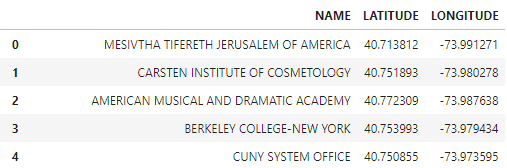
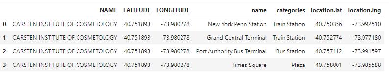

# Top venues around NYC's universities

## 1.Business Problem

The idea from this project is to help who want to gain benefits from the trending venues around to the universities of the New York City such as student's services stores owners who want to open their stores near to places visible and known by providing a clear understanding of the trending places around the top universities and academies in New York City and clustering them based on their common characteristics and that will help them in making their decision.

## 2.Data acquisition and cleaning

Firstly, I use data of the universities and academies in New York City that contain a lot of information about them such as their names, longitude, latitude, zip code and so on from <a href='https://hifld-geoplatform.opendata.arcgis.com/'>Homeland Infrastructure Foundation-Level Data (HIFLD)</a>, but from this dataset, I will need just the university name and latitude and longitude so, I will drop the other columns, and the dataset will become like this:



And, I represent them on the map using folium library 


Secondly, I will use the Foursquare Website to extract the trending venues around the 30 from the universities and academies with the help of the previously modified dataset of New York universities using the following code for each university to extract the trending venues:


```python
    url = 'https://api.foursquare.com/v2/venues/trending?client_id={}&client_secret={}&ll={},{}&v={}&radius={}&limit={}'.format(CLIENT_ID, CLIENT_SECRET,NY_uni['LATITUDE'][1],NY_uni['LONGITUDE'][1], VERSION, RADIUS, LIMIT)

    #url = 'https://api.foursquare.com/v2/venues/trending?client_id={}&client_secret={}&ll={},{}&v={}'.format(CLIENT_ID, CLIENT_SECRET,, VERSION)
    results = requests.get(url).json()
    if len(results['response']['venues']) == 0:
        trending_venues_df = 'No trending venues are available at the moment!'
    else:
        trending_venues = results['response']['venues']
        trending_venues_df = json_normalize(trending_venues)
        
        # filter columns
        columns_filtered = ['name', 'categories'] + ['location.distance', 'location.city', 'location.postalCode', 'location.state', 'location.country', 'location.lat', 'location.lng']
        carsten_df = trending_venues_df.loc[:, columns_filtered]
        
        # filter the category for each row
        carsten_df['categories'] = trending_venues_df.apply(get_category_type, axis=1)
```

Then I combined them together to create a new dataset for doing the necessary analysis, and the new combined dataset that contains the university name, its longitude, and latitude from the first dataset and the list of the names of the trending venues around the university, their latitudes, their longitudes, and their categories. And the resulting dataframe is look like this:





```python

```
