<h1 align=center> Top venues around NYC's universities </h1>
<h3 align=center> Hanan Asiri</h3>
<h3 align=center> 2/24/2020 </h3>
<h3 align=center>  </h3>

## 1.Introduction

### 1.1 Business Problem

The idea from this project is to help who want to gain benefits from the trending venues around to the universities of the New York City such as student's services stores owners who want to open their stores near to places visible and known by providing a clear understanding of the trending places around the top universities and academies in New York City and clustering them based on their common characteristics and that will help them in making their decision.

### 1.2 Interest

The targeted audience of this project are those who want to make a business targeting the students, such as students' services stores, coffee shops dedicated to the study and so on, and want to open their business in places known and visible by the students and obtain a competitive advantage.

## 2.Data acquisition and cleaning

Firstly, I use data of the universities and academies in New York City that contain a lot of information about them such as their names, longitude, latitude, zip code and so on from <a href='https://hifld-geoplatform.opendata.arcgis.com/'>Homeland Infrastructure Foundation-Level Data (HIFLD)</a>, but from this dataset, I will need just the university name and latitude and longitude so, I will drop the other columns, and the dataset will become like this:

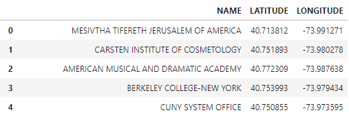

Secondly, I will use the Foursquare Website to extract the trending venues around the 30 from the universities and academies with the help of the previously modified dataset of New York universities using the following code for each university to extract the trending venues:


```python
    url = 'https://api.foursquare.com/v2/venues/trending?client_id={}&client_secret={}&ll={},{}&v={}&radius={}&limit={}'.format(CLIENT_ID, CLIENT_SECRET,NY_uni['LATITUDE'][1],NY_uni['LONGITUDE'][1], VERSION, RADIUS, LIMIT)

    #url = 'https://api.foursquare.com/v2/venues/trending?client_id={}&client_secret={}&ll={},{}&v={}'.format(CLIENT_ID, CLIENT_SECRET,, VERSION)
    results = requests.get(url).json()
    if len(results['response']['venues']) == 0:
        trending_venues_df = 'No trending venues are available at the moment!'
    else:
        trending_venues = results['response']['venues']
        trending_venues_df = json_normalize(trending_venues)
        
        # filter columns
        columns_filtered = ['name', 'categories'] + ['location.distance', 'location.city', 'location.postalCode', 'location.state', 'location.country', 'location.lat', 'location.lng']
        carsten_df = trending_venues_df.loc[:, columns_filtered]
        
        # filter the category for each row
        carsten_df['categories'] = trending_venues_df.apply(get_category_type, axis=1)
```

Then I combined them together to create a new dataset for doing the necessary analysis, and the new combined dataset that contains the university name, its longitude, and latitude from the first dataset and the list of the names of the trending venues around the university, their latitudes, their longitudes, and their categories. And the resulting dataframe is look like this:


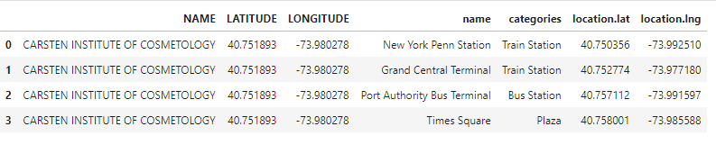

## 3.Methodology 

### 3.1 Exploratory Data Analysis

Visualizing the universities and academies of NYC using folium library

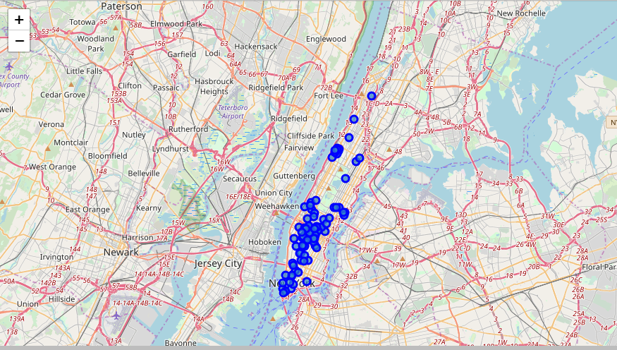

Checking for the number of the categories

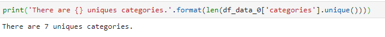

And now checking for the type of categories of the venues around the universities and how many venues in each category 

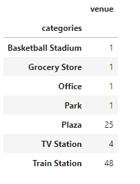

Representing that using bar chart

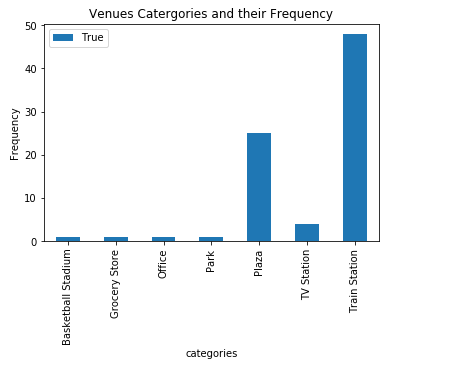

And the pie chart to represent the categories of the venues by percentages

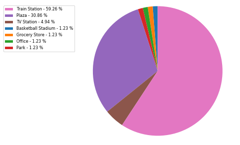

Grouping the rows by university and by taking the mean of the frequency of occurrence of each category

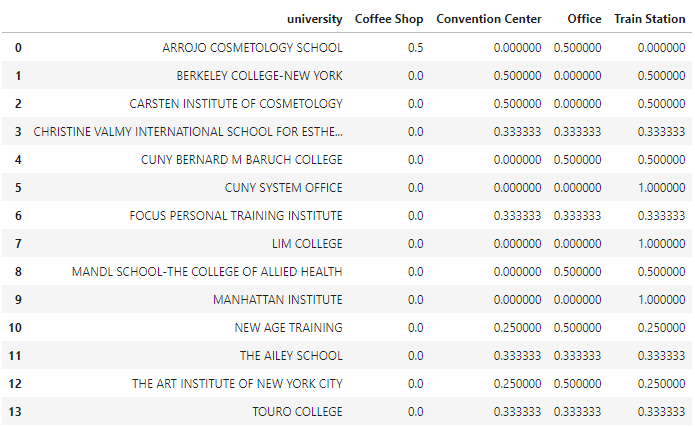

printing each university along with the top 3 most common venues

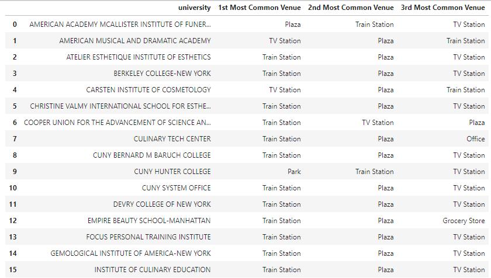

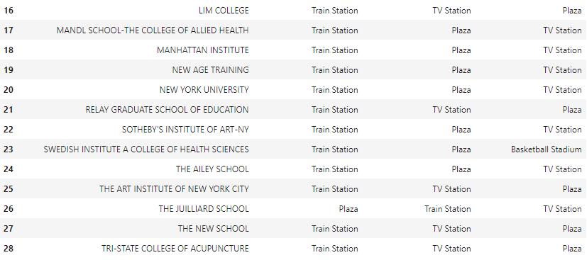

### 3.2 Clustering The Universities Using K-mean Algorithm 

Using elbow method to represent the optimal number of clusters which is 4 according to this plot:

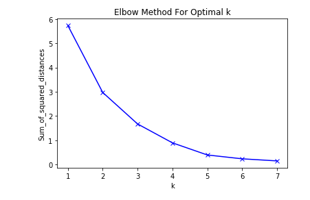

Clustering the universities based on the common characteristics of trending venues around them:

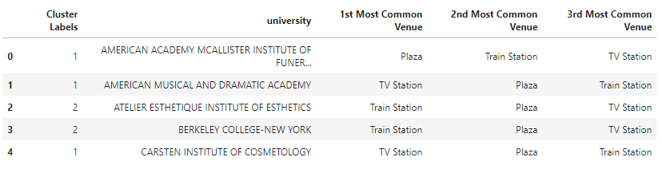

representing these four clusters on the map: 

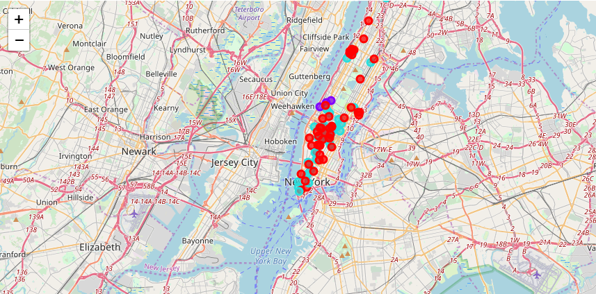

## 4.Result and Discussion 

To solve this problem and take a good view of the top venues around the universities in New York City I collected data from the  Homeland Infrastructure Foundation-Level Data (HIFLD) website about the universities in New York City and data from the Foursquare website about the trending venues around each university and I found that:
<ul> 
    <li>  There are 7 distinct categories of the trending venues: train station, plazas, TV station, park, office, grocery store, basketball stadium</li>
    <li> The most frequent venues around the universities are the train stations then the the plazas</li>
    <li> The least frequent trending venues around the universities are  office, grocery store, basketball stadium </li>
</ul>
Using the provided result and observations the business owner can decide what she/he opens near to the university and provide and how find opportunities there and help then in making the right decision.    

## 5.conclusion

Finally, at the end of the project, I learned a lot about the data science projects, how to get the data from different resources and clean them and clean them and combine then, in this project I combine the data from the website and the Foursquare website,  and how to analyze the data and visualize it using different plots and on the maps using folium library, and how to apply the cluster the universities based on the common characteristics of their trending venues.
